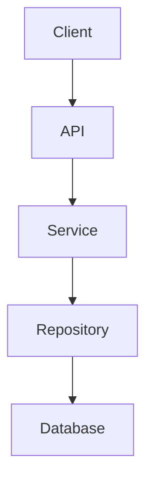

[下一篇：01-简单框架-系统骨架](01-简单框架-系统骨架.md) · [总目录](README.md)

# 文档风格指南

> **场景**：本文档定义本系列文档的写作规范和源码定位规则。
> **时间**：2026-08-27 (CST)
> **版本**：Crush @ main branch, Go 1.26.6
> **阅读说明**：所有参与本系列文档写作和阅读的人都应先阅读本文。

## 本文件内容

1. [文档定位与目标](#1-文档定位与目标)
2. [四层推进规则](#2-四层推进规则)
3. [源码定位规范](#3-源码定位规范)
4. [调用关系标注](#4-调用关系标注)
5. [图表规范](#5-图表规范)
6. [禁止事项](#6-禁止事项)

## 1. 文档定位与目标

本系列文档目标是：

- **新手可读**：从未接触过 Crush 的人能看懂
- **源码可定位**：每个结论都能在源码中找到对应位置
- **开发者可复现**：读者可以依据文档重新实现类似系统
- **能够指导 Re-implement**：覆盖全部核心逻辑

## 2. 四层推进规则

| 层级 | 文件 | 目标 |
|------|------|------|
| 第一层 | `01-简单框架-系统骨架.md` | 读者能回答"项目做什么、由什么组成、请求怎么走" |
| 第二层 | `02-简单例子-全路径走读.md` | 读者能跟随一个真实场景走完全路径 |
| 第三层 | `03-详细逐步说明-主链路拆解.md` | 读者能理解每一跳的参数、返回值、状态变化 |
| 第四层 | `04` ~ `18` | 读者能理解所有模块、分支、配置、并发等细节 |

**严格规则：**

- 不得在第一层提前展开第四层细节
- 不得在第二层展开异常和边界处理
- 第三层基于第二层的完整链路逐跳展开
- 第四层最后补齐所有剩余源码逻辑

## 3. 源码定位规范

### 3.1 核心原则

```
真实文件 + 稳定符号 + 函数/类型名称 + 函数内相对偏移
```

**禁止只使用绝对文件行号作为源码依据。**

### 3.2 函数内部代码

使用"文件路径 + 函数名 + 函数内相对行偏移"：

```
internal/agent/agent.go
函数：Run
偏移：+3 ～ +18 行
```

- `+0` 表示函数定义所在行
- `+1` 表示函数定义下一行
- 以函数起始行为基准计算相对偏移

### 3.3 非函数代码

使用稳定的代码结构定位：

```
internal/config/config.go
Struct：ProviderConfig
字段：BaseURL
```

或：

```
internal/agent/agent.go
Const：DefaultSessionName
```

或：

```
internal/agent/tools/tools.go
Type：sessionIDContextKey
```

### 3.4 类型 / Trait / impl

```
internal/agent/coordinator.go
Interface：Coordinator
方法：Run
```

```
internal/agent/agent.go
Struct：sessionAgent
字段：largeModel
```

### 3.5 第三方依赖

```
charm.land/fantasy
Package：fantasy
Type：AgentResult
```

如果需要定位具体函数：

```
依赖：charm.land/fantasy v0.41.2
函数：Agent.Run
偏移：+N
```

## 4. 调用关系标注

调用关系必须同时标明调用双方：

```
internal/app/app.go
函数：RunNonInteractive
    ↓
调用
    ↓
internal/agent/coordinator.go
Interface：Coordinator
方法：Run
```

如果需要定位具体调用语句：

```
internal/app/app.go
函数：RunNonInteractive
调用偏移：+93
    ↓
internal/agent/coordinator.go
Interface：Coordinator
方法：Run
```

## 5. 图表规范

### ASCII 图

用于：

- 端到端流程
- 网络协议
- 请求 / 响应
- 数据流

```text
Client
  │
  │ Step 1
  ▼
API
  │
  │ Step 2
  ▼
Service
  │
  ├────→ Cache
  │
  └────→ Database
  │
  ▼
Response
```

### Mermaid 图

用于：

- 系统架构
- 模块关系
- 调用关系
- 时序
- 状态机
- Struct / Interface 关系



**ASCII 负责阅读流程，Mermaid 负责表达代码关系，不要混用。**

## 6. 禁止事项

- 空泛描述
- 伪造源码
- 臆测不存在的逻辑
- 大量复制源码（只摘录关键片段）
- "同上"
- "略"
- "以此类推"
- 只使用绝对文件行号作为源码依据

如果源码无法证明某个结论，明确写：

> 当前源码无法确定。

---

[下一篇：01-简单框架-系统骨架](01-简单框架-系统骨架.md) · [总目录](README.md)