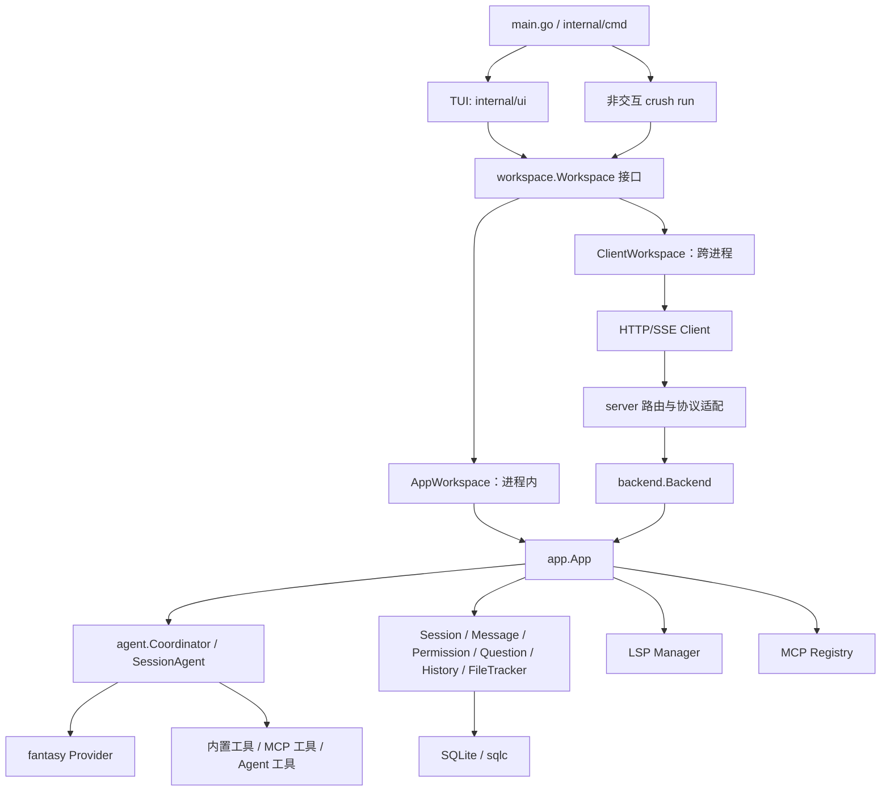

# 01. 全局架构

## 1. 分层视图



这张图最关键的点是：本地模式和 Client/Server 模式不是两套业务实现。它们通过 `workspace.Workspace` 给 TUI 提供相同能力，最终复用 `app.App` 和它内部的领域服务。

## 2. 核心资源边界

### 2.1 进程

`main.go` 只负责进程级功能：读取 `CRUSH_PROFILE` 决定是否开 pprof，然后调用 `cmd.Execute()`。信号处理、版本输出和 Cobra 命令执行由 `fang.Execute` 包装。

### 2.2 Workspace

一个 Workspace 绑定：

- 规范化后的工作目录；
- 合并完成的 `ConfigStore`；
- 数据目录及 SQLite 连接；
- Session/Message 等服务；
- 一个 Coordinator；
- LSP Manager；
- 已发现的 Skills 快照；
- MCP 初始化结果；
- 生命周期 Context 和清理函数。

本地模式通常一个进程只托管一个 Workspace。Server 模式由 `backend.Backend` 同时管理多个 Workspace，并按真实路径去重。

### 2.3 Session

Session 是用户对话边界。它保存标题、父子关系、Token/成本统计等元数据。一个 Session 同时也是 Agent 并发控制的 key：同 Session 的运行会排队，不同 Session 可以并发。

子 Agent 会创建子 Session；Agent 工具的内部 Session ID 使用可解析格式与父消息、工具调用关联，UI 和继续会话逻辑会拒绝把这类内部 Session 当普通会话打开。

### 2.4 Run

Run 是一次用户提示触发的顶层 Agent turn。Client/Server 异步派发时使用 `RunID` 关联开始与最终 `RunComplete`。`RunComplete` 采用 must-deliver 事件路径，避免普通通知在缓冲区满时被丢弃导致非交互客户端永久等待。

## 3. 两种运行形态

### 3.1 本地模式

默认路径：

```text
root command
  -> setupLocalWorkspace
  -> config.Init / db.Connect / skills discovery
  -> app.New
  -> workspace.NewAppWorkspace
  -> ui.New
  -> tea.Program.Run
```

优点是调用简单、事件直接在进程内传递。`AppWorkspace` 主要是把 `app.App` 的多个服务整理成 UI 需要的统一接口。

### 3.2 Client/Server 模式

环境变量 `CRUSH_CLIENT_SERVER` 为真时启用：

```text
UI -> ClientWorkspace -> client.Client -> Unix socket / Windows named pipe
   -> server.Server -> backend.Backend -> backend.Workspace -> app.App
```

Server 层只做 HTTP、SSE、参数与错误映射；Backend 承担真正的 Workspace 创建、去重、客户端声明、宽限期、空闲关闭和业务委托。ClientWorkspace 在本地维护远端状态缓存，将 SSE 事件还原成 UI 能消费的 `tea.Msg`。

## 4. 依赖方向

较稳定的依赖方向是：

```text
cmd/ui -> workspace -> app 或 client
server -> backend -> app
app -> agent + domain services
agent -> config + message/session + tools + provider abstraction
domain services -> db/pubsub
```

`proto` 由 client、server、backend、workspace 共同使用，专门承载跨边界 DTO。UI 不应直接依赖 HTTP 路由，Agent 也不应直接依赖 TUI。

## 5. 生命周期与关闭顺序

生命周期是本项目最值得注意的设计点之一：

1. 创建 Workspace Context；
2. 初始化配置、DB、Skills、App、MCP、Agent 与 LSP；
3. Agent Run 绑定 Workspace Context，而不是 HTTP 请求 Context；
4. 关闭时先标记 Workspace closing，拒绝新 Run；
5. 取消 Workspace Context，再 `CancelAll`；
6. 等待已派发 Agent goroutine；
7. 最后关闭 LSP、MCP、事件 Broker 和 DB。

这个顺序防止 Agent goroutine 在数据库已经关闭后仍尝试写入消息。

Server 模式还维护客户端 claim：创建后有 attach 宽限期，SSE 短暂断线有 detach 宽限期，最后一个 Workspace 释放后有 idle shutdown 延迟。相关锁顺序在 `backend.Backend` 注释中被明确规定：同时需要 `Backend.mu` 与 `Workspace.clientsMu` 时先拿前者，避免 AB/BA 死锁。

## 6. 事件体系

`internal/pubsub.Broker[T]` 是泛型进程内总线。普通 `Publish` 偏向不阻塞生产者，允许慢订阅者丢事件；`PublishMustDeliver` 用于权限请求、问题请求、RunComplete 等不能静默丢失的控制事件。

`app.App.setupEvents()` 将 Session、Message、Permission、Question、Agent notification、RunComplete 等多个源扇入统一 `tea.Msg` 事件流。本地 UI 直接订阅；Server 将其编码为 SSE；ClientWorkspace 再解码并发布给 UI。因此事件 DTO 和领域对象的变化通常需要检查本地与远程两条路径。

## 7. 生成代码边界

- `internal/db/*.sql.go`、`querier.go` 来自 `internal/db/sql/*.sql` 的 sqlc 生成结果；应修改 SQL 源和迁移，而不是直接手改生成文件。
- `internal/swagger/docs.go`、`swagger.json`、`swagger.yaml` 是 API 描述产物；路由和注释才是行为来源。
- 各平台 `_windows.go`、`_unix.go`、`_darwin.go`、`_other.go` 由 Go build tags/文件后缀选择，阅读跨平台行为时要成组查看。
