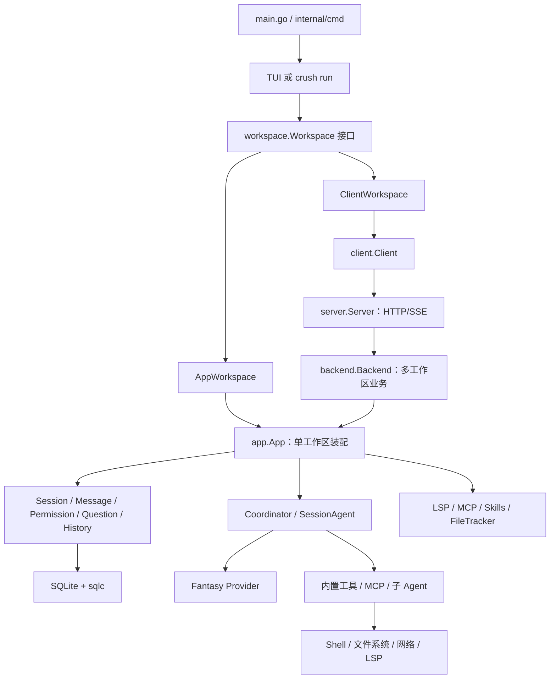
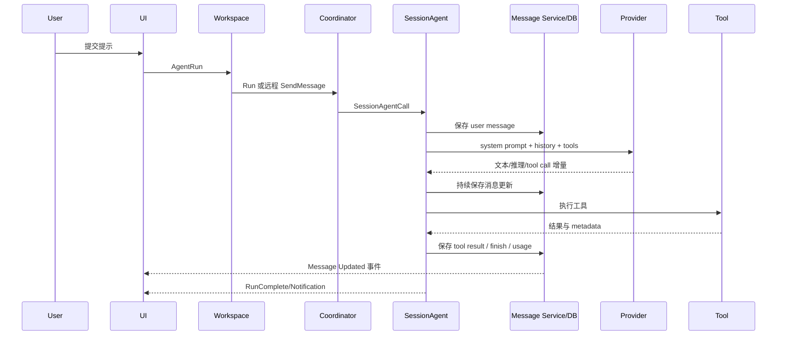

# 01. 系统总览：Crush 到底是什么

> 状态：待复核生成稿｜生成日期：2026-08-14
> 基准提交：`5712d4839a6a10e9940804d511bb322dbe73a511`｜工作区：clean（开始分析时）
> 源码范围：`main.go`、`internal/cmd/`、`app/`、`workspace/`、`backend/`、`agent/`
> 生成方式：源码、测试、配置与部署资产静态分析

## 快速摘要

### 架构总览（模块与依赖）
CLI 选择本地 App 或远程 Backend；Workspace 统一前端契约，Coordinator 与 SessionAgent 实现核心 Agent，领域服务和基础设施承担状态与副作用。

### 核心调用序列（逐步逻辑）
1. `main` 进入 Cobra。2. CLI 创建 Workspace 并启动 TUI/Run。3. 提示经 Agent、工具与消息服务到达数据库和事件订阅者。

### 易错点与边界条件
App 与 Backend 生命周期不同；Session 与 Run 不是同一层；普通事件允许丢弃，关键交互和终态需要可靠投递。

## 1. 一句话定义

Crush 是一个以 Workspace 为资源边界、以 Session 为对话边界、由 Coordinator 装配模型和工具、由 SessionAgent 执行模型循环，并通过统一 Workspace 接口同时服务本地 TUI 和远程 Client/Server 的终端 AI 编程助手。

这句话包含五个核心概念：

- Workspace 决定“在哪个项目工作”；
- Session 决定“哪段对话历史属于一起”；
- Coordinator 决定“使用哪个模型、系统提示和工具”；
- SessionAgent 决定“如何运行一轮对话并保存过程”；
- Workspace 接口隔离前端与本地/远程实现。

## 2. 分层架构



### 为什么有这么多层

如果 TUI 直接调用 Agent 和 DB，本地实现会很简单，但一旦引入独立 Server，就必须复制所有业务。Crush 用 Workspace 接口隔离前端，用 Backend 隔离协议，用 App 统一单工作区服务，使两种运行形态最终共享同一 Agent 和领域逻辑。

## 3. 两种运行形态

### 本地进程内模式

默认模式下，CLI 在当前进程加载配置、连接 SQLite、发现 Skills、构造 App 和 Agent，再把 `AppWorkspace` 交给 TUI。

```text
main
 -> cmd.Execute
 -> setupLocalWorkspace
 -> config.Init
 -> db.Connect
 -> skills.DiscoverFromConfig
 -> app.New
 -> workspace.NewAppWorkspace
 -> ui.New
 -> tea.Program.Run
```

领域事件直接从 `app.events` 送给 Bubble Tea Program。

### Client/Server 模式

启用 `CRUSH_CLIENT_SERVER` 后，TUI 进程只持有 ClientWorkspace。独立 Server 进程管理真实 App：

```text
TUI
 -> ClientWorkspace
 -> client.Client
 -> Unix socket / Windows named pipe
 -> server.Server
 -> backend.Backend
 -> backend.Workspace
 -> app.App
```

同步调用走 HTTP，请求后的持续状态变化走 SSE。ClientWorkspace 把 Proto DTO 转回领域对象或 `tea.Msg`，所以 TUI 不需要知道远程模式的协议细节。

## 4. 主要资源边界

### Process

进程级资源包括命令行、信号、日志默认值、可选 pprof、Server listener，以及某些全局注册表。进程关闭不等同于单 Workspace 关闭。

### Backend

仅远程模式存在。一个 Backend 可管理多个路径不同的 Workspace；相同规范化路径会去重并共享。Backend 还管理客户端 claim、SSE attach/detach、关闭宽限和 idle shutdown。

### Workspace

每个 Workspace 绑定：

- 工作目录与规范化路径；
- ConfigStore 和运行时 Overrides；
- 数据目录与 SQLite 引用；
- App 内的领域 Services；
- Coordinator、LSP Manager、Skills Manager；
- MCP 配置与工具；
- Workspace Context 和清理函数。

### Session

Session 是对话与并发调度 key。同一 Session 同时只能有一个 active Run，后续提示进入队列；不同 Session 可并行。Session 还有父子关系，子 Agent 的内部会话不会被当作普通顶层会话继续。

### Run

Run 是一次顶层提示的完整生命周期：接受、排队或运行、保存用户消息、模型流、工具调用、保存 assistant parts、更新 usage、发布 RunComplete。远程非交互调用用 RunID 关联最终完成。

## 5. 核心数据流



UI 渲染的权威状态主要来自 Message Service 的领域事件，而不是直接消费 Provider 原始 stream。这一点使历史恢复、本地与远程模式以及多个观察者保持一致。

## 6. 核心依赖方向

```text
cmd/ui -> workspace -> app 或 client
server -> backend -> app
app -> agent + 领域服务 + 基础设施
agent -> config + session/message + tools + fantasy
领域服务 -> db + pubsub
tools -> permission/hooks/shell/lsp/mcp/filesystem
```

希望重写时应保持这个方向。反向依赖的典型坏例子是让 Agent import TUI，或让 Session Service 知道 HTTP DTO。

## 7. App 是 Composition Root

`app.New` 不实现大量业务算法，它负责把对象接起来：

1. 从 DB 构建 Querier；
2. 创建 Session、Message、History、Permission、Question、FileTracker；
3. 创建 LSP Manager，持有外部传入的 Skills Manager；
4. 创建统一事件 Broker，并把各 Service 事件扇入；
5. 异步初始化 MCP、更新检查和 herdr bridge；
6. 配置存在时初始化 coder Coordinator；
7. 注册 LSP 状态/诊断回调；
8. 记录 DB、MCP 等 cleanup。

理解 App 的最好方式不是把它看作“上帝对象”，而是把它看作一个单 Workspace 的依赖注入和生命周期容器。

## 8. 事件为什么如此重要

领域服务既返回同步结果，也发布事件：

- Session/Message 的 Created、Updated、Deleted；
- Permission/Question 的请求与解决通知；
- Agent notification 与可靠 RunComplete；
- LSP/MCP/Skills 状态变化；
- ConfigChanged 与 UpdateAvailable。

App 将这些来源扇入 `Broker[tea.Msg]`。本地 UI 直接订阅；Server 编码成 SSE；ClientWorkspace 解码后再交给 UI。

普通 Publish 偏向不阻塞生产者，允许慢订阅者丢更新；Permission、Question、RunComplete 等控制信号使用 must-deliver 语义。重写时必须先区分“可由下次全量刷新恢复的状态事件”和“丢失会导致永远等待的终止事件”。

## 9. 生成代码边界

- `internal/db/*.sql.go` 和 `querier.go` 来自 sqlc；修改源应去 `internal/db/sql/*.sql` 和 migrations。
- `internal/swagger/docs.go`、JSON、YAML 是 API 文档产物；真实行为由 route handler 和 Backend 决定。
- `_windows.go`、`_unix.go`、`_darwin.go`、`_other.go` 是平台实现集合，要成组阅读。
- 测试辅助包如 `agenttest` 不进入生产调用链，但展示接口最小替身。

## 10. 如果只记住十条规则

1. Workspace 是资源和生命周期边界。
2. Session 是对话和 Agent 串行调度边界。
3. TUI 只依赖 Workspace 接口。
4. Server 只适配协议，Backend 才做远程业务。
5. App 是单 Workspace 的装配中心。
6. Coordinator 负责装配，SessionAgent 负责执行。
7. Message/Session 数据库与事件是 UI 状态事实来源。
8. 工具执行前经过 Hook 和 Permission。
9. 关闭时必须先取消/等待 Run，再关闭 DB/MCP/LSP。
10. 可靠终止信号和普通展示事件不能混为一谈。

## 11. 阅读源码建议顺序

`main.go` → `internal/cmd/root.go` → `internal/app/app.go` →
`internal/workspace/workspace.go` → `internal/agent/coordinator.go` →
`internal/agent/agent.go` → `internal/message/message.go`。

## 12. 重新实现检查清单

- [ ] 为 Process、Workspace、Session 和 Run 定义独立生命周期。
- [ ] 让 UI 只依赖 Workspace 契约，不感知本地/远程分支。
- [ ] 分离工作区级装配与会话级模型循环。
- [ ] 把权威持久状态与可恢复的展示事件分开。
- [ ] 为 Hook、Permission、工具副作用和终态事件定义固定顺序。
- [ ] 以正常、失败、取消、重连和关闭路径证明边界成立。
