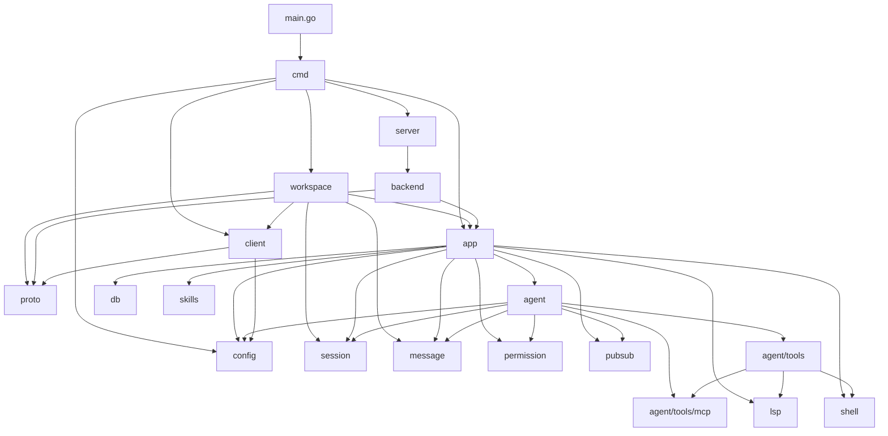

[上一篇：00-文档风格指南](00-docs-style-guide.md) · [总目录](README.md) · [下一篇：02-简单例子-全路径走读](02-简单例子-全路径走读.md)

# 系统骨架：Crush 是什么，由什么组成，请求怎么走

> **场景**：第一次接触 Crush，需要理解项目整体架构。
> **时间**：2026-08-27 (CST)
> **版本**：Crush @ main branch, Go 1.26.6
> **阅读说明**：本文以当前源码为准，只描述系统骨架，不展开内部实现细节。

## 本文件内容

1. [Crush 是什么](#1-crush-是什么)
2. [进程模型](#2-进程模型)
3. [核心模块与职责](#3-核心模块与职责)
4. [模块依赖关系](#4-模块依赖关系)
5. [输入与输出](#5-输入与输出)
6. [主数据流](#6-主数据流)

## 1. Crush 是什么

Crush 是 Charmbracelet 开发的**终端优先 AI 编程助手**。它运行在终端中，连接用户选择的 LLM（Anthropic、OpenAI、Google Gemini、Bedrock 等），通过交互式对话帮助用户完成编程任务。

核心能力：

- **多模型支持**：可连接多种 LLM 提供商，会话中途可切换模型
- **工具系统**：内置 Bash、文件编辑、查看、搜索、Grep、Glob、Web Fetch 等工具
- **LSP 集成**：利用语言服务器获取代码上下文
- **MCP 支持**：通过 Model Context Protocol 扩展能力
- **Session 管理**：多会话、多上下文，支持会话恢复
- **Skills 系统**：可扩展的技能包机制
- **客户端/服务器架构**：支持本地和远程两种运行模式

**项目入口：**

```
main.go
函数：main
偏移：+0 ～ +11
```

`main` 函数调用 `cmd.Execute()` 启动整个应用。

## 2. 进程模型

Crush 有两种运行模式，决定了进程拓扑：

### 2.1 本地模式（默认）

单个进程包含所有功能：

```text
┌─────────────────────────────────────────────┐
│                 crush 进程                    │
│                                              │
│  ┌──────┐  ┌─────────┐  ┌────────────────┐  │
│  │ TUI  │←→│   App   │←→│ Agent + Tools  │  │
│  │      │  │         │  │                │  │
│  │ Bubble│  │ Config  │  │ LLM Providers  │  │
│  │ Tea  │  │ DB      │  │ LSP / MCP      │  │
│  │      │  │ Session  │  │ Shell          │  │
│  └──────┘  └─────────┘  └────────────────┘  │
│                                              │
│              SQLite (本地文件)                │
└─────────────────────────────────────────────┘
```

### 2.2 客户端/服务器模式

设置 `CRUSH_CLIENT_SERVER=1` 环境变量启用。两个进程通过 Unix Socket / Named Pipe / TCP 通信：

```text
┌──────────────┐       Unix Socket / TCP       ┌──────────────────────┐
│  crush 客户端 │ ←──────────────────────────→ │   crush 服务器进程    │
│              │       HTTP + SSE              │                      │
│  ┌──────┐    │                               │  ┌───────────────┐   │
│  │ TUI  │    │                               │  │   Backend     │   │
│  │      │    │                               │  │   App         │   │
│  │ Bubble│   │                               │  │   Agent       │   │
│  │ Tea  │    │                               │  │   LLM / LSP   │   │
│  └──────┘    │                               │  │   MCP / Shell │   │
│  Client      │                               │  │   SQLite      │   │
│  Workspace   │                               │  └───────────────┘   │
└──────────────┘                               └──────────────────────┘
```

客户端通过 HTTP API 与服务器通信，事件通过 SSE（Server-Sent Events）流回。

**模式判断：**

```
internal/cmd/root.go
函数：useClientServer
偏移：+0 ～ +3
```

读取 `CRUSH_CLIENT_SERVER` 环境变量决定是否启用客户端/服务器模式。

## 3. 核心模块与职责

以下是 Crush 的主要包及其职责，按功能层次组织：

### 3.1 入口层

| 包 | 路径 | 职责 |
|---|---|---|
| `main` | `main.go` | 程序入口，调用 `cmd.Execute()` |
| `cmd` | `internal/cmd/` | CLI 命令定义（root、run、server、logs 等） |

### 3.2 工作区层

| 包 | 路径 | 职责 |
|---|---|---|
| `workspace` | `internal/workspace/` | 定义 `Workspace` 接口，统一本地和远程两种模式 |
| `app` | `internal/app/` | 应用编排器，组装所有服务，管理生命周期 |
| `backend` | `internal/backend/` | 服务器端业务逻辑，管理 workspace，委托给 `app` |
| `server` | `internal/server/` | HTTP 服务器，监听 Unix Socket / Named Pipe / TCP |
| `client` | `internal/client/` | HTTP 客户端，与服务器通信 |

### 3.3 Agent 层

| 包 | 路径 | 职责 |
|---|---|---|
| `agent` | `internal/agent/` | 核心 Agent 编排：会话管理、模型选择、工具调度 |
| `agent/tools` | `internal/agent/tools/` | 内置工具实现（bash、edit、view、write、glob、grep 等） |
| `agent/tools/mcp` | `internal/agent/tools/mcp/` | MCP 协议实现 |
| `agent/notify` | `internal/agent/notify/` | Agent 通知事件 |
| `agent/prompt` | `internal/agent/prompt/` | 提示词构建 |
| `agent/hyper` | `internal/agent/hyper/` | Charm Hyper 提供商适配 |

### 3.4 服务层

| 包 | 路径 | 职责 |
|---|---|---|
| `session` | `internal/session/` | 会话 CRUD，状态管理 |
| `message` | `internal/message/` | 消息存储，流式更新 |
| `history` | `internal/history/` | 文件变更历史 |
| `filetracker` | `internal/filetracker/` | 文件读取追踪 |
| `permission` | `internal/permission/` | 工具执行权限管理 |
| `question` | `internal/question/` | Agent 向用户提问的机制 |
| `skills` | `internal/skills/` | Agent Skills 发现和管理 |

### 3.5 基础设施层

| 包 | 路径 | 职责 |
|---|---|---|
| `config` | `internal/config/` | 配置加载、解析、热重载（crush.json / crushrc） |
| `db` | `internal/db/` | SQLite 数据库连接和查询 |
| `lsp` | `internal/lsp/` | LSP 客户端管理器，启停语言服务器 |
| `shell` | `internal/shell/` | 内置 Shell 执行引擎（mvdan.cc/sh） |
| `shellconfig` | `internal/shellconfig/` | crushrc（Bash 风格配置）解析 |
| `pubsub` | `internal/pubsub/` | 进程内事件发布/订阅 Broker |
| `event` | `internal/event/` | 匿名使用指标收集 |
| `log` | `internal/log/` | 日志设置 |
| `lock` | `internal/lock/` | 文件锁 |
| `version` | `internal/version/` | 版本信息 |
| `update` | `internal/update/` | 版本更新检查 |

### 3.6 UI 层

| 包 | 路径 | 职责 |
|---|---|---|
| `ui/model` | `internal/ui/model/` | TUI 主模型（Bubble Tea） |
| `ui/chat` | `internal/ui/chat/` | 聊天视图渲染 |
| `ui/dialog` | `internal/ui/dialog/` | 对话框（权限、会话、模型选择等） |
| `ui/common` | `internal/ui/common/` | 通用 UI 组件 |
| `ui/styles` | `internal/ui/styles/` | 主题和样式 |
| `ui/completions` | `internal/ui/completions/` | 输入补全 |
| `ui/diffview` | `internal/ui/diffview/` | Diff 展示视图 |

### 3.7 协议与外部交互

| 包 | 路径 | 职责 |
|---|---|---|
| `proto` | `internal/proto/` | API 协议类型定义 |
| `oauth` | `internal/oauth/` | OAuth 认证（Hyper、Copilot、MCP） |
| `discover` | `internal/discover/` | 本地模型自动发现（Ollama、llama.cpp 等） |
| `hooks` | `internal/hooks/` | 生命周期 Hook 支持 |
| `herdr` | `internal/herdr/` | herdr 终端多路复用器集成 |

## 4. 模块依赖关系

以下用 Mermaid 图展示主要模块的依赖关系（箭头表示"依赖于"）：



**关键依赖路径：**

1. `cmd` → `workspace` → `app` → `agent` → `tools`：命令行到工具执行的完整链
2. `cmd` → `server` → `backend` → `app`：服务器模式的请求链
3. `cmd` → `client` → `proto`：客户端模式的请求链
4. `app` → `pubsub` → `ui`：事件从服务层流向 TUI

## 5. 输入与输出

### 5.1 输入

| 输入类型 | 来源 | 说明 |
|---------|------|------|
| 用户输入 | 终端 TUI | 用户在聊天输入框输入的 prompt |
| 命令行参数 | CLI flags | `--cwd`、`--debug`、`--yolo`、`--model` 等 |
| 标准输入 | stdin pipe | `crush run "prompt"` 时管道输入 |
| 配置文件 | crush.json / crushrc | 提供商、模型、MCP、LSP、权限等配置 |
| 环境变量 | OS env | API Key、CRUSH_CLIENT_SERVER 等 |
| LLM 响应 | LLM API | 流式文本响应和工具调用请求 |

### 5.2 输出

| 输出类型 | 目标 | 说明 |
|---------|------|------|
| TUI 渲染 | 终端 | 聊天消息、工具结果、Diff 视图等 |
| 标准输出 | stdout | `crush run` 模式的文本输出 |
| 文件修改 | 文件系统 | 通过 edit / write 工具修改的文件 |
| Shell 执行 | 子进程 | 通过 bash 工具执行的命令 |
| 数据库写入 | SQLite | 会话、消息、文件历史持久化 |
| 通知 | 桌面通知 / 终端 Bell | 权限请求、Agent 完成通知 |
| 使用指标 | PostHog | 匿名使用数据（可禁用） |

## 6. 主数据流

以下是 Crush 最核心的数据流——用户在交互式 TUI 中发送一条消息并收到回复：

```text
用户在 TUI 输入 "帮我写一个函数"
  │
  ▼
┌─────────────────┐
│  TUI (Bubble Tea)│  ui/model/chat.go
│  接收键盘输入     │
└────────┬────────┘
         │
         ▼
┌─────────────────┐
│  Workspace       │  workspace.Workspace 接口
│  AgentRun()     │
└────────┬────────┘
         │
         ▼
┌─────────────────┐
│  App             │  app.App
│  编排服务         │
└────────┬────────┘
         │
         ▼
┌─────────────────┐
│  Agent           │  agent.Coordinator
│  Coordinator     │
│  Run()           │
└────────┬────────┘
         │
         ▼
┌─────────────────┐
│  sessionAgent    │  agent.sessionAgent
│  Run()           │
│  构建 LLM 请求    │
└────────┬────────┘
         │
         ├──────────────────────────┐
         │                          │
         ▼                          ▼
┌─────────────────┐        ┌───────────────┐
│  LLM Provider    │        │  Tools        │
│  (Anthropic/     │        │  (bash/edit/  │
│   OpenAI/...)    │        │   view/...)   │
│  流式响应         │        │               │
└────────┬────────┘        └───────┬───────┘
         │                          │
         │  工具调用请求              │ 工具执行结果
         │←─────────────────────────┘
         │
         ▼
┌─────────────────┐
│  Message Service │  message.Service
│  存储消息         │  → SQLite
│  发布事件         │  → PubSub
└────────┬────────┘
         │
         ▼
┌─────────────────┐
│  PubSub Broker   │  pubsub.Broker
│  事件分发         │
└────────┬────────┘
         │
         ▼
┌─────────────────┐
│  TUI             │  ui/model/chat.go
│  渲染响应         │
└─────────────────┘
```

**数据流关键节点：**

1. **用户输入 → Workspace**：TUI 调用 `Workspace.AgentRun(ctx, sessionID, prompt)`
2. **Workspace → Agent**：Workspace 调用 `Coordinator.Run(ctx, sessionID, prompt)`
3. **Agent → LLM**：sessionAgent 构建请求发送给 LLM Provider
4. **LLM → Tools**：如果 LLM 返回工具调用请求，Agent 执行对应工具
5. **Tools → Agent**：工具结果返回给 Agent，Agent 再次请求 LLM（循环直到无工具调用）
6. **Agent → Message Service**：所有消息存储到 SQLite 并通过 PubSub 发布
7. **PubSub → TUI**：TUI 订阅事件，实时渲染消息和工具结果

---

[上一篇：00-文档风格指南](00-docs-style-guide.md) · [总目录](README.md) · [下一篇：02-简单例子-全路径走读](02-简单例子-全路径走读.md)