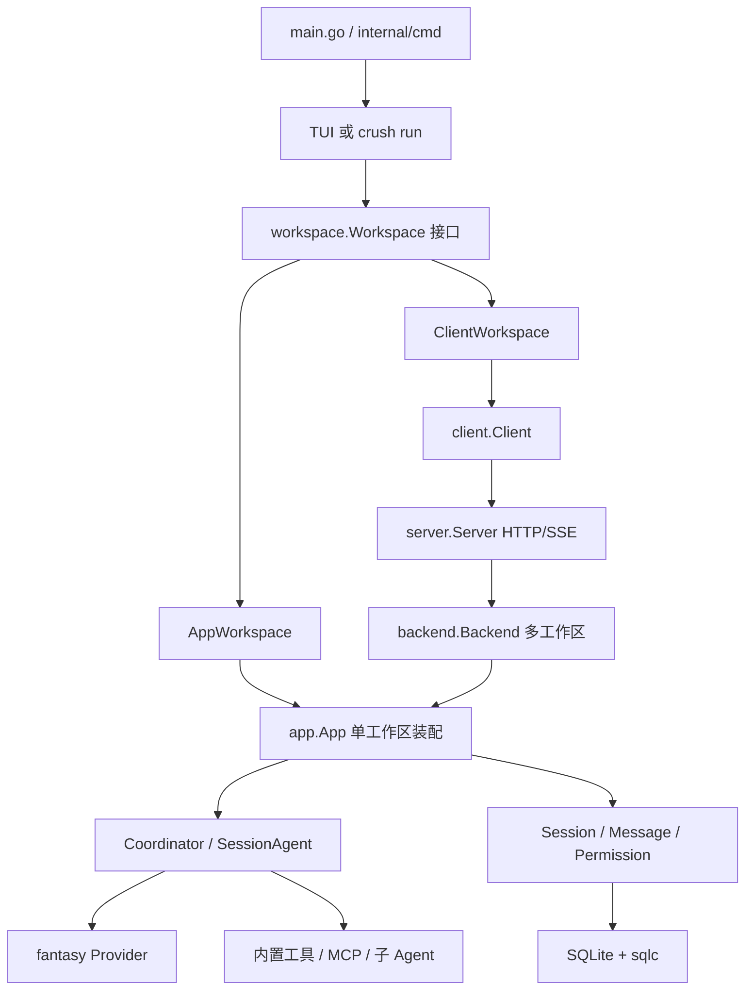

# 01. 简单框架：系统骨架

> 状态：待复核生成稿
> 生成日期：2026-08-16
> 基准提交：`16dce459cafecee92eae0ed7c47a0c641c8bbb9f`
> 工作区：clean（开始分析时）
> 源码范围：`main.go`、`internal/cmd/`、`app/`、`workspace/`、`agent/`、`ui/`
> 生成方式：源码、测试、配置与部署资产静态分析
> 所属层：第一层（只讲边界和主路径，不展开每个函数）

## 快速摘要

### 架构总览（模块与依赖）

Crush 把“在哪个项目工作”做成 Workspace，把“哪段对话”做成 Session，把
“选哪个模型和哪些工具”做成 Coordinator，把“跑一轮模型循环并落库”做成
SessionAgent。前端（TUI 或 `crush run`）只依赖 `workspace.Workspace`
接口；本地实现直接包着 `app.App`，远程实现走 HTTP/SSE。

### 核心调用序列（逐步逻辑）

1. 进程从 `main.go` 进入 Cobra。
2. CLI 创建 Workspace（本地 App 或远程 Client）。
3. 用户提示进入 Coordinator，再进入 SessionAgent。
4. 模型流式输出写入 Message 服务（SQLite + 事件）。
5. 需要工具时先 Hook、再权限、再执行，结果回到模型。
6. 一轮结束时 flush 消息并发布 RunComplete；界面或 stdout 看到结果。

### 易错点与边界条件

- App 是单工作区装配根；Backend 是多工作区业务层。不要把二者当成同一个对象。
- Session 是对话容器；一次 Run/turn 是其中一轮。取消、排队都按 Session 串行。
- 普通 Broker 事件允许慢订阅者丢包；终态 RunComplete 使用 must-deliver。
- 这一层不解释配置合并、OAuth 重试、TUI 绘制或每个工具的实现。

## 1. 这个项目是干什么的

Crush 是一个终端里的 AI 编程助手：连接 LLM，给模型读文件、改文件、跑
Shell、查 LSP、调 MCP 的工具，并在本地 SQLite 里保存多组对话。

用户通常做两件事之一：

- 在项目目录执行 `crush`，进入交互 TUI；
- 执行 `crush run "……"`，跑完一轮后把回答打到 stdout 并退出。

两种用法共享同一套 Agent 和数据模型，只是前端不同。

## 2. 运行时有几块

默认只有一个进程。设置 `CRUSH_CLIENT_SERVER=1` 时变成两个进程：TUI/CLI
是 Client，另一个进程是 Server。



各块职责（只记边界）：

| 块 | 真实类型 | 职责 |
|---|---|---|
| 入口 | `main.go`、`internal/cmd` | 解析命令、选本地或远程、启动 TUI 或非交互 run |
| 前端契约 | `workspace.Workspace` | TUI/CLI 只通过它创建 Session、发提示、订事件 |
| 单工作区装配 | `app.App` | 连接 DB、建领域服务、启动 MCP/LSP、构造 Coordinator |
| 多工作区业务 | `backend.Backend` | Server 模式下按工作区持有多个 App |
| 模型编排 | `agent.coordinator` | 选模型、组工具、OAuth 刷新、发布终态 |
| 模型循环 | `agent.sessionAgent` | 排队、取消、Stream、写消息、摘要 |
| 状态 | `session` / `message` / `db` | 对话与消息落 SQLite，流式更新走 debounce |
| 外部能力 | tools / shell / lsp / mcp | 改代码、跑命令、语言服务、外部工具 |

依赖方向：前端 → Workspace → App → Agent → 领域服务 → DB；工具从 Agent
向下调用 Shell/文件系统/网络，不反向依赖 TUI。

## 3. 请求大概怎么走

以默认本地模式为例，一次提示的主路径是：

```text
用户输入
  → TUI sendMessage 或 crush run
  → Workspace.AgentRun / App.RunNonInteractive
  → Coordinator.Run
  → sessionAgent.Run
  → fantasy.Agent.Stream
  → message.Service 写入 SQLite 并 Publish
  → 工具（如有）：Hook → Permission → 具体工具
  → FlushAll + RunComplete
  → TUI 重绘 或 stdout 打印
```

数据从哪进到哪出：

- 进：终端按键或 CLI 参数里的 prompt；配置来自 `crushrc`/`crush.json`；
  项目上下文来自 `AGENTS.md` 等文件。
- 中：Session 行、Message 行、流式 part、工具调用与结果。
- 出：TUI 聊天气泡，或 `crush run` 的 stdout；副作用是改过的文件、跑过的
  Shell、写过的 SQLite。

## 4. 这一层故意不讲的内容

失败重试、accepted run 高水位取消、消息 debounce 窗口、Client/Server 重连、
每个内置工具、TUI 布局与 Dialog，都放到后面。读完本文应能回答：Crush 是
终端 Agent；运行时主要是 CLI、Workspace、App、Coordinator、SessionAgent、
SQLite；一次提示沿着这条链走到落库和界面。

下一步用一条真实命令把这条链走完：[02-简单例子-全路径走读.md](02-简单例子-全路径走读.md)。

## 阅读源码建议顺序

1. `main.go`
2. `internal/cmd/root.go` 的 `Execute`、`setupWorkspace`、`setupLocalWorkspace`
3. `internal/app/app.go` 的 `App` 结构体和 `New`
4. `internal/workspace/workspace.go` 的 `Workspace` 接口

## 重新实现检查清单

- [ ] 能画出本地与 Client/Server 两种进程形态。
- [ ] 能指出 Workspace 接口隔离前端与实现。
- [ ] 能用一句话区分 Coordinator 与 SessionAgent。
- [ ] 知道一次提示最终会写入 SQLite 并通知订阅者。
