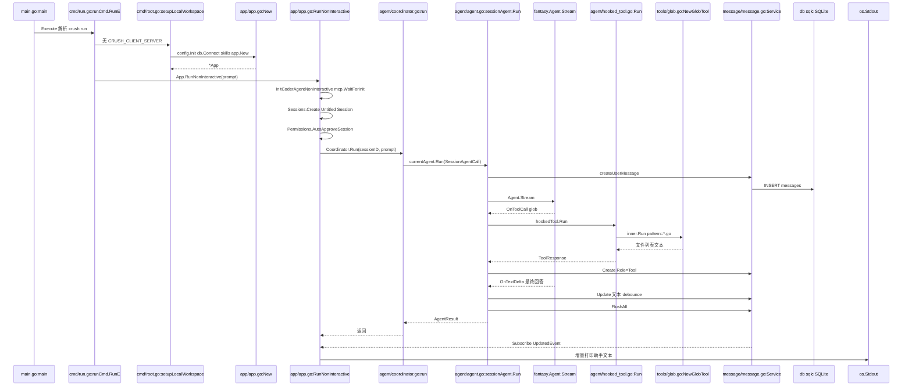

# 02. 简单例子：一次 `crush run` 走完全路径

> 状态：待复核生成稿
> 生成日期：2026-08-16
> 基准提交：`16dce459cafecee92eae0ed7c47a0c641c8bbb9f`
> 工作区：clean（开始分析时）
> 源码范围：`main.go`、`internal/cmd/run.go`、`app/app.go`、`agent/`、`message/`、`workspace/`
> 生成方式：源码、测试、配置与部署资产静态分析
> 所属层：第二层（只走主成功路径；失败、取消、重试点到为止）

## 快速摘要

### 架构总览（模块与依赖）

本例选择默认本地形态下的 `crush run`，而不是交互 TUI。原因：它从真实 CLI
入口进，经过配置、SQLite、Coordinator、SessionAgent、模型流、工具（本例为
`glob`）、消息落库，最后把助手文本打到 stdout 并退出。没有前端页面，但覆盖
了“请求进 → 核心服务 → 数据库/外部工具 → 结果出”的全路径。TUI 在发提示之后
走同一条 `Coordinator.Run`，只是入口换成 `UI.sendMessage`。

### 核心调用序列（逐步逻辑）

1. `main.go:main` → `cmd.Execute` → Fang 把参数交给 `runCmd.RunE`。
2. `setupLocalWorkspace` 加载配置、连 SQLite、发现 Skills、`app.New`。
3. `App.RunNonInteractive` 把 Agent 改成非交互、等 MCP、建 Session、自动批准权限。
4. 后台调用 `Coordinator.Run` → `sessionAgent.Run` → `fantasy.Agent.Stream`。
5. 模型先调 `glob`；`hookedTool` → 权限（本例自动批准）→ `NewGlobTool` 闭包。
6. 工具结果写回 Message，模型再产出最终文本；`FlushAll` 后发布 `RunComplete`。
7. `RunNonInteractive` 从 `Messages.Subscribe` 把助手文本增量写到 stdout，
   等 `Coordinator.Run` 返回后退出。

### 易错点与边界条件

- 本例是**本地** `crush run`。若设置了 `CRUSH_CLIENT_SERVER=1`，同名命令改走
  HTTP `SendMessage`，并以匹配 `RunID` 的 `RunComplete` 为退出条件，见第三层。
- 交互 TUI **不等待** MCP 初始化；本例非交互路径**会等待**。
- 本例假设已配置好 Provider 且模型会调用 `glob`。若模型只回纯文本、不调工具，
  第 5 步直接跳到最终文本，其余步骤不变。
- 本层不展开 OAuth 重试、排队、取消、摘要压缩、TUI 绘制。

## 1. 为什么选这个例子

用户指定要按现有源码整理文档库。Crush 的核心价值是“把一句提示变成一轮带工具
的 Agent turn”。`crush run` 比 TUI 更短、可跟读，且有
`internal/cmd/run_stream_test.go`、`internal/agent/run_complete_test.go`、
`internal/agent/agent_test.go` 作为行为证据。

命令（工作目录是某个 Go 仓库，且已经用 `crushrc` 配好模型）：

```bash
crush run "列出当前目录下的 Go 文件"
```

脱敏后的成功输出形态（stdout 只有助手最终文本；spinner 在 stderr）：

```text
当前目录下的 Go 文件包括：

- main.go
- internal/cmd/root.go
- internal/cmd/run.go
- internal/app/app.go
…
```

进程退出码 0。SQLite 里多了一条 Session（标题稍后可能被异步改成摘要标题）和
若干 Message：用户提示、带 `glob` 工具调用的助手消息、工具结果、最终助手文本。

## 2. 全路径时序

节点对应真实文件与符号。本图只画成功路径。



## 3. 逐步跟读（成功路径）

### 第 1 步：进程入口

`main.go:main` 在 `CRUSH_PROFILE` 为空时不做 pprof，直接调用
`internal/cmd/root.go:Execute`。`Execute` 先把 slog 设成 Discard（避免
`config.Load` 在日志文件就绪前漏到 stderr），再用
`fang.Execute(context.Background(), rootCmd, fang.WithVersion(...), fang.WithNotifySignal(os.Interrupt))`
把 `crush run "列出当前目录下的 Go 文件"` 交给子命令。

`runCmd` 定义在 `internal/cmd/run.go`。`RunE` 做四件准备：

1. `signal.NotifyContext` 捕获 SIGINT/SIGTERM。
2. `strings.Join(args, " ")` 得到 prompt；`MaybePrependStdin` 在 stdin 非
   TTY 时前置管道内容。本例 stdin 是 TTY，prompt 保持原句。
3. `event.SetNonInteractive(true)`。
4. `useClientServer()` 读 `CRUSH_CLIENT_SERVER`。本例为 false。

然后 `setupLocalWorkspace(cmd)`。

### 第 2 步：本地 Workspace 装配

`internal/cmd/root.go:setupLocalWorkspace` 的固定顺序：

| 步骤 | 符号 | 输入 | 成功时的副作用 |
|---|---|---|---|
| 解析目录 | `ResolveCwd` | `--cwd` 或进程 cwd | 工作区根目录 |
| 加载配置 | `config.Init` → `config.Load` | cwd、`--data-dir`、`--debug` | `*config.ConfigStore` |
| 覆盖 | `store.Overrides()` | `--yolo`、`--channels` | 本例 yolo=false |
| 数据目录 | `os.MkdirAll(..., 0o700)` | `cfg.Options.DataDirectory` | 通常是项目下 `.crush/` |
| 项目登记 | `projects.Register` | cwd + data dir | 失败只打 Warn |
| 数据库 | `db.Connect` | data dir | 共享连接池 + goose 迁移 |
| 日志 | `crushlog.Setup` | `logs/crush.log` | 此后 slog 进文件 |
| Skills | `skills.DiscoverFromConfig` + `NewManager` | 配置里的路径 | 带 `WithGlobalMirror` |
| 装配 | `app.New` | ctx、conn、store、skillsMgr | 见下一步 |
| 包装 | `workspace.NewAppWorkspace` | App + store | 返回 `Workspace` 与 `Shutdown` |

`config.Init`（`internal/config/init.go`）只是 `Load` 的薄封装。Load 会发现
`crushrc`/`crush.json`、合并默认 Provider、解析模型。本例假定
`cfg.IsConfigured()` 为 true，否则 `RunE` 会在后面报
`no providers configured`。

`db.Connect`（`internal/db/connect.go`）对同一 data dir 做引用计数；首次打开
时跑 goose 迁移（`internal/db/migrations/`），并加 data-dir 锁，阻止第二个
Crush 进程抢同一目录。

### 第 3 步：`app.New` 把服务接起来

`internal/app/app.go:New` 用 sqlc `db.New(conn)` 构造：

- `session.NewService`
- `message.NewService`
- `history.NewService`
- `permission.NewPermissionService(workingDir, skipPermissionRequests, allowedTools)`
- `question.NewService`
- `filetracker.NewService`
- `lsp.NewManager`
- 三个 Broker：`events`（给 TUI 的 `tea.Msg`）、`agentNotifications`、
  `runCompletions`

然后 `setupEvents` 把各领域服务的订阅桥到 `app.events`。MCP 是
`mcp.ArmInit()` 后 `go mcp.Initialize(...)` 异步连接。因为
`cfg.IsConfigured()` 为 true，接着 `InitCoderAgent(ctx)`：此时
`Interactive: true`。非交互路径会在下一步**再构造一次** Coordinator，把
`Interactive` 改成 false（去掉 `question` 工具）。

本例不启动 TUI，因此不会调用 `App.Subscribe`。

### 第 4 步：非交互运行前的闸门

`runCmd.RunE` 把 Workspace 断言成 `*workspace.AppWorkspace`，调用
`appWs.App().RunNonInteractive(ctx, os.Stdout, prompt, ...)`。

`App.RunNonInteractive` 成功路径上的闸门：

1. `InitCoderAgentNonInteractive` → `initCoderAgent(ctx, false)`。
   `agent.NewCoordinator` 读取 `config.Agents[config.AgentCoder]`，用
   `coderPrompt` 渲染系统提示，`buildAgent` → `buildTools` 注册 glob、
   grep、view、bash 等，再 `wrapToolsWithHooks`。
2. `mcp.WaitForInit(ctx)`。注释写明：非交互只有一次工具调色板机会，必须等
   MCP 稳定；超时边界是各 MCP 自己的 connect timeout。
3. `AgentCoordinator.UpdateModels(ctx)`，把此刻已注册的 MCP 工具装进 Agent。
4. `resolveSession`：本例没有 `--session`/`--continue`，走
   `Sessions.Create(ctx, agent.DefaultSessionName)`，标题为
   `"Untitled Session"`。
5. `Permissions.AutoApproveSession(sess.ID)`。因此后面 `glob` 不会弹权限框。
6. 启动 goroutine：`AgentCoordinator.Run(ctx, sess.ID, prompt)`，结果送进
   `done` channel。
7. 主 goroutine `Messages.Subscribe(ctx)`，把助手文本增量写到 `output`
   （本例是 `os.Stdout`）。

测试证据：`internal/cmd/run_stream_test.go` 针对的是 **Client/Server** 那条
`runStream`（以 `RunComplete` 退出）。本地路径的退出条件是 `done` 收到
`Coordinator.Run` 的返回值，见 `app.go` 的 `select`。第三层会对比这两条退出
契约。

### 第 5 步：Coordinator 配置这一轮

`internal/agent/coordinator.go`：

- `Run` 调用 `run(ctx, nil, sessionID, prompt)`。`accept` 为 nil，因为本地
  路径没有 HTTP 层的 `BeginAccepted`。
- `readyWg.Wait()`：等 Coordinator 自己的就绪任务。
- `!c.interactive` 为 true，再等一次 `mcp.WaitForInit`（与上一步重复，作为
  Client/Server 路径的闸门）。
- `UpdateModels` 刷新 large/small 模型与工具列表。
- 从当前模型取 `DefaultMaxTokens`，与 Provider 配置 `mergeCallOptions`。
- `refreshTokenIfExpired`：本例 token 未过期，继续。
- 构造 `SessionAgentCall`：Prompt、MaxOutputTokens、ProviderOptions、
  `OnComplete` 闭包（用来合并多次 attempt 的终态）、`Accepted: nil`。
- `c.currentAgent.Run(...)`。

`RunID` 来自 `RunIDFromContext(ctx)`。本地 `crush run` 没有在 context 里写入
RunID，因此本轮 `RunComplete.RunID` 为空。这不影响本地退出，因为本地不等
这个事件。

### 第 6 步：SessionAgent 成为本 Session 的活跃 run

`internal/agent/agent.go:sessionAgent.Run`：

1. `ValidateCall`：prompt 非空、sessionID 非空。测试在
   `internal/agent/agent_test.go`。
2. `sessionMu(sessionID).Lock()`。本例 Session 空闲：不走 cancel-on-entry，
   也不走 `enqueueCall`。
3. `context.WithCancel` 得到 `genCtx`，写入 `activeRequests`，解锁。
4. 拷贝 tools、largeModel、systemPrompt；把已连接 MCP 的 instructions 拼进
   系统提示。
5. `fantasy.NewAgent(largeModel.Model, WithSystemPrompt, WithTools, ...)`。
6. `sessions.Get` + `getSessionMessages`：新 Session，历史为空。
7. `!hasUserTextMessage(msgs)` 为 true，于是
   `go GenerateTitle(...)` 异步用 small 模型起标题。主路径不等它。
8. `createUserMessage`：`messages.Create` 插入 Role=User、Parts 为 prompt
   文本。这是本轮第一条持久化消息。
9. defer：`FlushAll`（5 秒超时、detached context）然后 `publishRunComplete`。
   因为 Coordinator 传了 `OnComplete`，终态先进入闭包，等 `coordinator.run`
   返回前再 `PublishMustDeliver`。

`internal/agent/run_complete_test.go` 证明：若本调用因 Session 忙碌被排队，
`OnComplete` 必须被剥掉，否则 Coordinator 已经返回，钩子没人读，
`crush run` 会挂死。本例空闲，钩子保留。

### 第 7 步：Stream 与 `glob` 工具

`agent.Stream(genCtx, fantasy.AgentStreamCall{...})`。`PrepareStep` 回调里：

- 用最新 `a.tools.Copy()`；
- `drainQueueForStep`：本例队列空；
- `messages.Create` 一条空的 Assistant 消息，把 `MessageID` 放进 context。

模型返回一次工具调用（脱敏）：

```json
{
  "name": "glob",
  "input": { "pattern": "*.go" }
}
```

流回调顺序（成功路径）：

1. `OnToolInputStart` → Assistant 消息加上未完成的 ToolCall →
   `messages.Update`（结构变化，**同步 flush**）。
2. `OnToolCall` → 填入完整 Input、Finished=true → 再 Update。
3. fantasy 运行工具：顶层工具是 `hookedTool`。

`hookedTool.Run`（`internal/agent/hooked_tool.go`）：

1. `hooks.Runner.Run(..., EventPreToolUse, sessionID, "glob", inputJSON)`。
   本例没有配置 hook，Runner 可能为 nil（`buildTools` 仅在
   `cfg.Hooks[EventPreToolUse]` 非空时创建）。无 hook 时直接 `inner.Run`。
2. `inner` 是 `tools.NewGlobTool` 的闭包（`internal/agent/tools/glob.go`）。
3. 参数 `pattern="*.go"`，`path` 空则用 `workingDir`。
4. `globFiles` 优先跑 ripgrep，失败再 doublestar；上限 100 条。
5. 返回文本列表 + `GlobResponseMetadata`。

`OnToolResult` 用 `messages.Create(Role=Tool)` 写入工具结果。随后 Stream
再走一步：模型根据文件列表生成最终中文回答，`OnTextDelta` 多次
`AppendContent` + `Update`。普通文本 delta 走 **33ms debounce**
（`message.defaultUpdateDebounce`）；finish part 同步 flush。

`internal/message/message_test.go` 固化：debounce 窗口内多次 delta 只发布
一次 UpdatedEvent；finish 即使 debounce=1h 也立即落库。

### 第 8 步：结果回到 stdout

`RunNonInteractive` 的 `select`：

- `Messages.Subscribe` 收到 Assistant 消息：取出 `Content().String()` 相对
  上次已打印字节的增量，`fmt.Fprint(output, part)`。首次打印会
  `TrimLeft` 空白。
- `done` 收到 `Coordinator.Run` 成功返回：`stopSpinner()`，`return nil`。

`sessionAgent.Run` 返回前 defer 已 `FlushAll`，因此 stdout 能看到完整最终
文本。函数末尾再打印一个换行，避免 shell 提示覆盖最后一行。

`runCmd.RunE` 返回 nil → Fang 正常退出。`setupLocalWorkspace` 的 `defer cleanup()`
调用 `App.Shutdown`：先 `CancelAll` 等 Agent 写完，再关 MCP、释放 DB。

## 4. 关键代码关系表

| 调用方文件与符号 | 关系 | 被调用方文件与符号 | 触发与输入 | 返回与后续处理 | 错误、状态与副作用 |
|---|---|---|---|---|---|
| `main.go:main` | 调用 | `cmd.Execute` | 进程启动 | Fang 解析 `run` | 失败 `os.Exit(1)` |
| `cmd/run.go:RunE` | 调用 | `setupLocalWorkspace` | 无 client/server | `AppWorkspace` | 配置/DB 失败返回 error |
| `cmd/root.go:setupLocalWorkspace` | 调用 | `config.Init`、`db.Connect`、`app.New` | cwd、data dir | 装配好的 App | 创建 data dir、gitignore、项目登记 |
| `app.go:New` | 构造 | `agent.NewCoordinator`（经 InitCoderAgent） | 已配置的 coder agent | Coordinator 挂到 App | 异步 MCP/LSP；未配置则跳过 Agent |
| `app.go:RunNonInteractive` | 调用 | `InitCoderAgentNonInteractive` | interactive=false | 无 question 工具 | 替换 App.AgentCoordinator |
| `app.go:RunNonInteractive` | 调用 | `mcp.WaitForInit` | 非交互 | 工具列表稳定 | 超时/失败则 run 失败 |
| `app.go:RunNonInteractive` | 调用 | `Sessions.Create` | `"Untitled Session"` | 新 Session | 写 sessions 表 |
| `app.go:RunNonInteractive` | 调用 | `Permissions.AutoApproveSession` | sessionID | 无返回 | 本 Session 工具请求自动过 |
| `app.go:RunNonInteractive` | 调用 | `Coordinator.Run` | sessionID + prompt | `*fantasy.AgentResult` | 后台 goroutine；错误包装后进 done |
| `coordinator.go:Run` | 调用 | `coordinator.run` | accept=nil | 同上 | 本地无 accepted 预订 |
| `coordinator.go:run` | 调用 | `sessionAgent.Run` | `SessionAgentCall` + OnComplete | AgentResult | 返回前 PublishMustDeliver RunComplete |
| `agent.go:Run` | 调用 | `messages.Create` | Role=User | 用户消息 | 失败则 turn 失败 |
| `agent.go:Run` | 调用 | `fantasy.Agent.Stream` | 历史、工具、回调 | 流式 part | genCtx 取消则中断 |
| `hooked_tool.go:Run` | 调用 | `tools/glob.go` 闭包 | `GlobParams{Pattern:"*.go"}` | 文件列表文本 | 无 hook 时直通；权限已自动批准 |
| `message.go:Update` | 持久化 | sqlc + Broker | 流式 Message | debounce 或同步 flush | 订阅者收到 UpdatedEvent |
| `app.go:RunNonInteractive` | 订阅 | `Messages.Subscribe` | ctx | 助手文本增量 | 打印到 stdout |

谁创建对象：

- `ConfigStore`：`config.Init`。
- `*sql.DB`：`db.Connect`。
- `*app.App`：`app.New`。
- `Coordinator`：`app.initCoderAgent` → `agent.NewCoordinator`。
- Session：`session.Service.Create`。
- 用户/助手/工具 Message：`sessionAgent` 经 `message.Service`。
- `fantasy.Agent`：每个 `sessionAgent.Run` 内现场 `fantasy.NewAgent`。

参数在哪一层补默认值：glob 的 `Path` 空则用 workingDir；max tokens 优先
用户模型配置，否则 Catwalk `DefaultMaxTokens`。权限在非交互 Session 上被
`AutoApproveSession` 短路。

返回值在哪一层消费：`Coordinator.Run` 的 error 决定 `done` 分支；助手文本
不从 `AgentResult` 取，而从 Message 事件增量打印。推断：这样 TUI 和 CLI
可以共用同一套流式消息，而不依赖 fantasy 返回值里的最终字符串。

副作用提交点：SQLite 写在 `message.Service` 的 flush；文件系统只读（glob
不改文件）；stdout 只在 `RunNonInteractive` 的订阅循环里写。

## 5. 测试如何触发这条路径

| 测试 | 替身 | 断言的行为 |
|---|---|---|
| `cmd/run_stream_test.go:TestRunStream_RunCompleteExits` | 手工构造 proto 事件 | 最终文本来自 RunComplete；message finish 不能提前退出（Client/Server） |
| `cmd/run_stream_test.go:TestRunStream_ToolUseDoesNotTerminate` | 带 `FinishReasonToolUse` 的助手消息 | 工具步不能结束 `crush run` |
| `agent/run_complete_test.go:TestSessionAgentRun_QueueStripsOnComplete` | 无模型，伪造 busy | 排队必须剥掉 OnComplete，并保留 RunID |
| `message/message_test.go` debounce 用例 | 可控 debounce 时长 | 文本合并；finish 同步 flush |
| `agent/hooked_tool_test.go` | fakeTool + 假 Runner | 无 runner 时原样返回；子 Agent 不包 hook |

本例的“模型真的调用 glob 并打印中文列表”没有端到端录制测试；工具本身有
`internal/agent/tools/` 下的单元测试。与实现交叉后：本地 `crush run` 的退出
信号是 `Coordinator.Run` 返回，不是 `RunComplete`。把两条路径当成同一契约
会读错 `app.go` 与 `cmd/run.go`。

## 6. 本层点到为止的失败路径

- 未配置 Provider：`RunE` 在 `IsConfigured()` 处返回错误，不进 Run。
- glob 超时或 ripgrep 失败：工具返回错误文本给模型，模型仍可再试；不在本层
  展开。
- 用户 Ctrl-C：`NotifyContext` 取消 → `Run` 看到 `context.Canceled` →
  `done` 分支把它当成正常取消并 `return nil`。
- OAuth 401：Coordinator 可能刷新后重试；本层当成功路径未发生。

这些分支的逐步条件见 [03-详细逐步说明-主链路拆解.md](03-详细逐步说明-主链路拆解.md)。

## 阅读源码建议顺序

1. `main.go` → `internal/cmd/root.go:Execute` → `internal/cmd/run.go:RunE`
2. `setupLocalWorkspace` → `app.New` → `RunNonInteractive`
3. `coordinator.run` → `sessionAgent.Run` 到 `agent.Stream` 为止
4. `hooked_tool.go` → `tools/glob.go`
5. `message.go` 的 `Update`/`FlushAll` 注释
6. 对照 `run_stream_test.go` 与 `app.RunNonInteractive` 的退出条件差异

## 重新实现检查清单

- [ ] 默认 `crush run` 不走 HTTP，直接 `App.RunNonInteractive`。
- [ ] 非交互会重建 Coordinator（无 question 工具）并等待 MCP。
- [ ] 新 Session 标题为 `Untitled Session`，且该 Session 自动批准权限。
- [ ] 用户消息在 Stream 之前落库；助手消息在 PrepareStep 时创建。
- [ ] 工具顺序是 Hook →（权限）→ 具体工具；本例权限被 AutoApprove 短路。
- [ ] 本地路径用 Message 订阅打印 stdout，用 `Coordinator.Run` 返回退出。
- [ ] 关闭时先取消 Agent 再关 DB。
