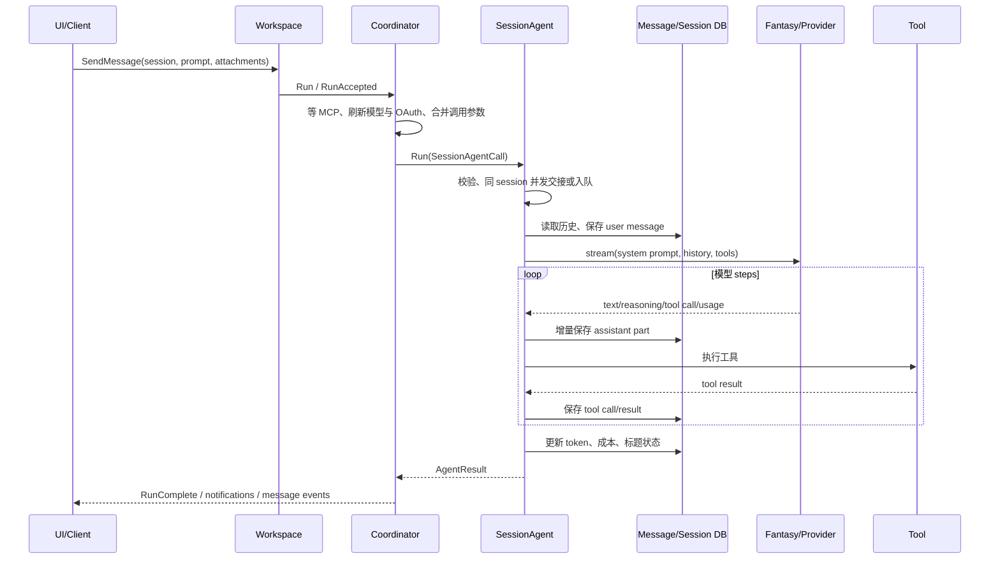

# 03. Agent、模型循环与工具

## 1. Coordinator 与 SessionAgent 的分工

`Coordinator` 负责“装配与协调”：读取配置、选择 Provider/Model、构建系统提示、收集内置和 MCP 工具、处理凭据刷新、更新模型并把调用参数交给当前 Agent。

`SessionAgent` 负责“执行一次或多次对话”：加载历史消息、创建用户消息、调用 Fantasy Agent、处理流式 step、保存 assistant/tool 消息、排队、取消、自动摘要、生成标题和发布完成事件。

二者分开后，Provider 配置变化不需要让底层会话循环知道配置文件细节，SessionAgent 也可在主 Agent、子 Agent、标题/摘要等场景复用。

## 2. Coordinator 初始化

`NewCoordinator` 接受显式 `CoordinatorOptions`，依赖包括 ConfigStore、Session/Message/Permission/Question/History/FileTracker、LSP、通知 Broker、RunComplete Broker、Skills Manager 和交互模式。

初始化过程：

1. 从 Skills Manager 取得去重前与启用后的 Skills，并建立 Tracker；
2. 读取 `coder` Agent 配置；
3. 构建 coder prompt 模板；
4. `buildAgent` 根据 large/small model 创建实际 Provider；
5. 构建工具集合并创建 SessionAgent；
6. 将 coder 设为 `currentAgent`。

MCP 初始化在 App 创建时异步启动，但每次 `Coordinator.run` 在读取工具注册表前都会 `mcp.WaitForInit`，避免启动较慢的 MCP 进程“已经连接但工具未进入本轮工具表”。

## 3. 一次用户提问的完整链路

关键点是 UI 主要观察数据库服务发布的消息事件，而不是直接渲染 Provider 的原始 stream。这样本地和远程 UI 都能看到一致状态，也能恢复历史。

## 4. 同 Session 排队与取消

`sessionAgent` 为每个 Session 保存 active cancel、消息队列和短时 dispatch mutex。正常本地调用进入 `Run` 后决定立即执行还是入队。

Client/Server 的 `SendMessage` 必须快速返回，因此先调用 `BeginAccepted` 预留一次尚未进入 `Run` 的派发。`AcceptedRun`、单调 accept sequence 和 cancel high-water mark 共同解决一个竞态：用户在 goroutine 真正注册 active cancel 之前按下取消。取消标记只覆盖取消时已经被接受的 sequence，取消之后新来的提示不会被旧标记误伤。

完成当前 Run 后，队列递归排空。排队调用保留 RunID，但一些仅在原始调用栈有效的回调会被去除，最终完成仍通过 Broker 对外可见。

## 5. 完成事件与错误

普通 Agent notification 是 UI 友好的最佳努力事件，可能在订阅者过慢时丢弃。`notify.RunComplete` 是非交互流程的权威终止信号，在所有消息更新 flush 后发布。

Coordinator 遇到 401 时可能刷新 OAuth/AWS SSO 后重试。为防止第一次失败的完成事件先让 `crush run` 退出，内部尝试的完成结果先被回调收集，Coordinator 只发布最终一次。若错误发生在 SessionAgent 真正开始之前，Backend 会用 marker 判断 Coordinator 是否已发布，并补发可靠的错误 RunComplete。

## 6. Prompt 与上下文文件

`internal/agent/prompt` 使用 Go template 构建系统提示。数据包含当前时间、平台、工作目录、Provider/Model、Git 状态、环境信息、配置规定的上下文路径和 Skills XML。

上下文文件支持 AGENTS.md、CRUSH.md、CLAUDE.md、GEMINI.md 及 `.local` 变体。路径会按工作目录和配置展开，读取失败会保留可诊断状态。模板位于 `internal/agent/templates/`：

- `coder.md.tpl`：主编码 Agent；
- `task.md.tpl`：任务/子 Agent；
- `initialize.md.tpl`：初始化项目上下文；
- `agentic_fetch_prompt.md.tpl`：探索型抓取；
- `title.md`、`summary.md`：标题和摘要；
- `agent_tool.md`、`agentic_fetch.md`：工具说明。

Skills 不会把全部正文直接塞入系统提示；`ToPromptXML` 暴露目录与触发信息，Agent 按需用 View 读取具体 `SKILL.md`，Tracker 记录已加载状态。

## 7. 自动摘要与标题

SessionAgent 根据模型上下文窗口、已用 token 和保留 buffer 判断是否摘要。大上下文模型使用固定 buffer，小窗口按比例保留。摘要由小模型/指定模型生成，并作为压缩后的历史继续对话，避免无限增长。

新 Session 的标题异步生成。标题结果会去除 `<think>` 标签并清理格式，然后更新 Session。标题失败不应阻塞主回答。

## 8. 工具体系

所有工具以 Fantasy `AgentTool` 形式进入模型。工具通常包含：参数 schema、Markdown 描述模板、执行闭包和显示元数据。`internal/agent/tools/tools.go` 集中声明名称、上下文依赖和基础构造逻辑。

### 8.1 文件与搜索

| 工具 | 作用 | 重要约束 |
| --- | --- | --- |
| View | 分段读取文本、图片或内置 `crush://` 资源 | 路径展开、二进制判断、行数/大小限制 |
| Write | 新建或整体写文件 | 权限检查、目录创建、FileTracker |
| Edit | 精确单处替换 | 要求 old text 唯一，处理空白差异 |
| MultiEdit | 对同文件顺序应用多项编辑 | 前一项结果影响后一项匹配 |
| Glob | 文件名模式搜索 | 超时、ignore 规则、结果上限 |
| Grep | 内容搜索 | 优先 ripgrep，结构化输出与超时 |
| LS | 限深目录树 | ignore、深度/条目限制 |
| Download | 下载到文件 | 网络与写权限 |

文件写入后会通知 FileTracker 与 LSP；Edit 还要谨慎处理编码、换行和替换歧义。安全辅助函数统一检查路径、工作区边界和危险操作。

### 8.2 Shell 与后台任务

`Bash` 使用 `internal/shell.Shell` 保持 cwd、环境和函数状态，可流式回报进度。命令先经过 builtin handler，再经过 block/permission handler，最后到 OS exec。以后台形式运行时由全局 `BackgroundShellManager` 保存同步缓冲、完成状态和 cancel；`JobOutput` 查询，`JobKill` 终止。

### 8.3 LSP 工具

Diagnostics、References、Definition、Symbols、Rename、ReplaceSymbol、CallHierarchy、LSPRestart 通过 LSP Manager 找到能处理目标文件的 Client。工具负责坐标与参数校验，实际 JSON-RPC 和 WorkspaceEdit 在 `internal/lsp` 完成。

### 8.4 网络与外部搜索

Fetch/WebFetch/WebSearch/Sourcegraph 将网络结果裁剪成模型可消费文本。它们处理 URL 校验、内容类型、大小、超时、重定向和错误展示。是否可用还取决于构建、配置或 API key。

### 8.5 交互工具

Question 将结构化问题交给 `question.Service`，TUI 弹出对应表单；非交互模式必须有明确降级或返回错误。Todos 用结构化列表给 UI 展示任务状态。

### 8.6 MCP 工具

`internal/agent/tools/mcp` 负责连接 stdio/HTTP/SSE server、OAuth、工具注册、资源读取、channel 和初始化同步。远端工具名会加可识别前缀并包装为 Fantasy 工具；`list_mcp_resources` 与 `read_mcp_resource` 暴露资源协议。

### 8.7 子 Agent

Agent tool 创建隔离子 Session，使用 task prompt 和受限/重建后的工具集合执行。AgenticFetch 更偏自主探索。父对话保存工具调用和结果，子对话保存完整内部过程，既保持主上下文简洁又可追踪。

## 9. Hooks 与工具包装

Coordinator 构建工具后用 `hookedTool` 装饰。PreToolUse Hook 在权限检查前执行，可允许、拒绝或修改工具输入，并把批准上下文传给权限服务，避免同一决策重复询问。

Hook 命令接收包含 session、tool、input、cwd 等信息的 JSON stdin，并通过 stdout 返回兼容 Crush/Claude Code 的决定。Runner 并行运行匹配 Hooks，去重相同命令，执行超时并聚合决定。拒绝优先级高于允许；解析失败按安全规则处理并提供诊断。

## 10. 新增工具必须检查的地方

1. 工具实现与参数 schema；
2. `.md`/`.md.tpl` 描述；
3. `buildTools` 注册、Agent allow/disable 列表；
4. Permission 请求与 safe 判定；
5. Hook 能看到的标准化名字和输入；
6. Message Content 的 tool call/result 持久化；
7. `ui/chat` 的专用 renderer 或 generic fallback；
8. Client/Server proto 是否需要新增结构；
9. 单元测试、取消、超时、输出上限与跨平台行为。
