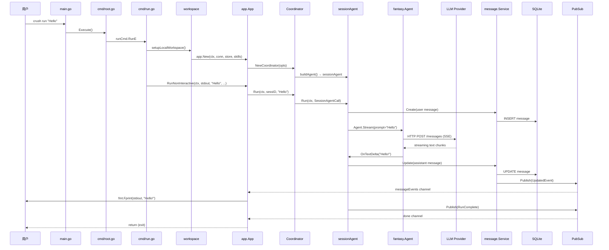

[上一篇：02-简单例子-全路径走读](02-简单例子-全路径走读.md) · [总目录](README.md) · [下一篇：04-核心模块与类关系](04-核心模块与类关系.md)

# 主链路逐步拆解：`crush run "Hello"` 的每一跳

> **场景**：基于第二层的 `crush run "Hello"` 全路径，逐跳展开调用关系、参数传递、返回值处理、状态变化。
> **时间**：2026-08-27 (CST)
> **版本**：Crush @ main branch, Go 1.26.6, charm.land/fantasy v0.41.2
> **阅读说明**：本文是第二层的详细展开，每一跳都标注真实文件、函数、参数、返回值。

## 本文件内容

1. [调用关系总览](#1-调用关系总览)
2. [Hop 1：main → cmd.Execute](#2-hop-1main--cmdexecute)
3. [Hop 2：Execute → runCmd.RunE](#3-hop-2execute--runcmdrune)
4. [Hop 3：RunE → setupLocalWorkspace](#4-hop-3rune--setuplocalworkspace)
5. [Hop 4：setupLocalWorkspace → config.Init](#5-hop-4setuplocalworkspace--configinit)
6. [Hop 5：setupLocalWorkspace → db.Connect](#6-hop-5setuplocalworkspace--dbconnect)
7. [Hop 6：setupLocalWorkspace → app.New](#7-hop-6setuplocalworkspace--appnew)
8. [Hop 7：app.New → InitCoderAgent → NewCoordinator](#8-hop-7appnew--initcoderagent--newcoordinator)
9. [Hop 8：NewCoordinator → buildAgent → buildTools](#9-hop-8newcoordinator--buildagent--buildtools)
10. [Hop 9：RunE → RunNonInteractive](#10-hop-9rune--runnoninteractive)
11. [Hop 10：RunNonInteractive → Coordinator.Run](#11-hop-10runnoninteractive--coordinatorrun)
12. [Hop 11：Coordinator.run → sessionAgent.Run](#12-hop-11coordinatorrun--sessionagentrun)
13. [Hop 12：sessionAgent.Run → fantasy.Agent.Stream](#13-hop-12sessionagentrun--fantasyagentstream)
14. [Hop 13：LLM 流式回调 → message.Service](#14-hop-13llm-流式回调--messageservice)
15. [Hop 14：事件流 → stdout 输出](#15-hop-14事件流--stdout-输出)
16. [Hop 15：RunComplete → 退出](#16-hop-15runcomplete--退出)

## 1. 调用关系总览



## 2. Hop 1：main → cmd.Execute

**调用方：**

```
main.go
函数：main
偏移：+10
```

**被调用方：**

```
internal/cmd/root.go
函数：Execute
```

**参数：** 无（调用 `cmd.Execute()`）

**关键逻辑：**

`main` 函数首先检查 `CRUSH_PROFILE` 环境变量，如果设置了则启动 pprof。然后调用 `cmd.Execute()`。

**状态变化：** 进程从启动状态进入 CLI 路由状态。

## 3. Hop 2：Execute → runCmd.RunE

**调用方：**

```
internal/cmd/root.go
函数：Execute
偏移：+22
```

**被调用方：**

```
charm.land/fang/v2 v2.0.1
函数：fang.Execute
    ↓
internal/cmd/run.go
Var：runCmd (cobra.Command)
RunE：匿名函数
```

**参数传递：**

- `cmd *cobra.Command`：包含 flag 解析结果
- `args []string`：`["Hello"]`

**RunE 内部关键流程：**

```
internal/cmd/run.go
函数：runCmd.RunE（匿名函数）
偏移：+0 ～ +95
```

1. 读取 flags（偏移：+1 ～ +7）：
   - `quiet` → bool
   - `verbose` → bool
   - `largeModel` → string（`--model`）
   - `smallModel` → string（`--small-model`）
   - `sessionID` → string（`--session`）
   - `useLast` → bool（`--continue`）

2. 构建 prompt（偏移：+9 ～ +16）：
   - `prompt = strings.Join(args, " ")` → `"Hello"`
   - `MaybePrependStdin(prompt)` → 检查 stdin，终端模式下直接返回 `"Hello"`

3. 判断运行模式（偏移：+32）：
   - `useClientServer()` → `false`（未设置 `CRUSH_CLIENT_SERVER`）
   - 走 `setupLocalWorkspace(cmd)` 路径

**返回值：** error（成功时 nil）

## 4. Hop 3：RunE → setupLocalWorkspace

**调用方：**

```
internal/cmd/run.go
函数：runCmd.RunE
调用偏移：+131
```

**被调用方：**

```
internal/cmd/root.go
函数：setupLocalWorkspace
偏移：+0 ～ +72
```

**参数：**

- `cmd *cobra.Command`：携带 flag 值

**内部流程：**

1. 解析 flags（偏移：+1 ～ +5）：
   - `debug = false`
   - `yolo = false`
   - `channels = nil`
   - `dataDir = ""`

2. `ResolveCwd(cmd)`（偏移：+7）→ 返回当前工作目录，如 `/home/user/project`

3. `config.Init(cwd, dataDir, debug)`（偏移：+11）→ 返回 `*config.ConfigStore`

4. 获取配置并设置 overrides（偏移：+13 ～ +14）：
   - `cfg = store.Config()`
   - `store.Overrides().SkipPermissionRequests = yolo`

5. 创建数据目录（偏移：+16 ～ +19）：
   - `os.MkdirAll(cfg.Options.DataDirectory, 0o700)`

6. `db.Connect(ctx, cfg.Options.DataDirectory)`（偏移：+37）→ 返回 `*sql.DB`

7. 设置日志（偏移：+40 ～ +41）：
   - `crushlog.Setup(logFile, debug)`

8. 发现 Skills（偏移：+43 ～ +50）：
   - `skills.DiscoverFromConfig(discoveryCfg)` → `(allSkills, activeSkills, skillStates)`
   - `skills.NewManager(...)` → `*skills.Manager`

9. `app.New(ctx, conn, store, skillsMgr)`（偏移：+58）→ 返回 `*app.App`

10. 创建 workspace 并返回（偏移：+65 ～ +69）：
    - `ws = workspace.NewAppWorkspace(appInstance, store)`
    - `cleanup = func() { appInstance.Shutdown() }`

**返回值：** `(workspace.Workspace, func(), error)`

**状态变化：** 配置加载完成，数据库已连接，App 实例已创建。

## 5. Hop 4：setupLocalWorkspace → config.Init

**调用方：**

```
internal/cmd/root.go
函数：setupLocalWorkspace
调用偏移：+11
```

**被调用方：**

```
internal/config/init.go
函数：Init
```

**参数：**

- `cwd string`：工作目录
- `dataDir string`：数据目录（空时使用默认 `.crush`）
- `debug bool`：调试模式

**内部逻辑：**

`config.Init` 加载配置的优先级顺序：

1. 环境变量（如 `ANTHROPIC_API_KEY`）
2. 全局配置：`~/.config/crush/crushrc`
3. 项目配置：`./crushrc` 或 `./.crushrc`
4. JSON 配置：`crush.json`

**返回值：** `*config.ConfigStore`

**ConfigStore 关键字段：**

```
internal/config/config.go
Struct：Config
字段：Providers  → map[string]ProviderConfig
字段：Models     → map[SelectedModelType]SelectedModel
字段：Agents     → map[string]Agent
字段：Options    → *Options
字段：LSP        → map[string]LSPClientConfig
字段：MCP        → map[string]MCPServerConfig
字段：Permissions → *PermissionsConfig
```

## 6. Hop 5：setupLocalWorkspace → db.Connect

**调用方：**

```
internal/cmd/root.go
函数：setupLocalWorkspace
调用偏移：+37
```

**被调用方：**

```
internal/db/connect.go
函数：Connect
```

**参数：**

- `ctx context.Context`
- `dataDir string`：数据目录路径

**内部逻辑：**

1. 构造 SQLite 数据库路径：`filepath.Join(dataDir, "crush.db")`
2. 打开数据库连接（使用 `modernc.org/sqlite` 或 `ncruces/go-sqlite3`）
3. 执行 goose migration 创建表结构

**返回值：** `*sql.DB`

**数据库表（通过 migration 创建）：**

- `sessions` — 会话表
- `messages` — 消息表
- `files` — 文件历史表
- `read_files` — 文件读取记录表

## 7. Hop 6：setupLocalWorkspace → app.New

**调用方：**

```
internal/cmd/root.go
函数：setupLocalWorkspace
调用偏移：+58
```

**被调用方：**

```
internal/app/app.go
函数：New
偏移：+0 ～ +92
```

**参数：**

- `ctx context.Context`
- `conn *sql.DB`：数据库连接
- `store *config.ConfigStore`：配置
- `skillsMgr *skills.Manager`：Skills 管理器

**内部流程详解：**

1. 创建 DB 查询器（偏移：+1）：
   ```go
   q := db.New(conn)
   ```

2. 创建服务（偏移：+2 ～ +8）：
   - `sessions = session.NewService(q, conn)` — 会话 CRUD
   - `messages = message.NewService(q)` — 消息存储，防抖更新
   - `files = history.NewService(q, conn)` — 文件历史
   - `permissions = permission.NewPermissionService(...)` — 权限管理
   - `questions = question.NewService()` — 提问服务
   - `fileTracker = filetracker.NewService(q)` — 文件追踪
   - `lspManager = lsp.NewManager(store)` — LSP 管理器

3. 创建 App 结构体（偏移：+9 ～ +20）：
   - 填充所有服务字段
   - 创建 3 个 pubsub Broker：
     - `events` — 主事件总线（`tea.Msg`）
     - `agentNotifications` — Agent 通知
     - `runCompletions` — Run 完成事件

4. `app.setupEvents()`（偏移：+22）：
   - 将 9 个服务的事件流桥接到 `app.events` broker
   - 使用 `setupSubscriber` 或 `setupSubscriberMustDeliver`（用于不可丢失的事件）

5. `clipboard.Init()`（偏移：+24）— 剪贴板初始化

6. `go app.checkForUpdates(ctx)`（偏移：+26）— 后台检查更新

7. `mcp.ArmInit()` + `go mcp.Initialize(ctx, ...)`（偏移：+28 ～ +29）— 异步初始化 MCP

8. `herdr.Init()` + `herdr.BridgeLocal(...)`（偏移：+31 ～ +33）— herdr 集成

9. `app.InitCoderAgent(ctx)`（偏移：+41）→ 创建 Agent 协调器

10. `app.LSPManager.SetCallback(...)`（偏移：+43 ～ +47）— 设置 LSP 回调
11. `go app.LSPManager.TrackConfigured(ctx)`（偏移：+49）— 启动 LSP 跟踪

**返回值：** `(*App, error)`

**状态变化：** 所有服务已创建并互相关联，MCP 异步初始化中，LSP 异步跟踪中。

## 8. Hop 7：app.New → InitCoderAgent → NewCoordinator

**调用方：**

```
internal/app/app.go
函数：New
调用偏移：+41
    ↓
internal/app/app.go
函数：InitCoderAgent
偏移：+0 ～ +2
    ↓
internal/app/app.go
函数：initCoderAgent
偏移：+0 ～ +25
```

**被调用方：**

```
internal/agent/coordinator.go
函数：NewCoordinator
偏移：+0 ～ +49
```

**参数（CoordinatorOptions）：**

```
internal/agent/coordinator.go
Struct：CoordinatorOptions
字段：Config      → *config.ConfigStore
字段：Sessions    → session.Service
字段：Messages    → message.Service
字段：Permissions → permission.Service
字段：Questions   → question.Service
字段：History     → history.Service
字段：FileTracker → filetracker.Service
字段：LSPManager  → *lsp.Manager
字段：Notify      → pubsub.Publisher[notify.Notification]
字段：RunComplete → pubsub.Publisher[notify.RunComplete]
字段：Skills      → *skills.Manager
字段：Interactive → bool
```

对于 `crush run` 非交互模式，后续会调用 `InitCoderAgentNonInteractive` 重建 agent，`Interactive = false`。

**NewCoordinator 内部流程：**

1. 获取 Skills（偏移：+4 ～ +11）：
   - 从 manager 获取 `allSkills` 和 `activeSkills`
   - 创建 `skills.NewTracker(activeSkills)`

2. 构造 `coordinator` 结构体（偏移：+13 ～ +16）

3. 获取 coder agent 配置（偏移：+18 ～ +20）：
   - `agentCfg = opts.Config.Config().Agents[config.AgentCoder]`

4. 构建 coder prompt（偏移：+22 ～ +26）：
   ```
   internal/agent/prompts.go
   函数：coderPrompt
   偏移：+0 ～ +7
   ```
   读取嵌入模板 `templates/coder.md.tpl`，创建 `prompt.Prompt`

5. `c.buildAgent(ctx, prompt, agentCfg, false)`（偏移：+28）→ 创建 `sessionAgent`

**返回值：** `(Coordinator, error)`

## 9. Hop 8：NewCoordinator → buildAgent → buildTools

**调用方：**

```
internal/agent/coordinator.go
函数：NewCoordinator
调用偏移：+28
```

**被调用方：**

```
internal/agent/coordinator.go
函数：buildAgent
偏移：+0 ～ +53
```

**buildAgent 内部流程：**

1. `c.buildAgentModels(ctx, isSubAgent)`（偏移：+1）→ 返回 `(large Model, small Model, error)`

   ```
   internal/agent/coordinator.go
   函数：buildAgentModels
   偏移：+0 ～ +50+
   ```

   - 从配置读取 `SelectedModelTypeLarge` 和 `SelectedModelTypeSmall`
   - 根据 provider type 创建 `fantasy.LanguageModel`：
     - `anthropic` → `anthropic.New(...)`
     - `openai` / `openai-compat` → `openai.New(...)`
     - `google` / `google-vertex` → `google.New(...)`
     - `bedrock` → `bedrock.New(...)`
     - 等等

2. `NewSessionAgent(SessionAgentOptions{...})`（偏移：+6 ～ +19）→ 创建 `sessionAgent` 实例

3. 异步构建 system prompt（偏移：+21 ～ +28）：
   ```
   c.readyWg.Go(func() error {
       systemPrompt, err := prompt.Build(initCtx, ...)
       result.SetSystemPrompt(systemPrompt)
       return nil
   })
   ```

4. 异步构建工具列表（偏移：+30 ～ +37）：
   ```
   c.readyWg.Go(func() error {
       tools, err := c.buildTools(initCtx, agent, isSubAgent)
       result.SetTools(tools)
       return nil
   })
   ```

**buildTools 完整工具列表：**

```
internal/agent/coordinator.go
函数：buildTools
偏移：+0 ～ +90+
```

创建的内置工具（按顺序）：

| 工具 | 创建函数 | 说明 |
|------|---------|------|
| AgentTool | `c.agentTool(ctx)` | 子 Agent 调用 |
| AgenticFetch | `c.agenticFetchTool(ctx, nil)` | 智能抓取 |
| Bash | `tools.NewBashTool(...)` | Shell 命令执行 |
| CrushInfo | `tools.NewCrushInfoTool(...)` | 项目信息 |
| CrushLogs | `tools.NewCrushLogsTool(...)` | 日志查看 |
| JobOutput | `tools.NewJobOutputTool()` | 后台作业输出 |
| JobKill | `tools.NewJobKillTool()` | 后台作业终止 |
| Download | `tools.NewDownloadTool(...)` | 文件下载 |
| Edit | `tools.NewEditTool(...)` | 文件编辑 |
| MultiEdit | `tools.NewMultiEditTool(...)` | 批量编辑 |
| Fetch | `tools.NewFetchTool(...)` | HTTP 抓取 |
| Glob | `tools.NewGlobTool(...)` | 文件模式匹配 |
| Grep | `tools.NewGrepTool(...)` | 内容搜索 |
| Ls | `tools.NewLsTool(...)` | 目录列表 |
| Sourcegraph | `tools.NewSourcegraphTool(nil)` | Sourcegraph 搜索 |
| Todos | `tools.NewTodosTool(...)` | Todo 管理 |
| View | `tools.NewViewTool(...)` | 文件查看 |
| Write | `tools.NewWriteTool(...)` | 文件写入 |

交互模式额外添加：`Question` 工具

配置了 LSP 时添加：`Diagnostics`、`References`、`LSPRestart`、`Symbols`、`Definition`、`CallHierarchy`、`Rename`、`ReplaceSymbol`

配置了 MCP 时添加：`ListMCPResources`、`ReadMCPResource` + 所有 MCP 服务器工具

**工具过滤逻辑（偏移：+82 ～ +90）：**

```go
for _, tool := range allTools {
    if slices.Contains(agent.AllowedTools, tool.Info().Name) {
        filteredTools = append(filteredTools, tool)
    }
}
```

只保留 `agent.AllowedTools` 中列出的工具。

**返回值：** `(SessionAgent, error)`

**状态变化：** `sessionAgent` 已创建，system prompt 和 tools 异步构建中（通过 `readyWg` 跟踪）。

## 10. Hop 9：RunE → RunNonInteractive

**调用方：**

```
internal/cmd/run.go
函数：runCmd.RunE
调用偏移：+147
```

**被调用方：**

```
internal/app/app.go
函数：RunNonInteractive
偏移：+0 ～ +170
```

**参数：**

- `ctx context.Context`
- `output io.Writer`：`os.Stdout`
- `prompt string`：`"Hello"`
- `largeModel string`：`""`（未指定）
- `smallModel string`：`""`（未指定）
- `hideSpinner bool`：`false`
- `continueSessionID string`：`""`
- `useLast bool`：`false`

**内部流程详解：**

1. `app.InitCoderAgentNonInteractive(ctx)`（偏移：+4）：
   - 重新创建 coordinator，`Interactive = false`
   - 不包含 `Question` 工具

2. 检查 model override（偏移：+9 ～ +12）：
   - `largeModel == "" && smallModel == ""` → 跳过

3. 等待 MCP（偏移：+24）：
   ```go
   if err := mcp.WaitForInit(ctx); err != nil {
       return fmt.Errorf("failed to wait for MCP initialization: %w", err)
   }
   ```

4. 刷新 agent models（偏移：+26）：
   ```go
   app.AgentCoordinator.UpdateModels(ctx)
   ```

5. 创建 session（偏移：+28 ～ +30）：
   ```go
   sess, err := app.resolveSession(ctx, "", false)
   ```
   - `continueSessionID == ""` 且 `useLast == false`
   - 走 `default` 分支：`app.Sessions.Create(ctx, agent.DefaultSessionName)`
   - `agent.DefaultSessionName = "Untitled Session"`

   **Session 创建参数和返回值：**
   ```
   internal/session/session.go
   Struct：Session
   字段：ID    → string (新生成的 UUID)
   字段：Title → string ("Untitled Session")
   ```

6. 自动批准权限（偏移：+35）：
   ```go
   app.Permissions.AutoApproveSession(sess.ID)
   ```

7. 启动 agent（goroutine，偏移：+93 ～ +99）：
   ```go
   go func(ctx context.Context, sessionID, prompt string) {
       result, err := app.AgentCoordinator.Run(ctx, sess.ID, prompt)
       done <- response{result: result, err: err}
   }(ctx, sess.ID, prompt)
   ```

8. 订阅消息事件（偏移：+101）：
   ```go
   messageEvents := app.Messages.Subscribe(ctx)
   ```

9. 事件循环（偏移：+119 ～ +170）：
   - `select` 三路：`done` / `messageEvents` / `ctx.Done()`
   - 收到 assistant message → 计算增量 → `fmt.Fprint(output, part)`

**状态变化：** Session 已创建，Agent goroutine 已启动，事件循环运行中。

## 11. Hop 10：RunNonInteractive → Coordinator.Run

**调用方：**

```
internal/app/app.go
函数：RunNonInteractive（goroutine 内）
调用偏移：+93
```

**被调用方：**

```
internal/agent/coordinator.go
Interface：Coordinator
方法：Run
偏移：+0 ～ +2
    ↓
internal/agent/coordinator.go
函数：run
偏移：+0 ～ +80+
```

**参数：**

- `ctx context.Context`
- `sessionID string`：Session UUID
- `prompt string`：`"Hello"`
- `attachments ...message.Attachment`：无

**coordinator.run 内部流程：**

1. `c.readyWg.Wait()`（偏移：+1）— 等待 system prompt 和 tools 构建完成

2. 非交互模式等待 MCP（偏移：+8 ～ +11）：
   ```go
   if !c.interactive {
       if err := mcp.WaitForInit(ctx); err != nil { ... }
   }
   ```

3. `c.UpdateModels(ctx)`（偏移：+14）— 刷新模型

4. 获取模型和配置（偏移：+16 ～ +22）：
   ```go
   model := c.currentAgent.Model()
   maxTokens := model.CatwalkCfg.DefaultMaxTokens
   providerCfg, _ := c.cfg.Config().Providers.Get(model.ModelCfg.Provider)
   ```

5. 合并调用选项（偏移：+24）：
   ```go
   mergedOptions, temp, topP, topK, freqPenalty, presPenalty := mergeCallOptions(model, providerCfg)
   ```

6. 构造 `SessionAgentCall` 并调用（偏移：+42 ～ +53）：
   ```go
   run := func() (*fantasy.AgentResult, error) {
       return c.currentAgent.Run(ctx, SessionAgentCall{
           SessionID:        sessionID,
           RunID:            runID,
           Prompt:           prompt,       // "Hello"
           MaxOutputTokens:  maxTokens,
           ProviderOptions:  mergedOptions,
           Temperature:      temp,
           TopP:             topP,
           TopK:             topK,
           FrequencyPenalty: freqPenalty,
           PresencePenalty:  presPenalty,
           OnComplete:       onComplete,
           OnAuthRefresh:    c.makeAuthRefreshCallback(providerCfg),
       })
   }
   result, originalErr := run()
   ```

**返回值：** `(*fantasy.AgentResult, error)`

## 12. Hop 11：Coordinator.run → sessionAgent.Run

**调用方：**

```
internal/agent/coordinator.go
函数：run
调用偏移：+53
```

**被调用方：**

```
internal/agent/agent.go
Struct：sessionAgent
方法：Run
偏移：+0 ～ +220+
```

**参数（SessionAgentCall）：**

```
internal/agent/agent.go
Struct：SessionAgentCall
字段：SessionID       → string
字段：RunID           → string
字段：Prompt          → string ("Hello")
字段：MaxOutputTokens → int64
字段：ProviderOptions → fantasy.ProviderOptions
字段：Temperature     → *float64
字段：TopP            → *float64
字段：OnComplete      → func(notify.RunComplete)
字段：OnAuthRefresh   → func(...) error
```

**sessionAgent.Run 内部流程详解：**

### 12.1 调度决策（偏移：+1 ～ +84）

1. `ValidateCall(call)` — 验证参数
2. 获取 per-session mutex：`sessMu := a.sessionMu(call.SessionID)`
3. `sessMu.Lock()` — 串行化调度决策
4. 检查 cancel-on-entry → 否
5. `a.IsSessionBusy(call.SessionID)` → `false`（空闲）
6. 创建运行上下文：
   ```go
   runCtx := context.WithValue(ctx, tools.SessionIDContextKey, call.SessionID)
   genCtx, cancel = context.WithCancel(runCtx)
   a.activeRequests.Set(call.SessionID, &activeCancel{cancel: cancel})
   ```
7. `sessMu.Unlock()` — 释放调度锁

### 12.2 准备 LLM 请求（偏移：+93 ～ +119）

1. 线程安全复制可变状态：
   ```go
   agentTools := a.tools.Copy()
   largeModel := a.largeModel.Get()
   systemPrompt := a.systemPrompt.Get()
   ```

2. 追加 MCP instructions（偏移：+100 ～ +112）：
   - 遍历已连接的 MCP 服务器
   - 收集 `InitializeResult().Instructions`
   - 追加到 system prompt

3. 创建 fantasy.Agent（偏移：+119）：
   ```go
   agent := fantasy.NewAgent(
       largeModel.Model,                    // LLM model
       fantasy.WithSystemPrompt(systemPrompt),
       fantasy.WithTools(agentTools...),
       fantasy.WithUserAgent(userAgent),
   )
   ```

### 12.3 获取历史并创建 user message（偏移：+120 ～ +148）

1. `currentSession, _ := a.sessions.Get(ctx, call.SessionID)` — 获取 session
2. `msgs, _ := a.getSessionMessages(ctx, currentSession)` — 获取历史消息
3. 如果是第一条消息，异步生成标题：
   ```go
   if !hasUserTextMessage(msgs) {
       go a.GenerateTitle(titleCtx, call.SessionID, call.Prompt)
   }
   ```
4. `a.createUserMessage(ctx, call)` — 创建 user message → 写入 SQLite

### 12.4 流式调用 LLM（偏移：+213）

```go
result, err = agent.Stream(genCtx, fantasy.AgentStreamCall{
    Prompt:          message.PromptWithTextAttachments("Hello", nil),
    Files:           files,
    Messages:        history,
    ProviderOptions: call.ProviderOptions,
    MaxOutputTokens: &maxOutputTokens,
    PrepareStep:     prepareStepCallback,
    OnTextDelta:     onTextDeltaCallback,
    OnReasoningStart: ...,
    OnReasoningDelta: ...,
    OnReasoningEnd:   ...,
    OnToolInputStart: ...,
    OnToolCall:       ...,
    OnRetry:          ...,
})
```

**返回值：** `(*fantasy.AgentResult, error)`

## 13. Hop 12：sessionAgent.Run → fantasy.Agent.Stream

**调用方：**

```
internal/agent/agent.go
函数：Run（sessionAgent）
调用偏移：+213
```

**被调用方：**

```
charm.land/fantasy v0.41.2
Agent.Stream(ctx, call)
```

**参数（AgentStreamCall）：**

- `Prompt`：`"Hello"`
- `Messages`：历史消息列表（首次为空）
- `SystemPrompt`（通过 Agent 构造时设置）
- `Tools`：工具列表
- `MaxOutputTokens`：模型默认值
- 各种回调函数

**fantasy.Agent.Stream 内部逻辑（第三方库）：**

1. 将 system prompt + history + prompt 打包为 provider-specific 请求格式
2. 发送 HTTP 请求到 LLM API（如 Anthropic `POST /v1/messages`）
3. 接收 SSE 流式响应
4. 对每个事件触发对应回调：
   - `text_delta` → `OnTextDelta(id, textChunk)`
   - `reasoning_start` → `OnReasoningStart(id, reasoning)`
   - `tool_use_start` → `OnToolInputStart(id, toolName)`
   - `tool_call` → `OnToolCall(...)`
5. 如果 `finish_reason == tool_use`，执行工具调用，然后递归调用 `Stream`
6. 如果 `finish_reason == stop`，返回 `AgentResult`

对于 `"Hello"` 这个简单 prompt，LLM 直接返回文本，不触发工具调用，流程为：

```text
agent.Stream()
  │
  ├── PrepareStep() → 创建 assistant message
  │
  ├── HTTP POST → LLM API
  │     │
  │     ▼ SSE 流
  │     ├── text_delta "Hello"     → OnTextDelta()
  │     ├── text_delta "!"         → OnTextDelta()
  │     ├── text_delta " How can"  → OnTextDelta()
  │     ├── text_delta " I help"   → OnTextDelta()
  │     └── text_delta " you today?" → OnTextDelta()
  │
  └── finish_reason: stop → 返回 AgentResult
```

## 14. Hop 13：LLM 流式回调 → message.Service

### 14.1 PrepareStep 回调：创建 assistant message

```
internal/agent/agent.go
函数：Run（sessionAgent）→ PrepareStep 闭包
偏移：+242 ～ +316
```

关键操作（偏移：+298 ～ +313）：

```go
assistantMsg, err = a.messages.Create(callContext, call.SessionID, message.CreateMessageParams{
    Role:     message.Assistant,
    Parts:    []message.ContentPart{},
    Model:    largeModel.ModelCfg.Model,
    Provider: largeModel.ModelCfg.Provider,
})
currentAssistant = &assistantMsg
```

将 assistant message ID 存入 context，供工具使用。

### 14.2 OnTextDelta 回调：流式更新

```
internal/agent/agent.go
函数：Run（sessionAgent）→ OnTextDelta 闭包
偏移：+342 ～ +352
```

```go
OnTextDelta: func(id string, text string) error {
    if len(currentAssistant.Parts) == 0 {
        text = strings.TrimPrefix(text, "\n")
    }
    currentAssistant.AppendContent(text)
    return a.messages.Update(genCtx, *currentAssistant)
}
```

每次收到文本块：
1. 追加文本到 `currentAssistant.Parts`
2. 调用 `a.messages.Update` 更新数据库

### 14.3 message.Service.Update 行为

```
internal/message/message.go
函数：Update（Service 实现）
```

1. 将消息状态写入内存缓冲区
2. 防抖窗口 33ms 内合并多次更新
3. 到达窗口或终端状态时：
   - 写入 SQLite（`UPDATE messages SET ...`）
   - 发布 `pubsub.UpdatedEvent` 事件

```
internal/message/message.go
Const：defaultUpdateDebounce
值：33 * time.Millisecond
```

**数据流：**

```text
OnTextDelta("Hello")
  │
  ▼
currentAssistant.AppendContent("Hello")
  │
  ▼
message.Service.Update(*currentAssistant)
  │
  ├──→ 内存缓冲（33ms 防抖）
  │
  ├──→ SQLite: UPDATE messages SET parts='[{"type":"text","text":"Hello"}]'
  │
  └──→ pubsub.Broker.Publish(UpdatedEvent, Message{...})
```

## 15. Hop 14：事件流 → stdout 输出

**事件传播路径：**

```
message.Service → pubsub.Broker → app.events → app.RunNonInteractive 事件循环
```

详细路径：

1. `message.Service.Update` 发布 `pubsub.UpdatedEvent`
2. `app.events` broker（`setupSubscriber` 桥接）转发给所有订阅者
3. `app.RunNonInteractive` 的 `messageEvents` channel 收到事件

**事件循环处理（偏移：+119 ～ +170）：**

```go
case event := <-messageEvents:
    msg := event.Payload
    if msg.SessionID == sess.ID && msg.Role == message.Assistant && len(msg.Parts) > 0 {
        content := msg.Content().String()
        readBytes := messageReadBytes[msg.ID]
        part := content[readBytes:]
        if readBytes == 0 {
            part = strings.TrimLeft(part, " \t")
        }
        if printed || strings.TrimSpace(part) != "" {
            printed = true
            fmt.Fprint(output, part)
        }
        messageReadBytes[msg.ID] = len(content)
    }
```

**增量输出逻辑：**

- `readBytes` 记录上次已输出的字节数
- `part = content[readBytes:]` 计算增量
- 首次输出时 `TrimLeft` 去除前导空白
- `fmt.Fprint(os.Stdout, part)` 写入 stdout

**状态变化：** `messageReadBytes[msg.ID]` 持续增长，`printed` 变为 `true`。

## 16. Hop 15：RunComplete → 退出

### 15.1 RunComplete 发布

`sessionAgent.Run` 的 defer 块（偏移：+186 ～ +215）：

```go
defer func() {
    flushCtx, flushCancel := context.WithTimeout(context.WithoutCancel(ctx), 5*time.Second)
    a.messages.FlushAll(flushCtx)  // 刷新所有防抖缓冲
    complete := notify.RunComplete{
        SessionID:  call.SessionID,
        RunID:      call.RunID,
    }
    if currentAssistant != nil {
        complete.MessageID = currentAssistant.ID
        complete.Text = currentAssistant.Content().String()
    }
    a.publishRunComplete(ctx, call, complete)
}()
```

**RunComplete 结构：**

```
internal/agent/notify/notify.go
Struct：RunComplete
字段：SessionID  → string
字段：RunID      → string
字段：MessageID  → string
字段：Text       → string（完整回复文本）
字段：Error      → string
字段：Cancelled  → bool
```

### 15.2 事件传播

```text
sessionAgent.Run defer
  │
  ▼
a.publishRunComplete(ctx, call, complete)
  │
  ├── 如果 call.OnComplete != nil → 调用 onComplete(complete)
  │   （coordinator.run 的 onComplete 闭包保存到 latest）
  │
  └── 否则 → a.runComplete.Publish(UpdatedEvent, complete)
```

coordinator.run 的 `onComplete` 闭包保存后（偏移：+70 ～ +73）：

```go
if hasLatest && c.runComplete != nil {
    c.runComplete.PublishMustDeliver(ctx, pubsub.UpdatedEvent, latest)
}
```

`PublishMustDeliver` 使用有界阻塞语义确保事件不丢失。

### 15.3 退出

`app.RunNonInteractive` 事件循环中 `done` channel 收到结果：

```go
case result := <-done:
    stopSpinner()
    if result.err != nil {
        return fmt.Errorf("agent processing failed: %w", result.err)
    }
    return nil
```

返回 `nil` → `runCmd.RunE` 返回 `nil` → `cmd.Execute` 返回 `nil` → `main` 退出。

**最终 stdout 输出：**

```text
Hello! How can I help you today?
```

（末尾追加一个换行符，由 `RunNonInteractive` 的 defer 保证）

---

[上一篇：02-简单例子-全路径走读](02-简单例子-全路径走读.md) · [总目录](README.md) · [下一篇：04-核心模块与类关系](04-核心模块与类关系.md)