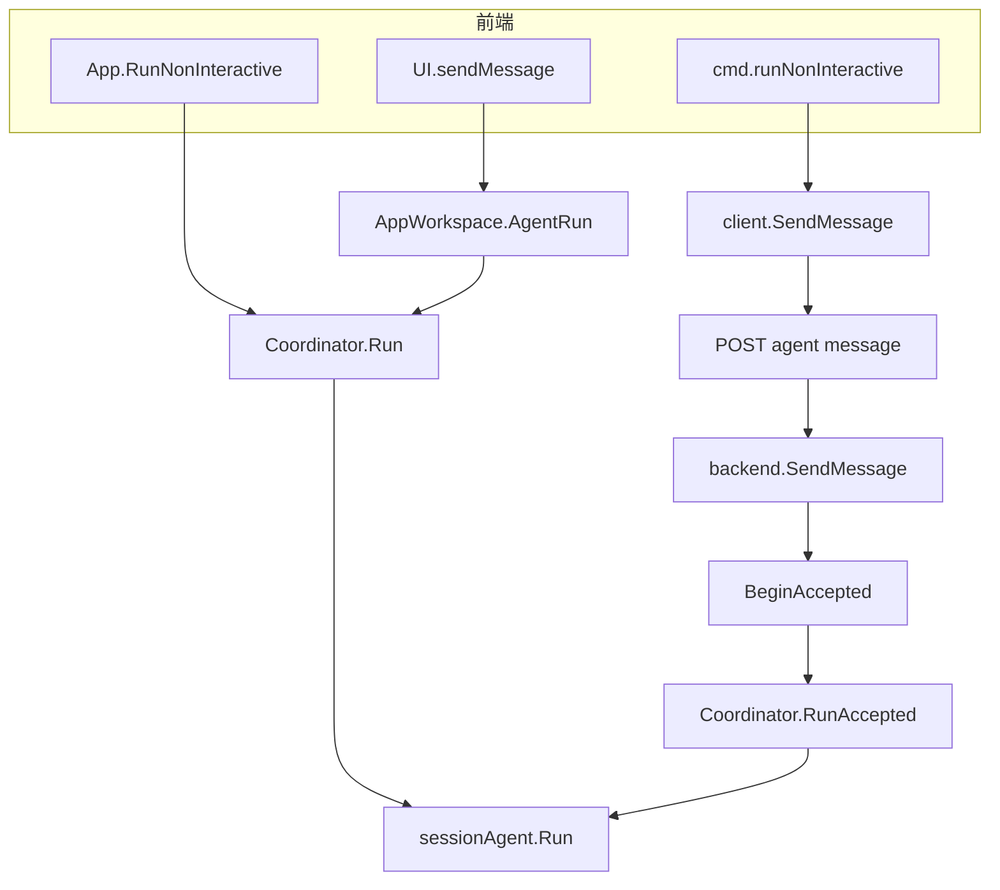
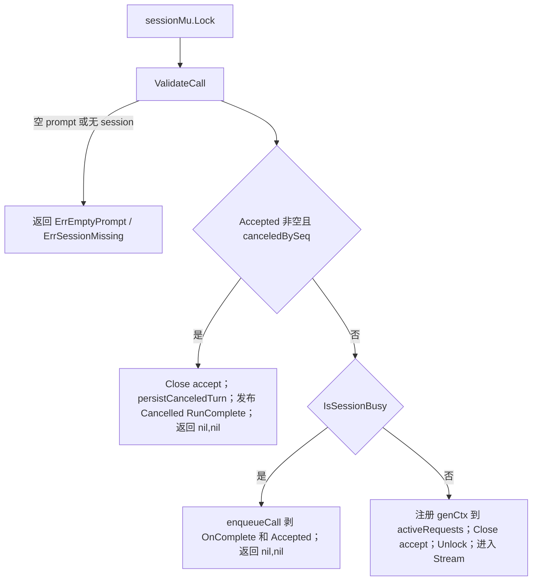
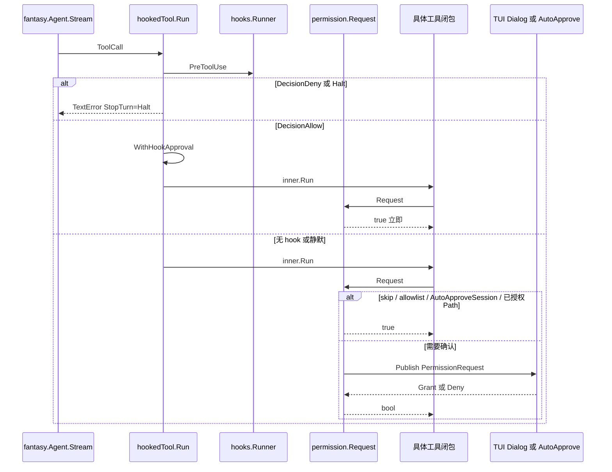

# 03. 详细逐步说明：主链路拆解

> 状态：待复核生成稿
> 生成日期：2026-08-16
> 基准提交：`16dce459cafecee92eae0ed7c47a0c641c8bbb9f`
> 工作区：clean（开始分析时）
> 源码范围：`cmd/`、`app/`、`workspace/`、`backend/`、`agent/`、`message/`、`permission/`、`ui/model/ui.go`
> 生成方式：源码、测试、配置与部署资产静态分析
> 所属层：第三层（按主链路逐步拆开；展开正常、失败、取消、排队、权限；不按模块倾倒全部源码）

## 快速摘要

### 架构总览（模块与依赖）

第二层走通了本地 `crush run` 的成功路径。本层仍沿同一条主链，但把每一跳
拆开，并补上三条前端变体（TUI、本地 run、Client/Server run）、dispatch
三态（cancel-on-entry / queued / active）、权限阻塞、Provider 重试、消息
debounce 与两种退出契约。模块内部的全部工具、配置字段、TUI 绘制放到第四层。

### 核心调用序列（逐步逻辑）

1. 入口选择 Workspace：本地 `AppWorkspace` 或远程 `ClientWorkspace`。
2. 前端把 prompt 交给 `AgentRun` / `SendMessage` / `RunNonInteractive`。
3. `sessionAgent.Run` 在 per-session 锁下决定取消、排队或成为 active。
4. `fantasy.Agent.Stream` 逐步回调；工具经 Hook → Permission → 实现。
5. `message.Service` 对文本 debounce、对结构/终态同步 flush。
6. defer `FlushAll` 后发布 `RunComplete`；Coordinator 合并 OAuth 重试各 attempt。
7. 本地 run 等 `Coordinator.Run` 返回；远程 run 等匹配 RunID 的 RunComplete；
   TUI 不退出，只根据事件重绘。

### 易错点与边界条件

- 空闲 Cancel 不得留下 cancel mark，否则会毒死下一次提示
  （`dispatch_cancel_test.go`）。
- 带 RunID 的排队提示必须作为独立 turn，不能折进当前 turn
  （`queued_runid_test.go`、`drainQueueForStep`）。
- 排队会剥掉 `OnComplete`（`run_complete_test.go`），否则 Coordinator
  返回后钩子没人读。
- 工具结果和未完成 tool call 的收尾必须用 parent/`WithoutCancel` context，
  因为 `genCtx` 取消后仍要落库。
- 权限 `Request` 会阻塞工具 goroutine，直到 Grant/Deny 或 ctx 取消。

## 1. 三条前端如何接到同一条 Agent 链

| 前端 | 入口符号 | 接到 Agent 的方式 | 退出/完成信号 |
|---|---|---|---|
| 交互 TUI | `internal/ui/model/ui.go:sendMessage` | `tea.Cmd` 里调用 `Workspace.AgentRun`；本地即 `Coordinator.Run` | 不退出进程；`agentRunSubmittedMsg` 只表示已接受。忙闲靠后续事件 |
| 本地 `crush run` | `app.App.RunNonInteractive` | 后台 goroutine 调 `Coordinator.Run` | `done` channel 收到 Run 返回；并行订阅 Message 打 stdout |
| Client/Server `crush run` | `cmd/run.go:runNonInteractive` | `client.SendMessage` 带 `uuid` RunID | `runStream.handle` 只在匹配 RunID 的 `RunComplete` 时 `done=true` |

TUI 注释写明：`AgentRun` 是 fire-and-forget——HTTP 202 或本地校验错误会立刻
返回；运行失败和取消走事件，不走这个返回值。远程 `backend.SendMessage`
同样立即返回，run 绑在 workspace context 上，不绑 HTTP 请求。

## 2. 第 0 跳：启动与装配（相对第二层的增量）

第二层已列出 `setupLocalWorkspace` 顺序。本层只补会改变主链路行为的分支。

### 2.1 本地 vs Client/Server

`cmd/root.go:useClientServer` 用 `strconv.ParseBool(os.Getenv("CRUSH_CLIENT_SERVER"))`。
为 true 时：

- 交互 TUI：`setupClientServerWorkspace` → `connectToServer` →
  `workspace.NewClientWorkspace`；若已配置则 `InitCoderAgent`。
- `crush run`：`connectToServer` 后走 `runNonInteractive`（SSE），不走
  `App.RunNonInteractive`。

`connectToServer` 会确保 Server 进程在跑（细节见第四层文档 04/10）。失败则
整个命令失败，不会静默回退本地。

### 2.2 `app.New` 在未配置时提前返回

若 `!cfg.IsConfigured()`，`New` 打 Warn 并返回尚未设置 `AgentCoordinator`
的 App。之后：

- TUI 可进入 onboarding；
- `crush run` 在 `IsConfigured()` 检查处失败；
- `AppWorkspace.AgentRun` 若 Coordinator 仍为 nil，返回
  `"agent coordinator not initialized"`。

### 2.3 交互标志如何改变工具与 MCP 等待

| 路径 | `CoordinatorOptions.Interactive` | MCP 等待 | question 工具 |
|---|---|---|---|
| TUI `InitCoderAgent` | true | `coordinator.run` **不等** `WaitForInit` | 有 |
| 本地 `RunNonInteractive` | 先 true 再重建为 false | App 层和 Coordinator 层都等 | 无 |
| 远程非交互 `InitCoderAgentNonInteractive` | false | Coordinator 等 | 无 |

证据：`coordinator.go` 注释说明交互等待会冻住 TUI 首条消息；
`coordinator_mcp_gate_test.go` 覆盖这道闸门。

### 2.4 关闭顺序（成功路径的对称失败）

`App.Shutdown`：先 `AgentCoordinator.CancelAll`（最多等约 5 秒
`sessionAgent.CancelAll`），再执行 `cleanupFuncs`（`db.Release`、`mcp.Close`）。
Agent 必须在关 DB 之前把最后一次 `FlushAll` 写完。`sessionAgent.Run` 的
flush 使用 `context.WithoutCancel` + 5 秒超时，正是为了对抗 shutdown 取消
workspace context。

## 3. 第 1 跳：dispatch 三态

`sessionAgent.Run` 在 `sessionMu` 下的决策是主链路最容易读错的一段。

### 3.1 正常：idle → active

与第二层相同。解锁后 `activeRequests` 已有条目，并发 `Cancel` 能立刻
`ac.cancel()`。`CompareAndDelete` 防止 defer 删掉后来者的 cancel 函数。

### 3.2 忙碌：enqueue

`enqueueCall` 保留 Prompt、RunID、`acceptSeq`；把 `OnComplete` 和 `Accepted`
置 nil。调用方看到 `(nil, nil)`，以为“已被接受”。真正执行发生在当前 turn
的 `PrepareStep` 里 `drainQueueForStep`，或当前 turn 结束后的递归 Run。

`drainQueueForStep` 规则（持有同一把 dispatch 锁）：

| 队列项 | 行为 |
|---|---|
| `canceledBySeq` 为真 | 丢弃；若有 RunID 则补发 cancelled RunComplete |
| 未取消且 **无** RunID | 折进当前 step（再 `createUserMessage`，拼进 prepared.Messages） |
| 未取消且 **有** RunID | 留在队列，当前 turn 结束后作为独立 turn 跑 |

`queued_runid_test.go` 固化：带 RunID 的排队提示不能静默合并进当前 turn，
否则 `crush run` 会等到错误的那一次 RunComplete。

### 3.3 cancel-on-entry

`backend.SendMessage` 先 `BeginAccepted` 再异步 `RunAccepted`。在 goroutine
进入 `Run` 的锁之前，用户可能已经 Cancel。此时：

- `canceledBySeq(sessionID, accept.seq)` 为真；
- 不进 Stream；
- `persistCanceledTurn` 写出 User + 带 `FinishReasonCanceled` 的 Assistant；
- 显式 `publishRunComplete(Cancelled=true)`，因为后面那个 Stream defer
  还没装上。

`dispatch_cancel_test.go:TestRun_BusyWithPendingCancelTakesCancelOnEntry`
要求：busy + pending cancel 时走 cancel-on-entry，**禁止**再 enqueue。

### 3.4 Cancel 本身

`sessionAgent.Cancel` 持同一把锁：

1. 若有 `activeRequests`，调用 `cancel()`，**不**从 map 删除（`IsBusy` 仍为
   true，直到 Run 的 defer 清掉）。
2. 同时取消 `sessionID+"-summarize"`。
3. **仅当** `acceptedRuns[sessionID] > 0` 时，把 `cancelMark` 升到当前
   `acceptSeqGen`。空闲 Escape 不会写 mark。
4. 清空队列并通知（带 RunID 的项会收到 cancelled 终态）。

`TestCancel_ActiveAndAcceptedFiresBothBranches`：active 与 accepted 可同时
存在，一次 Cancel 必须两路都打到。

`TestRun_NormalCompletionClearsStalePendingCancel`：正常结束必须清掉残留
mark，否则会误杀下一次 Run。

## 4. 第 2 跳：Stream 生命周期

### 4.1 PrepareStep

每个模型 step 都会：

1. 清掉历史消息上的 ProviderOptions，再给最后系统消息和最后两条消息加
   cache control（Anthropic 风格缓存）。
2. 排空队列（见 3.2）。
3. `workaroundProviderMediaLimitations`。
4. 创建新的空 Assistant 消息，把 `tools.MessageIDContextKey` 等写入 context。
   `currentAssistant` 指针供 defer RunComplete 读取最终文本。

### 4.2 流式回调与落库时机

| 回调 | 写什么 | Update 语义 |
|---|---|---|
| OnReasoningDelta / OnTextDelta | 追加文本 | debounce 33ms |
| OnReasoningEnd | signature + FinishThinking | 同步 flush |
| OnToolInputStart / OnToolCall | 工具结构变化 | 同步 flush；用 **parent ctx** 而非 genCtx |
| OnToolResult | 新建 Role=Tool 消息 | Create 用 parent ctx |
| OnRetry | ResetStreamedContent | 避免失败半截与重试拼接 |
| OnStepFinish | FinishReason + session token/cost | 同步；Save session |

`OnStepFinish` 把 fantasy 的 finish 映射为：

- Length → MaxTokens
- Stop → EndTurn
- ToolCalls → ToolUse；若某 ToolResult.StopTurn（hook halt 或权限拒绝）则改
  EndTurn，让 UI 画完 footer
- ContentFilter → 持久化 REFUSED，文案由 TUI 负责

### 4.3 停止条件：摘要与循环检测

`StopWhen` 两个闭包：

1. 上下文窗口剩余低于阈值（大窗口用固定 buffer，小窗口用比例）且未关闭
   自动摘要 → 设 `shouldSummarize` 并停止。窗口为 0 的本地模型跳过，避免
   立刻截断。
2. `hasRepeatedToolCalls`：滑动窗口内相同工具调用重复过多次则停。

摘要与循环的完整算法见第四层文档 06。主链路上只需知道：Stream 正常返回后
Run 可能再进入 summarize 或对带 RunID 的队列项递归 `Run`。递归前会设
`skipRunComplete`，避免外层 defer 与内层终态打架。

### 4.4 Stream 出错

`genCtx` 已取消时仍必须落库，因此错误路径用
`context.WithTimeout(WithoutCancel(ctx), 5s)`：

- 未完成的 tool call 补 `Finished=true`、空 Input；
- 缺少 tool result 的补错误 Tool 消息（取消文案与一般错误文案不同）；
- `AddFinish(Canceled|Error|…)`；
- Hyper 401 写成 Unauthorized，提示 `crush auth`。

若助手消息还没创建（Cancel 发生在 PrepareStep 之前），走
`persistCanceledTurn(..., userMsgCreated)`，避免用户消息没有对应的取消标记。

Provider 层重试：`OnRetry` 只重置当前助手流式内容；Coordinator 另有
unauthorized → `OnAuthRefresh` → 再 `run()` 的外层重试。外层用 `latest`
闭包合并多次 `OnComplete`，只 `PublishMustDeliver` 一次。
`coordinator_test.go` 覆盖 `isUnauthorized`。

## 5. 第 3 跳：工具、Hook、权限

权限短路顺序（`permission.go:Request`）：

1. `skip`（`--yolo` / `SkipPermissionRequests`）→ true
2. `allowedTools` 命中工具名或 `tool:action` → true
3. context 上的 hook 预批准（必须 toolCallID 匹配）→ true，并 Publish
   granted 通知
4. `AutoApproveSession`（本地 `crush run` 对本 Session 设置）→ true
5. `sessionPermissions` 里已有同一 Session+Tool+Action+Path → true
6. 否则 Publish `PermissionRequest`，阻塞在 `respCh`，直到 Grant/Deny 或
   `ctx.Done()`

TUI 订阅该请求弹出 Dialog；远程 Client 经 SSE 收到后同样弹框，再 HTTP
回调 Grant。工具实现内部调用 `permissions.Request`，不经过 hookedTool
之后的第二层包装——因此 **Hook 在权限之前**，与 `HOOKS.md` 及
`hooked_tool.go` 注释一致。

Deny 时工具返回错误文本给模型，模型可以改主意。Halt（`resp.StopTurn`）
结束整个 turn。子 Agent 的工具列表 **不** wrap hook，避免委托 N 次触发；
顶层 `agent` 工具本身仍被 wrap。

Glob 在本例中通常只读；Bash/Edit/Write 会带 Path 做权限。未配置 hook 时
`hookRunner` 为 nil，`wrapToolsWithHooks` 原样返回切片
（`hooked_tool_test.go`）。

## 6. 第 4 跳：消息 debounce 与 RunComplete 顺序

`message.Service.Update` 契约（接口注释即行为规范）：

- 默认 33ms 合并文本/推理 delta：一次 SQL + 一次 `UpdatedEvent`。
- finish、tool-call 结构变化、reasoning end：`Update` 返回前同步 flush。
- `Get`/`List` 若要强一致，调用方必须先 `Flush`/`FlushAll`。
  `AppWorkspace.ListMessages` 因此先 `FlushAll`。

`sessionAgent.Run` defer 顺序：

1. `FlushAll`（detached，5s）
2. 若未 `skipRunComplete`，组装 `notify.RunComplete{SessionID, RunID, MessageID, Text, Error, Cancelled}`
3. 有 `call.OnComplete` 则只写闭包；否则 `runComplete.PublishMustDeliver`

Coordinator 在 `run()` 返回前：若闭包有值，再 `PublishMustDeliver` 一次，
并 `MarkRunCompletePublished(ctx)`，阻止 `backend.runAgent` 补发重复终态。

`backend.runAgent` 在 `RunAccepted` 返回非取消错误时：

1. 先发 lossy 的 `TypeAgentError` 通知（可丢，不能当退出信号）；
2. 若有 RunID 且 Coordinator **没** 标已发布，则补一条带 Error 的
   must-deliver RunComplete。

这解释了 `run_stream_test.go` 为什么禁止用 message finish 退出：工具步的
助手消息也有 Finish(tool_use)，那不是 turn 结束。

## 7. 第 5 跳：结果如何回到人

### 7.1 TUI

`ws.Subscribe(program)` 把 `app.events` 的 payload `program.Send` 进
Bubble Tea。`UI.Update` 集中路由。`sendMessage` 乐观把 `agentBusyCache`
设为 busy，避免 Enter 后立刻 Esc 读到过期 idle。权威忙闲之后经事件校正。
绘制细节见第四层文档 13。

### 7.2 本地 stdout

第二层已述：订阅 Message，按消息 ID 记录已打印字节。`done` 与事件竞争时，
Run 返回前已 FlushAll，但 `select` 可能先收到 `done` 而留下 channel 里未
读的增量。推断：最后一次同步 flush 的事件通常已在 `Coordinator.Run`
返回前被打印；若仍有竞态，末尾换行仍会打出，极端情况下最后几个字符可能
依赖 flush 与订阅的时序。Client/Server 路径用 RunComplete.Text 做对账，
正是为了消除这种竞态。

### 7.3 Client/Server stdout

`runStream` 在 `runID != ""` 时 **抑制** 直播 message 事件，只在匹配的
`RunComplete` 上把 `Text` 一次写到 stdout。这是 `crush run` 在远程模式下
的权威契约。

## 8. 主链路关系总表（含失败）

| 调用方 | 关系 | 被调用方 | 触发 | 成功后续 | 错误/状态 |
|---|---|---|---|---|---|
| `UI.sendMessage` | 调用接口 | `Workspace.AgentRun` | 用户提交 | 返回 `agentRunSubmittedMsg` | 校验/传输错误变成 InfoMsg |
| `AppWorkspace.AgentRun` | 委派 | `Coordinator.Run` | 同步等到 turn 结束 | 忽略 AgentResult，只看 error | 共享进程 context |
| `ClientWorkspace.AgentRun` | HTTP | `client` → `Backend.SendMessage` | 立即返回 | 后续靠 SSE | 202 语义；失败走事件 |
| `Backend.SendMessage` | 预订+异步 | `BeginAccepted` + `runAgent` | 校验通过 | HTTP 成功 | closing 时 Close accept 并返回 ErrWorkspaceClosing |
| `Backend.runAgent` | 调用 | `Coordinator.RunAccepted` | workspace ctx + RunID | 无错误则返回 | 非取消错误：lossy 通知 + 可能补 RunComplete |
| `coordinator.run` | 调用 | `sessionAgent.Run` | 模型/工具已刷新 | 合并 OnComplete | MCP wait 仅非交互；401 可刷新再试 |
| `sessionAgent.Run` | 决策 | 自身队列/cancel/active | dispatch 锁 | Stream 或立刻返回 | 见第 3 节 |
| `sessionAgent.Run` | 调用 | `fantasy.Agent.Stream` | genCtx | 回调写 Message | 取消用 cleanupCtx 补 Finish |
| `hookedTool.Run` | 调用 | `hooks.Runner` 然后 inner | PreToolUse | 可能改 Input、预批准 | Deny/Halt 不调 inner |
| `permission.Request` | 阻塞 | TUI/远程 Grant | 未短路 | true 继续工具 | ctx 取消 → false, ctx.Err() |
| `message.Update` | 写库+事件 | sqlc + Broker | 流式/终态 | 订阅者重绘或打印 | debounce 竞态需 Flush |
| `coordinator.run` | 发布 | `runCompletions.PublishMustDeliver` | 有 latest | 订阅者退出或 UI 收尾 | 普通 Publish 可丢，终态不可 |

## 9. 测试覆盖与缺口

已与实现对齐的测试：

- dispatch/cancel 四条核心用例（active+accepted、cancel-on-entry、drain
  跳过 queued、正常结束清 stale mark）
- 排队剥 OnComplete、带 RunID 的独立 turn
- message debounce / 同步 flush
- runStream 不以 tool_use finish 退出
- hookedTool 对 nil runner 与 sub-agent 的跳过
- `isUnauthorized`

本层未在仓库里找到的端到端断言（缺口，不是“无此行为”）：

- 本地 `RunNonInteractive` 在 `done` 与最后一次 Message 事件之间的打印竞态
- 真实 Provider 流式 + glob 的集成（用的是 fake `finishStreamModel`）
- 权限 Dialog 从 Publish 到 Grant 再恢复工具的 TUI 级测试（有 permission
  单测与 server e2e stub）

## 阅读源码建议顺序

1. `sessionAgent.Run` 从 `ValidateCall` 到 `activeRequests.Set`（约 566–650 行）
2. `Cancel` 与 `enqueueCall` / `drainQueueForStep`
3. `dispatch_cancel_test.go`、`queued_runid_test.go`、`run_complete_test.go`
4. Stream 回调块与错误清理（`OnTool*`、`OnStepFinish`、cleanupCtx）
5. `hooked_tool.go` + `permission.Request`
6. `backend.SendMessage` / `runAgent` 对照 `App.RunNonInteractive`
7. `cmd/run_stream_test.go` 对照本地 select 循环

## 重新实现检查清单

- [ ] 同一 Session 在 dispatch 锁下至多一个 active Stream。
- [ ] accepted seq 高水位取消：取消之后新 accept 不被误杀。
- [ ] 空闲 cancel 不写 mark。
- [ ] 无 RunID 的 follow-up 可折进当前 step；有 RunID 的必须独立 turn。
- [ ] 排队剥 OnComplete；cancel-on-entry 必须自己发 RunComplete。
- [ ] 文本 debounce、结构/终态同步 flush；Run 结束 FlushAll 再发终态。
- [ ] Hook 在权限前；Halt 停 turn，Deny 只拒绝本次工具。
- [ ] 本地 crush run 与远程 crush run 使用不同完成信号。
- [ ] Shutdown 先 CancelAll 再关 DB；flush 使用 WithoutCancel。

下一层按模块补齐：[04-运行入口与生命周期.md](04-运行入口与生命周期.md) 起。
