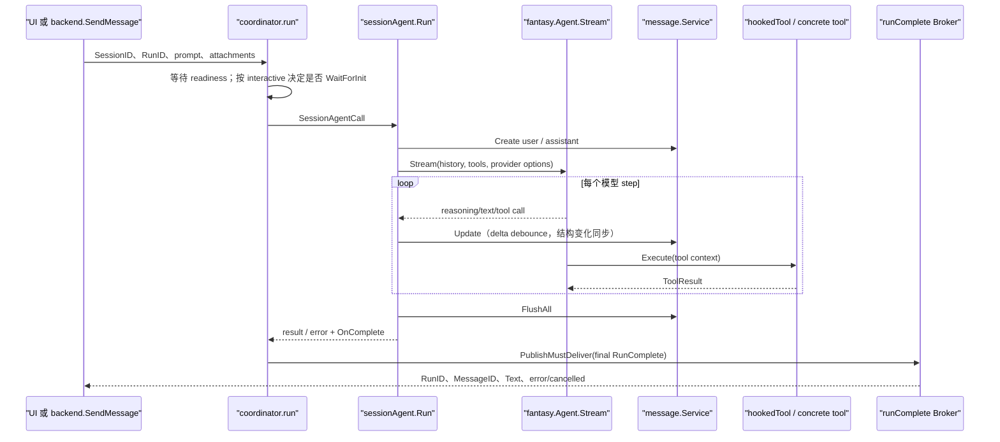

# 04. Agent 运行时：从一次请求到完整对话循环

> 状态：待复核生成稿｜生成日期：2026-08-14
> 基准提交：`5712d4839a6a10e9940804d511bb322dbe73a511`｜工作区：clean（开始分析时）
> 源码范围：`internal/agent/`、`internal/message/`、`internal/session/`
> 生成方式：实现与 dispatch、cancel、queue、completion 测试交叉分析

## 快速摘要

### 架构总览（模块与依赖）
Coordinator 处理工作区级模型、工具和认证刷新；SessionAgent 处理单 Session 的 dispatch、流式循环、消息持久化、排队和取消。

### 核心调用序列（逐步逻辑）
1. Coordinator 等待必要初始化并刷新模型。2. 构造 SessionAgentCall。3. SessionAgent 选择 active/queued/cancel-on-entry。4. Stream 消息与工具结果。5. flush 后发布 RunComplete。

### 易错点与边界条件
带 RunID 的 queued prompt 必须独立成 turn；accepted run 取消采用序列高水位；认证重试的多个 completion 只能对外发布最终结果。

> 阅读范围：`internal/agent/` 的生产代码与对应测试。本章以“能够重新实现”为目标，先讲职责，再按真实执行顺序展开。

## 1. 先建立正确心智模型

Crush 的 Agent 不是一个单独的“调用模型”函数，而是两层协作：

| 层 | 核心类型 | 主要职责 |
| --- | --- | --- |
| 配置与编排层 | `Coordinator` / `coordinator` | 读取最新配置、构造 Provider 与模型、生成系统提示词、注册工具、刷新认证、运行子 Agent、把一次调用交给 SessionAgent |
| 会话执行层 | `SessionAgent` / `sessionAgent` | 保证同一 Session 串行、维护排队与取消、加载历史、调用 Fantasy 流式循环、持久化消息、累计 Token/费用、摘要与标题 |

不要把两层合并。Coordinator 适合处理“工作区级且会因配置变化而变化”的事情；SessionAgent 适合处理“某个会话的一次 turn 如何安全落库”的事情。`fantasy.Agent` 则是更底层的模型—工具循环器，由 SessionAgent 在每次 Run 中临时创建。

关键入口：

- `NewCoordinator`：创建工作区级编排器，只固定 coder Agent 的外壳。
- `coordinator.run`：每次请求重新刷新模型与工具，再组装 `SessionAgentCall`。
- `sessionAgent.Run`：真正执行一个 turn。
- `fantasy.Agent.Stream`：驱动“模型输出→工具调用→工具结果→再次请求模型”的多 step 循环。

## 2. 关键类型与状态

### 2.1 `Model`

同时保存三种信息：已构造的 `fantasy.LanguageModel`、Catwalk 的模型能力元数据、用户选中的 `config.SelectedModel`。能力元数据决定上下文窗口、图片支持、默认输出长度和推理等级；用户配置可以覆盖温度、TopP、TopK、惩罚参数、最大 Token 和 ProviderOptions。

### 2.2 `SessionAgentCall`

它是一次 turn 的完整输入：SessionID、RunID、文本、附件、Provider 参数、采样参数，以及三个重要回调/句柄：

- `Accepted`：服务端异步派发前取得的预约，用于堵住“请求已接受但 goroutine 尚未进入 Run”这一取消盲区。
- `OnComplete`：Coordinator 用它暂存一次尝试的 `RunComplete`，避免认证失败后重试时先发出一个过期失败事件。
- `OnAuthRefresh`：Fantasy 收到 401 后调用，刷新 OAuth、AWS SSO 或动态 API Key，然后由 Fantasy 重试。

`acceptSeq` 是内部字段。排队时会从 `AcceptedRun` 复制序号，用来判断这个请求是在 Cancel 之前还是之后被接受。

### 2.3 `sessionAgent` 的并发状态

- `activeRequests[sessionID]`：当前活动请求对应的取消函数。
- `messageQueue[sessionID]`：繁忙时进入的后续请求。
- `dispatchMu[sessionID]`：把“取消入场 / 入队 / 成为 active”三选一变成原子决策。
- `acceptedRuns[sessionID]`：已派发但尚未完成交接的数量。
- `cancelMark[sessionID]`：Cancel 时记录的全局接受序号高水位。
- `acceptSeqGen`：全 Agent 单调递增序号。

`activeCancel` 特意用指针包装 `CancelFunc`。完成清理使用 `CompareAndDelete`，旧 Run 的 defer 只能删除自己的指针，不能误删刚注册的新 Run。

## 3. Coordinator 初始化

`NewCoordinator` 的顺序：

1. 接收配置、Session、Message、Permission、Question、History、FileTracker、LSP、通知 Broker 等依赖。
2. 优先使用调用方预发现的 `skills.Manager`；遗留调用方才在这里同步发现 Skill。
3. 以 active skill 创建 `skills.Tracker`。
4. 读取 coder Agent 配置并构造 coder prompt 模板。
5. `buildAgent` 先构造 large/small Model 和空工具、空系统提示的 SessionAgent。
6. 两个 `readyWg` goroutine 分别生成系统提示与按当前注册表构建工具；它们不等待
   MCP 初始化，后续 run 会按交互模式决定是否等待，晚到的 MCP 工具在之后的
   `UpdateModels` 中进入工具表。

初始化 goroutine 使用 `context.WithoutCancel`：HTTP 初始化请求结束不能让工作区永久处于 `readyWg.Wait()` 返回 `context.Canceled` 的坏状态。测试 `TestBuildAgentReadinessSurvivesCallerCancellation` 固化了这个约束。

## 4. 一次 Coordinator.Run 的逐步时序

下面严格按 `coordinator.run` 的代码顺序：

1. 等待系统提示和初始工具表的本地构建任务完成。
2. 非交互 Coordinator 调用 `mcp.WaitForInit(ctx)`，确保单次运行读取到初始化
   完成时的工具表；交互 Coordinator 不等待慢 MCP，先用当前已注册工具运行，
   后续 turn 再拾取新工具，避免首条提示被最慢连接超时冻结。
3. `UpdateModels`：从最新配置重建 large/small Model，同时重建工具列表并原子替换进 SessionAgent。
4. 计算最大输出 Token：用户模型配置优先，否则用 Catwalk 默认值。
5. 合并调用参数。ProviderOptions 的优先级是 Catwalk 默认 < Provider 配置 < SelectedModel 配置；普通采样参数是用户值优先于 Catwalk。
6. 若 OAuth Token 已过期，先主动刷新；失败只记录日志，仍进入调用，让后续 401 流程驱动交互认证。
7. 创建 `OnComplete` 闭包，只保留最后一次 terminal payload。
8. 从 Context 取 RunID，构造 `SessionAgentCall`，传入 Accepted 句柄与认证刷新回调。
9. 记录调用前已加载的 Skill 名称，执行 `SessionAgent.Run`，结束后记录本 turn 新加载与可能相关但未加载的 Skill。
10. 若最终仍为 Hyper 401，通知 UI 重新认证。
11. 把最后一次 `RunComplete` 用 must-deliver 发布，并在 Context 中标记已发布，避免 HTTP dispatcher 再发一次兜底事件。

Provider 专属选项由 `getProviderOptions` 转换。例如 OpenAI Responses、Anthropic thinking/effort、Google thinking_config、OpenRouter reasoning、OpenAI-compatible extra_body 都在这里适配。`ModelProvider` 回调使认证刷新后下一次重试可取得刚重建的 Model，而不是继续使用旧凭据对象。

## 5. SessionAgent.Run 的完整生命周期

### 5.1 校验与派发交接

`ValidateCall` 要求 SessionID 非空，并且 prompt 非空或至少含文本附件。随后锁住该 Session 的 `dispatchMu`：

1. 若 Accepted 序号被 cancelMark 覆盖：关闭预约，解锁，持久化 user + canceled assistant，不进入模型流，并发布唯一 `RunComplete(cancelled=true)`。
2. 若 Session 已 busy：调用 `enqueueCall`。它复制 acceptSeq、移除 `Accepted` 和 `OnComplete`，关闭预约后立即返回。
3. 若空闲：在锁内创建 `genCtx`，先写入 `activeRequests`，再关闭预约和解锁。这样 Cancel 不会落在“busy 检查之后、cancel func 注册之前”的缝隙。

### 5.2 准备 Agent 和历史

Run 对 tools/models/system prompt 做并发安全快照；把已连接 MCP Server 的 instructions 追加到 `<mcp-instructions>`；给最后一个工具加 Provider cache-control；创建本 turn 专用的 `fantasy.Agent`。

然后读取 Session 和消息历史。如果历史中还没有真实用户文本，异步生成标题。接着持久化用户消息。`preparePrompt` 会：

- 把数据库消息转成 Fantasy 消息。
- 修复孤立 tool-use/tool-result，避免 Provider 拒绝不成对的历史。
- 仅把模型支持的图片附件送入本次模型输入，但用户消息仍保留所有附件。
- 针对文本模型、视觉模型和 Anthropic 的媒体限制做降级/转换。

### 5.3 调用 `fantasy.Agent.Stream`

请求包含 prompt、文件、历史、Session header、ProviderOptions 与采样参数。MaxOutputTokens 为 0 时传 nil，兼容会拒绝 0 的本地 Provider。

#### `PrepareStep`

Fantasy 每次准备向模型发起一个 step 前调用：

1. 清除历史残留 ProviderOptions，使用最新工具快照。
2. 处理队列：无 RunID 的普通交互 follow-up 可折叠进当前 step；带 RunID 的独立调用保留，稍后作为独立 turn 执行；被 cancelMark 覆盖的项丢弃，带 RunID 的仍补发 canceled completion。
3. 再做媒体兼容处理。
4. 给最后一个 system message 和最后两条消息加 cache-control。
5. 如 Provider 配置了 `SystemPromptPrefix`，在最前插入 system message。
6. 保存本 step 消息快照，供 Token 缺失时估算。
7. 创建一条新的 assistant 数据库消息，并把 MessageID、图片能力、模型名写入工具 Context。

每个 step 都可能创建一个 assistant 消息，因为一次模型工具循环可以经历多轮 assistant/tool/assistant。

#### 流式回调

- Reasoning start/delta/end：增量写 reasoning；在结束时保存 Anthropic signature、Google thought signature、OpenAI Responses reasoning metadata，再结束 thinking 状态。
- Text delta：首段移除一个开头换行，追加正文并调用 Message.Update。
- Tool input start：先创建未完成 `ToolCall`，即使中途取消 UI 也能看到调用已经开始。
- Tool call：清理非法 JSON；完成工具调用记录。若输入被修复标记，之后强制把工具结果改成格式错误。
- Tool result：转换文本/媒体响应并新建 role=tool 消息。
- Retry：记录结构化 Provider 错误，清空当前尝试已流出的内容，避免重试内容拼接。
- Step finish：映射 length/stop/tool_calls/content_filter 到数据库 FinishReason；若工具响应 `StopTurn`，把 tool-use 改为 end-turn；更新 Token、费用、Session 并持久化 assistant。

所有中间 Message.Update 会通过消息服务向订阅者发布，构成 UI 的流式体验。Run 的 defer 最后 `FlushAll`，然后才发布权威 `RunComplete`；后者还内嵌最终 MessageID/Text，用来修复不同 Broker 事件乱序。

### 5.4 停止条件

除 Fantasy 正常结束外有两项自定义条件：

- 自动摘要：上下文窗口 > 200k 时保留 20k buffer，否则剩余低于窗口 20%；未知窗口 0 禁止自动摘要。
- 工具循环检测：最近窗口内相同工具输入/输出签名重复达到阈值时停止，防止 Agent 原地循环。

Provider 没给 usage 时，`fallbackStepUsage` 估算文本、reasoning、tool call、tool result 和媒体 Token。估算 usage 更新计数，但不虚构费用；Provider 明确给出的 cost 仍累加。

### 5.5 错误与取消收尾

如果取消发生在 assistant 创建前，补写 canceled assistant。若已有 assistant：使用脱离取消、限时 5 秒的 cleanup context；结束 thinking；补齐所有未完成 tool call 和缺失 tool result；再根据错误类型写 canceled、Hyper Unauthorized、Copilot 未启用、Provider Error、Transport Error 等 finish 信息。

无论正常或错误，defer 都先 Flush 消息，再生成恰好一个 `RunComplete`。这条“消息尽量先到、completion 必须到”的契约是非交互客户端不会挂死的核心。

### 5.6 正常结束、摘要与队列递归

若达到摘要阈值，先移除 active，再调用小模型生成 summary；如果上一次因长度中断且有工具调用，把带“会话过长”的恢复 prompt 重新入队。

正常完成后：

1. 先删除 active 并 cancel，再发 AgentFinished 通知，避免 UI 收到通知时仍观察到 busy。
2. 在 dispatchMu 下检查队列与 cancelMark。
3. 丢弃 Cancel 之前接受的队列项，保留 Cancel 之后的高序号项。
4. 取下一项，创建新的 Accepted 预约后递归 `Run`，保证 dequeue 到重新注册 active 期间 Cancel 仍能看到 accepted 状态。
5. 外层设置 `skipRunComplete`，让每个排队请求只由自己的递归 turn 发布一次 completion。

## 6. AcceptedRun、队列与取消竞态

这是重写时最不能简化的部分。

### 6.1 为什么普通 cancel map 不够

服务端通常先接受 HTTP 请求，再启动 goroutine。此时 UI 可能马上按 Escape：goroutine 尚未进入 Run，activeRequests 为空，Cancel 会丢失。`BeginAccepted` 在派发之前增加计数并取得序号；Cancel 看见 acceptedRuns>0 就写 cancelMark；Run 入场后按序号走 cancel-on-entry。

### 6.2 高水位语义

Cancel 时 `cancelMark=session.acceptSeqGen`。序号 `<= mark` 的预约都被取消；之后新接受的序号 `> mark` 不受影响。没有 Accepted 的本地排队项序号为 0，只要存在 mark 就视作被覆盖。空闲时 Cancel 不写 mark，因此不会毒害下一条 prompt。

### 6.3 AcceptedRun.Close

必须幂等且 nil-safe，只能把 acceptedRuns 减一次；计数为零时删除 map 项。任何路径——active、queue、cancel-on-entry、派发失败——都必须 Close，否则 Session 会永远看起来有交接中的请求。

### 6.4 带 RunID 与不带 RunID 的队列差异

- 不带 RunID：交互式 follow-up 可以在下一个 PrepareStep 折叠进同一个模型 turn。
- 带 RunID：调用方在等待自己唯一的 terminal event，不能折叠，必须独立递归执行；若被清队，也必须发布 canceled RunComplete。

## 7. 摘要与标题

`GenerateTitle` 使用 small Model 和内嵌 `title.md`，只针对第一条真实用户 prompt，清除 `<think>` 标签，更新默认标题。它使用 detached context 异步执行，不阻塞首屏回答。

`Summarize` 使用 small Model 和 `summary.md`：加载历史与 todos，生成 summary assistant 消息，更新 reasoning/text 流；成功后把 Session 的 summary message ID 设为该消息，并用摘要后的 Token 重置上下文统计。用户取消则删除半成品 summary。Coordinator 在摘要前也处理认证刷新。

## 8. 子 Agent

`agent` 工具根据 task Agent 配置构建 `IsSubAgent=true` 的 SessionAgent。调用时必须从 Context 得到父 SessionID 与当前 assistant MessageID，以 `父消息ID + ToolCallID` 创建稳定子 Session，并执行 `runSubAgent`。

子 Agent：

- 使用独立 task Session 和消息历史。
- `NonInteractive=true`，不发普通完成通知。
- 工具不会再次包 Hook；只有父 coder 对 `agent` 这个顶层工具调用执行一次 Hook。
- 完成后把子 Session cost 累加到父 Session；失败只记录 warning，不丢失已生成输出。
- 最终只把最后 AgentResult 的文本作为工具响应返回。

`agentic_fetch` 是专用小模型子 Agent：先对顶层 fetch 请求权限；URL 大内容保存临时文件，小内容直接嵌入 prompt；只给 web_fetch、web_search、glob、grep、sourcegraph、view；临时 Session 自动批准内部权限；结束清理临时目录。

## 9. 测试所表达的不变量

实现后至少保持这些测试语义：

- 同一 Session 并发 Run 只有一个真正进入 Stream。
- Cancel 同时覆盖 active 与当时所有 accepted；Cancel 后新 accepted 不被误杀。
- idle Cancel 不影响下一次请求；正常完成清除旧 cancel mark。
- cancel-on-entry 仍写 user/canceled assistant，且仍发唯一 RunComplete。
- queue 会剥离旧 `OnComplete`；带 RunID 队列独立递归且一定收到 completion。
- `PublishMustDeliver` 在普通 publish 因缓冲满而丢弃的条件下仍交付终态。
- orphan tool use 被清理；附件持久化与模型可见性分离。
- Provider 未返回 usage 时估算合理，估算值不产生虚构成本。
- 重复工具调用检测同时考虑工具名、输入与结果。

重点测试文件：`accepted_run_test.go`、`dispatch_cancel_test.go`、`dispatch_race_test.go`、`queued_runid_test.go`、`run_complete_test.go`、`usage_fallback_test.go`、`loop_detection_test.go`、`agent_test.go`、`coordinator_test.go`。

## 10. 从零复刻建议顺序

1. 先定义 Message/Session 服务接口和纯串行 SessionAgent，不接工具。
2. 接入 Fantasy Stream，完整实现流式回调与消息落库。
3. 增加 step finish、usage/cost、错误收尾和唯一 RunComplete。
4. 加入每 Session active map 与 dispatchMu，写并发测试。
5. 再加入 AcceptedRun 序号、cancelMark、队列折叠/独立递归；逐个复刻竞态测试。
6. 实现 title、summary、loop detection 和媒体兼容。
7. 最后实现 Coordinator 的配置刷新、ProviderOptions、认证刷新和子 Agent。

每一步都应先使对应测试通过再继续；尤其不要用 sleep 测竞态，应像现有测试一样用 channel/gate 精确控制交接窗口。
