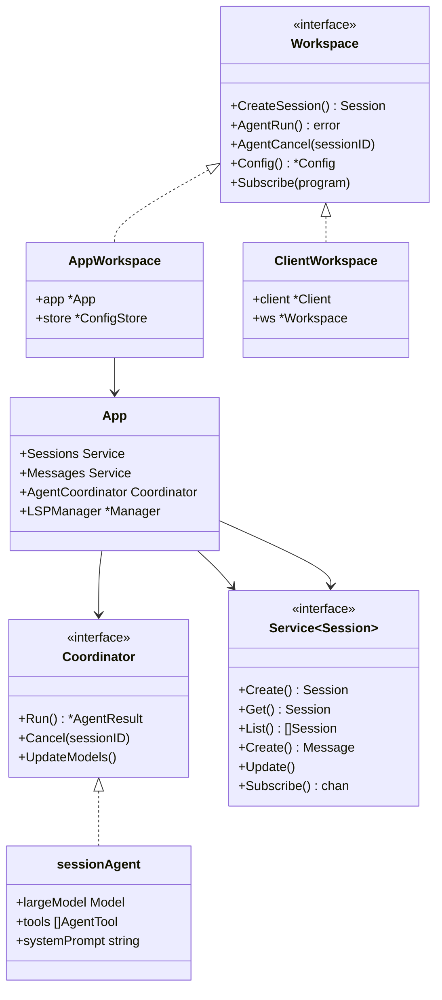
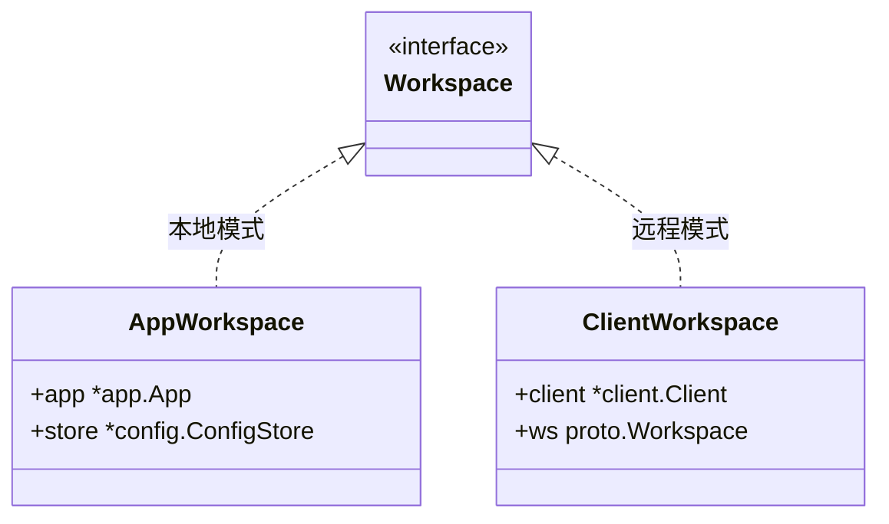
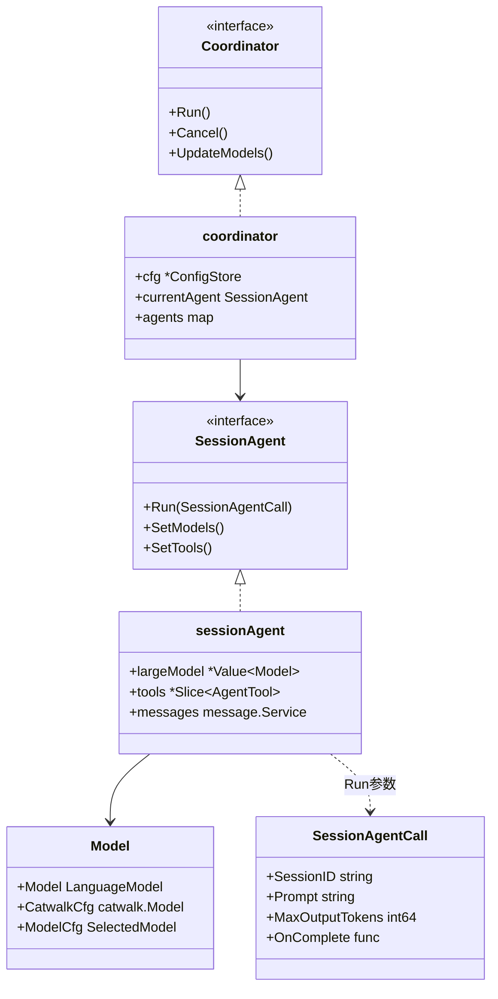
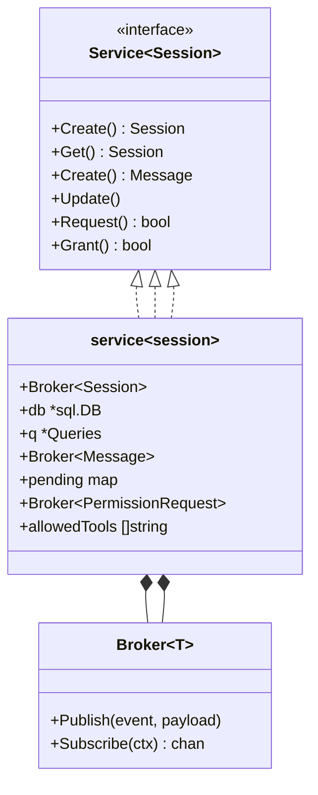
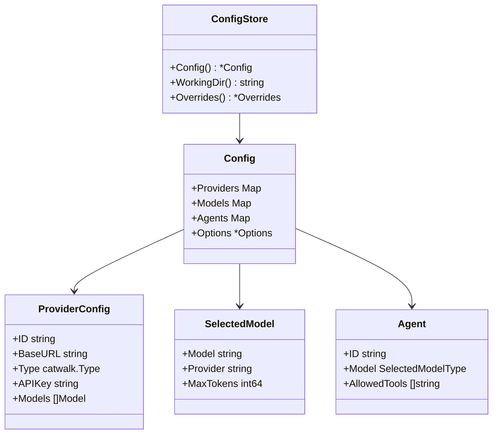
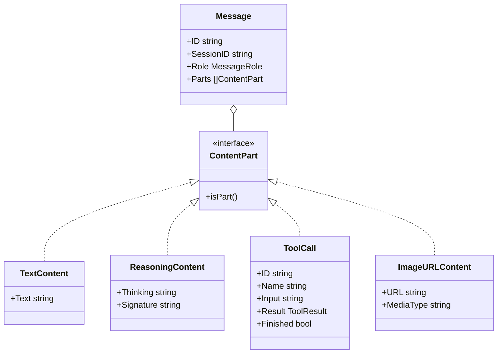

[上一篇：03-详细逐步说明-主链路拆解](03-详细逐步说明-主链路拆解.md) · [总目录](README.md) · [下一篇：05-Agent协调器与会话管理](05-Agent协调器与会话管理.md)

# 核心模块与类关系

> **场景**：理解 Crush 核心模块之间的 Struct / Interface / Embed 关系，为后续模块详解建立基础。
> **时间**：2026-08-27 (CST)
> **版本**：Crush @ main branch, Go 1.26.6

## 本文件内容

1. [核心接口关系图](#1-核心接口关系图)
2. [Workspace 接口体系](#2-workspace-接口体系)
3. [Agent 层类型关系](#3-agent-层类型关系)
4. [服务层类型关系](#4-服务层类型关系)
5. [事件系统类型关系](#5-事件系统类型关系)
6. [配置层类型关系](#6-配置层类型关系)
7. [消息类型体系](#7-消息类型体系)

## 1. 核心接口关系图



## 2. Workspace 接口体系

### Workspace 接口定义

```
internal/workspace/workspace.go
Interface：Workspace
```

`Workspace` 是所有前端（TUI、CLI）与后端交互的统一抽象。包含 40+ 方法，覆盖 Session 管理、Agent 控制、权限、LSP、MCP、配置等。

关键方法分组：

| 分组 | 方法 | 说明 |
|------|------|------|
| Session | `CreateSession`, `GetSession`, `ListSessions`, `SaveSession`, `DeleteSession` | 会话 CRUD |
| Agent | `AgentRun`, `AgentCancel`, `AgentIsBusy`, `AgentModel`, `AgentIsReady` | Agent 控制 |
| Permission | `PermissionGrant`, `PermissionDeny`, `PermissionSkipRequests` | 权限管理 |
| Config | `Config`, `WorkingDir`, `UpdatePreferredModel` | 配置访问和修改 |
| LSP | `LSPStart`, `LSPStopAll`, `LSPGetStates` | LSP 控制 |
| MCP | `MCPGetStates`, `MCPRefreshPrompts`, `RefreshMCPTools` | MCP 控制 |
| Events | `Subscribe`, `Shutdown` | 事件订阅和生命周期 |

### AppWorkspace

```
internal/workspace/app_workspace.go
Struct：AppWorkspace
字段：app → *app.App
字段：store → *config.ConfigStore
```

本地模式实现，直接委托给 `app.App`。

### ClientWorkspace

```
internal/workspace/client_workspace.go
Struct：ClientWorkspace
字段：client → *client.Client
字段：ws → proto.Workspace
字段：config → *config.Config
```

客户端/服务器模式实现，通过 HTTP API 委托给远程服务器。



## 3. Agent 层类型关系

### Coordinator 接口

```
internal/agent/coordinator.go
Interface：Coordinator
方法：Run(ctx, sessionID, prompt) → *fantasy.AgentResult
方法：Cancel(sessionID)
方法：IsSessionBusy(sessionID) → bool
方法：UpdateModels(ctx) → error
方法：GenerateTitle(ctx, sessionID, prompt)
方法：Summarize(ctx, sessionID) → error
```

### coordinator 实现

```
internal/agent/coordinator.go
Struct：coordinator
字段：cfg         → *config.ConfigStore
字段：sessions    → session.Service
字段：messages    → message.Service
字段：permissions → permission.Service
字段：currentAgent → SessionAgent
字段：agents      → map[string]SessionAgent
字段：allSkills   → []*skills.Skill
字段：activeSkills → []*skills.Skill
字段：skillTracker → *skills.Tracker
字段：readyWg     → errgroup.Group
```

### SessionAgent 接口

```
internal/agent/agent.go
Interface：SessionAgent
方法：Run(ctx, SessionAgentCall) → *fantasy.AgentResult
方法：SetModels(large Model, small Model)
方法：SetTools(tools []fantasy.AgentTool)
方法：SetSystemPrompt(prompt string)
方法：Cancel(sessionID)
方法：IsSessionBusy(sessionID) → bool
方法：Model() → Model
方法：GenerateTitle(ctx, sessionID, userPrompt)
```

### sessionAgent 实现

```
internal/agent/agent.go
Struct：sessionAgent
字段：largeModel         → *csync.Value[Model]
字段：smallModel         → *csync.Value[Model]
字段：systemPrompt       → *csync.Value[string]
字段：systemPromptPrefix → *csync.Value[string]
字段：tools              → *csync.Slice[fantasy.AgentTool]
字段：sessions           → session.Service
字段：messages           → message.Service
字段：messageQueue       → *csync.Map[string, []SessionAgentCall]
字段：activeRequests     → *csync.Map[string, *activeCancel]
字段：dispatchMu         → *csync.Map[string, *sync.Mutex]
```

### Model 结构

```
internal/agent/agent.go
Struct：Model
字段：Model      → fantasy.LanguageModel
字段：CatwalkCfg → catwalk.Model
字段：ModelCfg   → config.SelectedModel
字段：FlatRate   → bool
```

### 类型关系图



## 4. 服务层类型关系

每个服务都遵循相同模式：`Service` 接口 + `service` 实现 + 嵌入 `pubsub.Broker`。

### Session Service

```
internal/session/session.go
Interface：Service
方法：Create(ctx, title) → Session
方法：Get(ctx, id) → Session
方法：List(ctx) → []Session
方法：Save(ctx, session) → Session
方法：Delete(ctx, id) → error
```

```
internal/session/session.go
Struct：Session
字段：ID               → string
字段：ParentSessionID  → string
字段：Title            → string
字段：MessageCount     → int64
字段：PromptTokens     → int64
字段：CompletionTokens → int64
字段：Cost             → float64
字段：Todos            → []Todo
字段：CreatedAt        → int64
字段：UpdatedAt        → int64
```

```
internal/session/session.go
Struct：service（嵌入 *pubsub.Broker[Session]）
字段：db → *sql.DB
字段：q  → *db.Queries
```

### Message Service

```
internal/message/message.go
Interface：Service
方法：Create(ctx, sessionID, params) → Message
方法：Update(ctx, message) → error
方法：Get(ctx, id) → Message
方法：List(ctx, sessionID) → []Message
方法：Flush(ctx, id) → error
方法：FlushAll(ctx) → error
```

```
internal/message/message.go
Struct：service（嵌入 *pubsub.Broker[Message]）
字段：q        → db.Querier
字段：debounce → time.Duration
字段：pending  → map[string]*pendingState
```

### Permission Service

```
internal/permission/permission.go
Interface：Service
方法：Request(ctx, opts) → (bool, error)
方法：Grant(perm) → bool
方法：GrantPersistent(perm) → bool
方法：Deny(perm) → bool
方法：AutoApproveSession(sessionID)
方法：SkipRequests() → bool
```

```
internal/permission/permission.go
Struct：PermissionRequest
字段：ID          → string
字段：SessionID   → string
字段：ToolCallID  → string
字段：ToolName    → string
字段：Description → string
字段：Action      → string
字段：Params      → any
```

### 服务关系图



## 5. 事件系统类型关系

### PubSub Broker

```
internal/pubsub/broker.go
Struct：Broker[T]
字段：subs               → map[chan Event[T]]struct{}
字段：mu                 → sync.RWMutex
字段：done               → chan struct{}
字段：channelBufferSize  → int
字段：mustDeliverTimeout → time.Duration
字段：dropCount          → atomic.Uint64
字段：mustDeliverDropCount → atomic.Uint64
```

两种发布模式：

| 方法 | 语义 | 用途 |
|------|------|------|
| `Publish` | 尽力投递，channel 满则丢弃 | 高频中间更新（流式 token） |
| `PublishMustDeliver` | 有界阻塞，超时 50ms 才丢弃 | 终端事件（finish, error, cancel） |

```
internal/pubsub/broker.go
Const：bufferSize
值：4096
```

```
internal/pubsub/broker.go
Const：defaultMustDeliverTimeout
值：50 * time.Millisecond
```

### 事件类型

```
internal/pubsub/events.go
Type：EventType
值：CreatedEvent
值：UpdatedEvent
值：DeletedEvent
```

### App 事件桥接

```
internal/app/app.go
函数：setupEvents
偏移：+0 ～ +24
```

将 9 个服务事件流桥接到 `app.events`（主事件总线）：

| 服务 | 事件类型 | 投递模式 |
|------|---------|---------|
| sessions | session.Session | Publish |
| messages | message.Message | Publish |
| permissions | permission.PermissionRequest | MustDeliver |
| permissions-notifications | permission.PermissionNotification | MustDeliver |
| question-batches | question.Batch | MustDeliver |
| question-notifications | question.Notification | MustDeliver |
| history | history.File | Publish |
| agent-notifications | notify.Notification | Publish |
| run-completions | notify.RunComplete | MustDeliver |

## 6. 配置层类型关系

### ConfigStore

```
internal/config/store.go
Struct：ConfigStore
```

`ConfigStore` 是配置的运行时容器，提供：
- `Config()` → `*Config`（纯数据）
- `WorkingDir()` → string
- `Overrides()` → runtime 覆盖项
- `Resolver()` → 变量解析器

### Config

```
internal/config/config.go
Struct：Config
字段：Providers  → csync.Map[string, ProviderConfig]
字段：Models     → map[SelectedModelType]SelectedModel
字段：Agents     → map[string]Agent
字段：Options    → *Options
字段：LSP        → map[string]LSPClientConfig
字段：MCP        → map[string]MCPServerConfig
字段：Permissions → *PermissionsConfig
字段：Hooks      → map[HookEvent][]Hook
```

### SelectedModel

```
internal/config/config.go
Struct：SelectedModel
字段：Model           → string
字段：Provider        → string
字段：ReasoningEffort → string
字段：Think           → bool
字段：MaxTokens       → int64
字段：Temperature     → *float64
字段：ProviderOptions → map[string]any
```

### ProviderConfig

```
internal/config/config.go
Struct：ProviderConfig
字段：ID      → string
字段：Name    → string
字段：BaseURL → string
字段：Type    → catwalk.Type
字段：APIKey  → string
字段：Models  → []catwalk.Model
```

### SelectedModelType

```
internal/config/config.go
Type：SelectedModelType
值：SelectedModelTypeLarge → "large"
值：SelectedModelTypeSmall → "small"
```

### 配置关系图



## 7. 消息类型体系

### Message

```
internal/message/message.go
Struct：Message
字段：ID              → string
字段：SessionID       → string
字段：Role            → MessageRole
字段：Parts           → []ContentPart
字段:Model            → string
字段：Provider        → string
字段：IsSummaryMessage → bool
```

### MessageRole

```
internal/message/content.go
Type：MessageRole
值：Assistant → "assistant"
值：User      → "user"
值：System    → "system"
值：Tool      → "tool"
```

### ContentPart 体系

```
internal/message/content.go
Interface：ContentPart
方法：isPart()
```

实现类：

| 类型 | 字段 | 说明 |
|------|------|------|
| `TextContent` | `Text string` | 文本内容 |
| `ReasoningContent` | `Thinking`, `Signature`, `ThoughtSignature` | 推理过程 |
| `ImageURLContent` | `URL`, `MediaType`, `Base64Data` | 图片内容 |
| `ToolCall` | `ID`, `Name`, `Input`, `Result`, `Finished` | 工具调用 |
| `AttachmentContent` | `Filename`, `MimeType`, `Base64Data` | 附件 |

### FinishReason

```
internal/message/content.go
Type：FinishReason
值：FinishReasonEndTurn       → "end_turn"
值：FinishReasonMaxTokens     → "max_tokens"
值：FinishReasonToolUse       → "tool_use"
值：FinishReasonCanceled      → "canceled"
值：FinishReasonError         → "error"
值：FinishReasonContentFilter → "content_filter"
```

### 消息类型关系图



---

[上一篇：03-详细逐步说明-主链路拆解](03-详细逐步说明-主链路拆解.md) · [总目录](README.md) · [下一篇：05-Agent协调器与会话管理](05-Agent协调器与会话管理.md)