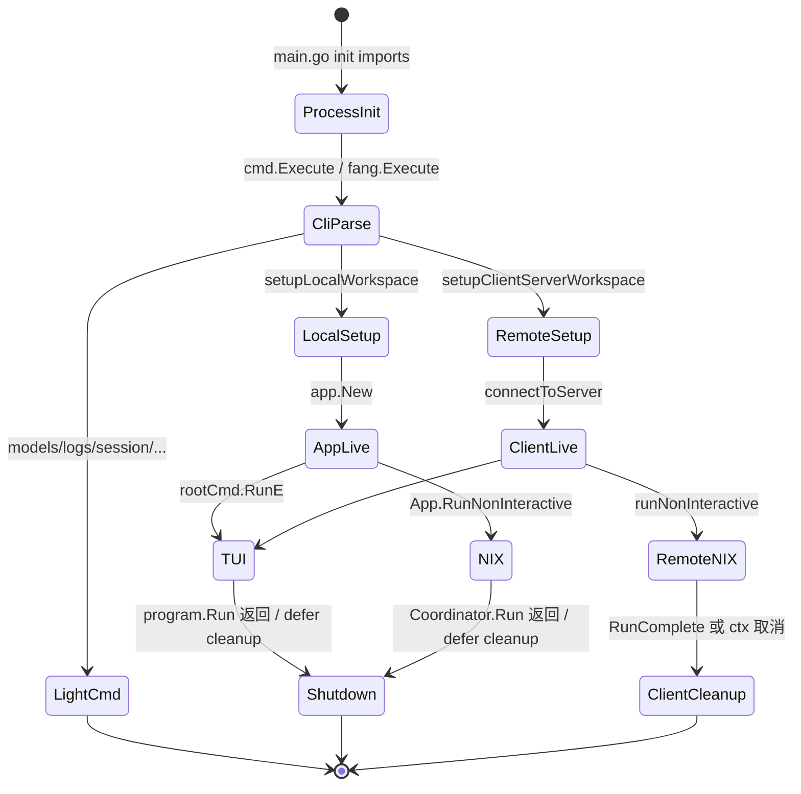
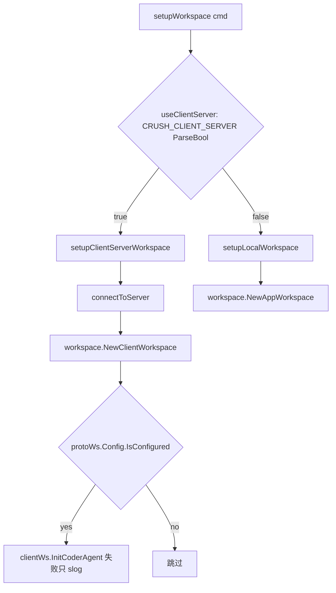

# 04. 运行入口与生命周期

> 状态：待复核生成稿
> 生成日期：2026-08-16
> 基准提交：`16dce459cafecee92eae0ed7c47a0c641c8bbb9f`
> 工作区：clean
> 源码范围：`main.go`、`internal/cmd/`（含全部子命令与 `*_test.go`）、`internal/app/`、`internal/dns/`、`internal/version/`
> 生成方式：源码、测试、配置与部署资产静态分析
> 所属层：第四层

## 快速摘要

### 架构总览（模块与依赖）

Crush 进程从 `main.go` 进入，由 `internal/cmd` 的 Cobra 树决定走哪条入口。
默认形态下，交互 `crush` 与本地 `crush run` 都在本进程装配 `app.App`，再包成
`workspace.AppWorkspace`。`CRUSH_CLIENT_SERVER=1` 时，CLI 只持有
`client.Client` + `workspace.ClientWorkspace`，真实 App 在独立 `crush server`
进程里。`logout` 是例外：它**总是**走 `connectToServer`，即使未开 Client/Server
也会拉起 Server。多数只读子命令（`models`、`logs`、`dirs`、`projects`、
`session`、`stats`、`schema`、`update-providers`）不装配完整 App。

依赖方向：`main` → `cmd` →（`config` / `db` / `skills` / `app` 或 `client`+`server`）
→ `workspace` → TUI 或非交互循环。`app.App` 是单工作区装配根；它不认识 HTTP。

### 核心调用序列（逐步逻辑）

1. 包 `init`：`godotenv/autoload` 读 `.env`；`internal/dns` 在 Termux 改 DNS；
   `net/http/pprof` 注册调试路由。
2. `main.go:main`：可选启动 `localhost:6060` pprof，再调用 `cmd.Execute`。
3. `cmd.Execute`：把 slog 丢弃，给 `--version` 加心形 banner，交给
   `fang.Execute`（版本、中断信号、推断会注入 `completion`/`man`）。
4. 交互走 `rootCmd.RunE`：`setupWorkspace` → `ui.New` → `tea.NewProgram.Run`
   → `printSessionResume` → `defer cleanup` → `App.Shutdown`。
5. 非交互走 `runCmd.RunE`：本地调 `App.RunNonInteractive`；Client/Server 调
   `runNonInteractive`，以匹配 `RunID` 的 `RunComplete` 退出。
6. `App.Shutdown` **先** `Coordinator.CancelAll` 并 `Messages.FlushAll`，再并行
   关 Shell/LSP/MCP/事件总线，最后 `db.Release`。

### 易错点与边界条件

- `--yolo` / `--session` / `--continue` 是 **root 本地 flag**，不传给子命令；
  `crush run` 自己重新声明了 `--session`/`--continue`。非交互路径本来就会
  `Permissions.AutoApproveSession`，YOLO 主要服务 TUI。
- `--channels` 必须是 **PersistentFlags**，否则 `crush run --channels` 会
  unknown flag（`channels_flag_test.go` 专门锁住这一点）。
- 本地 `crush run` 以 `Coordinator.Run` 返回为退出条件；Client/Server 的
  `crush run` 以匹配 `RunID` 的 `RunComplete` 为退出条件。二者不是同一协议。
- `logout` 无条件 `connectToServer`；`login` 走 `setupWorkspace`。不要假设
  认证命令共享同一进程模型。
- `cmd.createDotCrushDir` 当前无调用方（死代码）。本地启动只写 `*\n`
  `.gitignore`，不会把旧文件升级成带 `!skills/` 的嵌入模板。
- 本地 `crush run --continue` 走 `GetLastSession`（不过滤子 Session）；
  CS 路径的 `--continue` 在 `ListSessions` 结果里跳过 `ParentSessionID != ""`。
- 本轮未运行完整 `go test`，不声明测试通过。

## 目录

1. [为什么这样设计（Why）](#1-为什么这样设计why)
2. [它是什么（What）](#2-它是什么what)
3. [进程启动顺序（How）](#3-进程启动顺序how)
4. [Cobra 树、Flag 与 Fang](#4-cobra-树flag-与-fang)
5. [Workspace 选择](#5-workspace-选择)
6. [本地 App 装配顺序](#6-本地-app-装配顺序)
7. [Client/Server 连接与 Server 生命周期](#7-clientserver-连接与-server-生命周期)
8. [TUI 启动与退出提示](#8-tui-启动与退出提示)
9. [`crush run` 两条路径](#9-crush-run-两条路径)
10. [各 CLI 子命令](#10-各-cli-子命令)
11. [Shutdown 顺序](#11-shutdown-顺序)
12. [测试覆盖与缺口](#12-测试覆盖与缺口)
13. [调用关系表](#13-调用关系表)
14. [阅读源码建议顺序](#14-阅读源码建议顺序)
15. [重新实现检查清单](#15-重新实现检查清单)

## 1. 为什么这样设计（Why）

Crush 同时要服务三种用户动作：打开一个能持续对话的 TUI、用管道跑完一轮就
退出、以及少量不需要 Agent 的运维命令（看日志、列模型、管 Session）。如果
每种动作都启动完整 MCP/LSP/Coordinator，启动会慢、副作用会乱。所以入口按
“要不要 Workspace、要不要 App、要不要 Server”分层。

Client/Server 是可选的第二进程形态，不是默认。默认仍是单进程 `AppWorkspace`，
避免用户为一次 `crush` 再养一个常驻服务。`CRUSH_CLIENT_SERVER=1` 时，多个
前端可以共享一个 Server，并在版本不匹配时尝试替换空闲 Server。替换必须由
Server 自己决定：`BuildID` 来自可执行文件 mtime，`go run` 每次都会变，若
客户端无条件杀 Server，会把第一个 Session 的工作区带走
（`restart_stale_test.go` 的回归点）。

非交互退出不能猜“助手消息是不是结束了”。工具调用也会产生带
`FinishReasonToolUse` 的助手消息，旧逻辑会在中途退出。现在本地路径等
`Coordinator.Run` 返回；远程路径等带 `RunID` 的 `RunComplete`。

关闭时必须先停 Agent 再关 DB：流式消息有 debounce，Coordinator 还可能在写
Session。`Shutdown` 的注释把这个顺序写成硬契约。

## 2. 它是什么（What）

### 2.1 进程形态

| 形态 | 触发 | 进程里有什么 |
|---|---|---|
| 交互 TUI（本地） | `crush` 且未设 `CRUSH_CLIENT_SERVER` | 本进程：`App` + Bubble Tea |
| 交互 TUI（CS） | `crush` 且 `CRUSH_CLIENT_SERVER=1` | 本进程：Client + TUI；另有 `crush server` |
| 非交互本地 | `crush run` 默认 | 本进程：`App.RunNonInteractive` |
| 非交互 CS | `crush run` + `CRUSH_CLIENT_SERVER=1` | 本进程：SSE 循环；Server 跑 Agent |
| 常驻 Server | `crush server` 或 CS 自动 spawn | `server.Server` + `backend.Backend` |
| 轻量子命令 | `models`/`logs`/`dirs`/`session` 等 | 通常只 Load 配置和/或 SQLite，不建 Coordinator |

### 2.2 入口对象

| 符号 | 文件 | 职责 |
|---|---|---|
| `main` | `main.go` | pprof、dotenv、dns、转交 CLI |
| `Execute` | `internal/cmd/root.go` | slog 丢弃、版本 banner、Fang |
| `rootCmd` | 同上 | 交互 TUI；挂子命令 |
| `runCmd` | `internal/cmd/run.go` | 非交互一轮 |
| `serverCmd` | `internal/cmd/server.go` | 前台监听 |
| `App` | `internal/app/app.go` | 单工作区装配与生命周期 |
| `AppWorkspace` / `ClientWorkspace` | `internal/workspace/` | TUI/CLI 面对的统一接口 |

Fang（`charm.land/fang/v2`）包着 Cobra：提供版本输出、中断信号、以及 Goreleaser
钩子所依赖的 `completion` / `man` 子命令（推断：Crush 自己的 `init` 没有注册
这两个命令，但 `.goreleaser.yml` 执行 `go run . completion` 与 `go run . man`）。

### 2.3 生命周期状态（概念）

没有显式状态机枚举。实际阶段是：

`进程 init` → `CLI 解析` → `选 Workspace` → `装配或连接` → `运行（TUI / run / 子命令）` → `cleanup/Shutdown`。

`App` 内部还有：事件订阅 goroutine、MCP 初始化 goroutine、LSP TrackConfigured
goroutine、更新检查 goroutine、可选 herdr 桥。这些在 `Shutdown` 时被取消或 Kill。



## 3. 进程启动顺序（How）

下面按真实执行顺序写。包级 `init` 发生在 `main` 之前。

### 3.1 空白 import 的副作用

`main.go` 的三个空白 import：

| Import | 时机 | 副作用 |
|---|---|---|
| `_ "net/http/pprof"` | 包 init | 把 pprof 挂到 `http.DefaultServeMux`。只有后面真正 `ListenAndServe` 才对外服务 |
| `_ "github.com/joho/godotenv/autoload"` | 包 init | 若当前目录存在 `.env`，自动载入环境变量。不覆盖已存在的环境变量（godotenv 默认行为，待确认是否被项目改过；本仓库没有再包一层） |
| `_ "github.com/charmbracelet/crush/internal/dns"` | 包 init | 见下 |

`internal/dns/android.go` **没有 build tag**，所有平台都会编译。`init` 检查
`TERMUX_VERSION`：为空则立即返回。非空则把 `net.DefaultResolver` 换成
PreferGo + 依次拨 `8.8.8.8:53`、`1.1.1.1:53`。原因：Termux 上纯 Go resolver
读 `/etc/resolv.conf` 会落到无效的 loopback nameserver。这影响后续所有
`net` DNS（Provider HTTP、更新检查、OAuth）。

### 3.2 `main()`

```text
若 CRUSH_PROFILE 非空
    后台 goroutine: slog.Info("Serving pprof at localhost:6060")
                    http.ListenAndServe("localhost:6060", nil)
                    失败只记 slog.Error，不退出进程
cmd.Execute()
```

pprof 监听失败不会阻止 CLI。`task dev` 通过设置 `CRUSH_PROFILE=true` 走这条路。
`task profile:cpu|heap|allocs` 假定 6060 已开。

`main.go` 顶部的 swag 注释（`@title Crush API` 等）不是运行时逻辑，给
`task swag` 生成 `internal/swagger/`。

### 3.3 `cmd.Execute`

1. `slog.SetDefault(slog.New(slog.DiscardHandler))`。
   注释说明：`config.Load` 在解析 Provider 时会打 slog，但文件日志要等
   `data-dir` 确定之后才 `crushlog.Setup`。这段窗口若不管，日志会漏到 stderr。
   这是权宜之计，不是最终设计。
2. 若 stdout 是 TTY：用 `colorprofile.NewWriter` 把 `heartbit`（心形 ASCII）
   渲成带颜色的字节，拼进 `rootCmd.SetVersionTemplate`。Cobra 没有自定义
   version 打印函数，`PreRunE` 又发生在 version 处理之后，所以只能改模板。
3. `fang.Execute(context.Background(), rootCmd, fang.WithVersion(version.Version), fang.WithNotifySignal(os.Interrupt))`。
   失败则 `os.Exit(1)`。成功返回后 `main` 结束，退出码 0。

`version.Version` 默认 `"devel"`。Goreleaser / `task build` 用 ldflags 写入。
`go install` 无 ldflags 时，`version.init` 用 `debug.ReadBuildInfo().Main.Version`
（非 `(devel)` 才覆盖）。`BuildID` 未用 ldflags 时取可执行文件 mtime 的
base36 纳秒时间戳，用来检测“同版本但刚重编译”的陈旧 Server。

Fang 把 `os.Interrupt` 接到命令 `context`。子命令里的 `cmd.Context()` 在 Ctrl+C
时取消。`runCmd` **另外**用 `signal.NotifyContext(..., os.Interrupt, os.Kill)`，
不复用 `cmd.Context()`。推断：非交互希望 SIGTERM/Kill 也能停；Fang 只挂了
Interrupt。待确认 Fang 是否也转发 SIGTERM。

## 4. Cobra 树、Flag 与 Fang

### 4.1 注册位置

`root.go` 的 `init` 把下列命令加到 `rootCmd`：

`runCmd`、`dirsCmd`、`projectsCmd`、`updateProvidersCmd`、`logsCmd`、
`logoutCmd`、`schemaCmd`、`loginCmd`、`statsCmd`、`sessionCmd`。

另外两个在各自文件的 `init` 里自己 `AddCommand`：

- `models.go`：`rootCmd.AddCommand(modelsCmd)`
- `server.go`：`rootCmd.AddCommand(serverCmd)` 并注册 `--host`

`session.go` 的 `init` 只把 `list/show/last/delete/rename` 加到 `sessionCmd`，
再由 `root.go` 把 `sessionCmd` 挂到 root。

`schemaCmd` 的 `Hidden: true`，帮助列表默认不显示。

### 4.2 Flag 表

| Flag | 绑定 | 类型 | 默认 | 谁读取 | 行为 |
|---|---|---|---|---|---|
| `--cwd` / `-c` | Persistent | string | `""` | `ResolveCwd` | 非空则 `os.Chdir`，返回该路径；空则 `os.Getwd` |
| `--data-dir` / `-D` | Persistent | string | `""` | 各 setup / 轻量子命令 | 覆盖 Crush 数据目录 |
| `--debug` / `-d` | Persistent | bool | false | setup、server、models、log 路径 | 传给 `config.Init/Load` 与 `crushlog.Setup` |
| `--host` / `-H` | Persistent，变量 `clientHost` | string | `server.DefaultHost()` | `connectToServer`、`startDetachedServer` | 连接或 spawn 的 Server 地址 |
| `--channels` | Persistent，Hidden | stringSlice | nil | `setupLocalWorkspace` / `connectToServer` | 写入 `store.Overrides().EnabledChannels` 或 `proto.Workspace.Channels` |
| `--help` / `-h` | root 本地 | bool | false | Cobra | 帮助 |
| `--yolo` / `-y` | **root 本地** | bool | false | `setupLocalWorkspace` / `connectToServer` | `SkipPermissionRequests` 或 `proto.Workspace.YOLO` |
| `--session` / `-s` | **root 本地**；`runCmd` 再声明 | string | `""` | `rootCmd.RunE`、`runCmd.RunE` | 按 UUID/hash 续跑 |
| `--continue` / `-C` | **root 本地**；`runCmd` 再声明 | bool | false | 同上 | 续最近一条顶层 Session |
| `--quiet` / `-q` | run 本地 | bool | false | `runCmd.RunE` | 隐藏 spinner |
| `--verbose` / `-v` | run 本地 | bool | false | `runCmd.RunE` | slog 打到 stderr；同时当作 hideSpinner |
| `--model` / `-m` | run 本地 | string | `""` | 两条 run 路径 | 覆盖 large 模型 |
| `--small-model` | run 本地 | string | `""` | 同上 | 覆盖 small 模型 |
| `--force` / `-f` | login / logout 本地 | bool | false | 认证命令 | 跳过“已登录”或确认提示 |

`session` 与 `continue` 在 root 和 run 上都 `MarkFlagsMutuallyExclusive`。

`yolo` 不是 Persistent。因此：

- `crush --yolo`：TUI 自动批准权限。
- `crush run --yolo`：Cobra 会报 unknown flag（推断，与 `--channels` 测试所防的问题同类）。
- `crush --yolo run "..."`：yolo 设在 `rootCmd` 上，`runCmd.Flags().GetBool("yolo")`
  读不到父命令的**本地** flag，结果仍是 false。本地 `crush run` 反正会
  `AutoApproveSession`，所以这条路径不依赖 yolo。

`channels_flag_test.go` 明确要求 `--channels` 必须能从 `runCmd.Flags()` 查到。

### 4.3 `ResolveCwd`

```text
cwd flag 非空 → os.Chdir(cwd)；失败包装 "failed to change directory"
否则 os.Getwd()
```

副作用：进程工作目录被改掉。后续相对路径、`.env`（已在 init 读过）、Skills
发现、项目配置向上查找，都以新 cwd 为准。`--cwd` 发生在配置加载之前。

### 4.4 进度条

`supportsProgressBar`：stderr 必须是 TTY，且 `TERM_PROGRAM` 含 ghostty / iterm2 / rio
（大小写不敏感），或存在 `WT_SESSION`（Windows Terminal）。满足时，
`setupWorkspaceWithProgressBar` 在 setup 前后向 stderr 写
`ansi.SetIndeterminateProgressBar` / `ResetProgressBar`。`logout` 在 CS 路径
上也按 `Options.Progress` 与该函数决定是否显示。

## 5. Workspace 选择



`useClientServer` 用 `strconv.ParseBool`。`"1"`/`"true"`/`"TRUE"` 等为真；
未设置或非法字符串为假。没有第三态。

交互 TUI 与 `login` 走 `setupWorkspaceWithProgressBar` → `setupWorkspace`。
本地 `crush run` **绕过** `setupWorkspace`，直接 `setupLocalWorkspace` 或
`connectToServer`。这样 run 不会给 TUI 进度条，也能在 CS 路径上拿到裸的
`*client.Client` 与 `*proto.Workspace`。

## 6. 本地 App 装配顺序

`setupLocalWorkspace` 的逐步逻辑（失败立即返回，已打开的 `*sql.DB` 在
`app.New` 失败时 `conn.Close()`）：

1. 读 flag：`debug`、`yolo`、`channels`、`data-dir`。
2. `ResolveCwd`。
3. `config.Init(cwd, dataDir, debug)` → 内部就是 `config.Load`。得到
   `*config.ConfigStore`。
4. `store.Overrides().SkipPermissionRequests = yolo`。
5. `store.Overrides().EnabledChannels = channels`。
6. `os.MkdirAll(cfg.Options.DataDirectory, 0o700)`。
7. 若 `{DataDirectory}/.gitignore` 不存在，写入 `*\n`（权限 `0o644`）。
   **不会**更新已存在的旧文件；**不会**使用嵌入的 `gitignore/default`
   （含 `!skills/`）。
8. `projects.Register(cwd, dataDir)`：失败只 `slog.Warn`，不中断启动。
9. `db.Connect(ctx, dataDir)`：**不**传 `WithDataDirLock(true)`。本地模式
   允许多个 crush 进程打开同一数据目录。连接池按绝对路径共享 `*sql.DB`，
   `MaxOpenConns=1`，goose 跑 `internal/db/migrations`。
10. `crushlog.Setup(logFile, debug)`，`logFile = {DataDirectory}/logs/crush.log`。
11. `localSkillsDiscoveryConfig(store)` → `skills.DiscoverFromConfig` →
    `skills.NewManager(..., WithGlobalMirror(), WithResolvedPaths, WithWorkingDir)`。
    `WithGlobalMirror` 让包级 `skills.GetLatestStates` 与 Manager 同步，TUI 读它。
12. `app.New(ctx, conn, store, skillsMgr)`。失败则关 conn。
13. `shouldEnableMetrics(cfg)` 为真则 `event.Init()`（PostHog；密钥在源码中，
    本文不复制）。关闭条件见下。
14. `workspace.NewAppWorkspace(appInstance, store)`。
15. `cleanup = func() { appInstance.Shutdown() }`。

`shouldEnableMetrics`：

```text
CRUSH_DISABLE_METRICS 真 → false
DO_NOT_TRACK 真 → false
cfg.Options.DisableMetrics → false
否则 true
```

### 6.1 `app.New` 内部装配顺序

入参：`ctx`（通常是 `cmd.Context()`）、已迁移的 `*sql.DB`、`ConfigStore`、
调用方建好的 `*skills.Manager`。App **不**自己发现 Skills。

1. `db.New(conn)` 得到 sqlc `Queries`。
2. `session.NewService(q, conn)`、`message.NewService(q)`、`history.NewService(q, conn)`。
3. `permission.NewPermissionService(workingDir, skipPermissionRequests, allowedTools)`。
   `allowedTools` 来自 `cfg.Permissions.AllowedTools`，Permissions 为 nil 则为 nil。
4. `question.NewService()`、`filetracker.NewService(q)`、`lsp.NewManager(store)`。
5. 创建三个 Broker：`events`（`tea.Msg`）、`agentNotifications`、`runCompletions`。
6. `setupEvents()`：对 Sessions/Messages/History/MCP/LSP/Skills 用普通
   `Publish` 扇入；对 Permissions、Questions、RunCompletions 用
   `PublishMustDeliver`。cleanup 会 cancel `eventsCtx`、`Wait` WG、`events.Shutdown`。
7. `clipboard.Init()`：失败 Warn，不返回 error。
8. `go app.checkForUpdates(ctx)`：30s 超时调 `update.Check`（GitHub
   `releases/latest`）。有新版本则 `events.Publish(UpdateAvailableMsg)`。
9. `mcp.ArmInit()` **同步**占位，再 `go mcp.Initialize(...)`。Arm 是为了让
   随后的 `WaitForInit` 不会在 goroutine 启动前就“已经完成”。
10. `herdr.Init()`：仅当 `HERDR_ENV=1` 且 socket/pane 齐全，且不是 `go test`。
    `herdr.BridgeLocal` 把权限请求、RunComplete、Messages 桥到 herdr。
11. 追加 cleanup：`db.Release(dataDir)`、`mcp.Close`。
12. `!cfg.IsConfigured()`：Warn 后 **提前返回**。此时没有 Coordinator、没有
    LSP callback。TUI 仍可启动，进入 onboarding。
13. `app.InitCoderAgent(ctx)` → `initCoderAgent(ctx, interactive=true)` →
    `agent.NewCoordinator`。失败则 `New` 失败。
14. `LSPManager.SetCallback(...)`：client 为 nil 时发 `StateUnstarted`；否则
    挂 diagnostics callback 并 `updateLSPState`。
15. `go LSPManager.TrackConfigured(ctx)`：**必须**在 SetCallback 之后，否则
    已配置但未启动的 LSP 公告会丢掉。

`InitCoderAgentNonInteractive` 走同一条 `initCoderAgent`，只是
`CoordinatorOptions.Interactive=false`（去掉 question 等交互专用工具）。
`crush run` 会在 `RunNonInteractive` 里再调一次，覆盖 `New` 时建的交互
Coordinator。

### 6.2 事件扇入

| 源 | 函数 | 投递 |
|---|---|---|
| `Sessions.Subscribe` | `setupSubscriber` | 可丢 |
| `Messages.Subscribe` | 同上 | 可丢 |
| `Permissions.Subscribe` | `setupSubscriberMustDeliver` | 必须送达 |
| `Permissions.SubscribeNotifications` | 同上 | 必须送达 |
| `Questions.Subscribe` / `SubscribeNotifications` | 同上 | 必须送达 |
| `History.Subscribe` | 可丢 | 可丢 |
| `agentNotifications` | 可丢 | 可丢 |
| `runCompletions` | MustDeliver | 必须送达 |
| `mcp.SubscribeEvents` | 可丢 | 可丢 |
| `SubscribeLSPEvents` | 可丢 | 可丢 |
| `Skills.SubscribeEvents` | 可丢（Skills 非 nil） | 可丢 |

TUI 的 `App.Subscribe(program)` 再从 `app.events` 订一份，把 `ev.Payload`
`program.Send` 进 Bubble Tea。panic 时 `log.RecoverPanic` 后 `program.Quit`。

`NewForTest` 只扇入权限/问题/通知/RunComplete，供不启动 DB 的测试使用。
测试应调 `ShutdownForTest` 而不是完整 `Shutdown`。

## 7. Client/Server 连接与 Server 生命周期

### 7.1 `connectToServer`

1. `server.ParseHostURL(clientHost)`。格式必须是 `scheme://addr`，否则 error。
   `tcp` 会再 parse 一次以拆 Host/Path。
2. `ensureServer`：unix/npipe 下可能 spawn；tcp 假设已有人听。
3. `ResolveCwd`。
4. `client.NewClient(cwd, scheme, host)`。
5. 组装 `proto.Workspace{Path, DataDir, Debug, YOLO, Channels, Version, Env}`。
   `Env` 是完整 `os.Environ()`。
6. `createWorkspaceOnLiveServer`：最多 3 次。若 `CreateWorkspace` 返回
   `client.ErrServerShuttingDown`，调用 `replaceExitingServer` 再试。其他错误
   不重试（`restart_stale_test.go` 锁住这一点）。
7. 按 **返回的** `ws.Config` 决定 `event.Init` 与 `crushlog.Setup`。
8. cleanup：`c.RetireClient`；若失败再 `DeleteWorkspace`。

`setupClientServerWorkspace` **不用** 这个 cleanup，而用 `clientWs.Shutdown`。
注释：必须先停订阅的重连循环，否则退出会被当成“丢了工作区”而在退出中途
又被重建。

默认 Host（`server.DefaultHost`）：

- Windows：`npipe:////./pipe/crush-<uid>.sock`（uid 不可得则 `crush.sock`）。
- Unix：`$XDG_RUNTIME_DIR` 或 `os.TempDir()` 下的 `crush-<uid>.sock`，前缀
  `unix://`。路径超过 104 字节则退到 `/tmp/crush-<uid>.sock`（macOS
  `sun_path` 限制）。

### 7.2 `ensureServer`（unix/npipe）

先把日志打到 `{GlobalCacheDir}/server-{safeHostName}/crush.log`，这样
stale-socket 诊断在 CreateWorkspace 之前就有文件。`crushlog.Setup` 内部
`sync.Once`，后面再 Setup 是 no-op。

| socket 文件 | 动作 |
|---|---|
| 存在且 unix Dial 200ms 成功 | `restartIfStale`；若重启了或 version 检查失败 → 需要 spawn |
| 存在但 Dial 得到 `server.IsStaleSocketErr` | 删文件，spawn |
| 不存在 | spawn |
| Stat 其他错误 | 尝试删文件后 spawn |

tcp 分支：`ensureServer` 的 switch 不处理，直接返回 nil（假定对端已就绪）。

### 7.3 spawn 单飞

`spawnAndWaitReady` 对 `{cache}/server-{safe}/start.lock` 做 `lock.File`
（阻塞式 flock）。拿不到锁则 Warn，退化为无单飞 spawn。拿到锁后先
200ms `quickHealthProbe`：别人刚 spawn 完则自己不 spawn。

`startDetachedServer`：

- 可执行文件：`os.Executable()`（不是 `os.Args[0]`）。
- 参数：`server`；若 `--host` 不是默认值再追加 `--host`。
- `exec.CommandContext(context.Background(), ...)`：父进程取消不得杀掉孩子。
- `detachProcess`：非 Windows `Setsid=true`；Windows
  `CREATE_NEW_PROCESS_GROUP | DETACHED_PROCESS`。
- stdout/stderr 写到该 host 缓存目录的 `stdout.log`/`stderr.log`。
- `Start` 后 `Process.Release`。

`waitForServerReady` 轮询 `GET /v1/health`，总预算默认 10s，可用
`CRUSH_SERVER_READY_TIMEOUT`（Go duration，非法或 ≤0 则回退 10s）。每次
尝试 100ms。unix/npipe 的 HTTP Host 用 `client.DummyHost`，真正地址由
Dial 决定。任意 2xx 即成功。

### 7.4 陈旧 Server

`restartIfStale`：

1. `VersionInfo`。Version 与 BuildID 都相同 → 不重启。
2. 不同则 `ShutdownServerIfIdle`。
3. 若 Server 拒绝（忙）→ 继续用旧 Server，`restarted=false`。
4. 若 `ErrUnsupported`（旧 Server 不认识 idle 命令）→
   `shutdownLegacyStaleServer`：先 `ListWorkspaces`，有工作区则不动；空闲才
   无条件 `ShutdownServer`。
5. 接受关闭后 `awaitSocketGone`（最多 2s，超时强制 `os.Remove`），返回
   `restarted=true` 让调用方 spawn。

### 7.5 前台 `crush server`

`serverCmd.RunE`：

1. `config.Load(config.GlobalWorkspaceDir(), dataDir, debug)` —— 注意不是
   项目 cwd，而是全局工作区目录。
2. `ParseHostURL(serverHost)`（`--host` 默认仍是 `DefaultHost()`）。
3. 日志：TTY 时同时写文件和 stderr；非 TTY（detach spawn）只写文件。
4. `server.NewServer(cfg, scheme, host)`：内部建 `backend.Backend`，Backend
   空闲关闭回调会 `s.Shutdown`。
5. 后台 `ListenAndServe`；前台等 Interrupt，或非 Windows 再加 `SIGTERM`
   （`server_other.go`）。Windows `addSignals` 不加 SIGTERM。
6. 信号到达后 5s `srv.Shutdown`。若 Listen 返回 `ErrServerClosed` 则视为
   正常（Backend 自己关的）。

## 8. TUI 启动与退出提示

`rootCmd.RunE`：

1. 读 `--session` / `--continue`。
2. `setupWorkspaceWithProgressBar`。
3. `defer cleanup()`。本地即 `App.Shutdown`；CS 即 `ClientWorkspace.Shutdown`。
4. 若 sessionID 非空：`resolveWorkspaceSessionID`（先 `GetSession`，失败则
   `ListSessions` 按 `session.HashID` 精确或前缀匹配）。0 条 not found；
   多条 ambiguous。
5. `event.AppInitialized()`（即使 `event.Init` 没调用，send 也是空操作）。
6. `common.DefaultCommon(ws)`：按 large 模型的 Provider 选主题。
7. `ui.New(com, sessionID, continueLast)`：建 textarea、Chat、completions、
   attachments 等。`continueLast` 与非空 sessionID 的具体加载在 TUI 内部
   （见文档 13）。
8. `ui.NewFilter()` 作为 Bubble Tea input filter。
9. `tea.NewProgram(model, WithEnvironment(os.Environ()), WithContext(cmd.Context()), WithFilter(...))`。
10. `go ws.Subscribe(program)`。本地委托 `App.Subscribe`；CS 由 ClientWorkspace
    订 SSE 再 Send。
11. `program.Run()`。error 时 `event.Error`、slog、返回固定英文崩溃文案
    （指向 GitHub bug 模板）。
12. 成功则 `printSessionResume(model)`。

`printSessionResume` 写 **stderr**（`colorprofile.NewWriter(os.Stderr)`），
避免污染被重定向的 stdout。无当前 Session 时只打印 logo + 随机告别语。
有 Session 则再打印截断标题和 `crush -s {hash[:7]}`。随机语来自
`randomExitMessage` 的 21 条字符串（含空字符串），`rand.IntN`。

## 9. `crush run` 两条路径

`runCmd` 别名 `r`。先 `signal.NotifyContext(Background, Interrupt, Kill)`，
再 `strings.Join(args, " ")`，再 `MaybePrependStdin`：

- stdin 是 TTY → 原样 prompt。
- Stat 失败 → 返回错误。
- 既不是 named pipe 也不是 regular file → 原样（例如被重定向成字符设备）。
- 否则 `stdin内容 + "\n\n" + prompt`。
- 最终 prompt 为空 → `no prompt provided`。

然后 `event.SetNonInteractive(true)`，按 session/continue 设 continue 属性。

### 9.1 本地路径

```text
setupLocalWorkspace
event.AppInitialized
!IsConfigured → error 提示先交互 crush
verbose → slog 到 stderr
类型断言 ws.(*workspace.AppWorkspace)
sessionID 非空 → resolveSessionID(Sessions)
App.RunNonInteractive(ctx, os.Stdout, ...)
defer cleanup → Shutdown
```

`RunNonInteractive` 逐步：

1. `InitCoderAgentNonInteractive`（重建 Coordinator，无 question 工具）。
2. 可取消的子 context。
3. 若指定模型：`overrideModelsForNonInteractive`。解析规则在
   `provider.go:parseModelStr`：第一段若是已知 provider 名则当 filter，否则
   整个字符串当 model ID（允许 `synthetic/moonshot/kimi-k2` 这种带斜杠的 ID）。
   0 匹配 / 多匹配都会 error。只给 large 不给 small 时，用
   `GetDefaultSmallModel`（catwalk 的 DefaultSmallModelID；未知 provider 则
   用 large 充当 small）。覆盖是 **OverridePreferredModel 内存覆盖，不写盘**。
4. stderr TTY 且未 hideSpinner：按 large provider 主题开 `format.Spinner`。
   Spinner 的 cancel 会取消上面的 ctx。
5. `mcp.WaitForInit`：失败则整个 run 失败。这是与 TUI 的关键差异。
6. `AgentCoordinator.UpdateModels`：把 MCP 工具装进模型。
7. `resolveSession`：
   - 指定 ID：拒绝 agent-tool session（ID 含 `$$`）、拒绝 `ParentSessionID != ""`、
     Get 失败 → not found。
   - `useLast`：`Sessions.GetLast` → sqlc `GetLastSession`（**不过滤**
     `parent_session_id`）。与指定 ID 路径、以及 CS 的 `ListSessions` 循环
     不一致：本地 `--continue` 可能续到子 Session。
   - 否则 `Sessions.Create(ctx, agent.DefaultSessionName)`。
8. 续跑且未显式改模型：`restoreModelFromSession`（最后一条非空 provider/model
   的助手消息；不可用则跳过）。失败只 Warn。
9. `Permissions.AutoApproveSession(sess.ID)`。
10. `ReportCurrentSession`（herdr）。
11. 后台 goroutine：`AgentCoordinator.Run`。
12. 前台 `select`：`done` 通道、`Messages.Subscribe` 增量打印、`ctx.Done`。
    取消（`context.Canceled` 或 `agent.ErrRequestCancelled`）当成功返回 nil。
    助手文本按 message ID 记录已读字节；内容变短则 error。首段去掉前导空格/Tab。
13. defer：重置进度条；**总是**往 output 打一个换行。

本地路径 **不** 订阅 `RunComplete` 来退出。

### 9.2 Client/Server 路径

```text
connectToServer
defer cleanup = RetireClient
event.AppInitialized
!IsConfigured → 同样错误
NewClientWorkspace + InitCoderAgentNonInteractive（失败则返回）
sessionID → resolveSessionByID（Get 失败再 hash 前缀）
verbose → slog stderr
runNonInteractive(...)
```

`runNonInteractive` 与本地的差异：

1. 模型覆盖走 HTTP：`GetConfig` → `UpdatePreferredModel(ScopeWorkspace, ...)` →
   `UpdateAgent`。small 默认走 `GetDefaultSmallModel` RPC。
2. `waitForAgent`：轮询 `GetAgentInfo` 直到 `IsReady`，超时 30s。
3. `UpdateAgent` 失败只 Warn。
4. `resolveSession`（client 版）：Get / List 找 UpdatedAt 最大的顶层 / Create
   `"non-interactive"`。指定子 Session 同样拒绝。
5. `SubscribeEvents`。
6. `uuid.New()` 作为 `runID`，`SendMessage(ctx, wsID, sessID, runID, prompt)`。
7. `runStream.handle` 循环直到 done。
8. 有 `runID` 时 **忽略** 所有 `proto.Message` 的实时打印，只在匹配的
   `RunComplete.Text` 上对账 stdout。这是为了避免忙 Session 上别人的 turn
   污染输出。无 `runID`（旧 Server / 单测）才实时打助手文本，并用 SessionID
   匹配 RunComplete。

`RunComplete.Error != "" && !Cancelled` → `agent run failed`。
`AgentEvent` 带 Error：有 RunID 必须匹配；无 RunID 则 SessionID 必须匹配。

## 10. 各 CLI 子命令

下面按命令写“做什么”，不是列文件名。

### 10.1 `crush login [platform]`（别名 `auth`）

走 `setupWorkspaceWithProgressBar`（本地或 CS 取决于环境变量）。默认
platform=`hyper`。`ValidArgs`：hyper、copilot、github、github-copilot。

**Hyper**：未 `--force` 且 `providers.hyper.OAuthToken != nil` 则打印已登录并
返回。否则 `hyper.InitiateDeviceAuth` → 把 user code 写剪贴板 → 等 Enter →
`browser.OpenURL` → `PollForToken` → `ExchangeToken` → `IntrospectToken`
（`Active` 必须为真）→ `ws.SetProviderAPIKey(ScopeGlobal, "hyper", token)`。

**Copilot**：同样的已登录短路。若磁盘已有 refresh token
（`copilot.RefreshTokenFromDisk`）则直接刷新；否则 device code 流程。
`ErrNotAvailable` 时打印注册/免费说明 URL，仍把 error 返回。成功则
`SetProviderAPIKey(..., "copilot", token)`。

`getLoginContext`：`signal.NotifyContext` + 一个 goroutine 在 cancel 后
`os.Exit(1)`。Ctrl+C 不会优雅 Shutdown Workspace，直接杀进程。defer cleanup
因此可能跑不完。这是硬退出。

测试只锁 alias=`auth` 和 `--force`/`-f`。

### 10.2 `crush logout [platform]`（别名 `signout`）

**总是** `connectToServer`，即使没有 `CRUSH_CLIENT_SERVER`。这意味着一次
logout 可能 spawn 后台 Server、CreateWorkspace、改全局配置、再 RetireClient。

无参数：`pickLoggedInProvider` 看 `OAuthToken != nil` 的 hyper/copilot。
0 个：打印未登录，返回空。1 个：直接用。多个：编号选择，非法输入当取消。

未 `--force` 要 stdin 确认 y/yes。然后：

- hyper：`RemoveConfigField(ScopeGlobal, "providers.hyper.api_key")` **或**
  `...oauth`（`cmp.Or`：第一个非 nil error 才返回，两个都成功/都 nil 则成功）。
- copilot 同理。

测试锁 alias、force 默认 false、ValidArgs、`getLogoutContext` 未立即取消。
`TestLogoutContext_CreatesValidContext` **不是** `t.Parallel()`，因为它会
注册进程级 signal。

### 10.3 `crush models [search...]`

不建 App。`ResolveCwd` + `config.Init`。参数拼成小写搜索词，匹配
provider ID/Name 与 model ID/Name 子串。先扫已配置且未 Disable 的
providers，再补 catwalk `KnownProviders` 里尚未出现的，标记
`(not configured)`。stdout 非 TTY：每行 `provider/model`。TTY：lipgloss tree。
无结果：无搜索词时报 `no providers found`，有搜索词时报 matching 错误。

### 10.4 `crush logs`

`config.Load(cwd, dataDir, false)`（注意是 Load 不是 Init；debug 固定 false）。
日志路径 `{DataDirectory}/logs/crush.log`。不存在则 Warn “not in a crush
project” 并成功返回。`--follow/-f` 先读最后 N 行再 follow；`--tail/-t` 默认
1000。每行必须是 JSON 对象，否则静默丢弃。用 charm log 按 level 重放；
`source` 字段展开成 `file:line`。非 TTY 关闭颜色。

### 10.5 `crush dirs`

不连 DB。打印：全局配置目录、全局数据目录、再追加 `config.ProjectConfigs(cwd)`
里尚未出现的项目配置目录。TTY 带 Config/Data/Project 标签和
“Configs merge from top to bottom”；非 TTY 一行一个路径。

### 10.6 `crush projects`

`projects.List()`。空：`No projects tracked yet.`。`--json`：
`{"projects":[...]}`。TTY：圆角表格 Path / Data Dir / Last Accessed。
非 TTY：tab 分隔，时间用 RFC3339。测试用 `XDG_DATA_HOME=TempDir` 覆盖存储。

### 10.7 `crush schema`（Hidden）

`jsonschema.Reflect(&config.Config{})`，再 `setProviderTypeEnum`：用
`catwalk.KnownProviderTypes()` + `hyper.Name` + `discover.RegisteredProviderTypes()`
覆盖 `ProviderConfig.type` 的 enum，避免手写 struct tag 漂移。stdout 打印
indent JSON。`schema_test.go` 不跑命令，直接 Reflect：禁止 `$defs` 键含 `/`
（会破坏 JSON Pointer）；`providers` 必须是 object + additionalProperties 指向
ProviderConfig。生产 `schema.json` 由 `task schema` / CI 生成，见文档 14。

### 10.8 `crush stats`

三种数据源：默认当前 data-dir 的 `crush.db`；`--all` 用 `projects.Load` 里每个
项目的 `{DataDir}/crush.db`；`--crawl-dir` 递归找 `.crush/crush.db`（跳过
`.git`/`node_modules` 等）。多库用最多 10 个并发 `db.ConnectReadOnly`，失败
Warn 并跳过。`mergeStats` 按天/模型/小时/星期/工具名（小写）/热力图聚合。
零 Session 报错。生成 `{dataDir}/stats/index.html`（embed 的 html/css/js/svg），
尝试 `browser.OpenFile`。当前项目路径会把 `$HOME` 换成 `~`。`event.StatsViewed`
仅默认单库路径在 `event.Init` 之后调用。

### 10.9 `crush session ...`（别名 `sessions`/`s`）

`sessionSetup`：`config.Init`、可选 `event.Init`、`db.Connect`、
`session.NewService` + `message.NewService`。cleanup 是 `conn.Close()`，
**不是** `db.Release`。推断：session 命令与正在跑的 TUI 可能共享 pool
（同路径 Connect 会 bump refCount），Close 掉共享 `*sql.DB` 是危险的。若
pool 里已有连接，`Connect` 返回同一指针，这里 Close 会拆掉 TUI 的库。
待确认：本地 TUI 与 `crush session list` 并行时是否复现。这是重新实现时
应改成 `Release` 的点。

| 子命令 | 行为 |
|---|---|
| `list`/`ls` | 列出顶层 Session（Service.List 已过滤 parent）。人类输出：7 位 hash + RFC3339 + 截断标题。JSON：hash、uuid、title、created、modified |
| `show <id>` | hash/UUID/前缀解析；列消息。人类模式用 `chat.ExtractMessageItems` 渲染，超高则 `$PAGER`（默认 `less -R`）；Windows 或非 TTY 不用 pager。JSON 含 parts 判别与 skills（从 View 工具 metadata） |
| `last` | `List()[0]`（已按 updated_at DESC）。无 Session 报错 |
| `delete`/`rm` | `Sessions.Delete` |
| `rename <id> <title...>` | 剩余 args 空格拼接为新标题 |

`resolveSessionID` 多匹配时打印类似 git 的歧义列表（hash[:12]、标题、日期）。
pager 路径忽略 `syscall.EPIPE` / “broken pipe”。

### 10.10 `crush update-providers [path-or-url]`

slog 丢弃。`--source` 默认 `catwalk`：`config.UpdateProviders`；`hyper`：
`config.UpdateHyper`。其他 source 立即 error。成功打印 SUCCESS 横幅。不装配
App，不连项目 DB。

### 10.11 `crush server`

见第 7.5 节。这是前台常驻进程，不是一次性子命令。

## 11. Shutdown 顺序

`App.Shutdown` 的契约必须按这个顺序重新实现：

```mermaid
sequenceDiagram
    participant S as App.Shutdown
    participant C as AgentCoordinator
    participant M as message.Service
    participant SH as shell.BackgroundShellManager
    participant L as lsp.Manager
    participant E as events cleanup
    participant D as db.Release
    participant MCP as mcp.Close
    S->>C: CancelAll（若 Coordinator 非 nil）
    Note over S: 必须先等 Agent 写完，才能关 DB
    S->>M: FlushAll(5s ctx)
    par 并行 cleanup
        S->>S: event.AppExited
        S->>SH: KillAll
        S->>S: herdrClient.Close
        S->>L: KillAll
        S->>E: cancel eventsCtx; Wait; Broker.Shutdown
        S->>MCP: Close
        S->>D: Release(dataDir)
    end
```

细节：

1. `CancelAll` 在创建 5s `shutdownCtx` **之前**。Agent 取消本身不受这 5s 限制
   （推断：CancelAll 内部可能另有等待；待确认 coordinator 实现）。
2. `FlushAll` 失败只 slog.Error，继续关。
3. `herdrClient.Close` 在主 goroutine 调用，不是 `wg.Go`。Client 是 nil-safe。
4. `cleanupFuncs` 里每一项再 `wg.Go`。`setupEvents` 的 cleanup 会 Wait
   `serviceEventsWG`；`Subscribe` 若已运行，还会 cancel TUI 订阅并 `tuiWG.Wait`。
5. `db.Release` 把 pool refCount 减一，到 0 才真正 `Close` 并释放可选的
   data-dir flock。本地 setup **没加锁**，所以这里通常只关连接。
6. 整个 Shutdown 结束打 `"Shutdown took ..."` Debug 日志。

CLI `defer cleanup()` 在 `RunE` 返回时调用。Fang 收到 Interrupt 取消
`cmd.Context()` 时：TUI 的 `WithContext` 会让 `program.Run` 返回，然后 defer
Shutdown。`run` 的 NotifyContext 取消会使 `RunNonInteractive` 的 select 走到
`ctx.Done`。`login`/`logout` 的 `os.Exit(1)` **跳过 defer**。

CS 前端 cleanup 不跑 `App.Shutdown`（App 在 Server 里）。它 RetireClient /
`ClientWorkspace.Shutdown`。Server 空闲后 Backend 回调再关 HTTP。

## 12. 测试覆盖与缺口

| 测试文件 | 覆盖的行为 | 未覆盖 |
|---|---|---|
| `channels_flag_test.go` | `--channels` 在 run 与 root 上都存在且为 stringSlice | 不执行 setup，不验证 Overrides 写入 |
| `login_test.go` | alias、force flag | 无 OAuth、无 Workspace |
| `logout_test.go` | alias、force、ValidArgs、context | 不连 Server、不改配置；`getLogoutContext` 会挂 signal |
| `projects_test.go` | 空列表文案；JSON 含 Register 的项目 | 不测 TTY 表格 |
| `schema_test.go` | `$defs` 无 `/`；providers additionalProperties | 不跑 `setProviderTypeEnum`、不调 hidden 命令 |
| `restart_stale_test.go` | 忙 Server 拒绝替换；legacy 忙不动；legacy 空闲无条件关；匹配版本不发 control；ShuttingDown 只重试一次；非生命周期错误不 spawn | 不测真实 unix socket、不测 spawn 单飞锁 |
| `run_stream_test.go` | tool_use 不退出；RunComplete 才退出；乱序对账；部分流对账；跨 Session 忽略；错误/取消；RunID 过滤消息与 AgentError；无 RunID 回退 SessionID | 不启动 Server；不测 `waitForAgent` 超时 |
| `app/app_test.go` | setupSubscriber 转发与取消；0/1/N 消费者 | 不测 MustDeliver、不测真实 Shutdown |
| `app/resolve_session_test.go` | 新建 / 按 ID / 找不到 / 子 Session / agent-tool / GetLast / 无 Session | mock 不连 DB |
| `app/provider_test.go` | parseModelStr 斜杠规则；findModels 多 provider / 未知 provider | 不测 UpdateModels 副作用 |
| `db/connect_test.go` | pool 共享与释放；WithDataDirLock 争用；CRUSH_SKIP_DATADIR_LOCK；默认 Connect 不加锁 | 见文档 14 |

缺口（静态观察，非指责）：

- 没有 `Execute` / `rootCmd.RunE` / `setupLocalWorkspace` 的集成测试。
- 没有 `crush run` 本地 `RunNonInteractive` 端到端测试（有 agent 层测试，不在 cmd）。
- `createDotCrushDir` 无测试也无调用。
- `printSessionResume`、`MaybePrependStdin`、`shouldEnableMetrics` 无直接单测。
- `sessionSetup` 用 `conn.Close` 而非 `Release` 的风险未测。

## 13. 调用关系表

### 13.1 启动到 TUI

| 调用方文件与符号 | 关系 | 被调用方文件与符号 | 触发与输入 | 返回与后续处理 | 错误、状态与副作用 |
|---|---|---|---|---|---|
| `main.go:main` | 条件启动 | `http.ListenAndServe` | `CRUSH_PROFILE` 非空 | 后台 goroutine | 失败只记日志 |
| `main.go:main` | 调用 | `cmd.Execute` | 进程启动 | Fang 跑完即退出 | 命令失败 `os.Exit(1)` |
| `cmd/root.go:Execute` | 调用 | `fang.Execute` | `rootCmd`、Version、Interrupt | nil 或 error | 改 slog 默认；可能改 version 模板 |
| `fang.Execute` | 分派 | `rootCmd.RunE` | 无子命令 | TUI 生命周期 | 见下 |
| `rootCmd.RunE` | 调用 | `setupWorkspaceWithProgressBar` | 全部 root/persistent flags | `Workspace` + cleanup | 配置/DB 失败直接返回 |
| `setupWorkspace` | 分支 | `setupLocalWorkspace` 或 `setupClientServerWorkspace` | `CRUSH_CLIENT_SERVER` | 两种 Workspace | 见第 5 节 |
| `setupLocalWorkspace` | 调用 | `config.Init` | cwd、data-dir、debug | `ConfigStore` | Load 失败返回 |
| `setupLocalWorkspace` | 调用 | `db.Connect` | dataDir，无 lock option | `*sql.DB` | 迁移失败返回 |
| `setupLocalWorkspace` | 调用 | `skills.DiscoverFromConfig` + `NewManager` | Options.SkillsPaths/DisabledSkills | Manager | WithGlobalMirror 改包级状态 |
| `setupLocalWorkspace` | 调用 | `app.New` | ctx、conn、store、skills | `*App` | 失败 Close conn |
| `setupLocalWorkspace` | 调用 | `event.Init` | `shouldEnableMetrics` | 无 | 进程级 PostHog client |
| `setupLocalWorkspace` | 构造 | `workspace.NewAppWorkspace` | App + store | 接口值 | cleanup 绑定 Shutdown |
| `rootCmd.RunE` | 调用 | `resolveWorkspaceSessionID` | `--session` 非空 | 完整 UUID | not found / ambiguous |
| `rootCmd.RunE` | 调用 | `ui.New` | Common、sessionID、continueLast | `*ui.UI` | 无 IO |
| `rootCmd.RunE` | 调用 | `tea.NewProgram.Run` | model、env、cmd.Context、filter | model, err | err → 崩溃文案 |
| `rootCmd.RunE` | 并发 | `Workspace.Subscribe` | program | 直到 ctx/Shutdown | 本地即 `App.Subscribe` |
| `rootCmd.RunE` | 调用 | `printSessionResume` | UI 当前 Session | 写 stderr | 无 Session 则无 continue 行 |
| `rootCmd.RunE` defer | 调用 | `App.Shutdown` 或 `ClientWorkspace.Shutdown` | RunE 返回 | 无 | 见第 11 节 |

### 13.2 App 装配与关闭

| 调用方文件与符号 | 关系 | 被调用方文件与符号 | 触发与输入 | 返回与后续处理 | 错误、状态与副作用 |
|---|---|---|---|---|---|
| `app.New` | 构造 | `session/message/history/permission/question/filetracker/lsp` | store、conn、overrides | 填入 App 字段 | skipPermissions 来自 yolo |
| `app.New` | 调用 | `setupEvents` | 各 Subscribe | 扇入 `app.events` | 注册 cancel cleanup |
| `app.New` | 异步 | `mcp.ArmInit` + `mcp.Initialize` | Permissions、store | MCP 工具稍后就绪 | Arm 防止 Wait 竞态 |
| `app.New` | 异步 | `checkForUpdates` | version.Version | `UpdateAvailableMsg` | 网络失败静默 |
| `app.New` | 调用 | `InitCoderAgent` | `IsConfigured` | Coordinator | 未配置则跳过 |
| `app.New` | 异步 | `LSPManager.TrackConfigured` | SetCallback 之后 | LSP 状态事件 | 包级 `lspStates` map |
| `App.InitCoderAgentNonInteractive` | 调用 | `agent.NewCoordinator` | Interactive=false | 替换 `AgentCoordinator` | run 路径覆盖交互实例 |
| `App.RunNonInteractive` | 调用 | `mcp.WaitForInit` | 非交互 | error 则中止 | TUI 不等待 |
| `App.RunNonInteractive` | 调用 | `resolveSession` | sessionID / useLast | Session | 拒绝子 Session 与 tool session |
| `App.RunNonInteractive` | 调用 | `Permissions.AutoApproveSession` | sess.ID | 无 | 该 Session 权限全自动过 |
| `App.RunNonInteractive` | 异步调用 | `Coordinator.Run` | sessionID、prompt | `*fantasy.AgentResult` | 取消当成功 |
| `App.Shutdown` | 调用 | `Coordinator.CancelAll` | Coordinator 非 nil | 等待 Agent 停 | 必须先于关 DB |
| `App.Shutdown` | 调用 | `Messages.FlushAll` | 5s ctx | 落盘 debounce | 失败只记日志 |
| `App.Shutdown` | 并行调用 | `shell.KillAll`、`LSPManager.KillAll`、`mcp.Close`、`db.Release`、`event.AppExited` | 同一 5s ctx | Wait 全部 | 单项失败 slog.Error |

### 13.3 `crush run` CS 与陈旧 Server

| 调用方文件与符号 | 关系 | 被调用方文件与符号 | 触发与输入 | 返回与后续处理 | 错误、状态与副作用 |
|---|---|---|---|---|---|
| `runCmd.RunE` | 分支 | `connectToServer` 或 `setupLocalWorkspace` | `useClientServer()` | 见第 9 节 | CS 不走 setupWorkspace |
| `runNonInteractive` | 调用 | `client.SendMessage` | wsID、sessID、runID、prompt | error 则返回 | 铸造 UUID RunID |
| `runStream.handle` | 消费 | `pubsub.Event[proto.RunComplete]` | SSE | done=true | RunID 优先于 SessionID |
| `ensureServer` | 调用 | `restartIfStale` | socket 存在 | restarted bool | 忙则复用 |
| `restartIfStale` | 调用 | `Client.ShutdownServerIfIdle` | version 不匹配 | 拒绝则 reused | legacy 再 List+Shutdown |
| `createWorkspaceOnLiveServer` | 重试 | `replaceExitingServer` | `ErrServerShuttingDown` | 最多 3 次 | 其他错误立即失败 |
| `startDetachedServer` | 派生 | `os/exec` + `detachProcess` | 同二进制 `server` | Release 子进程 | Unix Setsid / Win DETACHED |

### 13.4 轻量子命令

| 调用方文件与符号 | 关系 | 被调用方文件与符号 | 触发与输入 | 返回与后续处理 | 错误、状态与副作用 |
|---|---|---|---|---|---|
| `loginCmd.RunE` | 调用 | `setupWorkspaceWithProgressBar` | 与 TUI 相同 | Workspace | 随后 OAuth |
| `loginHyper` | 调用 | `ws.SetProviderAPIKey` | ScopeGlobal、hyper、token | 写全局配置 | introspect 失败不写 |
| `logoutCmd.RunE` | 调用 | `connectToServer` | **无条件** | Client+Workspace | 可能 spawn Server |
| `logoutHyper` | 调用 | `Client.RemoveConfigField` | api_key 与 oauth | cmp.Or | 全局配置删除 |
| `modelsCmd.RunE` | 调用 | `config.Init` | cwd、data-dir | 只读列出 | 不建 App |
| `logsCmd.RunE` | 调用 | `config.Load` + `tail.TailFile` | crush.log | 重放 JSON | 缺文件当非项目 |
| `sessionSetup` | 调用 | `db.Connect` + `conn.Close` | data-dir | 短生命周期 | Close 而非 Release，见 10.9 |
| `schemaCmd.RunE` | 调用 | `jsonschema.Reflect` + `setProviderTypeEnum` | `config.Config{}` | stdout JSON | Hidden |
| `runStats` | 调用 | `gatherStats` / crawl / projects | sqlc stats 查询 | 写 HTML | 只读连接可并行 10 |
| `updateProvidersCmd.RunE` | 调用 | `config.UpdateProviders` 或 `UpdateHyper` | path/url/`embedded` | 更新缓存 | slog 丢弃 |
| `serverCmd.RunE` | 调用 | `server.NewServer.ListenAndServe` | `--host` | 阻塞 | SIGINT/SIGTERM → Shutdown 5s |

## 14. 阅读源码建议顺序

1. `main.go` 与 `internal/dns/android.go`：先看进程还没进 Cobra 时已经发生的事。
2. `internal/cmd/root.go`：`Execute`、flag、`setupLocalWorkspace`、
   `connectToServer`、`Shutdown` 的调用点（cleanup 闭包）。
3. `internal/app/app.go`：`New` → `setupEvents` → `InitCoderAgent` →
   `RunNonInteractive` → `Shutdown`。对照 `testing.go` 看哪些依赖是可剪的。
4. `internal/cmd/run.go` + `run_stream_test.go`：两条退出协议。
5. `internal/cmd/restart_stale_test.go` + `ensureServer`/`restartIfStale`：
   理解为什么不能无条件杀 Server。
6. 其余子命令按“要不要 App”分组读：login/logout；models/dirs/logs/projects；
   session/stats；schema/update-providers；server。
7. `internal/cmd/root_other.go` 与 `root_windows.go`、`server_other.go` 与
   `server_windows.go`：detach 与信号。
8. 再进 `workspace/`、`server/`、`backend/`（文档 10），不要在本篇把 HTTP
   路由展开完。

## 15. 重新实现检查清单

- [ ] 进程入口有 dotenv、可选 pprof、Termux DNS 挂钩；CLI 失败 `os.Exit(1)`。
- [ ] 在配置加载完成前 slog 不泄漏到 stderr（或等价地收集诊断）。
- [ ] `--cwd` 在 Load 之前 `Chdir`；`--data-dir`/`--debug` 贯穿所有需要配置的命令。
- [ ] `--channels` 是 persistent；`--yolo`/`--session`/`--continue` 在 root 为本地 flag；run 自己有 session/continue。
- [ ] 默认单进程 `AppWorkspace`；`CRUSH_CLIENT_SERVER` 真值才连 Server。
- [ ] 本地装配顺序：Init 配置 → Overrides → mkdir 0700 → gitignore → Register 项目 → Connect DB → 日志 → Skills+GlobalMirror → `app.New` → 可选 metrics。
- [ ] `app.New`：先 ArmInit 再异步 Initialize MCP；未配置可返回半成品 App；LSP callback 先于 TrackConfigured。
- [ ] TUI：`tea.WithContext(cmd.Context())`、`Workspace.Subscribe`、退出打印 stderr resume 提示。
- [ ] 本地 `crush run`：等 MCP、AutoApproveSession、以 Coordinator.Run 结束为退出；取消不当失败。
- [ ] CS `crush run`：SendMessage 带 RunID；只在匹配 RunComplete 时退出并对账 Text。
- [ ] `Shutdown`：CancelAll → FlushAll → 再并行关 DB。禁止先 Close DB。
- [ ] spawn Server 用 Setsid/DETACHED + Background context；unix health 检查 stale socket。
- [ ] 版本不匹配时只对空闲 Server 请求关闭；legacy 先 ListWorkspaces。
- [ ] `logout` 即使默认模式也走 Server 控制面（若保持现行为）；或明确改掉并测。
- [ ] `session` 子命令对 pool 使用 `Release` 而不是对共享 `*sql.DB` `Close`（若修现存风险）。
- [ ] 指标遵守 `CRUSH_DISABLE_METRICS` / `DO_NOT_TRACK` / `Options.DisableMetrics`。
- [ ] 单测至少锁住：channels persistent、RunComplete/RunID 流、restartIfStale 忙/idle/legacy、resolveSession 拒绝子 Session。
- [ ] 不把本机绝对路径写进日志以外的用户可见输出约定；不把 telemetry 密钥写进文档。
