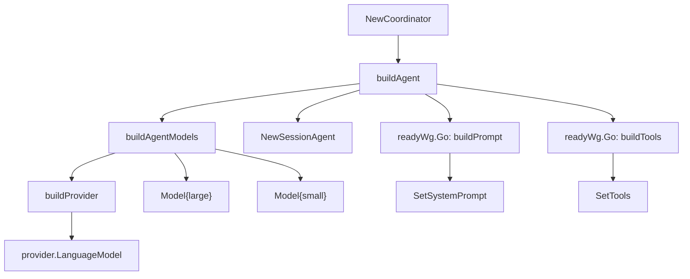
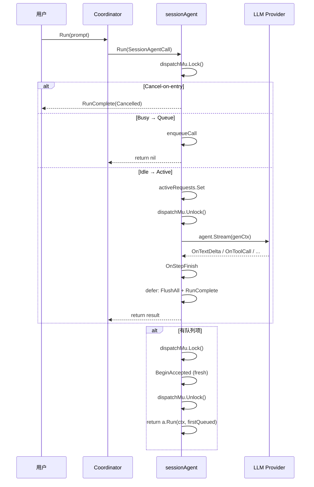

[上一篇：04-核心模块与类关系](04-核心模块与类关系.md) · [总目录](README.md) · [下一篇：06-工具系统详解](06-工具系统详解.md)

# Agent 协调器与会话管理

> **场景**：理解从用户提交 prompt 到 LLM 流式响应返回的完整 Agent 调度链路，包括 Coordinator 层、SessionAgent 层、会话队列、取消机制、自动摘要和标题生成。
> **时间**：2026-08-27 (CST)
> **版本**：Crush @ main branch, Go 1.26.6

## 本文件内容

1. [Coordinator 层：构造与初始化](#1-coordinator-层构造与初始化)
2. [Coordinator.run：单次执行的完整流程](#2-coordinatorrun单次执行的完整流程)
3. [SessionAgent.Run：流式执行的核心](#3-sessionagentrun流式执行的核心)
4. [调度决策：取消、排队与活跃](#4-调度决策取消排队与活跃)
5. [PrepareStep 回调：每步准备](#5-preparestep-回调每步准备)
6. [流式回调：文本、推理、工具调用](#6-流式回调文本推理工具调用)
7. [OnStepFinish：步骤结束处理](#7-onstepfinish步骤结束处理)
8. [RunComplete 事件与退出保障](#8-runcomplete-事件与退出保障)
9. [取消机制与 Accept 序列](#9-取消机制与-accept-序列)
10. [自动摘要](#10-自动摘要)
11. [标题生成](#11-标题生成)
12. [Sub-Agent 调度](#12-sub-agent-调度)
13. [模型与工具的运行时更新](#13-模型与工具的运行时更新)
14. [OAuth 令牌刷新与重试](#14-oauth-令牌刷新与重试)

## 1. Coordinator 层：构造与初始化

### CoordinatorOptions

```
internal/agent/coordinator.go
Struct：CoordinatorOptions
偏移：+0 ～ +13（结构定义）
```

字段列表：`Config`, `Sessions`, `Messages`, `Permissions`, `Questions`, `History`, `FileTracker`, `LSPManager`, `Notify`, `RunComplete`, `Skills`, `Interactive`。

### NewCoordinator

```
internal/agent/coordinator.go
函数：NewCoordinator
偏移：+0 ～ +50
```

执行步骤：

1. 从 `opts.Skills` 获取 `allSkills` 和 `activeSkills`；若 `opts.Skills` 为 nil，调用 `discoverSkills(opts.Config)` 作为回退
2. 用 `activeSkills` 创建 `skills.NewTracker`
3. 构造 `coordinator` 结构体，初始化所有依赖字段
4. 从配置读取 `AgentCoder` 的 agent 配置（`config.AgentCoder = "coder"`）
5. 调用 `coderPrompt(prompt.WithWorkingDir(c.cfg.WorkingDir()))` 构建 coder 提示词
6. 调用 `c.buildAgent(ctx, prompt, agentCfg, false)` 构建首个 SessionAgent
7. 将 agent 存入 `c.currentAgent` 和 `c.agents[config.AgentCoder]`

### buildAgent

```
internal/agent/coordinator.go
函数：buildAgent
偏移：+0 ～ +53
```

执行步骤：

1. 调用 `c.buildAgentModels(ctx, isSubAgent)` 构建 large 和 small 两个 `Model`
2. 用 `NewSessionAgent(SessionAgentOptions{...})` 创建 sessionAgent，此时 systemPrompt 为空、tools 为 nil
3. 使用 `context.WithoutCancel(ctx)` 创建 `initCtx`——确保就绪 goroutine 不被调用方 context 取消
4. 启动 `c.readyWg.Go` goroutine：构建 system prompt，完成后调用 `result.SetSystemPrompt`
5. 启动 `c.readyWg.Go` goroutine：构建工具列表，完成后调用 `result.SetTools`

```
关键设计：readyWg
```

`readyWg` 是一个 `errgroup.Group`。`coordinator.run` 函数在入口处调用 `c.readyWg.Wait()`，确保每次 run 之前 system prompt 和 tools 都已就绪。如果就绪 goroutine 出错，`Wait()` 返回错误，run 直接失败。

### buildAgentModels

```
internal/agent/coordinator.go
函数：buildAgentModels
偏移：+0 ～ +83
```

执行步骤：

1. 从 `c.cfg.Config().Models` 读取 `SelectedModelTypeLarge` 和 `SelectedModelTypeSmall`
2. 从 `c.cfg.Config().Providers` 读取对应的 `ProviderConfig`
3. 调用 `c.buildProvider(providerCfg, modelCfg, isSubAgent)` 创建 `fantasy.Provider`
4. 在 provider 的 `Models` 列表中查找匹配的 `catwalk.Model`
5. 如果是 OpenRouter 且模型支持 exacto，追加 `:exacto` 后缀
6. 调用 `provider.LanguageModel(ctx, modelID)` 创建 `fantasy.LanguageModel`
7. 返回两个 `Model` 结构体（large 和 small）



## 2. Coordinator.run：单次执行的完整流程

```
internal/agent/coordinator.go
函数：run
偏移：+0 ～ +115
```

### 执行步骤

1. **等待就绪**：`c.readyWg.Wait()` — 确保 system prompt 和 tools 构建完成

2. **MCP 等待**：如果是非交互模式（`!c.interactive`），调用 `mcp.WaitForInit(ctx)` 等待所有 MCP 服务器初始化完成。交互模式不等待——慢速 MCP 服务器不会阻塞首条消息

3. **刷新模型**：`c.UpdateModels(ctx)` — 重新构建 large/small 模型，确保使用最新配置

4. **获取模型参数**：从 `model.CatwalkCfg.DefaultMaxTokens` 和 `model.ModelCfg.MaxTokens` 选择 maxTokens

5. **合并调用选项**：`mergeCallOptions(model, providerCfg)` 返回 `ProviderOptions`, `temp`, `topP`, `topK`, `freqPenalty`, `presPenalty`

6. **OAuth 刷新**：`c.refreshTokenIfExpired(ctx, providerCfg)` — 如果 token 已过期，尝试刷新。失败不返回，继续使用现有 token

7. **构造 OnComplete 钩子**：创建一个闭包 `onComplete`，用于合并重试链的 RunComplete 事件——确保只发布最终的终端事件

8. **提取 RunID**：`RunIDFromContext(ctx)` — 从 context 中提取调用方提供的 RunID（用于 `crush run` 的可靠退出）

9. **执行 run 闭包**：调用 `c.currentAgent.Run(ctx, SessionAgentCall{...})`，传入所有参数

10. **技能使用日志**：`logTurnSkillUsage` — 记录本轮加载的技能

11. **未授权处理**：如果错误是 HTTP 401 且 provider 是 hyper，发布 `TypeReAuthenticate` 通知

12. **发布 RunComplete**：如果 `hasLatest` 且 `c.runComplete != nil`，使用 `PublishMustDeliver` 发布最终的 RunComplete，并调用 `MarkRunCompletePublished(ctx)` 标记已发布

### RunComplete 合并机制

```
internal/agent/coordinator.go
函数：run
偏移：+24 ～ +52（onComplete 和 run 闭包定义）
```

问题场景：第一次尝试返回 401 未授权 → fantasy 自动刷新 token 并重试 → 第二次尝试成功。如果不合并，第一次的失败 RunComplete 会先到达订阅者，`crush run` 会在重试成功前就退出。

解决方案：`onComplete` 闭包只更新 `latest` 变量，不直接发布。重试链结束后，`run` 函数统一发布一次 `latest`。

## 3. SessionAgent.Run：流式执行的核心

```
internal/agent/agent.go
函数：Run
偏移：+0 ～ +762（整个函数）
```

这是 Crush 中最复杂的函数，包含调度决策、流式回调、错误恢复、队列处理和递归调用。

### 总体流程图

```
┌─────────────────────────────────────────────────────────────────┐
│ ValidateCall                                                    │
│ (prompt 非空, sessionID 非空)                                    │
└───────────────────────────┬─────────────────────────────────────┘
                            ▼
┌─────────────────────────────────────────────────────────────────┐
│ sessionMu.Lock()                                                │
│                                                                 │
│  ┌─ Accepted 且 canceledBySeq? ──── Cancel-on-entry ──────────┐ │
│  │   persistCanceledTurn                                      │ │
│  │   publishRunComplete(Cancelled)                            │ │
│  │   return                                                   │ │
│  └────────────────────────────────────────────────────────────┘ │
│                                                                 │
│  ┌─ IsSessionBusy? ──────────────── Queue ────────────────────┐ │
│  │   enqueueCall(call)                                        │ │
│  │   Accepted.Close()                                         │ │
│  │   return                                                   │ │
│  └────────────────────────────────────────────────────────────┘ │
│                                                                 │
│  ┌─ Idle ──────────────────────── Active ─────────────────────┐ │
│  │   activeRequests.Set(sessionID, ac)                        │ │
│  │   Accepted.Close()                                         │ │
│  │   sessMu.Unlock()                                          │ │
│  └────────────────────────────────────────────────────────────┘ │
└───────────────────────────┬─────────────────────────────────────┘
                            ▼
┌─────────────────────────────────────────────────────────────────┐
│ 获取 tools, model, systemPrompt                                  │
│ 构建 fantasy.NewAgent                                           │
│ 获取 session 和 messages                                         │
│ 异步生成标题 (首次)                                              │
│ 创建 user message                                               │
│ 安装 defer: FlushAll + publishRunComplete                        │
└───────────────────────────┬─────────────────────────────────────┘
                            ▼
┌─────────────────────────────────────────────────────────────────┐
│ agent.Stream(genCtx, AgentStreamCall{                          │
│   PrepareStep: ...,                                            │
│   OnTextDelta: ...,                                            │
│   OnReasoningStart/Delta/End: ...,                              │
│   OnToolCall: ...,                                              │
│   OnToolResult: ...,                                            │
│   OnStepFinish: ...,                                            │
│   StopWhen: [autoSummarize, loopDetection],                    │
│ })                                                              │
└───────────────────────────┬─────────────────────────────────────┘
                            ▼
┌─────────────────────────────────────────────────────────────────┐
│ 错误处理                                                         │
│   - cancel-before-assistant: persistCanceledTurn               │
│   - 401/hyper: AddFinish(Unauthorized)                          │
│   - providerErr: AddFinish(Error, title, message)              │
│   - transportErr: AddFinish(TransportError)                    │
│   - 其他: AddFinish(Error, default)                             │
│   清理未完成 tool calls                                          │
└───────────────────────────┬─────────────────────────────────────┘
                            ▼
┌─────────────────────────────────────────────────────────────────┐
│ shouldSummarize?                                                │
│   → Summarize → 重新排队原始 prompt                              │
└───────────────────────────┬─────────────────────────────────────┘
                            ▼
┌─────────────────────────────────────────────────────────────────┐
│ 清理 activeRequests                                              │
│ 发布 AgentFinished 通知                                          │
│                                                                 │
│ sessionMu.Lock()                                                │
│   检查 cancelMark → 丢弃被取消的队列项                            │
│   有队列项? → 递归 Run(firstQueuedMessage)                      │
│   无队列项? → 清理 cancelMark, return                           │
│ sessionMu.Unlock()                                              │
└─────────────────────────────────────────────────────────────────┘
```

## 4. 调度决策：取消、排队与活跃

### 三条路径

```
internal/agent/agent.go
函数：Run
偏移：+22 ～ +82（dispatch handoff）
```

在 `sessionMu.Lock()` 下进行三选一决策：

**路径 1：Cancel-on-entry**（偏移 +24 ～ +52）

条件：`call.Accepted != nil && a.canceledBySeq(call.SessionID, call.Accepted.seq)`

动作：关闭 accept 句柄，释放锁，持久化取消的 turn，发布 RunComplete(Cancelled)，返回。

**路径 2：Queue**（偏移 +54 ～ +71）

条件：`a.IsSessionBusy(call.SessionID)` — 该 session 已有活跃请求

动作：`enqueueCall(call)` 将调用追加到 `messageQueue`，关闭 accept 句柄，释放锁，返回 nil。调用方不阻塞。

**路径 3：Active**（偏移 +73 ～ +82）

条件：session 空闲

动作：创建 `genCtx, cancel := context.WithCancel(runCtx)`，将 `{cancel}` 包裹为 `activeCancel` 存入 `activeRequests.Set(sessionID, ac)`，关闭 accept 句柄，释放锁。

```
关键设计：dispatchMu 序列化
```

`sessionMu(sessionID)` 是 per-session 的互斥锁，确保 Cancel 和 Run 的 dispatch handoff 原子执行。Cancel 获取同一把锁，因此每次 cancel 至少能看到 cancelMark、activeRequests 或 messageQueue 中的一个。

### CompareAndDelete 防护

```
internal/agent/agent.go
函数：Run
偏移：+86 ～ +88
```

```go
defer a.activeRequests.CompareAndDelete(call.SessionID, ac)
```

使用 `CompareAndDelete` 而非 `Del`：只在 entry 仍是自己的 `ac` 指针时才删除。防止 defer 在并发 run 注册新 entry 后误删。

## 5. PrepareStep 回调：每步准备

```
internal/agent/agent.go
函数：Run → PrepareStep
偏移：+242 ～ +316
```

PrepareStep 在每个 LLM 调用步骤前执行：

1. **复制消息**：`prepared.Messages = options.Messages`，清除 ProviderOptions
2. **更新工具**：`prepared.Tools = a.tools.Copy()` — 获取最新工具列表（MCP 工具可能在运行中更新）
3. **排空队列**：`a.drainQueueForStep(call.SessionID)` — 在 dispatchMu 下过滤队列：
   - 被 cancel 覆盖的（acceptSeq ≤ cancelMark）：丢弃，有 RunID 的发布 cancelled RunComplete
   - 无 RunID 的未取消项：fold 到当前步骤
   - 有 RunID 的未取消项：保留在队列中，各自独立运行
4. **创建 fold 的 user message**：对每个 fold 项调用 `createUserMessage`，追加到 `prepared.Messages`
5. **Provider 媒体限制 workaround**：`a.workaroundProviderMediaLimitations` — 对不支持 tool result 中图片的 provider，将图片转为 user message
6. **Anthropic 缓存控制**：对最后 2 条消息和最后的 system 消息添加 `cache_control: ephemeral`
7. **System prompt prefix**：如果 `promptPrefix` 非空，在消息前插入 system message
8. **克隆消息快照**：`stepMessages = cloneFantasyMessages(prepared.Messages)` — 供后续 usage 估算
9. **创建 assistant message**：`a.messages.Create(ctx, sessionID, CreateMessageParams{Role: Assistant, ...})`
10. **设置 context 值**：`MessageIDContextKey`, `SupportsImagesContextKey`, `ModelNameContextKey`

## 6. 流式回调：文本、推理、工具调用

### OnTextDelta

```
internal/agent/agent.go
函数：Run → OnTextDelta
偏移：+342 ～ +352
```

```go
OnTextDelta: func(id string, text string) error {
    if len(currentAssistant.Parts) == 0 {
        text = strings.TrimPrefix(text, "\n")
    }
    currentAssistant.AppendContent(text)
    return a.messages.Update(genCtx, *currentAssistant)
}
```

首个文本片段去除前导换行。`messages.Update` 经过 33ms 防抖后批量写入数据库。

### OnReasoningStart / OnReasoningDelta / OnReasoningEnd

```
internal/agent/agent.go
函数：Run → OnReasoning*
偏移：+314 ～ +341
```

推理内容处理：
- `OnReasoningStart`：追加推理文本
- `OnReasoningDelta`：追加推理增量
- `OnReasoningEnd`：处理 provider 特有的签名元数据（Anthropic signature, Google signature, OpenAI Responses reasoning data），调用 `FinishThinking()`，更新消息

### OnToolCall / OnToolResult

```
internal/agent/agent.go
函数：Run → OnToolCall
偏移：+384 ～ +400
```

`OnToolCall` 在工具调用参数完整后触发：
1. `sanitizeToolInput` 验证 JSON 有效性，无效则替换为 `{}`
2. 创建 `message.ToolCall{ID, Name, Input, ProviderExecuted: false, Finished: true}`
3. `currentAssistant.AddToolCall(toolCall)`
4. 使用父 context `ctx`（非 genCtx）更新消息——确保即使请求取消也能写入

```
internal/agent/agent.go
函数：Run → OnToolResult
偏移：+401 ～ +416
```

`OnToolResult` 在工具执行完成后触发：
1. `a.convertToToolResult(result)` 转换为 `message.ToolResult`
2. 如果工具调用被 sanitize（JSON 无效），设置错误内容
3. 创建独立的 tool role 消息：`a.messages.Create(ctx, sessionID, {Role: Tool, Parts: [toolResult]})`

### OnRetry

```
internal/agent/agent.go
函数：Run → OnRetry
偏移：+365 ～ +375
```

provider 请求失败重试时：
1. 记录警告日志
2. `currentAssistant.ResetStreamedContent()` — 重置已流式传输的内容，避免重试响应与失败尝试的内容拼接
3. 更新消息

### OnAuthRefresh

```
internal/agent/agent.go
函数：Run → OnAuthRefresh
偏移：+377
```

直接使用 `call.OnAuthRefresh`，由 coordinator 通过 `makeAuthRefreshCallback` 提供。当 stream 返回 401 时，fantasy 调用此回调刷新凭证并自动重试。

## 7. OnStepFinish：步骤结束处理

```
internal/agent/agent.go
函数：Run → OnStepFinish
偏移：+418 ～ +470
```

执行步骤：

1. **记录警告**：遍历 `stepResult.Warnings` 记录日志

2. **映射 FinishReason**：

| fantasy.FinishReason | message.FinishReason |
|---|---|
| `FinishReasonLength` | `FinishReasonMaxTokens` |
| `FinishReasonStop` | `FinishReasonEndTurn` |
| `FinishReasonToolCalls` | `FinishReasonToolUse` |
| `FinishReasonContentFilter` | `FinishReasonContentFilter` |

3. **工具停止检测**：如果 FinishReason 是 ToolUse 但某个 tool result 的 `StopTurn` 为 true（如权限拒绝或 hook halt），改为 `FinishReasonEndTurn`

4. **调用 AddFinish**：`currentAssistant.AddFinish(finishReason, "", "")`

5. **更新 session usage**：
   - `fallbackStepUsage(stepMessages, stepResult)` — 如果 provider 未返回 usage，从消息估算
   - `a.updateSessionUsage(model, &session, usage, openrouterCost, estimated)` — 累加 token 计数和成本

6. **保存 session**：`a.sessions.Save(ctx, updatedSession)`

7. **更新消息**：`a.messages.Update(genCtx, *currentAssistant)`

### StopWhen 条件

```
internal/agent/agent.go
函数：Run → StopWhen
偏移：+471 ～ +496
```

两个停止条件：

**条件 1：自动摘要阈值**

```
largeContextWindowThreshold = 200_000
largeContextWindowBuffer    = 20_000
smallContextWindowRatio     = 0.2
```

计算剩余 token：`remaining = contextWindow - (completionTokens + promptTokens)`

如果 `contextWindow > 200000`：阈值为 20000
否则：阈值为 `contextWindow * 0.2`

当 `remaining <= threshold` 且未禁用自动摘要时，设置 `shouldSummarize = true` 并停止。

如果 `contextWindow == 0`（未知，如本地模型），跳过自动摘要。

**条件 2：循环检测**

`hasRepeatedToolCalls(steps, loopDetectionWindowSize, loopDetectionMaxRepeats)` — 检测重复的工具调用模式，防止 agent 陷入死循环。

## 8. RunComplete 事件与退出保障

### defer 块

```
internal/agent/agent.go
函数：Run → defer
偏移：+186 ～ +215
```

```go
defer func() {
    flushCtx, flushCancel := context.WithTimeout(context.WithoutCancel(ctx), 5*time.Second)
    defer flushCancel()
    if flushErr := a.messages.FlushAll(flushCtx); flushErr != nil {
        slog.Error("Failed to flush pending message updates after run", "error", flushErr)
    }
    if skipRunComplete {
        return
    }
    complete := notify.RunComplete{SessionID: call.SessionID, RunID: call.RunID}
    if currentAssistant != nil {
        complete.MessageID = currentAssistant.ID
        complete.Text = currentAssistant.Content().String()
    }
    if retErr != nil {
        complete.Error = retErr.Error()
        complete.Cancelled = errors.Is(retErr, context.Canceled)
    } else if ctx.Err() != nil {
        complete.Cancelled = true
    }
    a.publishRunComplete(ctx, call, complete)
}()
```

关键设计：

- 使用 `context.WithoutCancel(ctx)` — workspace shutdown 取消 ctx 后，仍然需要 flush 和发布
- `FlushAll` 确保所有防抖的 message update 写入数据库
- `skipRunComplete` 在队列递归路径前置为 true，避免外层 defer 与递归 Run 的 RunComplete 竞争
- `publishRunComplete` 优先使用 `call.OnComplete` 钩子（coordinator 合并重试），否则回退到 `runComplete.PublishMustDeliver`

### publishRunComplete

```
internal/agent/agent.go
函数：publishRunComplete
偏移：+0 ～ +9
```

```go
func (a *sessionAgent) publishRunComplete(ctx context.Context, call SessionAgentCall, complete notify.RunComplete) {
    if call.OnComplete != nil {
        call.OnComplete(complete)
        return
    }
    if a.runComplete == nil {
        return
    }
    a.runComplete.PublishMustDeliver(ctx, pubsub.UpdatedEvent, complete)
}
```

## 9. 取消机制与 Accept 序列

### AcceptedRun

```
internal/agent/agent.go
Struct：AcceptedRun
偏移：+0 ～ +11
```

`AcceptedRun` 是 fire-and-forget 调度路径的 accept 预约句柄。包含：
- `agent *sessionAgent` — 所属 agent
- `sessionID string`
- `seq uint64` — 单调递增的 accept 序列号
- `done atomic.Bool` — 幂等 Close

### BeginAccepted

```
internal/agent/agent.go
函数：BeginAccepted
偏移：+0 ～ +7
```

在 `acceptedMu` 下递增 `acceptedRuns[sessionID]` 计数器，递增全局 `acceptSeqGen`，返回 `AcceptedRun{seq: acceptSeqGen}`。

### Cancel

```
internal/agent/agent.go
函数：Cancel
偏移：+0 ～ +54
```

在 `sessionMu` 下执行：

1. 如果 `activeRequests[sessionID]` 存在，调用 `ac.cancel()` 取消运行中的 context
2. 如果 `activeRequests[sessionID + "-summarize"]` 存在，也取消
3. 在 `acceptedMu` 下读取 `acceptedRuns[sessionID]` 和当前 `acceptSeqGen`
4. 如果 `acceptedRuns > 0`：设置 `cancelMark[sessionID] = max(existing, acceptSeqGen)` — 覆盖所有已 accept 但未 active 的 run
5. 如果队列非空：`clearQueueAndNotify` — 清除队列并发布 cancelled RunComplete

### canceledBySeq

```
internal/agent/agent.go
函数：canceledBySeq
偏移：+0 ～ +7
```

```go
func (a *sessionAgent) canceledBySeq(sessionID string, seq uint64) bool {
    mark, ok := a.cancelMark.Get(sessionID)
    if !ok || mark == 0 {
        return false
    }
    return seq == 0 || seq <= mark
}
```

- `seq == 0`：无 accept 的 in-process enqueue，被任何 mark 覆盖（保留旧行为）
- `seq > 0`：只在 `seq <= mark` 时被覆盖——cancel 后 accept 的 prompt（更高 seq）不受影响



## 10. 自动摘要

```
internal/agent/agent.go
函数：Summarize
偏移：+0 ～ +149
```

### 触发条件

在 `StopWhen` 条件 1 中，当 session 的 token 使用量接近 context window 阈值时，设置 `shouldSummarize = true`。

### 执行流程

1. 检查 `IsSessionBusy(sessionID)` — 如果忙，返回 `ErrSessionBusy`
2. 获取 large model 和 system prompt prefix
3. 获取当前 session 和消息列表
4. 如果消息为空，返回 nil
5. `preparePrompt(msgs, supportsImages)` 准备 AI 消息
6. 创建 `genCtx, cancel`，注册 `activeRequests[sessionID]`（注意：使用原始 sessionID，但 Cancel 中检查 `sessionID + "-summarize"` 也有逻辑）
7. 创建 `fantasy.NewAgent` 使用 `summaryPrompt` 作为 system prompt
8. 创建 summary assistant message（`IsSummaryMessage: true`）
9. 构建摘要提示词：`buildSummaryPrompt(currentSession.Todos)` — 包含 todo 列表
10. 调用 `agent.Stream(genCtx, ...)` 生成摘要
11. 处理结果：
    - 取消：删除 summary message
    - 错误：标记 summary message 为错误
    - 成功：标记 `FinishReasonEndTurn`，更新 session 的 `SummaryMessageID`，重置 token 计数

### 摘要后恢复

```
internal/agent/agent.go
函数：Run
偏移：+626 ～ +640
```

如果 `shouldSummarize` 为 true 且 agent 有未完成的 tool calls：

```go
call.Prompt = fmt.Sprintf("The previous session was interrupted because it got too long, the initial user request was: `%s`", call.Prompt)
existing = append(existing, call)
a.messageQueue.Set(call.SessionID, existing)
```

将原始 prompt 重新排队，在摘要完成后继续执行。

### 摘要消息的特殊处理

```
internal/agent/agent.go
函数：getSessionMessages
偏移：+0 ～ +20
```

当 `session.SummaryMessageID` 非空时，消息列表从 summary message 开始截断，且 summary message 的 role 被改为 `User`。这意味着摘要作为"用户提供的上下文"传递给 LLM。

## 11. 标题生成

```
internal/agent/agent.go
函数：GenerateTitle
偏移：+0 ～ +145
```

### 触发时机

在 `Run` 函数中，当 `!hasUserTextMessage(msgs)` 为 true（即这是 session 的第一条文本用户消息）时，使用 `context.WithoutCancel(ctx)` 异步启动标题生成。

### 执行流程

1. 确保 defer 保存回退标题 `DefaultSessionName = "Untitled Session"`
2. 获取 small model 和 large model
3. 构建标题生成 agent：使用 `titlePrompt` 模板 + `/no_think` 指令
4. 尝试顺序：先 small model，再 large model
5. 每个 attempt 设置不同的 maxOutputTokens：
   - 能推理的模型：`CatwalkCfg.DefaultMaxTokens`
   - 不能推理的模型：40 tokens
6. 清理标题：去除换行、think 标签
7. 如果 LLM 返回空，使用 prompt 前 50 字符作为回退
8. 计算成本（包括 OpenRouter 覆盖成本和 flat rate 跳过）
9. `a.sessions.UpdateTitleAndUsage(ctx, sessionID, title, promptTokens, completionTokens, cost)` — 原子更新标题和 usage

```
internal/agent/agent.go
嵌入资源：
//go:embed templates/title.md
var titlePrompt []byte

//go:embed templates/summary.md
var summaryPrompt []byte
```

## 12. Sub-Agent 调度

```
internal/agent/coordinator.go
函数：runSubAgent
偏移：+0 ～ +71
```

Sub-agent 用于 `agent` 工具（让 coder agent 委托子任务给另一个 agent）和 `agentic_fetch` 工具。

### 执行流程

1. 创建 sub-session ID：`c.sessions.CreateAgentToolSessionID(agentMessageID, toolCallID)`
2. 创建 task session：`c.sessions.CreateTaskSession(ctx, subSessionID, parentSessionID, title)`
3. 调用可选的 `params.SessionSetup(session.ID)` 回调
4. 获取模型参数和 provider 配置
5. 调用 `params.Agent.Run(ctx, SessionAgentCall{...NonInteractive: true...})`
6. 401 处理：如果 hyper provider 返回未授权，发布 `TypeReAuthenticate` 通知
7. 成本累加：`c.updateParentSessionCost(ctx, subSessionID, parentSessionID)` — 将子 session 的成本累加到父 session
8. 输出：`subAgentOutput(result)` 提取文本，空则返回错误响应

### Sub-agent 的区别

- `NonInteractive: true` — 不发布 AgentFinished 通知
- `IsSubAgent: true` — 不添加 todo list 提示，不包含 Question 工具，不包裹 hooks
- 独立的 session（task session，parent 指向主 session）

## 13. 模型与工具的运行时更新

### UpdateModels

```
internal/agent/coordinator.go
函数：UpdateModels
偏移：+0 ～ +19
```

每次 `coordinator.run` 调用前执行：

1. `c.buildAgentModels(ctx, false)` — 重新构建 large/small 模型
2. `c.currentAgent.SetModels(large, small)` — 原子更新
3. 读取 agent 配置
4. `c.buildTools(ctx, agentCfg, false)` — 重新构建工具列表
5. `c.currentAgent.SetTools(tools)` — 原子更新

### SetModels / SetTools

```
internal/agent/agent.go
函数：SetModels
偏移：+0 ～ +3
```

```go
func (a *sessionAgent) SetModels(large Model, small Model) {
    a.largeModel.Set(large)
    a.smallModel.Set(small)
}
```

使用 `csync.Value[T]` 原子更新。Run 中通过 `a.largeModel.Get()` 读取，确保不会在运行中被修改。

```
internal/agent/agent.go
函数：SetTools
偏移：+0 ～ +2
```

```go
func (a *sessionAgent) SetTools(tools []fantasy.AgentTool) {
    a.tools.SetSlice(tools)
}
```

使用 `csync.Slice[T]` 原子更新。PrepareStep 中通过 `a.tools.Copy()` 读取最新工具列表。

## 14. OAuth 令牌刷新与重试

### refreshTokenIfExpired

```
internal/agent/coordinator.go
函数：refreshTokenIfExpired
偏移：+0 ～ +7
```

如果 `providerCfg.OAuthToken` 非空且已过期，调用 `c.refreshOAuth2Token(ctx, providerCfg)`。失败不阻止执行——继续使用现有 token。

### makeAuthRefreshCallback

```
internal/agent/coordinator.go
函数：makeAuthRefreshCallback
偏移：+0 ～ +9
```

返回一个闭包，在 fantasy 的 `OnAuthRefresh` 回调中调用 `c.retryAfterUnauthorized(ctx, providerCfg)`。

只在 provider 配置了 OAuth token、API key template 或 AWS auth refresh 时返回非 nil。

### retryAfterUnauthorized

```
internal/agent/coordinator.go
函数：retryAfterUnauthorized
偏移：+0 ～ +27
```

三种刷新路径：

| 条件 | 动作 |
|------|------|
| `OAuthToken != nil` | `refreshOAuth2Token` → 如果 refresh token 被撤销，发布 `TypeReAuthenticate` 通知并等待交互式重新认证 |
| `AWSAuthRefresh != ""` | `refreshAWSCredentials` |
| `APIKeyTemplate` 含 `$` | `refreshApiKeyTemplate` — 重新解析模板获取新 key |

### waitForInteractiveReauth

```
internal/agent/coordinator.go
函数：waitForInteractiveReauth
偏移：+0 ～ +25
```

当 refresh token 被撤销时：

1. 创建 5 分钟超时的 detached context（`context.WithoutCancel`）— 给用户时间完成浏览器认证
2. `c.cfg.WaitForTokenChange(waitCtx, providerID)` — 阻塞直到 token 变化
3. 如果原始 context 在等待期间被取消，返回取消错误（不重试）
4. `c.UpdateModels(waitCtx)` — 用新凭证重建模型
5. 返回 nil — fantasy 自动重试

---

[上一篇：04-核心模块与类关系](04-核心模块与类关系.md) · [总目录](README.md) · [下一篇：06-工具系统详解](06-工具系统详解.md)