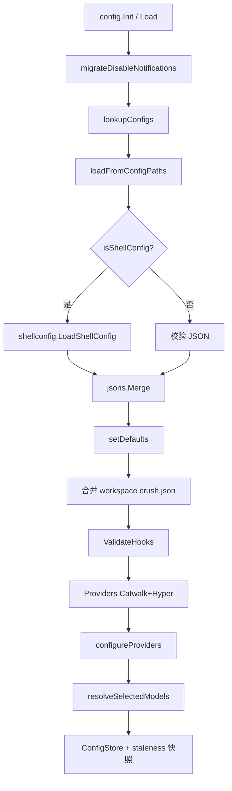
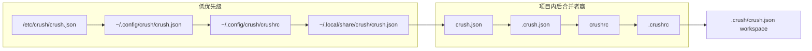
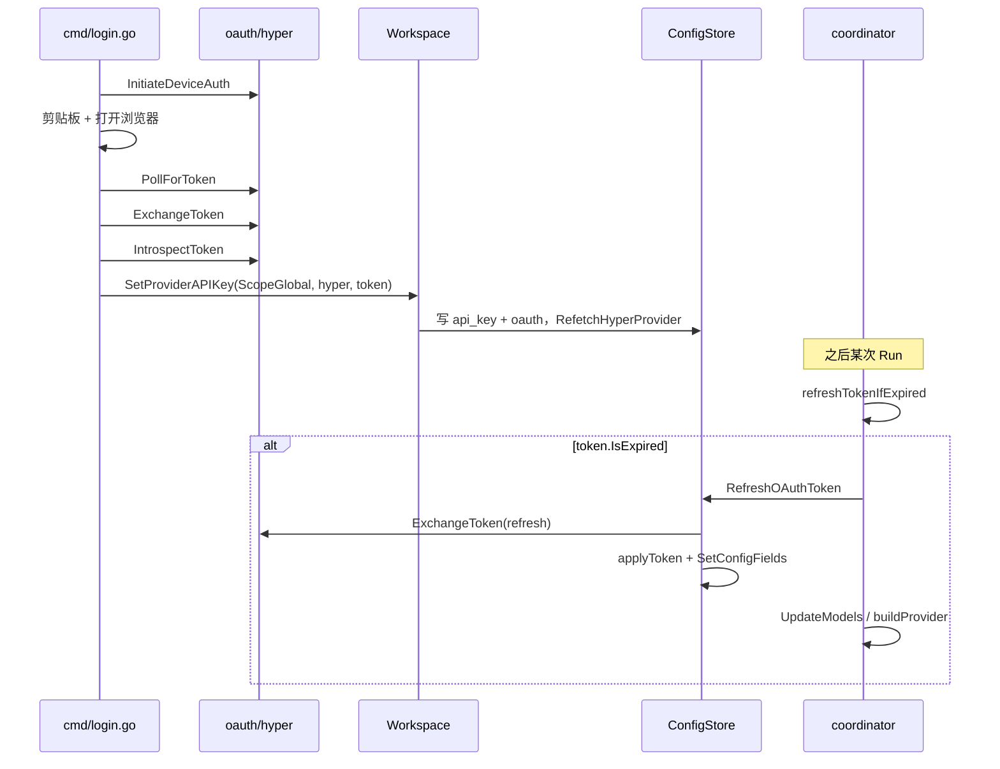
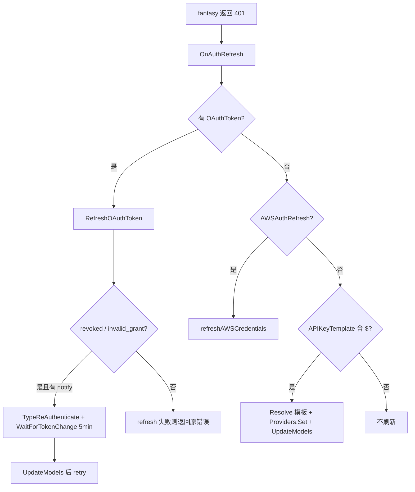

# 05. 配置体系与 Provider 认证

> 状态：待复核生成稿
> 生成日期：2026-08-16
> 基准提交：`16dce459cafecee92eae0ed7c47a0c641c8bbb9f`
> 工作区：clean
> 源码范围：`internal/config/`、`internal/shellconfig/`、`internal/discover/`、`internal/oauth/`、`internal/cmd/login.go`、`internal/cmd/logout.go`、`internal/cmd/models.go`、`internal/cmd/update_providers.go`、`schema.json`；Coordinator 认证接入点仅到 `internal/agent/coordinator.go` 的调用边界
> 生成方式：源码、测试、配置与 Schema 静态分析
> 交叉引用：第一层 `01-简单框架-系统骨架.md`，第二层 `02-简单例子-全路径走读.md`，第三层 `03-详细逐步说明-主链路拆解.md`

## 快速摘要

### 架构总览（模块与依赖）

Crush 的配置不是“读一个 JSON”。`internal/config.Load` 发现多级路径、执行 `crushrc`、用 `jsons.Merge` 深合并、补默认值、拉 Catwalk/Hyper 目录、解析 API key、发现本地模型，再把结果交给 `ConfigStore` 作为不可变快照发布。

依赖方向（上层 → 下层）：

- CLI（`internal/cmd/login.go` / `logout.go` / `models.go` / `update_providers.go`）→ Workspace / `ConfigStore`
- `internal/config` → `internal/shellconfig`（执行 crushrc）→ `internal/shell`（内嵌 Bash）
- `internal/config` → `internal/discover`（自定义 Provider 的 `/models` + Enricher）
- `internal/config` → `charm.land/catwalk`（默认 Provider 目录）与 `internal/agent/hyper`（Hyper 目录）
- `internal/config.ConfigStore.RefreshOAuthToken` → `internal/oauth/copilot` / `internal/oauth/hyper`
- MCP HTTP OAuth → `internal/oauth/mcp` + `internal/oauth/callback`（与 Provider 登录是另一条流）
- `internal/agent/coordinator.buildProvider` 把 `ProviderConfig.Type` 变成 `fantasy.Provider`；`refreshTokenIfExpired` 在每次 Run/Summarize 前调用 `ConfigStore.RefreshOAuthToken`

必须保持的行为契约：磁盘上的用户模板（例如 `api_key: "$OPENAI_API_KEY"`）与运行时已解析密钥分离；`crushrc` builtin 只在带 `ConfigBuilder` 的 context 里生效；发布后的 `*Config` 不当场改字段（`Providers` 的 `*csync.Map` 是例外，OAuth 刷新会原地 `Set`）。

### 核心调用序列（逐步逻辑）

1. `config.Init` → `config.Load`（`internal/config/init.go`、`load.go`）。
2. `lookupConfigs(workingDir)` 产出有序路径：系统 JSON → 用户 `crush.json` → 同目录 `crushrc` → 全局数据 JSON → 项目树（反转后近 cwd 优先）。
3. `loadFromConfigPaths`：JSON 原样入队；`crushrc` / `.crushrc` 交给 `shellconfig.LoadShellConfig`，执行后 marshal 成一个 JSON object。
4. `jsons.Merge` 后 `json.Unmarshal` 得到 `*Config`；同目录 JSON 与 crushrc 冲突时打 warn，crushrc 后合并所以覆盖 JSON。
5. 再合并 workspace `.crush/crush.json`（最高文件优先级），`setDefaults`、`ValidateHooks`。
6. `Providers(cfg, hyperRefresher)` 拉 Catwalk + Hyper 目录（可缓存/嵌入回退）。
7. `configureProviders`：已知 Provider 与用户覆盖合并、解析 key/header、特殊 Provider 校验；自定义 Provider 并发 `discover.DiscoverModels`。
8. `resolveSelectedModels` 选定 large/small；无效旧选择回退默认并可能写回全局数据文件。
9. 建立 `ConfigStore`，`captureStalenessSnapshot` 跟踪“发现到但尚未存在”的路径。
10. Agent 运行：`coordinator.run` → `refreshTokenIfExpired` → `ConfigStore.RefreshOAuthToken`（singleflight + 跨进程 refresh lock）→ `UpdateModels` → `buildProvider`。

### 易错点与边界条件

- **合并方向**：`jsons.Merge` 后写覆盖先写；`lookupConfigs` 对项目文件 `slices.Reverse`，使 `.crushrc` 赢过同目录 `crushrc`，两者赢过 JSON，近 cwd 赢过祖先。
- **数据目录不执行 crushrc**：`~/.local/share/crush/` 只放机器状态 JSON（OAuth token、模型选择），禁止当 Bash 执行。
- **全局 crushrc 只跟用户配置目录**：`shellConfigSibling(GlobalConfig())`，不是数据目录。
- **热重载失败必须保留旧快照**：crushrc 语法错误、超时、模型解析失败都会 rollback（`reload_crushrc_test.go`）。
- **crushrc 超时 30s**：加载持有 `writeMu`，挂死的 `$(cmd)` 会卡住整个 store；context 取消必须能打断。
- **OAuth refresh token 旋转**：Hyper 每次 exchange 作废旧 refresh token；并发 refresh 必须 singleflight + 跨进程锁，否则会触发 reuse detection 吊销整族 token。
- **Anthropic OAuth 已废弃**：配置里若有 `providers.anthropic.oauth`，`configureProviders` 会 `RemoveConfigField` 并从内存删除，迫使用户走 API key。
- **`applyToken` 原地改 `Providers` map**：与“发布后 Config 不可变”的总原则并存；重新实现时不要改成无锁写结构体其它字段。
- **密钥边界**：`APIKeyTemplate` 是 `json:"-"`，只活在内存；错误信息经 `sanitizeResolveError` 截断，禁止把展开后的密钥打进日志。
- **测试覆盖缺口（推断）**：MCP OAuth 与 CLI login 的端到端浏览器流主要靠单元测试替身，真实设备流未在本仓库集成测试中跑通。标 **待确认**。

## 目录

1. [为什么这样设计（Why）](#1-为什么这样设计why)
2. [它是什么（What）](#2-它是什么what)
3. [配置发现路径](#3-配置发现路径)
4. [Load 管线与深合并](#4-load-管线与深合并)
5. [crushrc：ConfigBuilder 与 builtins](#5-crushrcconfigbuilder-与-builtins)
6. [运行时快照、写回与热更新](#6-运行时快照写回与热更新)
7. [Catwalk / Hyper 默认 Provider 目录](#7-catwalk--hyper-默认-provider-目录)
8. [configureProviders：Type、密钥、模型发现](#8-configureproviderstype密钥模型发现)
9. [Provider Type 如何变成 fantasy.Provider](#9-provider-type-如何变成-fantasyprovider)
10. [OAuth：设备流、MCP 授权、refresh 接入点](#10-oauth设备流mcp-授权refresh-接入点)
11. [CLI 与配置的交接](#11-cli-与配置的交接)
12. [Schema、环境变量与 Secret 边界](#12-schema环境变量与-secret-边界)
13. [调用关系表](#13-调用关系表)
14. [流程图与时序图](#14-流程图与时序图)
15. [测试覆盖与行为证据](#15-测试覆盖与行为证据)
16. [阅读源码建议顺序](#16-阅读源码建议顺序)
17. [重新实现检查清单](#17-重新实现检查清单)
18. [源码索引](#18-源码索引)

---

## 1. 为什么这样设计（Why）

配置系统要同时满足四件事，这决定了它比“一个 JSON 文件”复杂：

1. **多来源、可覆盖**：系统管理员、用户全局、项目、workspace 运行时状态、CLI 本进程覆盖，必须能叠在一起。靠近工作目录的意图优先。
2. **密钥不落盘为明文模板展开结果**：用户写 `$OPENAI_API_KEY` 或 `$(op read ...)`，运行时展开；持久化时应尽量保留模板。OAuth access token 是例外——登录成功后必须写到全局数据 JSON，否则下次启动无法认证。
3. **crushrc 是真 Bash，不是 DSL**：复用 `internal/shell` 解释器，得到 `source`、条件、命令替换。因此必须有安全门：普通 `bash` 工具执行时 `provider`/`model` 等 builtin 必须是 no-op。
4. **多进程共享一份全局凭据**：两个 Crush 实例同时 refresh Hyper token 会把 refresh token 用两次。必须进程内 singleflight + 跨进程 flock，后到者读盘领养，而不是自己再 exchange。

旧文档 `03-config-providers-auth.md` 基于更早提交。本篇以 `16dce459` 源码为准重写：热重载 rollback、模型 pin、Hyper catalog 401 重试、Anthropic OAuth 删除、crushrc 30s 超时都是当前契约。

---

## 2. 它是什么（What）

### 2.1 两层配置

| 层 | 谁拥有 | 形态 | 可否含密钥模板 |
|---|---|---|---|
| 用户意图 | 用户编辑的 crushrc / crush.json | 未解析 | 是（`$VAR` / `$(cmd)`） |
| 运行时快照 | `ConfigStore.config` | 已 `setDefaults`、已解析 key、已选模型 | 内存中是展开值；`APIKeyTemplate` 保留模板 |

`IsConfigured()`（`config.go`）的语义不是“文件存在”，而是至少有一个未 `Disable` 的 Provider。没有可用 Provider 时 `Load` 仍返回 store，只打 warn，方便进入 onboarding。

### 2.2 核心类型（`internal/config/config.go`）

**`Config`**：顶层结构。JSON 字段包括 `$schema`、`models`、`providers`、`mcp`、`lsp`、`options`、`permissions`、`tools`、`hooks`、`env`。`Agents` 是 `json:"-"`，由 `SetupAgents` 在内存中生成 coder/task。`Providers` 是 `*csync.Map[string, ProviderConfig]`，发布后仍可并发 `Get`/`Set`。

**`SelectedModel`**：用户选择的 large/small。必填 `Model`（Provider API 的模型 ID）和 `Provider`（providers map 的 key）。可选采样参数、`Think`、`ReasoningEffort`、`ProviderOptions`。模型 ID 自身可以含 `/`；crushrc 的 `model add` 只按**第一个** `/` 切开 provider 与 id。

**`ProviderConfig`**：一个推理后端。关键字段：

| 字段 | JSON | 职责 |
|---|---|---|
| `ID` / `Name` | `id` / `name` | map key 是稳定身份；结构内 `ID` 在 configure 阶段补齐 |
| `Type` | `type` | Catwalk 协议类型，空则默认 openai-compat |
| `BaseURL` | `base_url` | API 根；加载时 shell 展开 |
| `APIKey` | `api_key` | 运行时已解析密钥；磁盘上常是模板 |
| `APIKeyTemplate` | `-` | 展开前模板，401 时重新 `Resolve` |
| `OAuthToken` | `oauth` | `*oauth.Token` |
| `Disable` | `disable` | 禁用后不进入 EnabledProviders |
| `ExtraHeaders` | `extra_headers` | 加载时展开；空字符串的 header 被丢弃 |
| `ExtraBody` | `extra_body` | OpenAI-compat 请求体原样合并，**不**递归展开 |
| `AutoDiscoverModels` | `discover_models` | `*bool`：nil+空模型列表 → 自动发现；true+已有模型 → 合并（用户赢）；false → 只用显式列表 |
| `AWSAuthRefresh` | `aws_auth_refresh` | Bedrock 凭证过期时跑的 shell 命令 |
| `FlatRate` | `flat_rate` | 订阅/包月，不累计 token 成本 |

**`MCPConfig` / `LSPConfig`**：stdio/sse/http MCP；LSP command/filetypes/root markers。MCP 的 `oauth`/`oauth_token`/`oauth_callback_port` 是 MCP 授权，不是 Hyper/Copilot 登录。`isOrphanedToken()`：type/command/url 全空但留着 token 的条目会在 `setDefaults` 里删掉（用户从 crush.json 删了 MCP、token 却还在全局数据文件）。

**`Options`**：数据目录、context/skills 路径、TUI、debug、禁用工具/技能、`DisableProviderAutoUpdate`、`DisableDefaultProviders`、attribution、notifications 等。

**`RuntimeOverrides`**（`store.go`）：只活在本进程，永不写盘。`SkipPermissionRequests`（yolo）、`EnabledChannels`、`Models`（本实例选过的模型 pin，防止 reload 被兄弟进程的模型选择覆盖）。

**`Scope`**（`scope.go`）：`ScopeGlobal` 写 `GlobalConfigData()`；`ScopeWorkspace` 写 `.crush/crush.json`。登录凭据走 Global。

### 2.3 ConfigStore 的职责

`ConfigStore` 是配置的唯一入口：拥有纯数据 `Config`、workingDir、resolver、knownProviders、overrides、staleness 快照，以及所有写盘。

锁模型：

| 锁 | 保护什么 |
|---|---|
| `configMu` | `config` 指针字；读者 `Config()` 拿 RLock |
| `writeMu` | 生产新 Config 的全过程（typed mutator + Reload）。`autoReload` 用 `TryLock` 避免重入死锁 |
| `mu` + `path.lock` | 单文件 lock-read-transform-write |
| `refreshSF` + `provider.refresh.lock` | OAuth exchange 单飞 |

`cloneForWrite` 深拷贝 `Models`/`RecentModels`/`MCP`/`Options`（含 TUI 指针）；`Providers` 按引用共享。因此 OAuth `applyToken` 可以 `Providers.Set` 而不换整棵 Config。

---

## 3. 配置发现路径

入口：`lookupConfigs`（`load.go`）。返回的切片**从前到后优先级升高**（后合并者赢）。

### 3.1 固定前缀（始终列入，缺失则跳过）

1. `systemConfigPath`
   - Unix：`/etc/crush/crush.json`（`config_unix.go`）
   - Windows：空字符串，加载时跳过（`config_windows.go`）
2. `GlobalConfig()`：用户配置 JSON
   - 若设 `CRUSH_GLOBAL_CONFIG`：`$CRUSH_GLOBAL_CONFIG/crush.json`
   - 否则：`home.Config()/crush/crush.json`（通常 `~/.config/crush/crush.json`）
3. `shellConfigSibling(GlobalConfig())`：同上目录的 `crushrc`（**不是** `.crushrc`）
4. `GlobalConfigData()`：机器状态 JSON
   - `CRUSH_GLOBAL_DATA` 或 `XDG_DATA_HOME/crush/crush.json` 或 `~/.local/share/crush/crush.json`
   - Windows：`%LOCALAPPDATA%/crush/crush.json`
   - **此目录不贡献 crushrc**（测试 `load_test.go`：“data directory is machine-owned state and must never execute a crushrc”）

### 3.2 项目树

`fsext.LookupBounded(cwd, projectBoundary(cwd), names...)` 从 cwd **向上**走到边界（含边界）。`projectBoundary`：能检测到 git worktree 则用 `git rev-parse --show-toplevel`（结果缓存在 `worktreeRootCache`）；否则边界就是 cwd 自身的绝对路径。这样 git 仓库外的无关祖先 `crush.json` 不会被捡走（`load_test.go`）。

每个目录探测的文件名（高优先级在前）：

```text
.crushrc
crushrc
.crush.json
crush.json
```

`LookupBounded` 按 cwd → 父 → … → 边界追加。随后 `slices.Reverse(foundConfigs)`：

- 近 cwd 的文件排到切片尾部 → 后合并 → 覆盖祖先
- 同目录内反转后顺序变为 `crush.json` → `.crush.json` → `crushrc` → `.crushrc` → `.crushrc` 赢

证据：`shellconfig_precedence_test.go` 断言同目录 `.crushrc` 覆盖 `crushrc`。

### 3.3 Workspace 文件（Load 后单独合并，最高文件优先级）

`filepath.Join(cfg.Options.DataDirectory, "crush.json")`，默认 workingDir 下的 `.crush/crush.json`。`setDefaults` 会把 `DataDirectory` 收成绝对路径：显式 `dataDir` 参数优先，否则配置值，否则 `LookupClosestBounded` 找已有 `.crush`，再否则 `workingDir/.crush`。

### 3.4 路径即使不存在也要跟踪

`captureStalenessSnapshot` 跟踪 `lookupConfigs` 的**全部**路径，不只是成功加载的。这样启动时没有全局 crushrc、用户中途创建它，staleness 仍能发现（`reload_crushrc_test.go`）。项目级 crushrc 靠向上 walk 已存在文件，启动后新建的项目 crushrc **不会**出现在 tracked 列表里，要等下次把该路径纳入 lookup——测试明确写了这条不对称。

### 3.5 Skills / Context 默认搜索路径（配置侧）

这些不是 crush 配置文件，但由同一套 `setDefaults` 写入 `Options`，供 Skills/Prompt 文档使用：

- `GlobalContextPaths` 默认空时：`dirname(GlobalConfig())/CRUSH.md` 与其父目录的 `AGENTS.md`
- `ContextPaths`：先 prepend `defaultContextPaths`（含 `AGENTS.md`、`CRUSH.md`、`CLAUDE.md`、`GEMINI.md` 及 `.local` 变体、`.cursorrules` 等），再 compact
- `SkillsPaths`：追加 `GlobalSkillsDirs()` 与 `ProjectSkillsDir(workingDir)`

`GlobalSkillsDirs`：`CRUSH_SKILLS_DIR` 若设置则只返回它；否则 `~/.config/crush/skills`、`~/.config/agents/skills`、`~/.agents/skills`、`~/.claude/skills`（Windows 另加 LOCALAPPDATA 对应路径）。

`ProjectSkillsDir`：workingDir 下 `.agents/skills`、`.crush/skills`、`.claude/skills`、`.cursor/skills`，若 git root ≠ workingDir 再追加 root 下同样四个子目录。工作目录在前，使本地覆盖 monorepo。

---

## 4. Load 管线与深合并

### 4.1 `Load` 步骤（`load.go`）

1. `migrateDisableNotifications()`：把旧 `options.disable_notifications` / `notification_style` 迁到 `options.notifications`，写数据文件，并从用户/数据 JSON 删掉旧字段。
2. `lookupConfigs` → `loadFromConfigPaths(ctx, paths)`。
3. `setDefaults(workingDir, dataDir)`。
4. 构造 `ConfigStore`（workingDir、globalDataPath、workspacePath、loadedPaths）。
5. `debug` 参数强制 `Options.Debug = true`。
6. 读 workspace JSON，`loadFromBytes([当前cfg JSON, wsData])`，再 `setDefaults` 一次以免默认被冲掉。
7. `ValidateHooks()`：规范化事件名（`pre_tool_use` → `PreToolUse`），校验 command 非空、matcher 能编译。
8. 非 git worktree：限制 ls/completions 深度 2、条目 100。
9. Apple Terminal：默认透明背景。
10. `Providers(cfg, store.RefreshOAuthToken(..., "hyper"))`：目录刷新失败但列表非空则 warn 继续。
11. `NewShellVariableResolver(env.New())`；`writeMu.Lock` 包住后续，防止 `configureProviders` 里的 `RemoveConfigField` 触发 `autoReload` 重入。
12. `applyEnv`：顶层 `env` map 按 key 排序后 `os.Setenv`（让 `AWS_PROFILE` 在 AWS SDK 链可见）。
13. `configureProviders`。
14. 若 `IsConfigured()`：`resolveSelectedModels`；fallback 时 `updateLocked(ScopeGlobal, ...)` 把纠正后的 large/small 写回数据文件。
15. `SetupAgents()`。
16. `captureStalenessSnapshot(configPaths + loadedPaths)`。

`Init` 只是 `Load` 的别名包装。

### 4.2 `loadFromConfigPaths`

对每个存在且非空的路径：

- `isShellConfig`（basename 为 `crushrc` 或 `.crushrc`）→ `shellconfig.LoadShellConfig`；返回 nil/空则当“脚本没产生配置”，不报错；非空必须是合法 JSON。
- 否则必须是合法 JSON。

同目录若 JSON 与 crushrc **顶层 key 交集非空**，`slog.Warn("... crushrc taking precedence", conflicting_keys)`。无交集不警告，允许“JSON 管 providers、crushrc 管 options”的增量迁移（`TestLoadFromConfigPaths_ConflictWarningNamesKeys`）。

### 4.3 深合并语义

`loadFromBytes` 调用 `jsons.Merge(configs)` 再 unmarshal 到 `Config`。Crush 依赖的契约（由加载顺序 + 测试锁定，库内部实现标 **推断**）：

- 对象递归合并
- 后出现的同路径标量覆盖先出现的
- 数组是否整体替换取决于 jsons：`permissions.allowed_tools` 在 crushrc 里是脚本内 append，跨文件合并时后一个文件的数组会盖住前一个——**不要假设跨文件数组合并**。重新实现若换库，必须用测试钉死 `providers` map 合并与 `options` 标量覆盖。

Workspace 合并是第二次 `loadFromBytes([marshal(cfg), wsData])`，因此 `.crush/crush.json` 赢过所有用户/项目文件。

### 4.4 `PushPopCrushEnv`

`configureProviders` 开头把环境里所有 `CRUSH_FOO=bar` 临时 `Setenv("FOO", bar)`，函数结束还原。这样用户可以用 `CRUSH_OPENAI_API_KEY` 而不污染其它进程对 `OPENAI_API_KEY` 的读取。只在 configure 窗口内有效。

---

## 5. crushrc：ConfigBuilder 与 builtins

包：`internal/shellconfig/`。它不自写 parser，而是 `shell.Run` 同一套嵌入 Bash。

### 5.1 安全门

`LoadShellConfig`：

1. `context.WithTimeout(ctx, 30s)`（`loadTimeout`）
2. `newConfigBuilder()` + `withConfigBuilder` 把 builder 放进私有 context key
3. cwd = 脚本所在目录；env = `os.Environ()` + `CRUSH_VERSION`
4. `shell.Run`；中断/超时包装为明确错误，**旧 Config 保持不变**（reload 路径在 swap 前失败即 rollback）
5. builder 空 → 返回 `nil, nil`（warn “produced no config”）
6. `builder.JSON()` → 单个 JSON object 进入统一合并

每个 builtin 第一件事：`configBuilderFromCtx(ctx)`，nil 则 `return nil`。`register.go` 的 `init()` 用 `shell.RegisterBuiltin` 注册。普通 bash 工具执行没有 builder，这些命令是静默 no-op，不会改配置、也不会报 “command not found”——**重新实现必须保持 no-op 而不是报错**，否则用户脚本里误写 `provider` 会在工具调用时爆炸。

### 5.2 flag 引擎（`flags.go`）

`flagSpec` + `applyFlags` 统一解析：

- `flagString` / `flagBool` / `flagBoolTrue`（无值即 true，如 `--think`）
- `flagInt` / `flagFloat`
- `flagKeyValue`（两个参数，如 `--extra-header KEY VALUE`）
- `flagJSONObject` / `flagJSONAny`

写入：`opSet`、`opAppend`、`opSetChild`、`opMergeChild`。未知 flag 是错误。这避免每个 builtin 各写一套解析。

### 5.3 `provider`（`provider.go`）

```text
provider add <id> [--name] [--type] [--api-key] [--base-url]
    [--disable] [--flat-rate] [--discover-models]
    [--system-prompt-prefix] [--extra-header K V]
    [--extra-body JSON] [--provider-options JSON]
provider remove|rm <id>
```

`add` 对同一 id 是更新；`remove` 删掉 `providers.<id>` 整棵（含 models 子树）。JSON 落在 `root["providers"][id]`。

### 5.4 `model`（`model.go`）

```text
model add <provider>/<id> [元数据 flags]
model remove <provider>/<id>
model large|small [<provider>/<id>] [采样 flags]
```

- `splitProviderModel` 只切第一个 `/`
- `add` 要求 provider 已 `provider add`；同 id 重加替换
- `--supports-images` 写入 JSON key `supports_attachments`（与 Catwalk 字段对齐）
- `large`/`small` 无参数时打印当前 `provider/id`；有参数则写 `models.large|small`
- `--top-p` 必须在 [0,1]

### 5.5 `mcp` / `lsp`

MCP：`--type stdio|sse|http`（缺省 stdio）、command/args/env/url/header/timeout/disabled、工具黑白名单、`--oauth` 与 client id/secret/callback port。

LSP：command/args/env/filetypes/root-markers/timeout/disabled、`--init-options` 与 `--options` 为任意 JSON。

### 5.6 `permissions`

- `permissions allow <tool>...` → `permissions.allowed_tools` 去重追加（跳过权限提示）
- `permissions deny <tool>...` → `options.disabled_tools` 去重追加（对 agent **隐藏**工具）
- deny 赢：即使也 allow 了，disabled_tools 仍会从 agent 工具集剔除（`SetupAgents` → `resolveAllowedTools`）

这与旧文档“deny 从 allow 列表移除”不同：**当前源码 deny 不改 allowed_tools，而是写 disabled_tools**。以源码为准。

### 5.7 `hook`

```text
hook add <event> --command CMD [--name] [--matcher] [--timeout]
hook remove <event> [--name]
```

无 `--name` 的 remove 清空该事件全部 hook。只有带 name 的 hook 能被单独删除。事件名在 `ValidateHooks` 里再规范化。

### 5.8 `option`（`options.go`）

用户键是 kebab-case；若干字段故意正向暴露、负向存储：

| 用户键 | JSON | 说明 |
|---|---|---|
| `debug` / `debug-lsp` / `auto-lsp` / `progress` | 同名 snake | 布尔，省略值=true |
| `metrics` | `disable_metrics` | inverted |
| `auto-summarize` | `disable_auto_summarize` | inverted |
| `provider-auto-update` | `disable_provider_auto_update` | inverted |
| `default-providers` | `disable_default_providers` | inverted |
| `notifications` / `data-directory` / `initialize-as` | 同名 | 字符串 |
| `context-path` 等 list | 对应复数 JSON | 每次调用 append |
| `option reset <list-key>` | 该 list = `[]` | 之后再 append 的保留 |
| `attribution-trailer-style` | `attribution.trailer_style` | none / co-authored-by / assisted-by |
| `option ui compact\|diff\|...` | `options.tui.*` | 嵌套 UI |

未知 key 是错误（reload 失败用例就用了 `option totally-bogus-key`）。

---

## 6. 运行时快照、写回与热更新

### 6.1 写盘原语

`atomicWriteFile`（`atomicwrite.go`）：同目录临时文件写入、`Chmod`、`renameFile`。权限 `0o600`（配置）或 `0o644`（Provider 缓存）。Windows `renameFile` 对共享冲突指数退避，最多 2s（`atomicwrite_windows.go`）。

`atomicWrite(scope, fn)`：`lockConfig`（进程 mutex + `path.lock`，deadline 5s）→ 读文件（缺失当 `{}`）→ 纯函数变换 → 原子写。`fn` 禁止 IO/网络。

`SetConfigFields`：sjson 按排序后的 JSONPath 写入，然后 `autoReload`。typed mutator（`UpdatePreferredModel`、`SetCompactMode` 等）走 `update`：clone → 改 clone → swap → 只写需要的字段，**跳过全量 reload**（模型切换热路径）。

### 6.2 模型 pin

`pinPreferredModelLocked` 把本实例的 large/small 选择记入 `overrides.Models`。`reloadFromDiskLocked` 在重新 configure 之前 `maps.Copy(cfg.Models, overrides.Models)`。兄弟进程写全局数据文件触发的 reload 不会把你正在用的模型换掉。从未在本实例选过的类型仍接受外部编辑。

### 6.3 Reload

`ReloadFromDisk` 持 `writeMu` 调 `reloadFromDiskLocked`，基本复刻 Load，但：

- 保留当前 `DataDirectory`
- **在 `configureProviders` 之前**保存 oldConfig/oldLoadedPaths/oldResolver/oldKnownProviders/oldOverrides/oldWorkspacePath（因为 configure 可能 `RemoveConfigField` 写盘）
- 重贴 overrides.Models
- `Providers(cfg)` **不再**传入 Hyper refresher（与首次 Load 的差异；标 **推断**：reload 时避免在持锁期间再走网络 refresh）
- `setConfig` 之后才 `resolveSelectedModels` + `SetupAgents`；失败则整棵 rollback
- 失败的 crushrc：错误在 `loadFromConfigPaths` 返回，根本不 swap（`TestReloadFromDisk_FailingCrushrcKeepsOldConfig`）
- 挂起的 crushrc：30s timeout + 调用方 context；`TestReloadFromDisk_HangingCrushrcIsInterruptible`

`autoReload`：`workingDir==""`（测试 store）直接成功跳过；`writeMu.TryLock` 失败也跳过（允许“写已落盘、内存稍旧”，下次 watch/用户动作再捞）。

### 6.4 Staleness

`ConfigStaleness` 比较 size + mtime UnixNano。文件从有到无记 `Missing`；从无到有或内容变记 `Changed`；stat 权限错误也当 dirty。`SetConfigFields` 成功后的 reload 会重拍快照，避免把自己的写当成外部变更；`updateLocked` 在写完后对那个 scope 的 path 再 capture。

---

## 7. Catwalk / Hyper 默认 Provider 目录

### 7.1 `Providers()`（`provider.go`）

`sync.Once` 进程内只跑一次。两个 goroutine，总超时 45s：

**Catwalk**（`catwalk.go` `catwalkSync`）：

- `CATWALK_URL` 或 `https://catwalk.charm.land`
- `DisableProviderAutoUpdate` 或 `CRUSH_DISABLE_PROVIDER_AUTO_UPDATE` → 直接 `embedded.GetAll()`
- 否则：读缓存 `cachePathFor("providers")`（空则嵌入）→ `GetProviders(ctx, etag)`
  - `DeadlineExceeded` / 网络错 / `ErrNotModified` → 用缓存
  - 空列表 → 缓存 + 返回 error（调用方当 advisory）
  - 成功 → `cache.Store`（原子写）；缓存写失败仍返回新列表并带 error

**Hyper**（`hyper.go` `hyperSync`）：

- 客户端带 `resolveHyperAPIKey`（环境 `HYPER_API_KEY` 优先于 config）
- Load 传入的 `HyperTokenRefresher` 在 catalog 401 时 refresh 再试
- `RefetchHyperProvider`：登录后换 fresh client、`hyperSyncer.Refetch`、替换 `knownProviders` 与内存 ProviderConfig.Models/BaseURL，并 `UpdateProviderInList`（改 Once 的 memo，无需 Reset Once）

`DisableDefaultProviders` / `CRUSH_DISABLE_DEFAULT_PROVIDERS`：两个 goroutine 直接 return，用户必须完整自写 Provider。若最终一个都没有，`configureProviders` 返回错误。

### 7.2 缓存路径 `cachePathFor`

`XDG_DATA_HOME/crush/<name>.json`，否则 Unix `~/.local/share/crush/`，Windows `%LOCALAPPDATA%/crush/`。与 `GlobalConfigData` 同树。

### 7.3 CLI `crush update-providers`

`internal/cmd/update_providers.go`：`--source=catwalk|hyper`（默认 catwalk）。参数可以是 URL、本地 JSON 路径、或字面量 `embedded`。只更新缓存文件，不改当前进程内存（需重启或新进程）。成功时丢弃 slog 到 stdout，打印 SUCCESS 块。

---

## 8. configureProviders：Type、密钥、模型发现

### 8.1 已知（Catwalk/Hyper）Provider

对每个 `knownProviders` 条目：

1. 若用户配置存在：允许覆盖 `BaseURL`、`APIKey`、`Models`（用户模型在前，目录模型补缺，按 ID 去重；空 Name 用 ID）。
2. 合并 DefaultHeaders + ExtraHeaders，逐值 `ResolveValue`；失败则整个 configure 失败；空字符串删除该 header。
3. `prepared` 从用户 config 出发，覆盖 ID/Name/BaseURL/APIKey/Type/Models/Headers；`APIKeyTemplate = p.APIKey`（此时仍是模板）。
4. 特殊分支：
   - **Anthropic + OAuthToken**：删除磁盘 `providers.anthropic` 与内存项，`continue`（Claude Code 订阅不再支持）
   - **Copilot + OAuthToken**：`SetupGitHubCopilot()` 拷贝 `copilot.Headers()`
   - **Vertex AI**：需要 `VERTEXAI_PROJECT` + `VERTEXAI_LOCATION`，否则 skip
   - **Azure**：解析 endpoint，失败 skip；`apiVersion` 来自 `AZURE_OPENAI_API_VERSION`
   - **Bedrock / Bedrock Europe**：无 API key 且 `hasAWSCredentials` 为假则 skip。`hasAWSCredentials` 认 bearer、AK/SK、profile、region、容器凭证 URI；测试中跳过 `~/.aws/credentials` 文件探测
   - **Hyper**：`HYPER_API_KEY` 环境优先；否则 Resolve；空则 skip
   - **默认**：`ResolveValue(APIKey)` 空或出错则 skip（warn）
5. `Providers.Set`

### 8.2 自定义 Provider 与 discover

仅对 **不在** `knownProviderNames` 的条目。并发，总超时 3s。

触发发现：

- `AutoDiscoverModels != nil && *true`，或
- `len(Models)==0` 且未显式 false

跳过：`Disable` 或空 `BaseURL`。

`discover.DiscoverModels`：GET `{base}/models`（OpenAI 列表格式 `data[].id`），已有 ID 跳过，用户模型排在前面。然后 `GetEnricher(type)`：

| type（init 自注册） | 额外端点 | 补的字段 |
|---|---|---|
| `ollama` | `POST {root}/api/show`（去掉 `/v1` 后缀） | ContextWindow；并发上限 5 |
| `lmstudio` | 原生 `/api/v1/models` | context、vision 等 |
| `omlx` | `/models/status` | max_context_window / max_tokens |
| `llamacpp` | `/v1/models` 的 meta 块 | 架构相关 context |
| `litellm` | `/model/info` | context、max tokens、定价 |

`IsKnownCustomProvider` 让这些 type 通过“已知类型”校验，即使不是 Catwalk enum。未知 type 且不是 `hyper.Name` 且不在 Catwalk `KnownProviderTypes()` → skip。

校验失败（无 BaseURL、发现失败且无显式模型、发现后仍无模型）→ `Del`。缺 API key 只 warn（本地 Ollama 可以无 key）。自定义 header 展开失败则 **返回 error**（与已知 Provider 相同契约）。最后再 Resolve APIKey/BaseURL 写回。

### 8.3 模型选择 `resolveSelectedModels`

1. `defaultModelSelection`：按 knownProviders 顺序找第一个已启用且有默认 large/small ID 的；找不到默认 ID 则用该 Provider 模型列表第一项；若没有任何 known 命中，则对自定义 Provider 按 ID 排序取第一个，large 与 small 用同一模型。
2. 用户配置了 large/small 则覆盖 ID/Provider，并套用采样参数；`GetModel` 找不到则 fallback 到默认并标记 `LargeFallback`/`SmallFallback`。
3. small 未配置且 Provider 不是 known → small = large（避免本地兼容端点并发打两个模型）。

Load 在仍持 `writeMu` 时把 fallback 持久化到 ScopeGlobal。

---

## 9. Provider Type 如何变成 fantasy.Provider

调用边界：`coordinator.UpdateModels` → `buildAgentModels` → `buildProvider`（`internal/agent/coordinator.go`）。每次 Run 开头都会 `UpdateModels`，因此 refresh 后的新 key 能进 HTTP 客户端。

`buildProvider` 先 `cfg.Resolve` APIKey 与 BaseURL（再展开一次，覆盖 401 后模板刷新）。Anthropic thinking 时给 `anthropic-beta` 追加 `interleaved-thinking-2025-05-14`。

然后 **先按 ID 特判，再按 Type switch**：

| 条件 | 构建函数 | fantasy 包 |
|---|---|---|
| ID 为 OpenCode Go/Zen 且模型在 `opencodeMessagesModels` | `buildAnthropicProvider`（去掉 `/v1`） | `fantasy/providers/anthropic` |
| Type `openai` | `buildOpenaiProvider`（开 Responses API） | `openai` |
| Type `anthropic` | `buildAnthropicProvider`（Bearer / MiniMax / X-Api-Key 三种） | `anthropic` |
| Type `openrouter` | `buildOpenrouterProvider`；部分模型 ID 追加 `:exacto` | `openrouter` |
| Type `vercel` | `buildVercelProvider` | `vercel` |
| Type `azure` | `buildAzureProvider` + ExtraParams.apiVersion | `azure` |
| Type `bedrock` | `buildBedrockProvider`；Europe → `eu-west-1` 否则 `us-east-1` | `bedrock` |
| Type `google` | `buildGoogleProvider` | `google` |
| Type `google-vertex` | `buildGoogleVertexProvider` | google vertex |
| Type openai-compat **或** `hyper` | `buildOpenaiCompatProvider` | `openaicompat` |
| `discover.IsKnownCustomProvider(type)` | 同上 openai-compat | `openaicompat` |
| 其它 | `fmt.Errorf("provider type not supported: %q")` | — |

Hyper：强制 `baseURL = hyper.BaseURL()+"/v1"`，加 `x-crush-id`。Z.AI：`ExtraBody["tool_stream"]=true`。Copilot：专用 `copilot.NewClient`，并对 `copilotResponsesModels` 开 Responses API。

`TestConnection`（`config.go`）按 Type 打 `/models` 或等价端点，给 UI/onboarding 验证 key；MiniMax/Alibaba 无可靠端点则只做格式检查；Bedrock/Vercel 看 key 前缀。

---

## 10. OAuth：设备流、MCP 授权、refresh 接入点

### 10.1 Token 模型（`internal/oauth/token.go`）

`Token`：`access_token`、`refresh_token`、`expires_in`、`expires_at`、可选 `client`（MCP 动态注册残留，便于静默 refresh）。

`SetExpiresAt`：有 `ExpiresIn` 则 now+seconds；否则信任已有 `ExpiresAt`；两者都不可用则标 0（立即过期）。`IsExpired`：缓冲 `max(expires_in/10, 30)` 秒，提前 refresh。

`TokenExchangeError.IsRefreshTokenRevoked`：body 含 `revoked` 或 `invalid_grant` → 必须交互式重新登录。

### 10.2 Hyper 设备流（`internal/oauth/hyper/device.go` + `cmd/login.go`）

```text
crush login [hyper] [-f]
  loginHyper
    已有 OAuthToken 且非 force → 打印已登录并返回
    InitiateDeviceAuth  POST {BaseURL}/device/auth  {device_name}
    把 user_code 写入剪贴板，等用户回车，打开 verification_url
    PollForToken  GET {BaseURL}/device/auth/{deviceCode}  每 5s，直到 refresh_token 或 expires
    ExchangeToken  POST {BaseURL}/token/exchange
    IntrospectToken  POST {BaseURL}/token/introspect  必须 active
    ws.SetProviderAPIKey(ScopeGlobal, "hyper", token)
```

HTTP 超时 30s。Poll 成功时 `event.Alias(userID)`。

Logout：`RemoveConfigField` `providers.hyper.api_key` 与 `providers.hyper.oauth`（`cmp.Or` 取第一个非 nil 错误）。

### 10.3 Copilot 设备流（`internal/oauth/copilot/oauth.go`）

GitHub App client id 是公开的 Copilot 设备流 ID（硬编码在源码里，不是用户密钥）。流程：

1. 若 `~/.config/github-copilot/apps.json`（Windows 为 `%LOCALAPPDATA%/github-copilot/apps.json`）能读到对应 app 的 `oauth_token`，直接 `RefreshToken` = `GET https://api.github.com/copilot_internal/v2/token`
2. 否则 `RequestDeviceCode` → 用户授权 → `PollForToken`（尊重 interval，slow_down 则 +5s）→ GitHub access_token → 同一 Copilot token 端点
3. 403 → `ErrNotAvailable`，CLI 打印注册/免费说明 URL
4. 存盘的 `RefreshToken` 实际是 **GitHub token**，`AccessToken` 是短命 Copilot token

`ConfigStore.ImportCopilot`：若全局数据文件还没有 copilot key/oauth，尝试上述磁盘导入。

`SetupGitHubCopilot` 把 Copilot 要求的额外 HTTP 头拷进 ExtraHeaders。

### 10.4 `ConfigStore.RefreshOAuthToken`（核心并发契约）

```text
RefreshOAuthToken(ctx, ScopeGlobal, providerID)
  refreshSF.Do(scope+id)
    refreshOAuthTokenLocked
      读内存 token
      lock.File(refreshLockPath)  deadline 45s > exchange 30s
      锁失败 → usableDiskToken（更新且未过期）则 adopt，否则返回锁错误
      锁成功 → newerDiskToken
        未过期 → adopt，不再 exchange
        已过期但有更新 refresh → 用磁盘 refresh 去 exchange
      exchange:
        copilot → copilot.RefreshToken
        hyper  → hyper.ExchangeToken
        其它   → 不支持
      exchange 失败再读盘一次（窗口期内 peer 可能已旋转）
      applyToken + SetConfigFields(api_key + oauth)
```

`applyToken`：内存 `OAuthToken`+`APIKey=AccessToken`；Copilot 再 SetupGitHubCopilot。`SetProviderAPIKey` 写 OAuth 时用较短的 `credentialWriteLockDeadline`（10s）抢 refresh 锁，避免用户刚登录的凭据被 in-flight exchange 盖掉；抢不到锁仍写（宁可偶发 clobber 也不挂 UI）。

`WaitForTokenChange` / `SignalAuthComplete`：交互式重新登录完成信号。无 waiter 时预关闭 channel，避免 signal-before-wait 丢失。

### 10.5 Coordinator 接入点（细节点到调用边界）

| 时机 | 符号 | 行为 |
|---|---|---|
| 每次 `run` 在 `currentAgent.Run` 前 | `refreshTokenIfExpired` | token 存在且 `IsExpired` → `refreshOAuth2Token`；失败只 slog.Error，**继续用旧 token**（后续 401 路径要能弹出重新登录） |
| `Summarize` 前 | 同上 | 同上 |
| `SessionAgentCall.OnAuthRefresh` | `makeAuthRefreshCallback` | 仅当有 OAuth 或 APIKeyTemplate 含 `$` 或 `AWSAuthRefresh` 才非 nil |
| 401 之后 | `retryAfterUnauthorized` | OAuth → `refreshOAuth2Token`；revoked → notify `TypeReAuthenticate` + `waitForInteractiveReauth`（脱离原 ctx、最多 5 分钟 `WaitForTokenChange`，然后 `UpdateModels`）；Bedrock → `refreshAWSCredentials`；模板 key → `refreshApiKeyTemplate` |
| `refreshOAuth2Token` | 调用 `cfg.RefreshOAuthToken` + `UpdateModels` | 让 `buildProvider` 拿到新 key |

非交互（无 notify）时 revoked 无法等人登录，callback 仍会走 refresh；`errNoInteractiveAuth` 用于没有刷新机制时不要空转 retry。

子 agent 的 Run 也挂同一 `OnAuthRefresh`；Hyper 子 agent 若仍 401 会再发 ReAuthenticate。

### 10.6 MCP OAuth（与 Provider 登录分离）

`internal/oauth/mcp/handler.go` 实现 MCP HTTP 的 OAuth 2.1：动态客户端注册或预注册 client id/secret，localhost callback 端口默认探测 `40704–40713`，或 `oauth_callback_port` 钉死（GitHub OAuth App 要求精确 redirect）。

- 启动连接默认 **非 interactive**：缺 token 返回 `ErrInteractiveAuthRequired`，不弹浏览器，避免卡住初始化
- 用户显式授权：`WithInteractive(ctx)`
- `NewSavingTokenSource`：access token 变化就 `onTokenRefresh` 持久化
- 成功页由 `internal/oauth/callback` 嵌入 HTML/CSS/JS/SVG 渲染，约 5 秒后尝试关 tab

Token 写在对应 MCP 条目的 `oauth_token`（全局数据配置），不是 `providers.*.oauth`。

---

## 11. CLI 与配置的交接

| 命令 | 文件 | 如何碰配置 |
|---|---|---|
| `crush login [hyper\|copilot] [-f]` | `login.go` | `setupWorkspaceWithProgressBar` → `ws.SetProviderAPIKey(ScopeGlobal, id, *oauth.Token)`；Hyper 随后 `RefetchHyperProvider` |
| `crush logout [platform] [-f]` | `logout.go` | `connectToServer`（可能是远程 workspace）→ `RemoveConfigField` 两条 JSONPath；无参数则列出已登录 OAuth Provider 供选择 |
| `crush models [query]` | `models.go` | `config.Init` 后列出已配置 Provider 的模型 ID；未配置的 known Provider 标 `(not configured)`；非 TTY 打印 `provider/model` 一行一条 |
| `crush update-providers` | `update_providers.go` | 只改 Catwalk/Hyper **缓存文件** |

登录走 Workspace 抽象，因此本地 TUI 与 client-server 都能写同一套 ScopeGlobal 字段。Logout 走 `client.Client`，即使本地也可能经 server 转发。

`login` 的 context 在 SIGINT 时 `os.Exit(1)`，不尝试优雅取消——设备流 polling 会被杀掉，但已写入的 token 不会自动回滚。

---

## 12. Schema、环境变量与 Secret 边界

`schema.json` 由 Config 结构的 jsonschema 标签生成（`$id` 指向 `internal/config/config`）。`RegisteredProviderTypes()` 把 discover enricher 的 type 填进 Provider `type` 枚举，避免手写列表漂移。文档不复制整份 schema；权威源就是仓库根目录 `schema.json`。

影响配置的环境变量：

| 变量 | 作用 |
|---|---|
| `CRUSH_GLOBAL_CONFIG` | 用户配置目录 |
| `CRUSH_GLOBAL_DATA` | 数据 JSON 目录 |
| `CRUSH_CACHE_DIR` / `XDG_CACHE_HOME` | 缓存目录 |
| `CRUSH_SKILLS_DIR` | 覆盖全局 skills 目录（唯一路径） |
| `CRUSH_DISABLE_PROVIDER_AUTO_UPDATE` | 等价 options 开关 |
| `CRUSH_DISABLE_DEFAULT_PROVIDERS` | 同上 |
| `CATWALK_URL` | 目录服务 |
| `HYPER_API_KEY` | 覆盖 Hyper key |
| `CRUSH_*` 在 configure 窗口映射到去前缀名 | 见 PushPopCrushEnv |
| Vertex/Azure/AWS 一组 | 见 §8.1 |

Secret 规则（重新实现必须遵守）：

- 不要在文档、日志、错误字符串里打印展开后的 API key 或 refresh token
- `sanitizeResolveError` 只带用户写的模板 + 截断到 512 字节并清洗非打印字符的 inner error
- 配置文件 `0o600`；Provider 缓存 `0o644`（目录元数据无密钥）
- `ExtraBody` 不展开，避免把 `$(cat secret)` 写进请求体 JSON walker

---

## 13. 调用关系表

| 调用方文件与符号 | 关系 | 被调用方文件与符号 | 触发与输入 | 返回与后续处理 | 错误、状态与副作用 |
|---|---|---|---|---|---|
| `internal/config/init.go:Init` | 调用 | `load.go:Load` | 启动、workingDir/dataDir/debug | `*ConfigStore` | 加载失败向上返回 |
| `load.go:Load` | 调用 | `load.go:lookupConfigs` | cwd | 有序路径切片 | 无；缺失文件稍后跳过 |
| `load.go:loadFromConfigPaths` | 调用 | `shellconfig/load.go:LoadShellConfig` | 路径是 crushrc/.crushrc | JSON bytes 或 nil | 执行失败/超时 → Load 失败，旧快照不变 |
| `load.go:loadFromBytes` | 调用 | `jsons.Merge` + `json.Unmarshal` | 多份 JSON | `*Config` | 非法 JSON 返回 error |
| `load.go:Load` | 调用 | `provider.go:Providers` | cfg + Hyper refresher | `[]catwalk.Provider` | 空列表才 fatal；否则 warn |
| `load.go:configureProviders` | 调用 | `discover.DiscoverModels` + `GetEnricher` | 自定义 Provider、3s 超时 | 合并后的 `[]catwalk.Model` | 发现失败且无显式模型则删除 Provider |
| `load.go:configureProviders` | 调用 | `store.RemoveConfigField` | Anthropic 残留 OAuth | 磁盘删除 providers.anthropic | 可能 autoReload；持 writeMu 时 TryLock 跳过 |
| `store.go:SetProviderAPIKey` | 调用 | `writeConfigFields` / `withRefreshLock` | login 成功的 token | 内存 Providers.Set | Hyper 再 `RefetchHyperProvider` |
| `store.go:RefreshOAuthToken` | 调用 | `copilot.RefreshToken` 或 `hyper.ExchangeToken` | 过期 OAuth | 新 Token 写盘+内存 | 锁/交换失败；可能 adopt 磁盘 token |
| `coordinator.run` | 调用 | `coordinator.refreshTokenIfExpired` | 每次用户回合 | error 被吞掉并继续 | 不阻断 Run |
| `coordinator.refreshOAuth2Token` | 调用 | `ConfigStore.RefreshOAuthToken` + `UpdateModels` | 预刷新或 401 | 新 fantasy.Provider | 失败返回给 retry 逻辑 |
| `coordinator.buildProvider` | 分派 | `buildOpenaiProvider` 等 | `ProviderConfig.Type`/`ID` | `fantasy.Provider` | 未知 type 返回 error |
| `cmd/login.go:loginHyper` | 调用 | `hyper.InitiateDeviceAuth` → `PollForToken` → `ExchangeToken` → `IntrospectToken` | 用户 CLI | token | 非 active 则失败，不写盘 |
| `cmd/logout.go:logoutHyper` | 调用 | `client.RemoveConfigField` | 用户确认后 | 删除 key 与 oauth | 字段本就不存在时取决于 client 实现（**待确认**是否当成功） |

谁创建 ConfigStore：`config.Load`（CLI `Init`、backend `CreateWorkspace`、测试 `NewTestStore` 是假 store）。

谁消费：App、Coordinator、TUI、Workspace、login/logout。读者只用 `store.Config()` 快照。

接口动态分派：`catwalk.Type` → `buildProvider` switch；OAuth exchange → providerID 字符串 switch（仅 copilot/hyper）。没有注册表插件；加新 OAuth Provider 必须改 `exchange` 与 login CLI。

---

## 14. 流程图与时序图

### 14.1 配置加载骨架



### 14.2 同目录与跨目录覆盖



### 14.3 Hyper 登录与后续 refresh



### 14.4 401 重试



---

## 15. 测试覆盖与行为证据

| 测试 | 锁定的行为 |
|---|---|
| `load_test.go` 项目边界 | 非 git 不爬出 cwd；worktree 不爬到父仓库 crush.json |
| `load_test.go` 全局 crushrc | 只出现在用户配置目录旁，数据目录无 crushrc |
| `shellconfig_precedence_test.go` | 同目录 `.crushrc` > `crushrc` |
| `TestLoadFromConfigPaths_ConflictWarningNamesKeys` | 重叠顶层 key 才 warn |
| `reload_crushrc_test.go` | 编辑后 reload 重执行；失败保留旧配置；hang 可取消；启动后创建全局 crushrc 被 staleness 发现 |
| `reload_hooks_test.go` | reload 重新编译 hook matcher |
| `refresh_singleflight_test.go` | 并发 refresh 只 exchange 一次；adopt 磁盘新 token |
| `model_pin_test.go` | reload 不覆盖本实例选择 |
| `store_test.go` | Scope 路径、Set/Remove 字段、atomic write |
| `provider_test.go` / `catwalk_test.go` | 缓存/嵌入回退、auto-update 开关 |
| `shellconfig_*_test.go` | 各 builtin 产出的 JSON 形状 |
| `coordinator` 认证测试 | 401 → refresh callback；无交互时的错误 |

未覆盖风险：真实 GitHub/Hyper 设备流、Windows 系统配置空路径以外的 ACL、`jsons.Merge` 数组语义、logout 删除缺失字段是否报错。均标 **待确认**。本篇未运行测试，不能声称通过。

---

## 16. 阅读源码建议顺序

1. `internal/config/config.go` 类型与 `IsConfigured` / `SetupAgents`
2. `internal/config/load.go`：`Load` → `lookupConfigs` → `loadFromConfigPaths` → `setDefaults` → `configureProviders` → `resolveSelectedModels`
3. `internal/config/store.go`：Config() 快照、update/cloneForWrite、Reload、RefreshOAuthToken
4. `internal/shellconfig/builder.go` + `register.go` + 任意一个 builtin + `flags.go`
5. `internal/config/provider.go` + `catwalk.go` + `hyper.go`
6. `internal/discover/discover.go` + 一个 enricher（建议 `ollama.go`）
7. `internal/oauth/token.go` → `oauth/hyper/device.go` → `oauth/copilot/oauth.go`
8. `internal/cmd/login.go` / `logout.go`
9. `internal/agent/coordinator.go`：`buildProvider`、`refreshTokenIfExpired`、`retryAfterUnauthorized`
10. 对应 `*_test.go` 把边界钉死
11. 需要 MCP 授权时再读 `internal/oauth/mcp/handler.go` 与 `callback/`

---

## 17. 重新实现检查清单

- [ ] 发现顺序与本篇 §3 一致：系统 JSON → 用户 JSON → 用户 crushrc → 数据 JSON → 项目（近者赢，`.crushrc` 赢）→ workspace JSON
- [ ] 数据目录不执行任何 crushrc
- [ ] crushrc 经真 Bash + context 门控 builtin；无 builder 时 builtin 静默 no-op
- [ ] 单次 crushrc 执行 ≤30s，失败不破坏旧快照
- [ ] 深合并后写覆盖；同目录 JSON+crushrc 重叠 key 打 warn
- [ ] 磁盘模板与运行时展开值分离；`APIKeyTemplate` 不写 JSON
- [ ] 已知 Provider 与用户覆盖合并规则、header 空值丢弃、Anthropic OAuth 删除
- [ ] 自定义 Provider `/models` + enricher 注册表；用户显式模型 ID 优先
- [ ] Catwalk/Hyper 目录：禁用自动更新用嵌入；网络失败用缓存；空列表才 fatal
- [ ] `ProviderConfig.Type` 到 fantasy 的 switch 表与 §9 一致
- [ ] Hyper/Copilot 设备流写 ScopeGlobal；Copilot refresh 用 GitHub token 换短命 Copilot token
- [ ] Refresh：进程内 singleflight + 跨进程锁 + 领养磁盘更新 token；Hyper 旋转 refresh 不得并发 exchange
- [ ] `refreshTokenIfExpired` 失败不阻断 Run；401 再 refresh；revoked 走交互等待
- [ ] Reload 失败 rollback；本实例模型 pin 不被兄弟进程覆盖
- [ ] 写配置 `0o600` 原子 rename；错误信息不含展开密钥
- [ ] 测试至少覆盖：路径边界、crushrc 优先、reload 失败保留、refresh singleflight、模型 pin

可替换的实现：JSON 合并库、flock 库、TUI 登录体验。不可替换的是合并优先级、crushrc 安全门、OAuth 单飞、Type→fantasy 映射。

---

## 18. 源码索引

| 路径 | 角色 |
|---|---|
| `internal/config/init.go` | Init、项目是否需要生成上下文文件 |
| `internal/config/load.go` | 发现、合并、默认值、configureProviders、模型选择、skills/context 默认路径 |
| `internal/config/config.go` | 类型、Agents、TestConnection、MCP/LSP Resolve* |
| `internal/config/store.go` | 快照、写回、reload、OAuth refresh、Copilot import、staleness |
| `internal/config/provider.go` | Providers() Once、缓存、UpdateProviders、Hyper key |
| `internal/config/catwalk.go` | Catwalk 同步与 ETag |
| `internal/config/hyper.go` | Hyper 目录同步与 401 refresh |
| `internal/config/resolve.go` | Shell 变量展开、错误消毒 |
| `internal/config/scope.go` | Global vs Workspace |
| `internal/config/atomicwrite.go` | 原子写 |
| `internal/config/config_unix.go` / `config_windows.go` | 系统配置路径 |
| `internal/config/docker_mcp.go` | Docker MCP 可用性与默认 stdio 配置（非认证主路径） |
| `internal/config/copilot.go` | 空文件，仅 package |
| `internal/shellconfig/*` | crushrc 执行与全部 builtin |
| `internal/discover/*` | `/models` 发现与 ollama/lmstudio/omlx/llamacpp/litellm enricher |
| `internal/oauth/token.go` | Token 与过期缓冲 |
| `internal/oauth/hyper/device.go` | Hyper 设备流 |
| `internal/oauth/copilot/*` | Copilot 设备流、磁盘导入、HTTP 客户端 |
| `internal/oauth/mcp/*` | MCP OAuth handler 与 SavingTokenSource |
| `internal/oauth/callback/*` | 浏览器回调页 |
| `internal/cmd/login.go` `logout.go` `models.go` `update_providers.go` | CLI 交接 |
| `internal/agent/coordinator.go` | buildProvider、refreshTokenIfExpired |
| `schema.json` | 用户 JSON 契约 |

与旧文档 `03-config-providers-auth.md` 的主要差异（以当前源码为准，不修订旧文）：permissions deny 写入 `disabled_tools` 而非从 allow 删除；Anthropic OAuth 被主动删除；Hyper catalog 支持 401 refresher；模型 pin 与 crushrc 30s 超时是一等契约。
