# 06. Agent 运行时：Coordinator、SessionAgent 与 turn 生命周期

> 状态：待复核生成稿
> 生成日期：2026-08-16
> 基准提交：`16dce459cafecee92eae0ed7c47a0c641c8bbb9f`
> 工作区：dirty（本目录已有未提交文档；应用代码未改）
> 源码范围：`internal/agent/`（不含 `tools/` 包内部实现）；含 `notify/`、`hyper/`、`agenttest/`、`prompts.go`；`prompt/` 模板细节见 [08](08-Skills提示词与上下文.md)
> 生成方式：源码、测试、配置与部署资产静态分析
> 所属层：第四层（补齐 `internal/agent/` 除工具实现外的全部逻辑）
> 前置阅读：[01-简单框架-系统骨架.md](01-简单框架-系统骨架.md)、[02-简单例子-全路径走读.md](02-简单例子-全路径走读.md)、[03-详细逐步说明-主链路拆解.md](03-详细逐步说明-主链路拆解.md)

主链路的 dispatch 三态、Stream 回调顺序、两种退出契约已在 [03](03-详细逐步说明-主链路拆解.md) 按跳拆开。本文不再重复入门叙述，而是把 Coordinator / SessionAgent 的**每一个函数级分支**写到可跟读、可重实现。工具表装配的细节（每个内置工具、权限矩阵）见 [07](07-工具权限与Hook.md)；本文只写 `buildTools` / `hookedTool` 与运行时的边界。

## 快速摘要

### 架构总览（模块与依赖）

Agent 运行时是两层协作，接口与实现一一对应：

| 接口 | 唯一生产实现 | 职责边界 |
|---|---|---|
| `Coordinator` | `*coordinator` | 工作区级：读最新配置、构造 Provider/Model、系统提示、工具表、认证刷新、子 Agent、把 turn 交给 SessionAgent |
| `SessionAgent` | `*sessionAgent` | Session 级：同一 Session 串行、Accepted 序号、排队/取消、历史准备、`fantasy.Agent.Stream`、消息落库、usage/cost、标题与摘要、唯一 `RunComplete` |

`fantasy.Agent` 是更底层的模型—工具循环器，由 `sessionAgent.Run` / `Summarize` / `GenerateTitle` **每次临时创建**，不长期持有。`hookedTool` 只包顶层 coder 的工具；子 Agent 的工具表不包 Hook。

依赖方向：`app.App` / `backend.Backend` → `Coordinator` → `SessionAgent` → `fantasy.Agent` → `hookedTool`（仅顶层）→ 具体工具。持久化走 `session.Service` / `message.Service`；终态事件走 `pubsub.Publisher[notify.RunComplete]`。

### 核心调用序列（逐步逻辑）

1. `app.initCoderAgent` 调 `agent.NewCoordinator`，内部 `buildAgent(..., isSubAgent=false)` 得到 coder 的 `*sessionAgent`，写入 `currentAgent` 与 `agents["coder"]`。
2. 本地路径：`Coordinator.Run` → `coordinator.run(accept=nil)`。远程路径：`Backend.SendMessage` 先 `BeginAccepted`，再 `RunAccepted` 把同一个 `*AcceptedRun` 传入 `run`。
3. `run` 等 `readyWg`；非交互再 `mcp.WaitForInit`；`UpdateModels` 重建 large/small 与工具表；合并采样参数；可能主动刷新 OAuth；组装 `SessionAgentCall`。
4. `sessionAgent.Run` 在 per-session `dispatchMu` 下三选一：cancel-on-entry / enqueue / 成为 active。
5. active 路径创建本 turn 的 `fantasy.Agent`，`Stream` 多 step；每个 step 的 `PrepareStep` 会 `drainQueueForStep`、创建 assistant 消息、把 SessionID/MessageID 写入工具 Context。
6. defer `FlushAll` 后 `publishRunComplete`。Coordinator 用 `OnComplete` 合并多次 attempt，再用 `PublishMustDeliver` 发一次，并 `MarkRunCompletePublished`。
7. 排队项在当前 turn 结束后递归 `Run`；带 `RunID` 的项绝不折进当前 step。

### 易错点与边界条件

- `AcceptedRun.seq` 来自 **Agent 级** 单调计数器 `acceptSeqGen`，不是 per-session。Cancel 把该 Session 的 `cancelMark` 抬到当时的 `acceptSeqGen`。
- idle Cancel **不得**写 mark（`accepted_run_test.go` / `dispatch_cancel_test.go`），否则毒死下一条 prompt。
- 排队会剥掉 `OnComplete` 和 `Accepted`，但保留 `acceptSeq` 与 `RunID`。
- 自动摘要用的是 **large 模型**（`sessionAgent.Summarize` 读 `largeModel`）；标题优先 small，失败或触顶再试 large。旧文档写“摘要用 small”与当前源码不符。
- `Summarize` 把 active 登记在 `sessionID` 上；`Cancel` 仍会查找 `sessionID+"-summarize"`，当前生产路径从不写入该 key（遗留查找，无副作用）。
- 子 Agent：`buildAgent(..., true)` 或 `agentic_fetch` 直接 `NewSessionAgent`；`wrapToolsWithHooks(..., isSubAgent=true)` 原样返回。顶层对 `agent` / `agentic_fetch` 本身仍包 Hook。
- 估算 usage 更新 token 计数，**不虚构费用**（`estimated=true` 时 `cost=0`）。
- 本篇未运行完整 `go test ./internal/agent`；测试结论来自静态阅读。

---

## 1. 为什么这样设计（Why）

Crush 的一次用户提示不是“调一次 LLM API”，而是一次可能跨多 step、多工具、可排队、可取消、可认证重试的 **turn**。把这件事拆成两层，是因为变化的时间尺度不同：

- **配置会在两次 turn 之间变**：用户换模型、MCP 晚到、OAuth 刷新。这些属于工作区，应在每次 `coordinator.run` 开头 `UpdateModels`，而不是绑死在 SessionAgent 构造时。
- **同一 Session 必须串行**：两个 Stream 同时写同一条消息历史会破坏 tool_use/tool_result 配对。串行、队列、取消属于 Session。
- **HTTP 202 与 goroutine 之间有盲区**：Client/Server 先 `BeginAccepted` 再异步 `RunAccepted`。若只用 `activeRequests`，Escape 会落在“已接受但尚未注册 cancel func”的缝里。`AcceptedRun` + 序号高水位就是为堵这条缝。
- **非交互客户端只认匹配 RunID 的终态事件**：`crush run` 不能把带 RunID 的排队提示折进当前 turn，也不能在 OAuth 重试的第一次 401 上退出。所以有 `OnComplete` 合并、`PublishMustDeliver`、以及 queue 剥离 hook。

可以替换的是 Fantasy Provider 适配和具体工具实现；必须保持的是：同一 Session 同时只有一个 Stream、每个带 RunID 的 prompt 恰好一个 terminal `RunComplete`、Cancel 覆盖当时所有 accepted、子 Agent 不重复打 Hook。

---

## 2. 它是什么（What）

### 2.1 谁创建 Coordinator / SessionAgent

| 创建方文件与符号 | 创建什么 | 触发 | 注入的关键依赖 |
|---|---|---|---|
| `internal/app/app.go:initCoderAgent` | `agent.Coordinator`（`*coordinator`） | `InitCoderAgent`（interactive=true）或 `InitCoderAgentNonInteractive`（false） | Config、Sessions、Messages、Permissions、Questions、History、FileTracker、LSP、Notify、RunComplete、Skills |
| `app.New` / TUI onboarding / `AppWorkspace.InitCoderAgent*` / `backend` 初始化 Agent | 间接调用上一行 | 配置已就绪时 | 同上 |
| `internal/agent/agenttest/coordinator.go:NewCoordinator` | 真实生产 `NewCoordinator` | 仅 `_test.go` | 离线 openai-compat、清空 coder `AllowedTools` |
| `coordinator.buildAgent` | `SessionAgent`（`*sessionAgent`） | `NewCoordinator` 建 coder；`agentTool` 建 task 子 Agent | large/small Model、空工具、空系统提示；随后 `readyWg` 填提示与工具 |
| `coordinator.agenticFetchTool` 闭包内 | 另一个 `*sessionAgent` | 每次 `agentic_fetch` 工具调用 | large=small=小模型；不经 `buildAgent`；工具无 Hook |
| `sessionAgent.Run` 内部 | `fantasy.Agent`（临时） | 每个 active turn | 当前 large LanguageModel + 工具快照 + 系统提示 |

`app.App.AgentCoordinator` 的静态类型是接口 `agent.Coordinator`。运行期唯一实现是 `NewCoordinator` 返回的 `*coordinator`。`coordinator.currentAgent` 的静态类型是 `SessionAgent`，运行期是 `NewSessionAgent` 返回的 `*sessionAgent`。`agents` map 目前只放 `"coder"`；多 Agent 切换仍是 TODO（`Coordinator` 上注释的 `SetMainAgent` 未实现）。

接口如何落到实现：

```text
Coordinator（接口）
  └─ *coordinator          NewCoordinator 唯一返回
        currentAgent SessionAgent
          └─ *sessionAgent NewSessionAgent 唯一返回
                Run 内临时 fantasy.NewAgent
```

没有注册表、没有按名字动态选实现。测试里的 `newMockAgent` 只替换 `runSubAgent` 的 `params.Agent`，不替换生产 coder。

### 2.2 large 与 small 模型用途

`buildAgentModels` 始终构造两个 `Model`：配置键 `config.SelectedModelTypeLarge` / `SelectedModelTypeSmall`。每个 `Model` 同时持有 `fantasy.LanguageModel`、Catwalk 能力元数据、用户 `SelectedModel`、以及 Provider 的 `FlatRate`。

| 用途 | 用哪一个 | 代码证据 |
|---|---|---|
| 主对话 `sessionAgent.Run` 的 `fantasy.NewAgent` | **large** | `largeModel := a.largeModel.Get()` |
| `Coordinator.Model()` / TUI 状态栏 | **large** | `return a.largeModel.Get()` |
| 自动摘要与手动 `Summarize` | **large** | `Summarize` 同样 `a.largeModel.Get()`，系统提示换成嵌入的 `summary.md` |
| 会话标题 `GenerateTitle` | 先 **small**，失败或 `FinishReasonLength` 再 **large** | `attempts := []modelAttempt{{"small", smallModel}, {"large", largeModel}}` |
| `agentic_fetch` 子 Agent | **small 兼任 large 与 small** | `LargeModel: small, SmallModel: small` |
| `agent`（task）子 Agent | 与父相同的 large/small 对 | `buildAgent(..., true)` → `buildAgentModels(ctx, true)` |
| Copilot HTTP 客户端是否按子 Agent 模式 | small **永远** `isSubAgent=true`；large 跟随调用方 | `buildProvider(small..., true)`；`buildProvider(large..., isSubAgent)` |

small 不是“便宜的主模型”，而是标题生成与网页分析子 Agent 的默认执行模型。主 turn 的上下文窗口、图片能力、缓存控制、StopWhen 阈值全部看 large 的 Catwalk 配置。

### 2.3 AcceptedRun 序号如何生成

`acceptSeqGen` 是 `sessionAgent` 上的 `uint64`，**跨 Session 共享、严格递增**。

1. `Coordinator.BeginAccepted(sessionID)` 转发到 `currentAgent.BeginAccepted`。
2. `BeginAccepted` 在 `acceptedMu` 下：`acceptedRuns[sessionID]++`，`acceptSeqGen++`，把新值写入 `AcceptedRun.seq`。
3. 只有这一处给序号；`Close` 只减计数，不回收序号。
4. `Cancel` 若 `acceptedRuns>0`，把 `cancelMark[sessionID] = max(existing, acceptSeqGen)`。于是当时所有已接受句柄的 `seq <= mark`。
5. 之后新的 `BeginAccepted` 得到更大的 `seq`，不被旧 mark 覆盖（`TestCancel_AcceptedAfterCancelIsNotPoisoned`）。
6. 排队时 `enqueueCall` 把 `Accepted.seq` 拷到 `call.acceptSeq` 再把 handle 置 nil。`seq==0` 表示本地无预约的入队，**任意现存 mark 都视为覆盖**。

`AcceptedRun.Close`：nil-safe、`atomic.Bool` 保证只 `endAccepted` 一次。计数到 0 时删除 `acceptedRuns` 并删除 `cancelMark`（整批 cancel-on-entry 后清 mark 的唯一路径）。`Close` 用 `acceptedMu` 而不是 `dispatchMu`，因为 `Run` 可能在持有 dispatch 锁时 Close。

远程派发额外保证：`backend.runAgent` 的 `defer accept.Close()` 与 `sessionAgent.Run` 内的 Close 叠加仍安全（幂等）。

---

## 3. 关键类型

### 3.1 `SessionAgentCall`

一次 turn 的完整输入。导出字段由 Coordinator 填充；`acceptSeq` 仅内部使用。

| 字段 | 职责 |
|---|---|
| `SessionID` / `Prompt` / `Attachments` | 校验与用户消息 |
| `RunID` | 从 `RunIDFromContext` 拷入；终态事件回显；排队时必须保留 |
| `MaxOutputTokens` 与采样指针 | 0 的 MaxOutput 在 Stream 时传 nil（兼容拒绝 0 的本地 Provider） |
| `ProviderOptions` | `mergeCallOptions` 的结果 |
| `NonInteractive` | 子 Agent 为 true，抑制 `TypeAgentFinished` |
| `OnComplete` | Coordinator 合并重试；**入队时剥离** |
| `Accepted` | 远程预约；入队/入场后 Close 并置空 |
| `acceptSeq` | 剥离 handle 后仍能和 cancelMark 比较 |
| `OnAuthRefresh` | Fantasy 401 回调；摘要循环原样传递 |

`ValidateCall`：空 prompt 且无文本附件 → `ErrEmptyPrompt`；无 SessionID → `ErrSessionMissing`。`backend.SendMessage` 在 `BeginAccepted` 之前调用同一函数，错误契约与 `Run` 入口一致。

### 3.2 `sessionAgent` 并发状态

| 字段 | 含义 | 谁写谁读 |
|---|---|---|
| `activeRequests[sessionID]` | 当前 Stream/Summarize 的 `*activeCancel` | Run/Summarize 登记；Cancel 调 `cancel()`；defer `CompareAndDelete` |
| `messageQueue[sessionID]` | 繁忙时的后续 `SessionAgentCall` | enqueue / drain / 结束后递归 |
| `dispatchMu[sessionID]` | 派发三态与 Cancel 的互斥 | `sessionMu` 双重检查创建 |
| `acceptedRuns[sessionID]` | 已 Begin 未 Close 的计数 | 仅 `BeginAccepted` / `endAccepted` |
| `cancelMark[sessionID]` | 高水位序号 | Cancel 抬高；入场比较；idle 完成且 inFlight==0 时删除 |
| `acceptSeqGen` | 全局序号源 | `BeginAccepted` |
| `largeModel` / `smallModel` / `tools` / `systemPrompt*` | `csync` 快照 | `Set*` 与 Run 拷贝 |

`activeCancel` 用指针身份做 CAS：旧 Run 的 defer 不能删掉窗口期内新登记的 cancel func。

### 3.3 `notify.RunComplete` 与 `Notification`

`RunComplete`：SessionID、RunID、MessageID、最终 Text、Error、Cancelled。在 `FlushAll` 之后发布，Text 用来对冲 Broker 乱序。

`Notification` 类型：`agent_finished`、`re_authenticate`、`error`、`aws_sso_auth`、`aws_sso_auth_result`。AWS SSO 用两次 `TypeAWSSSOAuth`（先开对话框、再填 URL）+ 一次 Result。

---

## 4. Coordinator：函数级行为

### 4.1 `NewCoordinator`

顺序固定：

1. Skills：优先 `opts.Skills.AllSkills/ActiveSkills`；否则 `discoverSkills`（不向包级 Broker 发布，因为生产路径本应已发现）。
2. `skills.NewTracker(activeSkills)`。
3. 读 `Agents[config.AgentCoder]`，缺失则 `errCoderAgentNotConfigured`。
4. `coderPrompt(WithWorkingDir)` 加载 `templates/coder.md.tpl`（模板展开见 08）。
5. `buildAgent(ctx, prompt, agentCfg, false)`：此时工具与系统提示仍空。
6. `currentAgent = agent`，`agents[AgentCoder] = agent`。**不 Wait readyWg**——第一次 `run` 才 Wait。

`readyWg` 的两个 goroutine 用 `context.WithoutCancel(ctx)`：HTTP `InitAgent` 返回后取消请求 context，不能让以后所有 `run` 都在 `Wait()` 上得到 `context.Canceled`。证据：`TestBuildAgentReadinessSurvivesCallerCancellation`。

### 4.2 `Run` / `RunAccepted` / `run`

`Run` 传 `accept=nil`（本地 TUI / `App.RunNonInteractive`）。`RunAccepted` 把 Backend 的句柄穿到 `SessionAgentCall.Accepted`。

`run` 逐步：

1. `readyWg.Wait()`。失败则整个 turn 失败；若带 RunID 且尚未发 completion，`backend.runAgent` 会兜底发错误 `RunComplete`。
2. `!interactive` 时 `mcp.WaitForInit`。交互不等。证据：`TestRunWaitsForMCPOnlyWhenNonInteractive`。
3. `UpdateModels`：重建 large/small 与 coder 工具表（`isSubAgent=false`，因此包 Hook）。
4. `maxTokens`：用户 `ModelCfg.MaxTokens` 非 0 优先，否则 Catwalk `DefaultMaxTokens`。
5. `mergeCallOptions`：ProviderOptions 三层 JSON merge（Catwalk < Provider 配置 < SelectedModel）+ 用户优先的 temp/topP/topK/惩罚。
6. `refreshTokenIfExpired`：OAuth 已过期则先刷；失败只打日志，继续用旧 token，让后续 401 走交互认证。
7. 闭包 `onComplete` 只保留最后一次 payload。
8. `runID := RunIDFromContext(ctx)`，构造 `SessionAgentCall`（含 `OnAuthRefresh`、`Accepted`）。
9. 记录 `skillTracker.LoadedNames()`，执行 `currentAgent.Run`，再 `logTurnSkillUsage`。
10. 若最终仍是 Hyper 401，发 `TypeReAuthenticate`。AWS SSO 已在回调里处理，这里不再通知。
11. `hasLatest` 则 `PublishMustDeliver` + `MarkRunCompletePublished`。

### 4.3 `UpdateModels`

每次 run 以及认证刷新成功后调用。`buildAgentModels(ctx, false)` 后 `SetModels`；再 `buildTools(ctx, coderCfg, false)` 后 `SetTools`。系统提示**不**在这里重建——只在 `buildAgent` 的 ready  goroutine 里 `SetSystemPrompt` 一次。推断：换模型不会自动换 coder 模板里依赖模型名的段落，直到重建 Coordinator。

### 4.4 `buildAgent`

`buildAgentModels` → `NewSessionAgent`（Tools=nil，SystemPrompt=""）→ 两个 ready goroutine：`prompt.Build` 与 `buildTools`。`SystemPromptPrefix` 来自 **large** Provider 配置。`DisableAutoSummarize` 来自全局 Options；`IsYolo` 来自 `permissions.SkipRequests()`。

子 Agent 同样走这条函数，但 `isSubAgent=true`：工具不过 Hook，且 `question` 不注册。

### 4.5 `buildTools`（与 07 的边界）

本文只固定与运行时相关的契约：

1. 若 `AllowedTools` 含 `"agent"`，先 `c.agentTool(ctx)`（内部再 `buildAgent(..., true)`，会再往 **同一个** `readyWg` 加任务）。
2. 若含 `"agentic_fetch"`，构造顶层工具（子 Agent 延后到调用时）。
3. 追加全部内置构造函数；`question` 仅 `!isSubAgent && interactive`。
4. LSP 工具：配置了 LSP 或 `AutoLSP` 为 nil/true。
5. MCP 资源工具：配置了 MCP。
6. 按 `AllowedTools` 过滤名字；MCP 动态工具再按 `AllowedMCP`。
7. 按工具名排序。
8. `wrapToolsWithHooks(filtered, hookRunner, isSubAgent)`：`isSubAgent || runner==nil` 时原样返回。

顶层 coder 每次 `UpdateModels` 都会重新 `agentTool` → `buildAgent`，因此 task 子 Agent 的 ready 任务会叠加到 Coordinator 的 `readyWg`。第一次 `run` 的 Wait 会等到这些也完成。

### 4.6 `buildAgentModels` / `buildProvider`

查找 large/small 的 SelectedModel 与 Provider；`LanguageModel(ctx, modelID)`。OpenRouter 上 `isExactoSupported` 的 ID 会加 `:exacto` 后缀。

`buildProvider` 按 `ProviderConfig.Type` 分派：openai、anthropic、openrouter、vercel、azure、bedrock、google、google-vertex、openaicompat/hyper、以及 `discover.IsKnownCustomProvider` 走 openai-compat。特殊点：

- Anthropic thinking：给 `anthropic-beta` 追加 `interleaved-thinking-2025-05-14`。
- OpenCode Go/Zen 上 `opencodeMessagesModels`（如 `qwen3.7-max`）改走 Anthropic Messages API。
- Hyper：`baseURL = hyper.BaseURL()+"/v1"`，头 `x-crush-id`。
- Copilot：`WithUseResponsesAPI` + `copilotResponsesModels` 白名单；`copilot.NewClient(isSubAgent, debug)`。
- ZAI：强制 `extra_body.tool_stream=true`。
- Bedrock：API key / `AWS_BEARER_TOKEN_BEDROCK` / 默认 SDK 链；欧洲区 `eu-west-1` 否则 `us-east-1`。

### 4.7 `effectiveReasoningEffort` / `getProviderOptions` / `mergeCallOptions`

effort 优先级：用户选择且在 `ReasoningLevels` 中 → Catwalk 默认且合法 → `ReasoningLevels[0]` → 空。`CanReason==false` 直接空。

`getProviderOptions` 用 `go-jsons` 深合并三份 JSON，再按 Type 写入 Fantasy 的 typed options，并在缺失时补 reasoning/thinking 字段。Bedrock 的 options **必须**键在 `anthropic.Name` 下（`TestGetProviderOptionsReasoningEffort`）。openai-compat 的 `extra_body` 按 Provider ID 分叉（Hyper `thinking` bool、IoNet、ZAI/DeepSeek、Fireworks、Baseten、MiniMax adaptive、Alibaba `enable_thinking` 等）。

`mergeCallOptions`：`cmp.Or(用户, Catwalk)` 得到五个采样指针。

### 4.8 认证：`refreshTokenIfExpired` / `makeAuthRefreshCallback` / AWS SSO

`makeAuthRefreshCallback`：仅当存在 OAuthToken、或 APIKeyTemplate 含 `$`、或 `AWSAuthRefresh` 非空时返回非 nil。Fantasy 401 时调 `retryAfterUnauthorized`：

- OAuth：`RefreshOAuthToken` + `UpdateModels`。refresh token 被吊销且有 notify → `TypeReAuthenticate` + `waitForInteractiveReauth`（detached 5 分钟 `WaitForTokenChange`，成功后再 `UpdateModels`）。无 notify → 返回错误，不再重试。
- `AWSAuthRefresh`：`refreshAWSCredentials`（见 `aws_sso_refresh.go`）。
- 动态 API key：`Resolve(APIKeyTemplate)` 写回 Provider 再 `UpdateModels`。
- 其它：返回 nil（Fantasy 仍可能重试但凭据未变）。

`isUnauthorized`：`errors.As` 到 `*fantasy.ProviderError` 且 Status 401。

AWS SSO：`notify==nil` 则 `errNoInteractiveAuth`。否则先发无 URL 的 `TypeAWSSSOAuth`，`sh -c` 跑配置命令（cwd=工作区，timeout 5 分钟，与 turn ctx 脱离），stdout/stderr 并发扫描第一个 `https://` URL 再发第二条通知，结束发 `TypeAWSSSOAuthResult`。成功且原 ctx 未取消则 `UpdateModels` 让 AWS SDK 重读 SSO cache。命令必须跑在 Coordinator 所在进程（Client/Server 时即 Server），不能跑在 UI。

### 4.9 `GenerateTitle` / `Summarize`（Coordinator 转发）

Coordinator 的 `GenerateTitle` 在 `currentAgent==nil` 时直接 return。`Summarize` 先取 large 的 Provider，尝试 `refreshTokenIfExpired`，再 `currentAgent.Summarize(..., getProviderOptions(large), authCallback)`。Session 忙则 SessionAgent 返回 `ErrSessionBusy`。

### 4.10 其余转发

`Cancel` / `CancelAll` / `ClearQueue` / `IsBusy` / `IsSessionBusy` / `QueuedPrompts` / `QueuedPromptsList` / `Model` / `BeginAccepted` 全部委托 `currentAgent`。没有额外同步。

---

## 5. SessionAgent.Run：全部分支

### 5.1 派发（持 `sessionMu`）

```mermaid
stateDiagram-v2
    [*] --> Validate
    Validate --> CancelOnEntry: Accepted 且 canceledBySeq
    Validate --> Queue: Session busy
    Validate --> Active: idle
    CancelOnEntry --> PersistCanceled: persistCanceledTurn
    PersistCanceled --> CompleteCancelled: publishRunComplete cancelled
    Queue --> IdleReturn: enqueue 剥 hook; Close accept; 返回 nil,nil
    Active --> Stream: 登记 genCtx 后解锁
    Stream --> FlushDefer: 无论成败
    FlushDefer --> Recurse: 队列非空且未被 mark 覆盖
    FlushDefer --> [*]: 队列空
    Recurse --> Validate
```



**cancel-on-entry**：Close accept → Unlock → 写 user+canceled assistant → 发 cancelled `RunComplete` → `(nil, nil)`。若 persist 失败，completion 带 Error 且返回该错误。此路径在 Stream defer **之前**返回，所以必须显式 publish。

**busy**：`enqueueCall` → Close accept → Unlock → `(nil, nil)`。调用方（含 `coordinator.run`）视为成功接受；真正执行在 `PrepareStep` 或结束后的递归。

**idle**：`genCtx, cancel = WithCancel(WithValue(ctx, SessionID))`，`activeRequests.Set(ac)`，Close accept，Unlock。之后的 Cancel 能立刻 `ac.cancel()`。

解锁后的 defer：`cancel()` + `CompareAndDelete(sessionID, ac)`。

### 5.2 准备 Agent 与历史

拷贝 tools/large/systemPrompt/prefix。把所有 `mcp.StateConnected` 的 `InitializeResult().Instructions` 拼进 `<mcp-instructions>`。最后一个工具 `SetProviderOptions(getCacheControlOptions())`（可用 `CRUSH_DISABLE_ANTHROPIC_CACHE=true` 关掉）。`fantasy.NewAgent(large, system, tools, userAgent)`。

`sessions.Get` → `getSessionMessages`：若 `SummaryMessageID` 命中，截断到该消息并把该条 Role 改成 User，使摘要成为新历史的起点。

若 `!hasUserTextMessage(msgs)`（尚无带文本的 user 消息），`go GenerateTitle(WithoutCancel(ctx), ...)`，不阻塞首包。

`createUserMessage`：Text + 全部附件（含图片）写入 DB。`userMsgCreated=true` 供后续 cancel 路径避免重复建 user。

安装 defer：`FlushAll(WithoutCancel, 5s)` → 除非 `skipRunComplete`，构造 `RunComplete`（assistant 的 ID/Text；`retErr` 或 `ctx.Err()` 决定 Error/Cancelled）→ `publishRunComplete`。

`preparePrompt`：见 5.8。然后 `eventPromptSent`，`agent.Stream(genCtx, ...)`。

### 5.3 `PrepareStep`（每个模型 step）

1. 清历史消息上的旧 ProviderOptions。
2. `prepared.Tools = a.tools.Copy()`（MCP 晚到可被下一 step 看见）。
3. `drainQueueForStep`：见下表。被丢且带 RunID 的项 `publishCanceledQueueDrops`。
4. 无 RunID 的 fold 项：立刻 `createUserMessage` 并 append 到本 step 的 Messages（同一 turn 的 follow-up）。
5. `workaroundProviderMediaLimitations`。
6. 给最后一个 system 以及最后两条消息加 Anthropic ephemeral cache-control。
7. 若 `promptPrefix != ""`，在最前插入 system message。
8. `cloneFantasyMessages` 存入 `stepMessages`，供 usage 估算。
9. `messages.Create` 一条空 assistant；Context 写入 MessageID、SupportsImages、ModelName；`currentAssistant` 指向它。

每个 step 一条新 assistant，因为工具循环是多轮 assistant/tool/assistant。

`drainQueueForStep`（持同一把 dispatch 锁，与 Cancel 原子）：

| 队列项 | 行为 |
|---|---|
| `canceledBySeq` | 丢弃；有 RunID 则进 `canceledWithRunID` |
| 未取消且 `RunID != ""` | **留在队列**，本 step 不执行 |
| 未取消且无 RunID | 进 `fold`，并入当前 step |

### 5.4 流式回调

| 回调 | 行为 | Context |
|---|---|---|
| `OnReasoningStart/Delta` | 追加 reasoning，Update | `genCtx` |
| `OnReasoningEnd` | 保存 Anthropic signature / Google thought signature / OpenAI Responses metadata，`FinishThinking` | `genCtx` |
| `OnTextDelta` | 首段去掉一个开头 `\n`，追加正文 | `genCtx` |
| `OnToolInputStart` | 插入未完成 ToolCall，UI 立即可见 | **parent `ctx`**（取消后仍要落库） |
| `OnToolCall` | `sanitizeToolInput`；非法 JSON 换成 `{}` 并记入 `sanitizedToolCalls` | parent `ctx` |
| `OnToolResult` | `convertToToolResult`；若曾 sanitize 则强制错误文案；新建 role=tool 消息 | parent `ctx` |
| `OnRetry` | 打日志，`ResetStreamedContent`，避免重试内容拼接 | |
| `OnAuthRefresh` | 即 `call.OnAuthRefresh` | |
| `ModelProvider` | 每次取最新 `largeModel.Model`（刷新后下一跳用新凭据） | |
| `OnStepFinish` | 映射 FinishReason；任一 tool result `StopTurn` 则改 EndTurn；`fallbackStepUsage`；`updateSessionUsage`；`extractHyperCredits`；Save session；Update assistant | usage 用 parent `ctx`，消息 Update 用 `genCtx` |

FinishReason 映射：Length→MaxTokens，Stop→EndTurn，ToolCalls→ToolUse，ContentFilter→ContentFilter（TUI 显示 REFUSED，Agent 只持久化原因）。

### 5.5 `StopWhen`

两个闭包，任一为真则 Fantasy 停止：

**自动摘要阈值**

- `ContextWindow==0`：永不自动摘要（避免本地/自定义模型立刻被截断）。
- `tokens = CompletionTokens + PromptTokens`，`remaining = cw - tokens`。
- `cw > 200_000`：阈值 20_000；否则 `0.2 * cw`。
- `remaining <= threshold && !disableAutoSummarize` → `shouldSummarize=true` 并 stop。

**循环检测**：`hasRepeatedToolCalls(steps, window=10, maxRepeats=5)`。窗口不足 10 步为假。签名是该 step 内所有 tool call 的 `name\\0input\\0output\\0` 的 SHA-256；无 tool call 的 step 跳过。同一签名出现 **大于** 5 次才停（等于 5 不停）。输出参与哈希，故“同输入不同结果”不算循环。

### 5.6 Stream 出错清理

`eventPromptResponded` 在 Stream 返回后立刻打点（含错误）。

`currentAssistant==nil` 且 `context.Canceled`：`persistCanceledTurn(..., userMsgCreated)`（通常 user 已建，只补 canceled assistant），返回原错误。defer 仍会发 Cancelled completion。

已有 assistant：`cleanupCtx = Timeout(WithoutCancel, 5s)`。`FinishThinking`。列出消息，把未 `Finished` 的 tool call 补成 `Input="{}"`；缺失的 tool result 补错误文本（取消文案 vs 通用执行错误）。FinishReason：

| 条件 | Finish |
|---|---|
| `context.Canceled` | Canceled / "User canceled request" |
| Hyper 401 | Error / 提示 `crush auth` |
| ProviderError 且 message 为 Copilot “model is not supported” | 带功能页超链接 |
| 其它 ProviderError / fantasy.Error | Title+Message |
| `fantasy.IsTransportError` | 包装后的 Title/Message |
| 其它 | "Provider Error" + `err.Error()` |

然后 `Update(cleanupCtx)`，`return nil, err`（注意成功路径返回 `result`，错误路径丢弃 result）。

### 5.7 正常结束、摘要、队列递归

若 `shouldSummarize`：先 `activeRequests.Del`（让 Summarize 不看到 busy），`Summarize(genCtx, ...)`。若当时 assistant 仍有 ToolCalls（会话因长度中断在工具循环中），把 **同一个** `call` 改 prompt 为“previous session was interrupted...”再 append 回队列（**保留原 RunID**）。

然后无论是否摘要：再 `Del` + `cancel()`，非 `NonInteractive` 则发 `TypeAgentFinished`（必须在 Del 之后，否则 TUI 收到通知时 `IsSessionBusy` 仍为真）。

在 `dispatchMu` 下：

- 若有 mark：丢掉 `acceptSeq==0 || seq<=mark` 的项（带 RunID 的补 cancelled completion），保留更高 seq。
- 队列空：`Del` 队列；若 `acceptedRuns==0` 才 `cancelMark.Del`（避免清掉仍在入场的兄弟句柄）。返回。
- 队列非空：`skipRunComplete=true`。若本 turn 有 RunID 且队列里**没有相同 RunID**（不是摘要续跑自己），现在就为本 turn 发一次 completion。`BeginAccepted` 给队首一个新预约，Unlock，`return a.Run(ctx, firstQueuedMessage)`。

摘要续跑同一 RunID 时不在外层发 completion，由最终那次递归 turn 发，避免双发。

### 5.8 `createUserMessage` / `preparePrompt` / 孤儿工具 / 媒体

`createUserMessage` 始终把所有附件写入用户消息。`preparePrompt` 则：

- 非 sub-agent 时先插入一条 todo 提醒 user message（空 todo 列表；要求模型不要向用户提及）。
- 收集 assistant 的 tool call ID 与 tool 消息的 result ID。
- 跳过空 Parts；跳过既无文本也无 reasoning 也无 tool call 的空 assistant（取消过早）。
- tool 消息：`filterOrphanedToolResults` 丢掉没有对应 call 的 result（否则后续 API 永久拒收）。
- 当前模型不支持图片时，历史 user 消息去掉 FilePart。
- assistant 之后：`syntheticToolResultsForOrphanedCalls` 为没有 result 的 call 注入 error result。
- 本次 attachments 里非文本且模型支持图片的，作为 `files` 传给 Stream，不重复进 history。

`workaroundProviderMediaLimitations`：Anthropic / Bedrock / Bedrock Europe 原样。其它 Provider 把 tool result 里的 media 换成占位文本，并在后面插一条带 FilePart 的 user 消息。若模型本身不支持图片，只留占位、不插 FilePart（否则会锁死会话）。非法 base64 在 `convertToToolResult` 已变成错误文本。

`getSessionMessages` 的摘要截断见 5.2。`hasUserTextMessage` 只认 `message.TextContent` 非空，shell 命令附件不算“第一条真实用户文本”。

### 5.9 `GenerateTitle`

空 prompt 直接 return。defer：若从未 `titleSaved`，5 秒 detached 把标题写成 `Untitled Session`。

两次 attempt：small（CanReason 时用 DefaultMaxTokens 否则 40）→ large。系统提示为 `title.md` + ` /no_think`。用户侧还包了空 `<think>`。成功条件：无 error 且不是 Length。清理：去换行、去 `<think>...</think>` 与残留标签。空标题则截取 prompt 前 50 字符。费用：Catwalk 单价，OpenRouter metadata 可覆盖，`FlatRate` 则 0。`sessions.UpdateTitleAndUsage` 只改标题与 usage，避免盖掉并发的其它 Session 字段。

### 5.10 `Summarize` 循环

忙则 `ErrSessionBusy`。无消息则 nil。创建 `IsSummaryMessage` 的 assistant，`fantasy.NewAgent(large, summary.md)`，prompt 为 `buildSummaryPrompt(todos)`。Stream 只处理 reasoning/text。取消则 **Delete** 半成品 summary 消息。其它错误给 summary 打 Error finish。成功：EndTurn，累加 OpenRouter cost 与 Hyper credits，`updateSessionUsage`，然后：

- `SummaryMessageID = summary.ID`
- `CompletionTokens = summaryCompletionTokens`（Provider output 或估算 summary 文本+reasoning）
- `PromptTokens = 0`
- `EstimatedUsage = usageIsZero(usage)`

Del active 后若队列非空，**不**走 BeginAccepted 新预约，直接 `Run` 队首（与主路径递归略有不同；推断：摘要期间较少与 HTTP Accept 竞态）。此差异标为实现细节，重实现时建议统一成主路径的锁+BeginAccepted。

### 5.11 Cancel / CancelAll / 队列查询

`Cancel` 持 dispatch 锁：取消 `activeRequests[sessionID]`（**不 Take**，IsBusy 保持到 defer 清理）；查找遗留 key `sessionID+"-summarize"`；若 `acceptedRuns>0` 抬高 mark；若队列非空 `clearQueueAndNotify`（带 RunID 的补 cancelled completion）。

idle 且无 accepted：三件事都不做，不写 mark。

`ClearQueue` 只清队列并通知，不取消 active、不写 mark。

`CancelAll`：对 `activeRequests` 的每个 key 调 `Cancel`（key 本应是 sessionID；若误入 `*-summarize` 也会当 sessionID 再查一遍）。最多等 5 秒，200ms 轮询 `IsBusy`。`App.Shutdown` 依赖这一点，以便在关 DB 前完成 Flush。

`IsSessionBusy` 只看 `activeRequests` 是否有条目，**不含** accepted 或 queue。因此“已 202、尚未进入 Run”时 HTTP `/busy` 可能为 false；Cancel 仍能通过 acceptedRuns 生效。这是有意的：busy 表示“正在 Stream”，accepted 是另一套可观测性。

### 5.12 usage / cost

`fallbackStepUsage`：Provider usage 非全 0 则原样返回 `estimated=false`。否则用 `(len(s)+3)/4` 估算角色、文本、reasoning、tool call、**仅 Provider 执行的** tool result、媒体。全 0 内容则返回零值且 `estimated=false`（不把空估算当估计值）。

`updateSessionUsage`：非零 usage 时设置 `EstimatedUsage`。估算则 `cost=0` 且不打 `eventTokensUsed`。真实 usage：Catwalk 单价，OpenRouter override，FlatRate→0，累加 `session.Cost`。`updateSessionTokenCounters`：output 非 0 才改 CompletionTokens；`Input+CacheRead` 非 0 才改 PromptTokens（避免部分 usage 把计数器打成 0）。

`openrouterCost` 读 `*openrouter.ProviderMetadata.Usage.Cost`。`extractHyperCredits` 从 openai metadata 的 `remaining.hypercredits` 写入 `hyper.SetBalance`。

---

## 6. 边界与辅助文件

### 6.1 `hooked_tool.go`（运行时边界）

`hookedTool` 实现 `fantasy.AgentTool`：Info/ProviderOptions 委托 inner。`Run`：

1. `hooks.Runner.Run(EventPreToolUse, sessionID, name, input)`。Runner 自身错误只 Warn，仍继续。
2. `DecisionDeny` 或 `Halt`：返回错误文本，`StopTurn=Halt`，不调 inner。Halt 结束整个 turn（OnStepFinish 会把 ToolUse 改成 EndTurn）。
3. `UpdatedInput` 替换 `call.Input`。
4. `DecisionAllow` → `permission.WithHookApproval(ctx, call.ID)`，inner 的 `Request` 可跳过 UI。
5. inner.Run；把 hook `Context` 追加到响应文本；`sjson` 把 hook metadata 写入 `resp.Metadata`。

`wrapToolsWithHooks`：`runner==nil || isSubAgent` 返回原切片。测试：`TestWrapToolsWithHooks` 的三个子测试；Allow/Silent/Deny 见 hooked_tool_test。

Hook 引擎、matcher、权限矩阵见 [07](07-工具权限与Hook.md)。

### 6.2 `runid.go` / `run_marker.go`

`WithRunID` / `RunIDFromContext`：不改 `Coordinator.Run` 签名，从 HTTP 边界把 correlator 传到 `run`。空字符串视为未设置。

`WithRunCompleteMarker` / `MarkRunCompletePublished` / `RunCompletePublished`：指针共享的 `atomic.Bool`。本地 `Run` 通常无 marker，`Mark*` 为 no-op。`backend.runAgent` 在 Coordinator 返回后若有 RunID 且未标记，才发兜底错误 completion。避免与 SessionAgent 的权威事件双发。

### 6.3 `event.go` / `errors.go`

Telemetry：`PromptSent`、`PromptResponded`（含耗时）、`TokensUsed`（仅非估算）。公共字段：session、provider、model、reasoning effort、thinking、yolo。

导出错误：`ErrRequestCancelled`、`ErrSessionBusy`、`ErrEmptyPrompt`、`ErrSessionMissing`。Coordinator 内部还有一组未导出的配置错误（coder/model/provider 未配置或找不到）。

### 6.4 `loop_detection.go` / `usage_fallback.go`

见 5.5 与 5.12。签名包含 tool result 字符串：text / error.Error() / media.Data。

### 6.5 `agent_tool.go` / `agentic_fetch_tool.go`

**`agent` 工具**（`AgentToolName="agent"`）：

1. 需要 `Agents[AgentTask]` 与 `taskPrompt`。
2. `buildAgent(ctx, taskPrompt, taskCfg, true)` → 只读工具集（`SetupAgents` 里 task 的 `AllowedTools` 是 read-only 子集，`AllowedMCP` 为空 map 表示不要 MCP）。
3. `fantasy.NewParallelAgentTool`：模型可并行起多个 task。
4. 调用时从 Context 取父 SessionID 与当前 assistant MessageID，缺一不可。
5. `runSubAgent`：`CreateAgentToolSessionID(messageID, toolCallID)` 得到稳定子 Session ID（同一 tool call 可恢复），`CreateTaskSession`，`NonInteractive=true`，无 OnComplete。
6. 失败把错误变成 **ToolResponse 文本错误**（`err==nil`），不把 Go error 打出工具层，以免整个父 turn 崩掉。
7. `updateParentSessionCost` 失败只 Warn，仍返回子 Agent 文本。
8. 输出取 `result.Response.Content.Text()`；空则错误响应。

**为何子 Agent 不触发 Hook**：`buildTools(..., true)` → `wrapToolsWithHooks(..., true)` 跳过。顶层 `agent` 工具本身在 coder 表里已被 wrap，用户 Hook 只看到一次“调用 agent”，看不到内部 view/grep。

**`agentic_fetch`**：

1. 顶层先 `permissions.Request`（fetch 动作）。拒绝则 `NewPermissionDeniedResponse()`（StopTurn）。
2. 在 DataDirectory 下建 `crush-fetch-*` 临时目录，defer 删除。
3. URL 模式：`FetchURLAndConvert`；内容 > 50KB 写临时 md，prompt 让子 Agent view/grep；小内容直接嵌入。
4. 无 URL：prompt 要求 web_search + web_fetch。
5. `buildAgentModels(ctx, true)` 只要 small；`NewSessionAgent` 直接构造，**不**走 `buildAgent`/`readyWg`。工具：web_fetch、web_search、glob、grep、sourcegraph、view（workingDir=tmpDir）。注释写明不再 wrap Hook。
6. `SessionSetup: AutoApproveSession`，内部工具不再弹权限。
7. 同样 `runSubAgent`。

### 6.6 `prompts.go`

`coderPrompt` / `taskPrompt` 包装 `prompt.NewPrompt`。`InitializePrompt` 给 onboarding 用，不经 SessionAgent。模板与上下文文件注入见 08。

### 6.7 `notify/` / `hyper/`

notify 类型见 3.3。hyper：嵌入 `provider.json`（go:generate wget）；`HYPER_URL` 可改 endpoint；`FetchCredits` 优先用 `SetBalance` 的一次性缓存，否则 GET `/v1/credits`；响应只有 `balance_usd` 时返回 nil（不展示 hypercredits）。

### 6.8 `agenttest`

测试专用真实 Coordinator 构造器，生产二进制不引用。用于 Backend 的 `RunAccepted` 集成测试。

---

## 7. 必须回答的五个问题（对照源码）

1. **谁创建 Coordinator / SessionAgent？**  
   `app.initCoderAgent` → `NewCoordinator` → `buildAgent` → `NewSessionAgent`。子 Agent：`agentTool` 再调 `buildAgent(..., true)`；`agentic_fetch` 在工具闭包里直接 `NewSessionAgent`。Fantasy Agent 由每次 Run/Summarize/GenerateTitle 创建。

2. **接口如何落到实现？**  
   `Coordinator` 只有 `*coordinator`；`SessionAgent` 只有 `*sessionAgent`。无工厂注册表。`currentAgent` 在 NewCoordinator 时赋值为 coder 的 SessionAgent。

3. **AcceptedRun seq 如何生成？**  
   `BeginAccepted` 在 `acceptedMu` 下 `acceptSeqGen++`，写入 handle。Agent 级单调。Cancel 用当时的 `acceptSeqGen` 做 Session 高水位。

4. **large vs small？**  
   主对话、摘要、`Model()`：large。标题：small 优先。网页分析子 Agent：small 兼任两者。task 子 Agent：与父同一对，但 `isSubAgent` 影响 Copilot 客户端与 Hook。

5. **子 Agent 如何构建且不触发 Hook？**  
   `isSubAgent=true` 传入 `buildTools` → `wrapToolsWithHooks` 直接返回。`agentic_fetch` 根本不调用 wrap。顶层对这两个工具名的那一次调用仍经过 coder 的 hookedTool。

---

## 8. 调用关系表

### 8.1 创建与接口分派

| 调用方文件与符号 | 关系 | 被调用方文件与符号 | 触发与输入 | 返回与后续处理 | 错误、状态与副作用 |
|---|---|---|---|---|---|
| `app.initCoderAgent` | 调用 | `agent.NewCoordinator` | App 依赖 + Interactive 标志 | 赋给 `App.AgentCoordinator` | coder 配置缺失则失败，Coordinator 保持旧值/nil |
| `NewCoordinator` | 构造 | `*coordinator` 作为 `Coordinator` | Skills 快照、coder 配置 | 返回接口 | `errCoderAgentNotConfigured` |
| `coordinator.buildAgent` | 调用 | `NewSessionAgent` | large/small、空 tools | 赋 `currentAgent` | ready 失败延迟到第一次 `run` |
| `NewSessionAgent` | 构造 | `*sessionAgent` 作为 `SessionAgent` | `SessionAgentOptions` | 接口 | 无 I/O |
| `Workspace.AgentRun` | 调用接口 | `Coordinator.Run` | 本地路径 accept=nil | 阻塞到 turn（含重试合并） | 错误返回调用方 |
| `backend.SendMessage` | 调用接口 | `BeginAccepted` + `RunAccepted` | 先 ValidateCall | HTTP 立即返回 | closing 时 Close accept 并 `ErrWorkspaceClosing` |

### 8.2 一次 Run 的编排

| 调用方 | 关系 | 被调用方 | 触发与输入 | 返回与后续 | 错误、状态与副作用 |
|---|---|---|---|---|---|
| `coordinator.run` | 等待 | `readyWg.Wait` | NewCoordinator/子 Agent 构建 | 继续 | 取消污染曾导致会话挂死，现已 WithoutCancel |
| `coordinator.run` | 条件调用 | `mcp.WaitForInit` | `!interactive` | 工具表完整 | 超时/取消包装后返回 |
| `coordinator.run` | 调用 | `UpdateModels` | 最新 Config | SetModels/SetTools | Provider 缺失则失败 |
| `coordinator.run` | 调用 | `mergeCallOptions` | large Model + ProviderCfg | options + 采样指针 | merge JSON 失败则空 options 并打日志 |
| `coordinator.run` | 调用 | `refreshTokenIfExpired` | OAuth 过期 | 可能 UpdateModels | 失败不返回，打 Error 日志 |
| `coordinator.run` | 调用 | `sessionAgent.Run` | `SessionAgentCall` | result, err | OnComplete 暂存终态 |
| `sessionAgent.Run` | 调用 | `fantasy.Agent.Stream` | history、tools、callbacks | AgentResult | 多 step；StopWhen |
| `sessionAgent.Run` defer | 调用 | `message.Service.FlushAll` | detached 5s | 再 publish | flush 失败只记日志 |
| `coordinator.run` | 发布 | `runComplete.PublishMustDeliver` | 最后一次 OnComplete | `MarkRunCompletePublished` | 无 publisher 则跳过 |

### 8.3 取消、队列、Accepted

| 调用方 | 关系 | 被调用方 | 触发与输入 | 返回与后续 | 错误、状态与副作用 |
|---|---|---|---|---|---|
| `Backend.SendMessage` | 调用 | `sessionAgent.BeginAccepted` | sessionID | `*AcceptedRun{seq}` | `acceptedRuns++` |
| `sessionAgent.Cancel` | 调用 | `activeCancel.cancel` | 有 active | Stream 收到 ctx 取消 | 不从 map 删除 |
| `sessionAgent.Cancel` | 写入 | `cancelMark` | `acceptedRuns>0` | mark=max(old, acceptSeqGen) | idle 不写 |
| `sessionAgent.Run` | 调用 | `enqueueCall` | busy | 剥 OnComplete/Accepted | 保留 RunID 与 acceptSeq |
| `PrepareStep` | 调用 | `drainQueueForStep` | 每 step | fold vs keep vs drop | drop+RunID → cancelled completion |
| 正常结束 | 递归调用 | `sessionAgent.Run` | 队首 + 新 Accepted | 外层 skipRunComplete | 可能先为本 RunID 发 completion |
| `AcceptedRun.Close` | 调用 | `endAccepted` | 首次 Close | 计数-1；到 0 清 mark | 幂等 |

### 8.4 子 Agent 与 Hook 边界

| 调用方 | 关系 | 被调用方 | 触发与输入 | 返回与后续 | 错误、状态与副作用 |
|---|---|---|---|---|---|
| `buildTools` | 调用 | `agentTool` | AllowedTools 含 agent | `fantasy.AgentTool` | 内部 `buildAgent(..., true)` |
| `agent` 工具闭包 | 调用 | `runSubAgent` | 父 session、message、toolCall、prompt | 文本 ToolResponse | 稳定子 Session ID；费用尽力累加 |
| `buildTools` | 调用 | `wrapToolsWithHooks` | 过滤后的工具、isSubAgent | 顶层为 `[]*hookedTool` | 子 Agent 原切片 |
| `hookedTool.Run` | 调用 | `hooks.Runner.Run` | PreToolUse | Decision/Halt/input | Deny 不进 inner |
| `hookedTool.Run` | 调用 | `inner.Run` | 可能带 HookApproval ctx | ToolResponse | metadata 合并 |
| `agentic_fetch` 闭包 | 调用 | `permissions.Request` 然后 `NewSessionAgent` | URL/prompt | `runSubAgent` | AutoApprove 子 Session；清临时目录 |

### 8.5 认证刷新

| 调用方 | 关系 | 被调用方 | 触发与输入 | 返回与后续 | 错误、状态与副作用 |
|---|---|---|---|---|---|
| Fantasy Stream | 回调 | `OnAuthRefresh` | HTTP 401 | nil 则透明重试 | 非 nil 冒出原错误 |
| `retryAfterUnauthorized` | 调用 | `refreshOAuth2Token` / `refreshAWSCredentials` / `refreshApiKeyTemplate` | Provider 配置 | 成功则 UpdateModels | 吊销 refresh → 等用户 |
| `refreshAWSCredentials` | 发布 | `notify.TypeAWSSSOAuth` | 过期 | UI 对话框 | 无 notify 则不可交互 |
| `runAWSAuthRefresh` | 执行 | `sh -c AWSAuthRefresh` | 工作区 cwd | 扫描 URL | 5 分钟 detached |

---

## 9. 时序：远程 Accepted 路径（03 未展开到函数级）

```mermaid
sequenceDiagram
    participant HTTP as "backend.SendMessage"
    participant Acc as "BeginAccepted"
    participant Co as "coordinator.run"
    participant SA as "sessionAgent.Run"
    participant F as "fantasy.Agent.Stream"
    participant RC as "runComplete Broker"
    HTTP->>HTTP: ValidateCall
    HTTP->>Acc: sessionID
    Acc-->>HTTP: AcceptedRun seq=N, acceptedRuns++
    HTTP-->>Client: 202
    HTTP->>Co: RunAccepted(accept, WithRunID, marker)
    Co->>Co: readyWg; 可选 WaitForInit; UpdateModels
    Co->>SA: SessionAgentCall.Accepted=handle, OnComplete=coalesce
    alt seq 被 cancelMark 覆盖
        SA->>SA: Close; persistCanceledTurn
        SA->>Co: OnComplete cancelled
    else Session busy
        SA->>SA: enqueueCall 剥 hook; Close
        SA-->>Co: nil, nil（外层仍可能无 latest）
    else idle
        SA->>SA: 登记 genCtx; Close
        SA->>F: Stream
        F-->>SA: parts / tools
        SA->>SA: FlushAll
        SA->>Co: OnComplete 终态
    end
    Co->>RC: PublishMustDeliver
    Co->>Co: MarkRunCompletePublished
    Note over HTTP,RC: runAgent defer 再 Close（幂等）<br/>若 err 且未标记且有 RunID 则兜底
```

---

## 10. 测试名 → 行为映射

以下仅 `internal/agent/*_test.go`（不含 `tools/`）。

| 测试 | 固化行为 |
|---|---|
| `TestCancel_ActiveAndAcceptedFiresBothBranches` | 有 active 又有 accepted 时，Cancel 既 cancel genCtx 又写 mark |
| `TestRun_BusyWithPendingCancelTakesCancelOnEntry` | 忙时入队后 Cancel，再 Run 的已接受项走 cancel-on-entry |
| `TestRun_PrepareStepDrainSkipsQueuedOnPendingCancel` | PrepareStep 丢弃 mark 覆盖的无 RunID 排队项 |
| `TestRun_NormalCompletionClearsStalePendingCancel` | 正常完成清掉旧 mark，下一条 prompt 不被毒 |
| `TestRun_CancelOnEntryPublishesRunComplete` | cancel-on-entry 仍发唯一 cancelled completion |
| `TestCancel_TwoAcceptedBothObserveCancellation` | 同一 mark 覆盖两个已接受句柄 |
| `TestRun_IdleCancelDoesNotPoisonNextPrompt` | idle Escape 不写 mark |
| `TestCancel_AcceptedAfterCancelIsNotPoisoned` | Cancel 之后新 BeginAccepted 的更高 seq 仍能跑 |
| `TestRun_ConcurrentInProcessDispatchStartsOneRun` | 无 Accepted 的并发 Run 只有一个进入 Stream |
| `TestSessionAgentRun_QueueStripsOnComplete` | 入队剥 OnComplete，递归 turn 走默认 broker |
| `TestDrainQueueForStep_FiltersUnderDispatchLock` | 过滤与 Cancel 在同一把锁下 |
| `TestDrainQueueForStep_NoMarkFoldsAllNonRunID` | 无 mark 时无 RunID 全部 fold |
| `TestDrainQueueForStep_KeepsRunIDPromptsQueued` | 有 RunID 的留在队列 |
| `TestDrainQueueForStep_ReportsCanceledRunIDDrops` | 被丢的 RunID 进入 canceled 列表 |
| `TestRunCompletePublisher_MustDeliverOverTakesPublish` | 缓冲满时普通 Publish 可丢，MustDeliver 仍到 |
| `TestCancel_QueuedRunIDPromptPublishesCancelledRunComplete` | Cancel 清队列时带 RunID 的项仍收到 cancelled |
| `TestDrainQueueForStep_DroppedRunIDPublishesCancelledRunComplete` | drain 丢弃路径同样补发 |
| `TestRun_QueuedRunIDPromptRunsRecursivelyAndPublishesRunComplete` | 带 RunID 的排队项独立递归 turn，且 active 与 queued 各有 completion |
| `TestRunWaitsForMCPOnlyWhenNonInteractive` | 非交互等 MCP；交互不等 |
| `TestBuildAgentReadinessSurvivesCallerCancellation` | 取消构造用 ctx 不污染 readyWg |
| `TestAcceptedRun_CloseIsIdempotent` / `MultipleReservations` / `NilSafe` | Close 契约 |
| `TestCancel_IdleDoesNotRecordPendingCancel` | 与 idle 测试同一不变量 |
| `TestCancel_AcceptedRecordsPendingCancel` | accepted>0 才写 mark |
| `TestCancel_SecondCancelWhilePendingIsNoOp` | 重复 Cancel 用 max 保持幂等 |
| `TestRun_CancelOnEntryPersistsCanceledTurn` | 落库 user+canceled assistant |
| `TestPersistCanceledTurn_WritesBothWhenUserMissing` | user 未建时两条都写 |
| `TestPersistCanceledTurn_WritesAssistantOnlyWhenUserCreated` | 已建 user 只补 assistant |
| `TestPersistCanceledTurn_SucceedsWithCanceledContext` | WithoutCancel 对抗已取消 ctx |
| `TestClearPendingCancel` | 显式清 mark |
| `TestHasRepeatedToolCalls` / `TestGetToolInteractionSignature` | 窗口、阈值、签名含输出、空 step 跳过 |
| `TestUsageIsZero` 及一组 `TestFallbackStepUsage*` | 估算范围；client tool result 不计 output；provider 执行的才计 |
| `TestUpdateSessionUsageSkipsEstimatedCost` 等 | 估算不加钱；部分 usage 不把计数器打零；FlatRate/override |
| `TestSummaryCompletionTokens` | Provider 缺 output 时用文本估算 |
| `TestRunSubAgent` 子测试 | 文本输出、费用失败仍返回输出、nil/空结果变错误响应、子 Agent 失败变 Tool 错误而非 Go error |
| `TestUpdateParentSessionCost` | 子费用加到父 Session |
| `TestGetProviderOptionsReasoningEffort` | Anthropic 与 Bedrock 都键在 anthropic.Name |
| `TestGetProviderOptionsReasoningEffortFallback` | 无用户 effort 时用 levels |
| `TestIsUnauthorized` | 仅 401 ProviderError（含 wrap） |
| `TestHookedTool_AllowStampsHookApproval` | allow 跳过权限 UI |
| `TestHookedTool_SilentDoesNotStampApproval` | 无 decision 走正常权限 |
| `TestHookedTool_DenySkipsInnerTool` | deny 不执行 inner |
| `TestWrapToolsWithHooks` | 顶层 wrap、子 Agent 不 wrap、nil runner 不 wrap |
| `TestExtractAWSSSOURL` | 从命令输出抽 https URL |
| `TestPreparePrompt_FiltersImageAttachments` | 文本模型去掉历史图片 |
| `TestCreateUserMessage_RetainsAllAttachments` | DB 仍保留全部附件 |
| `TestPreparePrompt_OrphanedToolUse` / `Mixed` | 合成缺失 result；丢掉孤儿 result |
| `TestWorkaroundProviderMediaLimitations_*` | 文本模型/视觉模型/Anthropic 三条路径 |
| `TestConvertToToolResult_*` | 非法 base64 变错误；合法 media 保留 |
| `TestProviderRetryLogFields` | 重试日志字段 |
| `TestCoderAgent` | 黄金文件级端到端（需模型；`testdata/TestCoderAgent/`） |
| `TestMain` | 测试进程级设置 |

覆盖缺口（静态判断，标为推断）：`GenerateTitle` 的 small→large 回退、`Summarize` 取消删消息、`CancelAll` 5 秒超时、OpenRouter exacto 后缀、Copilot Responses 白名单、`sessionID+"-summarize"` 遗留 key，均无直接单测。`TestCoderAgent` 依赖外部/录制，不是默认 `go test` 的轻量路径。

---

## 11. 与 03 / 07 / 08 的分工

- [03](03-详细逐步说明-主链路拆解.md)：三条前端如何接到同一条链、权限阻塞、debounce、两种退出。本文不重复那些入门段落。
- [07](07-工具权限与Hook.md)：每个工具的权限参数、Hook 协议、MCP/LSP 工具清单。本文只固定 `buildTools` 过滤/排序/wrap 与 `hookedTool.Run` 对 turn 的影响（Deny vs Halt vs Allow）。
- [08](08-Skills提示词与上下文.md)：`coder.md.tpl` / `task.md.tpl` 展开、上下文文件、Skill XML。本文只说明 `coderPrompt`/`taskPrompt` 在 `NewCoordinator`/`agentTool` 的调用点，以及 turn 结束时的 `logTurnSkillUsage`。

与旧稿 `04-agent-runtime.md`（基准 `5712d483`）的已知差异：当前 `Summarize` 使用 **large** 而非 small；`acceptSeq` 为 Agent 级而非文档曾暗示的含糊“全局”；`agentic_fetch` 不经 `buildAgent`。

---

## 12. 阅读源码建议顺序

1. `notify/notify.go`：先认 `RunComplete` 字段。
2. `errors.go`、`runid.go`、`run_marker.go`。
3. `agent.go`：`SessionAgentCall`、`AcceptedRun`、`BeginAccepted`、`canceledBySeq`、`enqueueCall`、`drainQueueForStep`。
4. `agent.go:Run` 从 `ValidateCall` 读到 Stream 调用；对照 03 的三态图。
5. `PrepareStep` + 全部 `On*` + `StopWhen` + 错误清理 + 队列递归。
6. `coordinator.go`：`NewCoordinator`、`run`、`UpdateModels`、`buildAgent`、`buildTools` 末尾 wrap。
7. `getProviderOptions` 只在需要改某个 Provider 时精读 switch。
8. `hooked_tool.go` → `agent_tool.go` → `runSubAgent` → `agentic_fetch_tool.go`。
9. `loop_detection.go`、`usage_fallback.go`、`aws_sso_refresh.go`、`hyper/provider.go`。
10. 按第 10 节的测试文件用 channel/gate 理解竞态，不要用 sleep 重测。

---

## 13. 重新实现检查清单

- [ ] `Coordinator` / `SessionAgent` 各只有一个生产实现；Coder 在 `NewCoordinator` 时 `buildAgent(..., false)`。
- [ ] 每次 `run` 刷新 Model 与工具；交互不等 MCP；非交互 `WaitForInit`。
- [ ] `readyWg` 使用 `WithoutCancel`，HTTP 短 ctx 不能毒死后续 turn。
- [ ] `BeginAccepted` 单调 `seq`；Cancel 高水位；idle 不写 mark；Close 幂等且用独立锁。
- [ ] 同一 Session 同时最多一个 Stream；并发 in-process Run 在锁内 busy-check+登记。
- [ ] 无 RunID 的 follow-up 可 fold；有 RunID 的必须独立 turn 且恰好一个 terminal 事件。
- [ ] 排队剥离 `OnComplete`；Coordinator 合并 OAuth 重试的多次 completion 后 `PublishMustDeliver`。
- [ ] cancel-on-entry 与 cancel-before-assistant 都落库 canceled assistant，并用 detached ctx。
- [ ] 孤儿 tool_use 合成 result，孤儿 tool_result 丢弃；媒体按 Provider/模型能力改写。
- [ ] StopWhen：未知窗口不摘要；>200k 留 20k；否则 20%；循环检测窗口 10、次数 >5。
- [ ] 估算 usage 不加 cost；FlatRate 不加 cost；OpenRouter metadata 可覆盖。
- [ ] 标题：small 再 large；失败回落 `Untitled Session`。摘要：large + `summary.md`；取消删除半成品。
- [ ] 子 Agent：`isSubAgent=true` 不 wrap Hook；task 用稳定 Session ID；费用失败不丢输出；`agentic_fetch` 先权限再临时目录，内部 AutoApprove。
- [ ] `ModelProvider` 每次返回最新 LanguageModel，认证刷新后下一跳生效。
- [ ] 对应测试用 gate/channel 复现竞态，禁止依赖 sleep。

---

## 14. 源码索引

| 路径 | 本篇角色 |
|---|---|
| `internal/agent/coordinator.go` | 编排、模型、工具边界、认证、子 Agent 执行 |
| `internal/agent/agent.go` | turn 状态机、消息、摘要标题、取消队列 |
| `internal/agent/hooked_tool.go` | 顶层 PreToolUse 装饰器 |
| `internal/agent/agent_tool.go` | `agent` 工具 |
| `internal/agent/agentic_fetch_tool.go` | `agentic_fetch` 工具 |
| `internal/agent/runid.go` / `run_marker.go` | Context correlator 与 completion 去重 |
| `internal/agent/event.go` / `errors.go` | 埋点与错误值 |
| `internal/agent/loop_detection.go` | 工具循环 StopWhen |
| `internal/agent/usage_fallback.go` | usage 估算 |
| `internal/agent/aws_sso_refresh.go` | Bedrock SSO 刷新 |
| `internal/agent/prompts.go` | coder/task/initialize 模板入口 |
| `internal/agent/notify/notify.go` | 领域事件类型 |
| `internal/agent/hyper/provider.go` | Hyper 元数据、余额 |
| `internal/agent/agenttest/coordinator.go` | 测试用真实 Coordinator |
| `internal/agent/*_test.go` | 第 10 节 |
| `internal/app/app.go` | 唯一生产 `NewCoordinator` 调用点 |
| `internal/backend/agent.go` | `BeginAccepted` + `RunAccepted` 派发 |

`internal/agent/tools/**`、`internal/agent/prompt/**` 的内部实现不在本篇展开。
