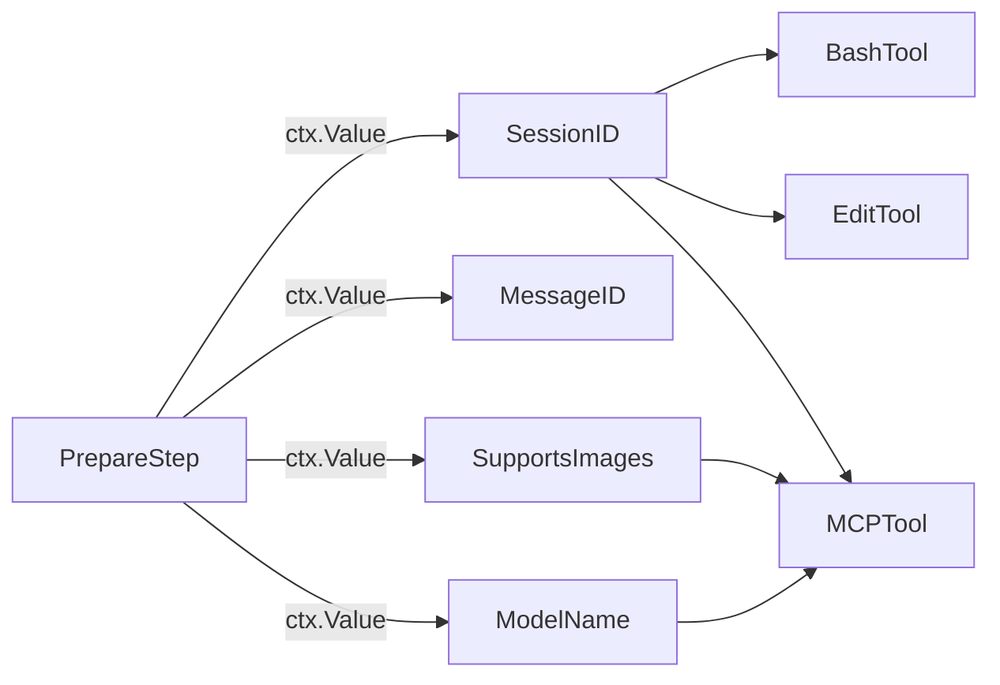
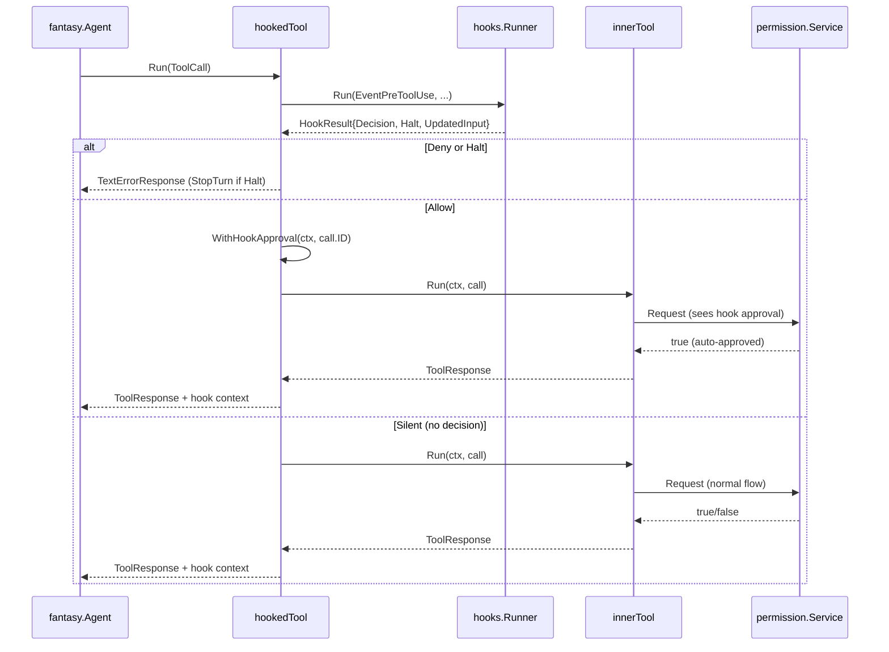

[上一篇：05-Agent协调器与会话管理](05-Agent协调器与会话管理.md) · [总目录](README.md) · [下一篇：07-LLM提供商集成](07-LLM提供商集成.md)

# 工具系统详解

> **场景**：理解 Crush 工具系统的架构设计、内置工具实现、MCP 工具集成、权限检查流程和 Hook 拦截机制。
> **时间**：2026-08-27 (CST)
> **版本**：Crush @ main branch, Go 1.26.6

## 本文件内容

1. [工具系统架构](#1-工具系统架构)
2. [Context 值传递](#2-context-值传递)
3. [内置工具清单](#3-内置工具清单)
4. [Bash 工具详解](#4-bash-工具详解)
5. [Edit 工具详解](#5-edit-工具详解)
6. [文件操作工具组](#6-文件操作工具组)
7. [LSP 工具组](#7-lsp-工具组)
8. [MCP 工具集成](#8-mcp-工具集成)
9. [权限检查流程](#9-权限检查流程)
10. [Hook 拦截机制](#10-hook-拦截机制)
11. [工具过滤与排序](#11-工具过滤与排序)

## 1. 工具系统架构

### 工具接口

Crush 的工具系统基于 `charm.land/fantasy` 库的 `fantasy.AgentTool` 接口。每个工具实现此接口：

```
fantasy.AgentTool 接口
方法：Info() → ToolInfo
方法：Run(ctx, ToolCall) → (ToolResponse, error)
方法：SetProviderOptions(ProviderOptions)
方法：ProviderOptions() → ProviderOptions
```

### 工具创建模式

所有内置工具使用 `fantasy.NewAgentTool` 函数创建，传入工具名、描述和执行函数：

```
fantasy.NewAgentTool(name, description, func(ctx, params, call) → (ToolResponse, error))
```

参数类型通过 Go 泛型约束——`params` 是工具特定的结构体，带有 `json` tag 和 `description` tag，fantasy 自动将其转换为 JSON Schema 供 LLM 使用。

### 工具描述模板

部分工具使用 Go `html/template` 渲染描述，支持条件逻辑：

```
internal/agent/tools/tools.go
函数：renderToolDescription
偏移：+0 ～ +9
```

```go
func renderToolDescription(tmpl *template.Template) string {
    data := toolDescriptionData{GhAvailable: ghAvailable}
    var out bytes.Buffer
    if err := tmpl.Execute(&out, data); err != nil {
        panic("failed to execute tool description template: " + err.Error())
    }
    return out.String()
}
```

`ghAvailable` 检查 `gh` CLI 是否在 PATH 中（测试中为 false），用于在工具描述中条件性地包含 GitHub 相关说明。

## 2. Context 值传递

```
internal/agent/tools/tools.go
Const：SessionIDContextKey = "session_id"
Const：MessageIDContextKey = "message_id"
Const：SupportsImagesContextKey = "supports_images"
Const：ModelNameContextKey = "model_name"
```

这些 context key 在 `SessionAgent.Run` 的 `PrepareStep` 回调中设置，工具通过以下辅助函数读取：

| 函数 | 返回值 | 用途 |
|------|--------|------|
| `GetSessionFromContext(ctx)` | string | 当前 session ID |
| `GetMessageFromContext(ctx)` | string | 当前 assistant message ID |
| `GetSupportsImagesFromContext(ctx)` | bool | 当前模型是否支持图片 |
| `GetModelNameFromContext(ctx)` | string | 当前模型名称 |



## 3. 内置工具清单

```
internal/agent/coordinator.go
函数：buildTools
偏移：+0 ～ +123
```

### 工具创建顺序

| 序号 | 工具名 | 构造函数 | 依赖 |
|------|--------|----------|------|
| 0 | `agent` | `c.agentTool(ctx)` | 条件：AllowedTools 包含 AgentToolName |
| 1 | `agentic_fetch` | `c.agenticFetchTool(ctx)` | 条件：AllowedTools 包含 AgenticFetchToolName |
| 2 | `bash` | `NewBashTool` | permissions, workingDir, attribution, modelID |
| 3 | `crush_info` | `NewCrushInfoTool` | cfg, lspManager, allSkills, activeSkills, skillTracker |
| 4 | `crush_logs` | `NewCrushLogsTool` | logFile |
| 5 | `job_output` | `NewJobOutputTool` | — |
| 6 | `job_kill` | `NewJobKillTool` | — |
| 7 | `download` | `NewDownloadTool` | permissions, workingDir |
| 8 | `edit` | `NewEditTool` | lspManager, permissions, history, filetracker, workingDir |
| 9 | `multiedit` | `NewMultiEditTool` | lspManager, permissions, history, filetracker, workingDir |
| 10 | `fetch` | `NewFetchTool` | permissions, workingDir |
| 11 | `glob` | `NewGlobTool` | workingDir, glob config |
| 12 | `grep` | `NewGrepTool` | workingDir, grep config |
| 13 | `ls` | `NewLsTool` | permissions, workingDir, ls config |
| 14 | `sourcegraph` | `NewSourcegraphTool` | — |
| 15 | `todos` | `NewTodosTool` | sessions |
| 16 | `view` | `NewViewTool` | lspManager, permissions, filetracker, skillTracker, workingDir, skillsPaths |
| 17 | `write` | `NewWriteTool` | lspManager, permissions, history, filetracker, workingDir |
| 18 | `question` | `NewQuestionTool` | questions — 仅交互模式且非 sub-agent |

### LSP 工具组（条件性）

当配置了 LSP 或 `AutoLSP` 为 nil/true 时添加：

| 工具名 | 构造函数 | 功能 |
|--------|----------|------|
| `diagnostics` | `NewDiagnosticsTool` | 获取 LSP 诊断信息 |
| `references` | `NewReferencesTool` | 查找引用 |
| `lsp_restart` | `NewLSPRestartTool` | 重启 LSP 服务器 |
| `symbols` | `NewSymbolsTool` | 获取文档符号 |
| `definition` | `NewDefinitionTool` | 跳转到定义 |
| `call_hierarchy` | `NewCallHierarchyTool` | 调用层次 |
| `rename` | `NewRenameTool` | 重命名符号 |
| `replace_symbol` | `NewReplaceSymbolTool` | 替换符号 |

### MCP 工具组（条件性）

当配置了 MCP 时添加：

| 工具名 | 构造函数 | 功能 |
|--------|----------|------|
| `list_mcp_resources` | `NewListMCPResourcesTool` | 列出 MCP 资源 |
| `read_mcp_resource` | `NewReadMCPResourceTool` | 读取 MCP 资源 |

外加通过 `GetMCPTools` 动态获取的所有已连接 MCP 服务器的工具。

## 4. Bash 工具详解

```
internal/agent/tools/bash.go
函数：NewBashTool
偏移：+0 ～ +200+
```

### 参数

```
Struct：BashParams
字段：Description         → string  — 命令描述（≤30字符）
字段：Command             → string  — 要执行的命令
字段：WorkingDir          → string  — 工作目录（可选）
字段：RunInBackground     → bool    — 是否后台运行
字段：AutoBackgroundAfter → int     — 自动转后台的超时秒数（默认60）
```

### 禁止命令列表

```
internal/agent/tools/bash.go
Var：bannedCommands
偏移：+0 ～ +72
```

禁止的命令分为五组：

| 分组 | 命令示例 |
|------|---------|
| 网络/下载 | `curl`, `wget`, `ssh`, `scp`, `nc`, `telnet` |
| 系统管理 | `sudo`, `su`, `doas` |
| 包管理器 | `apt`, `dnf`, `pacman`, `yum`, `brew`, `cargo`, `gem`, `npm`, `pip` |
| 系统修改 | `crontab`, `systemctl`, `mount`, `fdisk`, `mkfs` |
| 网络配置 | `ifconfig`, `iptables`, `route`, `ufw` |

### 命令阻断函数

```
internal/agent/tools/bash.go
函数：blockFuncs
偏移：+0 ～ +30
```

返回 `[]shell.BlockFunc`，包含：
- `CommandsBlocker(bannedCommands)` — 完全禁止的命令
- `ArgumentsBlocker` — 禁止特定参数组合（如 `npm install --global`、`go test -exec`）

### 安全只读命令

```
internal/agent/tools/bash.go
Var：safeCommands
```

只读安全命令（如 `ls`, `cat`, `echo`, `pwd`, `date` 等）跳过权限请求，直接执行。

判断逻辑：命令不含管道/链式操作符（`containsCommandChaining` 返回 false），且以安全命令开头。

### 执行流程

```
┌────────────────────────────────────────────┐
│ 解析参数，确定 workingDir                    │
├────────────────────────────────────────────┤
│ 判断 isSafeReadOnly                         │
│   ├─ 是 → 跳过权限请求                       │
│   └─ 否 → permissions.Request              │
│           ├─ 允许 → 继续                     │
│           └─ 拒绝 → NewPermissionDeniedResp │
├────────────────────────────────────────────┤
│ RunInBackground?                            │
│   ├─ 是 → bgManager.Start(bgCtx)           │
│   │       Sleep 1s 检测快速失败              │
│   │       ├─ done → 返回结果                 │
│   │       └─ running → 返回 job ID          │
│   └─ 否 → shell.Run(ctx, cmd, ...)         │
│           超过 AutoBackgroundAfter → 转后台  │
├────────────────────────────────────────────┤
│ 格式化输出                                   │
│   MaxOutputLength = 30000                  │
│   超长截断                                    │
│   追加 <cwd> 标签                            │
└────────────────────────────────────────────┘
```

### 常量

```
BashToolName = "bash"
DefaultAutoBackgroundAfter = 60
MaxOutputLength = 30000
BashNoOutput = "no output"
```

## 5. Edit 工具详解

```
internal/agent/tools/edit.go
函数：NewEditTool
偏移：+0 ～ +80+
```

### 参数

```
Struct：EditParams
字段：FilePath   → string — 文件绝对路径
字段：OldString  → string — 要替换的文本
字段：NewString  → string — 替换后的文本
字段：ReplaceAll → bool   — 是否替换所有匹配
```

### 执行流程

1. `filepathext.SmartJoin(workingDir, params.FilePath)` — 智能拼接路径
2. 如果 `OldString == ""`：创建新文件（走 write 路径）
3. 否则执行替换：
   - 读取文件内容
   - 查找 `OldString` — 如果 `ReplaceAll` 为 false，必须唯一匹配
   - 替换为 `NewString`
   - 写入文件
   - 调用 LSP 通知文件变更
   - 记录到 `history.Service`
   - 通知 `filetracker.Service`

### 权限请求

```
Struct：EditPermissionsParams
字段：FilePath, OldContent, NewContent
```

权限请求包含旧内容和新内容摘要，供用户审查。

### 响应元数据

```
Struct：EditResponseMetadata
字段：Additions  → int    — 新增行数
字段：Removals   → int    — 删除行数
字段：OldContent → string — 旧内容
字段：NewContent → string — 新内容
```

## 6. 文件操作工具组

### Write 工具

```
internal/agent/tools/write.go
函数：NewWriteTool
```

创建或完全覆盖文件。参数：`FilePath`, `Content`。

权限请求包含文件路径和内容摘要。写入后通知 LSP 和 filetracker。

### View 工具

```
internal/agent/tools/view.go
函数：NewViewTool
```

读取文件内容，支持行号范围、图片查看、技能文件查看。参数：`FilePath`, `Offset`, `Limit`。

对于图片文件，返回 base64 编码的图片数据（如果模型支持图片）。

### Glob 工具

```
internal/agent/tools/glob.go
函数：NewGlobTool
```

文件模式匹配，使用 doublestar 库。参数：`Pattern`, `Path`。

### Grep 工具

```
internal/agent/tools/grep.go
函数：NewGrepTool
```

内容搜索，底层使用 ripgrep（如果可用）或 Go 正则。参数：`Pattern`, `Path`, `Include`, `Exclude`, `OutputMode`。

### Ls 工具

```
internal/agent/tools/ls.go
函数：NewLsTool
```

列出目录内容。参数：`Path`。

### MultiEdit 工具

```
internal/agent/tools/multiedit.go
函数：NewMultiEditTool
```

批量编辑，对同一文件执行多个替换操作。参数：`FilePath`, `Edits []EditOperation`。

## 7. LSP 工具组

所有 LSP 工具通过 `lsp.Manager` 与语言服务器交互：

| 工具 | 参数 | 返回 |
|------|------|------|
| `diagnostics` | `FilePath` | 诊断信息列表 |
| `references` | `FilePath`, `Line`, `Column` | 引用位置列表 |
| `definition` | `FilePath`, `Line`, `Column` | 定义位置 |
| `symbols` | `FilePath` | 文档符号树 |
| `call_hierarchy` | `FilePath`, `Line`, `Column`, `Direction` | 调用关系 |
| `rename` | `FilePath`, `Line`, `Column`, `NewName` | 重命名预览 |
| `replace_symbol` | `FilePath`, `Line`, `Column`, `NewName` | 执行重命名 |
| `lsp_restart` | `Name` | 重启指定 LSP 服务器 |

## 8. MCP 工具集成

### Tool 结构

```
internal/agent/tools/mcp-tools.go
Struct：Tool
字段：mcpName         → string        — MCP 服务器名称
字段：tool            → *mcp.Tool     — MCP 工具定义
字段：cfg             → *config.ConfigStore
字段：permissions     → permission.Service
字段：workingDir      → string
字段：providerOptions → fantasy.ProviderOptions
```

### 工具命名

```
函数：Name()
返回：fmt.Sprintf("mcp_%s_%s", m.mcpName, m.tool.Name)
```

MCP 工具名格式为 `mcp_<服务器名>_<工具名>`，确保命名空间隔离。

### GetMCPTools

```
internal/agent/tools/mcp-tools.go
函数：GetMCPTools
偏移：+0 ～ +15
```

遍历 `mcp.Tools()` 获取所有已连接 MCP 服务器的所有工具，为每个工具创建 `*Tool` 实例。

### Run 执行流程

```
函数：Run
偏移：+0 ～ +53
```

1. 从 context 获取 sessionID
2. **权限检查**：除非在 `whitelistDockerTools` 白名单中，否则调用 `permissions.Request`
3. 调用 `mcp.RunTool(ctx, cfg, mcpName, toolName, params.Input)` 执行工具
4. **结果转换**：
   - `image` / `media` 类型：检查 `SupportsImages`，不支持则返回错误；支持则返回 `NewImageResponse` 或 `NewMediaResponse`
   - 其他类型：返回 `NewTextResponse(result.Content)`

### Docker MCP 白名单

```
Var：whitelistDockerTools
值：["mcp_docker_mcp-find", "mcp_docker_mcp-add", "mcp_docker_mcp-remove", 
     "mcp_docker_mcp-config-set", "mcp_docker_code-mode"]
```

这些 Docker MCP 工具跳过权限请求，因为它们是管理性质的非破坏性操作。

## 9. 权限检查流程

### 权限请求模式

所有需要权限的工具都遵循相同模式：

```
┌─────────────────────────────────────────┐
│ 1. 从 context 获取 sessionID            │
│ 2. 构造 PermissionRequest               │
│    - SessionID                          │
│    - ToolCallID                         │
│    - ToolName                           │
│    - Action ("execute" / "edit" / ...)  │
│    - Description                        │
│    - Params                             │
│    - Path (workingDir)                  │
│ 3. permissions.Request(ctx, req)        │
│    ├─ true  → 继续执行                   │
│    ├─ false → NewPermissionDeniedResp   │
│    │          (StopTurn = true)          │
│    └─ error  → 返回 error               │
└─────────────────────────────────────────┘
```

### PermissionDeniedResponse

```
internal/agent/tools/tools.go
函数：NewPermissionDeniedResponse
偏移：+0 ～ +4
```

```go
func NewPermissionDeniedResponse() fantasy.ToolResponse {
    resp := fantasy.NewTextErrorResponse("User denied permission")
    resp.StopTurn = true
    return resp
}
```

`StopTurn = true` 告诉 fantasy agent 循环不要重试——用户已明确拒绝。

### Hook 预批准

```
internal/permission/permission.go
函数：WithHookApproval
```

当 PreToolUse hook 返回 `DecisionAllow` 时，通过 `permission.WithHookApproval(ctx, call.ID)` 将批准写入 context。后续权限检查读取此批准，跳过用户交互。

### Yolo 模式

```
internal/agent/coordinator.go
函数：buildAgent
偏移：+38
```

```go
IsYolo: c.permissions.SkipRequests()
```

当 yolo 模式开启时，`SkipRequests()` 返回 true，sessionAgent 设置 `isYolo = true`，所有权限请求自动通过。

## 10. Hook 拦截机制

### hookedTool 包装器

```
internal/agent/hooked_tool.go
Struct：hookedTool
字段：inner  → fantasy.AgentTool
字段：runner → *hooks.Runner
```

### wrapToolsWithHooks

```
internal/agent/hooked_tool.go
函数：wrapToolsWithHooks
偏移：+0 ～ +9
```

```go
func wrapToolsWithHooks(tools []fantasy.AgentTool, runner *hooks.Runner, isSubAgent bool) []fantasy.AgentTool {
    if runner == nil || isSubAgent {
        return tools
    }
    out := make([]fantasy.AgentTool, len(tools))
    for i, tool := range tools {
        out[i] = newHookedTool(tool, runner)
    }
    return out
}
```

关键设计：
- `runner == nil`：无 PreToolUse hooks 配置，不包装
- `isSubAgent == true`：sub-agent 不触发 hooks，避免 N 次重复触发

### hookedTool.Run 执行流程

```
函数：Run
偏移：+0 ～ +46
```

1. 从 context 获取 sessionID
2. 调用 `h.runner.Run(ctx, EventPreToolUse, sessionID, call.Name, call.Input)` 执行所有匹配的 hooks
3. **Deny 或 Halt**：
   - Deny：返回错误响应（不设 StopTurn，模型可以尝试其他方法）
   - Halt：返回错误响应（设 StopTurn = true，终止整个 turn）
4. **UpdatedInput**：如果 hook 修改了输入，替换 `call.Input`
5. **Allow**：如果 hook 返回 allow，通过 `permission.WithHookApproval(ctx, call.ID)` 预批准权限
6. **调用内部工具**：`h.inner.Run(ctx, call)`
7. **追加 Context**：如果 hook 返回了额外上下文，追加到响应内容
8. **合并元数据**：合并 hook 元数据到响应



### hooks.Runner

```
internal/hooks/runner.go
Struct：Runner
字段：hooks      → []compiledHook
字段：cwd        → string
字段：projectDir → string
```

```
Struct：compiledHook
字段：cfg     → config.HookConfig
字段：matcher → *regexp.Regexp (nil = match all)
```

`NewRunner` 在构造时编译所有 matcher 正则表达式。编译失败的 hook 被跳过并记录警告。

## 11. 工具过滤与排序

### AllowedTools 过滤

```
internal/agent/coordinator.go
函数：buildTools
偏移：+82 ～ +90
```

```go
var filteredTools []fantasy.AgentTool
for _, tool := range allTools {
    if slices.Contains(agent.AllowedTools, tool.Info().Name) {
        filteredTools = append(filteredTools, tool)
    }
}
```

只有 `agent.AllowedTools` 列表中出现的工具才被保留。这允许配置文件精确控制每个 agent 可用的工具子集。

### AllowedMCP 过滤

```
internal/agent/coordinator.go
函数：buildTools
偏移：+91 ～ +112
```

MCP 工具的过滤逻辑：

- `agent.AllowedMCP == nil`：无 MCP 限制，所有 MCP 工具通过
- `len(agent.AllowedMCP) == 0`：不允许任何 MCP 工具
- 否则：遍历 `AllowedMCP` map，检查每个 MCP 服务器和工具名

```go
for mcp, tools := range agent.AllowedMCP {
    if mcp != tool.MCP() { continue }
    if len(tools) == 0 || slices.Contains(tools, tool.MCPToolName()) {
        filteredTools = append(filteredTools, tool)
        break
    }
}
```

`tools` 为空列表表示允许该 MCP 的所有工具。

### 排序

```
internal/agent/coordinator.go
函数：buildTools
偏移：+113 ～ +115
```

```go
slices.SortFunc(filteredTools, func(a, b fantasy.AgentTool) int {
    return strings.Compare(a.Info().Name, b.Info().Name)
})
```

按工具名字典序排序，确保工具列表顺序稳定（对 LLM 的工具描述一致性重要）。

### 工具总数

最终工具列表 = 内置工具（过滤后）+ LSP 工具（条件性）+ MCP 资源工具（条件性）+ MCP 动态工具（过滤后），通常 18～30+ 个工具，取决于配置。

---

[上一篇：05-Agent协调器与会话管理](05-Agent协调器与会话管理.md) · [总目录](README.md) · [下一篇：07-LLM提供商集成](07-LLM提供商集成.md)