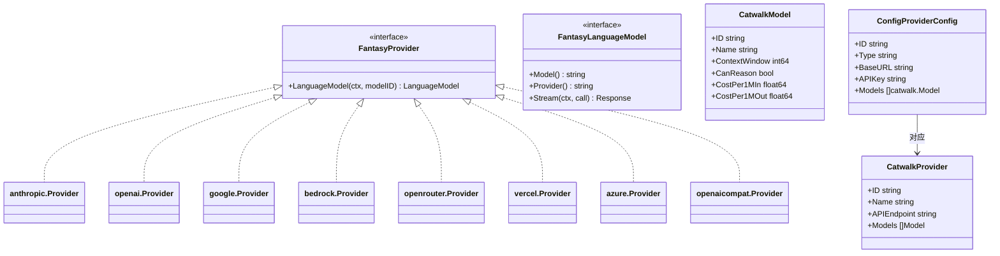

[上一篇：06-工具系统详解](06-工具系统详解.md) · [总目录](README.md) · [下一篇：08-配置系统](08-配置系统.md)

# LLM 提供商集成

> **场景**：理解 Crush 如何通过 catwalk + fantasy 抽象层集成多个 LLM 提供商（OpenAI、Anthropic、Google、Bedrock、OpenRouter、Vercel、Azure、Hyper 及 OpenAI 兼容提供商），包括 provider 构造、模型创建、reasoning effort 设置和 provider options 合并。
> **时间**：2026-08-27 (CST)
> **版本**：Crush @ main branch, Go 1.26.6, charm.land/fantasy v0.41.2, charm.land/catwalk pkg

## 本文件内容

1. [架构概览](#1-架构概览)
2. [Provider 类型映射](#2-provider-类型映射)
3. [buildProvider 路由](#3-buildprovider-路由)
4. [各 Provider 构造详解](#4-各-provider-构造详解)
5. [ProviderOptions 合并机制](#5-provideroptions-合并机制)
6. [Reasoning Effort 设置](#6-reasoning-effort-设置)
7. [Hyper 提供商](#7-hyper-提供商)
8. [模型创建与 LanguageModel](#8-模型创建与-languagemodel)
9. [Anthropic 缓存控制](#9-anthropic-缓存控制)
10. [会话亲和性 Headers](#10-会话亲和性-headers)

## 1. 架构概览

Crush 使用两层抽象集成 LLM：

```
┌─────────────────────────────────────────────────┐
│ Crush Agent 层                                   │
│ sessionAgent → fantasy.Agent.Stream              │
├─────────────────────────────────────────────────┤
│ Fantasy 抽象层 (charm.land/fantasy v0.41.2)     │
│ Agent / LanguageModel / Provider / AgentTool     │
├─────────────────────────────────────────────────┤
│ Catwalk 模型目录 (charm.land/catwalk)           │
│ Provider / Model 元数据 (定价、能力、上下文窗口)  │
├─────────────────────────────────────────────────┤
│ 具体 Provider SDK                                │
│ anthropic / openai / google / bedrock /          │
│ openrouter / vercel / azure / openaicompat       │
└─────────────────────────────────────────────────┘
```



## 2. Provider 类型映射

```
internal/config/config.go
Struct：ProviderConfig
字段：Type → catwalk.Type
```

`catwalk.Type` 是 provider 的类型标识，对应 fantasy 库中的 provider 包名：

| catwalk.Type 值 | fantasy provider 包 | buildProvider 分支 |
|---|---|---|
| `openai` | `charm.land/fantasy/providers/openai` | `buildOpenaiProvider` |
| `anthropic` | `charm.land/fantasy/providers/anthropic` | `buildAnthropicProvider` |
| `openrouter` | `charm.land/fantasy/providers/openrouter` | `buildOpenrouterProvider` |
| `vercel` | `charm.land/fantasy/providers/vercel` | `buildVercelProvider` |
| `azure` | `charm.land/fantasy/providers/azure` | `buildAzureProvider` |
| `bedrock` | `charm.land/fantasy/providers/bedrock` | `buildBedrockProvider` |
| `google` | `charm.land/fantasy/providers/google` | `buildGoogleProvider` |
| `"google-vertex"` | `charm.land/fantasy/providers/google` (Vertex 模式) | `buildGoogleVertexProvider` |
| `openaicompat` | `charm.land/fantasy/providers/openaicompat` | `buildOpenaiCompatProvider` |
| `hyper` | `charm.land/fantasy/providers/openaicompat` (Hyper 变体) | `buildOpenaiCompatProvider` |
| `litellm` / `ollama` / `omlx` | `charm.land/fantasy/providers/openaicompat` | `buildOpenaiCompatProvider` (通过 `discover.IsKnownCustomProvider`) |

## 3. buildProvider 路由

```
internal/agent/coordinator.go
函数：buildProvider
偏移：+0 ～ +62
```

### 执行步骤

1. **克隆 ExtraHeaders**：`maps.Clone(providerCfg.ExtraHeaders)`
2. **Anthropic thinking header**：如果 provider 是 Anthropic 且模型启用了 thinking，添加 `anthropic-beta: interleaved-thinking-2025-05-14` header
3. **解析变量**：`c.cfg.Resolve(providerCfg.APIKey)` 和 `c.cfg.Resolve(providerCfg.BaseURL)` — 支持环境变量和 crushrc 变量
4. **OpenCode 特殊路由**：对于 `InferenceProviderOpenCodeGo` / `InferenceProviderOpenCodeZen`，如果模型在 `opencodeMessagesModels` 列表中（如 `qwen3.7-max`），使用 Anthropic Messages API 而非 OpenAI Chat Completions
5. **主 switch**：按 `providerCfg.Type` 路由到对应的 build 函数
6. **默认分支**：检查是否是已知自定义 provider（litellm/ollama/omlx），是则走 openaicompat；否则返回错误

### OpenCode 特殊路由

```
internal/agent/coordinator.go
Var：opencodeMessagesModels
值：{"qwen3.7-max": true}
```

某些 OpenCode 提供商的模型使用 Anthropic Messages API 而非 OpenAI Chat Completions。路由条件：

```go
switch providerCfg.ID {
case string(catwalk.InferenceProviderOpenCodeGo), string(catwalk.InferenceProviderOpenCodeZen):
    if opencodeMessagesModels[model.Model] {
        baseURL = strings.TrimSuffix(baseURL, "/v1")
        return c.buildAnthropicProvider(baseURL, apiKey, headers, providerCfg.ID)
    }
}
```

## 4. 各 Provider 构造详解

### buildAnthropicProvider

```
internal/agent/coordinator.go
函数：buildAnthropicProvider
偏移：+0 ～ +30
```

认证模式：
- `Bearer ` 前缀的 API key → 设置 `Authorization` header，清除 `ANTHROPIC_API_KEY` 环境变量
- MiniMax provider → `Authorization: Bearer <key>`，清除环境变量
- 普通 API key → `anthropic.WithAPIKey(apiKey)` (X-Api-Key header)

可选配置：自定义 headers、baseURL、debug HTTP client。

### buildOpenaiProvider

```
internal/agent/coordinator.go
函数：buildOpenaiProvider
偏移：+0 ～ +15
```

默认启用 Responses API（`openai.WithUseResponsesAPI()`）。支持自定义 headers、baseURL、debug HTTP client。

### buildOpenaiCompatProvider

```
internal/agent/coordinator.go
函数：buildOpenaiCompatProvider
偏移：+0 ～ +35
```

用于 OpenAI 兼容提供商（Hyper、ZAI、IoNet、DeepSeek、Fireworks、Baseten、Alibaba、Copilot 等）。

特殊处理：
- **Copilot**：启用 Responses API，使用 `copilotResponsesModels` 列表判断哪些模型走 Responses API vs Chat Completions；使用 `copilot.NewClient` 作为 HTTP client
- **ExtraBody**：通过 `openaicompat.WithSDKOptions(openaisdk.WithJSONSet(key, value))` 设置额外请求体字段

```
internal/agent/coordinator.go
Var：copilotResponsesModels
偏移：+0 ～ +12
值：{"gpt-5.2": true, "gpt-5.2-codex": true, "gpt-5.3-codex": true, 
      "gpt-5.4": true, "gpt-5.4-mini": true, "gpt-5.5": true,
      "gpt-5-mini": true, "gpt-5.6-luna": true, "gpt-5.6-terra": true,
      "gpt-5.6-sol": true}
```

### buildBedrockProvider

```
internal/agent/coordinator.go
函数：buildBedrockProvider
偏移：+0 ～ +27
```

认证优先级：
1. `apiKey` 参数
2. `AWS_BEARER_TOKEN_BEDROCK` 环境变量
3. SDK 自动认证（IAM role、credentials 文件等）

区域选择：
- `InferenceProviderBedrockEurope` → `eu-west-1`
- 其他 → `us-east-1`

### buildGoogleProvider / buildGoogleVertexProvider

```
函数：buildGoogleProvider
偏移：+0 ～ +12
```

使用 `google.WithGeminiAPIKey(apiKey)` 认证，支持自定义 baseURL。

```
函数：buildGoogleVertexProvider
偏移：+0 ～ +15
```

使用 Vertex AI 模式：`google.WithVertex(project, location)`，从 `ExtraParams` 读取 project 和 location。

### buildAzureProvider

```
函数：buildAzureProvider
偏移：+0 ～ +21
```

启用 Responses API（`azure.WithUseResponsesAPI()`）。从 `ExtraParams["apiVersion"]` 读取 API 版本。

### buildOpenrouterProvider / buildVercelProvider

这两个 provider 构造简单：API key + 可选 headers + 可选 debug client。

## 5. ProviderOptions 合并机制

```
internal/agent/coordinator.go
函数：getProviderOptions
偏移：+0 ～ +252
```

### 三层合并

ProviderOptions 来自三个来源，按优先级递增：

1. **Catwalk 模型元数据** (`model.CatwalkCfg.Options.ProviderOptions`) — 模型内置默认值
2. **Provider 配置** (`providerCfg.ProviderOptions`) — 提供商级覆盖
3. **用户模型配置** (`model.ModelCfg.ProviderOptions`) — 用户在 crush.json 中设置

使用 `jsons.Merge` 库进行深度合并（后者覆盖前者）：

```go
readers := []io.Reader{
    bytes.NewReader(catwalkOpts),    // 最低优先级
    bytes.NewReader(providerCfgOpts),
    bytes.NewReader(cfgOpts),        // 最高优先级
}
got, err := jsons.Merge(readers)
```

### mergeCallOptions

```
internal/agent/coordinator.go
函数：mergeCallOptions
偏移：+0 ～ +8
```

```go
func mergeCallOptions(model Model, cfg config.ProviderConfig) (fantasy.ProviderOptions, *float64, *float64, *int64, *float64, *float64) {
    modelOptions := getProviderOptions(model, cfg)
    temp := cmp.Or(model.ModelCfg.Temperature, model.CatwalkCfg.Options.Temperature)
    topP := cmp.Or(model.ModelCfg.TopP, model.CatwalkCfg.Options.TopP)
    topK := cmp.Or(model.ModelCfg.TopK, model.CatwalkCfg.Options.TopK)
    freqPenalty := cmp.Or(model.ModelCfg.FrequencyPenalty, model.CatwalkCfg.Options.FrequencyPenalty)
    presPenalty := cmp.Or(model.ModelCfg.PresencePenalty, model.CatwalkCfg.Options.PresencePenalty)
    return modelOptions, temp, topP, topK, freqPenalty, presPenalty
}
```

`cmp.Or` 返回第一个非零值——用户配置优先于模型默认值。

## 6. Reasoning Effort 设置

```
internal/agent/coordinator.go
函数：effectiveReasoningEffort
偏移：+0 ～ +18
```

优先级：
1. 用户选择的 `model.ModelCfg.ReasoningEffort` — 必须在 `CatwalkCfg.ReasoningLevels` 列表中
2. 模型默认的 `model.CatwalkCfg.DefaultReasoningEffort` — 必须在 ReasoningLevels 中
3. `ReasoningLevels[0]` — 第一个可用级别

如果 `model.CatwalkCfg.CanReason == false`，返回空字符串。

### Provider 特定的 Reasoning 设置

`getProviderOptions` 函数根据 provider 类型设置 reasoning 参数：

| Provider 类型 | 字段 | 格式 |
|---|---|---|
| OpenAI / Azure | `reasoning_effort` | 字符串值 |
| OpenAI Responses (reasoning model) | `reasoning_summary: "auto"`, `include: [ReasoningEncryptedContent]` | — |
| Anthropic / Bedrock | `effort` 或 `thinking: {budget_tokens: 2000}` | — |
| Anthropic (Alibaba) | `extra_body.reasoning_effort` 或 `extra_body.thinking: {type: "enabled/disabled"}` | — |
| OpenRouter | `reasoning: {enabled: true, effort: "..."}` | — |
| Vercel | `reasoning: {enabled: true, effort: "..."}` | — |
| Google (Gemini 2.x) | `thinking_config: {thinking_budget: 2000, include_thoughts: true}` | — |
| Google (其他) | `thinking_config: {thinking_level: "...", include_thoughts: true}` | — |
| OpenAICompat (Hyper) | `extra_body.thinking: bool` | — |
| OpenAICompat (IoNet) | `extra_body.reasoning: {effort: "..."}` | — |
| OpenAICompat (ZAI/DeepSeek) | `extra_body.thinking: {type: "enabled/disabled"}` | — |
| OpenAICompat (Fireworks) | `extra_body.thinking: {type: "enabled/disabled"}` | 不与 reasoning_effort 同时设置 |
| OpenAICompat (Baseten) | `extra_body.chat_template_args: {enable_thinking: bool}` | — |
| OpenAICompat (OpenCode/MiniMax) | `extra_body.thinking: {type: "adaptive/disabled"}`, `reasoning_split: true` | — |
| OpenAICompat (Alibaba) | `extra_body.enable_thinking: bool` | — |

## 7. Hyper 提供商

```
internal/agent/hyper/provider.go
Const：Name = "hyper"
Const：DisplayName = "Charm Hyper"
Const：defaultBaseURL = "https://hyper.charm.land"
```

Hyper 是 Charm 官方的 LLM 代理服务，提供统一的 API 接口。

### 嵌入式 Provider 元数据

```
internal/agent/hyper/provider.go
嵌入资源：//go:embed provider.json
Var：embedded []byte
```

Hyper 的 provider 元数据（支持的模型列表、定价等）在编译时嵌入，通过 `go:generate` 从 `https://hyper.charm.land/v1/provider` 下载。

```
函数：Embedded
类型：sync.OnceValue[catwalk.Provider]
```

`sync.OnceValue` 确保只解析一次。支持 `HYPER_URL` 环境变量覆盖 API endpoint。

### 模型目录

```
internal/agent/hyper/provider.json
```

当前嵌入的 `provider.json` 包含 **28 个模型**，覆盖 9 个模型族：

| 模型族 | 代表模型 | 说明 |
|--------|---------|------|
| DeepSeek | deepseek-v4-flash, deepseek-v4-pro | 推理模型，最高 1M 上下文 |
| GLM | glm-5, glm-5.1, glm-5.2 | 智谱 GLM 系列 |
| Gemma | gemma-4-26b-a4b-it | Google 轻量模型 |
| gpt-oss | gpt-oss-120b | 开源 GPT，7 级推理 |
| Kimi | kimi-k2.5, kimi-k2.6, kimi-k2.7-code, kimi-k3 | 月之暗面 Kimi 系列 |
| Llama | llama-3.3-70b, llama-4-maverick-17b | Meta 开源模型 |
| MiniMax | minimax-m2.7, minimax-m3 | MiniMax 系列 |
| Qwen | qwen3.6~3.8 多个变体 | 阿里通义千问系列（默认模型） |
| Qwen Coder | qwen3-coder-480b | 代码专用 |

默认大模型：`qwen3.8-max`，默认小模型：`qwen3.8-27b`。API endpoint 为 `https://hyper.charm.land/api/v1/fantasy`。定价范围从 $0.12/M tokens（Gemma 4）到 $16.33/M output tokens（Kimi K3）。

### 信用余额

```
internal/agent/hyper/provider.go
函数：FetchCredits
偏移：+0 ～ +39
```

两种获取方式：
1. **从 API 响应元数据提取**：`extractHyperCredits` 在 `OnStepFinish` 中从 OpenAI provider metadata 读取 `remaining.hypercredits`，调用 `SetBalance` 存储
2. **直接 API 调用**：`GET /v1/credits`，使用 Bearer token 认证

优先使用提取的值（避免额外 HTTP 请求）；没有时才调用 API。

### Hyper 在 buildProvider 中的特殊处理

```
internal/agent/coordinator.go
函数：buildProvider
偏移：+43 ～ +47
```

```go
case hyper.Name:
    baseURL = hyper.BaseURL() + "/v1"
    headers["x-crush-id"] = event.GetID()
```

设置 baseURL 为 `https://hyper.charm.land/v1`，添加 `x-crush-id` header 用于请求追踪。

### 401 重新认证

当 Hyper provider 返回 401 时，coordinator 发布 `TypeReAuthenticate` 通知，触发 TUI 显示重新认证提示。

## 8. 模型创建与 LanguageModel

```
internal/agent/coordinator.go
函数：buildAgentModels
偏移：+0 ～ +83
```

### 执行步骤

1. 从配置读取 `SelectedModelTypeLarge` 和 `SelectedModelTypeSmall` 的 `SelectedModel`
2. 从 `Providers` 获取对应的 `ProviderConfig`
3. 调用 `buildProvider` 创建 `fantasy.Provider`
4. 在 `providerCfg.Models` 列表中查找匹配的 `catwalk.Model`
5. OpenRouter exacto 后缀处理
6. 调用 `provider.LanguageModel(ctx, modelID)` 创建 `fantasy.LanguageModel`
7. 包装为 `Model` 结构体

### OpenRouter Exacto

```
internal/agent/coordinator.go
函数：isExactoSupported
偏移：+0 ～ +9
```

```go
func isExactoSupported(modelID string) bool {
    supportedModels := []string{
        "moonshotai/kimi-k2-0905",
        "deepseek/deepseek-v3.1-terminus",
        "z-ai/glm-4.6",
        "openai/gpt-oss-120b",
        "qwen/qwen3-coder",
    }
    return slices.Contains(supportedModels, modelID)
}
```

对于支持的模型，在 OpenRouter 上追加 `:exacto` 后缀以启用 exacto 模式（推测是更精确的推理模式）。

### Model 结构体

```
internal/agent/agent.go
Struct：Model
字段：Model      → fantasy.LanguageModel
字段：CatwalkCfg → catwalk.Model
字段：ModelCfg   → config.SelectedModel
字段：FlatRate   → bool
```

`FlatRate` 为 true 时，成本计算跳过（包月/固定费率模型）。

## 9. Anthropic 缓存控制

```
internal/agent/agent.go
函数：getCacheControlOptions
偏移：+0 ～ +15
```

```go
func (a *sessionAgent) getCacheControlOptions() fantasy.ProviderOptions {
    if t, _ := strconv.ParseBool(os.Getenv("CRUSH_DISABLE_ANTHROPIC_CACHE")); t {
        return fantasy.ProviderOptions{}
    }
    return fantasy.ProviderOptions{
        anthropic.Name: &anthropic.ProviderCacheControlOptions{
            CacheControl: anthropic.CacheControl{Type: "ephemeral"},
        },
        bedrock.Name: &anthropic.ProviderCacheControlOptions{
            CacheControl: anthropic.CacheControl{Type: "ephemeral"},
        },
        vercel.Name: &anthropic.ProviderCacheControlOptions{
            CacheControl: anthropic.CacheControl{Type: "ephemeral"},
        },
    }
}
```

### 应用位置

在 `SessionAgent.Run` 中，缓存控制应用到两个位置：

1. **最后一个工具**：`agentTools[len(agentTools)-1].SetProviderOptions(a.getCacheControlOptions())`
2. **PrepareStep 中的消息**：最后 2 条消息和最后一条 system 消息添加 `ProviderOptions`

环境变量 `CRUSH_DISABLE_ANTHROPIC_CACHE` 可禁用缓存。

## 10. 会话亲和性 Headers

```
internal/agent/agent.go
函数：sessionHeaders
偏移：+0 ～ +6
```

```go
func sessionHeaders(sessionID string) map[string]string {
    hash := session.HashID(sessionID)
    return map[string]string{
        "x-session-id":       hash,
        "x-session-affinity": hash,
    }
}
```

使用 session ID 的 XXH3 哈希（通过 `session.HashID`）作为 HTTP header，用于 provider 端的会话亲和性路由。哈希值是确定且不透明的（不暴露原始 UUID）。

这些 headers 在 `agent.Stream` 调用中通过 `Headers` 字段传递：

```go
result, err = agent.Stream(genCtx, fantasy.AgentStreamCall{
    Headers: sessionHeaders(call.SessionID),
    ...
})
```

---

[上一篇：06-工具系统详解](06-工具系统详解.md) · [总目录](README.md) · [下一篇：08-配置系统](08-配置系统.md)