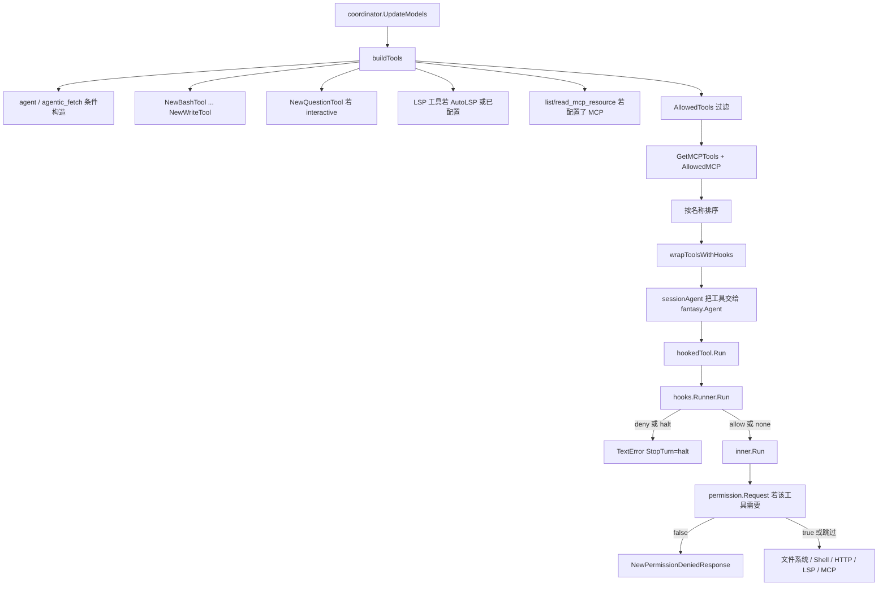
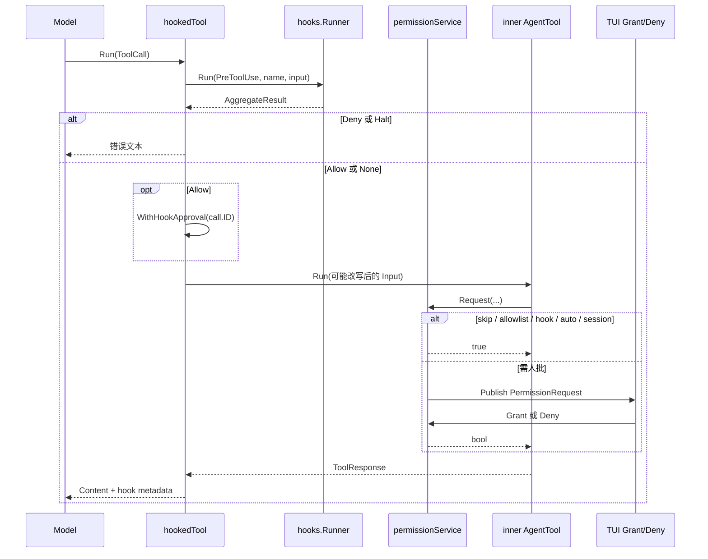

# 07. 工具、权限与 Hook

> 状态：待复核生成稿
> 生成日期：2026-08-16
> 基准提交：`16dce459cafecee92eae0ed7c47a0c641c8bbb9f`
> 工作区：dirty（开始分析时已有本目录下未提交文档）
> 源码范围：`internal/agent/coordinator.go`（`buildTools`）、`internal/agent/hooked_tool.go`、`internal/agent/agent_tool.go`、`internal/agent/agentic_fetch_tool.go`、`internal/agent/tools/`、`internal/hooks/`、`internal/permission/`
> 生成方式：源码、测试、配置与部署资产静态分析
> 所属层：第四层（补齐工具注册、权限判定、Hook 协议与全部内置工具）
> 前置阅读：[01-简单框架-系统骨架.md](01-简单框架-系统骨架.md)、[02-简单例子-全路径走读.md](02-简单例子-全路径走读.md)、[03-详细逐步说明-主链路拆解.md](03-详细逐步说明-主链路拆解.md)

## 快速摘要

### 架构总览（模块与依赖）

Coordinator 在每次 `UpdateModels` 时调用 `buildTools`，按 Agent 的 `AllowedTools` 装配内置工具、条件性 LSP/MCP 工具，以及当前 MCP 注册表里的动态工具。顶层 Agent 的每个工具外包一层 `hookedTool`；子 Agent（`agent`、`agentic_fetch` 内部）不包。工具执行时：Hook 先于权限，权限先于副作用。权限服务由 `app.App` 在装配时创建，TUI 通过 Broker 阻塞等待 Grant/Deny。

依赖方向：`coordinator.buildTools` → `fantasy.AgentTool` 实现 → `hooks.Runner` / `permission.Service` → 文件系统、HTTP、嵌入式 Shell、LSP Manager、MCP 注册表、Session/History/FileTracker。

### 核心调用序列（逐步逻辑）

1. `coordinator.run` 在非交互模式下先 `mcp.WaitForInit`，再 `UpdateModels`。
2. `UpdateModels` 调用 `buildTools(ctx, coderAgent, isSubAgent=false)`，得到排序后的工具表，`currentAgent.SetTools`。
3. `sessionAgent` 在 `PrepareStep` 把 SessionID、MessageID、是否支持图片、模型名写入 Context。
4. 模型发出 `fantasy.ToolCall`；顶层工具走 `hookedTool.Run`。
5. `hooks.Runner.Run(EventPreToolUse)` 并行执行匹配 Hook，按配置顺序聚合。
6. Deny/Halt 直接返回错误文本（Halt 设 `StopTurn`）；Allow 把 ToolCallID 写入 Context；`updated_input` 替换 `call.Input`。
7. 内层工具可能调用 `permission.Service.Request`。短路顺序：skip → allowlist → Hook approval → 串行锁 → AutoApproveSession → sessionPermissions → 阻塞等待 UI。
8. 获准后执行副作用，返回 `fantasy.ToolResponse`；Hook 的 `context` 与 metadata 合入结果。

### 易错点与边界条件

- Hook 只包装顶层 Agent。子 Agent 内部工具不触发用户 Hook；顶层对 `agent`/`agentic_fetch` 本身仍会触发。
- Hook `decision=allow` 必须带匹配的 `ToolCallID` 才能跳过权限提示。`download` 的 `Request` 未填 `ToolCallID`，Hook 预批准对该工具无效（见 5.8）。
- `bash` 对含 `;` `|` `&&` `$(` `` ` `` 的命令一律走权限，即使前缀是 `git status` 这类 safe 命令。
- 权限拒绝返回 `NewPermissionDeniedResponse()`，`StopTurn=true`，Agent 循环不再重试该调用。
- 交互 run 不等待慢 MCP；工具表是当时注册表的快照。非交互 `crush run` 会等 `WaitForInit`。
- `question` 只在 `!isSubAgent && c.interactive` 时注册。
- 本篇未运行完整 Go 测试套件；测试结论来自静态阅读 `*_test.go`。

## 目录

1. [为什么这样设计（Why）](#1-为什么这样设计why)
2. [它是什么（What）](#2-它是什么what)
3. [工具的统一形态与描述嵌入](#3-工具的统一形态与描述嵌入)
4. [`buildTools` 注册流水线](#4-buildtools-注册流水线)
5. [全部内置工具](#5-全部内置工具)
6. [权限服务](#6-权限服务)
7. [Hook 协议](#7-hook-协议)
8. [`hookedTool` 装饰器](#8-hookedtool-装饰器)
9. [安全边界](#9-安全边界)
10. [调用关系表](#10-调用关系表)
11. [Mermaid](#11-mermaid)
12. [测试覆盖](#12-测试覆盖)
13. [阅读源码建议顺序](#13-阅读源码建议顺序)
14. [重新实现检查清单](#14-重新实现检查清单)

## 1. 为什么这样设计（Why）

模型没有操作系统权限。Crush 把“能做什么”拆成三层独立决策：

1. **工具表**：Agent 配置决定模型能看见哪些工具。Coder 默认几乎全开；Task 子 Agent 只有只读搜索工具。
2. **Hook**：用户用 shell 命令在工具真正执行前改写、允许或拒绝调用。这是策略层，不是权限 UI。
3. **Permission**：对文件写入、工作区外读取、网络、Shell 执行、MCP 调用等副作用，向人阻塞询问。

三者分开是为了：Hook 可以在不问人的情况下拒绝或改写；人可以在 Hook 沉默时再批一次；yolo/skip 与 allowlist 只影响 Permission，不影响 Hook。Hook 放在 Permission 之前，是因为 Hook 的 `decision=allow` 要能预批准这次 ToolCall，避免同一动作问两次。

子 Agent 不跑 Hook，是为了避免一次委派把用户 Hook 触发 N 次。顶层对委派工具本身仍会跑一次。

## 2. 它是什么（What）

运行时对象：

| 对象 | 真实类型 | 谁创建 | 职责 |
|---|---|---|---|
| 工具表 | `[]fantasy.AgentTool` | `coordinator.buildTools` | 模型本轮可调用的工具 |
| 装饰器 | `*agent.hookedTool` | `wrapToolsWithHooks` | PreToolUse + 改写 input + 合入 metadata |
| Hook 执行器 | `*hooks.Runner` | `hooks.NewRunner` | 匹配、去重、并行跑、聚合 |
| 权限服务 | `*permission.permissionService` | `permission.NewPermissionService` | skip/allowlist/Hook/session/阻塞 UI |
| 工具 Context | `context.Context` 四个 typed key | `sessionAgent` PrepareStep | SessionID、MessageID、图片能力、模型名 |

工具最终都实现 `fantasy.AgentTool`：`Info()` 给出名称、描述、JSON Schema；`Run(ctx, ToolCall)` 执行。多数内置工具用 `fantasy.NewAgentTool`（串行）或 `fantasy.NewParallelAgentTool`（可与其他并行工具同时跑）。网络类（`fetch`、`download`、`sourcegraph`、`web_*`、MCP 资源）走 Parallel。

配置侧有两套“允许”含义，不要混：

- `config.Agent.AllowedTools`：模型能不能看见这个工具。`config.allToolNames()` 是全集；`Options.DisabledTools` 从中剔除。Task Agent 再经 `resolveReadOnlyTools` 只留 `glob/grep/ls/lsp_call_hierarchy/lsp_definition/lsp_symbols/sourcegraph/view`。
- `config.Permissions.AllowedTools`：Permission 的 allowlist。元素可以是工具名（`bash`）或 `tool:action`（`edit:write`）。这不决定工具是否出现在模型上下文里。

## 3. 工具的统一形态与描述嵌入

### 3.1 Context 四键

`internal/agent/tools/tools.go` 定义：

| Key 常量 | 取值函数 | 默认 | 谁依赖 |
|---|---|---|---|
| `SessionIDContextKey` | `GetSessionFromContext` | `""` | 几乎所有会 `Request` 或写 Session 的工具；缺失则返回 error |
| `MessageIDContextKey` | `GetMessageFromContext` | `""` | `agent`、`agentic_fetch` 用来建子 Session ID |
| `SupportsImagesContextKey` | `GetSupportsImagesFromContext` | `false` | `view` 读图、MCP 返回 image/media |
| `ModelNameContextKey` | `GetModelNameFromContext` | `""` | 图片不支持时的错误文案 |

测试：`internal/agent/tools/context_test.go`（`TestGetContextValue`、`TestGetSessionFromContext` 等）。

权限拒绝统一走 `NewPermissionDeniedResponse()`：文本 `"User denied permission"`，`StopTurn=true`。

### 3.2 描述如何嵌入

每个工具旁边有同名 `.md` 或 `.md.tpl`，用 `//go:embed` 编进二进制。

- **静态 `.md`**：`edit.md`、`write.md`、`todos.md`、`question.md`、LSP 系列、MCP 资源、`job_*`、`crush_info.md`、`agent_tool.md`。直接当 `Info().Description`。
- **模板 `.md.tpl`**：`bash.md.tpl`、`view.md.tpl`、`glob.md.tpl`、`grep.md.tpl`、`ls.md.tpl`、`fetch.md.tpl`、`download.md.tpl`、`sourcegraph.md.tpl`、`crush_logs.md.tpl`、`web_search.md.tpl`、`web_fetch.md.tpl`。用 `html/template` 注入运行时常量。

`tools.go` 的 `renderToolDescription` / `renderTemplate` 失败会 `panic`（描述在进程启动/工具构造时渲染，失败视为编程错误）。

`bash.md.tpl` 额外注入：

- 禁止命令列表、`MaxOutputLength=30000`
- `Attribution`（commit/PR trailer：`assisted-by` / `co-authored-by` / `none`，以及 `Generated with Crush`）
- 当前 `ModelID`（Assisted-by 行用）
- `RgAvailable`、`GhAvailable`（后者在 `testing.Testing()` 时强制 false）

`agentic_fetch` 的工具描述在 `internal/agent/templates/agentic_fetch.md`；子 Agent 系统提示在 `agentic_fetch_prompt.md.tpl`。

`web_search.md.tpl` / `web_fetch.md.tpl` 只用公共 `toolDescriptionData.GhAvailable`。

## 4. `buildTools` 注册流水线

入口：`internal/agent/coordinator.go` 的 `(*coordinator).buildTools(ctx, agent, isSubAgent)`。调用方：

- `UpdateModels`：顶层 coder，`isSubAgent=false`
- `buildAgent`：构造 task 子 Agent 时 `isSubAgent=true`

固定步骤（顺序就是源码顺序）：

1. 若 `agent.AllowedTools` 含 `"agent"`，调用 `c.agentTool(ctx)` 追加。失败（task agent 未配置）则整个 `buildTools` 失败。
2. 若含 `"agentic_fetch"`，调用 `c.agenticFetchTool(ctx, nil)` 追加。
3. 从当前 Agent 的模型配置取 `modelID`，给 bash 描述用。
4. 日志路径：`Options.DataDirectory/logs/crush.log`。
5. 若 `cfg.Hooks[hooks.EventPreToolUse]` 非空，构造 `hooks.NewRunner(hooks, WorkingDir, WorkingDir)`。cwd 与 projectDir 目前都是工作区根。
6. 追加普通内置工具（见下表“始终构造”列）。这些对象会被构造，但最终仍要过 `AllowedTools` 过滤。
7. 若 `!isSubAgent && c.interactive`，追加 `question`。
8. 若 `len(LSP)>0` 或 `AutoLSP==nil` 或 `*AutoLSP==true`，追加全部 LSP 工具（含写操作的 rename/replace_symbol）。
9. 若 `len(MCP)>0`，追加 `list_mcp_resources`、`read_mcp_resource`。注意：这只看配置里有没有 MCP 条目，不看是否已连接。
10. 用 `agent.AllowedTools` 过滤：`tool.Info().Name` 必须在列表里。
11. `tools.GetMCPTools(permissions, cfg, WorkingDir)` 读当前 MCP 工具注册表。过滤规则：
    - `AllowedMCP == nil`：无限制，全部加入
    - `len(AllowedMCP)==0`：全部禁止，并 `break`（后面的 MCP 工具也不再看）
    - 否则：仅当 `tool.MCP()` 命中 map key，且该 key 对应空列表（该 server 全部工具）或列表含 `tool.MCPToolName()`（MCP 原名，不含 `mcp_` 前缀）时加入
12. `slices.SortFunc` 按最终工具名排序，保证发给模型的顺序稳定。
13. `wrapToolsWithHooks(filtered, hookRunner, isSubAgent)`：runner 非空且不是子 Agent 时，每个工具换成 `*hookedTool`。

`config.allToolNames()` 全集（不含动态 MCP，不含仅给 agentic-fetch 用的 `web_search`/`web_fetch`）：

`agent`, `bash`, `crush_info`, `crush_logs`, `job_output`, `job_kill`, `download`, `edit`, `multiedit`, `lsp_diagnostics`, `lsp_references`, `lsp_restart`, `lsp_symbols`, `lsp_definition`, `lsp_call_hierarchy`, `lsp_rename`, `lsp_replace_symbol`, `fetch`, `agentic_fetch`, `glob`, `grep`, `ls`, `question`, `sourcegraph`, `todos`, `view`, `write`, `list_mcp_resources`, `read_mcp_resource`。

## 5. 全部内置工具

下列每条都写：注册位置、实现文件、描述文件、是否 `permissions.Request`、主要参数、副作用、测试。没有对应 `*_test.go` 的明确写“无专用测试”。

### 5.1 `agent`（子代理）

| 项 | 内容 |
|---|---|
| 注册 | `buildTools` 步骤 1：`slices.Contains(AllowedTools, AgentToolName)` 时 `c.agentTool` |
| 文件 | `internal/agent/agent_tool.go`；描述 `internal/agent/templates/agent_tool.md` |
| 构造 | `fantasy.NewParallelAgentTool`；内部 `c.buildAgent(..., taskCfg, isSubAgent=true)` |
| 权限 Request | 否。子 Agent 自己的只读工具可能再 Request（Task 默认无写工具） |
| 参数 | `AgentParams.Prompt`（必填） |
| 副作用 | `sessions.CreateTaskSession` 建子 Session；`runSubAgent` 跑完整模型循环；把费用加到父 Session；返回子 Agent 最终文本 |
| 测试 | `internal/agent/coordinator_test.go` 的 `TestRunSubAgent`、`TestUpdateParentSessionCost`。无单独 `agent_tool_test.go` |

缺少 SessionID 或 MessageID 会返回 error。子 Agent 的工具表不再包 Hook。

### 5.2 `agentic_fetch`

| 项 | 内容 |
|---|---|
| 注册 | `buildTools` 步骤 2：`AllowedTools` 含 `agentic_fetch` |
| 文件 | `internal/agent/agentic_fetch_tool.go`；描述 `templates/agentic_fetch.md`；子提示 `templates/agentic_fetch_prompt.md.tpl` |
| 权限 Request | **是**。`ToolName=agentic_fetch`，`Action=fetch`，`Path=WorkingDir`，`ToolCallID=call.ID` |
| 参数 | `url`（可选）、`prompt`（必填）。无 URL 则进入搜索模式 |
| 副作用 | 在 `DataDirectory` 下 `MkdirTemp("crush-fetch-*")`，结束 `RemoveAll`；可能先 HTTP 拉 URL；创建只用 small model 的子 Agent；`SessionSetup` 对该子 Session 调 `AutoApproveSession`，因此内部 `web_fetch`/`view` 不再弹权限。内部工具：`web_fetch`、`web_search`、`glob`、`grep`、`sourcegraph`、`view`（skillTracker=nil，工作目录是临时目录） |
| 测试 | 无专用测试。权限路径依赖 `permission_test.go`；搜索依赖 `search_test.go` |

内部 `web_search`/`web_fetch` **不**走 Permission（注释写明 sub-agent 不需要）。它们也不出现在顶层 `buildTools`。

### 5.3 `bash`

| 项 | 内容 |
|---|---|
| 注册 | `buildTools` 步骤 6：`tools.NewBashTool(permissions, WorkingDir, Attribution, modelID)` |
| 文件 | `internal/agent/tools/bash.go`；描述 `bash.md.tpl` |
| 权限 Request | **条件性**。命令不含链式元字符且前缀命中 `safe.go` 的 `safeCommands` 时跳过；否则 `ToolName=bash`，`Action=execute`，`Path=execWorkingDir`，`ToolCallID=call.ID` |
| 参数 | `command`（必填）、`description`、`working_dir`、`run_in_background`、`auto_background_after`（默认 60 秒） |
| 副作用 | 通过 `shell.GetBackgroundShellManager().Start` 跑嵌入式 Shell；`blockFuncs()` 禁止 curl/sudo/包管理器安装等；输出截断 30000 显示宽度；超时自动转后台并返回 `shell_id`；1 秒快失败检测后仍在跑则当后台任务 |
| 测试 | `bash_test.go`：`TestBashTool_DefaultAutoBackgroundThreshold`、`CustomAutoBackgroundThreshold`、`ChainedCommandsRequirePermission`、`ChainedCommandsDenied`、`TestTruncateOutput*`。`safe_test.go`：`TestContainsCommandChaining`。`job_test.go` 覆盖后台与 auto-background |

链式检测字符：`;` `|` `&&` `$(` `` ` ``。`git status && rm` 即使以 safe 前缀开头也必须 Request。Windows 额外把 `ipconfig`/`ping` 等加入 safe 列表。

每次调用都是独立 `Shell` 实例（描述里写明不跨调用保持 `cd`/`export`）。后台 Job 用 `context.Background()`，不随这次 tool call 取消而停，除非 `job_kill` 或 App 关闭 `KillAll`。

### 5.4 `crush_info`

| 项 | 内容 |
|---|---|
| 注册 | 步骤 6：`NewCrushInfoTool(cfg, lspManager, allSkills, activeSkills, skillTracker)` |
| 文件 | `crush_info.go`；描述 `crush_info.md` |
| 权限 Request | 否 |
| 参数 | 无（`CrushInfoParams` 空结构） |
| 副作用 | 只读。拼接配置路径、dirty/missing、模型、启用 Provider（无 Secret）、LSP 运行/未启动、MCP 状态、Skills、Hooks、权限、DisabledTools、Options、Attribution。排序稳定 |
| 测试 | `crush_info_test.go`：`TestCrushInfo_MinimalConfig`、`ConfigFiles`、`Models`、`Providers`、`DisabledProvidersOmitted`、`LSPStates`、`MCPStates`、`YoloMode`、`AllowedTools`、`DisabledTools`、`Options`、`AutoSummarizeInversion`、`NoSecrets`、`DeterministicOrdering`、`EmptySectionsOmitted`、`ConfigStaleness_*`、`Skills_*`、`Hooks*` |

### 5.5 `crush_logs`

| 项 | 内容 |
|---|---|
| 注册 | 步骤 6：`NewCrushLogsTool(logFile)`，`logFile=DataDirectory/logs/crush.log` |
| 文件 | `crush_logs.go`；描述 `crush_logs.md.tpl`（注入 DefaultLines=50、MaxLines=100） |
| 权限 Request | 否 |
| 参数 | `lines`（默认 50，上限 100） |
| 副作用 | 只读。从文件尾部倒读；跳过超 1MB 的行和坏 JSON；脱敏 `authorization/api_key/token/secret/password/credential` 等；按时间正序输出 |
| 测试 | `crush_logs_test.go`：HappyPath、DefaultLines、MaxCap、MissingFile、EmptyFile、MalformedLines、ExtraFieldsSorted、NonStringValues、Redaction、ReservedFields、OversizedLines、PartialTrailingLine、ValueQuoting、ChronologicalOrder、TimeOnlyFormat、LevelVariations、SourceVariations |

### 5.6 `job_output`

| 项 | 内容 |
|---|---|
| 注册 | 步骤 6：`NewJobOutputTool()` |
| 文件 | `job_output.go`；描述 `job_output.md` |
| 权限 Request | 否 |
| 参数 | `shell_id`（必填）、`wait`（true 则 `WaitContext` 直到结束或 ctx 取消） |
| 副作用 | 读后台 Job 的 stdout/stderr 快照；不杀进程。输出走 `TruncateOutput` |
| 测试 | 与 bash 共用 `job_test.go`：`MultipleOutputCalls`、`EmptyOutput`、`ExitCode`、`StdoutAndStderr`、`ConcurrentAccess`、`Wait` 语义在 `shell/background_test.go` 的 `WaitContext_*` |

找不到 ID 返回文本错误，不是 Go error。

### 5.7 `job_kill`

| 项 | 内容 |
|---|---|
| 注册 | 步骤 6：`NewJobKillTool()` |
| 文件 | `job_kill.go`；描述 `job_kill.md` |
| 权限 Request | 否 |
| 参数 | `shell_id`（必填） |
| 副作用 | `BackgroundShellManager.Kill`：从 map 取出、`cancel()`、等 `done`。进程组会被 Unix exec handler 杀掉 |
| 测试 | `job_test.go` 的 `TestBackgroundShell_Kill`；`shell/background_test.go` 的 `Kill`/`KillAll` |

### 5.8 `download`

| 项 | 内容 |
|---|---|
| 注册 | 步骤 6：`NewDownloadTool(permissions, WorkingDir, nil)` → 默认 5 分钟超时 HTTP Client |
| 文件 | `download.go`；描述 `download.md.tpl`（MaxDownloadTimeout=600） |
| 权限 Request | **是**。`Action=download`，`Path=filePath`。**未设置 `ToolCallID`**，因此 `hookApproved` 无法匹配，Hook allow 不能跳过该工具的权限提示 |
| 参数 | `url`、`file_path`（均必填）、`timeout`（秒，上限 600） |
| 副作用 | GET `http/https`；`MkdirAll` 父目录；`os.Create` 覆盖写入；无显式体积上限（靠超时） |
| 测试 | 无专用测试 |

构造器是 `NewParallelAgentTool`。URL 必须 `http://` 或 `https://`。

### 5.9 `edit`

| 项 | 内容 |
|---|---|
| 注册 | 步骤 6：`NewEditTool(lspManager, permissions, history, filetracker, WorkingDir)` |
| 文件 | `edit.go`、`edit_whitespace.go`；描述 `edit.md` |
| 权限 Request | **是**，在真正写盘之前。三条路径都 Request：`createNewFile` / `deleteContent` / `replaceContent`。`ToolName=edit`，`Action=write`，`Path=fsext.PathOrPrefix(filePath, workingDir)`，`ToolCallID=call.ID`，Params 带 old/new content |
| 参数 | `file_path`、`old_string`、`new_string`、`replace_all`。`old_string` 空 → 创建新文件；`new_string` 空 → 删除匹配文本 |
| 副作用 | `os.WriteFile` 0o644；`history.Create`/`CreateVersion`；`filetracker.RecordRead`；`notifyLSPs` 后附加 diagnostics。精确匹配失败会空白规范化匹配，并在回复里注明。保留 CRLF 与文件元数据（测试锁定） |
| 测试 | `edit_test.go`：`TestReplaceContentPreservesCRLFAndMetadata`、`TestDeleteContentRejectsMultipleMatchesWithoutReplaceAll`。`edit_whitespace_test.go`：`DiagnoseMismatch`、`FindAndReplaceWithDiagnostics`、`NormalizedReplace`、`AdaptIndentation` 等 |

创建已存在文件或路径是目录会文本错误。0 匹配或非 `replace_all` 的多重匹配失败，不写盘。

### 5.10 `multiedit`

| 项 | 内容 |
|---|---|
| 注册 | 步骤 6：`NewMultiEditTool(...)` 依赖与 edit 相同 |
| 文件 | `multiedit.go`；描述 `multiedit.md` |
| 权限 Request | **是**。对最终合成内容 Request 一次（不是每项一次）。`ToolName=multiedit`，`Action=write` |
| 参数 | `file_path`、`edits[]`（每项 `old_string`/`new_string`/`replace_all`）。至少一项 |
| 副作用 | 在内存中按顺序把后一项应用到前一项结果上，允许部分成功（失败项记入 `edits_failed`）；获准后一次写盘；History/FileTracker/LSP 与 edit 相同 |
| 测试 | `multiedit_test.go`：`ApplyEditToContentPartialSuccess`、`ReplacementModes`、`SequentialApplication`、`AllEditsSucceed`、`AllEditsFail`、`ProcessMultiEditExistingFilePartialFailure`、`ProcessMultiEditWithCreationPartialFailure` |

不能把每项都对原始文本独立应用。空 `edits` 直接错误。

### 5.11 `fetch`

| 项 | 内容 |
|---|---|
| 注册 | 步骤 6：`NewFetchTool(permissions, WorkingDir, nil)`，默认 30s Client、连接池限制 |
| 文件 | `fetch.go`、`fetch_helpers.go`、`fetch_types.go`；描述 `fetch.md.tpl`（GhAvailable、MaxFetchSizeKB=100） |
| 权限 Request | **是**。`Action=fetch`，`Path=workingDir`，`ToolCallID=call.ID` |
| 参数 | `url`、`format`（`text`/`markdown`/`html`）、`timeout`（上限 120 秒） |
| 副作用 | HTTP GET，User-Agent `crush/1.0`；读体上限 100KB；HTML 可抽文本或转 Markdown；非 UTF-8 拒绝。不写文件 |
| 测试 | 无专用 `fetch_test.go`。类型在 `fetch_types.go` |

`NewParallelAgentTool`。非 200 返回文本错误。

### 5.12 `glob`

| 项 | 内容 |
|---|---|
| 注册 | 步骤 6：`NewGlobTool(WorkingDir, cfg.Tools.Glob)` |
| 文件 | `glob.go`、`rg.go`；描述 `glob.md.tpl`（MaxResults=100） |
| 权限 Request | 否。调用方可把 `path` 指到工作区外；**没有**工作区边界检查 |
| 参数 | `pattern`（必填）、`path`（默认 workingDir） |
| 副作用 | 只读遍历。超时 `ToolGlob.GetTimeout()` 默认 30s。优先 ripgrep，失败回退 doublestar。不跟随逃出搜索根的符号链接。结果上限 100 |
| 测试 | `glob_test.go`：`TestGlobFilesScopedPrefixMatchesUnscoped`、`DoesNotFollowSymlinkEscape`、`CapsResultsOnLargeTree` |

### 5.13 `grep`

| 项 | 内容 |
|---|---|
| 注册 | 步骤 6：`NewGrepTool(WorkingDir, cfg.Tools.Grep)` |
| 文件 | `grep.go`、`rg.go`；描述 `grep.md.tpl` |
| 权限 Request | 否。与 glob 一样，`path` 可指向任意目录 |
| 参数 | `pattern`（必填）、`path`、`include`、`literal_text` |
| 副作用 | 只读内容搜索。正则缓存 `searchRegexCache`/`globRegexCache`；`ResetCache()` 跨 Session 清理。行文本显示宽度截到 500。上限 100 条 |
| 测试 | `grep_test.go`：`TestRegexCache`、`GlobToRegexCaching`、`GrepWithIgnoreFiles`、`SearchImplementations`、`IsTextFile`、`MultipleMatchesPerFile`、`ColumnMatch` |

### 5.14 `ls`

| 项 | 内容 |
|---|---|
| 注册 | 步骤 6：`NewLsTool(permissions, WorkingDir, cfg.Tools.Ls)` |
| 文件 | `ls.go`；描述 `ls.md.tpl`（MaxFiles=1000） |
| 权限 Request | **条件性**。解析后的绝对路径相对 workingDir 以 `..` 开头（或 Rel 失败）时 Request：`Action=list`，`Path=absSearchPath`，`ToolCallID=call.ID` |
| 参数 | `path`、`ignore[]`、`depth` |
| 副作用 | 只读列目录树。`fsext.Expand` 展开 `~`；`SmartJoin` 相对路径。截断与深度来自 `ToolLs.Limits()` |
| 测试 | 无专用 `ls_test.go` |

工作区内 ls 不弹权限。

### 5.15 `sourcegraph`

| 项 | 内容 |
|---|---|
| 注册 | 步骤 6：`NewSourcegraphTool(nil)` |
| 文件 | `sourcegraph.go`；描述 `sourcegraph.md.tpl` |
| 权限 Request | 否。无条件 POST 到 `https://sourcegraph.com/.api/graphql` |
| 参数 | `query`（必填）、`count`（默认 10，上限 20）、`context_window`（默认 10）、`timeout`（上限 120） |
| 副作用 | 出站 GraphQL；格式化 FileMatch。无本地写 |
| 测试 | `sourcegraph_test.go`：`TestFormatSourcegraphResults`、`RespectsCount`、`ErrorsAndNoResults` |

`NewParallelAgentTool`。

### 5.16 `todos`

| 项 | 内容 |
|---|---|
| 注册 | 步骤 6：`NewTodosTool(c.sessions)` |
| 文件 | `todos.go`；描述 `todos.md` |
| 权限 Request | 否 |
| 参数 | `todos[]`：`content`、`status`（`pending`/`in_progress`/`completed`）、`active_form` |
| 副作用 | `sessions.Get` + 替换整个列表 + `sessions.Save`。非法 status 返回 error。Metadata 含 just_completed / just_started |
| 测试 | 无专用测试 |

这是整表替换，不是增量 patch。空数组会清空该 Session 的 todos。

### 5.17 `view`

| 项 | 内容 |
|---|---|
| 注册 | 步骤 6：`NewViewTool(lspManager, permissions, filetracker, skillTracker, WorkingDir, SkillsPaths...)` |
| 文件 | `view.go`；描述 `view.md.tpl`（DefaultReadLimit=200、MaxViewSize=200KB） |
| 权限 Request | **条件性**。绝对路径在 workingDir 外 **且** 不是 Skills 路径内的文件时：`Action=read`，`Path=absFilePath`，`ToolCallID=call.ID`。`crush:` 内嵌 Skill 前缀不 Request |
| 参数 | `file_path`（必填）、`offset`（0-based 行）、`limit` |
| 副作用 | 读文件或内嵌 Skill；图片走 `NewImageResponse`（模型不支持则错误）；文本加行号、`openInLSPs` + 最多等 300ms diagnostics、`filetracker.RecordRead`；成功读 active Skill 时 `skillTracker.MarkLoaded`。超长行截到 2000；返回内容超 200KB 拒绝 |
| 测试 | `view_test.go`：`ReadTextFileBoundaryCases`、`TruncatesLongLines`、`LineExceeding1MB`、`AllowsSmallSectionsOfLargeFiles`、`BlocksOversizedReturnedSections`、`BlocksOversizedImages`、`EnforcesMaxContentSize`、`AllowsExactMaxContentSize`、`ReadBuiltinFile`、`SniffImageMimeType` |

目录路径、非法 UTF-8、找不到文件（可给近似名建议）都是文本错误。

### 5.18 `write`

| 项 | 内容 |
|---|---|
| 注册 | 步骤 6：`NewWriteTool(lsp, permissions, history, filetracker, WorkingDir)` |
| 文件 | `write.go`；描述 `write.md` |
| 权限 Request | **是**。`Action=write`，`ToolCallID=call.ID`，Params 带 old/new content |
| 参数 | `file_path`、`content` |
| 副作用 | 若文件已存在且 mtime 晚于 FileTracker 上次读，拒绝（防覆盖未读变更）；内容完全相同也拒绝。`MkdirAll` 0o755，`WriteFile` 0o644，History 版本，FileTracker，`notifyLSPs` |
| 测试 | `write_test.go`：`TestWriteToolWritesEmptyNewFile` |

### 5.19 `question`

| 项 | 内容 |
|---|---|
| 注册 | 步骤 7：仅 `!isSubAgent && c.interactive` |
| 文件 | `question.go`；描述 `question.md` |
| 权限 Request | 否。通过 `question.Service.Ask` 阻塞等人，走另一套 UI，不是 Permission Broker |
| 参数 | `questions[]`（原生数组或字符串编码的 JSON 数组）、多问时的 `confirm_title`/`confirm_description`。每项 `type`：`yes_no`/`single_choice`/`multi_choice`/`free_text` |
| 副作用 | 向人提问；取消则 `StopTurn` + `"User cancelled this question"`。上限 `question.MaxQuestions` |
| 测试 | `question_test.go`：`UnmarshalJSON_NativeArray`、`StringEncodedArray`、`StringEncodedWithWhitespace`、`InvalidString`、`FormatAnswer_*` |

非交互 `crush run` 的 coordinator `interactive=false`，此工具不会出现。

### 5.20 LSP 只读工具

这 6 个在步骤 8 一起注册：`NewDiagnosticsTool`、`NewReferencesTool`、`NewLSPRestartTool`、`NewSymbolsTool`、`NewDefinitionTool`、`NewCallHierarchyTool`。条件：配置了 LSP，或 AutoLSP 未关（`nil` 视为开）。

公共解析：`lsp_helpers.go` 的 `resolveSymbol` / `resolveSymbolResults`：先 `Manager.Start`，再用 word-boundary grep 找符号，`getSymbolOffset` 把 `foo.Bar` 的列对准 `Bar`。测试：`lsp_helpers_test.go` 的 `TestGetSymbolOffset`、`TestGetSymbolOffset_DoesNotOvershoot`。

| 工具名 | 文件 / 描述 | Request | 参数 | 副作用 | 测试 |
|---|---|---|---|---|---|
| `lsp_diagnostics` | `diagnostics.go` / `diagnostics.md` | 否 | `file_path` 可空（空则刷新全部已打开文件） | `notifyLSPs` 后格式化诊断，每类最多 10 条 | 无专用；诊断等待在 `lsp/client_test.go` |
| `lsp_references` | `references.go` / `references.md` | 否 | `symbol` 必填、`path` | `FindReferences`；去重排序 | 无专用 |
| `lsp_definition` | `lsp_definition.go` / `lsp_definition.md` | 否 | `symbol`、`path` | `Definition`；读源码 3 行上下文 | 无专用 |
| `lsp_symbols` | `lsp_symbols.go` / `lsp_symbols.md` | 否 | `file_path` 必填 | `Start` + `DocumentSymbols`，递归打印 | 无专用 |
| `lsp_call_hierarchy` | `lsp_call_hierarchy.go` / `lsp_call_hierarchy.md` | 否 | `symbol`、`direction`=`incoming`\|`outgoing`、`path` | PrepareCallHierarchy + Incoming/OutgoingCalls | 无专用 |
| `lsp_restart` | `lsp_restart.go` / `lsp_restart.md` | 否 | `name` 可空（空=全部） | 并行 `client.Restart()` | 无专用；Restart 实现在 `lsp/client.go` |

只读 LSP 工具会 `Start` 语言服务（外部进程），这是进程副作用，但不走 Permission。

### 5.21 LSP 写工具

| 工具名 | 文件 | Request | 参数 | 副作用 | 测试 |
|---|---|---|---|---|---|
| `lsp_rename` | `lsp_rename.go` / `lsp_rename.md` | **是**（SessionID 非空且 permissions 非 nil）。**未填 Path、Action、ToolCallID**。Hook allow 对这次 Request 无效 | `symbol`、`new_name`、`path` | 先向 LSP 要 WorkspaceEdit；获准后 `history.CreateVersion`（写前内容）、`lsputil.ApplyWorkspaceEdit(encoding)`、FileTracker、`notifyLSPs("")` | UTF 位置在 `internal/lsp/util/edit_test.go` |
| `lsp_replace_symbol` | `lsp_replace_symbol.go` / `lsp_replace_symbol.md` | **是**。`Path=file_path`，Params 带 old/new。**未填 Action、ToolCallID** | `symbol`、`file_path`、`replacement`、`action`=`replace`（默认）/`add_before`/`add_after`/`delete` | 用 DocumentSymbols 找整段范围，按行替换后 `os.WriteFile`；History/FileTracker/`notifyLSPs` | 无专用工具测试；符号树查找在同文件 `findSymbolByName` |

`lsp_rename` 在 Permission **之前** 已经向 LSP 发出 Rename 请求；拒绝时不会 Apply，但 LSP 侧可能已计算过 edit。重新实现时至少保持“Apply 前必须获准”。

WorkspaceEdit 按协商的 UTF-8/UTF-16/UTF-32 把 character offset 转成 byte offset，倒序应用，拒绝重叠 range（半开区间，相邻不重叠）。见 [11-Shell-LSP-MCP.md](11-Shell-LSP-MCP.md)。

### 5.22 MCP 资源工具

仅当 `len(cfg.MCP)>0` 时加入，再过 `AllowedTools`。

| 工具名 | 文件 | Request | 参数 | 副作用 | 测试 |
|---|---|---|---|---|---|
| `list_mcp_resources` | `list_mcp_resources.go` / `.md` | **是**。`Action=list`，`Path=SmartJoin(WorkingDir, mcp_name)`，`ToolCallID=call.ID` | `mcp_name` 必填 | `mcp.ListResources`；排序后打印 title/URI/mime/size | MCP 层 `lifecycle_test.go`、`resources.go` 无独立工具测试 |
| `read_mcp_resource` | `read_mcp_resource.go` / `.md` | **是**。`Action=read`，`Path=SmartJoin(WorkingDir, uri 或 "mcp-resource")` | `mcp_name`、`uri` | `mcp.ReadResource`；拼接 Text 或 Blob | 同上 |

二者都是 `NewParallelAgentTool`。

### 5.23 动态 MCP 工具 `mcp_<server>_<tool>`

| 项 | 内容 |
|---|---|
| 注册 | 步骤 11：`tools.GetMCPTools` 遍历 `mcp.Tools()` 当前注册表，包成 `*tools.Tool` |
| 文件 | `internal/agent/tools/mcp-tools.go`；执行 `mcp.RunTool` |
| 权限 Request | **默认是**。`Action=execute`，`Path=workingDir`，`ToolCallID=params.ID`，`Params=原始 JSON`。白名单例外（不 Request）：`mcp_docker_mcp-find`、`mcp_docker_mcp-add`、`mcp_docker_mcp-remove`、`mcp_docker_mcp-config-set`、`mcp_docker_code-mode` |
| 参数 | 来自 MCP `InputSchema.properties` / `required` |
| 副作用 | 任意（由 MCP server 决定）。结果类型 text / image / media；模型不支持图片时错误 |
| 测试 | `mcp/tools_test.go`：`TestEnsureRawBytes`、`TestFilterTools`。生命周期见 [11](11-Shell-LSP-MCP.md) |

`Info().Name` 是 `mcp_{server}_{original}`。`AllowedMCP` 比较的是 **原始** MCP 工具名（`MCPToolName()`），不是带前缀的最终名。

### 5.24 仅子 Agent 的 `web_search` / `web_fetch`

不在 `buildTools` 顶层列表，只由 `agenticFetchTool` 放进临时工具集。

| 工具 | 文件 | Request | 参数 | 副作用 | 测试 |
|---|---|---|---|---|---|
| `web_search` | `web_search.go` + `search.go`；`web_search.md.tpl` | 否 | `query`、`max_results`（默认 10，上限 20） | GET DuckDuckGo Lite；随机 UA；202 或 anomaly 页面当限流，禁止立刻重试 | `search_test.go`：`RateLimitedOn202`、`RateLimitedOnAnomalyPage`、`ParsesNormalResults` |
| `web_fetch` | `web_fetch.go`；`web_fetch.md.tpl` | 否 | `url` | `FetchURLAndConvert`；>50KB 写到 tmpDir 的 `page-*.md` | 无专用测试 |

## 6. 权限服务

实现：`internal/permission/permission.go`。接口 `permission.Service`。创建：`app.New` → `permission.NewPermissionService(workingDir, skip, allowedTools)`。`skip` 来自 `store.Overrides().SkipPermissionRequests`（yolo / `--yolo`）。`allowedTools` 来自 `cfg.Permissions.AllowedTools`。

### 6.1 请求结构

工具传入 `CreatePermissionRequest`：`SessionID`、`ToolCallID`、`ToolName`、`Description`、`Action`、`Params`、`Path`。服务把 Path 尽量规范成目录：`Stat` 成功且是文件则用 `filepath.Dir`；`dir=="."` 则换成 `workingDir`。然后生成 UUID 作为 `PermissionRequest.ID`。

对外两路 Broker：

- `pubsub.Broker[PermissionRequest]`：真正弹出的请求（UI 订阅这个）
- `notificationBroker`：`PermissionNotification{ToolCallID, Granted, Denied}`，给 UI 状态与审计

### 6.2 `Request` 短路顺序

源码顺序不可重排：

1. **`skip.Load()`**（`SetSkipRequests(true)` / 构造时 skip）→ 立即 `true`，不发通知。
2. **allowlist**：`allowedTools` 含 `toolName:action` 或 `toolName` → `true`。
3. **Hook approval**：`hookApproved(ctx, ToolCallID)` 要求 Context 里的 ID 与本次 `ToolCallID` 字符串相等且非空 → 发 `Granted=true` 通知，返回 `true`。不能跨调用复用。
4. **`requestMu.Lock()`**：全局同时只处理一个需要人看的请求。
5. 发“请求中”通知（Granted/Denied 都是 false）。
6. **`AutoApproveSession`**：该 SessionID 在 map 里 → 发 granted，返回 true。`agentic_fetch` 对其子 Session 使用这条。
7. 规范化 Path 后查 **`sessionPermissions`**：key 为 `PermissionKey{SessionID, ToolName, Action, Path}`。命中 → granted。
8. 否则创建 cap=1 的 `respCh` 放入 `pendingRequests`，`Publish` `PermissionRequest`，`select` 等待 `ctx.Done()` 或 `respCh`。

Context 取消返回 `(false, ctx.Err())`。工具侧通常把 error 向上传，把 `false` 转成 `NewPermissionDeniedResponse()`。

### 6.3 Grant / GrantPersistent / Deny

三者都走 `resolve`：`pendingRequests.Take(id)` 原子删除，只有第一个调用者返回 true。然后可选 `onResolve`，再发最终 Notification，再向 `respCh` 写一次。`GrantPersistent` 的 `onResolve` 才写入 `sessionPermissions`。这样“Deny 已赢、迟到的 GrantPersistent”不会污染后续请求。测试：`TestPermissionService_ResolveIdempotency`。

`Grant` 只放行这一次。`GrantPersistent` 按 Session+Tool+Action+规范化 Path 记住。同 Session 对某目录的 `edit:write` 不会自动允许另一路径或 `bash:execute`。

### 6.4 并发与 UI

`requestMu` 保证同一时刻只有一个阻塞 Request 在等 UI。多个工具并行（ParallelAgentTool）时，第二个会堵在 Lock 上直到第一个 resolve。TUI 多订阅者可以同时点 Grant/Deny，只有 Take 成功的那个算数。

`SkipRequests()` 给 SessionAgent 的 `IsYolo` 等只读查询。运行中 TUI 可通过 Workspace `PermissionSetSkipRequests` 切换。

测试：`permission_test.go` 的 `AllowedCommands`、`SkipRace`、`SkipMode`、`HookApproval`、`SequentialProperties`、`ResolveIdempotency`。

## 7. Hook 协议

包：`internal/hooks/`。用户文档协议与 Claude Code 兼容字段在 `input.go`。当前唯一事件名：`hooks.EventPreToolUse`（`"PreToolUse"`）。配置：`config.HookConfig{Name, Matcher, Command, Timeout}`，Timeout 默认 30s。

### 7.1 Runner

`NewRunner` 编译 Matcher；坏正则 `slog.Warn` 并 **跳过该 Hook**（不是当成匹配全部）。`Run(ctx, event, sessionID, toolName, toolInputJSON)`：

1. `matchingHooks`：无 matcher 或 regex 匹配工具名。
2. 按 `Command` 字符串去重，保留第一次出现（配置顺序）。
3. `BuildEnv` + `BuildPayload`。
4. 每个 Hook 一个 goroutine `runOne`；`Wait` 后按 **dedup 后的配置顺序** `aggregate`。

`runOne` 用 `shell.Run`（包级变量 `runShell`，测试可替换）。**不传 BlockFuncs**（Hook 与用户别名同信任级）。超时 Context 到期后再等 `abandonGrace=1s`；仍不返回则放弃 goroutine，返回 `DecisionNone`，且 **禁止再读 stdout/stderr Buffer**（仍可能被写，否则 data race）。测试：`TestRunnerAbandonRaceSafety`。

### 7.2 退出码

| 退出 | 语义 |
|---|---|
| 0 | 解析 stdout JSON |
| 2 | `DecisionDeny`，stderr 为 reason（空则 `"blocked by hook"`） |
| 49（`HaltExitCode`） | Deny + Halt，stderr 为 reason |
| 其他非零 | 记 Warn，`DecisionNone`，工具继续 |
| interrupt/timeout | `DecisionNone` |

### 7.3 Crush stdout JSON

字段：`version`（最高理解 1，更高仍解析但 Debug 日志）、`decision`（allow/deny，大小写不敏感）、`halt`、`reason`、`context`（字符串或字符串数组，空项丢掉，换行拼接）、`updated_input`（对象或字符串化 JSON）。非法 JSON 或空 stdout → None。

### 7.4 Claude Code stdout

若存在 `hookSpecificOutput`，解析：

- `permissionDecision` → Decision
- `permissionDecisionReason` → Reason
- `updatedInput` → UpdatedInput
- `additionalContext` → Context

没有 Crush 的 `halt` 字段；Halt 只能靠退出码 49。

### 7.5 环境变量与 stdin

stdin：`Payload{event, session_id, cwd, tool_name, tool_input}`。`tool_input` 必须是 JSON 对象；非法则 `{}`。这是为了 Claude Code 兼容（它们期望对象不是字符串）。

环境：`os.Environ()` + `shell.CrushEnvMarkers()`（`CRUSH=1`、`AGENT=crush`、`AI_AGENT=crush`）+ `CRUSH_EVENT` / `CRUSH_TOOL_NAME` / `CRUSH_SESSION_ID` / `CRUSH_CWD` / `CRUSH_PROJECT_DIR`。若 input 有 `command`/`file_path`，再加 `CRUSH_TOOL_INPUT_COMMAND` / `CRUSH_TOOL_INPUT_FILE_PATH`。

### 7.6 聚合

`aggregate`：Deny 压过 Allow，Allow 压过 None；Halt 粘性；reason/context 按顺序换行拼接；多个 `updated_input` 对 **顶层 key** 做 shallow merge（`sjson.SetRaw`），后者覆盖同名 key；非对象 patch 记 Warn 并忽略。`HookCount` 是跑过的 Hook 数（含 None）。

测试：`hooks_test.go` 覆盖 Aggregation、ParseStdout、BuildEnv/Payload、exit 0/2/49、JSON halt、非阻断错误、Timeout、Dedup、NoMatch、Matcher、ValidateHooks、DisplayName、Parallel、Env、UpdatedInput、Claude Code 格式、AbandonRaceSafety。

## 8. `hookedTool` 装饰器

文件：`internal/agent/hooked_tool.go`。

`wrapToolsWithHooks`：`runner==nil` 或 `isSubAgent` 时原样返回。否则每个元素换成 `*hookedTool`。`Info` / `ProviderOptions` 委托 inner。

`Run`：

1. `GetSessionFromContext` 作为 Hook 的 sessionID（可空，Hook 仍跑）。
2. `runner.Run` 出错只 Warn，当作已得到 `result`（零值是 None）。
3. `DecisionDeny || Halt`：文本错误，`StopTurn=Halt`，Metadata 仅 hook JSON。**不调用 inner**。
4. 非空 `UpdatedInput` 赋给 `call.Input`。
5. `DecisionAllow` → `permission.WithHookApproval(ctx, call.ID)`。
6. `inner.Run`。
7. 把 Hook `Context` 追加到 `resp.Content`；`sjson` 把 hook 对象写入 `resp.Metadata` 的 `"hook"` 键。`HookCount==0` 时不改 Metadata。

测试：`hooked_tool_test.go` 的 `AllowStampsHookApproval`、`SilentDoesNotStampApproval`、`DenySkipsInnerTool`、`WrapToolsWithHooks`。

## 9. 安全边界

### 9.1 工作目录

- 写工具（edit/write/multiedit/download）用 `filepathext.SmartJoin(workingDir, path)`，相对路径落在工作区；绝对路径可以指向外面，但会 Request。
- `view`/`ls` 对工作区外路径 Request；Skill 路径与 `crush:` 内嵌资源例外。
- `glob`/`grep` **不** Request，模型若传入 `/` 或 `$HOME` 只会靠超时和 100 条上限刹车。
- LSP `Manager.Start`：路径必须 `fsext.HasPrefix(workingDir)`，否则直接 return，不启动语言服务。
- `agentic_fetch` 把子 Agent 关在 `DataDirectory` 的临时目录里。

### 9.2 `safe.go` 与 bash 封锁

`safeCommands` 是只读前缀白名单（`ls`、`git status`、`git diff` 等）。`containsCommandChaining` 使带元字符的命令不能走白名单。`blockFuncs()` 在解释器 exec 层再禁：整命令黑名单（curl/wget/sudo/ssh 等）+ 参数级（`npm install -g`、`go test -exec` 等）。Hook 不使用这套 BlockFuncs。

### 9.3 Attribution

不是运行时沙箱，而是写进 `bash` 工具描述，约束模型如何 `git commit` / 开 PR。`config.Attribution`：`TrailerStyle`、`GeneratedWith`。描述模板按 style 插入 `Assisted-by: Crush:<model>` 或 `Co-Authored-By: Crush <crush@charm.land>`。

### 9.4 其他

- Shell 强制非交互环境：`GIT_EDITOR=false`、`PAGER=cat` 等，避免挂在 TTY 上。
- 剥离 herdr 环境，防止嵌套 Crush 继承 pane 权限。
- `crush_logs` 脱敏；`crush_info` 测试锁定不输出 Secret。
- Permission deny 停止整个 turn，避免模型换个参数立刻重试写操作。

## 10. 调用关系表

| 调用方文件与符号 | 关系 | 被调用方文件与符号 | 触发与输入 | 返回与后续处理 | 错误、状态与副作用 |
|---|---|---|---|---|---|
| `coordinator.UpdateModels` | 调用 | `coordinator.buildTools(..., isSubAgent=false)` | 每次顶层 run 刷新模型后 | `[]fantasy.AgentTool` → `currentAgent.SetTools` | build 失败则 run 失败 |
| `coordinator.buildAgent` | 调用 | `buildTools(..., isSubAgent=true)` | 构造 task/`agent` 工具时 | 子 Agent 工具表，不包 Hook | task 未配置则 `agentTool` 失败 |
| `buildTools` | 调用 | `tools.NewBashTool` 等 | 始终构造再过滤 | 具体 `fantasy.AgentTool` | 无 |
| `buildTools` | 调用 | `tools.GetMCPTools` | MCP 注册表当前快照 | `*tools.Tool` 再按 `AllowedMCP` 过滤 | 交互时可能尚未连上，表为空 |
| `buildTools` | 调用 | `wrapToolsWithHooks` | runner 非空且顶层 | 每个工具变 `*hookedTool` | 子 Agent 跳过 |
| `hookedTool.Run` | 调用 | `hooks.Runner.Run` | PreToolUse、tool 名、原始 JSON | `AggregateResult` | Runner error 只 Warn |
| `hookedTool.Run` | 调用 | `permission.WithHookApproval` | `decision=allow` | 新 ctx 带 ToolCallID | Deny 路径不调用 |
| `hookedTool.Run` | 调用 | `inner.Run` | 可能已改写的 `call.Input` | `ToolResponse` | Deny/Halt 不调用 inner |
| `bash`/`edit`/`write` 等 | 调用 | `permission.Service.Request` | SessionID+Action+Path+ToolCallID | `bool, error` | false → StopTurn；ctx 取消向上返回 |
| `permissionService.Request` | 发布 | `notificationBroker` / `Broker[PermissionRequest]` | 未短路时 | UI Grant/Deny | `requestMu` 串行 |
| `AppWorkspace` / TUI | 调用 | `Grant` / `GrantPersistent` / `Deny` | 用户点选 | 第一个 `Take` 赢 | 持久授权只在 GrantPersistent 赢时写入 |
| `agentic_fetch` | 调用 | `permissions.Request` 然后 `AutoApproveSession` | 顶层 fetch 获准后 | 子 Session 内工具不再弹窗 | 临时目录结束删除 |
| `Runner.runOne` | 调用 | `shell.Run` | Hook command、stdin payload | exit 码 + stdout | 超时放弃 goroutine，不读 Buffer |
| `edit`/`write`/`multiedit` | 调用 | `history.Service`、`filetracker.RecordRead`、`notifyLSPs` | 写成功之后 | 诊断文本拼进结果 | History 失败：create 当硬错误，version 多记日志 |

## 11. Mermaid

## 12. 测试覆盖

| 区域 | 文件 | 锁定的行为 |
|---|---|---|
| Hook 协议 | `internal/hooks/hooks_test.go` | 聚合、两种 JSON、退出码、超时放弃、去重、matcher、env/payload |
| 装饰器 | `internal/agent/hooked_tool_test.go` | allow 盖章、沉默不盖章、deny 不跑 inner、子 Agent 不包装 |
| 权限 | `internal/permission/permission_test.go` | allowlist、skip 竞态、Hook approval 绑定 ID、resolve 幂等、持久授权 |
| 工具 | 各 `internal/agent/tools/*_test.go` | 见第 5 节每条“测试”列 |
| MCP 门闩 | `coordinator_mcp_gate_test.go` | 仅非交互 run 等待 WaitForInit |

覆盖缺口（静态观察，非测试失败声明）：`fetch`/`download`/`ls`/`todos`/`question` 的 Ask 路径、全部 LSP 工具的端到端、MCP 资源工具、`agentic_fetch` 本身；`download`/`lsp_rename`/`lsp_replace_symbol` 缺少 ToolCallID 与 Hook 预批准的交叉测试。

## 13. 阅读源码建议顺序

1. `coordinator.go` 的 `buildTools` 与 `UpdateModels`，对照 `config.allToolNames` / `SetupAgents`。
2. `hooked_tool.go` 全文 + `hooks/hooks.go` 的 `aggregate` + `runner.go` 的 `runOne` + `input.go` 的两种解析。
3. `permission.go` 的 `Request` 与 `resolve`，对照 `permission_test.go`。
4. 选一条写路径跟完：`write.go` 或 `edit.go`（权限 → 写盘 → history → filetracker → LSP）。
5. 再跟 `bash.go` + `safe.go` + `job_output.go`。
6. 最后 `mcp-tools.go` 与 `agent_tool.go` / `agentic_fetch_tool.go`。
7. 描述嵌入：打开任意 `.md.tpl` 看注入字段。

## 14. 重新实现检查清单

- [ ] 工具表每次 run 重建，按名称排序，顶层包 Hook、子 Agent 不包。
- [ ] Agent.AllowedTools 控制可见性；Permissions.AllowedTools 只影响是否弹窗。
- [ ] PreToolUse：并行执行、配置序聚合、Deny>Allow>None、Halt 粘性、updated_input 浅合并。
- [ ] 退出码 2=拒工具、49=停 turn、其它非零不阻断；超时放弃且不读 Buffer。
- [ ] Crush JSON 与 Claude Code `hookSpecificOutput` 都能解析。
- [ ] Permission 短路顺序与 `PermissionKey` 四元组与 resolve 竞态与测试一致。
- [ ] Hook allow 绑定 ToolCallID；空 ID 不能当批准。
- [ ] 每个内置工具的 Request 与否、Action 名、工作区边界与第 5 节一致。
- [ ] bash 链式命令不能走 safe 白名单；BlockFuncs 在 exec 层再生效。
- [ ] 写工具：权限在写盘前；History/FileTracker/LSP 在写盘后。
- [ ] MultiEdit 顺序叠加，允许部分成功。
- [ ] question 仅交互顶层；MCP 动态名 `mcp_server_tool`；AllowedMCP 用原名。
- [ ] 权限拒绝 StopTurn；交互不等 MCP，非交互等 WaitForInit。
- [ ] 描述用 embed；模板失败即失败，不静默空描述。
