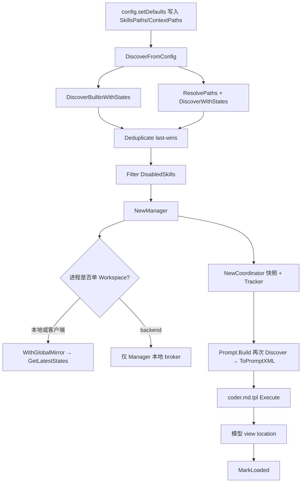
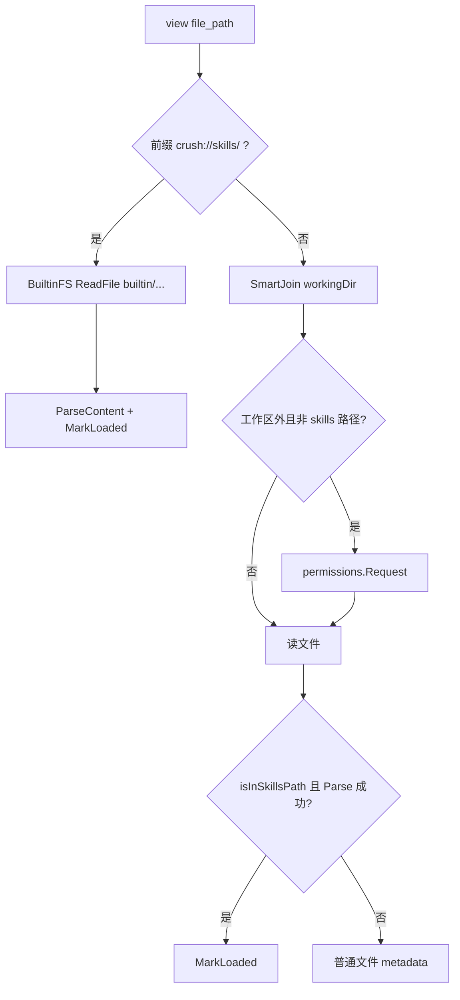
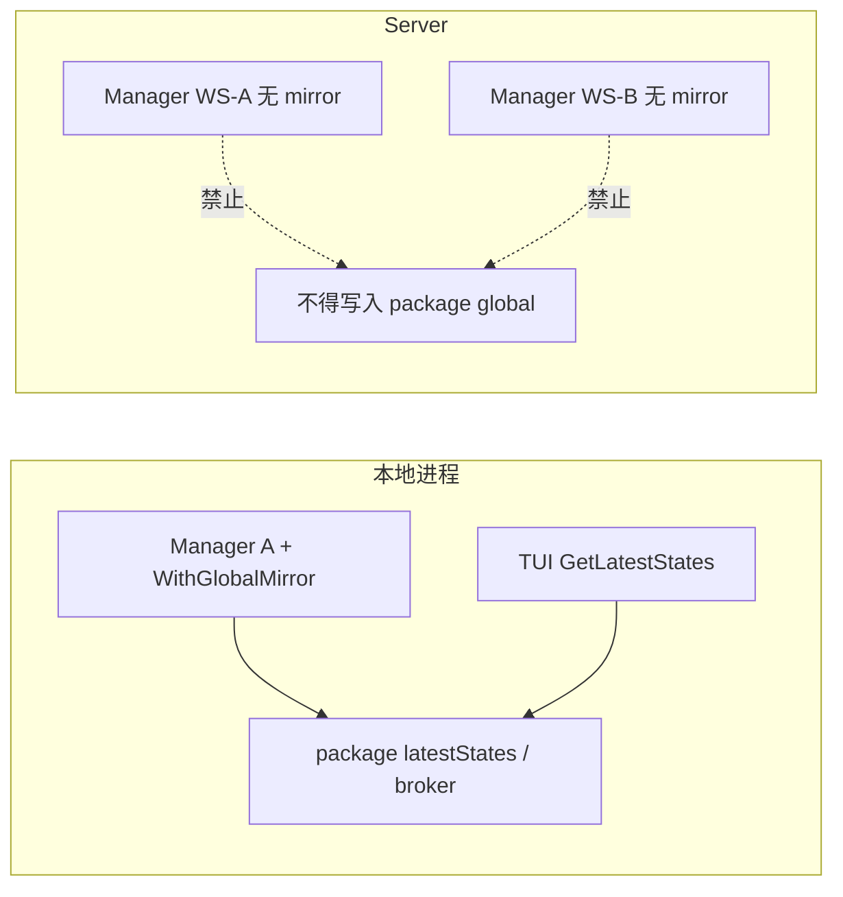

# 08. Skills、提示词与上下文

> 状态：待复核生成稿
> 生成日期：2026-08-16
> 基准提交：`16dce459cafecee92eae0ed7c47a0c641c8bbb9f`
> 工作区：clean
> 源码范围：`internal/agent/prompts.go`、`internal/agent/prompt/`、`internal/agent/templates/*.md.tpl`、`internal/agent/templates/title.md`、`internal/agent/templates/summary.md`、`internal/agent/templates/agent_tool.md`、`internal/agent/templates/agentic_fetch.md`、`internal/skills/`（含 `builtin/`）、`internal/commands/`、上下文文件约定、View 工具与 `skillTracker`、`WithGlobalMirror` / `GetLatestStates`
> 生成方式：源码、模板、发现测试与配置静态分析
> 所属层：第四层
> 交叉引用：配置默认路径见 `05-配置体系与Provider认证.md` §3.5；Coordinator 生命周期见第三层主链路文档

## 快速摘要

### 架构总览（模块与依赖）

Crush 给模型的系统提示由 Go `text/template` 生成。模板注入平台/日期/工作目录/Git 快照、**项目与全局上下文文件的全文**，以及 Skill 的**元数据目录 XML**（名称、描述、location），不注入 Skill 正文。模型按 coder 规则在任务匹配时用 `view` 读取 `SKILL.md`；`skills.Tracker` 按**活跃名称**记录本次会话实际加载过哪些 Skill。

依赖方向：

- `config.setDefaults` 写入 `ContextPaths` / `GlobalContextPaths` / `SkillsPaths` / `DisabledSkills`
- 进程入口（`cmd/root.go` 本地模式、`backend.CreateWorkspace`、`ClientWorkspace`）→ `skills.DiscoverFromConfig` → `skills.NewManager`
- `agent.NewCoordinator` 从 Manager 取 all/active 快照，构造 `skillTracker`，把 `coder.md.tpl` 交给 SessionAgent
- `prompt.Prompt.Build` **再次**发现 Skill 以生成 `AvailSkillXML`（不读 Manager 缓存）
- `tools.NewViewTool(..., skillTracker, workingDir, skillsPaths...)` 在读到 Skill 文件时 `MarkLoaded`
- TUI 读 `skills.GetLatestStates()` 与 Manager 事件；多 Workspace 服务端禁止 `WithGlobalMirror`

### 核心调用序列（逐步逻辑）

1. `setDefaults` 合并默认上下文文件名与 skills 目录（见配置篇）。
2. `DiscoverFromConfig`：embed builtin → 展开用户路径 → `DiscoverWithStates` → `Deduplicate`（同名后者赢）→ `Filter(DisabledSkills)`。
3. `NewManager`；本地/客户端加 `WithGlobalMirror()`，backend 不加。
4. `NewCoordinator`：`allSkills`/`activeSkills`/`NewTracker(active)`；`coderPrompt(WithWorkingDir)`。
5. 每回合 `SessionAgent` 调 `Prompt.Build` → `promptData` 读上下文文件、跑 git、再发现 Skill、`ToPromptXML` → 执行 `coder.md.tpl`。
6. 模型若 `view(crush://skills/.../SKILL.md)` 或磁盘 SKILL.md：`readBuiltinFile` / 普通读路径 → `MarkLoaded`。
7. 回合结束 `logTurnSkillUsage`；`crush_info` 展示 loaded/unloaded/disabled。
8. 用户从命令面板调用 user-invocable Skill：`FromSkillCatalog` → `FormatInvocation` 作为用户消息，或 `attachSkill` 把全文当附件。

### 易错点与边界条件

- **目录 vs 正文**：系统提示只有 XML 元数据。漏写 coder 规则第 14 条，模型会凭 description 瞎做。
- **两套发现**：Manager 是工具/TUI/诊断的快照；`promptData` 每次 Build 重新 Discover。配置热重载后提示可能已变、Coordinator 的 Tracker/active 仍是启动快照，直到重建 Coordinator。标 **推断**：当前生产路径很少在不重建 agent 的情况下改 skills。
- **覆盖不是合并**：用户同名 Skill 完全替换 builtin；Tracker 只认 active 名，读已被覆盖的 builtin 路径不会记成“有效 Skill 已加载”。
- **`user-invocable` 默认 false**（YAML bool 零值）。`FromSkillCatalog` 构造的 `Skill` **不含 Instructions**，`FormatInvocation` 会发出空 `<instructions>`，模型仍须按 location 再 view。完整正文走 `ReadSkill`/`attachSkill`。
- **`disable-model-invocation`**：从 `ToPromptXML` 剔除，模型看不到；若同时 user-invocable，用户仍可当命令调用。
- **工作区隔离**：backend 多 Workspace 禁止 mirror，否则 `GetLatestStates` last-writer-wins。TUI 与本地模式必须 mirror，否则启动时 sidebar 为空。
- **上下文文件无大小上限**：`processFile` 整文件读入系统提示。把巨型目录放进 `context_paths` 会撑爆窗口。Skill 正文按需加载，SKILL.md 的 view limit 实际是 1_000_000 行。
- **Git 判断只用 `workingDir/.git`**：worktree 的 `.git` 是文件而非目录时 `os.Stat` 仍成功，所以 linked worktree 一般可用；bare 仓库或 gitfile 之外的布局会当成非仓库。
- **builtin 路径不是 URL**：`crush://skills/<name>/SKILL.md` 是 View 识别的虚拟协议，禁止走 MCP `read_mcp_resource`。

## 目录

1. [为什么这样设计（Why）](#1-为什么这样设计why)
2. [它是什么（What）](#2-它是什么what)
3. [系统提示构造](#3-系统提示构造)
4. [模板清单与注入点](#4-模板清单与注入点)
5. [上下文文件](#5-上下文文件)
6. [SKILL.md 模型、解析与校验](#6-skillmd-模型解析与校验)
7. [Builtin 与 crush://](#7-builtin-与-crush)
8. [用户 Skill 发现、覆盖、禁用](#8-用户-skill-发现覆盖禁用)
9. [Manager、镜像与 TUI](#9-manager镜像与-tui)
10. [View / crush_info / Tracker](#10-view--crush_info--tracker)
11. [Commands 与用户调用](#11-commands-与用户调用)
12. [Coordinator 接线](#12-coordinator-接线)
13. [调用关系表](#13-调用关系表)
14. [流程图](#14-流程图)
15. [测试覆盖](#15-测试覆盖)
16. [阅读源码建议顺序](#16-阅读源码建议顺序)
17. [重新实现检查清单](#17-重新实现检查清单)
18. [源码索引](#18-源码索引)

---

## 1. 为什么这样设计（Why）

1. **Token 预算**：一个项目可能有多个 Skill，每个 SKILL.md 可达数千 token。全部塞进系统提示会挤压对话。Agent Skills 规范的做法是：系统提示只放目录，相关时再读正文（progressive disclosure）。
2. **项目记忆 vs 个人偏好**：`AGENTS.md` / `CRUSH.md` 等是**启动即注入全文**的硬规则；Skill 是**按任务触发**的操作手册。二者不要混成一种加载策略。
3. **多 Workspace**：一个 Crush server 可同时开多个项目。Skill 状态若用 package global，TUI 会显示别人的发现结果。所以 Manager 是 per-workspace；只有“一进程一工作区”才镜像到 global。
4. **覆盖与禁用可诊断**：用户覆盖 builtin 后，UI 仍要能解释“发现了但禁用/被覆盖”。因此同时保留 all（去重后含 disabled）与 active（过滤后）。

---

## 2. 它是什么（What）

三块协作：

| 块 | 包 | 给模型什么 |
|---|---|---|
| 系统模板 | `internal/agent/templates/*.md.tpl` + `prompt` | 行为规范 + env + 上下文全文 + Skill 目录 XML |
| Skill 运行时 | `internal/skills` | 解析、发现、去重、Manager、Tracker、Catalog |
| 斜杠命令 | `internal/commands` | markdown 自定义命令 + user-invocable Skill + MCP Prompt |

`PromptDat`（`prompt/prompt.go`）是模板数据：

- `Provider` / `Model` / `Config`（完整配置值拷贝）
- `WorkingDir`（slash 路径）、`IsGitRepo`、`Platform`、`Date`、`GitStatus`
- `ContextFiles` / `GlobalContextFiles`
- `AvailSkillXML`

`Skill`：frontmatter 字段 + `Instructions` 正文 + `Path`（目录）+ `SkillFilePath` + `Builtin`。

三个集合：

- **discovered**：builtin + 各路径 walk 的原始列表（可含同名）
- **allSkills**：按 name last-wins 去重，仍含随后会被禁用的项
- **activeSkills**：再按 `DisabledSkills` 精确名称过滤 → 提示、View 追踪、Catalog 只用这个

---

## 3. 系统提示构造

### 3.1 入口

`internal/agent/prompts.go` 用 `go:embed` 嵌入模板字节：

- `coderPrompt` → `templates/coder.md.tpl`（主 coding agent）
- `taskPrompt` → `templates/task.md.tpl`（只读子 agent）
- `InitializePrompt` → `templates/initialize.md.tpl`，立刻 `Build` 成字符串，用于生成项目上下文文件

`prompt.NewPrompt(name, tmpl, opts...)` 只保存字符串与 Option（`WithTimeFunc` / `WithPlatform` / `WithWorkingDir`），解析发生在 `Build`。

### 3.2 `Prompt.Build`

1. `template.New(name).Parse`
2. `promptData(ctx, provider, model, store)`
3. `t.Execute` 到 `strings.Builder`

WorkingDir：Option 优先，否则 `store.WorkingDir()`。Platform：Option 优先，否则 `runtime.GOOS`。Date：`now().Format("1/2/2006")`（测试可注入时钟）。

### 3.3 Git 快照

`isGitRepo`：`os.Stat(workingDir/.git)` 成功即真。

若是仓库，`getGitStatus` 用项目 Shell 跑三条命令，**单条失败当空而不是让 Build 失败**（`getGitBranch` 等 `err != nil` 返回 `"" , nil`）：

```text
git branch --show-current 2>/dev/null
git status --short 2>/dev/null | head -20
git log --oneline -n 3 2>/dev/null
```

拼成 `Current branch` / `Status`（无输出则 `Status: clean`）/ `Recent commits`。这是对话开始时的快照，模板注明可能过时。

### 3.4 Skill XML 在 promptData 中的再发现

```text
allSkills = DiscoverBuiltin()
记录 builtin 名
对 cfg.Options.SkillsPaths：expandPath（~ 与 $VAR）后 Discover()
用户名撞 builtin → slog.Warn("User skill overrides builtin skill")
仍 append，然后 Deduplicate（后者赢）再 Filter(DisabledSkills)
ToPromptXML → AvailSkillXML
```

注意：这里用 `Discover`（丢弃 states），不用 Manager。路径展开与 `DiscoveryConfig.ResolvePaths` 同类（`home.Long` + 以 `$` 开头才走 Resolver），但 prompt 侧对非 `$` 前缀的 env 语法不会展开。**重新实现不要假设两处 100% 同一函数**；当前是复制的相似逻辑。

`ToPromptXML`：跳过 `DisableModelInvocation`；字段 XML 转义 `& < > " '`；builtin 多一个 `<type>builtin</type>`。空列表返回 `""`，模板 `{{if .AvailSkillXML}}` 整段 skills_usage 不出现。

---

## 4. 模板清单与注入点

| 文件 | 用途 | 是否系统提示 |
|---|---|---|
| `templates/coder.md.tpl` | 主 agent：critical_rules、通信风格、编辑/测试/工具、env、LSP 提示、Skill 目录、project_context、user_preferences | 是 |
| `templates/task.md.tpl` | 子 agent：极简规则 + env；**无** Skill XML、无上下文文件块 | 是 |
| `templates/initialize.md.tpl` | 让 agent 写/更新 `Options.InitializeAs`（默认 `AGENTS.md`） | 是（一次性） |
| `templates/agentic_fetch_prompt.md.tpl` | 网页研究子 agent | 是 |
| `templates/title.md` | 小模型生成会话标题（≤50 字、无引号冒号） | 是（title 调用） |
| `templates/summary.md` | 对话摘要，要求可接续的完整 briefing | 是（summarize） |
| `templates/agent_tool.md` | `agent` 工具的 **description**，不是系统提示 | 否 |
| `templates/agentic_fetch.md` | `agentic_fetch` 工具 description | 否 |

`title.md` / `summary.md` 由 `internal/agent/agent.go` 直接 `go:embed` 当 `fantasy.WithSystemPrompt` 字符串，不走 `prompt.Prompt`，因此**没有**上下文文件和 Skill XML。

### 4.1 coder.md.tpl 与 Skill 相关的硬规则

规则 14（critical_rules）：任务匹配 `<available_skills>` 时，必须先 `view` 其 `<location>`，禁止凭 description 推断。

`skills_usage` 段重复强调：description 只是 TRIGGER；builtin 的 `crush://` 不是网络 URL；不要用 MCP 工具加载 Skill；脚本/参考文件与 SKILL.md 同目录。

项目上下文：

```text
# Project-Specific Context
<project_context>
  <file path="...">全文</file>
</project_context>
```

全局：

```text
# User context
<user_preferences>
  <file path="...">全文</file>
</user_preferences>
```

`{{.Config.LSP}}` 非空时插入 LSP 诊断说明。`{{.GitStatus}}` 仅 git 仓库。

### 4.2 task.md.tpl

子 agent 被设计成“搜索与找实现细节”，工具集是只读的（`SetupAgents` 里 `resolveReadOnlyTools`）。模板刻意更短，且**不注入 Skill 目录**。**推断**：避免子 agent 再 view 一遍 Skill 浪费回合；Skill 应由顶层 coder 加载后把结论写进委托 prompt。若重新实现让 task 也执行 Skill 流程，必须同时改模板与工具集。

### 4.3 initialize.md.tpl

指示检查空目录、已有规则文件、构建命令、只记录观察到的非显而易见知识。文件名来自 `{{.Config.Options.InitializeAs}}`。`config.ProjectNeedsInitialization`（`init.go`）：数据目录已有 `init` flag、或 cwd 已有默认上下文文件名、或目录在 ignore 规则下无可见表项 → 不初始化。

---

## 5. 上下文文件

### 5.1 默认路径（配置写入，Prompt 消费）

`defaultContextPaths`（`config.go`）**前置**进 `Options.ContextPaths` 再 sort+compact（大小写不同的 `CRUSH.md`/`crush.md` 会并存直到 compact 按字节去重——`CRUSH.md` 与 `crush.md` 不是同一字符串，**都会保留**；加载时 `loadContextFiles` 用小写 pathKey 去重，所以同一文件两种大小写只读一次）：

```text
.github/copilot-instructions.md
.cursorrules
.cursor/rules/          # 目录：WalkDir 读所有非目录文件
CLAUDE.md
CLAUDE.local.md
GEMINI.md
gemini.md
crush.md / crush.local.md / Crush.md / Crush.local.md
CRUSH.md / CRUSH.local.md
AGENTS.md / agents.md / Agents.md
```

全局默认（仅当用户未设 `global_context_paths`）：

- `~/.config/crush/CRUSH.md`（`dirname(GlobalConfig())/CRUSH.md`）
- `~/.config/AGENTS.md`（配置目录的父目录）

crushrc：`option context-path` / `option global-context-path` 每次 append。

### 5.2 加载算法（`prompt.go`）

`loadContextFiles(paths, store)`：

1. `expandPath`：`home.Long` 展开 `~`；若以 `$` 开头则 `store.Resolver().ResolveValue`
2. 小写展开路径做 map key 去重（先出现的 wins，因为后到 `continue`）
3. `processContextPath`：`SmartJoin(workingDir, path)` → Stat
   - 文件：`ReadFile` 失败则跳过（返回 nil ContextFile）
   - 目录：`filepath.WalkDir`，非目录项 `processFile`；walk 回调里 `err != nil` 会 `return err` **结束该目录遍历**
4. 把 map 的 values append 到 `PromptDat` 切片（**map 迭代顺序非确定**，跨运行系统提示中多文件次序可能变化）。标实现细节。

没有单文件字节上限。重新实现若担心 prompt 爆炸，这是产品决策点，当前源码不截断。

项目 vs 全局在模板里是两个 XML 区块，语义不同：项目规则 vs 跨项目用户偏好。

---

## 6. SKILL.md 模型、解析与校验

格式：YAML frontmatter + Markdown body，符合 [Agent Skills](https://agentskills.io) 方向。

```markdown
---
name: my-skill
description: 何时使用（触发条件）
user-invocable: true
disable-model-invocation: false
license: MIT
compatibility: "needs jq"
metadata:
  foo: bar
---

# 正文 Instructions
```

`Parse` 读磁盘；`ParseContent` 解析字节。`splitFrontmatter`：

- 去掉 UTF-8 BOM
- CRLF/CR → `\n`
- 允许开头空行，第一个非空行必须是 `---`
- 下一处单独一行 `---` 结束；找不到则 `unclosed frontmatter`
- body = 结束线之后

`Validate`（`errors.Join` 可多错）：

- `name` 必填，≤64，正则 `^[a-zA-Z0-9]+(-[a-zA-Z0-9]+)*$`（不能首尾/连续连字符）
- 若 `Path` 非空：`filepath.Base(Path)` 必须与 name **大小写无关**相等（目录名=skill 名）
- `description` 必填，≤1024
- `compatibility` ≤500

解析/校验失败**不停止**整个发现：生成 `SkillState{StateError, Err}`，slog.Warn。UI 可展示无效 Skill。

`UserInvocable` / `DisableModelInvocation` 未写则为 false。

---

## 7. Builtin 与 crush://

`internal/skills/embed.go`：`//go:embed builtin/*`。当前三个目录：

| name | 触发（description 大意） |
|---|---|
| `crush-config` | 写 crushrc/crush.json、Provider、模型、LSP、MCP、hooks、skills、权限 |
| `crush-hooks` | 编写/排查 Hook |
| `jq` | 用内置 jq（gojq）处理 JSON |

增加 builtin：在 `internal/skills/builtin/<name>/SKILL.md` 落盘，embed glob 自动收录；补 `TestDiscoverBuiltin` 断言。

`DiscoverBuiltinWithStates` walk embed FS：

- `SkillFilePath = crush://skills/<rel>`（rel 为 `builtin/` 之后，slash）
- `Path = crush://skills/<dir>`
- `Builtin = true`
- 校验失败仍记 StateError，不进入 discovered 列表

`BuiltinPrefix = "crush://skills/"`。`Catalog.ReadContent` 与 View 都把该前缀映射到 `BuiltinFS().ReadFile("builtin/"+trimPrefix)`。

这不是网络协议。coder 模板明确禁止当 URL/MCP 资源。

---

## 8. 用户 Skill 发现、覆盖、禁用

生产入口 `DiscoverFromConfig(DiscoveryConfig)`（`manager.go`）：

1. `DiscoverBuiltinWithStates`
2. `cfg.ResolvePaths()`：`home.Long`；`$` 前缀且 Resolver 非 nil 则展开
3. `DiscoverWithStates(userPaths)`：`fastwalk`，`Follow: true`（跟随符号链接目录——`filepath.WalkDir` 做不到这一点，测试 `TestFromSkillCatalog_UsesDiscoveredSymlinkedSkills` 锁定）
4. 同一绝对 path 去重（并发 walk 的 `seen` map + mutex）
5. 结果按 path 再 name 稳定排序
6. `discovered = builtin + user`（用户在后）
7. `allSkills = Deduplicate`（按 name 保留最后下标）
8. `activeSkills = Filter(all, DisabledSkills)` 精确字符串匹配，不是 glob
9. states：builtinStates+userStates → `DeduplicateStates`（无名 error state 都保留）→ 按 path 小写排序

`DisabledSkills` 来自 `options.disabled_skills` / crushrc `option disable-skill`。

覆盖语义：用户同名 Skill **整份替换** builtin，不 merge frontmatter。Tracker 的 `activeNames` 来自 active 列表，因此若用户覆盖了 `jq`，只有用户那份能 `MarkLoaded`；模型若仍 view `crush://skills/jq/SKILL.md`（目录 XML 里 location 已是用户路径），读 builtin 虚拟路径不会误标。

---

## 9. Manager、镜像与 TUI

### 9.1 Manager

每 Workspace 一个。字段：all/active/states、resolvedPaths、workingDir、独立 `pubsub.Broker[Event]`、`globalMirror bool`。

`NewManager(all, active, states, opts...)`：若 `WithGlobalMirror`，构造时立刻 `SetLatestStates(states)`。

`PublishStates` 是状态变更的单一入口：更新自身 cache → 可选 `SetLatestStates` → 本地 broker.Publish → 可选 package `PublishStates`。禁止先 `SetLatestStates` 再 Publish，以免 TUI 同步读与订阅看到不一致。返回的 states 都是深拷贝。

`Shutdown` 关 broker。

### 9.2 谁开镜像

| 进程 | 代码 | WithGlobalMirror | 原因 |
|---|---|---|---|
| 本地 TUI / `crush` 单工作区 | `internal/cmd/root.go` `setupLocalWorkspace` | 是 | TUI `UI` 构造读 `GetLatestStates()` |
| Crush server `CreateWorkspace` | `internal/backend/backend.go` | **否** | 多 Workspace 并发，mirror 会串台（`TestManager_ConcurrentWorkspacesAreIsolated`） |
| 远程客户端 | `workspace/client_workspace.go` `NewClientWorkspace` | 是 | 客户端一进程一 ws；用 proto 快照的 states 播种，all/active 传 nil |
| Coordinator 遗留 fallback `discoverSkills` | `coordinator.go` | 不创建 Manager | 不发布全局事件 |

`app.New` 把 Manager 存 `app.Skills`，并 `setupSubscriber(..., app.Skills.SubscribeEvents, app.events)`。TUI `Update` 收 `pubsub.Event[skills.Event]` 更新 `m.skillStates`。

客户端 `ListSkills`/`ReadSkill` 走 RPC，不依赖本地 allSkills（所以 NewClientWorkspace 传 nil 切片可接受）。诊断 UI 只需要 states。

### 9.3 TUI 读取

`internal/ui/model/ui.go`：初始 `skillStates: skills.GetLatestStates()`。Sidebar `skills.go`：`skillStatusItems` 合并 states 与 `cachedBuiltinSkills()`（进程内 Once 再 DiscoverBuiltin，仅用于展示图标/标题）。**不要**在 server 进程用这套 global 辅助函数当权威源。

---

## 10. View / crush_info / Tracker

### 10.1 Tracker（`tracker.go`）

会话级、并发安全。`NewTracker(activeSkills)` 记下 active 名集合。`MarkLoaded(name)` 仅当 name 在集合中。`LoadedNames` 排序返回。nil Tracker 的方法都是安全空操作（agentic_fetch 的 View 传 `nil` tracker）。

### 10.2 View（`internal/agent/tools/view.go`）

Coordinator 注入：

```text
NewViewTool(lsp, perms, filetracker, c.skillTracker, workingDir, Options.SkillsPaths...)
```

分支：

1. `strings.HasPrefix(path, skills.BuiltinPrefix)` → `readBuiltinFile`：embed 读取、1e6 行默认 limit、ParseContent 成功则 metadata `ViewResourceSkill` + `MarkLoaded`
2. 否则 SmartJoin 成绝对路径。工作区外 **且不是** `isInSkillsPath` → 权限请求。Skill 目录内的文件（含全局 `~/.config/crush/skills`）免许可，这是“技能文件可读”契约。
3. 普通读：SKILL.md（`isSkillFile`）同样 1e6 行 limit；读完 `Parse(filePath)` 成功则 MarkLoaded

`isInSkillsPath`：对每个 skillsPath 与目标做 `EvalSymlinks` 再 `Rel`，逃出 `..` 则不算。Coordinator 传入的是 **未再展开** 的 `Options.SkillsPaths`（已含默认绝对/相对路径）。若用户写了 `$HOME/skills` 这种未在 setDefaults 展开的路径，Walk 发现用 Resolver，View 免许可检查可能对不上——标 **推断/缺口**。

agentic_fetch 子 agent 的 View 使用临时目录且 `skillTracker=nil`，读 Skill 不会记入主会话 Tracker。

### 10.3 crush_info

`writeSkills`：active 显示 `loaded`/`unloaded`；disabled 列表显示 `disabled`；origin `builtin`/`user`。`loaded_this_session = loadedCount/activeCount`。

### 10.4 每回合日志

`coordinator.run` 在 `Run` 前后对 `LoadedNames` 做差，`logTurnSkillUsage` Info 一行：`loaded_this_turn`、prompt 长度、active 总数。`logDiscoveryStats` 在 fallback discover 时打 builtin/user 成功失败计数和 XML token 估数（`ApproxTokenCount` ≈ 4 字符/token）。

---

## 11. Commands 与用户调用

`internal/commands/commands.go` 三条来源：

1. **Markdown 自定义命令** `LoadCustomCommands`：扫描
   - `home.Config()/crush/commands` → id 前缀 `user:`
   - `home.Dir()/.crush/commands` → `user:`
   - `cfg.Options.DataDirectory/commands` → `project:`
   - 递归 `.md`，相对路径用 `:` 连接，如 `user:foo:bar`。正文里 `$FOO`（大写）变成必填参数。
2. **Skill 命令** `FromSkillCatalog`：仅 `UserInvocable`；`ID/Name` 用 Catalog `Label`（`system:jq` / `user:name` / `project:name`）。`Skill` 指针只有 Name/Description/SkillFilePath。
3. **MCP Prompt** `LoadMCPPrompts`：`mcpName:promptName`，参数来自 MCP schema。

TUI `loadCustomCommands`：先 LoadCustomCommands，再 `Workspace.ListSkills` → FromSkillCatalog。

执行：

- `ActionRunCustomCommand`：若 `msg.Skill != nil`，用户消息 = `FormatInvocation()`（XML，**Instructions 可能为空**），模型应再 view location
- `ActionAttachSkill`：`Workspace.ReadSkill` 把 SKILL.md 原始字节当 `text/markdown` 附件，用户再写问题一起发送

`FormatInvocation` 转义 name/description/location/instructions，包在 `<loaded_skill>`。这是用户显式“加载这份手册”的协议，与系统提示里的 `<available_skills>` 不同。

`GetMCPPrompt`：30s timeout 调 MCP `GetPromptMessages`，拼成一段文本。

---

## 12. Coordinator 接线

`NewCoordinator`：

- `opts.Skills != nil` → `AllSkills()` / `ActiveSkills()`
- 否则 `discoverSkills`（不 Publish）
- `skillTracker = NewTracker(active)`
- `coderPrompt(WithWorkingDir)` → `buildAgent`

`buildTools` 把 tracker 与 all/active 传给 View 与 crush_info。

task 子 agent（`agent_tool.go`）用 `taskPrompt`，**不**共享另一份 Skill XML。主会话 Tracker 仍是 coder 那份。

热重载配置**不会**自动 `DiscoverFromConfig` 再灌进已有 Coordinator——Skills 是 workspace 创建时的快照。改 skills 目录后通常需重开 workspace。标当前行为，不是 bug 断言。

---

## 13. 调用关系表

| 调用方文件与符号 | 关系 | 被调用方文件与符号 | 触发与输入 | 返回与后续处理 | 错误、状态与副作用 |
|---|---|---|---|---|---|
| `cmd/root.go:setupLocalWorkspace` | 调用 | `skills.DiscoverFromConfig` + `NewManager(..., WithGlobalMirror)` | 本地启动，路径来自 ConfigStore | Manager 注入 `app.New` | 写入 package `latestStates` |
| `backend.go:CreateWorkspace` | 调用 | 同上但**无** GlobalMirror | 每开一个项目 | Manager 挂在 Workspace | 不碰 globals |
| `client_workspace.go:NewClientWorkspace` | 构造 | `NewManager(nil, nil, protoStates, WithGlobalMirror)` | 客户端连接 | TUI 能 `GetLatestStates` | all/active 空，读内容走 RPC |
| `agent/coordinator.go:NewCoordinator` | 读取 | `Manager.AllSkills/ActiveSkills` | agent 启动 | 会话内快照 + Tracker | 之后发现变化不自动刷新 |
| `prompt.go:promptData` | 调用 | `DiscoverBuiltin` + `Discover` + `Deduplicate` + `Filter` + `ToPromptXML` | 每次 Build 系统提示 | `AvailSkillXML` | 覆盖时 Warn；与 Manager 可能短暂不一致 |
| `prompt.go:loadContextFiles` | 读盘 | `os.ReadFile` / `WalkDir` | ContextPaths / GlobalContextPaths | 全文进模板 | 不可读则跳过 |
| `coordinator.buildTools` | 注入 | `tools.NewViewTool(..., skillTracker, SkillsPaths)` | 构建工具表 | View 闭包持 tracker | — |
| `view.go` View handler | 调用 | `Tracker.MarkLoaded` | 成功读 builtin 或 skills 路径内文件且 Parse 成功 | metadata ResourceType=skill | 覆盖的 builtin 名不在 active 则 Mark 被忽略 |
| `commands.FromSkillCatalog` | 转换 | CatalogEntry → CustomCommand | TUI 加载命令面板 | Skill 无 Instructions | — |
| `ui.go` ActionRunCustomCommand | 调用 | `Skill.FormatInvocation` | 用户选 skill 命令 | 作为用户消息发送 | 空 instructions 时模型需再 view |
| `ui.go:attachSkill` | 调用 | `Workspace.ReadSkill` → `skills.ReadContent` | 用户附加 skill | markdown 附件 | 非 active ID → ErrSkillNotFound |
| `app.go` subscriber | 订阅 | `Manager.SubscribeEvents` | workspace 生命周期 | 转发到 UI events | Shutdown 时停 |
| `ui.go` 构造 | 读取 | `skills.GetLatestStates` | TUI 启动 | sidebar 初始 states | 无 mirror 则为 nil |

谁创建 Manager：root / backend / client_workspace。谁调用 DiscoverFromConfig：上述创建点 + coordinator fallback + 测试。动态分派：没有 Skill 接口插件；builtin vs 磁盘由 `Builtin` 标志与路径前缀决定。

---

## 14. 流程图

### 14.1 发现与注入



### 14.2 View 读 Skill



### 14.3 工作区隔离 vs 镜像



---

## 15. 测试覆盖

| 测试 | 锁定行为 |
|---|---|
| `skills/manager_test.go` `TestDiscoverFromConfig*` | builtin+用户、禁用过滤、Resolver 展开 `$VAR`、Instructions 非空 |
| `TestManager_ConcurrentWorkspacesAreIsolated` | 无 mirror 时互不可见 |
| `TestGetLatestStates` / `_Isolation` | 全局缓存与深拷贝 |
| `skills_test.go` | 解析、校验、去重 last-wins、Filter、ToPromptXML 转义与 disable-model-invocation |
| `tracker_test.go` | 只标记 active 名 |
| `diagnostics_test.go` | GetLatestStates |
| `commands_test.go` `FromSkillCatalog` | 仅 user-invocable；符号链接发现 |
| `workspace/client_workspace_test.go` | 客户端 mirror 使 GetLatestStates 随 delta 更新 |
| `backend` skills 测试 | 两 workspace 的 SubscribeEvents 隔离 |
| `view_test.go` | 普通读文件；多数用例 tracker=nil |

缺口：`promptData` 与 Manager 双发现一致性无集成测试；`FormatInvocation` 空 Instructions 的命令路径无断言；上下文目录 Walk 错误中止无专门测试；未运行本篇测试，不能声称通过。

---

## 16. 阅读源码建议顺序

1. `internal/agent/templates/coder.md.tpl` 的 `<available_skills>` / `<skills_usage>` / context 块——先建立产品语义
2. `internal/agent/prompt/prompt.go` `Build` → `promptData` → `loadContextFiles`
3. `internal/agent/prompts.go` 三个 Prompt 工厂
4. `internal/skills/skills.go`：Parse/Validate/Discover/ToPromptXML/Deduplicate/Filter
5. `embed.go` + 任意一个 `builtin/*/SKILL.md`
6. `manager.go` DiscoverFromConfig 与 WithGlobalMirror
7. `tracker.go` + `catalog.go` ReadContent
8. `coordinator.go` NewCoordinator / discoverSkills / logTurnSkillUsage
9. `tools/view.go` builtin 与 isInSkillsPath
10. `commands.go` + `ui.go` 命令/附件两条用户路径
11. `cmd/root.go` 与 `backend.go` 对照 mirror 开关
12. `task.md.tpl` 确认子 agent 不带 Skill 目录

---

## 17. 重新实现检查清单

- [ ] 系统提示只含 Skill 元数据 XML，不含正文；coder 规则强制先 view location
- [ ] 上下文文件启动注入全文；项目与全局分两个模板区块
- [ ] 默认 ContextPaths 列表与 `config.go` `defaultContextPaths` 一致，含 AGENTS/CRUSH/CLAUDE/GEMINI 及 `.local`
- [ ] SKILL.md：BOM/CRLF、成对 `---`、name 正则与目录名一致、description 必填
- [ ] Builtin embed + `crush://skills/` 虚拟路径；View 与 Catalog.ReadContent 同一映射
- [ ] 发现顺序 builtin → 用户路径；同名 last-wins；DisabledSkills 精确过滤
- [ ] fastwalk Follow 符号链接；结果排序稳定
- [ ] Manager per-workspace；仅单工作区进程 WithGlobalMirror
- [ ] TUI 启动读 GetLatestStates，更新走 Manager 事件
- [ ] Tracker 按 active 名；覆盖后读旧 builtin 不计数
- [ ] 工作区外读文件要权限，skills 路径例外
- [ ] user-invocable → 命令面板；disable-model-invocation → 不进 XML
- [ ] 自定义 markdown 命令扫描路径与 `user:`/`project:` 前缀
- [ ] task 子 agent 模板不含 Skill 目录（若故意改变需同步工具权限）
- [ ] 不把巨型目录无上限地加入 context_paths（当前实现也无上限，产品上应避免）
- [ ] 测试：去重、禁用、mirror 隔离、符号链接、XML 转义

必须保持的契约：progressive disclosure、镜像边界、覆盖 last-wins、crush:// 不是网络。可替换：模板文案、fastwalk 库、token 估算启发式。

---

## 18. 源码索引

| 路径 | 角色 |
|---|---|
| `internal/agent/prompts.go` | coder/task/initialize 工厂 |
| `internal/agent/prompt/prompt.go` | 模板数据、上下文加载、Skill XML、Git |
| `internal/agent/templates/coder.md.tpl` | 主系统提示 |
| `internal/agent/templates/task.md.tpl` | 子 agent 提示 |
| `internal/agent/templates/initialize.md.tpl` | 生成 AGENTS.md 等 |
| `internal/agent/templates/agentic_fetch_prompt.md.tpl` | 网页研究子 agent |
| `internal/agent/templates/title.md` `summary.md` | 标题/摘要，不经 PromptDat |
| `internal/agent/templates/agent_tool.md` `agentic_fetch.md` | 工具描述 |
| `internal/agent/coordinator.go` | Skills 快照、Tracker、discoverSkills fallback、日志 |
| `internal/agent/tools/view.go` | crush:// 与 MarkLoaded |
| `internal/agent/tools/crush_info.go` | 诊断里的 skills 段 |
| `internal/skills/skills.go` | 解析发现 XML 去重过滤 全局 cache |
| `internal/skills/manager.go` | Manager 与 DiscoverFromConfig |
| `internal/skills/tracker.go` | 加载追踪 |
| `internal/skills/catalog.go` | UI Catalog 与 ReadContent |
| `internal/skills/embed.go` | builtin FS |
| `internal/skills/builtin/*/SKILL.md` | 内置手册 |
| `internal/commands/commands.go` | 斜杠命令与 FromSkillCatalog |
| `internal/cmd/root.go` | 本地 Discover + mirror |
| `internal/backend/backend.go` | 每 Workspace Discover，无 mirror |
| `internal/workspace/client_workspace.go` | 客户端 mirror 播种 |
| `internal/workspace/app_workspace.go` | ListSkills / ReadSkill |
| `internal/ui/model/ui.go` `skills.go` | GetLatestStates 与 sidebar |
| `internal/config/config.go` `load.go` | 默认 context/skills 路径 |
| `internal/config/init.go` | 是否需要跑 initialize |

与旧文档 `06-skills-prompts-context.md` 的主要差异（以当前源码为准）：明确 prompt 层二次发现与 Manager 快照并存；`FromSkillCatalog` 不含 Instructions；task 模板不注入 Skill；backend/client/local 三种 mirror 策略写清；View 对 skills 路径免权限。
