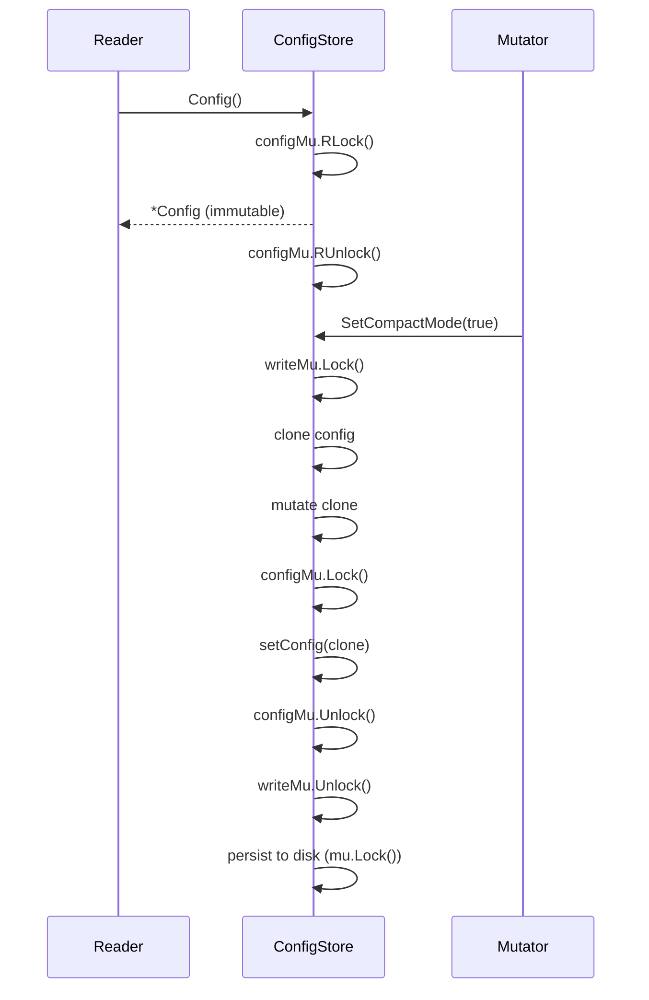

[上一篇：07-LLM提供商集成](07-LLM提供商集成.md) · [总目录](README.md) · [下一篇：09-数据库与持久化](09-数据库与持久化.md)

# 配置系统

> **场景**：理解 Crush 的配置加载、合并、热重载和运行时管理机制，包括 crush.json 格式、crushrc shell 风格配置、ConfigStore 架构和变量解析。
> **时间**：2026-08-27 (CST)
> **版本**：Crush @ main branch, Go 1.26.6

## 本文件内容

1. [配置架构概览](#1-配置架构概览)
2. [Config 结构体](#2-config-结构体)
3. [配置文件层级与合并](#3-配置文件层级与合并)
4. [ConfigStore 架构](#4-configstore-架构)
5. [ProviderConfig 详解](#5-providerconfig-详解)
6. [MCP 配置](#6-mcp-配置)
7. [LSP 配置](#7-lsp-配置)
8. [Options 详解](#8-options-详解)
9. [Agent 配置](#9-agent-配置)
10. [变量解析系统](#10-变量解析系统)
11. [运行时覆盖](#11-运行时覆盖)
12. [配置热重载](#12-配置热重载)
13. [OAuth 令牌管理](#13-oauth-令牌管理)
14. [默认上下文路径](#14-默认上下文路径)

## 1. 配置架构概览

```
┌─────────────────────────────────────────────────────────┐
│ 配置源（优先级从低到高）                                  │
│                                                         │
│  1. 内置默认 providers (catwalk + Hyper embedded)       │
│  2. Global config: ~/.config/crush/crush.json           │
│  3. crushrc shell-style config (crushrc / .crushrc)     │
│  4. Workspace config: .crush/crush.json                 │
│  5. Runtime overrides (CLI flags, in-session changes)   │
└─────────────────────────────────────────────────────────┘
         │
         ▼
┌─────────────────────────────────────────────────────────┐
│ ConfigStore                                             │
│  - config: *Config (immutable, copy-on-write)           │
│  - workingDir, resolver, overrides                      │
│  - configMu / writeMu / mu (锁分层)                     │
│  - 热重载文件快照监控                                     │
└─────────────────────────────────────────────────────────┘
         │
         ▼
┌─────────────────────────────────────────────────────────┐
│ Consumer: App, Coordinator, tools, LSP, MCP             │
│  通过 ConfigStore.Config() 获取只读 *Config              │
└─────────────────────────────────────────────────────────┘
```

## 2. Config 结构体

```
internal/config/config.go
Struct：Config
```

```go
type Config struct {
    Providers   csync.Map[string, ProviderConfig]
    Models      map[SelectedModelType]SelectedModel
    Agents      map[string]Agent
    Options     *Options
    LSP         map[string]LSPConfig
    MCP         map[string]MCPConfig
    Permissions *PermissionsConfig
    Hooks       map[HookEvent][]HookConfig
    Tools       ToolsConfig
}
```

| 字段 | 类型 | 说明 |
|------|------|------|
| `Providers` | `csync.Map[string, ProviderConfig]` | LLM 提供商配置，键为 provider ID |
| `Models` | `map[SelectedModelType]SelectedModel` | 选定的 large/small 模型 |
| `Agents` | `map[string]Agent` | Agent 配置（coder, task） |
| `Options` | `*Options` | 全局选项 |
| `LSP` | `map[string]LSPConfig` | LSP 服务器配置 |
| `MCP` | `map[string]MCPConfig` | MCP 服务器配置 |
| `Permissions` | `*PermissionsConfig` | 权限配置 |
| `Hooks` | `map[HookEvent][]HookConfig` | Hook 配置 |
| `Tools` | `ToolsConfig` | 工具配置（glob, grep, ls 参数） |

### 常量

```
Const：appName = "crush"
Const：defaultDataDirectory = ".crush"
Const：defaultInitializeAs = "AGENTS.md"
Const：AgentCoder = "coder"
Const：AgentTask = "task"
Const：SelectedModelTypeLarge = "large"
Const：SelectedModelTypeSmall = "small"
```

## 3. 配置文件层级与合并

### 加载流程

```
internal/config/load.go
函数：Load
偏移：+0 ～ +40
```

执行步骤：

1. `migrateDisableNotifications()` — 迁移已弃用的配置字段
2. `lookupConfigs(workingDir)` — 查找配置文件路径列表
3. `loadFromConfigPaths(ctx, configPaths)` — 从配置文件路径列表加载并合并
4. `cfg.setDefaults(workingDir, dataDir)` — 设置默认值
5. 创建 `ConfigStore`
6. 加载 workspace 配置（`.crush/crush.json`）— 最高优先级的持久化配置，与已加载配置合并
7. 如果 debug 模式，设置 `cfg.Options.Debug = true`

### 配置文件查找

```
internal/config/load.go
函数：lookupConfigs
```

查找顺序（从低到高优先级）：

1. 全局配置：`~/.config/crush/crush.json`
2. 项目级配置：`crush.json`、`.crush.json`（工作目录）
3. crushrc shell 风格配置

### 合并机制

使用 `jsons.Merge` 库进行 JSON 深度合并——后加载的配置覆盖先加载的同名字段。数组和对象递归合并。

```
internal/config/load.go
函数：loadFromBytes
```

接受多组 `[][]byte` JSON 数据，依次合并。工作区配置最后加载，拥有最高优先级。

## 4. ConfigStore 架构

```
internal/config/store.go
Struct：ConfigStore
```

### 字段

| 字段 | 类型 | 说明 |
|------|------|------|
| `config` | `*Config` | 当前配置（immutable，copy-on-write） |
| `workingDir` | `string` | 工作目录 |
| `resolver` | `VariableResolver` | 变量解析器 |
| `globalDataPath` | `string` | 全局数据路径 `~/.local/share/crush/crush.json` |
| `workspacePath` | `string` | 工作区配置路径 `.crush/crush.json` |
| `loadedPaths` | `[]string` | 成功加载的配置文件路径 |
| `knownProviders` | `[]catwalk.Provider` | 已知 provider 列表 |
| `overrides` | `RuntimeOverrides` | 运行时覆盖 |
| `snapshots` | `map[string]fileSnapshot` | 配置文件快照（用于热重载检测） |

### 锁分层

```
configMu → sync.RWMutex    // 保护 config 指针字段
writeMu  → sync.RWMutex    // 序列化 in-memory config 生产（mutators + reload）
mu       → sync.Mutex      // 序列化配置文件写入
refreshSF → singleflight.Group // 合并同 provider 的并发 OAuth 刷新
```

### 访问方法

```
函数：Config() → *Config
```

通过 `configMu.RLock()` 读取 config 指针，返回的 `*Config` 被视为 immutable——所有修改通过 copy-on-write 进行。

### Copy-on-Write 模式

1. 修改方法获取 `writeMu.Lock()`
2. 克隆当前 Config
3. 修改克隆
4. 通过 `setConfig(clone)` 原子交换指针（在 `configMu.Lock()` 下）
5. 释放 `writeMu`

这确保读者永远不会看到部分修改的 Config。



## 5. ProviderConfig 详解

```
internal/config/config.go
Struct：ProviderConfig
```

| 字段 | 类型 | 说明 |
|------|------|------|
| `ID` | `string` | Provider 唯一标识 |
| `Name` | `string` | 显示名称 |
| `BaseURL` | `string` | API 端点 |
| `Type` | `catwalk.Type` | Provider 类型（openai/anthropic/google/...） |
| `APIKey` | `string` | API 密钥（支持变量解析） |
| `APIKeyTemplate` | `string` | 原始模板（用于 401 后重新解析） |
| `OAuthToken` | `*oauth.Token` | OAuth2 令牌 |
| `Disable` | `bool` | 是否禁用 |
| `SystemPromptPrefix` | `string` | 自定义 system prompt 前缀 |
| `ExtraHeaders` | `map[string]string` | 额外 HTTP headers（支持 shell 展开） |
| `ExtraBody` | `map[string]any` | 额外请求体字段（JSON passthrough，不展开） |
| `ProviderOptions` | `map[string]any` | Provider 特定选项 |
| `ExtraParams` | `map[string]string` | 额外参数（如 Azure apiVersion, Vertex project/location） |
| `AWSAuthRefresh` | `string` | AWS 凭证刷新命令（Bedrock） |
| `FlatRate` | `bool` | 固定费率模式（跳过成本计算） |
| `AutoDiscoverModels` | `*bool` | 自动发现模型（通过 /v1/models） |
| `Models` | `[]catwalk.Model` | 模型列表 |

### ToProvider 转换

```
函数：ToProvider() → catwalk.Provider
偏移：+0 ～ +27
```

将 `ProviderConfig` 转换为 `catwalk.Provider`，复制模型元数据（ID, Name, 定价, 上下文窗口, 推理能力等）。

### ExtraHeaders vs ExtraBody

关键区别：
- `ExtraHeaders`：值通过 shell 展开（`$VAR`, `$(cmd)`），空值 header 被省略
- `ExtraBody`：纯 JSON passthrough，不进行 shell 展开——允许数字、嵌套对象、布尔值原样传递

## 6. MCP 配置

```
internal/config/config.go
Struct：MCPConfig
```

| 字段 | 类型 | 说明 |
|------|------|------|
| `Command` | `string` | stdio MCP 的执行命令 |
| `Env` | `map[string]string` | 环境变量 |
| `Args` | `[]string` | 命令参数 |
| `Type` | `MCPType` | 连接类型：`stdio` / `sse` / `http` |
| `URL` | `string` | HTTP/SSE MCP 的 URL |
| `Disabled` | `bool` | 是否禁用 |
| `DisabledTools` | `[]string` | 禁用的工具列表 |
| `EnabledTools` | `[]string` | 允许的工具列表 |
| `Timeout` | `int` | 连接超时（秒，默认 10） |
| `Sessionless` | `*bool` | 标记无会话 MCP 服务器（nil 时自动检测） |
| `Headers` | `map[string]string` | HTTP headers（支持 shell 展开） |
| `OAuth` | `bool` | 启用 OAuth 2.1 授权流程 |
| `OAuthClientID` | `string` | 预注册的 OAuth client ID |
| `OAuthClientSecret` | `string` | OAuth client secret |
| `OAuthCallbackPort` | `int` | OAuth 回调端口 |
| `OAuthToken` | `*oauth.Token` | 持久化的 OAuth 令牌 |

### MCPType 常量

```
Const：MCPStdio = "stdio"
Const：MCPSSE   = "sse"
Const：MCPHttp  = "http"
```

### Sessionless 自动检测

```
internal/config/config.go
Var：knownSessionlessMCPs
```

`knownSessionlessMCPs` 是一个 `map[string]struct{}`，包含已知不维护 MCP 会话的服务器 URL（去除尾部斜杠后匹配）。当前条目：

- `"https://api.github.com/mcp"`
- `"https://api.githubcopilot.com/mcp"`

```
internal/config/config.go
函数：IsSessionless
偏移：+0 ～ +10
```

`IsSessionless(r VariableResolver) bool` 是无会话检测的决策函数：

1. 若 `m.Sessionless` 非 nil，显式值优先（`true` 或 `false`）
2. 若 `m.Sessionless` 为 nil，通过 `VariableResolver` 解析 URL（使 `$VAR` 展开后的端点也能被检测到），去除尾部斜杠后在 `knownSessionlessMCPs` 中查找
3. URL 解析出错时回退为 `false`（安全默认值）

**设计意图**：某些 streamable-HTTP MCP 服务器（如 GitHub MCP）不维护会话，go-sdk 在注册了 list-changed handler 时会打开 SEP-2575 subscriptions/listen 流，这些服务器对该 POST 返回 404，SDK 将其视为致命错误并断开连接。`IsSessionless` 让 Crush 自动跳过这些 handler，代价是失去该服务器的实时列表变更通知。

## 7. LSP 配置

```
internal/config/config.go
Struct：LSPConfig
```

| 字段 | 类型 | 说明 |
|------|------|------|
| `Disabled` | `bool` | 是否禁用 |
| `Command` | `string` | LSP 服务器执行命令 |
| `Args` | `[]string` | 命令参数 |
| `Env` | `map[string]string` | 环境变量 |
| `FileTypes` | `[]string` | 处理的文件类型（如 `go`, `rs`, `ts`） |
| `RootMarkers` | `[]string` | 项目根标记（如 `go.mod`, `package.json`） |
| `InitOptions` | `map[string]any` | 初始化选项 |
| `Options` | `map[string]any` | 服务器特定设置 |
| `Timeout` | `int` | 初始化超时（秒，默认 30） |

## 8. Options 详解

```
internal/config/config.go
Struct：Options
```

| 字段 | 类型 | 默认值 | 说明 |
|------|------|--------|------|
| `ContextPaths` | `[]string` | — | 上下文文件路径 |
| `GlobalContextPaths` | `[]string` | `~/.config/crush/CRUSH.md` 等 | 全局上下文路径 |
| `SkillsPaths` | `[]string` | — | Skills 目录路径 |
| `TUI` | `*TUIOptions` | — | TUI 选项 |
| `Debug` | `bool` | `false` | 调试日志 |
| `DebugLSP` | `bool` | `false` | LSP 调试日志 |
| `DisableAutoSummarize` | `bool` | `false` | 禁用自动摘要 |
| `DataDirectory` | `string` | `.crush` | 数据目录 |
| `DisabledTools` | `[]string` | — | 禁用的工具列表 |
| `DisableProviderAutoUpdate` | `bool` | `false` | 禁用 provider 自动更新 |
| `DisableDefaultProviders` | `bool` | `false` | 禁用默认 provider |
| `Attribution` | `*Attribution` | — | 归因设置 |
| `DisableMetrics` | `bool` | `false` | 禁用指标 |
| `InitializeAs` | `string` | `AGENTS.md` | 初始化文件名 |
| `AutoLSP` | `*bool` | `true` | 自动 LSP 设置 |
| `Progress` | `*bool` | `true` | 显示进度 |
| `Notifications` | `string` | `auto` | 通知样式 |
| `DisabledSkills` | `[]string` | — | 禁用的技能列表 |

### TUIOptions

```
Struct：TUIOptions
字段：CompactMode → bool
字段：DiffMode    → string ("unified" / "split")
字段：Completions → Completions
字段：Transparent → *bool
字段：Scrollbar   → string ("default" / "always" / "never")
字段：ExitBanner  → ExitBanner ("default" / "compact" / "none")
```

`ExitBanner` 控制 Crush 退出时显示的横幅样式：`default`（完整横幅，含 logo 和随机告别语）、`compact`（仅会话恢复提示）、`none`（无横幅）。

`IsTransparent() bool` 方法提供 nil 安全的透明背景访问——当 `Transparent` 为 nil 时返回 `false`。

### NormalizeOptions

```
internal/config/load.go
函数：NormalizeOptions
```

`NormalizeOptions()` 在配置加载后和客户端工作区创建/刷新/恢复时调用，确保 TUI 选项默认值始终被应用：`Scrollbar` 为空时设为 `ScrollbarDefault`，`ExitBanner` 为空时设为 `ExitBannerDefault`。该方法与 `SetupAgents()` 在所有工作区生命周期入口点配对调用。

### Attribution

```
Struct：Attribution
字段：TrailerStyle  → TrailerStyle ("none" / "co-authored-by" / "assisted-by")
字段：CoAuthoredBy  → *bool (已弃用)
字段：GeneratedWith → bool
```

## 9. Agent 配置

```
internal/config/config.go
```

Agent 配置定义在 `Config.Agents` map 中，键为 agent 名称（`"coder"` 或 `"task"`）。

```
Struct：Agent
字段：Name         → string — Agent 显示名
字段：Model        → SelectedModelType — 使用的模型类型
字段：AllowedTools → []string — 允许的工具列表
字段：AllowedMCP   → map[string][]string — 允许的 MCP 工具
```

### 工具过滤

`AllowedTools` 是白名单——只有列表中的工具才会被加载。这允许用户精确控制每个 agent 可用的工具子集。

`AllowedMCP` 控制 MCP 工具访问：
- `nil`：无限制
- 空 map：不允许任何 MCP
- 非空 map：键为 MCP 服务器名，值为允许的工具名列表（空列表 = 允许所有）

## 10. 变量解析系统

```
internal/config/resolve.go
```

### VariableResolver 接口

Crush 支持在配置值中使用变量引用，如 `$OPENAI_API_KEY`、`$(cat ~/.secrets/openai_key)`。

`ConfigStore.Resolve(value string) (string, error)` 方法通过 `resolver` 解析变量。

### 解析场景

| 字段 | 是否解析 | 说明 |
|------|---------|------|
| `ProviderConfig.APIKey` | 是 | 支持 `$VAR` 和 `$(cmd)` |
| `ProviderConfig.BaseURL` | 是 | 支持 `$VAR` 和 `$(cmd)` |
| `ProviderConfig.ExtraHeaders` 值 | 是 | shell 展开 |
| `ProviderConfig.ExtraBody` 值 | 否 | 纯 JSON passthrough |
| `MCPConfig.Headers` 值 | 是 | shell 展开 |
| `MCPConfig.OAuthClientID` | 是 | shell 展开 |
| `MCPConfig.OAuthClientSecret` | 是 | shell 展开 |

### APIKeyTemplate

```
internal/config/config.go
Struct：ProviderConfig
字段：APIKeyTemplate → string (json:"-")
```

`APIKeyTemplate` 保存原始 API key 模板（在变量解析之前）。当 401 错误发生时，`refreshApiKeyTemplate` 重新解析模板获取新 key——适用于通过命令动态获取 token 的场景（如 `$(vault read secret/key)`）。

## 11. 运行时覆盖

```
internal/config/store.go
Struct：RuntimeOverrides
```

| 字段 | 类型 | 说明 |
|------|------|------|
| `SkipPermissionRequests` | `bool` | 跳过权限请求（yolo 模式） |
| `EnabledChannels` | `[]string` | 启用的 MCP channel 服务器 |
| `Models` | `map[SelectedModelType]SelectedModel` | 模型选择（会话内更改） |

`RuntimeOverrides` 不持久化到磁盘，只在进程/工作区生命周期内有效。在配置热重载后，模型选择会重新应用——确保会话内的模型选择始终优先于配置文件中的值。

## 12. 配置热重载

### 文件快照监控

```
internal/config/store.go
Struct：fileSnapshot
字段：Path → string
字段：Exists → bool
字段：Size → int64
字段：ModTime → int64 (UnixNano)
```

ConfigStore 维护 `snapshots` map 记录每个配置文件的上次快照。通过定期比较文件大小和修改时间检测变更。

### autoReload

```
internal/config/store.go
```

当检测到配置文件变更时：
1. 获取 `writeMu.TryLock()` — 使用 TryLock 避免与正在进行的写操作死锁
2. 重新加载配置文件
3. 合并新配置
4. 重新应用 `RuntimeOverrides`（保持运行时选择不变）
5. 原子交换 config 指针

### 配置文件写入

配置写入使用 `mu.Lock()` 序列化，并通过 `lock.File` 实现跨进程文件锁：

```
Const：configLockDeadline = 5 * time.Second
```

写入使用原子写入（`atomicwrite`），先写入临时文件再 rename，确保不会出现部分写入的配置文件。

## 13. OAuth 令牌管理

### 刷新机制

```
Const：refreshLockDeadline = 45 * time.Second
Const：credentialWriteLockDeadline = 10 * time.Second
```

`RefreshOAuthToken` 使用三层保护：
1. **`singleflight.Group`**：合并同进程内同 provider 的并发刷新请求
2. **`lock.File` (per-provider)**：跨进程文件锁，确保只有一个进程执行 token exchange
3. **`refreshLockDeadline`**：45 秒超时——必须超过 token exchange HTTP 超时（30s），让正在 exchange 的进程有时间完成

### 为什么需要跨进程锁

如果两个 Crush 进程同时检测到 token 过期并同时刷新，第二个进程会使用已轮换的 refresh token，触发 provider 的 token reuse 检测，导致整个 token family 被撤销。

### WaitForTokenChange

用于交互式重新认证场景：当 refresh token 被撤销时，用户需要在浏览器中重新认证。`WaitForTokenChange` 阻塞直到检测到 token 变化（其他进程完成认证后写入新 token）。

## 14. 默认上下文路径

```
internal/config/config.go
Var：defaultContextPaths
```

Crush 自动加载以下上下文文件（如果存在）：

```
.github/copilot-instructions.md
.cursorrules
.cursor/rules/
CLAUDE.md
CLAUDE.local.md
GEMINI.md
gemini.md
crush.md
crush.local.md
Crush.md
Crush.local.md
CRUSH.md
CRUSH.local.md
AGENTS.md
agents.md
Agents.md
```

这些文件的内容被注入到 system prompt 中，为 agent 提供项目特定的上下文和指令。`InitializeAs` 选项决定 `crush init` 命令创建/更新哪个文件（默认 `AGENTS.md`）。

---

[上一篇：07-LLM提供商集成](07-LLM提供商集成.md) · [总目录](README.md) · [下一篇：09-数据库与持久化](09-数据库与持久化.md)