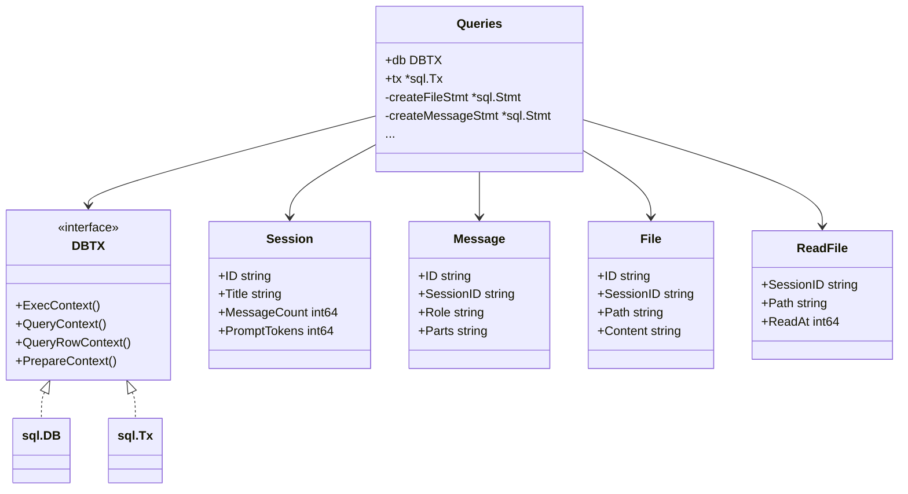

[上一篇：08-配置系统](08-配置系统.md) · [总目录](README.md) · [下一篇：10-LSP集成](10-LSP集成.md)

# 数据库与持久化

> **场景**：理解 Crush 的 SQLite 数据库架构、连接池管理、migration 流程、表结构和 sqlc 生成的查询层。
> **时间**：2026-08-27 (CST)
> **版本**：Crush @ main branch, Go 1.26.6, goose v3, sqlc v1.30.0

## 本文件内容

1. [数据库架构概览](#1-数据库架构概览)
2. [连接管理](#2-连接管理)
3. [SQLite Pragmas](#3-sqlite-pragmas)
4. [Migration 系统](#4-migration-系统)
5. [表结构详解](#5-表结构详解)
6. [SQL 触发器](#6-sql-触发器)
7. [sqlc 查询层](#7-sqlc-查询层)
8. [数据目录锁](#8-数据目录锁)
9. [SQLite 驱动选择](#9-sqlite-驱动选择)
10. [服务层与 DB 的交互模式](#10-服务层与-db-的交互模式)

## 1. 数据库架构概览

```
┌──────────────────────────────────────────────┐
│ 服务层 (session.Service, message.Service,    │
│         history.Service, filetracker.Service) │
├──────────────────────────────────────────────┤
│ sqlc 生成层 (db.Queries)                     │
│ - 预编译语句 (PrepareContext)                 │
│ - 事务支持 (WithTx)                          │
├──────────────────────────────────────────────┤
│ database/sql 标准接口                        │
│ - SetMaxOpenConns(1) 单连接序列化             │
├──────────────────────────────────────────────┤
│ SQLite 驱动                                  │
│ - modernc.org/sqlite (纯 Go)                 │
│ - 或 ncuces/go-sqlite3 (WASM)                │
├──────────────────────────────────────────────┤
│ .crush/crush.db (SQLite WAL 模式)            │
└──────────────────────────────────────────────┘
```



## 2. 连接管理

### Connect 函数

```
internal/db/connect.go
函数：Connect
偏移：+0 ～ +80+
```

执行步骤：

1. **参数解析**：`dataDir` 必须非空；解析 `ConnectOption` 选项
2. **路径计算**：`dbPath = filepath.Join(dataDir, "crush.db")`，转为绝对路径
3. **连接池查找**：在 `pool` map 中查找同路径的现有连接——如果存在，递增 `refCount` 并返回
4. **目录创建**：`os.MkdirAll(dataDir, 0o700)`
5. **数据目录锁**：如果 `lockDataDir` 选项启用且未跳过，获取 `dataDirLock`
6. **打开数据库**：`openDB(dbPath)` — 设置 pragmas 并返回 `*sql.DB`
7. **单连接模式**：`conn.SetMaxOpenConns(1)` — 序列化所有数据库访问
8. **Ping 测试**：`conn.PingContext(ctx)`
9. **Goose 初始化**：`initGoose()` — 设置 goose 日志级别
10. **执行 Migration**：`goose.Up(conn, "migrations")` — 运行所有待执行的迁移
11. **准备语句**：可选调用 `db.Prepare` 预编译所有 SQL 语句
12. **注册连接池**：将连接存入 `pool[absPath]` 供后续复用

### 连接池

```
internal/db/connect.go
Var：pool → map[string]*connEntry
Var：poolMu → sync.Mutex
```

```
Struct：connEntry
字段：db       → *sql.DB
字段：refCount → int
字段：lock     → *dataDirLock
```

连接池是进程内的引用计数池——同一进程内多次 `Connect` 同一数据库文件复用同一个 `*sql.DB`。每次 `Connect` 递增 `refCount`，`Release` 递减。`refCount` 归零时关闭连接并释放数据目录锁。

### 单连接序列化

```go
conn.SetMaxOpenConns(1)
```

**设计原因**（来自源码注释）：SQLite 在文件级别序列化写入，允许多个连接交替写入/checkpoint（特别是在并发 sub-agent 场景下）曾导致 WAL/header 不同步，在下一次打开时出现 `SQLITE_NOTADB (26)` 错误。限制为单连接避免此问题。

## 3. SQLite Pragmas

```
internal/db/connect.go
Var：pragmas
偏移：+0 ～ +8
```

| Pragma | 值 | 说明 |
|--------|-----|------|
| `foreign_keys` | `ON` | 启用外键约束（级联删除） |
| `journal_mode` | `WAL` | Write-Ahead Logging，提高并发读性能 |
| `page_size` | `4096` | 页面大小 4KB |
| `temp_store` | `MEMORY` | 临时表存于内存 |
| `cache_size` | `-8000` | 缓存 8MB（负值表示 KB） |
| `synchronous` | `NORMAL` | WAL 模式下的安全/性能平衡 |
| `secure_delete` | `ON` | 删除时覆盖数据 |
| `busy_timeout` | `30000` | 锁等待 30 秒 |

这些 pragmas 在 `openDB` 函数中通过 `PRAGMA` 语句设置。

## 4. Migration 系统

### Goose 集成

```
internal/db/connect.go
嵌入资源：//go:embed migrations/*.sql
Var：FS → embed.FS
```

Migration SQL 文件在编译时嵌入二进制文件。`goose.SetBaseFS(FS)` 设置 goose 从嵌入式文件系统读取迁移。

```
函数：initGoose
类型：sync.Once + error
```

使用 `sync.Once` 确保 goose 只初始化一次。在测试模式下设置 `goose.NopLogger()` 禁止日志输出。

### Migration 文件

```
internal/db/migrations/
```

| 文件 | 日期 | 内容 |
|------|------|------|
| `20250424200609_initial.sql` | 2025-04-24 | 初始 schema：sessions, files, messages 表 + 触发器 |
| `20250515105448_add_summary_message_id.sql` | 2025-05-15 | 添加 `summary_message_id` 列到 sessions |
| `20250624000000_add_created_at_indexes.sql` | 2025-06-24 | 添加 created_at 索引 |
| `20250627000000_add_provider_to_messages.sql` | 2025-06-27 | 添加 `provider` 列到 messages |
| `20250810000000_add_is_summary_message.sql` | 2025-08-10 | 添加 `is_summary_message` 列到 messages |
| `20250812000000_add_todos_to_sessions.sql` | 2025-08-12 | 添加 `todos` 列到 sessions |
| `20260127000000_add_read_files_table.sql` | 2026-01-27 | 创建 `read_files` 表 |

每个迁移文件包含 `-- +goose Up` 和 `-- +goose Down` 部分，支持前滚和回滚。

## 5. 表结构详解

### sessions 表

```
internal/db/migrations/20250424200609_initial.sql
CREATE TABLE sessions
```

```sql
CREATE TABLE IF NOT EXISTS sessions (
    id TEXT PRIMARY KEY,
    parent_session_id TEXT,
    title TEXT NOT NULL,
    message_count INTEGER NOT NULL DEFAULT 0,
    prompt_tokens INTEGER NOT NULL DEFAULT 0,
    completion_tokens INTEGER NOT NULL DEFAULT 0,
    cost REAL NOT NULL DEFAULT 0.0,
    updated_at INTEGER NOT NULL,
    created_at INTEGER NOT NULL
);
```

后续迁移添加的列：
- `summary_message_id TEXT` (2025-05-15) — 摘要消息 ID
- `todos TEXT` (2025-08-12) — JSON 格式的 todo 列表

### messages 表

```
internal/db/migrations/20250424200609_initial.sql
CREATE TABLE messages
```

```sql
CREATE TABLE IF NOT EXISTS messages (
    id TEXT PRIMARY KEY,
    session_id TEXT NOT NULL,
    role TEXT NOT NULL,
    parts TEXT NOT NULL DEFAULT '[]',
    model TEXT,
    created_at INTEGER NOT NULL,
    updated_at INTEGER NOT NULL,
    finished_at INTEGER,
    FOREIGN KEY (session_id) REFERENCES sessions (id) ON DELETE CASCADE
);
```

后续迁移添加的列：
- `provider TEXT` (2025-06-27) — LLM 提供商名称
- `is_summary_message INTEGER` (2025-08-10) — 是否为摘要消息

`parts` 字段存储 JSON 数组，对应 `[]message.ContentPart`。每个 ContentPart 的类型通过 JSON 结构中的字段区分。

### files 表

```sql
CREATE TABLE IF NOT EXISTS files (
    id TEXT PRIMARY KEY,
    session_id TEXT NOT NULL,
    path TEXT NOT NULL,
    content TEXT NOT NULL,
    version INTEGER NOT NULL DEFAULT 0,
    created_at INTEGER NOT NULL,
    updated_at INTEGER NOT NULL,
    FOREIGN KEY (session_id) REFERENCES sessions (id) ON DELETE CASCADE,
    UNIQUE(path, session_id, version)
);
```

文件历史表——每次文件修改创建新版本。`UNIQUE(path, session_id, version)` 确保同一会话中同一文件路径的版本号唯一。

索引：
- `idx_files_session_id` — 按会话查询文件
- `idx_files_path` — 按路径查询文件

### read_files 表

```
internal/db/migrations/20260127000000_add_read_files_table.sql
```

```sql
CREATE TABLE IF NOT EXISTS read_files (
    session_id TEXT NOT NULL,
    path TEXT NOT NULL,
    read_at INTEGER NOT NULL,
    PRIMARY KEY (session_id, path)
);
```

记录会话中读取过的文件，用于文件追踪器（filetracker）判断哪些文件已被 agent 读取。

## 6. SQL 触发器

初始 migration 定义了 5 个触发器：

### 自动更新 updated_at

```
触发器：update_sessions_updated_at
触发：AFTER UPDATE ON sessions
动作：SET updated_at = strftime('%s', 'now')
```

同理 `update_files_updated_at` 和 `update_messages_updated_at`。

### 自动更新 message_count

```
触发器：update_session_message_count_on_insert
触发：AFTER INSERT ON messages
动作：sessions.message_count = message_count + 1
```

```
触发器：update_session_message_count_on_delete
触发：AFTER DELETE ON messages
动作：sessions.message_count = message_count - 1
```

这两个触发器自动维护 `sessions.message_count` 字段，无需应用层手动更新。

## 7. sqlc 查询层

### 代码生成

```
internal/db/db.go
注释：Code generated by sqlc. DO NOT EDIT.
版本：sqlc v1.30.0
```

所有查询代码由 sqlc 从 SQL 文件自动生成。生成的文件按表名分组：

| 文件 | 内容 |
|------|------|
| `sessions.sql.go` | Session CRUD 查询 |
| `messages.sql.go` | Message CRUD 查询 |
| `files.sql.go` | File CRUD 查询 |
| `read_files.sql.go` | ReadFile 查询 |
| `stats.sql.go` | 统计查询（使用量、工具使用等） |
| `querier.go` | Queries 接口定义 |

### Queries 结构

```
internal/db/db.go
Struct：Queries
字段：db → DBTX
字段：tx → *sql.Tx
字段：createFileStmt, createMessageStmt, ... → *sql.Stmt
```

`Queries` 持有所有预编译语句。通过 `Prepare` 函数在初始化时预编译所有 SQL，提高查询性能。

### 预编译语句执行

```
internal/db/db.go
函数：exec
偏移：+0 ～ +8
```

```go
func (q *Queries) exec(ctx context.Context, stmt *sql.Stmt, query string, args ...interface{}) (sql.Result, error) {
    switch {
    case stmt != nil && q.tx != nil:
        return q.tx.StmtContext(ctx, stmt).ExecContext(ctx, args...)
    case stmt != nil:
        return stmt.ExecContext(ctx, args...)
    default:
        return q.db.ExecContext(ctx, query, args...)
    }
}
```

三种执行路径：
1. **事务 + 预编译**：通过 `tx.StmtContext` 在事务中执行预编译语句
2. **预编译**：直接执行预编译语句
3. **回退**：直接执行 SQL 字符串（未预编译的情况）

`query` 和 `queryRow` 方法遵循相同模式。

### 事务支持

```
internal/db/db.go
函数：WithTx
偏移：+0 ～ +44
```

```go
func (q *Queries) WithTx(tx *sql.Tx) *Queries {
    return &Queries{
        db: tx,
        tx: tx,
        createFileStmt: q.createFileStmt,
        ...
    }
}
```

`WithTx` 创建一个新的 `Queries` 实例，复用预编译语句但切换到事务上下文。原 `Queries` 不受影响。

### DBTX 接口

```
internal/db/db.go
Interface：DBTX
方法：ExecContext, PrepareContext, QueryContext, QueryRowContext
```

`DBTX` 抽象了 `*sql.DB` 和 `*sql.Tx` 的共同接口，使 `Queries` 可以在事务和非事务模式下工作。

## 8. 数据目录锁

```
internal/db/datadirlock.go
```

### 目的

防止多个 Crush 进程同时操作同一数据目录的 SQLite 数据库。虽然 SQLite 本身有文件锁，但在 WAL 模式下，多个进程的 checkpoint 操作可能冲突。

### 机制

```
internal/db/connect.go
函数：Connect
偏移：+30 ～ +40
```

- `WithDataDirLock(true)` 选项启用锁
- `CRUSH_SKIP_DATADIR_LOCK` 环境变量可跳过锁
- 锁在 `Connect` 时获取，在 `Release`（refCount 归零）时释放
- 本地模式默认不锁（保持向后兼容），服务器模式可选锁

### connEntry

```
internal/db/connect.go
Struct：connEntry
字段：lock → *dataDirLock
```

`dataDirLock` 使用文件锁实现跨进程互斥。锁文件位于数据目录内。

## 9. SQLite 驱动选择

Crush 支持两个 SQLite 驱动，通过 build tags 选择：

### modernc.org/sqlite (纯 Go)

```
internal/db/connect_modernc.go
Build tag：!ncruces
```

纯 Go 实现，无需 CGO。这是默认驱动。

### ncuces/go-sqlite3 (WASM)

```
internal/db/connect_ncruces.go
Build tag：ncruces
```

基于 WASM 的 SQLite 实现，在某些平台上可能比 modernc 更快。

### openDB 函数

两个驱动各提供 `openDB` 函数，接受 `dbPath` 参数，设置 pragmas 并返回 `*sql.DB`。驱动选择通过 Go build tags 自动完成。

## 10. 服务层与 DB 的交互模式

### Session Service

```
internal/session/session.go
Struct：service
字段：db → *sql.DB
字段：q  → *db.Queries
```

`session.service` 在构造时接收 `*sql.DB` 和 `*db.Queries`。查询通过 `q` 执行，直接事务通过 `db` 执行。

### Message Service

```
internal/message/message.go
Struct：service
字段：q → db.Querier
```

`message.service` 使用 `db.Querier` 接口（而非具体 `*db.Queries`），便于测试时注入 mock。

### 防抖与持久化

```
internal/message/message.go
Const：defaultUpdateDebounce = 33 * time.Millisecond
```

消息更新经过 33ms 防抖窗口，在此期间内的多次更新只产生一次 DB 写入。`Flush` 和 `FlushAll` 强制立即写入所有待处理的更新。

### 数据流

```
LLM Stream
  │
  │ OnTextDelta("Hello")
  ▼
message.Service.Update(msg)
  │
  │ 33ms 防抖窗口
  ▼
pendingState.timer fires
  │
  ▼
db.Queries.UpdateMessage(ctx, msg)
  │
  │ SQL: UPDATE messages SET parts = ?, updated_at = ? WHERE id = ?
  ▼
SQLite WAL
  │
  │ pubsub.Broker.Publish(UpdatedEvent, msg)
  ▼
Subscriber (TUI / non-interactive)
```

### history.Service

`history.Service` 管理文件版本历史，使用 `db.Queries` 的 File CRUD 操作。每次文件修改（edit/write 工具）创建新的 File 记录，递增 version。

### filetracker.Service

`filetracker.Service` 使用 `read_files` 表跟踪会话中已读取的文件，并通过 `files` 表跟踪已修改的文件。

---

[上一篇：08-配置系统](08-配置系统.md) · [总目录](README.md) · [下一篇：10-LSP集成](10-LSP集成.md)