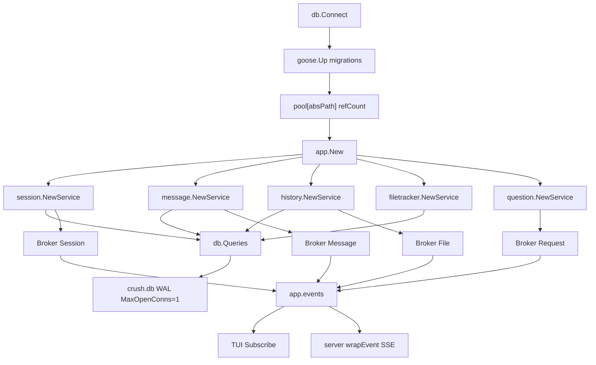
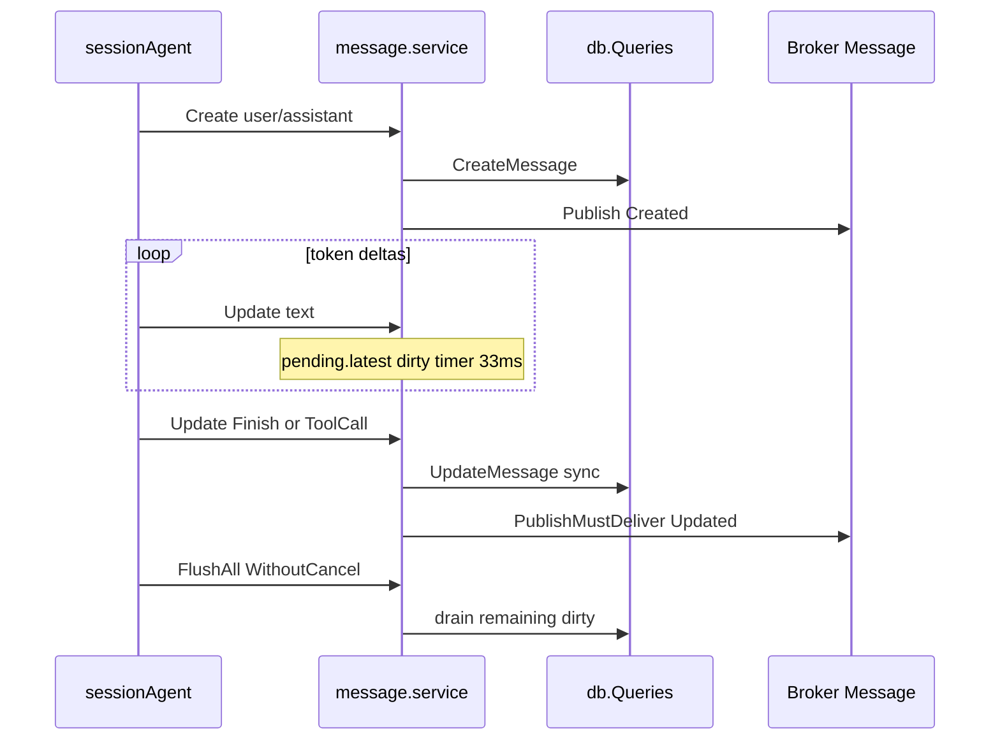

# 09. 数据模型、持久化与事件

> 状态：待复核生成稿
> 生成日期：2026-08-16
> 基准提交：`16dce459cafecee92eae0ed7c47a0c641c8bbb9f`
> 工作区：dirty（开始分析时已有文档草稿）
> 源码范围：`internal/session/`、`internal/message/`、`internal/db/`、`internal/history/`、`internal/filetracker/`、`internal/pubsub/`、`internal/question/`
> 生成方式：源码、测试、迁移 Schema 与 sqlc 配置静态分析
> 所属层：第四层（补齐持久化、事件与领域服务全部逻辑）
> 前置阅读：[01-简单框架-系统骨架.md](01-简单框架-系统骨架.md)、[02-简单例子-全路径走读.md](02-简单例子-全路径走读.md)

## 快速摘要

### 架构总览（模块与依赖）

SQLite 文件 `<dataDir>/crush.db` 是权威持久层。`db.Connect` 按绝对路径复用连接并引用计数；Goose 嵌入迁移；sqlc 从 `internal/db/sql/` 生成 `Querier`。领域服务 `session.Service`、`message.Service`、`history.Service`、`filetracker.Service` 把 sqlc 行映射成 Go 对象，成功写入后再经 `pubsub.Broker` 发 `created/updated/deleted`。`question.Service` 不落库，只在进程内阻塞等待 TUI 回答。Broker 不是可靠日志：慢订阅者丢包后必须重新查询当前状态。

### 核心调用序列（逐步逻辑）

1. `cmd.setupLocalWorkspace` 或 `backend.CreateWorkspace` 调用 `db.Connect`，创建 `0o700` 数据目录、打开 `crush.db`、跑 Goose、`SetMaxOpenConns(1)`。
2. `app.New` 用同一 `*sql.DB` 构造 `session.NewService`、`message.NewService`、`history.NewService`、`filetracker.NewService`、`question.NewService`。
3. 用户提示进入 `sessionAgent.Run`：`messages.Create` 立即写 SQL 并 `Publish(CreatedEvent)`；流式 `messages.Update` 默认 33ms debounce，结构/终态同步 flush。
4. turn 结束 `messages.FlushAll`，再 `runComplete.PublishMustDeliver`。
5. `app.setupSubscriber*` 把各领域 Broker 扇入 `app.events`；TUI 订阅本地 Broker，Client/Server 经 SSE 转发 proto 事件。

### 易错点与边界条件

- 注释写“毫秒”，trigger 实际用 `strftime('%s','now')`（秒）。Go 层与统计查询以秒为准。
- `Get`/`List` 不读 debounce 缓冲；读最新状态必须先 `Flush`/`FlushAll`。debounce timer 用 `context.Background()`，取消 stream 不会丢掉缓冲写。
- `EstimatedUsage` 只在内存，不进 SQLite；`Save` 后必须从 map 回填。
- `sessions.parent_session_id` 没有外键；删除父会话不会级联删 title/task 子会话。
- `ListNewFiles` 查询引用不存在的 `is_new` 列，生产代码未调用。
- 普通 `Publish` 可丢；终态走 `PublishMustDeliver`（每订阅者最多阻塞 50ms）。

## 目录

1. [为什么这样设计（Why）](#1-为什么这样设计why)
2. [它是什么（What）](#2-它是什么what)
3. [代码如何实现（How）](#3-代码如何实现how)
4. [调用关系](#4-调用关系)
5. [测试证据](#5-测试证据)
6. [如何重新实现](#6-如何重新实现)
7. [阅读源码建议顺序](#7-阅读源码建议顺序)
8. [重新实现检查清单](#8-重新实现检查清单)

## 1. 为什么这样设计（Why）

Crush 要把一次对话变成可恢复的本地事实：关掉 TUI、换进程、Client 重连后，Session、Message、文件快照和“读过哪些文件”必须还能从磁盘读回来。同时流式 token 每秒可到上百次，如果每次 delta 都同步写 SQLite 并广播 UI，WAL 和 TUI 都会被打满。

因此拆成三层：

| 层 | 职责 | 不可靠时的后果 |
|---|---|---|
| SQLite | 权威事实 | 进程崩溃后对话丢失 |
| 领域 Service | 事务、映射、debounce、内存标志 | UI 看到数据库里不存在的状态，或读到过期 parts |
| Broker | 变化通知 | 丢包只影响实时展示；订阅者应重新 List/Get |

`question.Service` 不持久化，是因为它只是工具调用期间的一次阻塞问答：进程退出等于取消，没有“下次打开再答”的需求。

推断：单连接 `SetMaxOpenConns(1)` 是为了规避 WAL checkpoint 与多 writer 交错导致的 `SQLITE_NOTADB`，注释写明曾在并发子 Agent 下复现。

## 2. 它是什么（What）

```text
Session（一次用户对话或内部子对话）
  ├─ Message[]     role + parts JSON（多态 ContentPart）
  ├─ File[]        history：编辑前/中的内容快照（按 path+session+version）
  ├─ ReadFile[]    filetracker：本会话读过的路径与 read_at
  └─ child Session  title- / task / agent-tool 内部会话（靠 ID 约定，无 FK）
```

进程内还有两类非 SQLite 状态：

- `session.service.estimatedUsage`：UI 的 `~` token 估算标记。
- `message.service.pending`：按 message ID 的 debounce 缓冲。
- `question.questionService.pending`：当前唯一一批问答的应答 channel。

事件类型（`pubsub.EventType`）只有三种：`created`、`updated`、`deleted`。跨进程 SSE 再用 `pubsub.PayloadType` 给 payload 加判别器（`message`、`session`、`run_complete` 等），见 [10-Workspace与ClientServer.md](10-Workspace与ClientServer.md)。

## 3. 代码如何实现（How）

### 3.1 连接池、锁、pragma、迁移

入口：`internal/db/connect.go`。

`Connect(ctx, dataDir, opts...)` 步骤：

1. 拒绝空 `dataDir`。
2. `filepath.Join(dataDir, "crush.db")` 再 `Abs`，作为 `pool` 的 key。
3. 持 `poolMu`：已有 `connEntry` 则 `refCount++` 直接返回同一 `*sql.DB`。
4. `os.MkdirAll(dataDir, 0o700)`。
5. 仅当 `WithDataDirLock(true)` 且未设 `CRUSH_SKIP_DATADIR_LOCK` 时，`acquireDataDirLock` 对 `{dataDir}/crush.lock` 做非阻塞 `lock.TryFile`。本地 `setupLocalWorkspace` 不传该 option；`backend.CreateWorkspace` 传 `true`。
6. `openDB`：Darwin/Linux/Windows 常见架构走 `connect_modernc.go`（`modernc.org/sqlite`，pragma 经 `_pragma=` DSN）；其余走 `connect_ncruces.go`（打开后 `PRAGMA`）。两者都设 `_txlock=immediate`。
7. `SetMaxOpenConns(1)`。
8. `PingContext`。
9. `initGoose`：`sync.Once` 设 sqlite3 dialect，`embed.FS` 指向 `migrations/*.sql`。
10. `goose.Up(conn, "migrations")`。
11. 放入 `pool`，`refCount=1`。失败路径关闭 DB 并 `lock.release()`。

`Release(dataDir)` 减引用，归零才 `Close` 并释放目录锁。`ResetPool` 仅测试用。`ConnectReadOnly` 打开任意 `dbPath`、不迁移、同样单连接，给跨项目 stats。

pragma（`connect.go` 的 `pragmas` map）：

| pragma | 值 | 作用 |
|---|---|---|
| `foreign_keys` | `ON` | 真正执行 messages/files/read_files 的 `ON DELETE CASCADE` |
| `journal_mode` | `WAL` | 读写可交错，但不等于多 writer 安全 |
| `page_size` | `4096` | 固定页大小 |
| `temp_store` | `MEMORY` | 临时表走内存 |
| `cache_size` | `-8000` | 约 8MB 页缓存（负数表示 KiB） |
| `synchronous` | `NORMAL` | WAL 下的折中耐久 |
| `secure_delete` | `ON` | 降低删除后残留 |
| `busy_timeout` | `30000` | 短暂锁等待 30s |

`internal/db/datadirlock.go`：锁文件故意永不 unlink（flock 按 inode）。持锁后写 JSON owner（pid/version/started_at，`0o600`），仅用于诊断。争用返回包装后的 `ErrDataDirLocked`。

### 3.2 逐个迁移

Goose 按文件名时间戳排序。`sqlc.yaml` 把 `internal/db/migrations` 当 schema、`internal/db/sql` 当 queries。

#### `20250424200609_initial.sql`

建三张表和 trigger：

**`sessions`**

| 列 | 约束 | 含义 |
|---|---|---|
| `id` | PK TEXT | UUID 或约定 ID |
| `parent_session_id` | 可空 TEXT，**无 FK** | 子会话指向父 |
| `title` | NOT NULL | 显示名 |
| `message_count` | `>= 0`，默认 0 | 由 messages insert/delete trigger 维护 |
| `prompt_tokens` / `completion_tokens` | `>= 0` | 累计 usage |
| `cost` | `>= 0.0` | 累计费用 |
| `created_at` / `updated_at` | NOT NULL | 注释写毫秒，trigger 写秒 |

Trigger：

- `update_sessions_updated_at`：任意 UPDATE 后把 `updated_at` 设为 `strftime('%s','now')`。SQLite 默认不递归 trigger，因此不会死循环。
- `update_session_message_count_on_insert/delete`：messages 增删时 ±1。

**`files`**：`id` PK；`session_id` FK → sessions `ON DELETE CASCADE`；`path`、`content`、`version` 默认 0；`UNIQUE(path, session_id, version)`；索引 `idx_files_session_id`、`idx_files_path`；`update_files_updated_at`。

**`messages`**：`id` PK；`session_id` FK CASCADE；`role`；`parts` 默认 `'[]'`；可空 `model`；`created_at`/`updated_at`；可空 `finished_at`；索引 `idx_messages_session_id`；`update_messages_updated_at`。

#### `20250515105448_add_summary_message_id.sql`

`sessions.summary_message_id TEXT`。压缩上下文后指向摘要消息。

#### `20250624000000_add_created_at_indexes.sql`

`idx_sessions_created_at`、`idx_messages_created_at`、`idx_files_created_at`。

#### `20250627000000_add_provider_to_messages.sql`

`messages.provider TEXT`。

#### `20250810000000_add_is_summary_message.sql`

`messages.is_summary_message INTEGER DEFAULT 0 NOT NULL`。`GetLastAssistantMessageBySession` 排除摘要行。

#### `20250812000000_add_todos_to_sessions.sql`

`sessions.todos TEXT`（JSON 数组）。

#### `20260127000000_add_read_files_table.sql`

**`read_files`**：PK `(path, session_id)`；`read_at` 秒；FK CASCADE；索引 session_id、path。`RecordFileRead` 用 `ON CONFLICT DO UPDATE SET read_at`。

### 3.3 sqlc：查询与生成代码的关系

不要手改 `internal/db/*sql.go`、`models.go`、`querier.go`、`db.go`。改 `internal/db/sql/*.sql` 后跑 sqlc。

生成契约：

- `db.DBTX`：`*sql.DB` 与 `*sql.Tx` 共用 Exec/Query。
- `db.Queries.WithTx(tx)`：同一套方法进事务。
- `db.Querier` 接口：`message.Service` 依赖它，测试可注入慢写。
- `emit_prepared_queries: true`：`Prepare` 预编译全部语句（生产 `db.New(conn)` 走即时 SQL，不强制 Prepare）。
- 行类型：`db.Session`、`db.Message`、`db.File`、`db.ReadFile`。可空列用 `sql.NullString`/`NullInt64`。

查询到调用方：

| SQL 名 | 文件 | 调用方 |
|---|---|---|
| `CreateSession` / `GetSessionByID` / `GetLastSession` / `ListSessions` / `UpdateSession` / `UpdateSessionTitleAndUsage` / `RenameSession` / `DeleteSession` | `sql/sessions.sql` | `session.service` |
| `CreateMessage` / `UpdateMessage` / `GetMessage` / `ListMessagesBySession` / `ListUserMessagesBySession` / `ListAllUserMessages` / `GetLastAssistantMessageBySession` / `DeleteMessage` / `DeleteSessionMessages` | `sql/messages.sql` | `message.service` |
| `CreateFile` / `GetFile` / `GetFileByPathAndSession` / `ListFilesBySession` / `ListFilesByPath` / `ListLatestSessionFiles` / `DeleteFile` / `DeleteSessionFiles` | `sql/files.sql` | `history.service` |
| `ListNewFiles` | `sql/files.sql` | **无生产调用**；`WHERE is_new = 1` 而 schema 无该列 |
| `RecordFileRead` / `GetFileRead` / `ListSessionReadFiles` | `sql/read_files.sql` | `filetracker.service` |
| `GetUsageByDay/Model/Hour/DayOfWeek`、`GetTotalStats`、`GetRecentActivity`、`GetAverageResponseTime`、`GetToolUsage`、`GetHourDayHeatmap` | `sql/stats.sql` | `crush stats`（本篇不展开 CLI） |

`ListSessions` 过滤 `parent_session_id IS NULL`，避免 TUI 把 title/task 子会话当用户会话。`GetLastSession` **不过滤** parent，继续“最近会话”时 `app.resolveSession` 会再拒绝 child。

`UpdateSessionTitleAndUsage` 对 token/cost 做 **加法**（`prompt_tokens = prompt_tokens + ?`），不是覆盖。`RenameSession` 只改 title；Go 注释说不碰 `updated_at`，但 `update_sessions_updated_at` trigger 仍会改秒级时间戳。

### 3.4 Session 领域服务

文件：`internal/session/session.go`。

`Session` 字段几乎映射表，外加内存 `EstimatedUsage`。`Todo.Status`：`pending` / `in_progress` / `completed`。`HasIncompleteTodos` 任一非 completed 即为 true。`HashID` 用 XXH3 把 UUID 变成短 hex，仅展示，不能当主键。

`NewService(q, conn)` 嵌入 `Broker[Session]`。`conn` 只为 Delete 开事务。

| 方法 | ID 规则 | 持久化 | 事件 / 副作用 |
|---|---|---|---|
| `Create(title)` | `uuid.New()`，无 parent | `CreateSession` | `Publish(Created)` + `event.SessionCreated` |
| `CreateTaskSession(toolCallID, parent, title)` | **ID = toolCallID**，parent 非空 | 同上 | `Created`，无 PostHog |
| `CreateTitleSession(parent)` | **ID = `"title-"+parent`**，title 固定 `"Generate a title"` | 同上 | `Created` |
| `Get` / `GetLast` / `List` | — | 读 SQL 后 `applyEstimatedUsageState` | 无 |
| `Save` | — | marshal todos JSON；`UpdateSession`；写回 estimated map | `Updated` |
| `UpdateTitleAndUsage` | — | SQL 累加 token/cost | `Get` 再 `Updated`；Get 失败只 slog |
| `Rename` | — | `RenameSession` | 同上 |
| `Delete` | — | 事务：Get → `DeleteSessionMessages` → `DeleteSessionFiles` → `DeleteSession` → Commit | 清 estimated；`Deleted` + `event.SessionDeleted`。**不删 child session 行** |

Agent-tool session ID 是纯字符串约定，不落库：

- `CreateAgentToolSessionID` → `messageID + "$$" + toolCallID`
- `ParseAgentToolSessionID`：恰好两段才 `ok`
- `IsAgentToolSession`：Parse 成功

`app.resolveSession` 与 CLI 拒绝继续 child 或 agent-tool session（证据：`internal/app/app.go:resolveSession`、`internal/app/resolve_session_test.go`）。

`fromDBItem`：todos JSON 失败时 slog 并给空切片，不返回 error。

### 3.5 Message 模型与 ContentPart

`internal/message/content.go` + `message.go`。

`MessageRole`：`assistant` / `user` / `system` / `tool`。`FinishReason`：`end_turn`、`max_tokens`、`tool_use`、`canceled`、`error`、`content_filter`、`unknown`。`IsErrorLike` = error 或 content_filter（TUI 同一条拒绝横幅）。

`ContentPart` 接口只有 `isPart()`。具体类型：

| 类型 | JSON `type` | 关键字段 |
|---|---|---|
| `ReasoningContent` | `reasoning` | thinking、signature、Google thought_signature、OpenAI ResponsesData、StartedAt/FinishedAt（Unix 秒） |
| `TextContent` | `text` | Text |
| `ImageURLContent` | `image_url` | URL、Detail |
| `BinaryContent` | `binary` | Path、MIMEType、Data（[]byte） |
| `ToolCall` | `tool_call` | ID、Name、Input、ProviderExecuted、Finished |
| `ToolResult` | `tool_result` | ToolCallID、Content/Data/MIMEType、IsError |
| `Finish` | `finish` | Reason、Time（Unix 秒）、Message、Details |
| `ShellCommand` | `shell_command` | Command、Output、ExitCode（bang-mode 恢复） |

`marshalParts`/`unmarshalParts` 用 `{type, data}` 包装，未知 type 报错。`Clone` 只拷贝 Parts 切片，元素值拷贝（BinaryContent 的 Data 仍共享 backing array——推断：流式路径以文本为主）。

可变方法：`AppendContent`、`AppendReasoningContent`、`FinishThinking`、`AddToolCall`/`FinishToolCall`/`AppendToolCallInput`、`AddFinish`（先删旧 Finish）、`ResetStreamedContent`（丢掉 text/reasoning/toolcall/finish，保留 image/binary/tool result/shell）。

`ToAIMessage` 把领域 Message 转成 `fantasy.Message`：user 把 text 附件包进 `<file>`，shell 输出 `ansi.Strip` 后拼进文本；assistant 带 provider 特定 reasoning metadata；tool 结果里无效 base64 换成 `"[Image data could not be loaded]"`。

`Create`：非 Assistant 自动追加 `Finish{Reason:"stop"}`；立即 SQL；`Publish(Created, Clone())`。

### 3.6 Message.Update debounce 与 Flush

默认 `defaultUpdateDebounce = 33ms`。`WithDebounce(0)` 每次同步 flush（测试与旧行为）。

`pendingState`（`service.mu` 保护）：`latest`、`dirty`、`flushing`、`timer`、`lastFlushed`、`hasFlushed`。

`Update`：

1. `Clone` 入缓冲。
2. `shouldFlushNow(prev, next)` 为真则停 timer，`flushOne(ctx, id, true)`。
3. 否则若无 timer 且未 flushing，`time.AfterFunc(33ms, flushOne(Background, id, false))`。

`shouldFlushNow` 为真当：next 已 `IsFinished()`；tool call 数量变化；某一 call 的 `Finished` 翻转；reasoning 的 `FinishedAt` 从 0 变为正。Tool call **Input 增量不触发**同步 flush。

`flushOne`：

- `syncCaller=true`（Update 终态 / Flush / FlushAll）：若 `flushing`，睡 1ms 重试，直到 SQL 落地且 `lastFlushed` 追上。
- `syncCaller=false`（timer）：已有 flusher 则立刻返回，靠 trailing dirty。
- SQL 失败把 `dirty` 设回 true。
- 成功后：终态 `PublishMustDeliver`，中间态 `Publish`。
- 同步调用者若写 SQL 期间又 dirty，循环再写。

`FlushAll` 快照所有 `dirty || flushing` 的 ID 再逐个 `flushOne(..., true)`，保证 shutdown/切 session 时不会在 timer 写到一半时返回。`Delete` 先 Get、删行、停 timer、删 pending，再 `Publish(Deleted, Clone())`，避免把缓冲写回已删行。

`Get`/`List*` **只读 SQL**，不合并 pending。因此：

- `AppWorkspace.ListMessages` 与 `backend.ListSessionMessages` 先 `FlushAll`。
- `sessionAgent` 在 Stream defer 里 `FlushAll(WithoutCancel, 5s timeout)`。
- `app.Shutdown` 在关 DB 前 `FlushAll`。

`write` 只更新 `parts` 与 `finished_at`（来自 `FinishPart().Time`），`updated_at` 由 SQL `strftime('%s','now')`。

### 3.7 History 与 FileTracker

`internal/history/file.go`：编辑工具在改磁盘前把内容快照进 `files`。`Create` 版本 0。`CreateVersion` 按 path 全局（**不限 session**）取 `ListFilesByPath` 最新 version+1。事务内 `CreateFile`；`UNIQUE` 冲突最多重试 3 次并 `version++`。成功 `Publish(Created)`。删除先读再删再 `Deleted`。

`internal/filetracker/service.go`：View 等工具记录“本会话读过”。`relpath` 相对 `os.Getwd()` 存库；`ListReadFiles` 再 Join 回绝对路径。`RecordRead` 失败只 slog，不返回 error。`LastReadTime` 未读返回 zero `time.Time`。写工具用它判断用户/模型是否看过最新内容。

### 3.8 PubSub

`internal/pubsub/broker.go` + `events.go`。

每订阅者 channel 容量 **4096**。`Subscribe(ctx)` 在 ctx 取消时从 map 删除并 close channel；`Shutdown` close `done` 并关闭所有 channel。

| API | 语义 | 满时 | 计数 |
|---|---|---|---|
| `Publish(type, payload)` | 非阻塞 | `default` 丢弃 + Warn | `DropCount` |
| `PublishMustDeliver(ctx, type, payload)` | 先非阻塞，再每订阅者最多阻塞 `mustDeliverTimeout`（默认 50ms） | timeout 丢弃 + Error；`ctx.Done` 中止后续订阅者 | `MustDeliverDropCount` |

PayloadType 给 SSE 判别：`lsp_event`、`mcp_event`、`permission_request`、`permission_notification`、`message`、`session`、`file`、`agent_event`、`config_changed`、`skills_event`、`run_complete`、`update_available`、`question_batch_request`、`question_batch_notification`。

领域服务谁用哪种投递：见 [12-并发可靠性安全与可观测性.md](12-并发可靠性安全与可观测性.md)。Session/History 一律 `Publish`；Message 终态 `PublishMustDeliver`。

### 3.9 Question

`internal/question/question.go`。镜像 permission：发布请求、阻塞、UI 回填。

限制：最多 5 题；题干 240、描述 600、选项 5 个、label/description 各 200。`yes_no`/`free_text` 不要 choices；`single_choice`/`multi_choice` 至少 2 个且 id 唯一。多题缺确认文案时默认 `"Ready to go?"` / `"Review your answers above and confirm."`。

`Ask`：补 UUID；`Validate`；在 `mu` 下创建 `pending chan []Answer` 与 `cancelled`；`Publish(Created, req)`（**此处是普通 Publish**）；select ctx / cancel / answers。`Answer`/`Cancel` 返回 bool 表示是否赢了 resolve，并往 notification broker `Publish` `Notification{BatchID}`。同一时刻只允许一批 pending。App 扇入时对 question 用 `setupSubscriberMustDeliver`，所以第一跳仍可能丢、第二跳尽量保。

## 4. 调用关系

### 4.1 创建用户消息并流式更新（主路径）

| 调用方文件与符号 | 关系 | 被调用方文件与符号 | 触发与输入 | 返回与后续处理 | 错误、状态与副作用 |
|---|---|---|---|---|---|
| `agent/agent.go:sessionAgent.Run` | 调用 | `message.service.Create` | 用户 prompt、attachments | 得到 Message，开始 Stream | SQL 失败向上返回 |
| `sessionAgent` 流式回调 | 调用 | `Message.AppendContent` 然后 `service.Update` | token delta | 33ms 内合并 | Clone 进 pending；timer 用 Background |
| `sessionAgent` 收到 tool call | 调用 | `AddToolCall`/`FinishToolCall` + `Update` | 结构变化 | `shouldFlushNow` 真 | 同步 SQL + `PublishMustDeliver` |
| `sessionAgent` defer | 调用 | `service.FlushAll` | `WithoutCancel` + 5s | 所有 dirty 落地 | 失败 slog；再发 RunComplete |
| `app.App.Shutdown` | 调用 | `Messages.FlushAll` | shutdownCtx 5s | 然后并行关 LSP/shell | 避免关 DB 后 timer 写失败 |

### 4.2 Session CRUD 与子会话

| 调用方文件与符号 | 关系 | 被调用方文件与符号 | 触发与输入 | 返回与后续处理 | 错误、状态与副作用 |
|---|---|---|---|---|---|
| `workspace.AppWorkspace.CreateSession` | 委托 | `session.service.Create` | title | 顶层 UUID session | Broker Created；PostHog |
| `agent` 生成标题 | 调用 | `CreateTitleSession` | parent ID | ID=`title-{parent}` | 内部消息不进主会话 List |
| task 工具 | 调用 | `CreateTaskSession` | toolCallID 作 ID | child session | ListSessions 过滤掉 |
| `app.resolveSession` | 拒绝 | `IsAgentToolSession` / `ParentSessionID` | continue 标志 | error | 不能恢复内部会话 |
| `session.service.Delete` | 事务 | `DeleteSessionMessages` + `DeleteSessionFiles` + `DeleteSession` | session ID | Commit 后 Deleted | child 行残留；read_files 靠 FK cascade |

### 4.3 连接与事件扇入

| 调用方文件与符号 | 关系 | 被调用方文件与符号 | 触发与输入 | 返回与后续处理 | 错误、状态与副作用 |
|---|---|---|---|---|---|
| `cmd/root.go:setupLocalWorkspace` | 调用 | `db.Connect` | dataDir，无锁 option | 共享 `*sql.DB` | mkdir 0o700；gitignore `*` |
| `backend.CreateWorkspace` | 调用 | `db.Connect(..., WithDataDirLock(true))` | 工作区 dataDir | 同上 | 争用 `ErrDataDirLocked` |
| `app.New` | 构造 | 四个 Service + Question | 同一 conn | 注册 cleanup `db.Release` | 最后 Release 才 Close |
| `app.setupSubscriber` | 订阅 | Session/Message/History Broker | app ctx | 转到 `app.events.Publish` | 可丢 |
| `app.setupSubscriberMustDeliver` | 订阅 | Permission/Question/RunComplete | app ctx | `PublishMustDeliver` | 见文档 12 |





## 5. 测试证据

| 测试 | 断言的行为 |
|---|---|
| `session.TestEstimatedUsageStateSurvivesFetchModifySave` | Save todos 后 Get 仍带 EstimatedUsage |
| `session.TestEstimatedUsageStateCanBeClearedByExplicitSave` | 显式 `false` 后 map 清除 |
| `message.TestUpdate_DebouncesTextDeltas` | 文本 delta 合并 |
| `message.TestUpdate_TerminalUpdatesFlushSynchronously` | Finish 立刻落库 |
| `message.TestUpdate_ToolCallStructuralChangeFlushes` | tool 集合变化同步 |
| `message.TestUpdate_ReasoningEndFlushes` | FinishedAt 0→正 同步 |
| `message.TestFlush_DrainsPendingDebouncedUpdates` / `TestFlushAll_*` | 显式 drain |
| `message.TestFlush_WaitsForInFlightWrite` | 同步 Flush 等慢 SQL |
| `message.TestUpdate_TerminalEventUsesMustDeliver` / `StructuralFlushUsesMustDeliver` | 终态走 must-deliver |
| `message.TestUpdate_ZeroDebounceFlushesEveryUpdate` | debounce≤0 |
| `message.TestDelete_DropsPendingState` | 删后不回写 |
| `message.TestBroker_PublishLossyDropCounter` / `PublishMustDeliverHonorsTimeout` | 背压计数 |
| `message.TestToAIMessage_CorruptedMediaData` | 坏 base64 占位符 |
| `db.TestConnect_SharesConnectionForSameDataDir` | 同路径同一 `*sql.DB` |
| `db.TestConnect_DefaultIgnoresContendedLock` | 本地默认不抢 crush.lock |
| `db.TestConnect_ServerPathFailsWhenDataDirLocked` | server option 争用失败 |
| `db.TestConnect_SkipLockEnvBypassesAcquisition` | `CRUSH_SKIP_DATADIR_LOCK=1` |
| `filetracker.TestService_RecordRead*` | upsert 更新 read_at；未读 zero time |

本轮未运行 `go test`，不声明通过。覆盖缺口：无迁移时间单位断言；无删除父会话后 child 残留的测试；`ListNewFiles` 无测试。

## 6. 如何重新实现

必须保持的行为契约：

1. 每 dataDir 一个 SQLite 文件、进程内按绝对路径复用、最后 Release 才 Close。
2. 单连接 + WAL + foreign_keys + 秒级 trigger。
3. parts 用显式 type discriminator，不要靠 Go 接口 JSON。
4. 流式文本可合并；Finish / tool 结构 / reasoning 结束必须在 Update 返回前可见于 SQL。
5. List/Get 默认不读内存缓冲；需要最新就 Flush。
6. 子会话用 ID 约定 + parent 列，List 只返回顶层。
7. Broker 分两级；终态允许超时丢，订阅者要能重拉。

可替换的实现：modernc vs ncruces；Goose vs 其他迁移器；33ms 窗口；XXH3 展示 hash。

## 7. 阅读源码建议顺序

1. `internal/db/migrations/20250424200609_initial.sql` 看表与 trigger。
2. 其余六个迁移，对照 `models.go`。
3. `internal/db/sql/*.sql` 与 `querier.go` 方法名对齐，不要读 `*sql.go` 实现。
4. `connect.go` + `datadirlock.go` + `connect_test.go`。
5. `session/session.go` 全文件（约 370 行）。
6. `message/content.go` 类型，再 `message.go` 的 Service 注释与 `Update`/`flushOne`/`shouldFlushNow`。
7. `message_test.go` 用测试当规范。
8. `history/file.go`、`filetracker/service.go`。
9. `pubsub/broker.go` 包注释。
10. `question/question.go`。
11. 回到 `app/app.go` 看 Service 装配、FlushAll、扇入。

## 8. 重新实现检查清单

- [ ] `Connect` 空 dataDir 失败；同 absPath 共享连接；`Release` 归零才 Close。
- [ ] 数据目录 `0o700`；可选 `crush.lock`；`CRUSH_SKIP_DATADIR_LOCK` 可跳过。
- [ ] `MaxOpenConns(1)`；pragma 与 `_txlock=immediate`。
- [ ] 七个迁移按时间戳可空库升级到含 `read_files`。
- [ ] `message_count` 只由 trigger 维护。
- [ ] `Create`/`CreateTitleSession`/`CreateTaskSession` ID 规则与 List 过滤。
- [ ] `EstimatedUsage` 跨 Get/Save 存活，Delete 清除。
- [ ] Delete 事务顺序：messages → files → session；事件在 Commit 后。
- [ ] `$$` agent-tool ID 编解码。
- [ ] ContentPart 八种 type 往返 JSON。
- [ ] 非 assistant Create 自动 Finish stop。
- [ ] 33ms debounce；四类终态同步 flush；timer 脱离 caller ctx。
- [ ] Flush 等待 in-flight SQL；Delete 丢 pending。
- [ ] 终态 Updated 走 must-deliver。
- [ ] History UNIQUE 冲突重试；FileTracker 相对路径 + upsert。
- [ ] Question 校验上限与单 pending。
- [ ] 时间一律按 Unix 秒处理。
- [ ] 不实现或删除 `ListNewFiles`，直到 schema 有 `is_new`。
