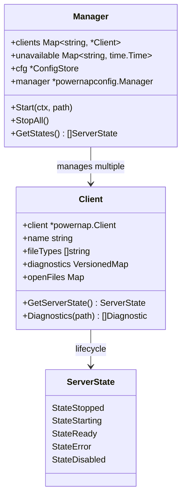
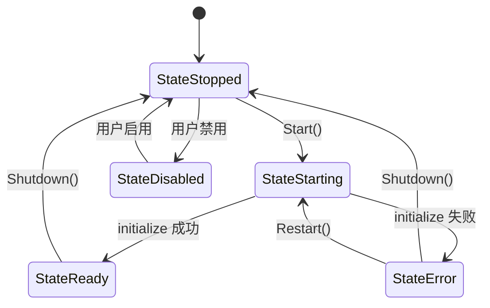

[上一篇：09-数据库与持久化](09-数据库与持久化.md) · [总目录](README.md) · [下一篇：11-MCP协议支持](11-MCP协议支持.md)

# LSP 集成

> **场景**：理解 Crush 如何通过 LSP（Language Server Protocol）集成代码语言服务器，实现诊断、定义跳转、引用查找、符号查询和重命名等功能，包括 Manager 的懒加载机制、Client 生命周期和自动启动策略。
> **时间**：2026-08-27 (CST)
> **版本**：Crush @ main branch, Go 1.26.6, github.com/charmbracelet/x/powernap

## 本文件内容

1. [架构概览](#1-架构概览)
2. [Manager：LSP 服务器管理](#2-managerlsp-服务器管理)
3. [Client：LSP 客户端](#3-clientlsp-客户端)
4. [自动启动策略](#4-自动启动策略)
5. [诊断系统](#5-诊断系统)
6. [LSP 工具组](#6-lsp-工具组)
7. [文件追踪与通知](#7-文件追踪与通知)
8. [服务器状态机](#8-服务器状态机)
9. [与 powernap 的集成](#9-与-powernap-的集成)

## 1. 架构概览

```
┌──────────────────────────────────────────────────┐
│ Agent 工具层                                      │
│ diagnostics / definition / references /          │
│ symbols / call_hierarchy / rename /              │
│ replace_symbol / lsp_restart                     │
├──────────────────────────────────────────────────┤
│ LSP Manager                                       │
│ - 懒加载：按文件类型启动 LSP 服务器                 │
│ - 自动发现：基于 root markers 和 PATH              │
│ - 用户配置覆盖：crush.json 中的 LSP 配置            │
├──────────────────────────────────────────────────┤
│ LSP Client (per server)                          │
│ - 生命周期管理（启动/停止/重启）                    │
│ - 文件打开/关闭追踪                                │
│ - 诊断缓存与通知                                   │
├──────────────────────────────────────────────────┤
│ powernap (github.com/charmbracelet/x/powernap)   │
│ - JSON-RPC 2.0 传输                                │
│ - LSP 协议实现                                     │
├──────────────────────────────────────────────────┤
│ Language Server 进程 (gopls, rust-analyzer, ...) │
└──────────────────────────────────────────────────┘
```



## 2. Manager：LSP 服务器管理

### 结构

```
internal/lsp/manager.go
Struct：Manager
字段：clients     → *csync.Map[string, *Client]
字段：unavailable → *csync.Map[string, time.Time]
字段：cfg         → *config.ConfigStore
字段：manager     → *powernapconfig.Manager
字段：callback    → func(name string, client *Client)
字段：now         → func() time.Time
字段：lookPath    → func(string) (string, error)
```

### NewManager

```
internal/lsp/manager.go
函数：NewManager
偏移：+0 ～ +35
```

执行步骤：

1. 创建 `powernapconfig.NewManager()` 并调用 `LoadDefaults()` — 加载内置的 LSP 服务器默认配置
2. 遍历用户配置的 `cfg.Config().LSP`：
   - 如果 `Disabled == true`：从 manager 中移除该服务器
   - 否则：解析服务器名，调用 `manager.AddServer` 添加/覆盖配置
3. 创建 `Manager` 实例，初始化所有字段

### powernap 默认配置

`powernapconfig.Manager.LoadDefaults()` 加载内置的 LSP 服务器配置——包括常见语言服务器（gopls、rust-analyzer、typescript-language-server 等）的命令、参数、文件类型和 root markers。用户配置可以覆盖或新增。

### Start

```
internal/lsp/manager.go
函数：Start
偏移：+0 ～ +16
```

```go
func (s *Manager) Start(ctx context.Context, path string) {
    if abs, err := filepath.Abs(path); err == nil {
        path = abs
    }
    if !fsext.HasPrefix(path, s.cfg.WorkingDir()) {
        return
    }
    var wg sync.WaitGroup
    for name, server := range s.manager.GetServers() {
        wg.Go(func() {
            s.startServer(name, path, server)
        })
    }
    wg.Wait()
}
```

关键设计：
- 路径必须在工作目录内——防止 LSP 处理项目外文件
- 并发启动所有匹配的服务器（`wg.Go` 使用 Go 1.26 的 `errgroup`/`sync.WaitGroup` 扩展）
- 等待所有启动尝试完成

### startServer

```
internal/lsp/manager.go
函数：startServer
偏移：+0 ～ +66
```

执行步骤：

1. 检查是否用户配置（`isUserConfigured`）和 `AutoLSP` 设置
2. 如果非用户配置且 `AutoLSP == false`：跳过
3. 检查是否已有运行的 client — 如果 Ready/Starting/Disabled，调用 callback 并返回
4. 文件类型匹配检查：
   - 用户配置：`handles(server, filepath, workingDir)` — 检查文件类型和 root markers
   - 自动启动：`canAutoStart(name, filepath, workingDir, server)` — 额外检查 PATH 和跳过列表
5. 创建 `Client`：`New(name, cfg, resolver, workingDir, debugLSP)`
6. 竞争检测：如果另一 goroutine 已创建同名的 Ready client，关闭新创建的并使用已有
7. 存入 `s.clients.Set(name, client)`
8. 调用 `s.callback(name, client)` — 通知 coordinator LSP 工具可用

### 不可用重试

```
Const：unavailableRetryDelay = 30 * time.Second
```

如果 LSP 服务器启动失败，记录到 `unavailable` map 并设置 30 秒冷却时间。在冷却期内不重试同一服务器，避免频繁失败导致日志刷屏。

## 3. Client：LSP 客户端

### 结构

```
internal/lsp/client.go
Struct：Client
字段：client    → *powernap.Client
字段：name      → string
字段：debug     → bool
字段：cwd       → string
字段：fileTypes → []string
字段：config    → config.LSPConfig
字段：ctx       → context.Context (long-lived)
字段：cancelCtx → context.CancelFunc
字段：resolver  → config.VariableResolver
字段：diagnostics → *csync.VersionedMap[...]
字段：openFiles → *csync.Map[string, *OpenFileInfo]
字段：serverState → atomic.Value
```

### New 构造

```
internal/lsp/client.go
函数：New
偏移：+0 ～ +28
```

关键设计：
- 使用 `context.WithCancel(context.Background())` 创建长生命周期 context — 独立于调用方 context，LSP 客户端需要跨多个请求存活
- 初始化 `serverState` 为 `StateStopped`
- 调用 `createPowernapClient()` 创建底层 powernap 客户端

### 长生命周期 Context

源码注释明确说明：调用方的 context 在工具调用完成后会被取消，但 LSP 客户端必须在多个请求和重启之间存活。因此使用 `context.Background()` 而非传入的 context。

## 4. 自动启动策略

### canAutoStart

```
internal/lsp/manager.go
函数：canAutoStart
```

自动启动需要满足以下条件：

1. **文件类型匹配**：`handles(server, filepath, workingDir)` 返回 true
2. **Root markers 存在**：工作目录中存在配置的 root marker 文件（如 `go.mod`、`package.json`）
3. **命令在 PATH 中**：`lookPath(server.Command)` 成功
4. **不在跳过列表中**：命令名不在 `skipAutoStartCommands` 中

### skipAutoStartCommands

```
internal/lsp/manager.go
Var：skipAutoStartCommands
偏移：+0 ～ +28
```

以下命令因为过于通用或有歧义而不自动启动：

`buck2`, `buf`, `cue`, `dart`, `deno`, `dotnet`, `dprint`, `gleam`, `java`, `julia`, `koka`, `node`, `npx`, `perl`, `plz`, `python`, `python3`, `R`, `racket`, `rome`, `rubocop`, `ruff`, `scarb`, `solc`, `stylua`, `swipl`, `tflint`

这些命令可能是语言运行时而非 LSP 服务器，需要用户显式配置。

### AutoLSP 配置

```
internal/config/config.go
Struct：Options
字段：AutoLSP → *bool
默认值：nil（视为 true）
```

- `nil` 或 `true`：自动启动 LSP 服务器
- `false`：仅启动用户显式配置的 LSP 服务器

## 5. 诊断系统

### DiagnosticCounts

```
internal/lsp/client.go
Struct：DiagnosticCounts
字段：Error       → int
字段：Warning     → int
字段：Information → int
字段：Hint        → int
```

### 诊断缓存

```
internal/lsp/client.go
字段：diagnostics → *csync.VersionedMap[protocol.DocumentURI, []protocol.Diagnostic]
字段：diagCountsCache → DiagnosticCounts
字段：diagCountsVersion → uint64
字段：diagCountsMu → sync.Mutex
```

`VersionedMap` 是带版本号的并发安全 map。每次诊断更新递增版本号。`diagCountsCache` 缓存按严重级别的计数，只在版本号变化时重新计算。

### 诊断变更通知

```
字段：onDiagnosticsChanged → func(name string, count int)
```

当 LSP 服务器推送新的诊断时，Client 调用此回调通知 UI 更新诊断显示。

## 6. LSP 工具组

```
internal/agent/coordinator.go
函数：buildTools
偏移：+58 ～ +72
```

当配置了 LSP 或 `AutoLSP` 启用时，添加以下工具：

| 工具名 | 构造函数 | LSP 方法 | 参数 |
|--------|----------|---------|------|
| `diagnostics` | `NewDiagnosticsTool` | textDocument/publishDiagnostics | FilePath |
| `references` | `NewReferencesTool` | textDocument/references | FilePath, Line, Column |
| `lsp_restart` | `NewLSPRestartTool` | — (重启服务器) | Name |
| `symbols` | `NewSymbolsTool` | textDocument/documentSymbol | FilePath |
| `definition` | `NewDefinitionTool` | textDocument/definition | FilePath, Line, Column |
| `call_hierarchy` | `NewCallHierarchyTool` | textDocument/prepareCallHierarchy | FilePath, Line, Column, Direction |
| `rename` | `NewRenameTool` | textDocument/rename | FilePath, Line, Column, NewName |
| `replace_symbol` | `NewReplaceSymbolTool` | textDocument/rename (执行) | FilePath, Line, Column, NewName |

### 工具执行流程

```
LLM 调用 definition 工具
  │
  ▼
definition tool Run()
  │
  ├── 从 context 获取 sessionID
  ├── 从 lspManager 获取对应语言的 Client
  │     │
  │     ├── Client 存在且 Ready?
  │     │   └── 否 → Manager.Start(ctx, filePath) 触发启动
  │     │
  │     └── Client Ready
  │
  ├── 打开文件（如果尚未打开）
  │     │
  │     └── Client.OpenFile(filePath) → textDocument/didOpen
  │
  ├── 调用 LSP 方法
  │     │
  │     └── Client.Definition(filePath, line, col) → textDocument/definition
  │
  └── 返回结果给 LLM
```

## 7. 文件追踪与通知

### OpenFileInfo

```
internal/lsp/client.go
字段：openFiles → *csync.Map[string, *OpenFileInfo]
```

Client 追踪所有已打开的文件。当 agent 工具（edit, write）修改文件时，通过 LSP 的 `textDocument/didChange` 或 `textDocument/didSave` 通知语言服务器。

### 文件打开流程

1. 工具调用 `Client.OpenFile(path)` 
2. 检查 `openFiles` — 如果已打开，返回
3. 读取文件内容
4. 发送 `textDocument/didOpen` LSP 通知
5. 在 `openFiles` 中记录

### 文件变更通知

当 edit/write/multiedit 工具修改文件后：
1. 调用 `Client.NotifyChange(path)` 
2. 发送 `textDocument/didChange` 或 `textDocument/didSave` 通知
3. LSP 服务器重新计算诊断
4. 诊断结果通过 `publishDiagnostics` 推送回 Client

## 8. 服务器状态机

```
internal/lsp/client.go
字段：serverState → atomic.Value
```

### 状态枚举

| 状态 | 说明 |
|------|------|
| `StateStopped` | 服务器未运行 |
| `StateStarting` | 服务器正在启动（initialize 请求中） |
| `StateReady` | 服务器已就绪，可以处理请求 |
| `StateError` | 服务器启动失败或运行中出错 |
| `StateDisabled` | 服务器被用户禁用 |



### GetServerState

使用 `atomic.Value` 存储，确保并发安全读取。状态转换在 Client 内部管理，外部只读。

## 9. 与 powernap 的集成

### powernap 库

```
依赖：github.com/charmbracelet/x/powernap
```

powernap 是 Charm 的 LSP 客户端库，提供：
- `powernap.Client` — LSP 客户端实现
- `powernapconfig.Manager` — 服务器配置管理
- `powernapconfig.ServerConfig` — 服务器配置结构
- `transport` — JSON-RPC 2.0 传输层
- `protocol` — LSP 协议类型定义

### createPowernapClient

```
internal/lsp/client.go
函数：createPowernapClient
```

创建 powernap 客户端实例：
1. 解析命令和参数中的变量（通过 `resolver`）
2. 创建 `transport.Stream` — stdin/stdout 管道
3. 创建 `powernap.Client` — 设置 LSP initialize 参数
4. 启动服务器进程
5. 发送 `initialize` 请求
6. 发送 `initialized` 通知
7. 状态转为 `StateReady`

### Shutdown

```
internal/lsp/client.go
函数：Shutdown
```

优雅关闭：
1. 发送 `shutdown` 请求
2. 发送 `exit` 通知
3. 等待进程退出
4. 取消 context
5. 状态转为 `StateStopped`

### StopAll

```
internal/lsp/manager.go
函数：StopAll
```

遍历所有 client，调用 `Shutdown()`。在 `app.Shutdown()` 中被调用，确保所有 LSP 服务器在应用退出时被正确关闭。

### callback 机制

```
函数：SetCallback
偏移：+0 ～ +2
```

Manager 的 `callback` 在 LSP 服务器启动成功时被调用。Coordinator 设置此回调，用于在 LSP 就绪时动态添加 LSP 工具或更新工具列表。

`TrackConfigured` 方法为用户配置的 LSP 服务器调用 `callback(name, nil)` — 通知 UI 有配置的 LSP 但尚未启动（nil client 表示未启动）。

---

[上一篇：09-数据库与持久化](09-数据库与持久化.md) · [总目录](README.md) · [下一篇：11-MCP协议支持](11-MCP协议支持.md)