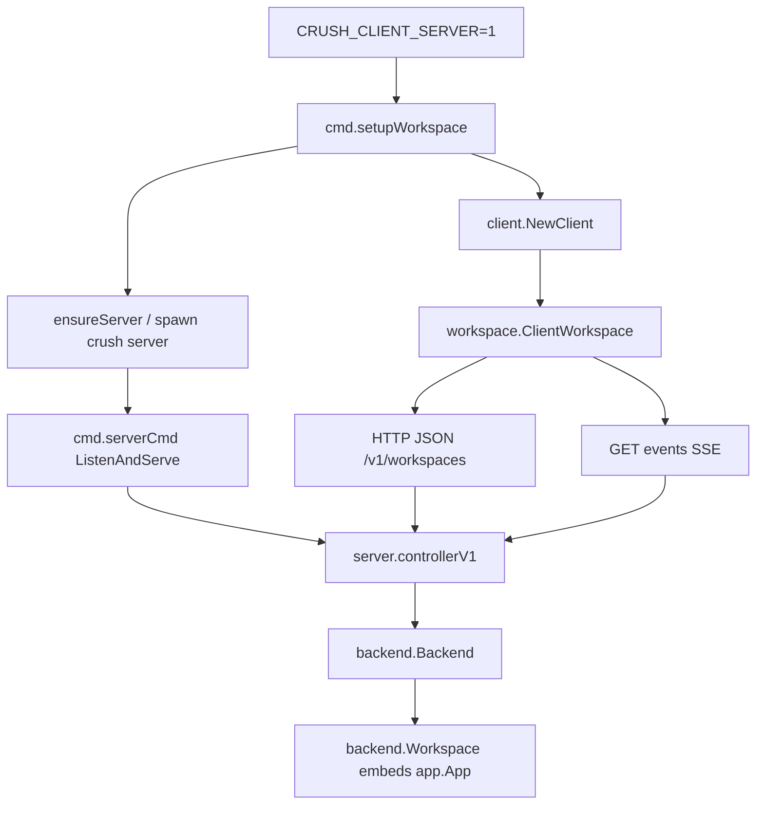
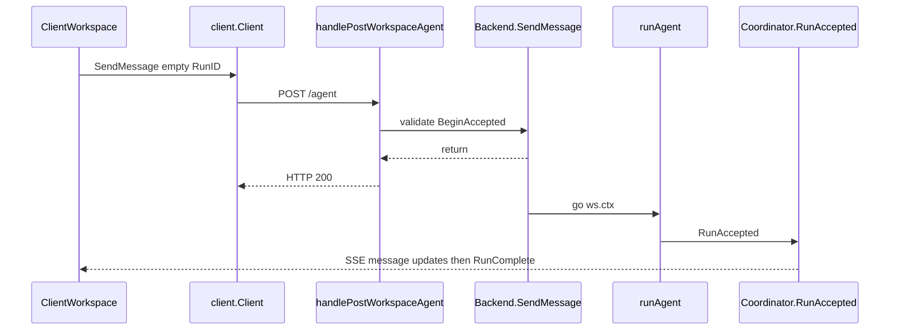
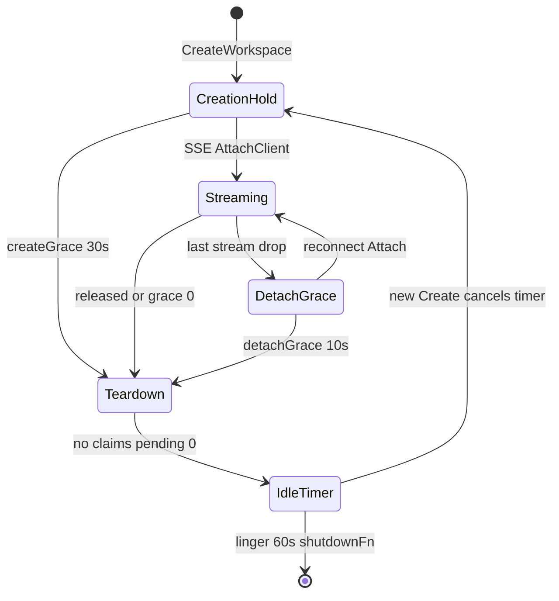

# 10. Workspace 与 Client/Server

> 状态：待复核生成稿
> 生成日期：2026-08-16
> 基准提交：`16dce459cafecee92eae0ed7c47a0c641c8bbb9f`
> 工作区：dirty（开始分析时已有文档草稿）
> 源码范围：`internal/workspace/`、`internal/backend/`、`internal/server/`、`internal/client/`、`internal/proto/`、`internal/cmd/root.go`、`internal/cmd/run.go`、`internal/cmd/server.go`
> 生成方式：源码、协议、生命周期与重连测试静态分析
> 所属层：第四层（补齐 Workspace 接口与跨进程契约）
> 前置阅读：[01-简单框架-系统骨架.md](01-简单框架-系统骨架.md)、[02-简单例子-全路径走读.md](02-简单例子-全路径走读.md)、[09-数据模型持久化与事件.md](09-数据模型持久化与事件.md)

## 快速摘要

### 架构总览（模块与依赖）

TUI 与 CLI 只依赖 `workspace.Workspace`。本地实现 `AppWorkspace` 直接包 `app.App`。`CRUSH_CLIENT_SERVER=1` 时，`setupClientServerWorkspace` 拿到 `ClientWorkspace`：HTTP/JSON 调 `client.Client`，SSE 收事件。对端是 `crush server` 进程里的 `server.Server`（Unix socket / Windows named pipe / 可选 TCP）和 `backend.Backend`。Backend 按规范化路径去重，持有多个嵌入 `app.App` 的 `backend.Workspace`。`internal/proto` 是跨进程 DTO，不是领域对象的 JSON 直出。

### 核心调用序列（逐步逻辑）

1. `cmd.useClientServer` 读 `CRUSH_CLIENT_SERVER`。假：`setupLocalWorkspace` → `app.New` → `NewAppWorkspace`。真：`ensureServer` 必要时 `startDetachedServer` 拉起 `crush server`。
2. `client.NewClient` 生成 UUID `clientID`；`CreateWorkspace` 带 path/yolo/channels/env。
3. `Backend.CreateWorkspace`：path 去重、config、带锁 DB、`app.New`、注册 creation hold。
4. TUI `Subscribe`：本地把 `app.Events` 送进 `tea.Program`；远程 `SubscribeEvents` SSE，断线退避重连，404 则 `recoverWorkspace`。
5. `AgentRun`：本地阻塞 `Coordinator.Run`；远程 `SendMessage` 立即返回，`runAgent` 绑在 workspace ctx 上，完成靠 `RunComplete`。

### 易错点与边界条件

- HTTP 请求 ctx 不能拥有 Agent Run。`SendMessage` 用 `ws.ctx`。
- 本地 `crush run` 等 `Coordinator.Run` 返回；远程 `crush run` 等匹配 `RunID` 的 `RunComplete`。
- SSE 断开期间的普通事件无法回放；`ConnectionRecovered` 表示已 resync，不是 TCP 连上。
- 三个 grace 不同：create 30s、detach 10s、idle shutdown 60s。
- `RetireClient` 的 retired set 永不修剪，用来拒绝迟到的 Create。
- 远程 `AgentRunShellCommand` 忽略 onProgress 与 isFirstMessage，无流式、无自动标题。
- Backend 多工作区 **不用** `skills.WithGlobalMirror`；Client 进程只有一个工作区，**用** GlobalMirror。

## 目录

1. [为什么这样设计（Why）](#1-为什么这样设计why)
2. [它是什么（What）](#2-它是什么what)
3. [代码如何实现（How）](#3-代码如何实现how)
4. [调用关系](#4-调用关系)
5. [测试证据](#5-测试证据)
6. [如何重新实现](#6-如何重新实现)
7. [阅读源码建议顺序](#7-阅读源码建议顺序)
8. [重新实现检查清单](#8-重新实现检查清单)

## 1. 为什么这样设计（Why）

默认单进程足够：一个项目、一个 TUI、一个 `app.App`。Client/Server 解决的是：多个 TUI 共享同一工作区、TUI 崩溃不杀掉正在跑的 Agent、以及把慢初始化（config/DB/MCP）留在常驻进程里。

Workspace 接口故意很大，不是为了插件实现，而是让 UI **零分支**。所有“这个操作在远程要走 HTTP、在本地要 FlushAll”的差异收口在两个适配器里。

Proto 层存在是因为领域类型带接口、`error`、未导出字段和与 fantasy 耦合的 ProviderOptions，不适合当稳定 wire contract。

## 2. 它是什么（What）

```text
CLI / TUI
  -> workspace.Workspace
       ├─ AppWorkspace  -> app.App（同进程）
       └─ ClientWorkspace -> client.Client
              HTTP+SSE (unix/npipe/tcp)
                 -> server.controllerV1
                      -> backend.Backend
                           backend.Workspace 嵌入 app.App
```

`CRUSH_CLIENT_SERVER` 只改变 CLI 装配，不改变 `app.App` 内部。`crush server` 子命令是显式常驻入口；交互/`crush run` 在环境变量打开时会 `ensureServer` 自动拉起分离进程。

## 3. 代码如何实现（How）

### 3.1 `CRUSH_CLIENT_SERVER` 从 cmd 接到这里

`internal/cmd/root.go`：

- `useClientServer()`：`strconv.ParseBool(os.Getenv("CRUSH_CLIENT_SERVER"))`。
- `setupWorkspace`：真则 `setupClientServerWorkspace`，否则 `setupLocalWorkspace`。
- 交互 `rootCmd.RunE` 走 `setupWorkspaceWithProgressBar`。
- `crush login` 同样走带进度条的 setup。
- **`crush run` 单独分支**（`internal/cmd/run.go`）：真则 `connectToServer` + `NewClientWorkspace` + `InitCoderAgentNonInteractive` + `runNonInteractive(ctx, c, ws, ...)`；假则 `setupLocalWorkspace` 断言 `*AppWorkspace` 后 `App.RunNonInteractive`。

本地装配（`setupLocalWorkspace`）：`config.Init` → 覆盖 yolo/channels → `MkdirAll 0o700` → 若不存在则写 `.gitignore` 内容 `*\n` → `db.Connect`（无目录锁）→ `skills.DiscoverFromConfig` + `WithGlobalMirror` → `app.New` → `NewAppWorkspace`。cleanup = `app.Shutdown`。

远程装配（`setupClientServerWorkspace`）：

1. `connectToServer`：`server.ParseHostURL(clientHost)`，默认 `unix://$XDG_RUNTIME_DIR/crush-<uid>.sock`（过长则 `/tmp`；Windows `npipe:////./pipe/crush-<uid>.sock`）。
2. `ensureServer`：unix/npipe 上 stat socket；活着则 `restartIfStale` 比版本；stale 则删文件；需要时 `spawnAndWaitReady`。
3. `spawnAndWaitReady` 对 `$XDG_CACHE_HOME/crush/server-<safeHost>/start.lock` 做 `lock.File` 单飞，避免并发客户端双拉起。
4. `startDetachedServer`：`exec.CommandContext(Background, exe, "server", ...)` + `detachProcess`（Unix Setsid / Windows DETACHED_PROCESS）+ `Process.Release`。子进程入口是 `internal/cmd/server.go`：`config.Load(GlobalWorkspaceDir)` → `server.NewServer` → `ListenAndServe`。
5. `client.NewClient(cwd, scheme, host)` 生成 `clientID`。
6. `createWorkspaceOnLiveServer`：最多 3 次，遇到 `ErrServerShuttingDown` 则 `replaceExitingServer`。
7. cleanup：`ClientWorkspace.Shutdown`（先停订阅再 `RetireClient`），**不用** `connectToServer` 里那个只 Retire 的闭包，避免退出被当成丢 workspace 而重建。

`crush server` 自己的 Backend 用 `context.Background()` 构造，idle 时 `shutdownFn` 调 `Server.Shutdown`。

### 3.2 `workspace.Workspace` 全部方法

文件：`internal/workspace/workspace.go`。错误：`ErrAgentNotInitialized`、`ErrServerUnreachable`、`ErrWorkspaceGone`、`ErrStreamClosed`。`ConnectionEvent` 只由 ClientWorkspace 发出。

| 分组 | 方法 | 本地委派 | 远程委派 |
|---|---|---|---|
| Sessions | `CreateSession` | `app.Sessions.Create` | `client.CreateSession` + `protoToSession` |
| | `GetSession` | `Sessions.Get` | `GetSession` |
| | `ListSessions` | `Sessions.List` | `ListSessions` |
| | `SaveSession` | `Sessions.Save` | `SaveSession` |
| | `DeleteSession` | `Sessions.Delete` | `DeleteSession` |
| | `CreateAgentToolSessionID` / `ParseAgentToolSessionID` | session.Service | **本地字符串** `messageID$$toolCallID`，不打 HTTP |
| | `SetCurrentSession` | `app.ReportCurrentSession`（herdr） | 缓存 `lastSession` + herdr + `POST .../current-session` |
| Messages | `ListMessages` | **先 `FlushAll`** 再 `Messages.List` | HTTP List（server 侧 FlushAll） |
| | `ListUserMessages` / `ListAllUserMessages` | 直接 List | HTTP |
| Agent | `AgentRun` | **同步** `Coordinator.Run`（调用方常自己起 goroutine） | `SendMessage`，RunID 空（TUI 不靠 correlator） |
| | `AgentRunShellCommand` | `shell.RunAndCaptureStream` 或 `RunAndPersist`；可 `GenerateTitle` | `RunShellCommand` HTTP；**忽略** progress 回调与 isFirstMessage |
| | `AgentCancel` | `Coordinator.Cancel` | `CancelAgentSession` |
| | `AgentIsBusy` / `IsSessionBusy` / `QueuedPrompts*` / `ClearQueue` | Coordinator | HTTP 或缓存；busy 每次 HTTP |
| | `AgentModel` / `GetDefaultSmallModel` | Coordinator | HTTP，失败返回零值 |
| | `AgentIsReady` | `Coordinator != nil` | 缓存/探测 |
| | `AgentReadyErr` | 未初始化 → `ErrAgentNotInitialized` | 连不上 → wrap `ErrServerUnreachable`；404 → `ErrWorkspaceGone` |
| | `AgentSummarize` / `UpdateAgentModel` / `InitCoderAgent*` | app | HTTP |
| Permissions | `Grant` / `GrantPersistent` / `Deny` | permission.Service，返回 bool | HTTP，false 不是错误 |
| | `SkipRequests` / `SetSkipRequests` | 本地 skip 原子 | 读缓存 / POST skip |
| Questions | `QuestionAnswer` / `QuestionCancel` | question.Service | HTTP |
| FileTracker | `RecordRead` / `LastReadTime` / `ListReadFiles` | filetracker | HTTP |
| History | `ListSessionHistory` | `History.ListBySession` | HTTP |
| LSP | `Start` / `StopAll` / `GetStates` / `GetDiagnosticCounts` | `app.LSPManager` + 包级 `GetLSPStates` | HTTP；states 转 `LSPClientInfo` |
| Config 读 | `Config` / `WorkingDir` / `Resolver` | ConfigStore | **缓存的 proto.Workspace.Config** |
| Config 写 | `UpdatePreferredModel` / `SetCompactMode` / `SetProviderAPIKey` / `SetConfigField` / `RemoveConfigField` / `ImportCopilot` / `RefreshOAuthToken` | ConfigStore；SetAPIKey 后 `SignalAuthComplete` | HTTP 后 `refreshWorkspace` |
| Project | `ProjectNeedsInitialization` / `MarkProjectInitialized` / `InitializePrompt` | config/agent 包函数 | HTTP |
| Skills | `ListSkills` / `ReadSkill` | `app.Skills` Catalog | HTTP；Client 另持 process-local Manager |
| MCP | `GetStates` / Refresh* / ReadResource / Prompts / Docker / Auth* | `mcptools.*` 包级状态 | HTTP；`GetStates` 读缓存，SSE 更新 |
| Events | `Subscribe` | `app.Subscribe` | `runSubscription` |
| | `Shutdown` | `app.Shutdown` | 取消 subCtx → 等 loop → herdr.Close → RetireClient |

### 3.3 AppWorkspace 非一行委派的例外

- `ListMessages`：FlushAll，避免切 session 读到过期 parts。
- `AgentRun`：Coordinator 未初始化则 error。**不**在适配器内起 goroutine；TUI 提交路径自己异步。
- `AgentRunShellCommand`：有 `onProgress` 走流式再 persist；无则 `RunAndPersist`。`isFirstMessage` 时 `GenerateTitle(WithoutCancel, "$ "+command)`。
- `SetCurrentSession`：只报 herdr，本地无多客户端 presence。
- `LSPGetStates`：`app.GetLSPStates()` 全局 map 转前端类型。
- `EnableDockerMCP`：Prepare → InitializeSingle → Persist；失败回滚 Disable + RemoveDockerMCPInMemory。
- `Subscribe`：`app.Subscribe(program)`。

### 3.4 ClientWorkspace：缓存、SSE、重连

结构：`client`、`mu`+`ws` 快照、`skills.Manager`、`lastSession`、`subCtx`/`subCancel`、`subStarted`/`subDone`、`herdrClient`。

`NewClientWorkspace`：`Config.SetupAgents()`；Skills 快照 `WithGlobalMirror`；`subCtx = WithCancel(Background)`；`herdr.Init()`。

读路径两类：

- 强一致 HTTP：ListSessions/Messages、Grant、SendMessage。
- 展示缓存：`Config()`、MCP/LSP states、skip、skills。SSE `ConfigChanged` 触发 `refreshWorkspace`（`GetWorkspace` 换快照）。

`runSubscription`：

1. `SubscribeEvents(subCtx, workspaceID)`。
2. 失败非 404：`ConnectionDegraded`，backoff 250ms→10s。
3. 404：`recoverWorkspace`：`CreateWorkspace(WithoutCancel(subCtx), 30s timeout, recreateArgs 无 ID)`；path 去重可能加入已有 workspace 或新 ID；配置好则 `InitCoderAgent`。
4. 连续失败 20 次：`Stuck=true` 仍继续重试。
5. 流建立且曾 degraded：`afterReconnect` 重申 `SetCurrentSession`，发 `ConnectionRecovered`。
6. `consumeEvents`：`herdr.Translate` 后 `HandleEvent`；ConfigChanged 刷新；其余 `translateEvent` 成 TUI 领域类型。
7. channel 关闭：当 `ErrStreamClosed`，resync 假设事件已丢。

`Shutdown`：`subCancel` → `awaitSubscription`（最多 5s）→ herdr.Close → `RetireClient`；旧服务器 404 则 fallback `DeleteWorkspace`。恢复 Create 故意脱离 subCtx，避免取消时服务器已登记但客户端不知道 ID；Retire 覆盖该窗口。

`workspaceID()` 每次读缓存，闭包不得长期保存旧 ID。

### 3.5 Proto 契约

`internal/proto/proto.go`、`requests.go`、`message.go`、`session.go`、`agent.go`、`permission.go` 等。

关键 DTO：

- `Workspace`：ID、Path、YOLO、Debug、DataDir、Version、ClientID、Config、Env、Channels、Skills 快照。
- `AgentMessage`：SessionID、**RunID**、Prompt、Attachments。RunID 经 `agent.WithRunID` 传到 turn，排队后仍保留。空 RunID 只能按 SessionID 等完成，忙会话会等错 turn。
- `RunComplete`：SessionID、RunID、MessageID、Text、Error、Cancelled。权威终态。
- `CurrentSession`：空 SessionID 表示落地页。
- `ConfigProviderKeyRequest`：`Kind` = `string` | `oauth`，避免 JSON `any` 丢类型。
- Message parts：与领域相同的 tagged union；`MarshalParts`/`UnmarshalParts`。ClientWorkspace `protoToMessage` 再转 `message.ContentPart`。

SSE 外层 `pubsub.Payload{Type, Payload}`，`server.wrapEvent` 把 `tea.Msg`（实为 `pubsub.Event[T]`）转 proto。无法表示的 MCP channel message 直接丢，不伪装成 state_changed。

### 3.6 Server：传输、路由、SSE

`internal/server/server.go`：`http.ServeMux` 方法+路径（Go 1.22）。HTTP/1 + 未加密 HTTP/2。生产 listener：`net_other.go` unix（自愈 stale socket）、`net_windows.go` named pipe。TCP 仅高级 `--host tcp://...`。

路由按资源（完整列表见 `installHandler`）：

- 控制：`GET /v1/health|version|config`，`POST /v1/control`，`DELETE /v1/clients/{client_id}`
- 工作区：`GET/POST /v1/workspaces`，`GET/DELETE /v1/workspaces/{id}`，`GET .../events`，`POST .../current-session`，`GET .../config|providers`
- 会话与消息：sessions CRUD、`.../history`、`.../messages`、`.../messages/user`、`.../messages/user`（全局）
- FileTracker / LSP / permissions / questions
- Agent：`GET/POST .../agent`，`.../init|update`，session cancel/queue/summarize/shell，`default-small-model`
- Config mutations / OAuth / project / skills / MCP / docker
- `/v1/docs/` swagger

Handler 标准路径：path/query/body → Backend → `handleError` 映射 `ErrWorkspaceNotFound`→404、`ErrServerShuttingDown`→503、校验错误→400。

`handleGetWorkspaceEvents`：

1. **先** `SubscribeEvents` **再** `AttachClient`（避免“已 attached 但尚未订阅”丢事件）。
2. `Content-Type: text/event-stream`，立刻 200+Flush，让客户端 RoundTrip 结束。
3. 循环 `wrapEvent` 写成 `data: {json}\n\n`。
4. defer `DetachClient`。

`handlePostWorkspaceAgent` → `Backend.SendMessage`，HTTP 在接受后返回，不等 LLM。

### 3.7 Backend：多工作区业务

`internal/backend/backend.go` 锁顺序：**先 `Backend.mu`，再 `Workspace.clientsMu`**。Detach 不得持 clientsMu 再调需要 Backend.mu 的 teardown。

字段：`workspaces csync.Map`、`pathIndex`、`pending`、`shutdownTimer`、`closing`、`retired`、createGrace 30s、lingerDelay 60s（`CRUSH_SERVER_IDLE_TIMEOUT` 秒，0=立刻）、detachGrace 10s（`CRUSH_SERVER_DETACH_GRACE`）。

`backend.Workspace` 嵌入 `*app.App`，另有 ID/Path/Cfg/Env/Skills、`resolvedPath`、`ctx/cancel`、`runMu/closing/runWG`、`clients`。

`CreateWorkspace`：

1. path 非空；`validateClientID` UUID。
2. `resolveWorkspaceKey` = Abs + EvalSymlinks。
3. `admitLocked`：closing → `ErrServerShuttingDown`；retired → `ErrClientRetired`。
4. 取消 idle shutdown。
5. pathIndex 命中：channels 必须相等否则 `ErrChannelOptInMismatch`；YOLO/debug 等 first-wins（只 log）；`registerClient` 返回已有。
6. 否则 `pending++`，放锁，慢初始化：`config.Init`、YOLO/channels override、`createDotCrushDir`（0o700 + gitignore `*`）、`db.Connect(WithDataDirLock(true))`、skills **无** GlobalMirror、`app.New`、`WithCancel(backend.ctx)`。
7. 再拿锁：client 可能已 retire → shutdown 新 App 并拒绝；并发 winner 已占 path → 关掉 loser App，register 到 winner。
8. 登记 map/index/hold。版本不同发 Warn 事件。
9. defer `pending--`，若空闲则 arm idle timer。

`registerClient`：新 claim 用 `createGrace` timer；重复 Create 且仍在 timer-held 则换新 timer（旧 timer 的 identity 对不上 `expireHold`）。SSE attach 停 timer、`streams++`。最后一路 stream 且未 `released`：detachGrace；clean release（`released=true` 或 grace=0）立刻移除。claims 空 → `teardown`：从 index 删、`Workspace.Shutdown`、若无 workspace 且 pending=0 则 idle shutdown。

`Workspace.Shutdown`：`runMu.closing=true` → `cancel()` workspace ctx → `Coordinator.CancelAll` → `runWG.Wait` → `app.Shutdown`。保证 Agent 写完 DB 再关连接。

`SendMessage`（`backend/agent.go`）：ValidateCall → `BeginAccepted` → 若 closing 则 Close accept 返回 `ErrWorkspaceClosing` → `runWG.Add` → `go runAgent`。`runAgent` 用 `ws.ctx` + 可选 `WithRunID` + `WithRunCompleteMarker`；`RunAccepted`；非 cancel 错误发 lossy AgentError；若有 RunID 且 coordinator 未发终态，则 `PublishMustDeliver` 补一条 errored RunComplete。

其余 Backend 文件：`session.go`（ListMessages FlushAll）、`permission.go`、`question.go`、`filetracker.go`、`events.go`（`ws.Events`）、`config.go`（写后 `publishConfigChanged` + 异步 `mcptools.Reinitialize(ws.ctx)`）。

### 3.8 Client SDK：dial、错误、重连边界

`internal/client/client.go`：`http.Client` Timeout=0（SSE 与慢 Create 不能有全局超时）；unix/npipe `DisableCompression`；`DialContext` 30s。DummyHost `api.crush.localhost` 只为满足 URL。路径一律 `/v1/...`。

错误（`errors.go`，`errors.Is`）：

| sentinel | HTTP | 调用方动作 |
|---|---|---|
| `ErrNotFound` | 404 | 换 ID / re-register，不要重试同一 workspace ID |
| `ErrServerShuttingDown` | 503 | 换新 server 再 Create |
| `ErrServerBusy` | 409 on shutdown-if-idle | 不要杀掉别人的会话 |
| `ErrUnsupported` | 400 未知 command 或 404 retire | 走旧协议 fallback |

`SubscribeEvents` 读 SSE；流结束由 ClientWorkspace 重连，Client 本身不重试。

## 4. 调用关系

### 4.1 环境变量打开后的进程切分

| 调用方文件与符号 | 关系 | 被调用方文件与符号 | 触发与输入 | 返回与后续处理 | 错误、状态与副作用 |
|---|---|---|---|---|---|
| `cmd/root.go:setupWorkspace` | 分支 | `setupClientServerWorkspace` | `CRUSH_CLIENT_SERVER` 真 | ClientWorkspace | 假则本地 AppWorkspace |
| `ensureServer` | 调用 | `spawnAndWaitReady` → `startDetachedServer` | socket 不存在或 stale | 子进程 `crush server` | start.lock 单飞 |
| `cmd/server.go:serverCmd.RunE` | 调用 | `server.NewServer` + `ListenAndServe` | host URL | Backend+mux | SIGINT → Shutdown |
| `connectToServer` | 调用 | `client.CreateWorkspace` | proto.Workspace+ClientID | 快照含 Config | 503 则 replace server，最多 3 次 |
| `NewClientWorkspace` | 包装 | Client + 快照 | — | Subscribe 后才有事件 | herdr.Init |

### 4.2 一次远程 AgentRun

| 调用方文件与符号 | 关系 | 被调用方文件与符号 | 触发与输入 | 返回与后续处理 | 错误、状态与副作用 |
|---|---|---|---|---|---|
| `ClientWorkspace.AgentRun` | HTTP | `client.SendMessage` | session、prompt、空 RunID | 立即返回 | TUI 靠 message 事件 |
| `cmd.runNonInteractive`（CS 模式） | HTTP | `SendMessage` **带 RunID** | 同上 | 阻塞等 SSE RunComplete | 用错 SessionID 会提前退出 |
| `controllerV1.handlePostWorkspaceAgent` | 调用 | `Backend.SendMessage` | proto.AgentMessage | 不 wait | 校验失败同步 4xx |
| `Backend.SendMessage` | 启动 | `runAgent` goroutine | `BeginAccepted` + runWG | workspace ctx | closing 则 ErrWorkspaceClosing |
| `runAgent` | 调用 | `Coordinator.RunAccepted` | accept handle | 成功/取消直接 return | 早期错误补 must-deliver RunComplete |
| `handleGetWorkspaceEvents` | 订阅 | `wrapEvent` | app.events | SSE data 行 | 先 subscribe 再 attach |







## 5. 测试证据

| 测试 | 钉住的契约 |
|---|---|
| `server/e2e_agent_test.go` | 真 HTTP+SSE 跑 Agent 路径 |
| `backend/accepted_run_integration_test.go` | accepted 窗口与 Cancel 高水位 |
| `backend/agent_runcomplete_test.go` | 早期失败补 RunComplete |
| `workspace/multiclient_integration_test.go`、`server/multiclient_test.go` | 多 Client 同 workspace |
| `workspace/client_workspace_test.go` | 断流重连、404 重建、Stuck、Shutdown 等 in-flight recover、Retire vs 旧服务器 Delete |
| `server/socket_test.go`、`socket_classify.go` | stale unix socket |
| `server/events_test.go` | wrapEvent 往返；MCP channel 不伪装 |
| `server/recover_test.go`、`agent_cancel_test.go`、`sessions_isbusy_test.go` | 恢复、取消、busy |
| `backend/backend_test.go` | first-wins YOLO；channels mismatch |
| `backend/backend_skills_test.go` | 多工作区 skills 隔离 |
| `cmd/restart_stale_test.go` | 版本不匹配重启；Create 遇 shutting down 重试 |
| `cmd/clientserverrace/race_test.go` | socket-init 竞态 |

未覆盖风险：TCP 传输少测；远程 shell 无流式/无标题是实现差异。本轮未跑测试。

## 6. 如何重新实现

必须保持：

1. UI 只依赖 Workspace 接口。
2. 远程 SendMessage 立即返回，Run 绑 workspace ctx。
3. 有 RunID 的调用必须恰好一条终态 RunComplete（含早期失败补发）。
4. Create 按 symlink-resolved 路径去重；channels 不一致拒绝；YOLO first-wins。
5. 先订阅再 Attach；断线假设丢事件并 resync。
6. RetireClient 拒绝迟到 Create。
7. Proto 与领域转换显式，不直序列化内部结构体。

可替换：HTTP 换成其他 RPC；unix 换成 TCP（已支持但非默认）；grace 时长环境变量。

## 7. 阅读源码建议顺序

1. `workspace/workspace.go` 接口与错误。
2. `cmd/root.go`：`useClientServer`、`setupLocalWorkspace`、`setupClientServerWorkspace`、`ensureServer`、`startDetachedServer`。
3. `cmd/run.go` 本地 vs 远程退出条件。
4. `cmd/server.go`。
5. `workspace/app_workspace.go` 对照表。
6. `workspace/client_workspace.go`：`AgentRun`、`runSubscription`、`recoverWorkspace`、`Shutdown`。
7. `backend/backend.go` CreateWorkspace + claim 状态机。
8. `backend/agent.go` SendMessage/runAgent。
9. `server/server.go` 路由；`server/proto.go` SSE。
10. `client/client.go` + `errors.go` + `proto.go` Create/Subscribe。
11. `proto/proto.go` AgentMessage/RunComplete。
12. 上表测试当规范。

## 8. 重新实现检查清单

- [ ] `CRUSH_CLIENT_SERVER` 真假两条装配，UI 无模式分支。
- [ ] 自动拉起 `crush server`、stale socket 删除、start.lock 单飞、版本 mismatch 重启。
- [ ] Client UUID 每进程一个；Create 带 ClientID。
- [ ] path Abs+EvalSymlinks 去重；pending 阻止空闲误关。
- [ ] Server Connect 带 data-dir lock；无 GlobalMirror。
- [ ] SendMessage 不绑定 HTTP ctx；runWG + accepted 覆盖 Cancel。
- [ ] ListMessages 两侧都 FlushAll。
- [ ] SSE 先 subscribe 再 attach，立刻 Flush headers。
- [ ] 404 → re-create；普通断流 → ConnectionRecovered+resync。
- [ ] Shutdown 先停订阅再 Retire；丢失 Create 响应仍被 Retire 覆盖。
- [ ] `crush run` 远程必须带 RunID 等 RunComplete。
- [ ] Permission/Question 多客户端：bool 表示谁赢，通知广播。
- [ ] Proto APIKey Kind 显式；Message parts tagged union。
- [ ] Agent-tool session ID 远程也只做字符串，不打 RPC。
