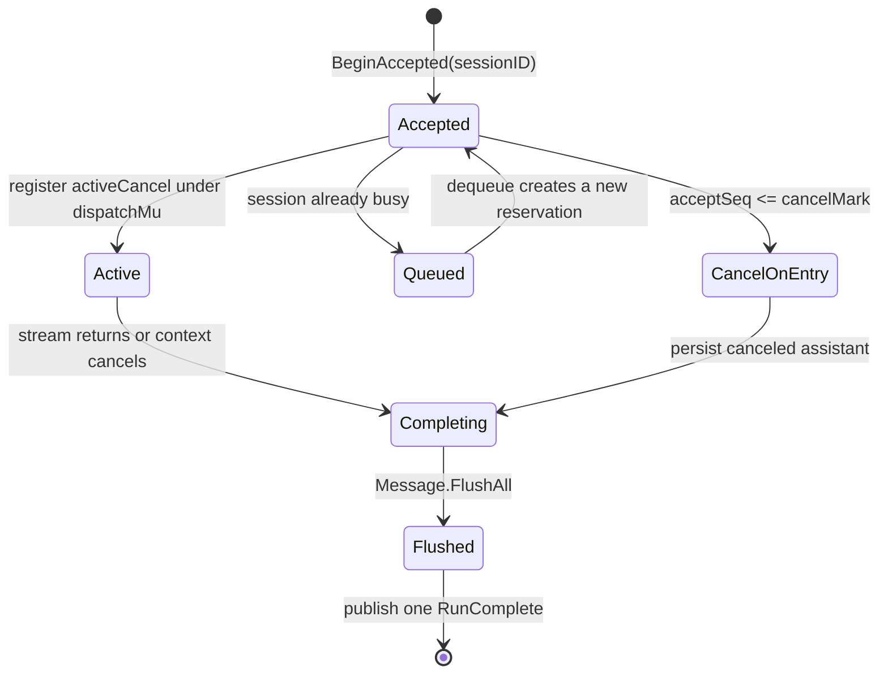

# 10. 并发、生命周期与可靠性专题

> 状态：待复核生成稿｜生成日期：2026-08-14
> 基准提交：`5712d4839a6a10e9940804d511bb322dbe73a511`｜工作区：clean（开始分析时）
> 源码范围：Agent、App、Backend、Broker、DB、Permission、Question、LSP、MCP、UI
> 生成方式：实现与竞态、取消、关闭测试交叉分析

## 快速摘要

### 架构总览（模块与依赖）
Context 树负责取消，锁保护 session dispatch、Backend map 和 registry，Broker 分普通与可靠投递，cleanup 反向释放 Agent、外部进程与数据库引用。

### 核心调用序列（逐步逻辑）
1. 根 context 派生 Workspace/Run context。2. Run 在 dispatch lock 下选状态。3. 副作用通过 Service/Broker 协调。4. completion flush。5. Close 取消并等待资源退出。

### 易错点与边界条件
accepted、queued、active 必须分别处理；Backend 锁顺序固定；普通 Broker 可丢；Cmd 不能直接修改 UI 状态；关闭不得等待自身持有的锁。

## 1. 为什么单独成章

Crush 的多数复杂度不是算法，而是“多个 goroutine、多个 Client、多个 Session、外部进程和数据库关闭同时发生时仍然正确”。若只按包阅读，会错过跨包不变量。

## 2. Context 层级

建议画成树：

```text
进程 Context
├── Backend Context
│   ├── Workspace A Context
│   │   ├── Agent Run Context
│   │   ├── MCP session Context
│   │   └── LSP long-lived Context（逻辑上独立但由关闭显式终止）
│   └── Workspace B Context
└── 本地 App Context
    ├── Agent Run
    ├── MCP
    └── Events subscription
```

短请求 Context 不得拥有长资源：HTTP 请求结束不能杀掉 Agent Run，单次 LSP tool 结束不能杀掉语言服务器。反过来，Workspace 关闭必须能显式取消这些长资源。

## 3. App 关闭顺序

App cleanup 包括：

- 停止新事件/取消 fan-in；
- Coordinator.CancelAll；
- BackgroundShellManager.KillAll；
- LSP KillAll/StopAll；
- MCP Close；
- Skills Manager/Broker shutdown；
- DB Release；
- 等待 TUI/service goroutine。

Backend Workspace 在调用 App.Shutdown 前先阻止新 Run、取消 Workspace Context、等待 runWG。核心原则是生产者先停，消费者/存储后关。

## 4. Agent 的三种“尚未完成”状态

对一个 Session，提交可能处于：

1. **accepted**：Backend 已接受并启动 goroutine，但尚未进入 SessionAgent dispatch；
2. **queued**：Session 已 busy，调用已进入 messageQueue；
3. **active**：有 active cancel function，正在访问 DB/Provider/Tools。

只保存 active cancel 会遗漏 accepted 窗口。AcceptedRun counter、accept sequence 和 cancel high-water mark 使 Cancel 能覆盖取消发生前已接受但未注册的 Run，同时不毒害取消后新提交的 Run。



## 5. Per-session dispatch mutex

每个 Session 有独立 mutex，保护 accepted → cancel-on-entry/queued/active 的短转换。锁内不能做 DB 或 LLM IO，否则一个慢请求会阻塞取消和排队判断。

mutex 本身的 lazy creation 还需要全局小锁，防止两个 goroutine 为同一 key 创建两个不同 mutex，造成“看似加锁其实未互斥”。

## 6. RunComplete 的 exactly-once 意图

Message Finish 不足以作为顶层 Run 完成：一个 Agent turn 可能有多条 assistant/tool 消息，且消息事件是可丢的。RunComplete 在所有消息更新 flush 后发布，带 SessionID、RunID、取消/错误等最终信息。

OAuth 401 重试会产生多个内部 attempt。Coordinator 用 OnComplete 收集最新结果，只对外发布最终 attempt。Backend 用 Context marker 判断是否已经发布，在早期失败时补发。目标是对每个带 RunID 的顶层调用产生一个可依赖的终止信号。

## 7. Broker 的可靠等级

普通 `Publish` 适合可恢复展示状态：慢订阅者满时丢弃，并累积 drop count。`PublishMustDeliver` 适合：

- Permission request；
- Question request；
- RunComplete。

即便 must-deliver 也受 Context/timeout 限制，不能用无限阻塞把整个 Agent 卡死。监控应区分普通 drop 与 must-deliver drop。

## 8. 多客户端 Permission/Question 竞争

多个 TUI 可能同时显示同一 Permission。Grant/Deny 返回 bool 表示谁赢得 resolve；后到者 false 不是服务错误。所有观察者最终通过 Notification 收到解决结果并关闭 modal。

实现要保证 pending entry 只被一次删除/resolve，onResolve 只执行一次，迟到请求不能覆盖已完成决定。

## 9. Config 并发与多进程

ConfigStore 同时面对：

- 同进程多个 goroutine；
- Client/Server 多 Client；
- 可能多个 Crush 进程写同一配置；
- OAuth refresh 与用户手动修改；
- 外部编辑器直接改文件。

因此需要进程内 mutex、文件锁、原子临时文件 + rename、磁盘 snapshot/staleness、provider 级 refresh lock、reload 后重建派生配置。直接写 JSON 会绕过这些保障。

## 10. DB 连接引用与事务

DB 按 data directory 复用连接并计数，最后一个 Release 才 Close。跨多表或“读后写”操作使用事务；Service 事件应在持久化成功后发布，不能让 UI 看见数据库中不存在的状态。

Shutdown 先等待 Agent 是因为 streaming Agent 可能持续保存 Message parts 和 usage。

## 11. Backend 锁顺序

同时需要时：

```text
Backend.mu -> Workspace.clientsMu
```

Detach 路径不应持 clientsMu 再调用获取 Backend.mu 的 teardown。正确做法是短暂更新 clientState、释放 clientsMu，再在 Backend 层复查并 teardown。

`pending` 防止慢 Create 期间 Backend 看似无 Workspace 而退出；`closing` 把 shutdown 决策锁存，使之后 Create 必须拒绝。

## 12. ClientWorkspace 的“事件可能永久丢失”假设

SSE 断开期间发布的普通事件无法回放。因此重连成功不只是重新打开流，还必须全量刷新缓存。ConnectionRecovered 表示“流恢复且已执行必要 resync”，而非 TCP 连上就算恢复。

Workspace 被 Server 回收时，Client 重新 Create，可能得到新 ID；所有之后请求必须读取原子快照中的新 ID，不能缓存旧 ID 到长期闭包。

## 13. LSP 生命周期

LSP 初始化用独立 Context，避免调用者取消；但 App Shutdown 必须显式 Close/Kill。Close 给 JSON-RPC shutdown 有上限，防止 send lock 卡住。Restart 会替换长期 Context，保留 open files 并重建状态。

Diagnostics map 使用 version 驱动缓存，减少并发 Copy 和 UI 热路径开销。

## 14. MCP generation 与 single-flight

同一 MCP server 可能同时发生初始连接、配置 reload、lazy renew、disable 和 shutdown。Generation 是“这次异步结果是否仍属于当前世代”的凭证。过期 goroutine即使成功，也不能覆盖新 session。

renew 使用 server 级 mutex；Reinitialize 使用全局 running/dirty single-flight。二者分别防止同 server 重连风暴和配置写入风暴。

## 15. Shell/Hook goroutine

外部命令必须杀进程组而非单进程。Builtin 必须检查 Context。Hook 在超时后可放弃不合作 goroutine，因此放弃路径禁止读取其仍可能写入的 buffer。

BackgroundShell buffer 与结果字段必须同步；done channel 是 publish barrier。

## 16. UI 并发规则

Bubble Tea 模型状态只在顶层 Update goroutine修改。`tea.Cmd` 做 IO 后返回 Msg，不能在闭包中捕获指针直接改 UI。Workspace 订阅 goroutine只调用 `program.Send`。

渲染缓存若由事件更新、View 读取，也应保证两者在 Bubble Tea loop 内串行，或由组件显式同步；不要随意从 Agent goroutine触碰 chat item。

## 17. 常见竞态场景检查表

实现新功能时主动模拟：

1. 提交提示后立刻取消；
2. busy Session 连续提交三次再清队列；
3. Agent 执行中关闭 Workspace；
4. 两 Client 同时创建相同路径；
5. SSE 断开后 Server 回收 Workspace；
6. Client 退出时 Create 响应丢失；
7. OAuth 刷新时另一进程已写新 token；
8. MCP 正连接时配置被连续修改；
9. LSP shutdown 不响应；
10. Hook builtin 不响应 Context；
11. Permission 被两个窗口同时点击；
12. Message 事件 channel 满时 Run 仍必须结束。

## 18. 测试方法

- 用 channel 精确控制 goroutine 到达某阶段，而不是 `time.Sleep` 猜时序；
- 用短可配置 grace/timeout 测状态机；
- race-sensitive 测试运行 `go test -race`；
- 用 fake clock/lookPath/runShell 隔离时间和进程；
- 断言最终状态和“没有重复事件/没有泄漏”；
- 使用 goleak 或 WaitGroup 证明后台 goroutine退出；
- 对 Context 取消同时断言错误类型与资源清理。

## 19. 可靠性复刻顺序

先实现同步正确性，再逐层添加：

1. 单 Session 串行；
2. Context 取消；
3. 队列；
4. accepted 窗口；
5. reliable completion；
6. 多 Client；
7. 重连/resync；
8. 配置热重载；
9. 外部进程组清理；
10. 性能缓存和 drop metrics。
