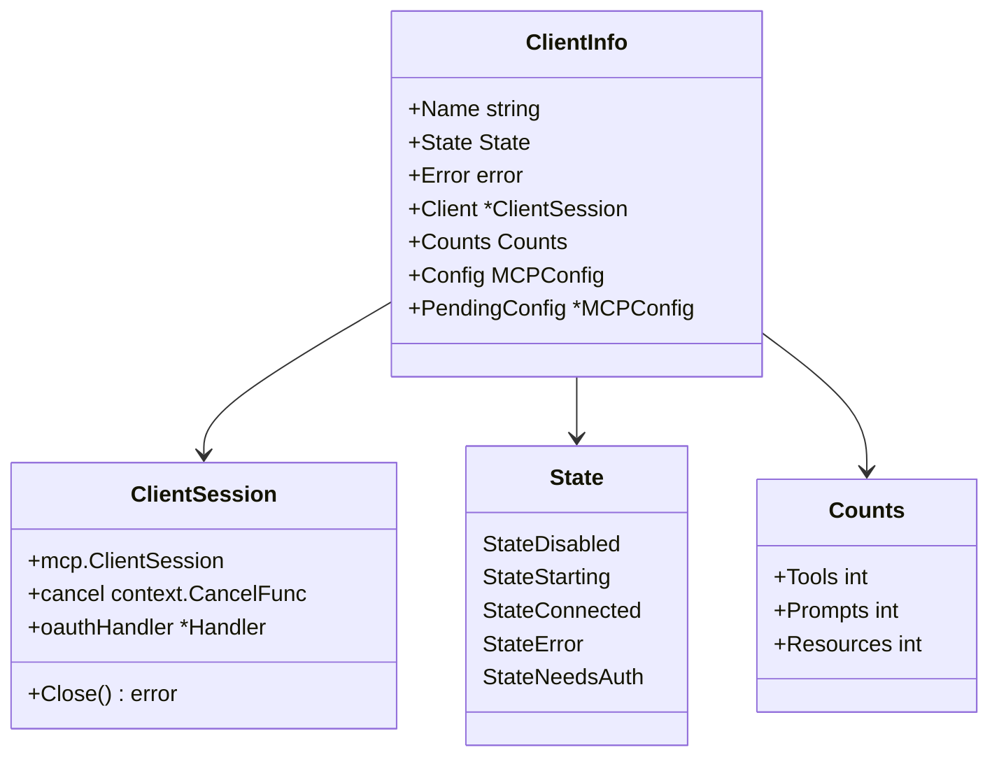

[上一篇：10-LSP集成](10-LSP集成.md) · [总目录](README.md) · [下一篇：12-Shell执行引擎](12-Shell执行引擎.md)

# MCP 协议支持

> **场景**：理解 Crush 如何通过 MCP（Model Context Protocol）集成外部工具服务器，包括 stdio/http/sse 三种传输模式、OAuth 认证流程、工具/提示/资源的发现与调用、配置热重载的协调机制、Channel 通知机制以及会话生命周期管理。
> **时间**：2026-08-27 (CST)
> **版本**：Crush @ main branch, Go 1.26.6, github.com/modelcontextprotocol/go-sdk/mcp

## 本文件内容

1. [架构概览](#1-架构概览)
2. [全局状态与并发控制](#2-全局状态与并发控制)
3. [初始化流程](#3-初始化流程)
4. [传输层创建](#4-传输层创建)
5. [会话创建与连接](#5-会话创建与连接)
6. [工具发现与调用](#6-工具发现与调用)
7. [Prompts 与 Resources](#7-prompts-与-resources)
8. [OAuth 认证](#8-oauth-认证)
9. [配置热重载与协调](#9-配置热重载与协调)
10. [Channel 通知机制](#10-channel-通知机制)
11. [会话续期与错误恢复](#11-会话续期与错误恢复)
12. [进程组管理](#12-进程组管理)

## 1. 架构概览

```
┌──────────────────────────────────────────────────────┐
│ Agent 工具层                                          │
│ GetMCPTools() → []*Tool (mcp-tools.go)              │
├──────────────────────────────────────────────────────┤
│ MCP 包 (internal/agent/tools/mcp/)                   │
│ init.go    — Initialize / Reinitialize / 状态管理     │
│ lifecycle.go — reconcile / teardown / generation     │
│ tools.go   — RunTool / filterTools / RefreshTools    │
│ prompts.go — GetPromptMessages / RefreshPrompts      │
│ resources.go — ReadResource / ListResources          │
│ channel.go — Channel 通知拦截与渲染                    │
├──────────────────────────────────────────────────────┤
│ MCP Go SDK (modelcontextprotocol/go-sdk)             │
│ mcp.Client / mcp.ClientSession / mcp.Transport       │
├──────────────────────────────────────────────────────┤
│ 传输层                                                │
│ stdio (CommandTransport)  — 子进程 stdin/stdout      │
│ http  (StreamableClient)  — HTTP + SSE streaming      │
│ sse   (SSEClientTransport) — Server-Sent Events       │
├──────────────────────────────────────────────────────┤
│ MCP Server 进程                                      │
│ (npx server, docker mcp, remote HTTP server, ...)   │
└──────────────────────────────────────────────────────┘
```



## 2. 全局状态与并发控制

### 全局变量

```
internal/agent/tools/mcp/init.go
Var：sessions   → csync.Map[string, *ClientSession]
Var：states     → csync.Map[string, ClientInfo]
Var：authURLs   → csync.Map[string, *mcpoauth.Handler]
Var：broker     → pubsub.Broker[Event]
Var：allTools   → csync.Map[string, []*Tool]        (tools.go)
Var：allPrompts → csync.Map[string, []*Prompt]      (prompts.go)
Var：allResources → csync.Map[string, []*Resource]   (resources.go)
```

所有 MCP 状态是进程全局的——不按 workspace 或 session 隔离。`csync.Map` 是 Crush 自建的并发安全 map，提供 `Get`/`Set`/`Del`/`Copy`/`Seq2`/`Take`（取出并删除）操作。

### Generation 机制

```
Var：gens → csync.Map[string, uint64]
```

每个 MCP 服务器有一个单调递增的 generation 号。`teardown` 时递增 generation，正在进行的 `connectAndRegister` 在提交前检查 generation 是否仍为当前值——如果不是，丢弃新创建的会话。这确保配置变更期间的中途连接不会覆盖更新的尝试。

### 续期锁

```
Var：renewMus → map[string]*sync.Mutex
函数：renewLock(name) → *sync.Mutex
```

每个服务器有独立的续期锁，序列化惰性会话续期。两个并发的工具调用可能同时发现会话已死并竞争重建——续期锁确保只有第一个到达的执行重建，后来的复用结果。

### 抑制锁

```
Var：suppressMus → csync.Map[string, *sync.Mutex]
函数：suppressLock(name) → *sync.Mutex
```

每个服务器有独立的浏览器抑制锁，确保同一服务器同时只有一个浏览器抑制的 OAuth 流程在进行。使用 `TryLock` 非阻塞获取——如果已有流程在进行，立即返回错误。

## 3. 初始化流程

### Initialize

```
internal/agent/tools/mcp/init.go
函数：Initialize
偏移：+0 ～ +24
```

执行步骤：

1. 调用 `ArmInit()` — 标记初始化已启动，使 `WaitForInit` 可以阻塞等待
2. 遍历 `cfg.Config().MCP`：
   - 如果 `m.Disabled`：更新状态为 `StateDisabled`，跳过
   - 否则：启动 `goInitClient` goroutine
3. `wg.Wait()` — 等待所有并发初始化完成
4. `close(initDone)` — 通知 `WaitForInit` 的阻塞者

### goInitClient

```
函数：goInitClient
偏移：+0 ～ +30
```

在 goroutine 中执行 `initClient`，带有 panic 恢复：
- 捕获 panic，转换为 `StateError`
- 捕获当前 generation 号——如果中途 `teardown` 发生，结果被丢弃
- 记录初始化耗时日志

### initClient

```
函数：initClient
偏移：+0 ～ +35
```

执行步骤：

1. **OAuth 预检查**：如果 `m.OAuth && m.Type == MCPHttp && !hasUsableToken(m.OAuthToken)`：
   - 清除旧 token（如果有）
   - 状态转为 `StateNeedsAuth`
   - 清除 MCP 数据
   - 返回 nil（等待用户手动认证）
2. 状态转为 `StateStarting`，记录 `PendingConfig`
3. 调用 `connectAndRegister`
4. **OAuth 错误恢复**：如果连接失败且是 OAuth 初始化错误（`isOAuthInitErr`）：
   - 清除过期 token
   - 状态转为 `StateNeedsAuth`
   - 返回 nil（等待重新认证）

### WaitForInit

```
函数：WaitForInit
偏移：+0 ～ +14
```

- 检查 `initStarted` — 如果未 arm（如测试中的 coordinator），立即返回 nil
- 阻塞等待 `initDone` channel 或 context 取消

非交互模式（`crush run`）在发送提示前等待 `WaitForInit`，确保 MCP 工具已注册。交互模式不等待，但初始化仍在后台进行。

## 4. 传输层创建

### createTransport

```
internal/agent/tools/mcp/init.go
函数：createTransport
偏移：+0 ～ +160
```

根据 `m.Type` 分三种路径：

### stdio 传输

```
case config.MCPStdio:
```

1. 通过 `resolver.ResolveValue(m.Command)` 解析命令中的变量
2. 通过 `m.ResolvedArgs(resolver)` 和 `m.ResolvedEnv(resolver)` 解析参数和环境变量
3. 创建 `exec.CommandContext(ctx, home.Long(command), args...)`
4. 设置 `cmd.Env = append(os.Environ(), envs...)`
5. 调用 `configureStdioProcess(cmd)` — 设置进程组（见第 12 节）
6. 返回 `&mcp.CommandTransport{Command: cmd}`

### HTTP 传输（无 OAuth）

```
case config.MCPHttp: (m.OAuth == false)
```

1. 解析 URL 和 Headers
2. 创建 `http.Client`，Transport 为 `headerRoundTripper`（注入自定义头）
3. 返回 `&mcp.StreamableClientTransport{Endpoint: url, HTTPClient: client}`

### HTTP 传输（有 OAuth）

```
case config.MCPHttp: (m.OAuth == true)
```

1. 创建 `tokenSaver` 回调——在 token 交换/刷新时持久化到全局配置
2. 如果有预注册客户端 ID/Secret，通过 `resolver` 解析
3. 创建 `mcpoauth.NewHandler` — OAuth 处理器
4. 存入 `authURLs` map
5. 返回 `&mcp.StreamableClientTransport{Endpoint: url, OAuthHandler: handler}`

### SSE 传输

```
case config.MCPSSE:
```

SSE 传输与 HTTP 类似，但使用 `mcp.SSEClientTransport`。对于 OAuth，SSE 不原生支持 SDK 的 `OAuthHandler`，因此使用自定义 `oauthRoundTripper` 包装 HTTP Transport，注入 bearer token 并处理 401 触发的授权。

### headerRoundTripper

```
Struct：headerRoundTripper
字段：headers → map[string]string
方法：RoundTrip(req) → 设置自定义头后委托给 http.DefaultTransport
```

### mcpTimeout

```
函数：mcpTimeout
```

- 配置了 `m.Timeout > 0`：使用配置值
- OAuth MCP：默认 30 秒（允许浏览器交互）
- 其他：默认 10 秒

## 5. 会话创建与连接

### createSession

```
internal/agent/tools/mcp/init.go
函数：createSession
偏移：+0 ～ +97
```

执行步骤：

1. 计算超时 `mcpTimeout(m)`
2. 创建 `mcpCtx, cancel := context.WithCancel(ctx)`
3. 创建 `cancelTimer := time.AfterFunc(timeout, cancel)` — 超时自动取消
4. 调用 `createTransport` 创建传输层
5. 如果是浏览器抑制流程，设置 `oauthHandler.SetBrowserSuppress(true)`
6. 创建 channel gate 并包装传输层：`&channelTransport{inner: transport, name: name, gate: channelGate}`
7. 创建 `mcp.Client`，设置：
   - `ToolListChangedHandler` — 发布 `EventToolsListChanged`（**条件性**，见下方）
   - `PromptListChangedHandler` — 发布 `EventPromptsListChanged`（**条件性**）
   - `ResourceListChangedHandler` — 发布 `EventResourcesListChanged`（**条件性**）
   - `LoggingMessageHandler` — 转发到 slog

**Sessionless 条件性 Handler 跳过**：

```
internal/agent/tools/mcp/init.go
函数：createSession
偏移：+39 ～ +55
```

当 `m.IsSessionless(resolver)` 返回 `true` 时，三个 list-changed handler **不注册**。原因：go-sdk 在任一 handler 被设置时打开 SEP-2575 "subscriptions/listen" 流，无会话服务器（如 GitHub MCP）对该 POST 返回 404（"session not found"），SDK 将其视为致命错误并断开连接。跳过 handler 避免打开该流，代价是失去该服务器的实时列表变更通知。`IsSessionless()` 的检测逻辑见文档 08 第 6 节。
8. `client.Connect(mcpCtx, transport, nil)` — 发起 LSP initialize 握手
9. 停止 cancelTimer
10. **Channel gate 解析**：
    - 如果 `channelOptIn && hasChannelCapability(session.InitializeResult())`：打开 gate，排空缓冲消息
    - 否则：关闭 gate，丢弃缓冲消息
11. 返回 `&ClientSession{ClientSession: session, cancel: cancel, oauthHandler: oauthHandler}`

### connectAndRegister

```
函数：connectAndRegister
偏移：+0 ～ +49
```

执行步骤：

1. 调用 `createSession` 创建会话
2. **Generation 检查 1**：如果 `currentGen(name) != gen`，关闭新会话，返回 `context.Canceled`
3. 调用 `registerSessionTools` — 列出并注册工具
4. 调用 `getPrompts` — 列出提示
5. **Generation 检查 2**：再次检查，如果中途 teardown，丢弃
6. 更新 prompts 和 sessions 注册表
7. 状态转为 `StateConnected`，记录 `Config`

## 6. 工具发现与调用

### 工具注册

```
internal/agent/tools/mcp/tools.go
函数：registerSessionTools
偏移：+0 ～ +7
```

1. 调用 `getTools(ctx, session)` — 通过 `ListTools` RPC 获取工具列表
2. 调用 `updateTools(cfg, name, tools)` — 过滤并存储

### 工具过滤

```
函数：filterTools
偏移：+0 ～ +22
```

两级过滤：
1. **EnabledTools（白名单）**：如果配置了 `enabled_tools`，只保留列表中的工具
2. **DisabledTools（黑名单）**：如果配置了 `disabled_tools`，移除列表中的工具

白名单优先于黑名单——如果同时配置了两者，先应用白名单再应用黑名单。

### RunTool

```
函数：RunTool
偏移：+0 ～ +73
```

执行步骤：

1. 解析 JSON 输入参数为 `map[string]any`
2. 调用 `getOrRenewClient(ctx, cfg, name)` — 获取或续期会话
3. 调用 `c.CallTool(ctx, &mcp.CallToolParams{Name: toolName, Arguments: args})`
4. 处理返回的 `result.Content`：
   - `*mcp.TextContent` → 收集文本
   - `*mcp.ImageContent` → 收集图像数据（第一个）
   - `*mcp.AudioContent` → 收集音频数据（第一个）
   - 其他 → `fmt.Sprintf("%v", v)` 转为文本
5. 如果有图像数据：返回 `ToolResult{Type: "image", ...}`
6. 如果有音频数据：返回 `ToolResult{Type: "media", ...}`
7. 否则：返回 `ToolResult{Type: "text", Content: textContent}`

### ensureRawBytes

```
函数：ensureRawBytes
```

处理 MCP 传输中数据格式不一致的问题——某些传输（如 Docker stdio）可能返回 base64 编码或原始二进制。此函数：
1. 尝试标准化 base64 输入（移除空白）
2. 尝试 base64 解码（标准编码和原始编码）
3. 如果包含非 ASCII 字节（>127），视为原始二进制直接返回

### Agent 工具包装

```
internal/agent/tools/mcp-tools.go
函数：GetMCPTools
偏移：+0 ～ +14
```

遍历 `mcp.Tools()`，为每个 MCP 工具创建 `tools.Tool` 包装器：

- `Name()` → `mcp_{mcpName}_{toolName}` — 命名空间前缀避免冲突
- `Info()` → 从 `tool.InputSchema` 提取参数和必填字段
- `Run()` → 权限检查 + 调用 `mcp.RunTool`

### Docker 白名单

```
Var：whitelistDockerTools
```

以下 Docker MCP 工具不需要权限请求即可执行：
`mcp_docker_mcp-find`, `mcp_docker_mcp-add`, `mcp_docker_mcp-remove`, `mcp_docker_mcp-config-set`, `mcp_docker_code-mode`

这些是管理性工具，不直接操作用户数据。

### 工具调用权限流程

```
LLM 调用 mcp_{name}_{tool} 工具
  │
  ▼
Tool.Run(ctx, params)
  │
  ├── 获取 sessionID
  ├── 检查是否在 Docker 白名单中
  │     └── 是 → 跳过权限
  │     └── 否 → 请求权限
  │              │
  │              ├── 允许 → 继续
  │              └── 拒绝 → NewPermissionDeniedResponse()
  │
  ├── mcp.RunTool(ctx, cfg, mcpName, toolName, params.Input)
  │     │
  │     ├── getOrRenewClient → 获取/续期会话
  │     ├── c.CallTool → JSON-RPC 调用
  │     └── 返回 ToolResult
  │
  └── 根据 result.Type 构造 fantasy.ToolResponse
       ├── "image" → fantasy.NewImageResponse (检查模型是否支持图像)
       ├── "media" → fantasy.NewMediaResponse
       └── "text"  → fantasy.NewTextResponse
```

## 7. Prompts 与 Resources

### Prompts

```
internal/agent/tools/mcp/prompts.go
函数：GetPromptMessages
偏移：+0 ～ +23
```

1. 获取或续期会话
2. 调用 `c.GetPrompt(ctx, &mcp.GetPromptParams{Name: promptName, Arguments: args})`
3. 过滤 `msg.Role == "user"` 的消息
4. 提取 `textContent.Text` 作为字符串列表返回

`getPrompts` 在调用前检查 `InitializeResult().Capabilities.Prompts` 是否为 nil——如果服务器不支持 prompts，返回空列表。

### Resources

```
internal/agent/tools/mcp/resources.go
函数：ReadResource
偏移：+0 ～ +10
```

1. 获取或续期会话
2. 调用 `session.ReadResource(ctx, &mcp.ReadResourceParams{URI: uri})`
3. 返回 `result.Contents`

`getResources` 检查 `InitializeResult().Capabilities.Resources`，并处理 `Method not found` 错误——某些 MCP 服务器不支持 `resources/list`，此时返回空列表而非错误。

## 8. OAuth 认证

### 认证状态转换

```
StateStarting ──(无可用 token)──→ StateNeedsAuth
StateNeedsAuth ──(用户认证)──→ StateStarting ──(成功)──→ StateConnected
StateConnected ──(token 过期)──→ StateNeedsAuth
```

### hasUsableToken

```
函数：hasUsableToken
```

token 非空且 `AccessToken != ""` 才视为可用。空 access token 表示结构性无效。

### isOAuthInitErr

```
函数：isOAuthInitErr
```

检测以下错误类型：
- `ErrInteractiveAuthRequired` — 需要交互式授权但被抑制
- `oauth2.RetrieveError` 且 ErrorCode 为 `invalid_grant` 或 `invalid_client`
- 错误消息包含 `invalid_grant`、`invalid_client` 或 `no token available`

### AuthenticateMCP（用户发起）

```
函数：AuthenticateMCP
偏移：+0 ～ +23
```

1. 检查 MCP 存在且配置了 OAuth
2. 状态转为 `StateStarting`
3. 设置 `mcpoauth.WithInteractive(ctx)` — 允许浏览器打开
4. 调用 `connectAndRegister` — 触发 OAuth 流程

### BeginAuth（浏览器抑制流程）

```
函数：BeginAuth
偏移：+0 ～ +37
```

用于客户端/服务器模式下，浏览器在用户机器上打开，而非服务器机器：

1. 检查 MCP 配置
2. `suppressLock(name).TryLock()` — 确保同一服务器只有一个抑制流程
3. 创建 `flowCtx`，设置 `WithInteractive` 和 `suppressBrowserKey`
4. 返回 `finish` 和 `cancel` 函数：
   - `finish(ctx)` — 阻塞直到 OAuth 流程完成
   - `cancel()` — 中止流程

### Token 持久化

```
函数：tokenSaver (闭包 in createTransport)
```

在 token 交换和刷新时被调用：
1. `cfg.SetConfigField(ScopeGlobal, "mcp.{name}.oauth_token", tok)`
2. 持久化到全局配置文件

### clearOAuthToken

```
函数：clearOAuthToken
```

从全局配置中移除过期 token：`cfg.RemoveConfigField(ScopeGlobal, "mcp.{name}.oauth_token")`

## 9. 配置热重载与协调

### reconcile

```
internal/agent/tools/mcp/lifecycle.go
函数：reconcile
偏移：+0 ～ +38
```

纯函数——比较当前配置与运行状态，返回每个服务器的操作：

| 条件 | 操作 |
|------|------|
| 服务器在 running 但不在 current 中 | `reinitRemove` |
| 服务器在 current 中且 `Disabled == true` 且运行中且非 StateDisabled | `reinitDisable` |
| 服务器在 current 中且 `Disabled == true` | 跳过（已禁用） |
| StateStarting 且 PendingConfig == current | 跳过（进行中，配置匹配） |
| StateConnected 且 Config == current | 跳过（已连接，配置匹配） |
| 其他 | `reinitStart` |

### mcpConfigEqual

```
函数：mcpConfigEqual
```

逐字段比较两个 `MCPConfig`，忽略 `OAuthToken`（内部管理）。比较的字段：Command, Env, Args, Type, URL, Disabled, DisabledTools, EnabledTools, Timeout, Headers, OAuth, OAuthClientID, OAuthClientSecret, OAuthCallbackPort, **Sessionless**。

`Sessionless` 字段使用 `boolPtrEqual` 辅助函数比较：

```
函数：boolPtrEqual
偏移：+0 ～ +5
```

```go
func boolPtrEqual(a, b *bool) bool {
    if a == nil || b == nil {
        return a == b
    }
    return *a == *b
}
```

该函数处理 `*bool` 的三态语义：两个 `nil` 指针视为相等，`nil` 与非 `nil` 不等，非 `nil` 时比较解引用值。这确保修改 `Sessionless` 配置字段会触发 `reconcile` 中的服务器重启。

### Reinitialize

```
函数：Reinitialize
偏移：+0 ～ +22
```

单航次（single-flighted）协调：

1. 如果已有协调在运行：设置 `reinitDirty = true`，返回
2. 否则：设置 `reinitRunning = true`
3. 循环：
   - 调用 `reconcileOnce`
   - 检查 `reinitDirty` — 如果脏，清除标志再循环一次
   - 如果不脏，结束

这确保快速连续的配置写入最多合并为两次协调，而非每次写入都排队。

### reconcileOnce

```
函数：reconcileOnce
偏移：+0 ～ +27
```

对每个需要操作的服务器：
- `reinitRemove`：`teardown(name)` + `states.Del(name)` + `gens.Del(name)`
- `reinitDisable`：`DisableSingle(cfg, name)`
- `reinitStart`：`teardown(name)` → 状态转为 `StateStarting` → `goInitClient`

## 10. Channel 通知机制

### 概述

Channel 是实验性功能，允许 MCP 服务器主动向会话推送事件。服务器通过 `capabilities.experimental["claude/channel"]` 声明 channel 能力，通过 `notifications/claude/channel` JSON-RPC 通知推送消息。

### 常量

```
internal/agent/tools/mcp/channel.go
Const：channelCapability        = "claude/channel"
Const：channelNotificationMethod = "notifications/claude/channel"
Const：maxChannelContentBytes    = 64 * 1024
Const：maxChannelMetaEntries     = 32
Const：maxChannelMetaValueBytes  = 1024
```

### 安全验证

`parseChannelParams` 对通知载荷执行严格的 fail-closed 验证：
1. `DisallowUnknownFields()` — 拒绝未知字段
2. Content 非空且不超过 64KB
3. Meta 键匹配 `^[A-Za-z_][A-Za-z0-9_]*$`（有效 XML 名称）
4. Meta 键不保留字（`source`, `xmlns`, `xml`）
5. Meta 值不超过 1KB
6. 最多 32 个 meta 条目

### 渲染

`renderChannel` 使用 `encoding/xml` 安全渲染为 `<channel>` 元素：
- `source` 属性由可信的服务器名设置
- Meta 键按排序顺序输出（确定性）
- Content 和 Meta 值通过 XML 编码器自动转义

### Channel Gate

```
Struct：channelGate
字段：state → atomic.Int32 (channelGateState)
字段：mu → sync.Mutex
字段：pending → []json.RawMessage
```

三态门控制通知流：

| 状态 | 行为 |
|------|------|
| `stateGateUndecided` | 缓冲通知到 pending |
| `stateGateOpen` | 立即发布通知 |
| `stateGateClosed` | 丢弃通知 |

Gate 在 `createSession` 开始时为 undecided，在 `Connect` 完成后解析：
- 服务器声明 channel 能力 **且** 通过 `--channels` 标志启用 → open（排空缓冲）
- 否则 → closed（丢弃缓冲）

### 传输层拦截

```
Struct：channelTransport
方法：Connect → 包装为 channelConn
```

```
Struct：channelConn
方法：Read → 拦截 notifications/claude/channel
```

`channelConn.Read` 在读取循环中过滤 channel 通知——从 SDK 可见的消息流中移除（SDK 会拒绝未知方法），转发的 gate 处理。

### 发布

```
函数：publishChannelMessage
```

使用 `PublishMustDeliver` 语义发布——Channel 通知代表有序入站消息（聊天、警报），不允许丢失。发布为 `EventChannelMessage` 事件，`ChannelMessage` 字段携带渲染好的 XML 字符串。

### 事件过滤

```
函数：SubscribeEvents
```

`EventChannelMessage` 事件被从通用事件订阅中过滤掉——channel 消息不通过全局事件扇出传播，因为 MCP broker 是进程全局的，而 channel 投递需要 workspace 级别的路由。

## 11. 会话续期与错误恢复

### getOrRenewClient

```
函数：getOrRenewClient
偏移：+0 ～ +112
```

三级路径：

1. **快速路径**：从 `sessions` 获取现有会话，`pingSession` 成功 → 直接返回
2. **续期锁下重检**：获取 `renewLock(name)`，再次检查会话——可能在等锁期间已被其他 goroutine 续期
3. **重建路径**：
   - 状态转为 `StateError`
   - 捕获当前 generation
   - 调用 `newSession` 创建新会话
   - 如果是 OAuth MCP 且失败：清除 token，转为 `StateNeedsAuth`
   - Generation 检查：如果中途 teardown，丢弃
   - 重新注册工具、提示、资源
   - 再次 generation 检查
   - 状态转为 `StateConnected`

### pingSession

```
函数：pingSession
```

使用配置的超时调用 `s.Ping(pingCtx, nil)`。如果 ping 失败，会话被视为已死。

### teardown

```
函数：teardown
```

1. 递增 generation 号
2. 取出并关闭会话（`sessions.Take(name)`）
3. 清除工具、提示、资源和 auth handler（`clearMCPData`）

### Close

```
函数：Close
偏移：+0 ～ +27
```

关闭所有 MCP 会话：
1. 并发关闭所有 session（`wg.Go`）
2. 每个 session 有自己的超时（通过 `ctx.Done()`）
3. 过滤掉 EOF、context canceled、signal killed 等正常关闭错误
4. 清理 OAuth handler
5. 关闭 pubsub broker

## 12. 进程组管理

### configureStdioProcess

```
internal/agent/tools/mcp/process_unix.go
Build tag：!windows
函数：configureStdioProcess
```

stdio MCP 服务器通常派生子进程（如 signal-mcp 启动 signal-cli，npx 启动 node）。`os/exec` 默认的 cancellation 只杀死直接子进程，导致孙进程成为孤儿（PPID 1）。解决方案：

1. `cmd.SysProcAttr.Setpgid = true` — 使子进程成为进程组领导（pgid == pid）
2. `cmd.Cancel = syscall.Kill(-cmd.Process.Pid, syscall.SIGKILL)` — 负 PID 针对整个进程组
3. `cmd.WaitDelay = 5 * time.Second` — 防止泄漏的后代进程保持 stdio 管道打开导致 `cmd.Wait` 永久阻塞

源码注释明确记录了生产环境的问题："production accumulated 15+ such processes over two days"。

### process_other.go

```
Build tag：windows
```

Windows 版本的 `configureStdioProcess` 为空实现——Windows 不支持 Unix 进程组语义。

---

[上一篇：10-LSP集成](10-LSP集成.md) · [总目录](README.md) · [下一篇：12-Shell执行引擎](12-Shell执行引擎.md)