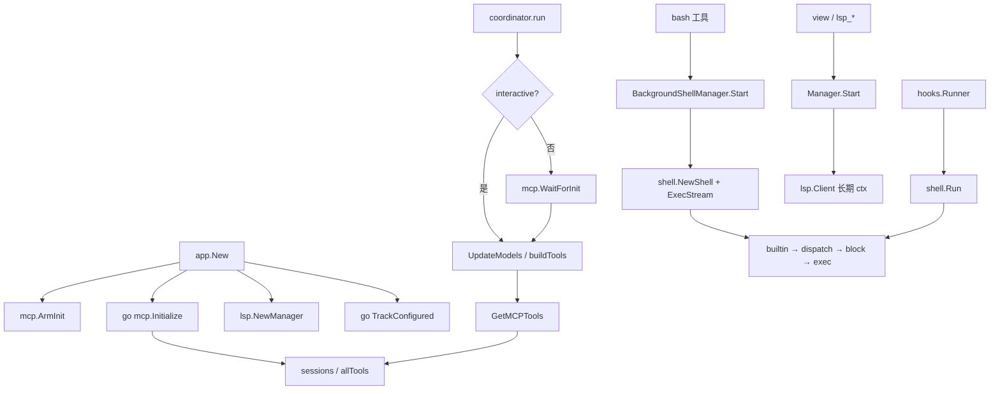
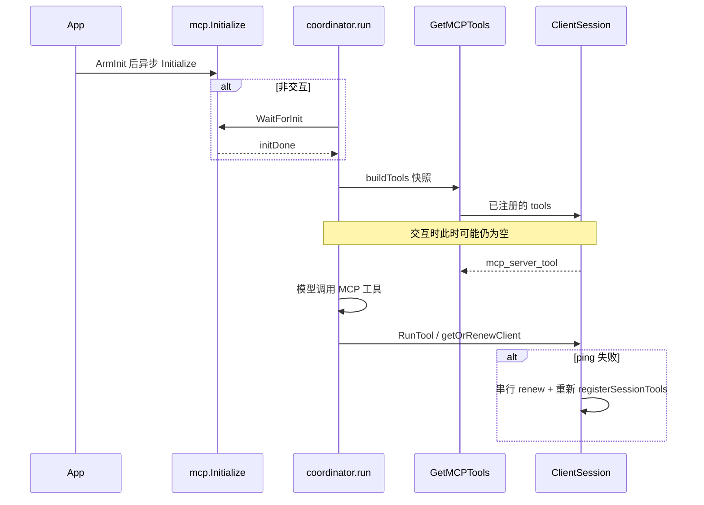
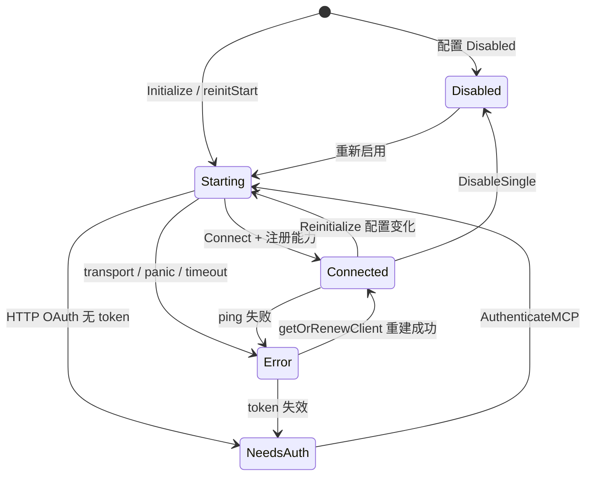

# 11. Shell、LSP 与 MCP

> 状态：待复核生成稿
> 生成日期：2026-08-16
> 基准提交：`16dce459cafecee92eae0ed7c47a0c641c8bbb9f`
> 工作区：dirty（开始分析时已有本目录下未提交文档）
> 源码范围：`internal/shell/`、`internal/lsp/`、`internal/agent/tools/mcp/`
> 生成方式：源码、测试、配置与部署资产静态分析
> 所属层：第四层（补齐嵌入式 Shell、LSP 管理、MCP 生命周期）
> 前置阅读：[01-简单框架-系统骨架.md](01-简单框架-系统骨架.md)、[02-简单例子-全路径走读.md](02-简单例子-全路径走读.md)、[07-工具权限与Hook.md](07-工具权限与Hook.md)

## 快速摘要

### 架构总览（模块与依赖）

三个子系统把模型或配置接到外部进程，彼此几乎不互相调用，但都接到 `app.App` 和工具层：

- **Shell**（`internal/shell`）：基于 `mvdan.cc/sh/v3` 的 POSIX 解释器。`bash` 工具、Hook、`crushrc` 展开、用户 bang 命令共用同一套 handler 链。有状态 `Shell` 与无状态 `Run` 共享 `newRunner`。
- **LSP**（`internal/lsp`）：`Manager` 按文件类型惰性启动语言服务；工具通过 `Start` / `OpenFileOnDemand` / `ApplyWorkspaceEdit` 使用它。
- **MCP**（`internal/agent/tools/mcp`）：进程全局的 session/tools/prompts/resources 注册表。`app.New` 先 `ArmInit` 再异步 `Initialize`；交互 run 不等待，非交互 `coordinator.run` 会 `WaitForInit`。动态工具经 `tools.GetMCPTools` 进入 `buildTools`。

### 核心调用序列（逐步逻辑）

1. `app.New` 创建 `lsp.NewManager`、`permission.NewPermissionService`，同步 `mcp.ArmInit()`，再 `go mcp.Initialize`；`SetCallback` 后 `go TrackConfigured`。
2. 交互提示：`coordinator.run` 跳过 WaitForInit，`UpdateModels` → `buildTools` → `GetMCPTools` 读当时注册表。
3. 非交互 `crush run`：`WaitForInit` 直到 `Initialize` 关闭 `initDone`，再 `buildTools`，保证唯一一次工具快照完整。
4. `bash` / Hook 进入 `shell.Run` 或 `Shell.Exec`：handler 链 builtin → script dispatch → block list →（可选）Go coreutils → 进程组隔离的 OS exec。
5. 文件工具调用 `lsp.Manager.Start(path)`：工作区内、匹配 fileTypes/rootMarkers 的 server 才启动；初始化用独立 Context，不绑在这次 tool call 上。
6. MCP 工具调用 `mcp.RunTool` → `getOrRenewClient`（ping 失败则按 server 串行重建 session）→ `CallTool`。

### 易错点与边界条件

- `WaitForInit` 在从未 `ArmInit` 时立即返回 nil。测试里 Arm 了却不跑 Initialize 必须 `DisarmInit`，否则污染同进程其它测试。
- `mcp.Initialize` 自己也会 `ArmInit`；`app.New` 先 Arm 一次是为了堵住“goroutine 还没进 Initialize、WaitForInit 已经看见未启动”的窗口。
- 交互路径晚到的 MCP 工具靠 `EventToolsListChanged` → TUI `RefreshMCPTools` → 下次 `UpdateModels` 才进入模型上下文；当前这一轮看不到。
- LSP `Start` 拒绝工作区外路径；初始化 timeout 默认 30s，与调用方 ctx 脱钩。
- Unix Shell 用 `Setsid` 隔离 TTY；Unix stdio MCP 用 `Setpgid` + 负 PID `SIGKILL` 收孙进程。两套隔离目的不同，不要混用实现。
- WorkspaceEdit 必须按协商的 UTF-8/16/32 把 character 转成 byte offset；UTF-16 是 LSP 默认。
- Channel 事件故意不走 `SubscribeEvents` 的共享扇出，避免跨工作区注入。本基准提交里 channel 投递到 Session 的工作区路由仍未接通（代码注释写明延期）。
- 本篇未运行完整测试套件。

## 目录

1. [为什么这样设计（Why）](#1-为什么这样设计why)
2. [它是什么（What）](#2-它是什么what)
3. [嵌入式 Shell](#3-嵌入式-shell)
4. [LSP Manager 与 Client](#4-lsp-manager-与-client)
5. [MCP 生命周期](#5-mcp-生命周期)
6. [MCP 工具如何进入 buildTools](#6-mcp-工具如何进入-buildtools)
7. [调用关系表](#7-调用关系表)
8. [Mermaid](#8-mermaid)
9. [测试覆盖](#9-测试覆盖)
10. [阅读源码建议顺序](#10-阅读源码建议顺序)
11. [重新实现检查清单](#11-重新实现检查清单)

## 1. 为什么这样设计（Why）

Crush 不能把模型发出的命令直接交给系统 `sh -c`，也不能在启动时拉起所有语言服务和 MCP。原因：

- **可测试与可拦截**：需要在进程内插入 builtin、block list、脚本分派，而不是解析完再 exec 一次真正的 bash。
- **取消必须到达孙进程**：脚本会再 spawn；只杀直接子进程会留下孤儿。Hook 超时还要求解释器（含 builtin）响应 `ctx.Err()`。
- **启动延迟**：LSP 与 MCP 可能数秒到数十秒。交互 TUI 若等最慢的 MCP，第一次输入会假死。所以 MCP 异步初始化，交互用当前快照，非交互只有一次机会所以等待。
- **LSP 按需**：powernap 自带大量默认 server；若全部探测 PATH 会在大仓库里把启动拖死。先按 fileTypes/rootMarkers 过滤，再 LookPath，并对缺失命令做 30 秒 backoff。
- **MCP 是进程全局表**：配置热更新必须 reconcile 而不是无脑全拆；并发 tool call 不能同时重建同一 session。

## 2. 它是什么（What）

| 子系统 | 进程内对象 | 外部实体 | 主要入口 |
|---|---|---|---|
| Shell | `*shell.Shell`、无状态 `Run`、单例 `BackgroundShellManager` | OS 进程组 / Windows 子进程 | `bash` 工具、`hooks.Runner`、`shellconfig`、bang `PersistOutput` |
| LSP | `*lsp.Manager` 每 App 一个；`*lsp.Client` 每 server 一个 | 语言服务进程（gopls 等） | 文件/符号工具、`TrackConfigured` |
| MCP | 包级 `sessions`/`states`/`allTools`/`allPrompts`/`allResources` | stdio 子进程或 HTTP/SSE 服务 | `Initialize`、`GetMCPTools`、`RunTool`、资源工具 |

Hook 执行也走 Shell，但策略语义在 [07-工具权限与Hook.md](07-工具权限与Hook.md)。本篇只写 Shell 作为执行引擎的部分。

## 3. 嵌入式 Shell

### 3.1 为什么不用 `exec.Command("sh", "-c")`

`internal/shell` 用 `mvdan.cc/sh/v3` 的 parser + interpreter，即使在 Windows 上也是 POSIX 语义（路径用 `/`）。得到：

- 变量、管道、重定向、函数、`$(...)`
- 可插入的 `ExecHandler` 中间件
- 进程内 builtin（`jq`、crushrc 的 `provider`/`model`/…）
- 可测的 stdin/stdout/stderr
- 有状态 `Shell` 与无状态 `Run` 共享 `newRunner`，行为不能漂移

文档注释在 `shell.go` 与 `doc.go`。

### 3.2 两种入口

**有状态 `Shell`**（`shell.go`）：

- 字段：`cwd`、`env`、`blockFuncs`、`logger`，一把 `mu`。
- `NewShell`：默认 `os.Getwd()` / `os.Environ()`；`withoutHerdrEnv`；追加 `CrushEnvMarkers()`（`CRUSH=1`、`AGENT=crush`、`AI_AGENT=crush`）。
- `Exec` / `ExecStream`：持锁，内部 `exec` 跑完后把 runner 的 cwd/env 写回，供下一次 `cd`/`export` 生效。
- `bash` 工具每次 `BackgroundShellManager.Start` 都会 `NewShell`，所以 **bash 工具调用之间不保持状态**（描述里写明）。有状态对象主要给“同一次 Job 里的脚本”和测试连续性（`TestRunContinuity`）。

**无状态 `Run`**（`run.go`）：

- `RunOptions`：`Command`、**必填 `Cwd`**（空则 error，不默默用进程 cwd）、`Env`、`Stdin/Stdout/Stderr`、`BlockFuncs`、`TermWidth`。
- Hook 使用 `Run` 且 `BlockFuncs=nil`。
- `RunAndCapture`：缓冲 stdout/stderr，返回 `CaptureResult{Output, ExitCode}`。
- `RunAndCaptureStream`：`progressWriter` 每次 Write 回调。
- `RunAndCapturePTY`：需要终端语义（bang 命令、`RunAndPersist`）。
- `RunAndPersist`：PTY 跑完后调 `PersistFunc`；失败只记日志，仍返回 CaptureResult。

错误约定：非零退出是 `interp.ExitStatus`；取消用 `IsInterrupt`；`ExitCode` 取出码。`Run` 有 panic recover，变成 error。

### 3.3 Handler 链（安全语义）

`newRunner` → `execHandlerOption`：先得到 `processGroupExecHandler(defaultKillTimeout=2s)` 作为底座，再 **从后向前** 包 `standardHandlers`：

```text
builtinHandler
  → scriptDispatchHandler
    → blockHandler
      → [可选] coreUtilsExecHandler
        → processGroupExecHandler
```

注释强调不用 `interp.ExecHandlers`（它会再挂上无隔离的 `DefaultExecHandler`）。

各层：

1. **builtin**：`args[0]` 在 `builtins` map 里则 `handler(ctx, args, hc.Stdin, hc.Stdout, hc.Stderr)`。必须用 `interp.HandlerCtx` 的 stdio，不能写 `os.Stdout`，否则管道失效。
2. **script dispatch**（`dispatch.go`）：仅当 `argv[0]` 是路径前缀（`./` `../` `/`，Windows 盘符或 `\`）。读文件头 128 字节：
   - shebang → `os/exec` 跑解释器（先按字面路径，失败再用 PATH 上的 basename，让 `#!/bin/bash` 在 Git Bash 的 Windows 上可用）
   - 二进制 magic（MZ/ELF/Mach-O）或 NUL → 交给下一层
   - 否则当 shell 源码，嵌套 `interp.Runner` 跑，**同一套 blockFuncs** 递归生效
   - 目录、缺失、不可读把真实 errno 传出去
3. **block list**：任一 `BlockFunc(args)` 为真则 `command is not allowed for security reasons`。`bash` 传入 `tools.blockFuncs()`；Hook 传 nil。
4. **Go coreutils**：`CRUSH_CORE_UTILS` 显式 true/false；否则仅 Windows 默认开。illumos/solaris 用 stub（`coreutils_exec_stub.go`）因为 moreinterp/coreutils 编不过。

`withNonInteractiveEnv` 强制：`TERM=xterm-256color`、`GIT_EDITOR=false`、`EDITOR=false`、`VISUAL=false`、`JJ_EDITOR=false`、各类 `PAGER=cat`。避免 vim 把 TUI 挂死。

### 3.4 Builtin 注册表

`builtins_registry.go`：`RegisterBuiltin(name, BuiltinHandler)`，`init` 注册 `jq`（`jq.go`）。`shellconfig` 在自己的 init 里注册 `provider`/`model`/`mcp`/`lsp`/`permissions`/`hook`/`options` 等。这些配置 builtin 看 Context 里有没有 `ConfigBuilder`：crushrc 加载时有，bash 工具执行时没有，于是变成 no-op，不会改 Crush 配置。

长循环 builtin 必须轮询 `ctx.Err()` 并原样返回。Hook 超时靠这个让 `jq` 退出；测试：`jq_test.go` 的 `TestJQ_CtxCancel*`。

### 3.5 跨平台进程隔离

**Unix**（`exec_unix.go`）：

- `isolateProcess`：`SysProcAttr.Setsid=true`，新 session，离开 Crush 的 controlling TTY。防止 zsh job control 抢 TTY（`suspended (tty input)`）和子进程向 Crush 进程组发信号。
- 取消：先对 **负 PID**（整个 session/group）发 SIGINT，等 `killTimeout`，再 SIGKILL。
- 测试：`isolation_unix_test.go`（信号不到父进程、TTY 不堵、zsh job control、子进程组杀掉）。

**Windows**（`exec_windows.go`）：对应的进程策略；没有 POSIX process group。`dispatch_windows_test.go` 测 shebang 的 PATH fallback。

### 3.6 后台 Job

`background.go`：进程内单例 `GetBackgroundShellManager()`。

| 常量 | 值 |
|---|---|
| `MaxBackgroundJobs` | 50 |
| `CompletedJobRetentionMinutes` | 8 小时 |
| Job ID | `%03X` 自增 |

`Start(ctx, workingDir, blockFuncs, command, description)`：

- 超限返回 error。
- `NewShell` + 独立 `context.WithCancel`。
- goroutine `ExecStream` 写到加锁的 `syncBuffer` stdout/stderr；结束关闭 `done`，记录 `completedAt`。
- **注意**：`bash` 传入的是 `context.Background()`，不是 tool call ctx，所以用户取消这一轮 Agent 不会停后台 Job。

`Get` / `Remove`（不杀）/ `Kill`（cancel + 等 done）/ `List` / `Cleanup`（按 retention 删已完成）/ `KillAll`（App 关闭，等调用方 ctx）。

`GetOutput`：`select` done 则返回最终 err；否则返回当前快照且 `done=false`。读写都靠 `syncBuffer` 的锁。

`Wait` / `WaitContext` 给 `job_output` 的 `wait=true`。

测试：`background_test.go`、`tools/job_test.go`（含 auto-background、并发读、blockFuncs）。

### 3.7 PersistOutput 与 ExpandValue

`persist_message.go`：`PersistOutput` 把 bang 命令结果写成 **user** 消息的 `message.ShellCommand` part。`sessionID==""` 直接成功。FK 失败（session 已删）吞掉并 Debug 日志——因为 modernc/ncruces 两个 SQLite 驱动的错误类型不稳定，只能匹配 `"FOREIGN KEY constraint failed"` 文本。测试：`persist_message_test.go`。

`expand.go`：`ExpandValue` 给配置值做 `$VAR` / `${VAR}` / `$(...)` 展开，与 bash 工具同一解释器。`NoUnset` 默认 false（未定义变量变空串）。`$(...)` 失败时 stderr 截到 512 字节，降低泄密。测试：`expand_test.go`。LSP/MCP 的 command/URL/env 都走 `config.VariableResolver`，底层即此。

## 4. LSP Manager 与 Client

### 4.1 Manager 职责

`internal/lsp/manager.go`。`NewManager(cfg)`：

1. `powernapconfig.NewManager().LoadDefaults()` 载入捆绑的 server 定义。
2. 用户 `cfg.LSP`：`Disabled` 则 `RemoveServer`；否则 `AddServer`。若用户用的是 command 名而不是 powernap 名，`resolveServerName` 按 command 反查。

字段：`clients`、`unavailable`（缺失命令的时间）、`callback`（默认 no-op）、可注入的 `now`/`lookPath` 便于测试。

### 4.2 TrackConfigured 与 on-demand Start

`TrackConfigured`：只对 **用户配置且未 Disabled** 的名字调 `callback(name, nil)`。Client 为 nil 时 App 回调写成 `StateUnstarted`，TUI 能显示“已配置未启动”。必须在 `SetCallback` **之后** 调用（`app.go` 注释）。

`Start(ctx, path)`：

1. 路径绝对值化；`!fsext.HasPrefix(path, WorkingDir())` **直接返回**（工作区外不启动 LSP）。
2. 对每个 bundled+user server 并行 `startServer`。

`startServer` 分支：

- 非用户配置且 `AutoLSP` 显式 false → 跳过。
- 已有 client 且状态 Ready/Starting/Disabled → 只 callback，不重复启动。
- 用户配置：还要 `handles(server, filepath, workDir)`（fileTypes + rootMarkers）。
- 自动启动：`canAutoStart`：
  - command 在 `skipAutoStartCommands`（`python`、`node`、`npx`、`java`、`ruff` 等太泛）→ 否
  - 先 fileTypes + rootMarkers（`filepath.Glob` 只查工作区根，不递归，避免扫 `node_modules`）
  - `recentlyUnavailable` 30 秒内失败过 → 否
  - `LookPath` 失败 → `markUnavailable`，30 秒后再试
- 创建 Client 用 **独立** `context.WithTimeout(Background, timeout或30s)`，不绑 tool call ctx。
- `Initialize` 失败则 Shutdown 并从 map 删除；`WaitForServerReady` 失败仍保留 client，状态 `StateError`，“继续用”。

`KillAll` 立即 Kill（关 Crush 时）；`StopAll` 先 Close 再等，过滤 EOF/Canceled/jsonrpc closed/`signal: killed`。

测试：`manager_test.go` 的 `UnavailableBackoff`、`CanAutoStartFiltersBeforeLookingUpCommand`、`CanAutoStartCachesMissingCommand`。

### 4.3 Client

`client.go`：包装 powernap Client。长期 `ctx`/`cancelCtx` 与请求无关，Restart 才能活过第一次 tool call。

状态机：`StateUnstarted`（仅 UI 对 nil client）/ `Starting` / `Ready` / `Error` / `Stopped` / `Disabled`。

关键方法：

| 方法 | 行为 |
|---|---|
| `Initialize` | **先** `registerHandlers` 再握手。typescript-language-server 会在 initialize 返回前发 `window/workDoneProgress/create`，晚注册会被当成致命未处理响应 |
| `HandlesFile` | 必须在 `cwd` 前缀内，再按 fileTypes / DetectLanguage |
| `OpenFile` / `OpenFileOnDemand` | didOpen；已打开则跳过 |
| `NotifyChange` | didChange |
| `WaitForDiagnostics` | 等诊断 map 版本变化或 timeout |
| `GetOffsetEncoding` | 握手谈好的 UTF8/UTF16/UTF32 |
| `Restart` | 记下已打开文件，cancel 旧 ctx，Close（10s），新 powernap client，再 Initialize，重开文件 |
| `Close` | CloseAllFiles + Shutdown/Exit，5s 超时则 Kill |
| `Definition` / `FindReferences` / `Rename` / `DocumentSymbols` / `PrepareCallHierarchy` / Incoming/OutgoingCalls | 转 LSP 请求；行列是 0-based |

诊断缓存在 `VersionedMap`。`GetDiagnosticCounts` 按 version 缓存，避免 UI 每帧拷整表。

### 4.4 Server 请求 Handler

`handlers.go`：

- `workspace/configuration` → `[]map{}` 空配置
- `window/workDoneProgress/create` → no-op 成功（能力广告了就必须答）
- `client/registerCapability`：解析 `workspace/didChangeWatchedFiles`，通知可选的 fileWatch handler
- `workspace/applyEdit`：闭包带 encoding，调 `util.ApplyWorkspaceEdit`
- `window/showMessage` → slog
- `textDocument/publishDiagnostics` → 写入 Client 诊断缓存并 callback 计数

### 4.5 UTF 位置与 WorkspaceEdit

`internal/lsp/util/edit.go` 的 `ApplyWorkspaceEdit`：

1. `Changes` map：每 URI 一组 TextEdit。
2. `DocumentChanges`：CreateFile / DeleteFile（可 Recursive）/ RenameFile（尊重 Overwrite）/ TextDocumentEdit。
3. TextEdit：检测 CRLF vs LF、是否以换行结尾；检查 range 重叠（LSP 半开区间，相邻不算重叠）；**按 start 倒序**应用，避免偏移错位。
4. character → byte：
   - UTF-8：character 当 byte
   - UTF-16（默认）：`powernap.PositionToByteOffset`
   - UTF-32：`utf32ToByteOffset` 按 codepoint 走

测试：`edit_test.go` 的 `PositionToByteOffset`、`ApplyTextEdit_UTF16`、`UTF8`、`RangesOverlap`。`lsp_rename` 必须把 `GetOffsetEncoding()` 传进来，不能写死 UTF-16。

工具侧 `notifyLSPs` / `openInLSPs` / `waitForLSPDiagnostics` 见 [07](07-工具权限与Hook.md) 第 5.20 节。

## 5. MCP 生命周期

包：`internal/agent/tools/mcp/`。状态、session、工具/提示/资源注册表都是 **进程全局** `csync.Map`，不是 App 字段。多工作区 Server 模式要靠事件过滤避免串台（channel 目前直接不扇出）。

### 5.1 状态

`State`：`Disabled` / `Starting` / `Connected` / `Error` / `NeedsAuth`。

`ClientInfo`：Name、State、Error、Client、Counts{Tools,Prompts,Resources}、ConnectedAt、**Config**（上次成功连接的配置）、**PendingConfig**（正在连的配置）。Reconcile 用这两份判断要不要重启。

事件：`EventStateChanged`、`EventToolsListChanged`、`EventPromptsListChanged`、`EventResourcesListChanged`、`EventChannelMessage`。`SubscribeEvents` **丢掉** ChannelMessage。

### 5.2 ArmInit / Initialize / WaitForInit / Close

| 函数 | 行为 |
|---|---|
| `ArmInit` | `initStarted=true`。必须在启动 Initialize goroutine **之前**同步调用 |
| `DisarmInit` | 测试专用，避免永久阻塞 |
| `Initialize(ctx, permissions, cfg)` | 再 Arm 一次；对每个未 Disabled 的 MCP `goInitClient` 并 WaitGroup；全部结束后 `initOnce.Do(close(initDone))` |
| `WaitForInit` | 未 Arm → nil；已 Arm → 等 `initDone` 或 ctx |
| `Close` | 并行关 session（等调用方 ctx）；关残留 OAuth handler；`broker.Shutdown` |

`app.New`：`ArmInit()` + `go Initialize`。`coordinator.run`：仅 `!interactive` 时 WaitForInit。测试：`waitforinit_test.go`、`coordinator_mcp_gate_test.go` 的 `TestRunWaitsForMCPOnlyWhenNonInteractive`。

`Initialize` 的 WaitGroup 等到每个 server 的 `initClient` 返回（成功或失败），所以 WaitForInit 的上限大致是最慢 server 的 connect timeout，不是无限等。

### 5.3 连接：transport 与进程组

`createTransport`：

- **`MCPStdio`**：`exec.CommandContext` + 展开后的 command/args/env；`configureStdioProcess`。
  - Unix（`process_unix.go`）：`Setpgid=true`，Cancel 时 `Kill(-pid, SIGKILL)`，`WaitDelay=5s` 防止孙进程占着 pipe 让 `Wait` 挂死。生产曾因 npx/signal-cli 孤儿堆积。
  - Windows（`process_other.go`）：空操作，只杀直接子进程。
- **`MCPHttp`**：展开 URL；可选 OAuth handler（token 存在配置里，401 走浏览器或远程 suppress browser）。

`createSession`：timeout timer cancel；channel transport 包装；`mcp.NewClient` 注册 Tool/Prompt/Resource list changed → 往 broker 发事件；Connect；按 generation 提交，过期则丢掉（配置中途变了）。

`goInitClient`：捕获启动时的 generation；panic → `StateError`。

测试：`init_test.go` 的 URL/stdio/headers 展开、`process_unix_test.go` 的 process group。

### 5.4 Reconcile / Reinitialize

`lifecycle.go` 的纯函数 `reconcile(current, running)`：

- 配置里没了 → `reinitRemove`
- 配置 Disabled 且当前不是 Disabled → `reinitDisable`
- Starting：仅当 `PendingConfig` 仍等于当前配置才放过（避免热更新丢失）
- Connected：配置与 `Config` 相等则跳过
- 其它（新、Error、NeedsAuth）→ `reinitStart`

`Reinitialize` 单飞：进行中只置 `reinitDirty`，一轮结束后若 dirty 再跑，突发多次 crushrc 写入最多两次 reconcile。`mcpConfigEqual` 逐字段比，忽略内部 `OAuthToken`；`TestMCPConfigEqualExhaustive` 防止加字段漏比。

`teardown`：generation+1、关 session、`clearMCPData`（tools/prompts/resources）。`updateState(Error)` 必须关旧 session 并清空能力，否则 Agent 会看到已死 server 的工具。测试：`lifecycle_test.go` 的 `UpdateState_ErrorClosesSessionAndClearsTools`、`ErrorClearsPromptsAndResources`。

### 5.5 getOrRenewClient

`RunTool` / `ListResources` / `ReadResource` / `GetPromptMessages` 都走这里：

1. 无锁 ping 健康 session → 直接用。
2. 否则 `renewLock(name)` 串行。
3. 锁内再取 session：没有 → `"mcp X not available"`（不会在 tool call 里偷偷 Initialize 一个从未出现过的 server）。
4. ping 好了 → 用（等锁期间别人可能已续上）。
5. ping 失败 → `StateError`（清注册表）→ `newSession`；generation 变了则丢弃。成功则 `registerSessionTools` + prompts/resources，回到 Connected。

测试：`GetOrRenewClient_SerializesConcurrentRenewals`、`SessionErrorThenRenew_RestoresTools`、`RestoresPromptsAndResources`、`RegisterSessionTools_PopulatesRegistry`。

### 5.6 Tools / Resources / Prompts

`tools.go`：`allTools` map。`RunTool` 把 JSON 解成 `map[string]any`，`CallTool`，拼接 Text；Image/Audio 经 `ensureRawBytes`（有的 Docker MCP 返回的是还没 decode 的 base64）。`filterTools`：先 `EnabledTools` 白名单，再 `DisabledTools` 黑名单。

`resources.go`：`ListResources` 会刷新注册表计数；`ReadResource` 按 URI。

`prompts.go`：`GetPromptMessages` 只要 role=user 的文本。TUI 在 StateChanged / PromptsListChanged 时加载，给斜杠命令用，不是模型工具。

### 5.7 Channel

`channel.go`：服务器若在 `experimental["claude/channel"]` 声明能力，且用户 `--channels` opt-in，则监听 `notifications/claude/channel`。

校验失败即丢：未知 JSON 字段、空/超 64KiB content、meta 最多 32 项、key 必须是 XML 名、不能覆盖 `source`/`xmlns`/`xml`、单值 ≤1024。`renderChannel` 用 `encoding/xml` 转义，meta key 排序，输出确定性。

transport 上有 gate：握手期间缓冲；Connect 后按能力+opt-in 打开或丢弃缓冲。`SubscribeEvents` 过滤这些事件，因为 broker 是进程全局、payload 没有 workspace/session id。注释写明投递到 Session 的路由延期。测试：`channel_test.go`、`channel_integration_test.go`。

### 5.8 OAuth 与鉴权

HTTP + `OAuth=true`：无可用 token 时 `StateNeedsAuth`。用户触发 `AuthenticateMCP` 走交互浏览器。启动路径可 suppress browser，把 URL 交给远程 UI。token 刷新写回配置。失败且 token 失效会清 token 回到 NeedsAuth。测试：`BeginAuth_*`。

## 6. MCP 工具如何进入 buildTools

完整过滤规则见 [07](07-工具权限与Hook.md) 第 4 节步骤 11。这里补生命周期时序：

```text
app.New
  ArmInit()                          // 同步
  go mcp.Initialize                  // 每个 server goInitClient
        connectAndRegister
          registerSessionTools       // 写入 allTools
          close(initDone)            // 全部完成后

交互 coordinator.run
  不等待
  UpdateModels → buildTools → GetMCPTools(allTools 快照)
  晚到的 EventToolsListChanged
    TUI handleMCPToolsEvent → Workspace.RefreshMCPTools
    下一次 UpdateModels 才把新工具编进模型上下文

非交互 coordinator.run
  WaitForInit                        // 保证 initDone 之后 allTools 已可见
  UpdateModels → buildTools          // 这一次快照就是全程唯一的工具表
```

`GetMCPTools` 每次调用都重新包一层 `*tools.Tool`（带 permissions/cfg/wd）。MCP 原名进 `AllowedMCP`；发给模型的名字是 `mcp_{server}_{tool}`。

配置了 MCP 但还在 Starting 时：动态工具可能为空，但 `list_mcp_resources`/`read_mcp_resource` 只要 `len(cfg.MCP)>0` 且 AllowedTools 包含就会出现；真正 List/Read 时 `getOrRenewClient` 可能报 not available。

## 7. 调用关系表

| 调用方文件与符号 | 关系 | 被调用方文件与符号 | 触发与输入 | 返回与后续处理 | 错误、状态与副作用 |
|---|---|---|---|---|---|
| `app.New` | 调用 | `mcp.ArmInit` + `go mcp.Initialize` | App 装配 | Initialize 结束后关 initDone | 异步；失败进 StateError |
| `app.New` | 调用 | `lsp.NewManager`、`SetCallback`、`go TrackConfigured` | 同左 | 用户配置的 LSP 显示 Unstarted | 不启动进程 |
| `coordinator.run` | 条件调用 | `mcp.WaitForInit` | `!interactive` | nil 或 ctx 错 | 交互跳过 |
| `coordinator.buildTools` | 调用 | `tools.GetMCPTools` | 当前 `mcp.Tools()` | 过滤后进工具表 | 快照可能不完整 |
| `tools.Tool.Run` | 调用 | `mcp.RunTool` | server 名、原工具名、JSON | ToolResult | 先 Permission（白名单除外） |
| `mcp.RunTool` | 调用 | `getOrRenewClient` | ping / 串行 renew | `*ClientSession` | Error 清空注册表再重建 |
| `hooks.Runner.runOne` | 调用 | `shell.Run` | Hook command、无 BlockFuncs | exit + stdout | 超时放弃 goroutine |
| `tools.bash` | 调用 | `BackgroundShellManager.Start` | `context.Background()`、blockFuncs | Job ID | 独立进程组 |
| `file/LSP 工具` | 调用 | `lsp.Manager.Start` | 文件或工作区路径 | 可能新 Client | 区外路径 no-op |
| `lsp.Manager.startServer` | 调用 | `lsp.Client.Initialize` | 独立 timeout ctx | Ready 或 Error | 失败删 map |
| `lsp_rename` | 调用 | `lsputil.ApplyWorkspaceEdit` | WorkspaceEdit + encoding | 写多个文件 | 重叠 range 失败 |
| `config 热更新` | 调用 | `mcp.Reinitialize` | 最新 MCP map | 按 reconcile 动作 | 单飞 + dirty 再跑 |
| `App shutdown` | 调用 | `mcp.Close`、`LSPManager.KillAll`、`BackgroundShellManager.KillAll` | 关闭 ctx | 尽力杀外部进程 | MCP Unix 杀进程组 |
| `TUI` | 订阅 | `mcp.SubscribeEvents` | 非 channel 事件 | RefreshMCPTools / 提示 | Channel 被过滤 |
| bang 命令 | 调用 | `shell.RunAndPersist` → `PersistOutput` | sessionID、command、output | user ShellCommand 消息 | session 已删则吞 FK |

## 8. Mermaid







## 9. 测试覆盖

| 区域 | 文件 | 锁定的行为 |
|---|---|---|
| Run / 环境 | `shell/run_test.go` | Cwd 必填、jq builtin、并行隔离、取消、BlockFuncs、herdr 剥离、非交互 env |
| Dispatch | `dispatch_test.go`、`dispatch_windows_test.go` | shebang、二进制、源码嵌套、缺失解释器、探测窗口 |
| Builtin | `builtins_registry_test.go`、`jq_test.go` | 覆盖 PATH、取消 |
| 后台 | `background_test.go`、`tools/job_test.go` | KillAll 超时、WaitContext、并发输出 |
| Persist / Expand | `persist_message_test.go`、`expand_test.go` | 缺 session、unset 变量 |
| 隔离 | `isolation_unix_test.go` | 进程组、TTY |
| 命令封锁 | `command_block_test.go` | CommandsBlocker、ArgumentsBlocker |
| LSP Manager | `manager_test.go` | backoff、先过滤再 LookPath |
| LSP Client | `client_test.go` | 展开失败、WaitForDiagnostics、nil |
| UTF edit | `lsp/util/edit_test.go` | UTF16/8、重叠 |
| MCP 门闩 | `waitforinit_test.go`、`coordinator_mcp_gate_test.go` | 未 Arm、完成后可见工具、仅非交互等待 |
| MCP 生命周期 | `lifecycle_test.go`、`init_test.go` | Error 清能力、renew 串行、reconcile、configEqual 穷尽 |
| Channel | `channel_test.go`、`channel_integration_test.go` | 转义、伪造属性、gate、Subscribe 过滤 |
| 工具过滤 | `mcp/tools_test.go` | enabled/disabled、base64 |

未覆盖缺口：Windows MCP 孙进程；channel 注入 Session 的端到端（当前刻意不通）；LSP 真服务器的重命名；`RunAndCapturePTY` 的终端边角。

## 10. 阅读源码建议顺序

1. `shell/run.go` 的 `newRunner` / `standardHandlers` / `execHandlerOption`，再 `dispatch.go`、`exec_unix.go`。
2. `background.go` + `tools/bash.go` 的前台/转后台循环。
3. `lsp/manager.go` 的 `Start`/`canAutoStart`/`TrackConfigured`，再 `client.go` 的 Initialize/Restart，再 `util/edit.go`。
4. `mcp/init.go`：ArmInit → Initialize → WaitForInit → createTransport → Close。
5. `lifecycle.go` 的 reconcile + `getOrRenewClient`。
6. `tools.go` / `mcp-tools.go` 如何进 `buildTools`。
7. `channel.go` 的校验与为何 Subscribe 过滤。
8. `coordinator.go` 里 `run` 对 `interactive` 的分支，对照 `coordinator_mcp_gate_test.go`。

## 11. 重新实现检查清单

- [ ] Shell 有状态 Exec 与无状态 Run 共用 handler 链；Run 的 Cwd 必填。
- [ ] 中间件顺序：builtin → script dispatch → block → 可选 coreutils → 进程组 exec。
- [ ] Unix 子进程 Setsid；取消杀整个 group；MCP stdio Unix 另用 Setpgid + SIGKILL 组。
- [ ] Builtin 用 HandlerCtx 的 stdio；长循环看 ctx；配置 builtin 无 ConfigBuilder 时 no-op。
- [ ] 后台 Job 有上限、retention、syncBuffer、KillAll；bash 用 Background ctx。
- [ ] PersistOutput 在 session 消失时不报错；ExpandValue 默认 lenient。
- [ ] LSP 工作区外不 Start；AutoLSP 可关；泛化 command 不自动启动；缺失命令 30s backoff。
- [ ] LSP Initialize 前注册 handler；Client 长期 ctx 与 tool call 脱钩。
- [ ] WorkspaceEdit 按协商 encoding 转 byte，倒序、半开区间重叠检测。
- [ ] MCP：先 Arm 再异步 Initialize；WaitForInit 未 Arm 立即返回。
- [ ] 交互不等待 MCP；非交互等待；工具表按当时注册表构建。
- [ ] Error/teardown 关闭 session 并清空 tools/prompts/resources；renew 按 server 串行；generation 丢弃过期 connect。
- [ ] Reinitialize 单飞 + dirty；configEqual 忽略 OAuthToken 且有穷尽测试。
- [ ] GetMCPTools 名称 `mcp_server_tool`；AllowedMCP 用原名。
- [ ] Channel 严格校验、XML 转义、不走共享 SubscribeEvents。
- [ ] 关闭路径：mcp.Close、LSP KillAll、Background KillAll 都响应 ctx。
