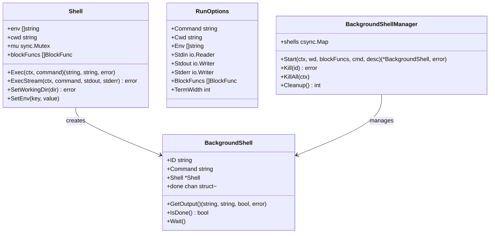

[上一篇：11-MCP协议支持](11-MCP协议支持.md) · [总目录](README.md) · [下一篇：13-权限与安全](13-权限与安全.md)

# Shell 执行引擎

> **场景**：理解 Crush 的内置 Shell 执行引擎如何通过 mvdan.cc/sh 解释器实现跨平台命令执行，包括有状态/无状态两种执行模式、脚本分发机制（shebang/二进制/shell 源码）、进程组隔离、后台作业管理、命令阻止列表和非交互环境强制设置。
> **时间**：2026-08-27 (CST)
> **版本**：Crush @ main branch, Go 1.26.6, mvdan.cc/sh/v3 v3.13.1

## 本文件内容

1. [架构概览](#1-架构概览)
2. [有状态 Shell：Shell 结构](#2-有状态-shellshell-结构)
3. [无状态执行：Run 函数](#3-无状态执行run-函数)
4. [解释器构建与中间件链](#4-解释器构建与中间件链)
5. [脚本分发机制](#5-脚本分发机制)
6. [进程组隔离](#6-进程组隔离)
7. [后台作业管理](#7-后台作业管理)
8. [命令阻止列表](#8-命令阻止列表)
9. [环境变量处理](#9-环境变量处理)
10. [流式输出与捕获](#10-流式输出与捕获)

## 1. 架构概览

```
┌──────────────────────────────────────────────────────┐
│ 调用方                                                │
│ bash 工具 → Shell.Exec / Shell.ExecStream            │
│ hooks → shell.Run (无状态)                            │
│ 非交互模式 → RunAndPersist / RunAndCapturePTY        │
├──────────────────────────────────────────────────────┤
│ Shell 执行引擎 (internal/shell/)                      │
│ shell.go     — Shell 结构、有状态执行                  │
│ run.go       — Run 函数、无状态执行、捕获辅助            │
│ dispatch.go  — 脚本分发（shebang/二进制/shell 源码）    │
│ exec_unix.go — 进程组隔离的 exec handler               │
│ background.go — 后台作业管理器                          │
│ stream.go    — 流式输出捕获                             │
├──────────────────────────────────────────────────────┤
│ mvdan.cc/sh/v3 解释器                                  │
│ interp.Runner — POSIX shell 解释器                     │
│ interp.ExecHandler — 可插拔的 exec 中间件              │
│ syntax.Parser — shell 语法解析器                       │
├──────────────────────────────────────────────────────┤
│ 操作系统                                              │
│ os/exec — 外部进程执行                                 │
│ syscall — 进程组/会话管理 (Unix)                       │
└──────────────────────────────────────────────────────┘
```



## 2. 有状态 Shell：Shell 结构

### 结构

```
internal/shell/shell.go
Struct：Shell
字段：env        → []string
字段：cwd        → string
字段：mu         → sync.Mutex
字段：logger     → Logger
字段：blockFuncs → []BlockFunc
```

`Shell` 是有状态的 shell 实例——执行后 cwd 和 env 会随命令副作用更新（如 `cd /tmp` 后 cwd 变为 `/tmp`）。由 bash 工具使用，因为 bash 工具需要跨多次调用保持工作目录一致性。

### NewShell

```
函数：NewShell
偏移：+0 ～ +34
```

执行步骤：

1. 设置 cwd — 如果未指定，使用 `os.Getwd()`
2. 设置 env — 如果未指定，使用 `os.Environ()`
3. 调用 `withoutHerdrEnv(env)` — 移除 herdr 面板管理变量
4. 追加 `CrushEnvMarkers()` — `CRUSH=1`, `AGENT=crush`, `AI_AGENT=crush`
5. 设置 logger — 如果未指定，使用 noopLogger

### CrushEnvMarkers

```
函数：CrushEnvMarkers
返回：[]string{"CRUSH=1", "AGENT=crush", "AI_AGENT=crush"}
```

每次调用返回新 slice，调用方可以安全 append。这些变量允许子进程检测是否被 AI agent 调用。

### Exec

```
函数：Exec
偏移：+0 ～ +4
```

加锁后委托给 `exec`，返回 stdout 和 stderr 字符串。使用 `bytes.Buffer` 捕获输出。

### ExecStream

```
函数：ExecStream
```

加锁后委托给 `execCommon`，输出直接写入提供的 writer——支持流式输出，用于后台作业。

### execCommon

```
函数：execCommon
偏移：+0 ～ +25
```

核心执行流程：

1. **Panic 恢复**：defer 捕获 panic，转换为错误
2. **Runner 更新**：defer 调用 `updateShellFromRunner` — 从解释器同步 cwd 和 env 回 Shell
3. **日志**：defer 记录命令完成日志
4. **语法解析**：`syntax.NewParser().Parse(command)` — 解析 shell 语法
5. **创建 Runner**：`s.newInterp(nil, stdout, stderr)` — 构建解释器
6. **执行**：`runner.Run(ctx, line)`

### updateShellFromRunner

```
函数：updateShellFromRunner
```

执行后将解释器状态同步回 Shell：
- `s.cwd = runner.Dir` — 更新工作目录
- 清空 `s.env`，从 `runner.Vars` 重建——只保留 `Exported` 变量

这确保 `cd /tmp && export FOO=bar` 的效果持久化到下次调用。

## 3. 无状态执行：Run 函数

### Run

```
internal/shell/run.go
函数：Run
偏移：+0 ～ +31
```

无状态执行——每次调用创建独立的 `interp.Runner`，不共享状态。由 hooks runner 使用。

执行步骤：

1. Panic 恢复
2. 检查 `opts.Cwd` 非空（必须显式提供）
3. 设置默认 stdout/stderr 为 `io.Discard`
4. 语法解析
5. 创建 Runner（通过 `newRunner`）
6. `runner.Run(ctx, line)`

### RunAndCapture

```
函数：RunAndCapture
偏移：+0 ～ +27
```

便捷包装：
1. 如果 `opts.Env == nil`，继承 `os.Environ()`
2. 使用 `bytes.Buffer` 捕获 stdout 和 stderr
3. 调用 `Run`
4. 合并 stdout 和 stderr（stderr 追加在 stdout 后）
5. 返回 `CaptureResult{Output, ExitCode}`

### RunAndCapturePTY

```
函数：RunAndCapturePTY
```

不是真正的 PTY——通过环境变量强制颜色输出：
```go
opts.Env = append(opts.Env, ptyColorEnvVars...)
```

```
Var：ptyColorEnvVars
值：["COLORTERM=truecolor", "CLICOLOR_FORCE=1", "FORCE_COLOR=1"]
```

这些变量使 git、cargo、npm、eza、bat、ripgrep 等程序输出 ANSI 颜色序列，无需真正的 PTY。跨平台兼容。

### RunAndPersist

```
函数：RunAndPersist
```

执行命令并通过回调持久化结果：
1. 调用 `RunAndCapturePTY`
2. 如果 `persist != nil`，调用 `persist(command, output, exitCode)`

用于 AppWorkspace 和 Backend 的命令执行 + 历史持久化模式。

## 4. 解释器构建与中间件链

### newRunner

```
函数：newRunner
偏移：+0 ～ +9
```

```go
func newRunner(cwd string, env []string, stdin io.Reader, stdout, stderr io.Writer, blockFuncs []BlockFunc) (*interp.Runner, error) {
    env = withNonInteractiveEnv(env)
    return interp.New(
        interp.StdIO(stdin, stdout, stderr),
        interp.Interactive(false),
        interp.Env(expand.ListEnviron(env...)),
        interp.Dir(cwd),
        execHandlerOption(blockFuncs),
    )
}
```

关键设计：
- `withNonInteractiveEnv(env)` — 强制非交互环境变量
- `interp.Interactive(false)` — 禁用交互模式
- `execHandlerOption(blockFuncs)` — 安装 Crush 的中间件链

### execHandlerOption

```
函数：execHandlerOption
偏移：+0 ～ +9
```

使用 `interp.ExecHandler`（单数，非 `ExecHandlers`）而非 `interp.ExecHandlers`（复数）。源码注释说明：`ExecHandlers` 总是追加 `DefaultExecHandler` 作为最终 handler，而它缺乏进程组隔离。没有隔离时，zsh 等启用 job control 的 shell 会向 Crush 的进程组发送 SIGINT/SIGTERM 导致崩溃。

中间件链构建：
```go
base := processGroupExecHandler(defaultKillTimeout)
handler := base
for _, mw := range slices.Backward(standardHandlers(blockFuncs)) {
    handler = mw(handler)
}
return interp.ExecHandler(handler)
```

### standardHandlers

```
函数：standardHandlers
偏移：+0 ～ +10
```

中间件顺序（从内到外）：

1. **builtinHandler** — Crush 内置命令（jq, config builtins）
2. **scriptDispatchHandler** — 脚本分发（shebang/二进制/shell 源码）
3. **blockHandler** — 命令阻止列表
4. **coreUtilsExecHandler**（可选）— Go 实现的 coreutils

顺序设计：builtins 先于一切，确保 Crush 的 jq 实现优先于 PATH 中的 jq；脚本分发在阻止列表之前，使 deny 规则能看到已解析的 argv；阻止列表在 coreutils 之前，确保安全规则不可绕过。

### execMiddleware

```
类型：execMiddleware = func(next interp.ExecHandlerFunc) interp.ExecHandlerFunc
```

类似 HTTP 中间件的组合模式——每层要么自己处理命令，要么委托给链中的下一层。

## 5. 脚本分发机制

### scriptDispatchHandler

```
internal/shell/dispatch.go
函数：scriptDispatchHandler
偏移：+0 ～ +25
```

拦截路径前缀的 argv[0]（如 `./foo.sh`, `/opt/bin/tool`），根据文件内容分发：

| 探测结果 | 处理方式 |
|---------|---------|
| Shebang 行 (`#!...`) | 解析 shebang，通过 `os/exec` 执行解释器 |
| 已知二进制格式 | 传递给下一层 handler（mvdan 默认 exec） |
| 其他 | 作为 shell 源码在进程内执行 |

非路径前缀的命令（如 `echo`, `jq`）直接传递——此 handler 是 no-op。

### isPathPrefixed

```
函数：isPathPrefixed
```

判断 argv[0] 是否为文件引用：
- Unix：以 `./`, `../`, `/` 开头
- Windows：驱动器字母前缀（`C:\` 或 `C:/`）或反斜杠前缀

### probeFile

```
函数：probeFile
Const：probeWindow = 128
```

读取文件前 128 字节用于判断文件类型。刻意不读取整个文件——只有 shell 源码分支会重新 `os.ReadFile` 读取完整内容。这保持了对大文件的低内存开销。

### 二进制检测

```
函数：isBinary
```

两种判定方式：
1. **NUL 字节**：前 128 字节中包含 NUL → 二进制
2. **魔术数字**：检查已知二进制头：
   - `MZ` — Windows PE / DOS
   - `0x7F ELF` — ELF
   - `0xFE ED FA CE/CF` — Mach-O BE
   - `0xCF FA ED FE` / `0xCE FA ED FE` — Mach-O LE
   - `0xCA FE BA BE` — Mach-O fat binary

### Shebang 解析

```
函数：parseShebang
```

解析 `#!` 行：
1. 去除 CRLF 和前导空白
2. 提取解释器路径和剩余参数
3. 如果是 `/usr/bin/env`，调用 `parseEnvShebang` 特殊处理：
   - `-S` 标志：启用分词参数
   - 无 `-S`：剩余部分作为单个 argv[1]（内核单参数语义）
   - 其他 env 标志：拒绝

### resolveInterpreter

```
函数：resolveInterpreter
```

解释器路径解析：
1. 先尝试字面路径 — `os.Stat(path)`
2. 如果文件不存在（`ErrNotExist`），用 `exec.LookPath(filepath.Base(path))` 在 PATH 中查找
3. 其他 stat 错误（EACCES, ELOOP 等）直接返回——不静默回退到 PATH

PATH 回退使 `#!/bin/bash` 在 Windows（Git for Windows 的 bash.exe 在 PATH 中但无 `/bin/bash`）也能工作。

### dispatchShebang

```
函数：dispatchShebang
偏移：+0 ～ +40
```

通过 `os/exec` 执行解析后的解释器：
1. 构造命令：`[解释器] [shebang参数] [脚本路径] [原始参数...]`
2. 设置 `cmd.Dir`, `cmd.Env`, `cmd.Stdin/Stdout/Stderr` 从解释器上下文继承
3. 调用 `isolateProcess(cmd)` — 进程组隔离
4. `cmd.Run()` — 执行
5. 将 `exec.ExitError` 转换为 `interp.ExitStatus`

### runShellSource

```
函数：runShellSource
偏移：+0 ～ +33
```

将文件内容作为 POSIX shell 在进程内执行：
1. `os.ReadFile(path)` — 读取完整文件
2. `syntax.NewParser().Parse(data)` — 解析为 AST
3. 创建嵌套 `interp.Runner`，复用父 runner 的 cwd/env/stdio
4. 使用相同的 `execHandlerOption(blockFuncs)` — 保持 handler 栈一致
5. 设置位置参数 `$1, $2, ...`，前导 `--` 防止参数被误解为 set 选项
6. `runner.Run(ctx, file)`

这是唯一读取完整文件的分支——保持 blockFuncs 一致确保 deny 规则递归应用到脚本内的命令。

## 6. 进程组隔离

### isolateProcess (Unix)

```
internal/shell/exec_unix.go
Build tag：!windows
函数：isolateProcess
```

```go
func isolateProcess(cmd *exec.Cmd) {
    if cmd.SysProcAttr == nil {
        cmd.SysProcAttr = &syscall.SysProcAttr{}
    }
    cmd.SysProcAttr.Setsid = true
}
```

`Setsid = true` 使子进程在新的会话中运行，完全脱离 Crush 的控制终端。防止：
- zsh 等启用 job control 的 shell 抢占 TTY，导致 `SIGTTIN`/`SIGTTOU` 和终端渲染损坏
- 子进程向 Crush 的进程组发送信号

### processGroupExecHandler

```
函数：processGroupExecHandler
偏移：+0 ～ +40
```

替代 `interp.DefaultExecHandler` 的 exec handler，添加进程组隔离：

1. `interp.LookPathDir` — 在 runner 的 cwd 和 env 中查找可执行文件
2. 构造 `exec.Cmd`
3. `isolateProcess(&cmd)` — 设置 `Setsid`
4. `cmd.Start()`
5. 注册 `context.AfterFunc` 取消回调：
   - 如果 `killTimeout <= 0`：立即 `SIGKILL` 整个进程组
   - 否则：先 `SIGINT` 进程组 → 等待 `killTimeout`（默认 2 秒）→ `SIGKILL` 进程组
6. `cmd.Wait()`
7. 将错误转换为 exit status

**负 PID 信号**：`syscall.Kill(-cmd.Process.Pid, ...)` — 负 PID 针对整个进程组，确保孙进程也被杀死。

### exec_windows.go

```
Build tag：windows
```

Windows 版本提供功能等价的 `isolateProcess` 和 `processGroupExecHandler`，使用 Windows API 实现进程隔离。

## 7. 后台作业管理

### BackgroundShellManager

```
internal/shell/background.go
Struct：BackgroundShellManager
字段：shells → *csync.Map[string, *BackgroundShell]
```

单例管理器，通过 `GetBackgroundShellManager()` 获取。

### 常量

```
Const：MaxBackgroundJobs = 50
Const：CompletedJobRetentionMinutes = 8 * 60 (8 小时)
```

### Start

```
函数：Start
偏移：+0 ～ +39
```

启动后台作业：

1. 检查作业数量限制（`MaxBackgroundJobs = 50`）
2. 生成 ID：`fmt.Sprintf("%03X", idCounter.Add(1))` — 递增十六进制 ID
3. 创建独立 Shell 实例（独立的工作目录和 blockFuncs）
4. 创建可取消 context
5. 创建 `BackgroundShell` 实例，包含 `syncBuffer` 用于线程安全输出捕获
6. 启动 goroutine 执行 `shell.ExecStream`
7. goroutine 完成时设置 `exitErr` 和 `completedAt`

### BackgroundShell

```
Struct：BackgroundShell
字段：ID, Command, Description → string
字段：Shell → *Shell
字段：ctx, cancel → context
字段：stdout, stderr → *syncBuffer
字段：done → chan struct{}
字段：exitErr → error
字段：completedAt → atomic.Int64
```

### 输出获取

```
函数：GetOutput
返回：(stdout string, stderr string, done bool, err error)
```

非阻塞检查 — 通过 `select` + `<-bs.done` 的 `default` 分支实现：
- 已完成：返回完整输出、done=true、exit error
- 运行中：返回当前输出快照、done=false、nil error

### syncBuffer

```
Struct：syncBuffer
字段：buf → bytes.Buffer
字段：mu → sync.RWMutex
```

线程安全的 `bytes.Buffer` 包装器。`Write`/`WriteString` 使用写锁，`String` 使用读锁。支持后台 goroutine 写入和主线程并发读取。

### Kill / KillAll

```
函数：Kill(id)
```

1. 从 map 取出 shell
2. 调用 `shell.cancel()` — 取消 context
3. `<-shell.done` — 等待 goroutine 退出

```
函数：KillAll(ctx)
```

并发取消所有后台 shell，等待全部退出或 context 超时。

### Cleanup

```
函数：Cleanup
```

清理已完成超过 `CompletedJobRetentionMinutes`（8 小时）的作业。遍历所有 shell，检查 `completedAt` 时间戳，移除过期的。

## 8. 命令阻止列表

### BlockFunc

```
internal/shell/shell.go
类型：BlockFunc = func(args []string) bool
```

### CommandsBlocker

```
函数：CommandsBlocker
```

精确命令匹配——如果 `args[0]` 在禁止集合中，返回 true。用于 bash 工具的禁用命令列表（如 `rm`, `curl`, `wget` 等）。

### ArgumentsBlocker

```
函数：ArgumentsBlocker
偏移：+0 ～ +15
```

子命令 + 标志匹配——阻止特定 `cmd subcmd --flag` 组合。例如 `git push --force`。

执行逻辑：
1. 检查 `parts[0] == cmd`
2. 将 `parts[1:]` 分离为参数和标志（`splitArgsFlags`）
3. 检查参数前缀匹配
4. 检查标志子集匹配（`slice.IsSubset`）

### blockHandler 中间件

```
internal/shell/run.go
函数：blockHandler
```

遍历 `blockFuncs`，如果任何函数返回 true，返回错误：`"command is not allowed for security reasons: %q"`。

### splitArgsFlags

```
函数：splitArgsFlags
```

将参数列表分为位置参数和标志：
- 以 `-` 开头的 → 标志（提取 `=` 前的部分）
- 其他 → 位置参数

## 9. 环境变量处理

### 非交互环境强制

```
Var：nonInteractiveEnvVars
```

每次 shell 执行强制设置以下变量：

| 变量 | 值 | 目的 |
|------|-----|------|
| `TERM` | `xterm-256color` | 防止程序检测到无 TTY 而退出 |
| `GIT_EDITOR` | `false` | 防止 git 等待编辑器 |
| `EDITOR` | `false` | 防止其他程序等待编辑器 |
| `VISUAL` | `false` | 同上 |
| `JJ_EDITOR` | `false` | 防止 Jujutsu 等待编辑器 |
| `JJ_PAGER` | `cat` | 防止 Jujutsu 等待分页器 |
| `GIT_PAGER` | `cat` | 防止 git 等待分页器 |
| `PAGER` | `cat` | 防止其他程序等待分页器 |

源码注释说明：Crush 的 shell 永远不是交互式的，保留用户的 `EDITOR=nvim` 偏好只会导致挂起。

### withNonInteractiveEnv

```
函数：withNonInteractiveEnv
```

1. 构建覆盖键集合
2. 复制 env，过滤掉将被覆盖的键
3. 追加 `nonInteractiveEnvVars`

这确保强制值替换用户配置，而非追加重复键。

### Herdr 环境变量移除

```
Var：herdrEnvVars = ["HERDR_ENV", "HERDR_SOCKET_PATH", "HERDR_PANE_ID"]
函数：withoutHerdrEnv
```

移除 herdr 面板管理变量——子进程不应继承这些变量，否则会附加到父面板并在退出时释放 agent 权限。

## 10. 流式输出与捕获

### progressWriter

```
internal/shell/stream.go
Struct：progressWriter
字段：mu → sync.Mutex
字段：buf → bytes.Buffer
字段：onProgress → func(string)
```

包装 writer，每次写入时调用 `onProgress` 回调。线程安全（mutex 保护）。stdout 和 stderr 可以并发写入。

### RunAndCaptureStream

```
函数：RunAndCaptureStream
```

流式执行命令：
1. 继承 `os.Environ()` 如果 env 为 nil
2. 追加 `ptyColorEnvVars` — 强制颜色输出
3. 创建 `progressWriter`，设置 `onProgress` 回调
4. stdout 和 stderr 都指向同一个 progressWriter
5. 调用 `Run`
6. 返回 `CaptureResult{Output: buf.String(), ExitCode}`

用于 bash 工具的前台执行模式——LLM 实时看到命令输出，而非等待完成后一次性返回。

---

[上一篇：11-MCP协议支持](11-MCP协议支持.md) · [总目录](README.md) · [下一篇：13-权限与安全](13-权限与安全.md)