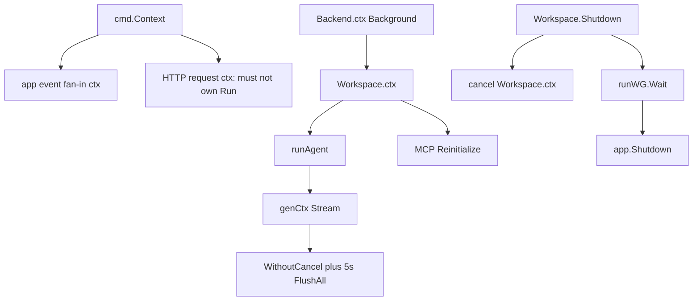
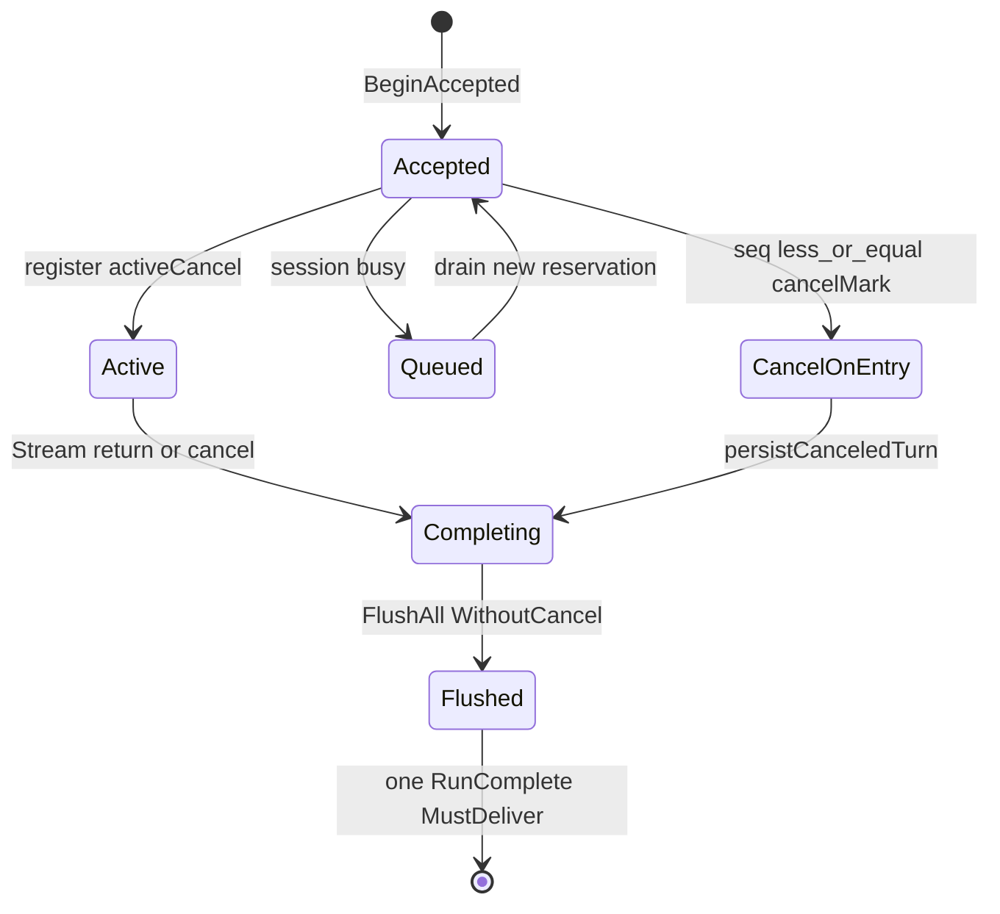
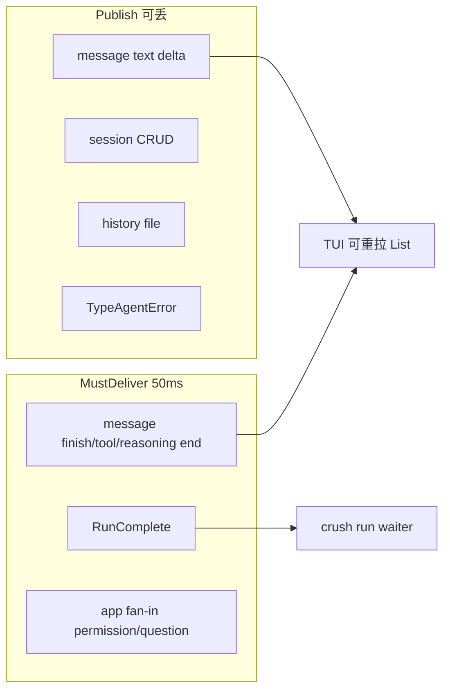

# 12. 并发、可靠性、安全与可观测性

> 状态：待复核生成稿
> 生成日期：2026-08-16
> 基准提交：`16dce459cafecee92eae0ed7c47a0c641c8bbb9f`
> 工作区：dirty（开始分析时已有文档草稿）
> 源码范围：`internal/agent/agent.go`（dispatch/cancel）、`internal/app/app.go`（Shutdown/扇入）、`internal/backend/backend.go`、`internal/pubsub/`、`internal/csync/`、`internal/lock/`、`internal/event/`、`internal/log/`、`internal/herdr/`、`internal/permission/permission.go`、`internal/db/connect.go`
> 生成方式：实现与取消、关闭、竞态测试交叉分析
> 所属层：第四层（跨包不变量；不以包目录代替并发契约）
> 前置阅读：[09-数据模型持久化与事件.md](09-数据模型持久化与事件.md)、[10-Workspace与ClientServer.md](10-Workspace与ClientServer.md)
> 旧文档：`10-concurrency-lifecycle-reliability.md` 仅作索引，**以本提交源码为准**（例如 Permission `Request` 本身是 `Publish` 不是 `PublishMustDeliver`）。

## 快速摘要

### 架构总览（模块与依赖）

正确性靠四类原语叠加：`context` 取消树、短临界区互斥锁、`csync` 并发容器、Broker 两级投递。短 HTTP/工具 ctx 不得拥有长资源；Workspace/进程 ctx 才行。Cleanup 写库必须 `context.WithoutCancel` 加超时，否则 shutdown 取消会丢掉终态。可观测性是 slog 文件 + 可选 PostHog + herdr pane 状态。安全边界是数据目录权限、gitignore、yolo/权限提示、以及“hook 是用户自己的可信代码”。

### 核心调用序列（逐步逻辑）

1. 进程/Backend ctx → Workspace ctx → `genCtx`（`WithCancel(runCtx)`）驱动 `fantasy.Agent.Stream`。
2. Client/Server：`BeginAccepted` 在 `acceptedMu` 下占坑；`sessionMu`（即 per-session `dispatchMu`）上选择 cancel-on-entry / queued / active；锁内禁止 DB/LLM。
3. 流式 `messages.Update` 可丢；Finish/`RunComplete`/权限扇入走 bounded must-deliver。
4. 退出：停生产者（CancelAll、cancel workspace ctx、等 runWG）→ FlushAll → 并行杀 shell/LSP → `db.Release`。
5. herdr：本地 `app.ReportCurrentSession` + `BridgeLocal`；远程 SSE `herdr.Translate`。

### 易错点与边界条件

- accepted、queued、active 是三种“未完成”；只取消 activeCancel 会漏掉已 HTTP 接受但未进 Run 的请求。
- `acceptedMu` 与 `dispatchMu` 分离，否则 `AcceptedRun.Close` 在持有 dispatch 时死锁。
- `sessionMu` 惰性创建必须 `dispatchMuCreate`，否则两个 mutex 实例假互斥。
- 普通 Publish 满 4096 丢；MustDeliver 每订阅者最多 50ms；超时仍可能丢，订阅者要重拉。
- Shutdown 不得在持有会与 cleanup 互相等待的锁时阻塞自己。
- Hook 在权限检查**之前**跑，且是用户配置的 shell，按可信代码处理。
- PostHog 默认开，`CRUSH_DISABLE_METRICS` 或配置可关；文档不复制 project key。

## 目录

1. [为什么这样设计（Why）](#1-为什么这样设计why)
2. [它是什么（What）](#2-它是什么what)
3. [代码如何实现（How）](#3-代码如何实现how)
4. [调用关系](#4-调用关系)
5. [测试证据](#5-测试证据)
6. [如何重新实现](#6-如何重新实现)
7. [阅读源码建议顺序](#7-阅读源码建议顺序)
8. [重新实现检查清单](#8-重新实现检查清单)

## 1. 为什么这样设计（Why）

Crush 的难点不是算法，而是同时存在：TUI 事件循环、Agent Stream、工具、MCP/LSP 子进程、SQLite 单连接、可选多 Client SSE、以及用户按 Escape。任一条路径在关闭或取消时写错，就会出现“coder agent offline”、RunComplete 丢失导致 `crush run` 挂死、或 WAL 损坏。

设计选择：

- **取消用 Context，互斥用短锁**。锁不跨 IO。
- **投递分等级**。token 可丢；RunComplete 尽量保；两者都不能无限阻塞 Publisher。
- **关闭先停生产者再关存储**。Agent 可能还在 Flush parts。
- **安全默认本地单用户**。data dir 不进 git；yolo 显式跳过提示；hook 等于用户已授权的代码。

## 2. 它是什么（What）

```text
cmd.Context（Cobra，SIGINT 取消）
├── 本地 App：app.New(ctx) 的事件扇入 ctx
│     └── sessionAgent genCtx
└── Backend.ctx（server 用 Background）
      └── Workspace.ctx
            ├── runAgent / Coordinator.RunAccepted
            │     └── genCtx / summarize ctx
            ├── MCP Reinitialize(ws.ctx)
            └── cleanup: WithoutCancel(parent) + timeout
```

锁与容器：

| 名字 | 位置 | 保护什么 | 持锁时禁止 |
|---|---|---|---|
| `sessionMu` / `dispatchMu[session]` | `sessionAgent` | accepted→queued/active/cancel-on-entry | DB、LLM、网络 |
| `dispatchMuCreate` | 同上 | 同一 session 只创建一个 mutex | — |
| `acceptedMu` | 同上 | acceptedRuns 计数与 acceptSeqGen | 不要再拿 dispatchMu |
| `requestMu` | `permissionService` | 同时只处理一个权限弹窗 | — |
| `activeRequestMu` | 同上 | `activeRequest` 指针 | — |
| `poolMu` | `db` | 连接池 map | 打开 DB 也在锁内（首次 Connect） |
| `Backend.mu` | Backend | pathIndex、pending、closing、retired、idle timer | 慢 init 必须放锁 |
| `Workspace.clientsMu` | backend.Workspace | claims | IO；且不得在持有时调 teardown |
| `Workspace.runMu` | 同上 | closing + runWG.Add | — |
| `ClientWorkspace.mu` | 缓存快照 | ws、lastSession | HTTP |
| Broker `mu` | pubsub | subs map | Publish 只 RLock |

`csync.Map/Slice/Value/VersionedMap` 是带 RWMutex 的泛型容器，不是额外语义层。`lock` 包是跨进程 flock。

## 3. 代码如何实现（How）

### 3.1 Context 取消树

**cmd ctx**：Cobra `cmd.Context()`，Ctrl+C 取消。本地 `app.New` 用它做事件订阅生命周期。`startDetachedServer` 用 `context.Background()`，避免父 CLI 退出杀掉 server。

**workspace ctx**：`CreateWorkspace` 里 `WithCancel(b.ctx)`。`SendMessage`/`runAgent` 绑定它，所以 HTTP 结束不影响 Run。`Workspace.Shutdown` 调 `cancel()`，尚未登记 `activeCancel` 的 goroutine 也能看到 Done。

**genCtx**：`sessionAgent.Run` 在 dispatch 完成后 `WithCancel(runCtx)` 得到 `genCtx`，交给 `agent.Stream`。Escape → `activeCancel.cancel()` → Stream 返回。

**WithoutCancel cleanup**（必须保持值如 RunID，丢掉取消）：

| 场景 | 代码 | 超时 |
|---|---|---|
| 取消发生在建消息前 | `persistCanceledTurn` | 5s |
| Stream 结束写终态 | `cleanupCtx` around Flush/Update | 5s |
| 标题生成 | `GenerateTitle(WithoutCancel)` | 随父 |
| MCP 等慢 init | `coordinator` `initCtx := WithoutCancel(ctx)` | — |
| Client 恢复 Create | `WithoutCancel(subCtx)` + `recoveryCreateTimeout` 30s | 避免取消藏起已登记 workspace |
| AWS SSO refresh | `WithoutCancel` + 专用 timeout | 见 `aws_sso_refresh.go` |

注释原话：workspace shutdown 取消 run ctx 时，仍要把 canceled assistant 写进 SQLite。

### 3.2 Agent 三态与两把锁

`BeginAccepted`（仅 CS 火即忘路径；本地 `Accepted==nil` 不计数）：

1. `acceptedMu`：`acceptedRuns[session]++`，`acceptSeqGen++`，handle.seq = 新值。
2. `runAgent` defer `accept.Close()` → `endAccepted`（同样 `acceptedMu`，不拿 dispatch）。

`Run` 开头 `sessionMu(session).Lock()`：

- 若 `canceledBySeq`（handle.seq≤cancelMark，或 seq=0 且有 mark）：cancel-on-entry，persistCanceledTurn，Close accept。
- 若 session 已 busy：enqueue（剥掉 OnComplete 与 Accepted，保留 acceptSeq），Unlock。
- 否则登记 `activeRequests[session]=activeCancel{cancel}`，Unlock，再开 genCtx。

`Cancel(session)` 也拿 `sessionMu`：

- 调 `activeCancel.cancel()`，**条目留在 map** 直到 Run defer `CompareAndDelete`，好让 `IsBusy` 在收尾写库期间仍为 true。
- 若 `acceptedRuns>0`，在 `acceptedMu` 下把 `cancelMark` 升到当前 `acceptSeqGen`。idle Escape 不写 mark，避免毒死下一句 prompt。
- 清 queue 里 seq 被 mark 覆盖的项。

`activeCancel` 用指针身份 + `csync.Map.CompareAndDelete`，防止 defer 删掉后来者的 cancel func（ABA）。

`IsBusy`：activeRequests 或 acceptedRuns>0 或 queue 非空。

### 3.3 Broker 投递与 App 扇入

领域层：

| 事件 | 第一跳 | App 扇入 |
|---|---|---|
| Session/History/普通 Message delta | `Publish` | `setupSubscriber` → `Publish` |
| Message 终态/结构 | `PublishMustDeliver` | 仍走 messages 的 lossy 扇入；终态已在第一跳尽力保 |
| RunComplete | coordinator/runAgent `PublishMustDeliver` | **`setupSubscriberMustDeliver`** |
| Permission Request 本体 | `Request` 里 `Publish` | 扇入 **MustDeliver** |
| Permission Notification | `Publish` | MustDeliver |
| Question Request/Notification | `Publish` | MustDeliver |
| AgentError notification | `Publish` | lossy（故 runAgent 还要补 RunComplete） |

旧文档写“Permission request 用 must-deliver”不准确：第一跳可丢，第二跳保。复刻时要么两跳都 MustDeliver，要么保持现状并接受弹窗偶发丢失、靠下次工具重试。

背压：buffer 4096；MustDeliver timeout 50ms；`DropCount`/`MustDeliverDropCount` 可暴露给遥测（当前主要靠 slog）。`PublishMustDeliver` 在 ctx 取消时 **停止后续订阅者**，前面的可能已送到。

### 3.4 `csync` 与 `lock`

`internal/csync`：

- `Map`：Get/Set/Del/Take/GetOrSet/Copy/Seq2；`CompareAndDelete` 给 cancel cleanup；`NewLazyMap` 在锁内 goroutine load（调用方勿在 load 完成前假设可读——Get 会 RLock 等到 Unlock）。
- `Slice` / `LazySlice`：工具列表、`Seq` 先 Wait。
- `Value`：禁止指针/slice/map，迫使用专用类型；模型、system prompt。
- `VersionedMap`：Set/Del 时 atomic 版本++，LSP diagnostics 热路径可跳过无变化 Copy。

`internal/lock`：`File(ctx)` 阻塞到 ctx；`TryFile` 争用 `ErrContended`。锁文件永不 unlink。Unix `flock`，Windows 另实现。用于：`crush.lock`、server `start.lock`、config 文件锁（见配置篇）。

### 3.5 关闭不变量

**`app.Shutdown`**（`internal/app/app.go`）：

1. `Coordinator.CancelAll`（先停 Agent，注释：必须在关 DB 前让它们写完）。
2. 5s `shutdownCtx`。
3. `Messages.FlushAll`（debounce 必须在连接仍打开时落地）。
4. 并行：`event.AppExited`（Flush PostHog）、`KillAll` background shells、`LSPManager.KillAll`、`cleanupFuncs`（含 MCP Close、`db.Release`、skills/broker shutdown）。
5. `herdrClient.Close` 在并行块外同步调用。

**`backend.Workspace.Shutdown`** 包一层：closing → cancel ws ctx → CancelAll → `runWG.Wait` → `App.Shutdown`。CancelAll 幂等。

**`ClientWorkspace.Shutdown`**：先停重连，再 Retire，避免退出被当成丢失而 Create 出孤儿工作区。

**DB**：按 dataDir 引用计数；多个 workspace 不应共享同一 dataDir（server 用 lock 阻止）。Shutdown 后 timer flush 若仍跑，会打到已关连接——因此 FlushAll 在 Release 之前，且 timer 路径应在 Delete/Flush 时 Stop。

不得：在持 `Backend.mu` 时调 `app.Shutdown`（慢）；在持 `clientsMu` 时调 `teardown`（会再拿 Backend.mu）。

### 3.6 安全边界

| 机制 | 代码 | 契约 |
|---|---|---|
| 数据目录权限 | `MkdirAll(..., 0o700)`：cmd、backend `createDotCrushDir`、`db.Connect` | 仅用户可读 crush.db / logs / lock |
| 不进 git | `{dataDir}/.gitignore` 写入 `*\n`（已存在不覆盖） | 对话与密钥不误提交 |
| data-dir 互斥 | server `WithDataDirLock(true)` | 两个 server 不共享同一 WAL |
| YOLO | `--yolo` → `Overrides().SkipPermissionRequests`；`permission.skip` | 跳过交互批准；CS 下 first-wins，后来者改 YOLO 无效 |
| 权限弹窗 | `requestMu` 串行；`resolve`+`Take` 只赢一次；GrantPersistent 的 map 写入只在赢时 | 多 TUI 竞态安全 |
| allowlist | `allowedTools` 含 `tool` 或 `tool:action` | 配置级预批准 |
| Hook 预批准 | context 上 stamp toolCallID，`Request` 直接 granted 通知 | Hook 在 hookedTool 里、权限前执行 |
| Hook 是可信代码 | 用户在 crushrc 里写的 shell，以用户身份跑 | 不要把 hook 当沙箱；它可 allow 任何工具 |
| HTTP 日志 | `log.HTTPRoundTripLogger` 对 authorization/api-key/token/secret 头打 `[REDACTED]` | debug 仍可能记下 JSON body——推断：勿在 debug 日志里假定无密钥 |
| secure_delete | SQLite pragma ON | 降低删除残留 |
| crush.lock owner 文件 | `0o600` | 仅诊断 |

不是安全边界：Agent 工具默认能读工作区文件；yolo 等于关门禁；Client/Server 默认 unix socket 按目录权限隔离，TCP 模式无认证（高级用户自负）。

### 3.7 日志、PostHog、herdr

**`internal/log`**：`Setup` `sync.Once`。lumberjack：10MB、保留 30 天、不压缩。默认 JSON 到 `{dataDir}/logs/crush.log`；server 用 `GlobalCacheDir()/server-<host>/crush.log`。debug 开 `LevelDebug`+source。`RecoverPanic` 写 `crush-panic-<name>-<ts>.log` 并 `event.Error`。

**`internal/event`**：`Init` 连 PostHog（endpoint `https://data.charm.land`）。`distinctId` = `machineid.ProtectedID("charm")`，失败则 MAC HMAC，再失败 `"unknown"`。`shouldEnableMetrics`：`CRUSH_DISABLE_METRICS` 或配置关闭。事件：`app initialized/exited`、session created/deleted、prompt sent/responded、tokens used 等。`AppExited` 调 `Flush`（client Close，ShutdownTimeout 500ms）。`SetNonInteractive` 若 `CRUSH=1` 还标 nested。

**herdr**（`internal/herdr`）：仅 `HERDR_ENV=1` 且 socket/pane 齐全；`go test` 因 `-test.v` flag 禁用，避免测崩开发者 pane。状态 idle/working/blocked。`seq` 用启动 UnixNano，保证重启后严格递增。`Translate` 把 Message/RunComplete/Permission（领域或 proto）映射到 herdr Event。本地 `app.ReportCurrentSession`；远程 `ClientWorkspace.consumeEvents`。`Close` 发 `pane.release_agent`。

## 4. 调用关系

| 调用方文件与符号 | 关系 | 被调用方文件与符号 | 触发与输入 | 返回与后续处理 | 错误、状态与副作用 |
|---|---|---|---|---|---|
| `backend.SendMessage` | 调用 | `sessionAgent.BeginAccepted` | sessionID | AcceptedRun | acceptedRuns++ |
| `sessionAgent.Run` | 加锁 | `sessionMu` 然后可能 `enqueue`/`activeRequests.Set` | call.Accepted | 选三态之一 | 锁外 Stream |
| `sessionAgent.Cancel` | 加锁 | 同 sessionMu + `acceptedMu` 升 cancelMark | Escape/HTTP cancel | 取消 genCtx | idle 不写 mark |
| `AcceptedRun.Close` | 调用 | `endAccepted` | defer runAgent | 计数到 0 清 mark | 不拿 dispatchMu |
| `sessionAgent` defer cleanup | 调用 | `messages.FlushAll(WithoutCancel)` | 5s | 再 `runComplete.PublishMustDeliver` | 取消后仍落库 |
| `app.New` | 订阅 | `setupSubscriberMustDeliver` RunComplete/Permission/Question | app ctx | 进 `app.events` | 普通消息 lossy 扇入 |
| `app.Shutdown` | 顺序 | CancelAll → FlushAll → Release | SIGINT/TUI quit | 并行杀 LSP/shell | herdr.Close 同步 |
| `Workspace.Shutdown` | 包装 | cancel ws ctx → runWG.Wait → App.Shutdown | 最后 claim 离开 | — | 阻止新 SendMessage |
| `permission.Request` | 加锁 | `requestMu` 全程直到用户应答 | 工具调用 | bool granted | 第一跳 Publish 可丢 |
| `permission.resolve` | Take | `pendingRequests.Take` | Grant/Deny | 只一次 notification | 失败者 false |
| `db.Connect` | 加锁 | `poolMu` | dataDir | 复用或新建 | server 另 flock |
| `ClientWorkspace.runSubscription` | 重试 | `SubscribeEvents` / `recoverWorkspace` | 断流/404 | ConnectionEvent | 事件丢失假设 |







## 5. 测试证据

| 测试 | 不变量 |
|---|---|
| `agent/accepted_run_test.go` | WithoutCancel 让取消后的写通过 |
| `agent/dispatch_race_test.go` | 并发 in-process dispatch 只起一个 Run |
| `backend/accepted_run_integration_test.go` | accepted 窗口可被 Cancel |
| `backend/agent_runcomplete_test.go` | 早期失败仍有终态 |
| `message` Flush 等待 in-flight、MustDeliver timeout | debounce/背压 |
| `db/connect_test.go` | 引用计数与锁 option |
| `lock/lock_test.go` | TryFile 争用、ctx 截止 |
| `csync/maps_test.go` CompareAndDelete、并发 Seq | ABA 与迭代快照 |
| `workspace/client_workspace_test.go` Shutdown 等 recover | 关闭与重连 |
| `cmd/clientserverrace` | 拉起 server 竞态 |

未覆盖：生产容量/SLO；MustDeliver 丢后的自动重拉是否在所有 UI 路径发生。本轮未跑测试。

## 6. 如何重新实现

必须：

1. 取消树分层；cleanup 用 WithoutCancel+timeout。
2. CS 路径 BeginAccepted + cancelMark；两锁分离。
3. 每带 RunID 的顶层调用恰好一条 RunComplete（含 fallback）。
4. Shutdown：Cancel → Flush → 等 Run → Release。
5. 锁顺序 Backend.mu → clientsMu；池 poolMu 单独。
6. data dir 0700 + gitignore `*`；server 才 flock。
7. Hook 视为可信；yolo 显式。
8. 日志脱敏头；遥测可关。

可替换：PostHog、herdr、lumberjack、4096/33ms/50ms 常数。

## 7. 阅读源码建议顺序

1. `pubsub/broker.go` 包注释。
2. `agent/agent.go`：`AcceptedRun`、`sessionMu`、`Run` dispatch、`Cancel`、`persistCanceledTurn`、defer FlushAll。
3. `app/app.go`：`Events` 扇入、`Shutdown`。
4. `backend/backend.go` 锁顺序注释 + `Workspace.Shutdown`；`agent.go` runAgent。
5. `permission/permission.go` `Request`/`resolve`。
6. `csync/maps.go` CompareAndDelete；`lock/lock.go`。
7. `log/log.go`、`event/event.go`+`all.go`（不要抄 key）、`herdr/client.go`+`translate.go`。
8. `cmd/root.go` gitignore 与 `shouldEnableMetrics`。
9. 对照 [09](09-数据模型持久化与事件.md) 的 Flush 与 [10](10-Workspace与ClientServer.md) 的 claim/grace。

## 8. 重新实现检查清单

- [ ] HTTP ctx 不取消 Agent；Workspace ctx 取消所有 Run。
- [ ] 终态写库走 WithoutCancel，超时失败要日志。
- [ ] per-session dispatch mutex 惰性创建有全局小锁。
- [ ] acceptedMu 不嵌套 dispatchMu。
- [ ] Cancel 覆盖 accepted；idle Escape 不写 cancelMark。
- [ ] activeCancel 用 CompareAndDelete。
- [ ] RunComplete 扇入 MustDeliver；AgentError 不可作为唯一终态。
- [ ] Publish 永不长时间阻塞；MustDeliver 有上限。
- [ ] App Shutdown 先 CancelAll 再 FlushAll 再 db.Release。
- [ ] Backend teardown 不在 clientsMu 内拿 Backend.mu。
- [ ] 数据目录 0o700、gitignore `*`、server crush.lock。
- [ ] YOLO/allowlist/hook-allow 三条批准路径都发 notification。
- [ ] Grant 竞态只一次 resolve；GrantPersistent 失败不写 allow map。
- [ ] Hook 文档化为可信用户代码，权限之前执行。
- [ ] 日志轮转；panic 文件；Authorization 头脱敏。
- [ ] 遥测可关；herdr 缺环境变量则为 no-op，测试禁用。
