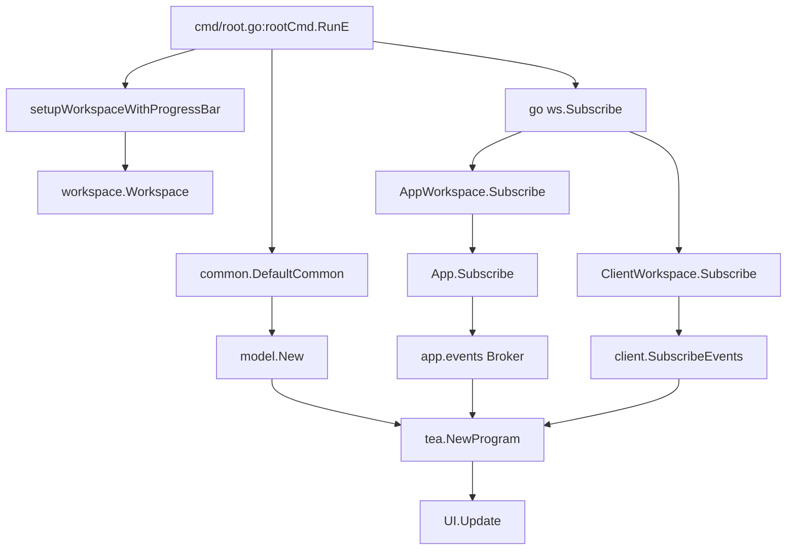
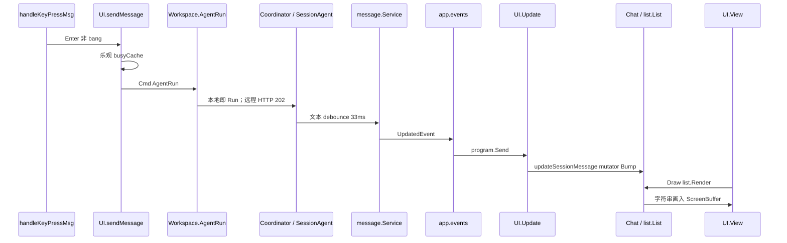
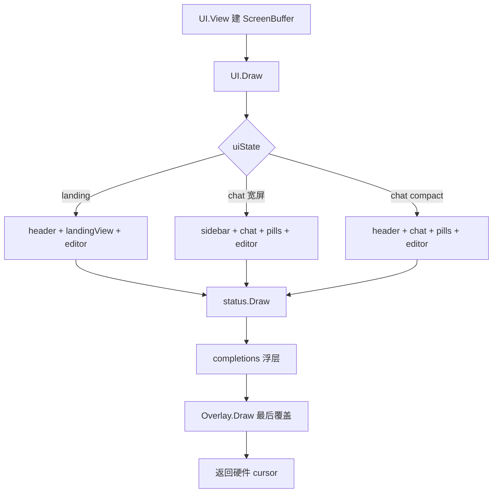
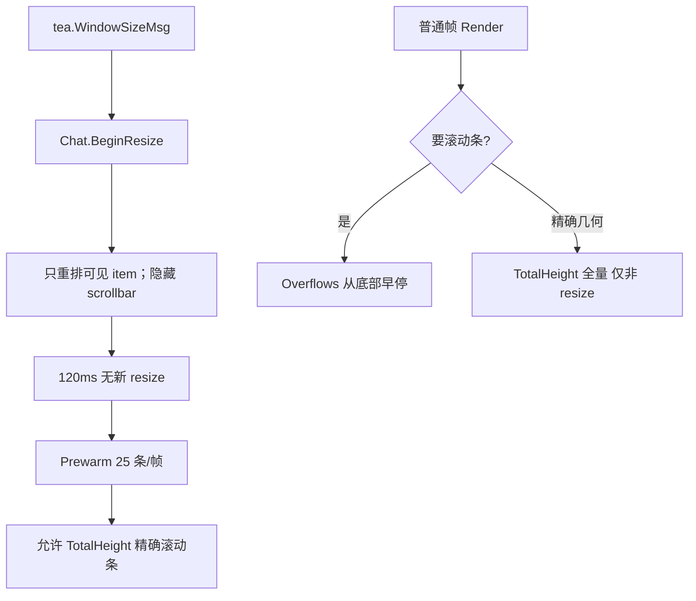

# 13. TUI 架构与渲染

> 状态：待复核生成稿
> 生成日期：2026-08-16
> 基准提交：`16dce459cafecee92eae0ed7c47a0c641c8bbb9f`
> 工作区：dirty（开始分析时已有本目录下未提交文档）
> 源码范围：`internal/ui/`（`model/`、`chat/`、`dialog/`、`list/`、`styles/`、`common/`、`completions/`、`attachments/`、`diffview/`、`anim/`、`image/`、`logo/`、`notification/`、`xchroma/`、`util/`）、`internal/ui/AGENTS.md`、`internal/cmd/root.go`（TUI 装配）、`internal/app/app.go:Subscribe`、`internal/workspace/`
> 生成方式：源码、测试、配置与部署资产静态分析
> 所属层：第四层（补齐唯一 Bubble Tea Model、Chat 渲染、Dialog、样式 token、性能边界）
> 前置阅读：[01-简单框架-系统骨架.md](01-简单框架-系统骨架.md)、[02-简单例子-全路径走读.md](02-简单例子-全路径走读.md)、[03-详细逐步说明-主链路拆解.md](03-详细逐步说明-主链路拆解.md)
> 权威约束：`internal/ui/AGENTS.md`（写 TUI 前必须先读）
> 旧文档合并来源：`11-tui-architecture.md`、`12-tui-chat-rendering.md`、`13-tui-dialog-styles-performance.md`（基准 `5712d483`）。本文以当前 HEAD 为准加深，不复制旧稿。

## 快速摘要

### 架构总览（模块与依赖）

Crush 的交互前端只有一个正式 Bubble Tea Model：`internal/ui/model.UI`。子组件（`Chat`、`list.List`、`dialog.Overlay`、`attachments.Attachments`、`completions.Completions`）不是嵌套 Elm 子树，而是带命令式方法的状态结构。顶层 `UI.Update` 路由消息，`View`/`Draw` 用 Ultraviolet `ScreenBuffer` 按矩形绘制。

依赖方向：`cmd/root.go` → `tea.NewProgram(UI)` + `Workspace.Subscribe` → `UI.Update` → `Workspace` 接口（本地 `AppWorkspace` / 远程 `ClientWorkspace`）→ `app.App` / HTTP+SSE。UI 不直接 import Coordinator；发提示走 `Workspace.AgentRun`。样式经 `common.Common` 把 `*styles.Styles` 传给所有绘制代码。

### 核心调用序列（逐步逻辑）

1. `cmd/root.go:rootCmd.RunE` 调用 `setupWorkspaceWithProgressBar`，再 `common.DefaultCommon(ws)`、`ui.New`、`tea.NewProgram`。
2. `go ws.Subscribe(program)` 把领域事件转成 `tea.Msg`。本地是 `AppWorkspace.Subscribe` → `App.Subscribe`；远程是 `ClientWorkspace.Subscribe` → SSE。
3. `UI.Init` 返回异步 Cmd（命令、历史、LSP、busy、MCP auth、可选 Session）。
4. 用户按 Enter：`handleKeyPressMsg` → `sendMessage` 或 bang `runShellCommand`。`sendMessage` 乐观标 busy，再在 Cmd 里调 `Workspace.AgentRun`。
5. Agent 写 Message；Broker 事件进 `Update`；`appendSessionMessage`/`updateSessionMessage` 改 Chat item。
6. `View` 建 `uv.ScreenBuffer`，`Draw` 按 `uiLayout` 矩形画 header/sidebar/chat/editor/pills/status/completions，Dialog 最后覆盖。

### 易错点与边界条件

- `Subscribe` 不在 `ui.go` 上。TUI 订阅入口是 `Workspace.Subscribe(*tea.Program)`。
- `Update` 禁止做 IO；例外是 `loadSessionMsg` 仍同步 `ListMessages`（Session 切换路径）。Client/Server 下 busy/LSP/queue 探测必须走 `workspace_cache.go` 的离线程刷新。
- `list.TotalHeight` 会渲染每个 item；resize 热路径只用 `Overflows`，settle 后 `Prewarm`。
- 语法高亮必须走 `common.ChromaStyle` 与 `xchroma.MatchLexer`，禁止在渲染路径调 `chroma.MustNewStyle` / `lexers.Match`。
- Dialog 的 lipgloss `Width(n)` 是含边框 padding 的总宽；内容必须按 inner width 排。权限窗用 `OpenDialogWithGrace`，避免飞行中的 Enter 误批准。
- TUI 不以 `RunComplete` 退出进程。`agentRunSubmittedMsg` 只表示 prompt 已被接受。

## 目录

1. [为什么这样设计（Why）](#1-为什么这样设计why)
2. [它是什么（What）](#2-它是什么what)
3. [构造、Init 与事件订阅](#3-构造init-与事件订阅)
4. [两条状态轴与焦点路由](#4-两条状态轴与焦点路由)
5. [`Update` 优先级](#5-update-优先级)
6. [从按键到 AgentRun](#6-从按键到-agentrun)
7. [领域事件如何变成聊天项](#7-领域事件如何变成聊天项)
8. [布局与混合渲染](#8-布局与混合渲染)
9. [Chat 与 List](#9-chat-与-list)
10. [工具 Renderer](#10-工具-renderer)
11. [Dialog Overlay](#11-dialog-overlay)
12. [样式 token 模型](#12-样式-token-模型)
13. [补全、附件、侧栏、通知与其它组件](#13-补全附件侧栏通知与其它组件)
14. [性能边界](#14-性能边界)
15. [调用关系表](#15-调用关系表)
16. [Mermaid](#16-mermaid)
17. [与 TUI 相关的测试](#17-与-tui-相关的测试)
18. [阅读源码建议顺序](#18-阅读源码建议顺序)
19. [重新实现检查清单](#19-重新实现检查清单)

## 1. 为什么这样设计（Why）

终端 UI 同时要处理：按键、鼠标、流式 token、权限弹窗、补全浮层、侧栏状态、Client/Server 的同步 HTTP 探测。如果每个子组件都是独立 Bubble Tea Model，焦点、鼠标坐标、布局矩形和“现在有没有 dialog”会散落到嵌套 `Update` 里，几乎无法同步。

Crush 选择：

1. **唯一 Model**。所有 `tea.Msg` 进 `UI.Update`。子组件暴露 `SetMessages`、`ScrollBy`、`HandleMouseDown`、`Draw` 这类命令式 API。
2. **矩形布局，而不是字符串拼接猜位置。** `uiLayout` 保存 header/main/editor/sidebar/pills/status 的 `image.Rectangle`。组件画进自己的区域。
3. **混合渲染。** 顶层是 Ultraviolet ScreenBuffer；Chat/List/completions 先渲成字符串，再 `uv.NewStyledString(str).Draw(scr, rect)`。
4. **前端只依赖 Workspace。** TUI 不知道本地 App 还是远程 Server。发提示、订事件、批准权限都走同一接口。这是第一层已经确立的契约。
5. **热路径按帧预算。** 大会话 resize/scroll 时，List 只渲可见行；Chroma 样式和 lexer 查找必须缓存；busy 探测不得阻塞 Update。

这些选择牺牲了 `ui.go` 的长度（约 5000 行），换来焦点、弹窗和流式更新的单点可推理性。`internal/ui/AGENTS.md` 把纪律写成硬规则：不要嵌套 Model；Update 不做 IO；Cmd 不改 Model 状态；ANSI 用 `x/ansi` 而不是按字节切。

## 2. 它是什么（What）

### 2.1 目录地图

| 目录 | 职责 | 是否 Bubble Tea Model |
|---|---|---|
| `internal/ui/model/` | 顶层 `UI`、布局、按键、Chat 外壳、header/status/sidebar/pills、onboarding/landing、Session 加载、workspace 缓存 | 只有 `UI` |
| `internal/ui/chat/` | 用户/助手/工具/shell 聊天项与 ToolRenderer | 否 |
| `internal/ui/list/` | 按行 viewport、惰性渲染、item 级 memo | 否 |
| `internal/ui/dialog/` | Overlay 栈与全部对话框 | 否（返回 `Action`） |
| `internal/ui/styles/` | token → `Styles` → 主题 override | 否 |
| `internal/ui/common/` | `Common`、Markdown、Chroma memo、scrollbar、能力探测 | 否 |
| `internal/ui/completions/` | `@` 文件/MCP 资源补全浮层 | 非标准 `Update`（返回是否消费） |
| `internal/ui/attachments/` | 输入框上方附件 chips | 非标准 `Update`（返回 `bool`） |
| `internal/ui/diffview/` | unified/split diff | 否 |
| `internal/ui/anim/` | spinner / 渐变动画 | 通过 `tea.Cmd` 发 `StepMsg` |
| `internal/ui/image/` | Kitty 图形协议与字符块降级 | 否 |
| `internal/ui/logo/` | 大小 Logo | 否 |
| `internal/ui/notification/` | native / OSC / bell / noop | 否 |
| `internal/ui/xchroma/` | lexer 查找缓存 | 否 |
| `internal/ui/util/` | `InfoMsg`、错误上报、通用消息 | 否 |

共享上下文 `common.Common` 只持有 `workspace.Workspace` 和 `*styles.Styles`。组件需要应用数据或样式时接收 `*Common`，不要引入全局 UI 状态。

### 2.2 `UI` 字段按职责分组

`internal/ui/model/ui.go` 的 `UI` 很大，按组理解：

| 组 | 关键字段 | 职责 |
|---|---|---|
| 应用 | `com *common.Common`、`session`、`sessionFiles`、`initialSessionID`、`continueLastSession` | 前端契约与当前对话 |
| 几何 | `width/height`、`layout uiLayout`、`isCompact`、`forceCompactMode`、`detailsOpen` | 矩形布局与窄屏 |
| 状态机 | `state uiState`、`focus uiFocusState`、`keyMap`、`keyenh` | 页面与焦点 |
| 主组件 | `chat`、`textarea`、`dialog`、`status`、`header`、`attachments`、`completions`、`activeInline` | 可见 UI |
| 输入模式 | `bangMode`、`bangCancel`、`pendingBangCommand`、`isCanceling` | bang shell、两次 Escape 取消 |
| 缓存 | `agentBusyCache`、`yoloCache`、`agentReady`、`agentModel`、`promptQueue*`、`lspStates`、`sidebarContent`、chat draw cache | 避免每帧同步探测 Workspace |
| 终端 | `caps`、`isTransparent`、`sendProgressBar`、`notifyBackend`、`notifyWindowFocused` | 能力、通知、进度条 |

新实现不要一次复制全部字段。先实现 `state`/`focus`/尺寸/textarea/`Chat`/`Overlay`，再按功能加组。

### 2.3 必须保持的行为契约 vs 可替换实现

必须保持：

- 唯一 Bubble Tea Model；子组件命令式 API。
- 前端只通过 `Workspace` 发提示、订事件、批权限。
- 页面四态、焦点四态、Dialog 优先拦截。
- `AgentRun` 是 fire-and-forget；忙闲靠后续事件与缓存，不靠这次返回值结束进程。
- 权限 Dialog 用 grace period。
- List 惰性渲染；`Overflows` vs `TotalHeight` 的用法。

可以替换：

- Ultraviolet vs 其它 ScreenBuffer。
- lipgloss 具体样式，只要 token 层还在。
- 通知后端（native/OSC/bell/noop）。
- Chat draw cache 的具体解码实现。

## 3. 构造、Init 与事件订阅

### 3.1 谁创建 UI

| 调用方 | 关系 | 被调用方 | 触发与输入 | 返回与后续 | 错误、状态与副作用 |
|---|---|---|---|---|---|
| `cmd/root.go:rootCmd.RunE` | 调用 | `setupWorkspaceWithProgressBar` | 交互 `crush` | `Workspace` + cleanup | 配置/DB 失败直接返回 |
| `rootCmd.RunE` | 调用 | `common.DefaultCommon` | `ws` | `*Common`，主题按 large model provider | 无 large model 时用默认主题 |
| `rootCmd.RunE` | 调用 | `model.New` | `com`、`--session`、`--continue` | `*UI` | 未配置 → `uiOnboarding` |
| `rootCmd.RunE` | 调用 | `tea.NewProgram` | `UI`、env、filter | Program | `ui.NewFilter` 过滤输入 |
| `rootCmd.RunE` | 启动 goroutine | `ws.Subscribe(program)` | Program.Send | 领域事件进 Update | panic 时 `program.Quit` |
| `rootCmd.RunE` | 调用 | `program.Run` | 阻塞直到退出 | 之后 `printSessionResume` | 崩溃返回固定错误文案 |

`--session` 会先 `resolveWorkspaceSessionID` 把短 hash 解析成完整 ID，再传给 `ui.New`。

### 3.2 `New` 的固定顺序

`model.New`（`ui.go`）按这个顺序初始化，顺序有意义：

1. 创建 textarea：关行号、无限字符、`DynamicHeight`、最小 3 / 最大 15 行、聚焦。
2. 从 `cfg.Options.TUI.Scrollbar` 读滚动条模式（空则 `ScrollbarDefault`），`NewChat`。
3. `DefaultKeyMap`、completions、todo spinner。
4. attachments：注入删除 keymap 和全部 attachment 样式。
5. header、Overlay、LSP/MCP map、默认 `notification.NoopBackend`。
6. 从 Workspace **同步**种子 YOLO 与 `AgentIsReady`/`AgentModel`（构造期唯一允许的同步探测；之后 Update/View 不得再同步探测）。
7. `setEditorPrompt`、随机 placeholder、`NewStatus`、compact 配置。
8. 初始页面：`!IsConfigured()` → `uiOnboarding`；`ProjectNeedsInitialization` → `uiInitialize`；否则 `uiLanding`。
9. 进度条默认开（`Options.Progress == nil || *Progress`）；透明背景看 `Options.TUI.Transparent`。

`setState` 会改 `state`/`focus` 并立刻 `updateLayoutAndSize`。回到 landing 时强制 `isCompact = false`。

### 3.3 `Init`：全部 IO 都是 Cmd

`UI.Init` 返回 `tea.Batch`：

- onboarding 时 `openModelsDialog`
- `loadCustomCommands`（自定义命令 + `Workspace.ListSkills` 转命令）
- `loadPromptHistory`
- `requestLSPRefresh`
- `loadInitialSession`（仅 landing：指定 ID 或 `--continue` 取最近一条）
- Hyper 时 `fetchHyperCredits`
- `dispatchBusyRefresh`
- `checkPendingMCPAuth`

`loadInitialSession` 在非 landing（未配置/需初始化）时返回 nil，避免还没模型就加载对话。

### 3.4 Subscribe 实际在哪

用户容易在 `ui.go` 里找 `Subscribe`。当前源码没有这个方法。真实路径：

```text
rootCmd.RunE
  go ws.Subscribe(program)
        │
        ├─ AppWorkspace.Subscribe  → App.Subscribe
        │     app.events.Subscribe(tuiCtx)
        │     program.Send(ev.Payload)
        │
        └─ ClientWorkspace.Subscribe → runSubscription(program.Send)
              client.SubscribeEvents SSE
              断线指数退避；404 则 recoverWorkspace 重新注册
              重连后发 ConnectionEvent，UI 必须重载 Session
```

`App.Subscribe` 把统一 `app.events` Broker 的 payload 送给 Program。装配时 `app.New` 已经把 Session/Message/Permission/Question/History/MCP/LSP/Skills/`RunComplete` 扇入这个 Broker。Permission 与 Question、`RunComplete` 走 `PublishMustDeliver`；普通 Message 更新允许慢订阅者丢包。TUI 靠 Message `UpdatedEvent` 重绘，不靠 `RunComplete` 退出。

Client/Server 下 SSE 断流期间的事件不可补发。`UI.handleConnectionEvent` 在 `ConnectionRecovered` 时重载当前 Session；`Stuck` 时把警告升级为持久错误。这是第三层已经写过的契约，TUI 必须遵守。

## 4. 两条状态轴与焦点路由

### 4.1 页面 `uiState`

```go
const (
    uiOnboarding uiState = iota
    uiInitialize
    uiLanding
    uiChat
)
```

| 状态 | 何时进入 | 画什么 | 焦点 |
|---|---|---|---|
| `uiOnboarding` | `!Config.IsConfigured()` | header；模型 Dialog | 通常被 Dialog 吃掉 |
| `uiInitialize` | 已配置但 `ProjectNeedsInitialization` | header + 是否创建项目上下文 | 是/否 |
| `uiLanding` | 已配置且已初始化、尚无当前 Session | logo/cwd/模型/LSP/MCP/skills + editor | 默认 editor |
| `uiChat` | 有 Session（加载或 `sendMessage` 新建） | sidebar 或 compact header + chat + editor | editor 或 main |

`loadSessionMsg` 把状态设为 `uiChat`。`newSession` 清当前 Session 回到 landing（若仍配置完好）。

### 4.2 焦点 `uiFocusState`

```go
const (
    uiFocusNone uiFocusState = iota
    uiFocusEditor
    uiFocusMain
    uiFocusSidebar
)
```

焦点不是装饰：

- `uiFocusEditor`：按键进 textarea 或 `activeInline`；`Draw` 返回硬件 cursor。
- `uiFocusMain`：按键进 Chat 列表（选择、滚动、展开、复制）。
- `uiFocusSidebar`：侧栏滚动。
- `uiFocusNone`：无可交互区。

Tab 在 chat 下在 editor 与 main 之间切换；有 inline question 时 Tab 仍切换，以便把问题表单折叠去看聊天。鼠标点击按矩形命中切换焦点；chat 坐标要减去 `layout.main.Min`。

### 4.3 compact 模式

断点：宽 `< 120` 或高 `< 30`（`compactModeWidthBreakpoint` / `compactModeHeightBreakpoint`），或用户 `forceCompactMode`（配置 `Options.TUI.CompactMode` 或命令切换）。compact 时：

- 1 行 header 替代 32 列 sidebar。
- `detailsOpen` 时 `drawSessionDetails` 覆盖。
- pills 仍从 main 底部切空间。

## 5. `Update` 优先级

不要把 `UI.Update` 看成杂乱 switch。实际层次：

### 5.1 终端环境（最先，无 IO）

| 消息 | 处理 |
|---|---|
| 任意 | `m.caps.Update(msg)` |
| `tea.EnvMsg` | 检测 `WT_SESSION`；`common.QueryCmd` 探终端 |
| `tea.ModeReportMsg` / `uv.UnknownOscEvent` | `updateNotificationBackend` |
| `tea.FocusMsg` / `BlurMsg` | `notifyWindowFocused`；失焦才发桌面通知 |
| `tea.WindowSizeMsg` | 记宽高；chat 时 `BeginResize`；`updateLayoutAndSize` |
| `tea.KeyboardEnhancementsMsg` | 能区分修饰键时，模型快捷键改成 `ctrl+m`，换行 `shift+enter` |
| `tea.TerminalVersionMsg` | ghostty/iterm2/rio 开进度条 |

### 5.2 离线程缓存结果

`busyStateMsg` / `promptQueueMsg` / `lspStatesMsg` 把探测结果写回 memo。generation 对不上的结果丢弃，避免过期探测把乐观 busy 打回 idle。见 `workspace_cache.go`。

### 5.3 领域事件

| 消息 | 处理 | 副作用 |
|---|---|---|
| `pubsub.Event[notify.Notification]` | `handleAgentNotification` | 错误/完成提示、主题切换 |
| `pubsub.Event[session.Session]` | 当前 Session 更新 todos/pills；Deleted 则 `newSession` | 可能改 pills 高度从而 layout |
| `pubsub.Event[message.Message]` | 本 Session：Created 追加、Updated 原地更新、Deleted 删除；其它 Session 当子 Agent | Created 才失效 busy/queue 缓存。**Updated 每个 token 一次，禁止同步探测 Workspace** |
| `pubsub.Event[history.File]` | 更新 session files，启动有关 LSP | |
| `app.LSPEvent` / `workspace.LSPEvent` | `requestLSPRefresh` | 离线程 |
| `skills.Event` | 刷新 `skillStates` | |
| `mcp.Event` | 状态/prompts/tools/resources | 需认证则开窗 |
| `permission.PermissionRequest` | `openPermissionsDialog` + 通知 | grace 打开 |
| `permission.PermissionNotification` | 关窗或显示结果 | 多客户端只有一个 Grant winner |
| `question.Request` | `openBatchFormDialog` | 替换 textarea 为 inline |
| `workspace.ConnectionEvent` | 断线警告；恢复后重载 Session | 远程专用 |

### 5.4 Dialog 优先于一切输入

鼠标/键盘只要 `dialog.HasDialogs()`，先 `handleDialogMsg`。Overlay 最上层 Dialog 的 `HandleMsg` 返回 `Action`，由 `UI.handleDialogMsg` 翻译成 Workspace 调用。Dialog 自己不碰 Coordinator。

### 5.5 无 Dialog 时的输入链

1. inline editor（问题表单）若聚焦。
2. completions 打开时消费上下/确认/关闭。
3. attachments 删除模式消费数字与 Escape。
4. 按 `focus` 把键交给 editor / chat / sidebar。
5. 全局键：help、commands、models、sessions、yolo、suspend、quit。

Enter 发送：若值以 `\` 结尾则变成换行；`exit`/`quit` 开退出确认；bang 模式走 `runShellCommand`；否则 `sendMessage`。

Escape：busy 时两次确认取消（2 秒窗口）；有排队则清队列；bang 命令走 `bangCancel`。

## 6. 从按键到 AgentRun

这是 TUI 接到第三层主链的那一跳。

### 6.1 `sendMessage`

```text
handleKeyPressMsg (Editor.SendMessage)
  → sendMessage(content, attachments)
       1. AgentReadyErr？失败则 ReportError
       2. common.StartTurn() 计时
       3. 无 Session：CreateSession("New Session") + loadSession + setState(uiChat)
       4. Cmd：把 sessionFileReads 记入 FileTracker 并 LSPStart
       5. 乐观 agentBusyCache.set(true)；busyFetchGen++
       6. Cmd：Workspace.AgentRun(ctx, sessionID, content, attachments)
          成功 → agentRunSubmittedMsg（再离线程刷新 busy/queue）
          失败且非 Canceled → InfoMsg 错误
```

注释写明：`AgentRun` 在 HTTP 202 或本地校验错误时立即返回；运行失败和取消走事件，不走这个返回值。这与第三层“TUI 不退出、本地 run 等 Coordinator.Run、远程 run 等匹配 RunID 的 RunComplete”一致。

乐观 busy 的原因：Enter 之后立刻按 Escape 必须走到 `cancelAgent`，不能读到过期 idle。`busyFetchGen` 让 Enter 之前发出的探测结果被丢弃。

### 6.2 bang shell

输入以 `!` 开头进入 `bangMode`，prompt 换成 bang 样式。发送时不调 LLM，走 `Workspace.AgentRunShellCommand`：

- 无 Session 时先 CreateSession，把命令放到 `pendingBangCommand`，等 `loadSessionMsg` 再执行（避免 list 未就绪时插入 item）。
- 有 Session 时立刻 `chat.NewPendingShellItem`，channel 流式 `shellStreamMsg`，结束 `shellResultMsg`。
- `bangCancel` 让 Escape 取消正在跑的 bang，与 Agent 取消同一套按键。

粘贴超过 10 行或 1000 列当作文件附件，不进 textarea。图片走剪贴板 Cmd（`pasteImageFromClipboard`），不在 Update 里读剪贴板。

### 6.3 取消

`cancelAgent`：

1. 无 Session 或 `!agentReady`：no-op（ready 用缓存，避免 HTTP）。
2. 第二次 Escape：`AgentCancel`；若有 `bangCancel` 也 cancel；失效 busy 缓存。
3. `promptQueue > 0`：`AgentClearQueue`，本地立刻清 pill。
4. 第一次 Escape：`isCanceling=true` + 2 秒 timer。

## 7. 领域事件如何变成聊天项

### 7.1 全量恢复：`setSessionMessages`

加载 Session 时：

1. 先建 ToolResult map（Role=Tool 的消息）。
2. 把每条 Message 展开成多个 `chat.MessageItem`。
3. `loadNestedToolCalls` 恢复 Agent 工具的子 Session（子 Session ID 由 `CreateAgentToolSessionID` 编码）。
4. 一次 `chat.SetMessages`。
5. `restoreModelFromSession` 尝试把 UI 主题/模型对齐到该 Session 最后使用的模型。

一条 Assistant Message 可以变成：1 个 `AssistantMessageItem` + N 个 `ToolMessageItem`。完成且 `FinishReasonEndTurn` 时再追加 `AssistantInfo`（模型、provider、耗时）。

### 7.2 实时路径

| 事件 | 处理 | 身份保持 |
|---|---|---|
| User Created | `NewUserMessageItem`；若已是 bang 实时 shell 则跳过持久化副本 | 新 item |
| Assistant Created | Assistant item + 每个 tool call 一个 Tool item | 新 |
| Assistant Updated | 尽量调已有 item 的 mutator（追加文本、更新 thinking、加 tool） | **必须保持指针**，否则 List memo 全失效 |
| Tool Created/Updated | 按 `ToolCallID` 找 Tool item，`SetResult`/`SetStatus` | 同一 item |
| Deleted | `chat.RemoveMessage` | |

子 Session 消息走 `handleChildSessionMessage`：从子 Session ID 解析父 tool-call，把子工具渲成 compact nested items，支持 agent 内再调 agent。

### 7.3 Message debounce 对 TUI 的影响

第三层契约：文本/reasoning delta 默认 33ms debounce；结构变化和终态同步 flush。TUI 看到的 `UpdatedEvent` 已经是 coalesced 后的 Message。TUI 不得再自己 debounce 绘制——List 的 version + Finished 冻结才是帧预算手段。`AppWorkspace.ListMessages` 会先 `FlushAll`，所以加载 Session 时读到的是强一致快照。

## 8. 布局与混合渲染

### 8.1 `uiLayout`

`generateLayout(w,h)` 用 `ultraviolet/layout` 切矩形，不靠拼接大字符串。

公共：底部 1 行（或 FullHelp 行数）status；应用区四边留白。onboarding/initialize/landing 左右再多留 1 列。

| 页面 | 切分 |
|---|---|
| onboarding/initialize | 4 行 header + main + status |
| landing | 4 行 header + main + 动态 editor + status |
| chat 宽屏 | 左：main/pills/editor；右：32 列 sidebar；底 status |
| chat compact | 1 行 header + main/pills + editor + status；details 覆盖层最高 20 行 |

编辑器高度 = textarea 动态高度 + 2（附件行与底边）。`activeInline` 存在时改用 `Height(editorWidth)`。pills 从 main 底部切 `pillsAreaHeight()`。

### 8.2 为什么尺寸要算两遍

`updateLayoutAndSize`：先按当前 textarea 高度生成 layout，再 `textarea.SetWidth`。宽度变化导致软换行、高度变化，于是再 layout + size 一次。这是避免 resize 抖动的 reconciliation。

`Draw` 若发现本次 `generateLayout` 与缓存 `m.layout` 不同，会再 `updateSize`（含 sidebar logo 缓存、pills、chat `SetSize`）。

### 8.3 `View` / `Draw`

`View`：

- `AltScreen = true`
- 非透明时设 `BackgroundColor`
- 鼠标：inline 时 AllMotion，否则 CellMotion
- `ReportFocus` 跟终端能力走
- 窗口标题 `crush` + 工作目录短路径
- 建 `uv.NewScreenBuffer(width,height)`，`Draw`，`canvas.Render()`，去掉行尾空格，`\r\n` 归一成 `\n`
- Agent busy 且终端支持时发不确定进度条（百分比随机，避免 Ghostty 超时隐藏）

`Draw` 顺序（后画覆盖先画）：

1. 清屏
2. 按 state 画 header 或 sidebar、landing/initialize 文本、chat、pills、editor
3. compact details 覆盖
4. status/help
5. completions 浮层（夹在屏幕内，Y 向上长）
6. `CRUSH_UI_DEBUG=true` 时随机色块，便于看重绘
7. **Dialog 必须最后**，且传入全屏 bounds

返回的 cursor：有 Dialog 时用 Dialog 的；否则 editor 聚焦时用 textarea/inline cursor，并加上 layout 偏移（附件行 +1，左右边距 +1）。

## 9. Chat 与 List

### 9.1 接口分层

```text
list.Item
  Render(width) string
  Version() uint64    // 改变渲染必须 Bump
  Finished() bool     // 流式/动画中 false；稳定后 true，List 可冻结

可选：RawRenderable, Focusable, Highlightable, MouseClickable, Expandable

chat.MessageItem = list.Item + RawRenderable + Identifiable
chat.ToolMessageItem = MessageItem + ToolCall/SetResult/SetStatus
再可选：Animatable, Compactable, KeyEventHandler
```

`list.Versioned` 是内嵌单调计数器。最常见 bug：字段变了却没 `Bump`，List 继续展示旧 cache。

### 9.2 List：行级 viewport 与惰性渲染

`list.List` 用 `(offsetIdx, offsetLine)` 表示首个可见 item 和该 item 被裁掉的行数，不是单一 offset。超长消息可以只显示中间几行。

`Render` 只遍历可见 item，每次 append 受剩余 viewport 行预算限制（注释称 F7）。3 万行的单个 item 不会把全部行塞进输出。

两级缓存（注释称 F6）：

- key = item 指针 + width + version
- entry 存完整 string、预切分 lines、height、frozen
- `Finished()==true` 后冻结，连 `Render` 都不调用
- 拖选期间 `freezeSuppressed`，否则选区无法实时显示
- render callback（focus/highlight）先跑，它们会 `Bump`

### 9.3 `Overflows` vs `TotalHeight` vs `Prewarm`

| API | 做什么 | 何时用 |
|---|---|---|
| `Overflows(height)` | 从底部累加，超过 viewport 立即 true | 每帧“要不要滚动条” |
| `TotalHeight()` | 渲染**每个** item，缓存总和 | 精确滚动条几何；禁止 resize 拖动中每帧调用 |
| `Prewarm(from, batch)` | 只把一批 item 填进 width cache | resize settle 后分帧预热 |

`model.Chat` 在 `WindowSizeMsg` 时 `BeginResize`：`resizing=true`，滚动条先藏起来。`resizeSettleDuration = 120ms` 无新 resize 后发 `chatWarmMsg`，每步 `warmBatchSize = 25` 条，直到 `Prewarm` 走完再允许 `TotalHeight`。

### 9.4 Chat 外壳额外状态

- `idInxMap`：message/tool ID → list index
- `follow`：用户在底部时随 streaming 自动滚；向上滚取消
- 鼠标 down/drag/up、双击选词（400ms）、三击选行、跨 item 高亮、复制
- `DelayedClickMsg`：单击展开要等过双击窗口
- 动画：不可见 item 暂停，滚回来 `StartAnimation`
- `chatDrawCache`：`list.Render` 的字符串若与上一帧相同，跳过 `uv.StyledString` 的 ANSI 再解析，直接 `Buffer.Draw`（注释 F9）
- scrollbar 模式 `default/always/never`；default 在滚动后显示 2 秒

`Chat.Draw`：`uv.NewStyledString(m.list.Render()).Draw`，命中 draw cache 则画缓存 Buffer。Chat **没有** `Update` 方法。

## 10. 工具 Renderer

### 10.1 工厂

`chat.NewToolMessageItem` 按 `toolCall.Name` 分派。未识别时：`mcp_` 前缀 → MCP item；Docker MCP 名 → docker item；否则 `generic.go`。

| 文件 | 工具 |
|---|---|
| `chat/bash.go` | Bash、JobOutput、JobKill |
| `chat/file.go` | View、Write、Edit、MultiEdit、Download |
| `chat/search.go` | Glob、Grep、LS、Sourcegraph |
| `chat/fetch.go` | Fetch、WebFetch、WebSearch |
| `chat/agent.go` | Agent、AgenticFetch |
| `chat/diagnostics.go` | Diagnostics |
| `chat/references.go` | References |
| `chat/definition.go` | Definition |
| `chat/rename.go` | Rename |
| `chat/replace_symbol.go` | ReplaceSymbol |
| `chat/call_hierarchy.go` | CallHierarchy |
| `chat/symbols.go` | Symbols |
| `chat/lsp_restart.go` | LSPRestart |
| `chat/todos.go` | Todos |
| `chat/question.go` | Question |
| `chat/mcp.go` | `mcp_` 前缀 |
| `chat/docker_mcp.go` | Docker MCP |
| `chat/generic.go` | fallback |
| `chat/shell.go` | bang 实时 shell item（不是 LLM 工具） |
| `chat/assistant.go` | 助手文本、thinking、错误、拒绝 |
| `chat/user.go` | 用户文本 + 附件 |

`ToolRenderer`：`RenderTool(sty, width, opts)`。共享 `DefaultToolRenderContext` 画 header（状态点、名字、摘要）、body（最多 `responseContextHeight=10` 行，可 Expandable）、错误。状态枚举：AwaitingPermission / Running / Success / Error / Canceled。

Edit/Write/MultiEdit 走 `diffview` + `common` 高亮。View 走语法高亮。Bash 把工具输出的 ANSI 16 色 remap 到 `Styles.ANSI`，避免用户终端默认色在 Crush 背景上不可读。

### 10.2 流式 Markdown 与 thinking

`assistant.go` + `streaming_markdown.go`：增量 Glamour。前缀稳定时只渲新尾部，避免每个 token 重渲整篇。thinking 窗口有独立缓存（`assistant_thinking_window_test.go`）。拒绝内容有专门 renderer（`refusal_render_test.go`）。

`cachedMessageItem`（`messages.go`）在数据不变时返回缓存字符串。所有 mutator 必须 `Bump`。

## 11. Dialog Overlay

### 11.1 接口

```go
type Dialog interface {
    ID() string
    HandleMsg(tea.Msg) Action
    Draw(scr uv.Screen, area uv.Rectangle) *tea.Cursor
}
```

`Action` 是 `any`。Dialog 只改自己的 UI 状态或返回 Action；Workspace 副作用由 `UI.handleDialogMsg` 执行。

`Overlay`：`[]Dialog` 末尾是最前。`OpenDialog` push；`CloseFrontDialog` pop；`Draw` 按数组顺序画，后画覆盖先画。

### 11.2 Grace period

异步打开的权限窗用 `OpenDialogWithGrace`：

- 安静期 `graceQuietPeriod = 425ms`（每个被吸收的键重置）
- 硬上限 `graceMaxDelay = 1500ms`
- 同类 Dialog 在 `reopenGraceWindow` 内重开则跳过 grace，避免连续权限每次吞一个键

证据：`dialog/overlay_test.go` 的 `TestOverlay_GracePeriodSwallowsKeys`。

### 11.3 Dialog 家族

| 文件 | 用途 |
|---|---|
| `models.go` / `models_list.go` / `models_item.go` | Provider/模型分组、过滤、认证分支 |
| `sessions.go` / `sessions_item.go` | Session 过滤、选择、删除、重命名；busy Session 保护 |
| `commands.go` / `commands_item.go` | 内置/自定义命令、skills、MCP prompts |
| `arguments.go` | 命令参数表单 |
| `permissions.go` | tool 名、参数 JSON、once/session/always/deny |
| `filepicker.go` | 选文件当附件；大小上限 `common.MaxAttachmentSize` 5MB |
| `reasoning.go` | reasoning effort |
| `notifications.go` | auto/native/osc/bell/disabled |
| `api_key_input.go` | API key 异步校验 |
| `oauth.go` / `oauth_copilot.go` / `oauth_hyper.go` | device code / Copilot / Hyper |
| `aws_sso.go` | AWS SSO |
| `mcp_auth.go` | 待认证 MCP |
| `quit.go` | 退出确认；busy 时文案不同 |
| `question_*` | yes/no、single、multi、freetext、confirm、editor、batch tabs |
| `inline_editor.go` | 顶层 editor 区可嵌入组件的接口 |

Question：单问题可替换 textarea；多问题 `QuestionForm` 管理 tabs。失焦且空间不足时 `DrawCollapsed`。choice base 复用高度、hover、滚动、free-text fill-in。

### 11.4 `handleDialogMsg` 翻译的关键 Action

| Action | UI 做什么 |
|---|---|
| `ActionClose` | pop；onboarding 关模型窗会立刻再打开（强制先配模型） |
| `ActionSelectSession` | `loadSession` |
| `ActionSelectModel` | `handleSelectModel`：可能先 OAuth/API key；成功则 `UpdateAgentModel` + `applyThemeForProvider` |
| `ActionPermissionResponse` | `PermissionGrant` / `GrantPersistent` / `Deny`；false 表示别的客户端已赢，仍关窗 |
| `ActionRunCustomCommand` | 填参数后 `sendMessage`；skill 则 `attachSkill` |
| `ActionToggleYoloMode` | 写缓存 + `PermissionSetSkipRequests` |
| `ActionNewSession` | busy 则警告，否则 `newSession` |
| `ActionSummarize` | `AgentSummarize` |
| `ActionQuit` | `tea.Quit` |
| `ActionCmd` | 直接把 Cmd 并入 Batch |
| `ActionFilePickerSelected` | 读文件为附件 |

`themeKey` 让同主题的 provider 切换跳过昂贵的 `quickStyle` 重建。当前 `ThemeKeyForProvider`：`hyper` → `"hyper"`，其余 `"default"`。`HypercrushObsidiana()` 在本提交直接 `return CharmtonePantera()`，所以 Hyper 主题 key 仍会跳过重建，但视觉与默认相同。**推断**：这是占位，不是最终分主题设计。

### 11.5 Dialog 尺寸规则（从 AGENTS.md，源码 helpers 落实）

lipgloss v2 的 `Width(n)` 是**总** box 宽，border 和 padding 在里面。

- 内容宽：`innerWidth := m.width - t.Dialog.View.GetHorizontalFrameSize()`
- 内缩用 **Padding 不用 Margin**（Margin 在 width 外，会撑破边框）
- 分段样式分别 `Render` 再拼接，不要先拼字符串再套一层 style（内层 reset 会丢掉后面的颜色）
- 共用 helpers：`renderDialogHelp`、`dialogInputTextWidth`、`common.DialogTitle`、`joinScrollbar`、`applyInfoColumnVisibility`
- 对 `area` clamp：`max(0, min(maxW, area.Dx()-frame))`

## 12. 样式 token 模型

三层，与 `AGENTS.md` / 仓库 `AGENTS.md` 的 Styling System 一致：

1. **`styles.go`**：`Styles` 结构契约（Header、Pills、Dialog、Editor、Messages、Help、Completions、Attachments、Logo…）和图标常量。
2. **`quickstyle.go`**：`quickStyle(quickStyleOpts)` 用语义 token 填满 `Styles`。token 包括 brand（primary/secondary/accent/keyword）、fg/bg 梯度、status（error/warning/success/busy/info）、ANSI 16 色。**禁止在 quickStyle 里硬编码具体 `charmtone.*`**（Chroma 高亮除外，注释写明待 token 化）。
3. **`themes.go`**：具体主题。`CharmtonePantera` 调 `quickStyle` 后只 override bang prompt（Salt/Hazy/Larple）和 shell bar。`ThemeForProvider` 是 provider→主题的唯一入口。

组件通过 `com.Styles` 取语义字段，不要写死颜色。ANSI 16 色专门 remap bang/shell 原始输出。

`Styles.ChromaTheme()` 把 token 映射成 chroma entries；`common.ChromaStyle` 按 `*Styles` 指针 memo，主题变了才重建。带背景覆盖时再按 RGB 二级缓存。

## 13. 补全、附件、侧栏、通知与其它组件

### 13.1 Completions

`completions.Completions` 在 textarea 输入 `@` 时打开。异步加载文件路径和 MCP resources，结果以 `CompletionItemsLoadedMsg` 回来（Cmd，不在 Update 里扫盘）。过滤分档：精确名、前缀、路径段、fallback。`Update` 返回 `(msg, consumed)`。选中后 `insertFileCompletion` / `insertMCPResourceCompletion` 把文本插入 textarea，文件还会记入 attachments。

### 13.2 Attachments

chips 画在 textarea 上方。类型：image / text / skill。删除模式用数字键删单个、keymap 删全部。`Update` 返回是否消费了消息。鼠标点删除按钮在 `handleClickFocus` 之前处理。图片类型限制 `.jpg/.jpeg/.png`，5MB。

### 13.3 Header / Status / Sidebar / Pills / Landing / Onboarding

- `header.go`：compact 或 landing 顶部；Charm 标签、斜线装饰、上下文百分比、Hyper credits。
- `status.go`：底栏 help + TTL 5 秒的 `InfoMsg`。
- `sidebar.go`：`drawSidebar` 是 `UI` 方法，不是独立 Model。内容（logo、模型、Session、文件、LSP、MCP、skills）字符串缓存；虚拟滚动 `sidebarOffset`。
- `pills.go`：todos 与 prompt queue。高度变化必须触发 layout。todo in-progress 时 spinner。
- `landing.go`：cwd、模型信息、LSP/MCP/skills 两列。`selectedLargeModel` **禁止**同步探测 Workspace。
- `onboarding.go`：初始化项目 yes/no；确认后 `MarkProjectInitialized` 或 skip。

### 13.4 通知

`selectNotificationBackend`：

1. 用户 `Options.Notifications`：native/osc/bell/disabled/auto
2. auto：SSH → OSC；darwin 或 native 不可用 → OSC；本地且 `ReportFocusEvents` → native；否则 noop

发送条件：未 disabled，且终端支持 focus report，且窗口失焦。Agent 等待权限/问题时发 “Crush is waiting...”。

### 13.5 Image / Logo / Anim / Diffview

- `image/`：Kitty graphics；不支持则字符块。`ResetCache` 在关掉 filepicker 时调用。
- `logo/`：sidebar 与退出页；`cmd/root.go:printSessionResume` 退出后在 stderr 打 logo + `crush -s <hash>`。
- `anim/`：`StepMsg` 经 Chat 路由到可见的 `Animatable` item。
- `diffview/`：unified 与 split；大量 catwalk golden（`go test -update`）。

### 13.6 Filter

`model/filter.go` 的 `NewFilter` 交给 `tea.WithFilter`。用于在 Program 层丢掉或改写输入（例如 IME/增强键盘）。测试见 `filter_test.go`。

## 14. 性能边界

来自 `AGENTS.md` 与实现注释，均为必须遵守的契约：

1. **Update 不做 IO。** Workspace HTTP、磁盘、Chroma 重建、读剪贴板都进 Cmd。构造期种子探测是唯一同步例外。
2. **Cmd 不改 Model。** 探测结果以 `busyStateMsg` 等消息回来再改。
3. **List lazy + item cache。** List 级没有“整表 render cache”；item 自己 Finished 冻结。
4. **Chroma memo。** `common.ChromaStyle`；lexer `xchroma.MatchLexer`。渲染路径禁止 `MustNewStyle` / `lexers.Match`。
5. **Overflows vs TotalHeight。** resize 拖动中 Chat 抑制滚动条，settle 后 `Prewarm` 25 条/帧。
6. **Message Updated 不刷新 busy。** 只在 Created、提交、取消、Session 切换、TTL 500ms 回退时刷新。
7. **Chat draw cache。** 字节相同的 `list.Render` 输出跳过 ANSI 再解析。
8. **Sidebar / LSP / modelInfo 每帧只读 memo。** LSP 刷新 TTL 回退，inflight 时排队一次。

`CRUSH_UI_DEBUG=true` 用随机背景块观察是否每帧重绘。这不是生产功能。

已知张力（标注为事实，不是建议改代码）：`loadSessionMsg` 分支里同步调用 `Workspace.ListMessages`。本地 SQLite 可接受；Client/Server 下这是一次 HTTP，会卡住该帧。加载 Session 不是热路径，但与 “Update 零 IO” 纪律不完全一致。

## 15. 调用关系表

| 调用方文件与符号 | 关系 | 被调用方文件与符号 | 触发与输入 | 返回与后续处理 | 错误、状态与副作用 |
|---|---|---|---|---|---|
| `cmd/root.go:rootCmd.RunE` | 创建 | `model.New` | Workspace、session 标志 | `*UI` 作为 tea Model | 未配置进入 onboarding |
| `cmd/root.go:rootCmd.RunE` | 启动 goroutine | `Workspace.Subscribe` | `*tea.Program` | `program.Send` 领域事件 | panic → Quit |
| `AppWorkspace.Subscribe` | 委托 | `App.Subscribe` | Program | 读 `app.events` | cleanup 取消 tuiCtx |
| `ClientWorkspace.Subscribe` | 循环 | `client.SubscribeEvents` | workspace ID | 翻译成 tea.Msg | 断线退避；404 重新注册 |
| `UI.Init` | 返回 Cmd | `loadCustomCommands` 等 | 启动 | 后续 Msg 填字段 | 错误 slog，不崩 |
| `UI.Update` | 路由 | `handleDialogMsg` / `handleKeyPressMsg` / 事件分支 | 任意 tea.Msg | 新 Cmd | 状态只在 Update 改 |
| `UI.handleKeyPressMsg` | 调用 | `UI.sendMessage` | Enter、非 bang | Batch Cmd | textarea Reset |
| `UI.sendMessage` | 调用 | `Workspace.CreateSession` | 无当前 Session | 设 `m.session`、loadSession | 失败 ReportError |
| `UI.sendMessage` | Cmd 调用 | `Workspace.AgentRun` | sessionID、prompt、附件 | `agentRunSubmittedMsg` 或错误 Info | 乐观 busy；不退出进程 |
| `UI.sendMessage` | 调用 | `Workspace.AgentReadyErr` | 发送前 | 未就绪则错误 | 区分未初始化与掉线 |
| `UI.Update` Created 消息 | 调用 | `appendSessionMessage` | `message.Message` | Chat 追加 item | 失效 busy/queue 缓存 |
| `UI.Update` Updated 消息 | 调用 | `updateSessionMessage` | 流式 Message | item mutator + Bump | 不探测 Workspace |
| `appendSessionMessage` | 工厂 | `chat.NewToolMessageItem` | tool name | 具体 ToolMessageItem | 未知名走 generic/mcp |
| `Chat.Draw` | 调用 | `list.List.Render` | viewport | 可见行字符串 | 命中 drawCache 则跳过 ANSI 解析 |
| `list.Render` | 调用 | `Item.Render` | 仅可见 item | lines | Version/Finished 决定是否用缓存 |
| `UI.Draw` | 调用 | `dialog.Overlay.Draw` | 全屏 | cursor | 最后覆盖 |
| `Overlay.Update` | 调用 | `Dialog.HandleMsg` | 键/鼠标 | `Action` | grace 期吞键 |
| `UI.handleDialogMsg` | 调用 | `Workspace.PermissionGrant` 等 | `ActionPermissionResponse` | bool winner | 非 winner 仍关窗 |
| `UI.applyThemeForProvider` | 调用 | `styles.ThemeForProvider` | provider ID | 新 `Styles` | 同 `themeKey` 则跳过 |
| `common.ChromaStyle` | memo | `chroma.MustNewStyle` | 主题变化时一次 | `*chroma.Style` | 渲染热路径禁止直接 MustNewStyle |
| `xchroma.MatchLexer` | memo | `lexers.Match` | 文件名 | Lexer 或 nil | 热路径禁止直接 Match |

完整 Agent 链（`AgentRun` → Coordinator → SessionAgent → Stream → Hook → Permission）见 [03](03-详细逐步说明-主链路拆解.md) 与 [07](07-工具权限与Hook.md)。TUI 在 `AgentRun` 之后只消费事件。

## 16. Mermaid

### 16.1 装配与订阅



### 16.2 一次 Enter 到重绘



### 16.3 绘制顺序与 Dialog 覆盖



### 16.4 List 缓存与 resize



## 17. 与 TUI 相关的测试

本篇只列 TUI 包内测试。全仓库盘点见 [15-测试体系与质量保障.md](15-测试体系与质量保障.md)。**未运行测试**；以下来自静态阅读 `*_test.go`。

| 包 | 关键文件 | 替身/技术 | 断言焦点 |
|---|---|---|---|
| `ui/model` | `ui_test.go` | 最小 `Common`/config | `currentModelSupportsImages` |
| | `session_busy_test.go` | 假 Workspace | 乐观 busy、Escape、queue pill、generation 丢弃过期探测 |
| | `layout_test.go` | 固定宽高 | compact 断点、editor 高度 reconciliation |
| | `chat_draw_cache_test.go` | 相同/不同 Render 字符串 | F9 cache 命中 |
| | `permission_test.go` | | Grant winner / 关窗 |
| | `filter_test.go` | | Program filter |
| | `history_test.go`、`skills_test.go`、`pill_border_test.go`、`attachments_mouse_test.go`、`chat_expand_test.go` | | 局部交互 |
| `ui/list` | `list_test.go` | 假 Item | lazy 切片、Version/Finished、Overflows、Prewarm、ScrollBy |
| `ui/chat` | `assistant_test.go`、`incremental_glamour_test.go`、`prefix_cache_test.go`、`assistant_section_cache_test.go`、`assistant_thinking_window_test.go` | | 流式 Markdown 稳定前缀 |
| | `version_bump_test.go` | | mutator 必须 Bump |
| | `shell_test.go`、`mcp_test.go`、`tool_result_content_test.go`、`refusal_render_test.go` | | 渲染内容 |
| | `resize_bench_test.go`、`streaming_thinking_bench_test.go` | bench | 热路径成本 |
| `ui/dialog` | `overlay_test.go` | `stubDialog` | grace 吞键、重开跳过 grace |
| | `permissions_test.go`、`question_choice_base_test.go` | | 权限/选择题布局 |
| `ui/diffview` | `diffview_test.go`、`udiff_test.go` | **catwalk golden**，`-update` 重录 | unified/split 宽高偏移 |
| `ui/completions` | `completions_test.go` | | 过滤分档 |
| `ui/attachments` | `attachments_test.go` | | 删除模式 |
| `ui/notification` | `notification_test.go` | | backend 选择 |
| `ui/anim`、`ui/image`、`ui/common` | 对应 `*_test.go` | | 动画步进、Kitty 降级、ANSI16 remap |

未覆盖风险（TUI 范围）：

- `UI.Update` 巨型 switch 没有端到端 Program 测试（真正的键→AgentRun→事件→重绘）。
- `styles/quickstyle.go`、`themes.go` 无单测；主题回归靠肉眼和 diffview golden。
- `logo/`、`xchroma/`、`util/` 无 `*_test.go`。
- Client/Server 下 `loadSessionMsg` 同步 `ListMessages` 卡帧没有专门测试。
- `HypercrushObsidiana` 与 Pantera 相同，无测试锁定“将来会分叉”。

## 18. 阅读源码建议顺序

1. `internal/ui/AGENTS.md`（纪律，先于任何 `.go`）
2. `cmd/root.go` 交互 `RunE`：NewProgram + Subscribe
3. `common/common.go`、`model/ui.go` 的 `New`/`Init`/`setState`
4. `ui.go` 的 `Update` 消息分层，对照 `workspace_cache.go`
5. `sendMessage`、`cancelAgent`、`runShellCommandInternal`
6. `generateLayout`、`Draw`、`View`
7. `model/chat.go` + `list/list.go` + `list/item.go`
8. `chat/messages.go`、`chat/tools.go` 工厂，再按工具文件
9. `dialog/dialog.go`、`overlay` grace、`actions.go`、`handleDialogMsg`
10. `styles/styles.go` 结构 → `quickstyle.go` → `themes.go`
11. `common/chromastyle.go`、`xchroma/chroma.go`
12. 对应 `*_test.go` 与 golden

不要从 `styles.go` 的字段清单或某个工具 renderer 开始。

## 19. 重新实现检查清单

- [ ] 只有一个 Bubble Tea Model；子组件命令式 API，Chat/List 无 `Update`。
- [ ] 前端只依赖 `Workspace`；`AgentRun` fire-and-forget；不靠返回值退出。
- [ ] `Subscribe` 在 Workspace/App，不在 UI 类型上；远程断线必须重载 Session。
- [ ] 四页面 × 四焦点；`setState` 重算 layout。
- [ ] Update 无 IO（Session 加载若同步读，需文档化例外）；Cmd 不改 Model。
- [ ] Dialog 优先；权限窗 grace 425ms/1500ms；Action 由顶层翻译。
- [ ] 文本 delta 33ms debounce 来自 Message 服务，TUI 用 Version/Finished 控帧。
- [ ] List：可见行预算、`Overflows` 非 `TotalHeight` 做每帧溢出判断、resize `Prewarm`。
- [ ] Chroma/lexer memo；ANSI 用 `x/ansi`。
- [ ] 样式：token → quickStyle → 主题 override；不在 quickStyle 写死 palette。
- [ ] 未知工具名有 generic/mcp fallback；mutator 必 Bump。
- [ ] 两次 Escape 取消；排队 Escape 清队列；bang 可取消。
- [ ] 80×24 与极窄终端：clamp Dialog，compact 断点 120×30。
- [ ] 测试至少覆盖：Overlay grace、List Overflows/Prewarm、乐观 busy、流式 Markdown 前缀、diff golden。

下一步：[14-构建部署发布与运维.md](14-构建部署发布与运维.md)（若已写）或 [15-测试体系与质量保障.md](15-测试体系与质量保障.md)。
