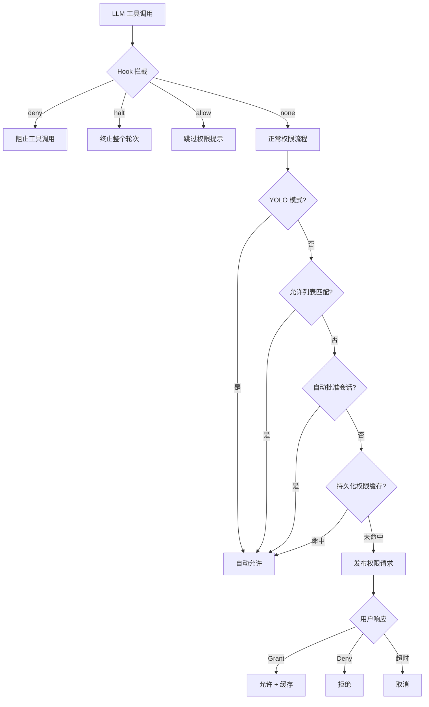

[上一篇：12-Shell执行引擎](12-Shell执行引擎.md) · [总目录](README.md) · [下一篇：14-Skills系统](14-Skills系统.md)

# 权限与安全

> **场景**：理解 Crush 的权限系统如何控制工具执行的安全边界，包括权限请求/授权/拒绝流程、自动批准会话、YOLO 模式、PreToolUse Hook 拦截机制、命令阻止列表以及 Docker MCP 白名单。
> **时间**：2026-08-27 (CST)
> **版本**：Crush @ main branch, Go 1.26.6

## 本文件内容

1. [架构概览](#1-架构概览)
2. [Permission Service 接口与实现](#2-permission-service-接口与实现)
3. [权限请求流程](#3-权限请求流程)
4. [权限授权与拒绝](#4-权限授权与拒绝)
5. [自动批准与 YOLO 模式](#5-自动批准与-yolo-模式)
6. [PreToolUse Hook 拦截](#6-pretooluse-hook-拦截)
7. [命令阻止列表](#7-命令阻止列表)
8. [Docker MCP 白名单](#8-docker-mcp-白名单)
9. [权限通知系统](#9-权限通知系统)
10. [安全设计总结](#10-安全设计总结)

## 1. 架构概览

```
┌──────────────────────────────────────────────────────┐
│ LLM 调用工具                                          │
│ bash / edit / write / view / mcp_* / lsp_*          │
├──────────────────────────────────────────────────────┤
│ Hook 拦截层 (hookedTool)                              │
│ PreToolUse hooks → allow / deny / halt               │
├──────────────────────────────────────────────────────┤
│ Permission Service                                    │
│ - 请求 (Request)                                      │
│ - 授权 (Grant / GrantPersistent)                     │
│ - 拒绝 (Deny)                                         │
│ - YOLO 模式 (skip all)                                │
│ - 自动批准会话                                        │
│ - 持久化权限缓存                                      │
├──────────────────────────────────────────────────────┤
│ UI 通知层                                             │
│ PermissionNotification → TUI / 远程客户端             │
├──────────────────────────────────────────────────────┤
│ 工具执行                                              │
└──────────────────────────────────────────────────────┘
```



## 2. Permission Service 接口与实现

### Service 接口

```
internal/permission/permission.go
Interface：Service
继承：pubsub.Subscriber[PermissionRequest]
```

方法：

| 方法 | 说明 |
|------|------|
| `Request(ctx, CreatePermissionRequest) (bool, error)` | 请求权限，阻塞等待用户响应 |
| `Grant(PermissionRequest) bool` | 授权一次（不缓存） |
| `GrantPersistent(PermissionRequest) bool` | 授权并缓存到会话 |
| `Deny(PermissionRequest) bool` | 拒绝 |
| `AutoApproveSession(sessionID)` | 标记会话为自动批准 |
| `SetSkipRequests(bool)` | 设置跳过所有权限请求（YOLO 模式） |
| `SkipRequests() bool` | 查询跳过状态 |
| `SubscribeNotifications(ctx)` | 订阅权限通知 |

### permissionService 结构

```
internal/permission/permission.go
Struct：permissionService
字段：notificationBroker → *pubsub.Broker[PermissionNotification]
字段：workingDir → string
字段：sessionPermissions → *csync.Map[PermissionKey, bool]
字段：pendingRequests → *csync.Map[string, chan bool]
字段：autoApproveSessions → map[string]bool
字段：skip → atomic.Bool
字段：allowedTools → []string
字段：requestMu → sync.Mutex
字段：activeRequest → *PermissionRequest
字段：activeRequestMu → sync.Mutex
```

### PermissionKey

```
Struct：PermissionKey
字段：SessionID → string
字段：ToolName → string
字段：Action → string
字段：Path → string
```

复合键——同一会话中，不同工具/动作/路径的权限独立缓存。例如 `bash.execute./tmp` 的授权不会自动适用于 `edit.write./tmp`。

### NewPermissionService

```
函数：NewPermissionService
偏移：+0 ～ +12
```

参数：
- `workingDir` — 工作目录，用于解析相对路径
- `skip` — 初始跳过状态（YOLO 模式）
- `allowedTools` — 允许列表（无需请求即通过的工具）

## 3. 权限请求流程

### Request

```
internal/permission/permission.go
函数：Request
偏移：+0 ～ +97
```

完整决策链（按优先级从高到低）：

```
Request(ctx, opts)
  │
  ├── 1. skip.Load() == true?
  │     └── 是 → 返回 true（YOLO 模式，跳过所有）
  │
  ├── 2. allowedTools 匹配?
  │     ├── "toolName:action" 在 allowedTools 中?
  │     └── "toolName" 在 allowedTools 中?
  │     └── 是 → 返回 true（允许列表）
  │
  ├── 3. hookApproved(ctx, toolCallID)?
  │     └── 是 → 发布 granted 通知，返回 true（Hook 预批准）
  │
  ├── 4. autoApproveSessions[sessionID]?
  │     └── 是 → 发布 granted 通知，返回 true（自动批准会话）
  │
  ├── 5. sessionPermissions 缓存命中?
  │     └── 是 → 发布 granted 通知，返回 true（持久化授权）
  │
  └── 6. 发布权限请求，阻塞等待
        │
        ├── 创建 PermissionRequest（UUID 作为 ID）
        ├── 路径解析：文件→取目录，目录→直接使用，"."→workingDir
        ├── 存入 pendingRequests map
        ├── Publish(CreatedEvent, request) — 通知 UI
        │
        └── select:
            ├── ctx.Done() → 返回 false, ctx.Err()
            └── respCh → 返回 granted, nil
```

### 路径解析

```
偏移：+43 ～ +55
```

```go
fileInfo, err := os.Stat(opts.Path)
dir := opts.Path
if err == nil {
    if fileInfo.IsDir() {
        dir = opts.Path
    } else {
        dir = filepath.Dir(opts.Path)
    }
}
if dir == "." {
    dir = s.workingDir
}
```

权限按目录粒度缓存——对 `/home/user/project/src/foo.go` 的编辑授权缓存为 `/home/user/project/src`，后续对同目录下其他文件的编辑自动通过。

### 请求序列化

```
字段：requestMu → sync.Mutex
```

`requestMu` 确保同一时间只有一个活跃权限请求——UI 不需要处理并发请求。`activeRequest` 字段跟踪当前请求，供 UI 查询。

## 4. 权限授权与拒绝

### resolve 辅助函数

```
函数：resolve
偏移：+0 ～ +27
```

原子化解决函数——所有三个公共方法（Grant、GrantPersistent、Deny）通过此函数路由：

1. `pendingRequests.Take(permission.ID)` — 原子取出并删除等待中的请求
   - 如果不存在 → 返回 false（已被其他调用方解决）
2. 执行 `onResolve` 回调（如果有）
3. 发布 `PermissionNotification`（granted/denied）
4. 向 respCh 发送结果（非阻塞，channel 有缓冲）
5. 清除 activeRequest（如果匹配）
6. 返回 true

**竞争安全**：多个 UI 订阅者可能同时尝试解决同一请求。`Take` 的原子性确保只有第一个调用方成功，后续调用返回 false。

### Grant

```
函数：Grant
```

```go
func (s *permissionService) Grant(permission PermissionRequest) bool {
    return s.resolve(permission, true, false, nil)
}
```

一次性授权——不缓存，下次同一工具+路径组合需要重新请求。

### GrantPersistent

```
函数：GrantPersistent
```

```go
func (s *permissionService) GrantPersistent(permission PermissionRequest) bool {
    return s.resolve(permission, true, false, func() {
        s.sessionPermissions.Set(PermissionKey{
            SessionID: permission.SessionID,
            ToolName:  permission.ToolName,
            Action:    permission.Action,
            Path:      permission.Path,
        }, true)
    })
}
```

授权并缓存——`onResolve` 回调在 `Take` 成功后、通知发布前执行。这确保只有赢得竞争的 `GrantPersistent` 才写入缓存——如果 `Deny` 先到达，`GrantPersistent` 的 `Take` 返回 false，缓存不会写入。

### Deny

```
函数：Deny
```

```go
func (s *permissionService) Deny(permission PermissionRequest) bool {
    return s.resolve(permission, false, true, nil)
}
```

拒绝——不写入缓存，下次同一组合需要重新请求。

## 5. 自动批准与 YOLO 模式

### YOLO 模式（SkipRequests）

```
字段：skip → atomic.Bool
方法：SetSkipRequests(bool) / SkipRequests() bool
```

通过 `--yolo` / `-y` 命令行标志启用：

```
internal/cmd/root.go
函数：rootCmd 配置
偏移：+62
```

```go
rootCmd.Flags().BoolP("yolo", "y", false, "Automatically accept all permissions (dangerous mode)")
```

在配置中设置：

```
internal/cmd/root.go
偏移：+349
store.Overrides().SkipPermissionRequests = yolo
```

当 `skip == true` 时，`Request` 函数在第一步就返回 true——跳过所有后续检查（允许列表、Hook、自动批准、缓存、UI 提示）。

### 自动批准会话

```
字段：autoApproveSessions → map[string]bool
字段：autoApproveSessionsMu → sync.RWMutex
方法：AutoApproveSession(sessionID)
```

标记特定会话为自动批准——该会话中的所有工具调用自动通过，但其他会话仍需正常请求。使用读写锁保护，读操作（`Request` 中的检查）使用 `RLock`，写操作（`AutoApproveSession`）使用 `Lock`。

### 允许列表（allowedTools）

```
函数：NewPermissionService 参数
字段：allowedTools → []string
```

格式为 `"toolName:action"` 或 `"toolName"`。在 `Request` 中检查：

```go
commandKey := opts.ToolName + ":" + opts.Action
if slices.Contains(s.allowedTools, commandKey) || slices.Contains(s.allowedTools, opts.ToolName) {
    return true, nil
}
```

`"toolName:action"` 精确匹配优先于 `"toolName"` 全局匹配。

## 6. PreToolUse Hook 拦截

### hookedTool 包装器

```
internal/agent/hooked_tool.go
Struct：hookedTool
字段：inner → fantasy.AgentTool
字段：runner → *hooks.Runner
```

`wrapToolsWithHooks` 在构建工具列表时包装每个工具：

```
函数：wrapToolsWithHooks
偏移：+0 ～ +9
```

- `runner == nil` → 不包装（无 hooks 配置）
- `isSubAgent == true` → 不包装（子 Agent 不触发 hooks）
- 否则 → 每个工具包装为 `hookedTool`

### hookedTool.Run 执行流程

```
函数：Run
偏移：+0 ～ +46
```

执行步骤：

1. 从 context 获取 sessionID
2. 调用 `h.runner.Run(ctx, EventPreToolUse, sessionID, call.Name, call.Input)`
3. **Deny 处理**：如果 `result.Decision == DecisionDeny`：
   - 返回错误响应，`Reason` 包含 hook 拒绝原因
   - 不执行内部工具
4. **Halt 处理**：如果 `result.Halt == true`：
   - 返回错误响应，`StopTurn = true` — 终止整个轮次
   - LLM 看到错误但不能继续调用工具
5. **InputRewrite**：如果 `result.UpdatedInput != ""`：
   - 替换 `call.Input` 为 hook 修改后的输入
6. **Allow 预批准**：如果 `result.Decision == DecisionAllow`：
   - `ctx = permission.WithHookApproval(ctx, call.ID)` — 标记为已预批准
7. 执行内部工具：`h.inner.Run(ctx, call)`
8. 如果 hook 提供了 `Context`，追加到工具响应
9. 合并 hook 元数据到工具响应

### Hook 决策类型

```
internal/hooks/hooks.go
Const：HaltExitCode = 49
```

| Decision | 值 | 说明 |
|----------|---|------|
| `DecisionNone` | 0 | 无意见——正常权限流程 |
| `DecisionAllow` | 1 | 允许——跳过权限提示 |
| `DecisionDeny` | 2 | 拒绝——阻止工具调用 |

### Hook 退出码

```
internal/hooks/runner.go
函数：runOne
偏移：+59 ～ +93
```

| 退出码 | 含义 | 结果 |
|--------|------|------|
| 0 | 正常退出 | 解析 stdout JSON 获取决策 |
| 2 | 阻止 | `DecisionDeny`，stderr 为原因 |
| 49 | 终止轮次 | `DecisionDeny + Halt`，stderr 为原因 |
| 其他 | 非阻塞错误 | `DecisionNone`，记录警告 |

### Hook 输出 JSON

退出码 0 时，hook 通过 stdout 输出 JSON：

```json
{
  "decision": "allow|deny|none",
  "halt": true|false,
  "reason": "...",
  "context": "...",
  "updated_input": {"key": "value"}
}
```

### aggregate 聚合

```
internal/hooks/hooks.go
函数：aggregate
偏移：+0 ～ +64
```

多个 hooks 的结果聚合规则：
- **Deny 优先**：任何 hook 返回 Deny → 最终 Deny
- **Allow 次之**：无 Deny 但有 Allow → 最终 Allow
- **None 最弱**：全部 None → 最终 None
- **Halt 粘性**：任何 hook 请求 Halt → 最终 Halt
- **Reason 连接**：所有 deny/halt 原因换行连接
- **UpdatedInput 浅合并**：按配置顺序浅合并，后者覆盖前者

### WithHookApproval

```
internal/permission/permission.go
函数：WithHookApproval
偏移：+0 ～ +2
```

```go
func WithHookApproval(ctx context.Context, toolCallID string) context.Context {
    return context.WithValue(ctx, hookApprovalKey{}, toolCallID)
}
```

在 context 中标记特定 toolCallID 为已预批准。`hookApproved` 检查 context 中的 toolCallID 是否匹配——不能跨调用重用。

## 7. 命令阻止列表

### BlockFunc 类型

```
internal/shell/shell.go
类型：BlockFunc = func(args []string) bool
```

### CommandsBlocker

```
函数：CommandsBlocker
偏移：+0 ～ +12
```

精确命令匹配——构建禁止集合，检查 `args[0]` 是否在集合中。

bash 工具使用此功能禁止危险命令：

```
internal/agent/tools/bash.go
Var：disabledCommands
```

包含 `rm`, `curl`, `wget`, `chmod`, `chown` 等命令——这些命令在 bash 工具中被阻止，LLM 不能直接执行。

### ArgumentsBlocker

```
函数：ArgumentsBlocker
偏移：+0 ～ +15
```

子命令 + 标志匹配——阻止特定 `cmd subcmd --flag` 组合。例如 `git push --force` 或 `git rebase`。

### blockHandler 中间件

```
internal/shell/run.go
函数：blockHandler
```

在 shell 执行中间件链中，`blockHandler` 遍历所有 `blockFuncs`，如果任何函数返回 true，返回错误：`"command is not allowed for security reasons: %q"`。

中间件链顺序（见第 12 篇）：
1. builtinHandler（内置命令）
2. scriptDispatchHandler（脚本分发）
3. **blockHandler（阻止列表）**
4. coreUtilsExecHandler（Go coreutils，可选）

阻止列表在脚本分发之后——确保 deny 规则能看到已解析的 argv，而非外层路径前缀包装。

## 8. Docker MCP 白名单

```
internal/agent/tools/mcp-tools.go
Var：whitelistDockerTools
```

```go
var whitelistDockerTools = []string{
    "mcp_docker_mcp-find",
    "mcp_docker_mcp-add",
    "mcp_docker_mcp-remove",
    "mcp_docker_mcp-config-set",
    "mcp_docker_code-mode",
}
```

这些 Docker MCP 管理工具不需要权限请求即直接执行。它们是元数据管理工具（查找、添加、移除 MCP 服务器），不直接操作用户数据。

### 检查逻辑

```
internal/agent/tools/mcp-tools.go
函数：Tool.Run
偏移：+6 ～ +26
```

```go
if !slices.Contains(whitelistDockerTools, params.Name) {
    // 请求权限
    p, err := m.permissions.Request(ctx, permission.CreatePermissionRequest{...})
    if !p {
        return NewPermissionDeniedResponse(), nil
    }
}
```

## 9. 权限通知系统

### PermissionNotification

```
Struct：PermissionNotification
字段：ToolCallID → string
字段：Granted → bool
字段：Denied → bool
```

### 通知发布时机

| 事件 | 通知内容 |
|------|---------|
| 请求发出 | `ToolCallID` only（granted=false, denied=false） |
| YOLO 模式通过 | `ToolCallID, Granted=true` |
| Hook 预批准 | `ToolCallID, Granted=true` |
| 自动批准通过 | `ToolCallID, Granted=true` |
| 缓存命中通过 | `ToolCallID, Granted=true` |
| Grant/Deny | `ToolCallID, Granted/Denied=true` |

### notificationBroker

```
字段：notificationBroker → *pubsub.Broker[PermissionNotification]
方法：SubscribeNotifications(ctx) → <-chan pubsub.Event[PermissionNotification]
```

独立的 pubsub broker——与权限请求的 broker 分离。UI 通过 `SubscribeNotifications` 订阅通知，显示权限提示对话框或更新状态指示器。

## 10. 安全设计总结

### 多层防御

```
┌─────────────────────────────────────────┐
│ 第 1 层：Hook 拦截                       │
│ PreToolUse hooks → allow/deny/halt     │
│ 用户自定义安全策略                       │
├─────────────────────────────────────────┤
│ 第 2 层：命令阻止列表                    │
│ BlockFuncs → 禁止危险命令               │
│ 在 shell 解释器层执行                    │
├─────────────────────────────────────────┤
│ 第 3 层：权限请求                        │
│ Request → 用户手动确认                  │
│ 支持持久化授权缓存                       │
├─────────────────────────────────────────┤
│ 第 4 层：进程隔离                        │
│ Setsid → 子进程独立会话                 │
│ 防止信号干扰父进程                       │
├─────────────────────────────────────────┤
│ 第 5 层：环境变量清理                    │
│ 移除 herdr 变量                         │
│ 防止子进程获取面板权限                   │
└─────────────────────────────────────────┘
```

### 设计要点

1. **竞争安全**：`resolve` 使用 `Take` 原子操作，确保多 UI 订阅者并发解决时只有第一个生效
2. **GrantPersistent 竞争保护**：缓存写入在 `Take` 成功后执行——如果 `Deny` 先到达，`GrantPersistent` 不会泄漏缓存条目
3. **Hook 预批准不可重用**：`WithHookApproval` 绑定特定 toolCallID，不能跨调用复用
4. **路径粒度缓存**：权限按目录缓存，避免对同一目录下不同文件的重复提示
5. **子 Agent 不触发 hooks**：`wrapToolsWithHooks` 在 `isSubAgent == true` 时跳过——只有顶层工具调用触发 hooks
6. **阻止列表递归应用**：脚本分发后应用阻止列表，确保脚本内命令也受约束

---

[上一篇：12-Shell执行引擎](12-Shell执行引擎.md) · [总目录](README.md) · [下一篇：14-Skills系统](14-Skills系统.md)