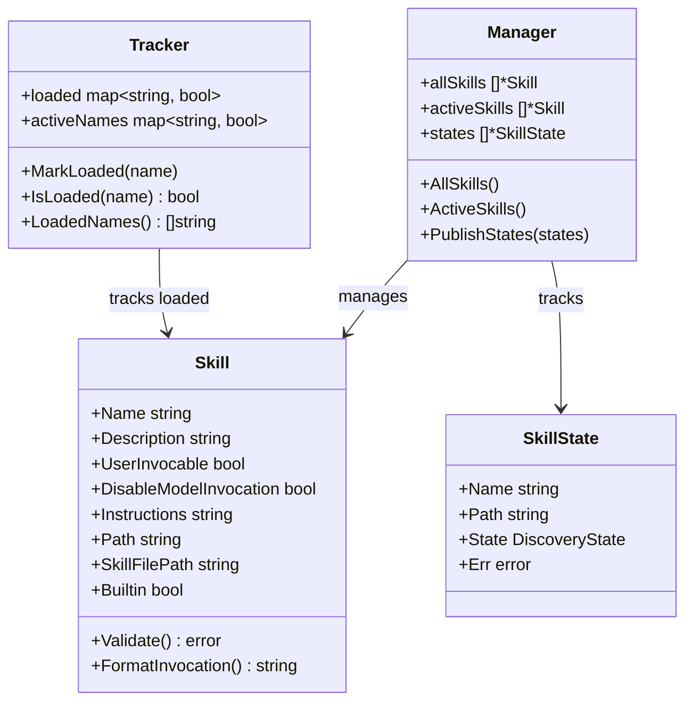

[上一篇：13-权限与安全](13-权限与安全.md) · [总目录](README.md) · [下一篇：15-TUI终端界面](15-TUI终端界面.md)

# Skills 系统

> **场景**：理解 Crush 的 Agent Skills 系统如何发现、解析、过滤和注入技能到 LLM 上下文，包括内置技能的嵌入式文件系统、用户技能的文件系统扫描、SKILL.md 格式解析、技能去重与禁用、系统提示注入以及会话内技能加载追踪。
> **时间**：2026-08-27 (CST)
> **版本**：Crush @ main branch, Go 1.26.6, Agent Skills open standard (https://agentskills.io)

## 本文件内容

1. [架构概览](#1-架构概览)
2. [SKILL.md 格式与解析](#2-skillmd-格式与解析)
3. [技能发现](#3-技能发现)
4. [内置技能](#4-内置技能)
5. [去重与过滤](#5-去重与过滤)
6. [Manager：工作区级状态管理](#6-manager工作区级状态管理)
7. [Tracker：会话内加载追踪](#7-tracker会话内加载追踪)
8. [系统提示注入](#8-系统提示注入)
9. [Catalog：技能目录与读取](#9-catalog技能目录与读取)
10. [与 Coordinator 的集成](#10-与-coordinator-的集成)

## 1. 架构概览

```
┌──────────────────────────────────────────────────────┐
│ Coordinator                                          │
│ discoverSkills / DiscoverFromConfig                  │
│ 构建 allSkills + activeSkills + states               │
├──────────────────────────────────────────────────────┤
│ Skills 包 (internal/skills/)                         │
│ skills.go    — Skill 结构、解析、发现、去重、过滤      │
│ embed.go     — 内置技能（//go:embed builtin/*）       │
│ manager.go   — 工作区级 Manager、DiscoverFromConfig   │
│ tracker.go   — 会话内加载追踪                         │
│ catalog.go   — Catalog 目录、ReadContent、来源标签     │
├──────────────────────────────────────────────────────┤
│ 数据来源                                              │
│ 内置技能 → embed.FS (builtin/*)                      │
│ 用户技能 → cfg.Options.SkillsPaths (文件系统)         │
├──────────────────────────────────────────────────────┤
│ 输出                                                  │
│ ToPromptXML → <available_skills> 注入系统提示         │
│ FormatInvocation → <loaded_skill> 注入用户消息        │
│ Catalog → UI 显示技能列表                             │
└──────────────────────────────────────────────────────┘
```



## 2. SKILL.md 格式与解析

### Skill 结构

```
internal/skills/skills.go
Struct：Skill
字段：Name                   → string (yaml:"name")
字段：Description            → string (yaml:"description")
字段：UserInvocable          → bool   (yaml:"user-invocable")
字段：DisableModelInvocation → bool   (yaml:"disable-model-invocation")
字段：License                → string (yaml:"license,omitempty")
字段：Compatibility          → string (yaml:"compatibility,omitempty")
字段：Metadata               → map[string]string (yaml:"metadata,omitempty")
字段：Instructions           → string (yaml:"-") — frontmatter 之后的正文
字段：Path                   → string (yaml:"-") — SKILL.md 所在目录
字段：SkillFilePath          → string (yaml:"-") — SKILL.md 完整路径
字段：Builtin                → bool   (yaml:"-") — 是否为内置技能
```

### 常量

```
Const：SkillFileName = "SKILL.md"
Const：MaxNameLength = 64
Const：MaxDescriptionLength = 1024
Const：MaxCompatibilityLength = 500
```

### Validate

```
函数：Validate
偏移：+0 ～ +29
```

验证规则：
1. **Name 必填**：空则报错
2. **Name 长度**：不超过 64 字符
3. **Name 格式**：匹配 `^[a-zA-Z0-9]+(-[a-zA-Z0-9]+)*$` — 字母数字+连字符，不允许首尾或连续连字符
4. **Name 与目录一致**：`filepath.Base(s.Path)` 必须与 `s.Name` 匹配（忽略大小写）
5. **Description 必填**：空则报错
6. **Description 长度**：不超过 1024 字符
7. **Compatibility 长度**：不超过 500 字符

### splitFrontmatter

```
函数：splitFrontmatter
偏移：+0 ～ +26
```

从 Markdown 内容中提取 YAML frontmatter 和正文：

1. 去除 UTF-8 BOM
2. 统一换行符为 `\n`
3. 查找第一个非空行 — 必须是 `---`
4. 查找下一个 `---` 作为 frontmatter 结束
5. 返回 frontmatter（`---` 之间的内容）和 body（第二个 `---` 之后的内容）

### ParseContent

```
函数：ParseContent
偏移：+0 ～ +14
```

1. 调用 `splitFrontmatter` 分离 frontmatter 和 body
2. `yaml.Unmarshal` 解析 frontmatter 到 `Skill` 结构
3. `strings.TrimSpace(body)` 作为 `Instructions`

### Parse

```
函数：Parse
偏移：+0 ～ +14
```

从磁盘读取 SKILL.md 文件，调用 `ParseContent` 解析，设置 `Path`（目录）和 `SkillFilePath`（完整路径）。

## 3. 技能发现

### DiscoverWithStates

```
函数：DiscoverWithStates
偏移：+0 ～ +74
```

并发文件系统扫描：

1. 对每个路径使用 `fastwalk.Walk`（并发遍历，跟随符号链接）
2. 查找名为 `SKILL.md` 的文件
3. 使用 `seen` map 去重（按路径）
4. 调用 `Parse(path)` 解析
5. 调用 `skill.Validate()` 验证
6. 成功 → 添加到 skills 列表
7. 失败 → 添加到 states 列表（带错误信息）
8. 最终按路径排序、再按名称排序（`fastwalk` 遍历顺序不确定）

### fastwalk vs filepath.WalkDir

源码注释说明：`filepath.WalkDir` 不跟随符号链接的子目录（只在入口点跟随）。`fastwalk` 配置 `Follow: true` 确保符号链接目录中的技能也被发现。`fastwalk` 是并发的，共享状态（`seen`、`skills`）通过 `mu` 保护。

## 4. 内置技能

### 嵌入式文件系统

```
internal/skills/embed.go
//go:embed builtin/*
Var：builtinFS → embed.FS
Const：BuiltinPrefix = "crush://skills/"
```

内置技能在编译时嵌入二进制文件中。路径前缀 `crush://skills/` 用于区分内置技能和磁盘技能。

### DiscoverBuiltinWithStates

```
函数：DiscoverBuiltinWithStates
偏移：+0 ～ +48
```

1. `fs.WalkDir(builtinFS, "builtin", ...)` — 遍历嵌入式文件系统
2. 查找名为 `SKILL.md` 的文件
3. `builtinFS.ReadFile(path)` — 读取文件内容
4. `ParseContent(content)` — 解析
5. 设置路径为 `BuiltinPrefix + relPath`（如 `crush://skills/crush-config/SKILL.md`）
6. 设置 `skill.Builtin = true`
7. 调用 `skill.Validate()` 验证
8. 返回技能列表和状态列表

### 内置技能内容

内置技能文件位于 `internal/skills/builtin/` 目录下，每个技能一个子目录，包含 `SKILL.md` 文件。具体技能列表和内容由源码决定，当前源码无法确定完整列表。

## 5. 去重与过滤

### Deduplicate

```
函数：Deduplicate
偏移：+0 ～ +14
```

按名称去重——当存在同名技能时，**最后一个胜出**。这意味着用户技能（后追加）覆盖同名的内置技能（先追加）。

```go
func Deduplicate(all []*Skill) []*Skill {
    seen := make(map[string]int, len(all))
    for i, s := range all {
        seen[s.Name] = i
    }
    result := make([]*Skill, 0, len(seen))
    for i, s := range all {
        if seen[s.Name] == i {
            result = append(result, s)
        }
    }
    return result
}
```

### DeduplicateStates

```
函数：DeduplicateStates
偏移：+0 ～ +15
```

与 `Deduplicate` 类似，但额外保留无名称的状态（错误状态，`Name == ""`）。

### Filter

```
函数：Filter
偏移：+0 ～ +17
```

按 `DisabledSkills` 列表过滤——名称在禁用列表中的技能被移除。

## 6. Manager：工作区级状态管理

### Manager 结构

```
internal/skills/manager.go
Struct：Manager
字段：mu → sync.RWMutex
字段：allSkills → []*Skill
字段：activeSkills → []*Skill
字段：states → []*SkillState
字段：resolvedPaths → []string
字段：workingDir → string
字段：broker → *pubsub.Broker[Event]
字段：globalMirror → bool
```

每个工作区一个 `Manager` 实例，持有该工作区的技能发现结果。

### ManagerOption

```
类型：ManagerOption = func(*Manager)
```

| 选项 | 说明 |
|------|------|
| `WithGlobalMirror()` | 将状态变更转发到包级缓存和 broker |
| `WithResolvedPaths(paths)` | 存储已解析的技能路径 |
| `WithWorkingDir(dir)` | 存储工作目录 |

### globalMirror

`WithGlobalMirror` 使 Manager 的 `SetLatestStates` 和 `PublishStates` 调用同时更新包级缓存（`latestStates`）和发布包级事件。仅当进程托管单个工作区时安全——后端服务器托管多工作区，不能启用镜像。

### DiscoverFromConfig

```
函数：DiscoverFromConfig
偏移：+0 ～ +23
```

完整的发现流程：

1. 调用 `DiscoverBuiltinWithStates()` — 发现内置技能
2. 解析用户路径：`cfg.ResolvePaths()`
3. 如果有用户路径，调用 `DiscoverWithStates(userPaths)` — 发现用户技能
4. 合并内置 + 用户技能
5. `Deduplicate(discovered)` — 去重（用户覆盖内置）
6. `Filter(allSkills, cfg.DisabledSkills)` — 过滤禁用技能
7. 合并并去重状态
8. 按路径排序状态
9. 返回 `allSkills`、`activeSkills`、`states`

### DiscoveryConfig

```
Struct：DiscoveryConfig
字段：SkillsPaths → []string
字段：DisabledSkills → []string
字段：WorkingDir → string
字段：Resolver → func(string) (string, error)
```

### ResolvePaths

```
函数：ResolvePaths
偏移：+0 ～ +15
```

1. `home.Long(pth)` — 展开 `~` 为家目录
2. 如果以 `$` 开头且有 Resolver，调用 Resolver 解析环境变量
3. 返回解析后的路径列表

### PublishStates

```
函数：PublishStates
偏移：+0 ～ +11
```

单一变更点——更新 Manager 缓存，发布事件到 Manager 的 broker，如果启用镜像则同时发布到包级 broker。

## 7. Tracker：会话内加载追踪

### Tracker 结构

```
internal/skills/tracker.go
Struct：Tracker
字段：mu → sync.RWMutex
字段：loaded → map[string]bool
字段：activeNames → map[string]bool
```

### NewTracker

```
函数：NewTracker
偏移：+0 ～ +9
```

从 `activeSkills` 构建 `activeNames` 集合——只有活跃技能（未被禁用、未被覆盖）才能被标记为已加载。

### MarkLoaded

```
函数：MarkLoaded
偏移：+0 ～ +11
```

只在 `activeNames` 集合中的技能才会被标记——如果内置技能被用户技能覆盖，只有用户技能（活跃的那个）能被标记为已加载。防止错误归属。

### LoadedNames

```
函数：LoadedNames
偏移：+0 ～ +12
```

返回按字母排序的已加载技能名称列表。`nil` Tracker 安全调用（返回 nil）。

### LoadedCount

```
函数：LoadedCount
```

返回已加载技能数量。`nil` Tracker 安全调用（返回 0）。

## 8. 系统提示注入

### ToPromptXML

```
函数：ToPromptXML
偏移：+0 ～ +22
```

生成 `<available_skills>` XML 元素注入系统提示：

```xml
<available_skills>
  <skill>
    <name>skill-name</name>
    <description>skill description</description>
    <location>/path/to/SKILL.md</location>
    <type>builtin</type>   <!-- 仅内置技能 -->
  </skill>
  ...
</available_skills>
```

排除 `DisableModelInvocation == true` 的技能——这些技能不向模型广告，只能由用户显式调用。

### FormatInvocation

```
函数：FormatInvocation
偏移：+0 ～ +11
```

当用户通过 `/skill-name` 命令调用技能时，生成 `<loaded_skill>` XML 元素：

```xml
<loaded_skill>
  <name>skill-name</name>
  <description>skill description</description>
  <location>/path/to/SKILL.md</location>
  <instructions>
    ...SKILL.md 正文内容...
  </instructions>
</loaded_skill>
```

这会将完整的技能指令注入到用户消息中，使 LLM 在当前轮次中遵循这些指令。

### escape

```
函数：escape
```

使用 `strings.NewReplacer` 对 XML 特殊字符进行转义：`&` → `&amp;`, `<` → `&lt;`, `>` → `&gt;`, `"` → `&quot;`, `'` → `&apos;`。

### ApproxTokenCount

```
函数：ApproxTokenCount
```

```go
func ApproxTokenCount(s string) int {
    return (len(s) + 3) / 4
}
```

使用 ~4 字符/token 启发式估算 token 数量。用于日志记录技能发现后的系统提示大小。

## 9. Catalog：技能目录与读取

### SourceType

```
internal/skills/catalog.go
Const：SourceSystem  = "system"  — 内置技能
Const：SourceUser    = "user"    — 用户全局技能
Const：SourceProject = "project" — 项目级技能
```

### Catalog

```
函数：Catalog
偏移：+0 ～ +14
```

从活跃技能列表构建 `CatalogEntry` 列表，每个条目包含 ID（SkillFilePath）、名称、描述、标签、来源和是否用户可调用。

### skillLabel

```
函数：skillLabel
偏移：+0 ～ +23
```

确定技能的来源标签：

1. 如果 `skill.Builtin` → `system:{name}`
2. 如果技能路径在 `skillPaths` 中：
   - 如果路径在工作目录内 → `project:{dir}`
   - 否则 → `user:{dir}`
3. 未匹配到路径 → `user:{dir}`

### isProjectSkillPath

```
函数：isProjectSkillPath
```

判断技能路径是否在工作目录内——通过 `filepath.Rel` 计算相对路径，检查是否逃逸父目录。

### ReadContent

```
函数：ReadContent
偏移：+0 ～ +24
```

读取技能文件内容：

1. `FindEffective(active, skillID)` — 在活跃技能中查找
2. 如果是内置技能：从 `builtinFS` 读取
3. 如果是磁盘技能：`os.ReadFile(skill.SkillFilePath)`
4. 返回内容和 `SkillReadResult`（名称、描述、来源、是否内置）

### FindEffective

```
函数：FindEffective
偏移：+0 ～ +7
```

按 `SkillFilePath` 匹配查找活跃技能。未找到返回 `ErrSkillNotFound`。

## 10. 与 Coordinator 的集成

### 技能发现

```
internal/agent/coordinator.go
函数：discoverSkills
偏移：+0 ～ +19
```

fallback 包装器——当没有 `skills.Manager` 传入 coordinator 时使用。生产代码（`backend.CreateWorkspace`、`setupLocalWorkspace`）预先运行发现并传入结果。

执行步骤：
1. 从 `cfg.Config().Options` 获取 `SkillsPaths` 和 `DisabledSkills`
2. 获取 Resolver
3. 调用 `skills.DiscoverFromConfig`
4. `logDiscoveryStats` 记录发现统计
5. 返回 `allSkills` 和 `activeSkills`

### Coordinator 集成

```
internal/agent/coordinator.go
Struct：coordinator
字段：skillTracker → *skills.Tracker (偏移 +133)
字段：allSkills → []*skills.Skill
字段：activeSkills → []*skills.Skill
字段：Skills → *skills.Manager (偏移 +152)
```

构建时（`NewCoordinator`）：
1. 接收 `skills.Manager` 或调用 `discoverSkills` fallback
2. 创建 `skills.NewTracker(activeSkills)` — 初始化加载追踪器

### 运行时使用

#### 系统提示构建

```
internal/agent/coordinator.go
偏移：+1603
xml := skills.ToPromptXML(activeSkills)
```

`activeSkills` 的 XML 表示注入到系统提示，使 LLM 知道可用技能。

#### View 工具集成

```
偏移：+729
tools.NewViewTool(c.lspManager, c.permissions, c.filetracker, c.skillTracker, ...)
```

View 工具接收 `skillTracker`——当 LLM 读取 SKILL.md 文件时，View 工具调用 `skillTracker.MarkLoaded(name)` 记录已加载技能。

#### CrushInfo 工具集成

```
偏移：+716
tools.NewCrushInfoTool(c.cfg, c.lspManager, c.allSkills, c.activeSkills, c.skillTracker)
```

CrushInfo 工具向 LLM 报告已加载和可用技能。

#### 轮次日志

```
函数：logTurnSkillUsage
偏移：+0 ～ +33
```

每轮开始前记录已加载技能名称，轮次结束后比较差异，记录本轮新加载的技能。用于诊断"应该加载但未加载"的情况。

#### 发现统计日志

```
函数：logDiscoveryStats
偏移：+0 ～ +40
```

单次结构化日志，记录：内置成功/错误数、用户成功/错误数、去重后总数、活跃数、禁用数、系统提示 XML 字节数和估算 token 数。

---

[上一篇：13-权限与安全](13-权限与安全.md) · [总目录](README.md) · [下一篇：15-TUI终端界面](15-TUI终端界面.md)