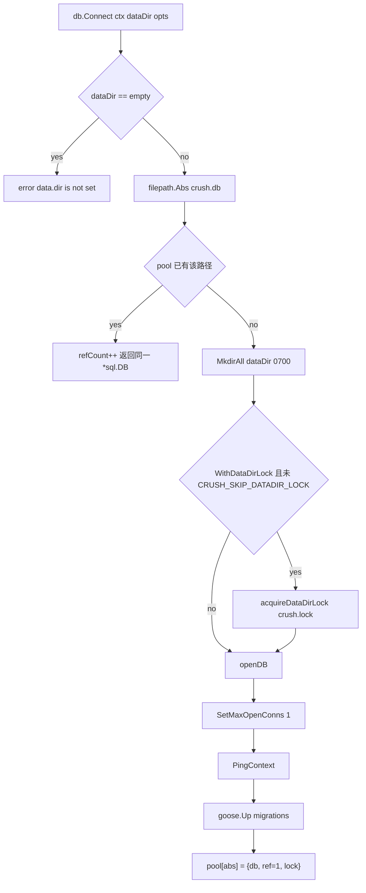
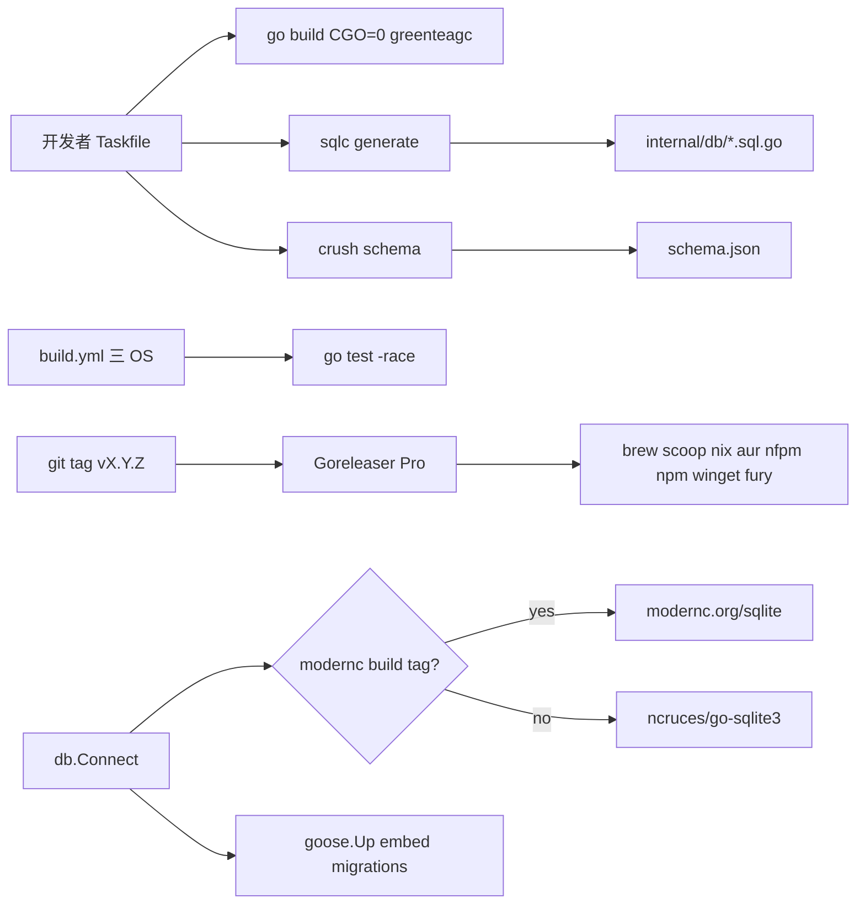

# 14. 构建、部署、发布与运维

> 状态：待复核生成稿
> 生成日期：2026-08-16
> 基准提交：`16dce459cafecee92eae0ed7c47a0c641c8bbb9f`
> 工作区：clean
> 源码范围：`Taskfile.yaml`、`sqlc.yaml`、`internal/db/`、`.goreleaser.yml`、`.github/`、`flake.nix`、`go.mod`、`schema.json` 生成路径、跨平台 `cmd`/`db` 文件
> 生成方式：源码、测试、配置与部署资产静态分析
> 所属层：第四层

## 快速摘要

### 架构总览（模块与依赖）

Crush 用 **Taskfile** 做开发者入口（build/test/lint/fmt/sqlc/schema/swag），
用 **sqlc + goose** 把 `internal/db/sql/*.sql` 与 `internal/db/migrations/*.sql`
变成 Go 与运行时 Schema，用 **Goreleaser Pro** 做多平台二进制与包管理器分发，
用 **GitHub Actions** 做 PR 构建、快照、正式发布、schema 自动回写和安全扫描。
运行时 SQLite **无 CGO**：主流 OS/ARCH 走 `modernc.org/sqlite`，其余走
`github.com/ncruces/go-sqlite3`（WASM）。`CGO_ENABLED=0` 与
`GOEXPERIMENT=greenteagc` 是构建契约，lint 任务会关掉 greenteagc 以免工具链不认。

依赖方向：开发者/CI → Taskfile 或 workflow → `go build`/`sqlc`/`swag` →
产物（二进制、`schema.json`、swagger、发行包）。运行期运维面是数据目录里的
`crush.db`、日志、可选 unix socket、以及 `crush logs`/`stats`/`session`。

### 核心调用序列（逐步逻辑）

1. 日常：`task build` 在 `CGO_ENABLED=0`、`GOEXPERIMENT=greenteagc` 下
   `go build`，可选把 `git describe` 写入 `version.Version`。
2. Schema 变更：改 `internal/db/sql/` 或 `migrations/` → `task sqlc` →
   生成 `internal/db/*.sql.go`；进程里 `db.Connect` 调 `goose.Up`。
3. 配置 JSON Schema：`task schema` / `go run main.go schema > schema.json`，
   枚举来自 catwalk + Hyper + discover（`cmd/schema.go`）。
4. CI `build.yml`：ubuntu/mac/windows 上 `go mod tidy` 差分检查、
   `go build -race`、`go test -race -failfast`。
5. 打 tag `v*.*.*` → `release.yml` 复用 `charmbracelet/meta` 的 Goreleaser
   工作流；`before.hooks` 生成 completion 与 manpage。
6. 跨平台：Windows named pipe + DETACHED_PROCESS；Unix socket + Setsid；
   SQLite 驱动按 GOOS/GOARCH 选择 modernc 或 ncruces。

### 易错点与边界条件

- **不要**宣称本轮测试已运行通过。`build.yml` 在 CI 跑 `-race`；本地
  `task test` 同样带 `-race`，但本文只做静态阅读。
- `task lint` / `lint:fix` 把 `GOEXPERIMENT` 置 `null`，与 build/release 不一致。
- 本地 `db.Connect` 默认**不加** data-dir flock；Server 工作区路径才
  `WithDataDirLock(true)`。两个本地 crush 可以同时打开同一 `crush.db`。
- AUR 源码包的 `build` 段使用 `CGO` 环境变量和 `-buildmode=pie`，与主
  Goreleaser `CGO_ENABLED=0` 二进制线不同。
- `schema-update.yml` 用 PAT 直接 commit 到 main，路径过滤
  `internal/config/**` 与 `internal/agent/hyper/**`。
- Goreleaser / CI secrets 名称可以写，**值禁止出现在文档里**。
- `GetLastSession` 不过滤子 Session；本地 `--continue` 与 CS `--continue`
  的 SQL 语义不一致。goose Down 存在于迁移文件，运行时 `Connect` 只 `Up`。
- 仓库没有 Dockerfile；容器分发不是本项目的一等发布通道。

## 目录

1. [为什么这样设计（Why）](#1-为什么这样设计why)
2. [它是什么（What）](#2-它是什么what)
3. [Taskfile 全表（How）](#3-taskfile-全表how)
4. [Go 模块、CGO 与 GC 实验](#4-go-模块cgo-与-gc-实验)
5. [sqlc、迁移与连接池](#5-sqlc迁移与连接池)
6. [跨平台：CLI detach、信号、SQLite 驱动](#6-跨平台cli-detach信号sqlite-驱动)
7. [`schema.json` 与 Swagger](#7-schemajson-与-swagger)
8. [Goreleaser 发布矩阵](#8-goreleaser-发布矩阵)
9. [GitHub Actions](#9-github-actions)
10. [Nix flake 与本地运维面](#10-nix-flake-与本地运维面)
11. [调用关系表](#11-调用关系表)
12. [阅读源码建议顺序](#12-阅读源码建议顺序)
13. [重新实现检查清单](#13-重新实现检查清单)

## 1. 为什么这样设计（Why）

Crush 要在终端用户的机器上跑，不能依赖系统 libsqlite 或 CGO 交叉编译。所以
构建默认 `CGO_ENABLED=0`，SQLite 用纯 Go 实现，并按架构切 modernc / ncruces：
modernc 覆盖常见桌面/服务器，ncruces 用 WASM 兜底（android 其他 arch、冷门
unix 等）。

发布走 Charm 的标准 Goreleaser Pro 模板：一次 tag 产出 Homebrew、Scoop、Nix、
AUR、nfpm（deb/rpm/apk/arch）、npm、Winget、Fury、签名与 SBOM。开发者日常不
直接跑 goreleaser，而是 Taskfile。CI 把“能编译+能测”与“能出快照/正式包”
拆开：每个 PR 在三 OS 上 build/test；main 上额外 snapshot；tag 才 notarize
和推包。

数据库用 goose 嵌入迁移 + sqlc 生成查询，避免手写 `database/sql` 扫描。
`schema.json` 从 `config.Config` 反射生成，是编辑器补全的契约，必须随
Provider 类型自动更新，所以 hidden `crush schema` 会改写 `type` enum。

## 2. 它是什么（What）

| 资产 | 路径 | 角色 |
|---|---|---|
| Task 运行器 | `Taskfile.yaml` | 本地 build/test/lint/生成 |
| Go 模块 | `go.mod` | 模块路径 `github.com/charmbracelet/crush`，Go `1.26.5` |
| sqlc | `sqlc.yaml`、`internal/db/sql/` | 生成 `internal/db/*.sql.go` |
| 迁移 | `internal/db/migrations/*.sql` | goose，embed 进二进制 |
| 连接 | `internal/db/connect.go` + `connect_modernc.go` / `connect_ncruces.go` | 打开 SQLite、pragma、pool |
| 发布 | `.goreleaser.yml` | 多平台构建与分发 |
| CI | `.github/workflows/*.yml` | 测试、快照、release、schema、安全 |
| 开发壳 | `flake.nix` | Nix 提供 go_1_26、sqlc、gofumpt、go-task |
| 配置 Schema | `schema.json`（生成物） | `crush schema` 的 stdout 重定向 |
| OpenAPI | `internal/swagger/`（生成物） | `task swag` 从 `main.go` 注释生成 |
| Lint | `.golangci.yml`、`scripts/check_log_capitalization.sh` | 静态检查 |
| macOS 签名 | `.github/entitlements.plist` | `cs.allow-unsigned-executable-memory` |

sqlc 生成文件头写明 `sqlc v1.30.0`。重新生成必须能兼容该版本的输出约定
（`emit_json_tags`、`emit_prepared_queries`、`emit_interface`、`emit_empty_slices`）。

## 3. Taskfile 全表（How）

全局 `env`：

```text
CGO_ENABLED: 0
GOEXPERIMENT: greenteagc
```

全局 `vars`：

- `VERSION`：`git describe --long`，失败则空字符串。
- `RACE`：若存在 `race.log` 则为 `"1"`，build 会加 `-race`，`task run` 把
  stderr 重定向到 `race.log`。

| Task | 做什么 | 关键细节 |
|---|---|---|
| `lint:install` | `go install golangci-lint/v2@latest` | `GOTOOLCHAIN=go1.25.0`（与项目 Go 1.26.5 不同，推断是安装器兼容） |
| `lint` | 先 `lint:log` 再 `golangci-lint run --path-mode=abs --config=.golangci.yml --timeout=5m` | **`GOEXPERIMENT: null`** |
| `lint:log` | `scripts/check_log_capitalization.sh` | grep `slog.(Error\|Info\|...)` 的字符串字面量是否小写开头 |
| `lint:fix` | golangci-lint `--fix` | 同样关掉 GOEXPERIMENT |
| `build` | `go build -v [ -race ] [ldflags Version] .` | sources 含 `**/*.go`、`go.mod`、agent md/tpl、`hyper/provider.json`；产物 `crush` / `crush.exe` |
| `run` | build 后执行 `./crush {{.CLI_ARGS}}` | `RACE` 时 `2>race.log` |
| `run:catwalk` | 同上，`CATWALK_URL=http://localhost:8080` | 本地 Catwalk |
| `run:onboarding` | `CRUSH_GLOBAL_DATA/CONFIG=tmp/onboarding/...`，先 `rm -rf tmp/onboarding` | 测首次配置 |
| `test` | `go test -race -failfast ./... {{.CLI_ARGS}}` | 带 race；本文未执行 |
| `test:record` / `record` | 删 `internal/agent/testdata` 后 `go test -v -count=1 -timeout=1h ./internal/agent` | 重录 VCR |
| `fmt` | `gofumpt -w .` | 全仓库 |
| `fmt:html` | prettier 写 `internal/cmd/stats/index.{html,css,js}` | stats 页面 |
| `modernize` | `go run golang.org/x/tools/.../modernize@latest -fix -test ./...` | 代码现代化 |
| `dev` | `CRUSH_PROFILE=true go run .` | 开 pprof :6060 |
| `install` | `fetch-tags` 后 `go install [ldflags] -v .` | 装到 GOPATH/bin |
| `profile:cpu` | pprof HTTP 拉 10s CPU | 需已 `task dev` |
| `profile:heap` | heap profile | 同上 |
| `profile:allocs` | allocs profile | 同上 |
| `schema` | `go run main.go schema > schema.json` | 生成物 `schema.json` |
| `hyper` | `go generate ./internal/agent/hyper/...` | 更新嵌入 `provider.json` |
| `release` | 确认 main、干净工作区、build.yml 与 snapshot.yml 对该 commit 成功，然后空提交 + 签名 annotated tag + push `--follow-tags` | `svu next --always`；有 prompt |
| `fetch-tags` | 删本地 `nightly` tag 再 `git fetch --tags` | 避免 describe 被 nightly 污染 |
| `deps` | `go get fantasy@latest catwalk@latest` + tidy | `GOPROXY=direct`、`GONOSUMDB=charm.land/*` |
| `swag` | `swag init --generalInfo main.go --dir . --output internal/swagger --packageName swagger --parseDependency --parseInternal --parseDepth 5` | 版本钉死 `v1.16.6` |
| `sqlc` | `sqlc generate` | 读 `sqlc.yaml` |

没有名为 `swagger` 的 task；OpenAPI 对应 `swag`。

`release` 的前置条件（`preconditions`）全部是 shell：

1. 当前分支必须是 `main`。
2. `git status --porcelain=2` 行数为 0。
3. `gh run list --workflow build.yml --commit HEAD --status success` 的
   conclusion 含 success。
4. 对 `snapshot.yml` 同样要求。

然后：`fetch-tags` → `git commit --allow-empty -m "{{.NEXT}}"` →
`git tag --annotate --sign -m "{{.NEXT}}" {{.NEXT}}` →
`git push origin main --follow-tags`。真正编包的是 tag 触发的
`goreleaser` workflow，不是这个 task 在本机跑 goreleaser。

`.golangci.yml` 启用：bodyclose、goprintffuncname、misspell、noctx、
nolintlint、rowserrcheck、sqlclosecheck、staticcheck、tparallel、whitespace。
关闭 errcheck、ineffassign、unused。formatter：gofumpt + goimports。
`noctx` 对 slog/log 调用放行。`issues.max-issues-per-linter: 0` 表示不截断。

`scripts/check_log_capitalization.sh`：在仓库内搜
`slog.(Error|Info|Warn|Debug|Fatal|Print|Println|Printf)("` 后紧跟小写字母则
exit 1。只覆盖字符串字面量，拼出来的动态消息查不到。

## 4. Go 模块、CGO 与 GC 实验

`go.mod`：

- `module github.com/charmbracelet/crush`
- `go 1.26.5`

直接依赖里与本篇相关的：`github.com/ncruces/go-sqlite3 v0.35.3`、
`modernc.org/sqlite v1.56.0`、`github.com/pressly/goose`（间接或直接，以
go.mod 为准）、`github.com/joho/godotenv`。

`CGO_ENABLED=0` 出现在：

- `Taskfile.yaml` 全局 env
- `flake.nix` `shellHook`
- `.goreleaser.yml` `builds.env`

含义：发布二进制不链 C；SQLite 不能用 `mattn/go-sqlite3`。

`GOEXPERIMENT=greenteagc`：Go 1.26 的 Green Tea GC 实验。build/dev/release
打开；**golangci-lint 关掉**，避免分析器/旧工具链不识别该实验。重新实现时
不要假设 lint 与 build 使用同一 GOEXPERIMENT。

版本注入：

```text
-X github.com/charmbracelet/crush/internal/version.Version=<git describe 或 goreleaser .Version>
```

Goreleaser 另加 `-s -w -trimpath`。`version.BuildID` 发布时通常等于 Commit
（ldflags 可设；源码默认空则用 exe mtime）。Client/Server 用 Version+BuildID
判断是否替换 Server。

## 5. sqlc、迁移与连接池

### 5.1 `sqlc.yaml`

```text
version: "2"
engine: sqlite
schema: internal/db/migrations
queries: internal/db/sql
package: db
out: internal/db
emit_json_tags: true
emit_prepared_queries: true
emit_interface: true
emit_exact_table_names: false
emit_empty_slices: true
```

`schema` 指向**迁移目录**而不是单独 schema 文件：sqlc 按文件名顺序叠全部
`+goose Up` 来理解当前表。改列必须同时改迁移和 `internal/db/sql/*.sql`。

生成物（勿手改）：`db.go`、`querier.go`、`models.go`、`sessions.sql.go`、
`messages.sql.go`、`files.sql.go`、`read_files.sql.go`、`stats.sql.go`。
`Querier` 接口由 `emit_interface` 产生。

### 5.2 查询文件与符号

| 文件 | sqlc 名称 | 用途 |
|---|---|---|
| `sql/sessions.sql` | `CreateSession` `GetSessionByID` `GetLastSession` `ListSessions` `UpdateSession` `UpdateSessionTitleAndUsage` `RenameSession` `DeleteSession` | Session CRUD。`ListSessions` 过滤 `parent_session_id IS NULL`。`GetLastSession` **不过滤** parent，只 `ORDER BY updated_at DESC LIMIT 1`。`session.service.GetLast` 原样调用它，因此本地 `crush run --continue` 可能落到最近更新的子 Session（CS 路径的 `ListSessions` 循环会跳过 `ParentSessionID != ""`） |
| `sql/messages.sql` | `GetMessage` `ListMessagesBySession` `CreateMessage` `UpdateMessage` `DeleteMessage` `DeleteSessionMessages` `ListUserMessagesBySession` `ListAllUserMessages` `GetLastAssistantMessageBySession` | 消息；restore model 用 last assistant |
| `sql/files.sql` | `GetFile` `GetFileByPathAndSession` `ListFilesBySession` `ListFilesByPath` `CreateFile` `DeleteFile` `DeleteSessionFiles` `ListLatestSessionFiles` `ListNewFiles` | history 文件版本 |
| `sql/read_files.sql` | `RecordFileRead` `GetFileRead` `ListSessionReadFiles` | 已读文件表 |
| `sql/stats.sql` | `GetUsageByDay` `GetUsageByModel` `GetUsageByHour` `GetUsageByDayOfWeek` `GetTotalStats` `GetRecentActivity` `GetAverageResponseTime` `GetToolUsage` `GetHourDayHeatmap` | `crush stats`；工具名从 `parts` JSON `json_each` 抽 `tool_call` |

`GetToolUsage` 依赖 messages.parts 的 JSON 形状：`$.type == 'tool_call'` 且
`$.data.name`。改 ContentPart 序列化会让统计静默变空。

### 5.3 迁移链

goose dialect `sqlite3`，`embed: migrations/*.sql`。`Connect` 在 ping 成功后
`goose.Up(conn, "migrations")`。测试里 `goose.SetLogger(NopLogger)`。

| 文件 | Up 做什么 |
|---|---|
| `20250424200609_initial.sql` | `sessions`、`files`、`messages`；FK ON DELETE CASCADE；updated_at 触发器；插入/删除消息时维护 `sessions.message_count` |
| `20250515105448_add_summary_message_id.sql` | `sessions.summary_message_id TEXT` |
| `20250624000000_add_created_at_indexes.sql` | sessions/messages/files 的 `created_at` 索引 |
| `20250627000000_add_provider_to_messages.sql` | `messages.provider TEXT` |
| `20250810000000_add_is_summary_message.sql` | `messages.is_summary_message INTEGER DEFAULT 0 NOT NULL`（无 StatementBegin 包裹） |
| `20250812000000_add_todos_to_sessions.sql` | `sessions.todos TEXT` |
| `20260127000000_add_read_files_table.sql` | `read_files(session_id, path, read_at)` PK `(path, session_id)` |

当前 `models.go` 中的表结构：

- `Session`：ID、ParentSessionID、Title、MessageCount、PromptTokens、
  CompletionTokens、Cost、UpdatedAt、CreatedAt、SummaryMessageID、Todos
- `Message`：ID、SessionID、Role、Parts、Model、CreatedAt、UpdatedAt、
  FinishedAt、Provider、IsSummaryMessage
- `File`：ID、SessionID、Path、Content、Version、CreatedAt、UpdatedAt
- `ReadFile`：SessionID、Path、ReadAt

时间戳：初始迁移注释写“milliseconds”，但 `CreateSession` 用
`strftime('%s', 'now')`（**秒**）。stats SQL 也按 unixepoch 秒来 `date()`。
重新实现时不要混用毫秒。注释与实现不一致，以 SQL 为准。

goose Down 段落写在迁移里，供人工回滚；`db.Connect` 只调用 `goose.Up`，
没有 `Down` 入口，也没有 `crush migrate` 命令。发布后的列/表一旦 Up，
回滚二进制不会自动 Downgrade。

`20250810000000_add_is_summary_message.sql` 没有 `-- +goose StatementBegin`
包裹，其余多数有。SQLite 单语句 ALTER 通常仍可执行；新增迁移时保持与
goose 文档一致更安全。

### 5.4 `Connect` / `Release` / 锁



Pragma（modernc 经 `_pragma=` query；ncruces 在 conn callback 里 `PRAGMA`）：

| 名 | 值 | 意图 |
|---|---|---|
| foreign_keys | ON | 级联删除生效 |
| journal_mode | WAL | 并发读 |
| page_size | 4096 | |
| temp_store | MEMORY | |
| cache_size | -8000 | 约 8MB 页缓存（负值表示 KB，待确认 modernc 解释） |
| synchronous | NORMAL | WAL 下常用 |
| secure_delete | ON | 覆盖删除 |
| busy_timeout | 30000 | 30s |

另：DSN `_txlock=immediate`，避免 deferred 升级死锁。`MaxOpenConns(1)` 注释：
多连接交错写/checkpoint 曾导致 WAL 头损坏 `SQLITE_NOTADB`。

`WithDataDirLock(true)`：非阻塞 flock `{dataDir}/crush.lock`，争用返回
`ErrDataDirLocked`（带 owner pid/version/started_at）。锁文件**永不 unlink**
（inode 与 flock 绑定）。`CRUSH_SKIP_DATADIR_LOCK` 真值跳过。本地 CLI
`Connect` **不**传该 option；Server 工作区 bootstrap 才 opt-in（见
`connect_test.go` 的 DefaultIgnoresContendedLock）。

`ConnectReadOnly`：不跑迁移、不进 pool，给 `crush stats --all/--crawl-dir`。
DSN `mode=ro`。

`Release`：refCount 到 0 才 Close + 放锁。`ResetPool` 仅测试。

`sessionSetup` 对 Connect 返回值 `Close()` 而不是 `Release()`：若 TUI 已把
同一路径放进 pool，Close 会拆掉共享连接。运维上应避免与正在跑的 crush
对同一 data-dir 并行跑 `crush session`；修复应改 Release。

## 6. 跨平台：CLI detach、信号、SQLite 驱动

### 6.1 CLI

| 文件 | Build tag | 行为 |
|---|---|---|
| `cmd/root_other.go` | `!windows` | `detachProcess`：`SysProcAttr.Setsid = true` |
| `cmd/root_windows.go` | `windows` | `CREATE_NEW_PROCESS_GROUP \| windows.DETACHED_PROCESS` |
| `cmd/server_other.go` | `!windows` | `addSignals` 追加 `syscall.SIGTERM` |
| `cmd/server_windows.go` | `windows` | `addSignals` 原样返回（只靠 Interrupt） |

Windows Server 默认 Host 是 named pipe；Unix 是 unix socket。`ensureServer`
对 unix 做 200ms Dial 检测 stale 文件；npipe 存在则走 version 检查，不走
这段 Dial（代码：`if hostURL.Scheme == "unix"` 才 Dial）。

`sessionWriter`：Windows 或非 TTY **不用** pager。Unix TTY 且内容高于终端
才起 `$PAGER`（默认 `less -R`）。

### 6.2 SQLite 驱动选择

`connect_modernc.go` 的 build tag（一行）：

```text
(darwin && (amd64 || arm64)) ||
(freebsd && (amd64 || arm64)) ||
(linux && (386 || amd64 || arm || arm64 || loong64 || ppc64le || riscv64 || s390x)) ||
(windows && (386 || amd64 || arm64))
```

`connect_ncruces.go` 是上述集合的 **补集**（`!((...))`）。因此：

- 常见桌面（macOS amd64/arm64、Linux 主流 arch、Windows 386/amd64/arm64、
  FreeBSD amd64/arm64）→ `modernc.org/sqlite`，`sql.Open("sqlite", dsn)`。
- 其余（例如 android 在 Goreleaser 里只打 arm64；openbsd/netbsd；
  darwin 386 等）→ ncruces `driver.Open`，DSN 必须 `file:` 前缀才能解析
  query。只读同样 `mode=ro&_txlock=immediate`。

Goreleaser ignore：android 的 amd64/arm/386；windows 的 arm。所以发布的
android 只有 arm64，走 ncruces（android 不在 modernc tag 里）。

`dns` 包无 build tag，但只在 `TERMUX_VERSION` 时改 resolver，服务 Termux
android 包。

## 7. `schema.json` 与 Swagger

### 7.1 配置 Schema

生成命令（三处同一条）：

```text
go run main.go schema > schema.json
```

对应 `schemaCmd`（Hidden）：`jsonschema.Reflect(&config.Config{})` →
`setProviderTypeEnum` → `json.MarshalIndent`。

`setProviderTypeEnum` 必须与 `config/load.go` 校验集一致：

1. `catwalk.KnownProviderTypes()`
2. `string(hyper.Name)`
3. `discover.RegisteredProviderTypes()`（本地自注册，如 ollama/omlx）

CI：`.github/workflows/schema-update.yml` 在 main 上 `internal/config/**`
或 `internal/agent/hyper/**` 变更时跑 `go run . schema > ./schema.json` 和
`go generate ./internal/agent/hyper/...`，用
`stefanzweifel/git-auto-commit-action` 以 `chore: auto-update files` 提交。
token 是 `PERSONAL_ACCESS_TOKEN`。人工 `workflow_dispatch` 也可。

单测 `TestSchemaNoBrokenRefs` / `TestSchemaProvidersHasAdditionalProperties`
不调用 `setProviderTypeEnum`，所以 enum 漂移要靠人工或 CI 文件 diff 发现。

### 7.2 OpenAPI

`task swag` 从 `main.go` 的 `@title` 等注解和 `internal/server`、
`internal/proto` 生成 `internal/swagger/{docs.go,swagger.json,swagger.yaml}`。
`server.go` 空白 import `_ "github.com/charmbracelet/crush/internal/swagger"`
并挂 `http-swagger`。这是 Server HTTP 的文档，不是 crushrc schema。

## 8. Goreleaser 发布矩阵

`.goreleaser.yml` `version: 2`，`project_name: crush`。
`includes` 从 `charmbracelet/meta` 拉 `notarize.yaml`（macOS 公证）。

`before.hooks`：

1. `go mod tidy`
2. 重建 `completions/`、`manpages/`
3. `go run . completion bash|zsh|fish`
4. `go run . man | gzip -c > manpages/crush.1.gz`

这证明运行时存在 Fang 注入的 `completion` 与 `man` 命令。

`builds`：

- env：`CGO_ENABLED=0`、`GOEXPERIMENT=greenteagc`
- goos：linux darwin windows freebsd openbsd netbsd android
- goarch：amd64 arm64 386 arm；goarm 7
- ignore：android≠arm64；windows/arm
- ldflags：`-s -w -X ...Version={{.Version}}`
- flags：`-trimpath`

`archives` 名：`crush_{Version}_{Os}_{Arch}`，wrap directory，含 README、
LICENSE、manpages、completions。Windows zip。

分发通道（prerelease 多数 skip）：

| 块 | 目标 | 关闭条件 / 秘密 |
|---|---|---|
| `aur_sources` | AUR `crush` 源码包 | prerelease disable；`AUR_KEY`；**现场 `go build` 且使用 CGO_* 与 pie** |
| `aurs` | AUR `crush-bin` | 安装预编译 Linux 包 |
| `furies` | Gemfury `charmcli` | nightly/prerelease disable；`FURY_TOKEN` |
| `brews` | `charmbracelet/homebrew-tap` | `HOMEBREW_TAP_GITHUB_TOKEN` |
| `scoops` | `charmbracelet/scoop-bucket` | 同上 token |
| `npms` | `@charmland/crush` | prerelease disable |
| `nfpms` | apk deb rpm archlinux；Termux 路径特殊前缀 | `GPG_KEY_PATH` 可选签名 |
| `nix` | `charmbracelet/nur` | nixfmt；fsl11Mit |
| `winget` | PR 到 microsoft/winget-pkgs | branch `crush-{{.Version}}` |
| `signs` | cosign sign-blob checksum | 产出 `.sigstore.json` |
| `sboms` | archive + source | |
| `source` | enabled | |

Nightly：`version_template: "{{ incminor .Version }}-nightly"`，
`keep_single_release: true`。Snapshot：`0.0.0-{{ .Timestamp }}`。

Changelog：GitHub，排除 chore/docs/test/merge 等；nightly disable。
`release.prerelease: auto`。footer 从 charm meta 拉取。

metadata.license 写 `FSL-1.1-MIT`（与仓库 LICENSE 一致，待确认文件名
`LICENSE.md` vs `LICENSE*` 安装脚本）。

macOS entitlements：`.github/entitlements.plist` 仅
`com.apple.security.cs.allow-unsigned-executable-memory`。release workflow
把它传给 meta goreleaser 的 `macos_sign_entitlements`。推断：纯 Go/WASM
SQLite 或某些运行时需要 RWX 页。待确认是否仍必要。

AUR 源码包与主线差异（运维陷阱）：AUR `prepare/build` 设 `CGO_*` 和
`-buildmode=pie -linkmode=external`，等于 **CGO 打开的 pie 构建**，而
GitHub Release 二进制是 `CGO_ENABLED=0`。两种产物不应假设行为 100% 相同
（尤其 SQLite 驱动仍是 Go 的，但链接器和 PIE 不同）。

## 9. GitHub Actions

| 工作流 | 触发 | 做什么 |
|---|---|---|
| `build.yml` | push main、pull_request | 矩阵 ubuntu/mac/windows：checkout、setup-go **go-version-file: go.mod**、`go mod tidy` + `git diff --exit-code`、`go build -race ./...`、`go test -race -failfast ./...`。concurrency 按 PR 取消旧 run |
| `lint.yml` | push main、PR | 复用 `charmbracelet/meta` lint.yml；golangci v2.11；config `.golangci.yml`；timeout 10m |
| `snapshot.yml` | push main | **releasers** runner group；fetch-depth 0；goreleaser-action `build --snapshot --clean`；distribution **goreleaser-pro**；`GORELEASER_KEY`。不发布 |
| `release.yml` | tag `v*.*.*` | 复用 meta `goreleaser.yml@main`；`go_version: "1.26"`（比 go.mod 的 1.26.5 粗）；传入 DockerHub、PAT、Goreleaser key、Fury、nfpm GPG、AUR、macOS 公证一套 secrets |
| `nightly.yml` | cron `0 0 * * *` 与 workflow_dispatch | 先 check 该 commit 是否已有成功 nightly；否则复用 meta nightly.yml |
| `schema-update.yml` | main 上 config/hyper 路径、或手动 | 生成 schema.json 与 hyper provider.json 并自动 commit |
| `security.yml` | PR、push main、每天 02:00 | CodeQL（go+actions）、Grype `severity-cutoff: critical`、govulncheck SARIF、PR 上 dependency-review（critical，允许的 license 白名单） |
| `lint-sync.yml` | 仅 workflow_dispatch（cron 被注释） | 复用 meta lint-sync |
| `cla.yml` | issue_comment、pull_request_target | CLA assistant；签名文件 `.github/cla-signatures.json` |
| `labeler.yml` | issue/PR opened、手动 | `github/issue-labeler` + `.github/labeler.yml` |

`dependabot.yml`：gomod 与 github-actions 每月一组 PR，label
`area: dependencies`，commit prefix `chore`。忽略若干 bubbletea/lipgloss
beta 与 `mvdan.cc/sh/moreinterp`。

权限：build/snapshot `contents: read`。release 在 reusable workflow 里申请
写发行物（待确认 meta 仓库的精确 permissions）。不要把 secret 值写入文档。

CI 与本地差异：

- CI `go build -race` **没有** Taskfile 的 `GOEXPERIMENT=greenteagc`（workflow
  未设置）。推断 GitHub setup-go 默认也不开该实验。发布线 Goreleaser 才开。
- CI 测试带 `-race`，因此 **CGO 在 race 构建中通常会被打开**（Go race 需要
  CGO）。这与 Taskfile 全局 `CGO_ENABLED=0` 冲突：`task test` 同样 `-race`。
  待确认：race 时 Go 是否忽略 CGO_ENABLED=0 并失败，或 Task 的 env 被覆盖。
  静态观察：若本地 `CGO_ENABLED=0 go test -race` 失败，需要先 `CGO_ENABLED=1`
  或卸掉全局 env。**未在本机验证。**

## 10. Nix flake 与本地运维面

`flake.nix`：`devShells.default` 提供 `go_1_26`、gopls、golangci-lint、
gofumpt、go-task、delve、git、gh、svu、sqlc。`shellHook` 只 `export CGO_ENABLED=0`，
**没有** `GOEXPERIMENT`。Nix 开发者若只进 flake，build 可能与 Taskfile 的
GC 实验不一致。

运行期文件（相对项目 data-dir，通常 `.crush/` 或配置的 `Options.DataDirectory`）：

| 路径 | 谁写 | 运维含义 |
|---|---|---|
| `crush.db` (+ WAL/SHM) | `db.Connect` | 主状态；备份应拷 db+wal |
| `crush.lock` | 仅 WithDataDirLock | 诊断 pid；不要手动删来“解锁”正在跑的进程 |
| `.gitignore` | setupLocalWorkspace | `*` 忽略整个数据目录 |
| `logs/crush.log` | `crushlog.Setup` | `crush logs` 读它 |
| `stats/index.html` | `crush stats` | 可开浏览器 |
| `init` | `config.MarkProjectInitialized` | 跳过 onboarding 标记 |

Server 侧缓存（`config.GlobalCacheDir()/server-{safeHost}/`）：

| 路径 | 用途 |
|---|---|
| `crush.log` | ensureServer 尽早 Setup |
| `start.lock` | spawn 单飞 |
| `stdout.log` / `stderr.log` | 分离进程的 stdio |

Unix socket 默认 `$XDG_RUNTIME_DIR/crush-<uid>.sock` 或 `/tmp/...`。僵死
socket：客户端 200ms Dial 失败且 `IsStaleSocketErr` 会 `os.Remove`。健康
检查超时默认 10s，环境变量 `CRUSH_SERVER_READY_TIMEOUT`。

指标：`event.Init` 向 `https://data.charm.land` 发 PostHog。关闭：
`CRUSH_DISABLE_METRICS`、`DO_NOT_TRACK`、或 `options.disable_metrics`。
密钥在源码中，文档不复制。

更新检查：`update.Check` GET GitHub `releases/latest`，UA `crush/1.0`，
30s 超时，失败静默。开发版 Version（`devel` / dirty / `go install` 伪版本）
不算“有更新可提示”的同一规则（见 `Info.IsDevelopment`）。

备份/升级建议（推断，未做生产演练）：

1. 停掉所有 crush 与 `crush server`。
2. 拷贝 `DataDirectory`（至少 `crush.db`、`-wal`、`-shm`）。
3. 替换二进制；CS 模式下客户端发现 Version/BuildID 不同会尝试 idle shutdown。
4. 启动时 goose 只向前 Up；没有自动 downgrade 流程。回滚二进制前需确认
   新迁移是否已应用——SQLite 列一旦加上，旧二进制通常仍能读（多余列），
   但新查询会失败。待确认各版本兼容策略。

## 11. 调用关系表

| 调用方文件与符号 | 关系 | 被调用方文件与符号 | 触发与输入 | 返回与后续处理 | 错误、状态与副作用 |
|---|---|---|---|---|---|
| `Taskfile.yaml:build` | 执行 | `go build` + 可选 ldflags | 开发者/`task run` | 当前目录二进制 | `CGO_ENABLED=0`、greenteagc |
| `Taskfile.yaml:sqlc` | 执行 | `sqlc generate` | 改了 sql/migrations | 覆盖 `internal/db/*.sql.go` | 生成文件不可手改 |
| `Taskfile.yaml:schema` | 执行 | `go run main.go schema` | 改了 Config 结构 | 写 `schema.json` | hidden cobra 命令 |
| `cmd/schema.go:schemaCmd.RunE` | 调用 | `jsonschema.Reflect` + `setProviderTypeEnum` | `config.Config{}` | stdout JSON | enum 来自 catwalk/hyper/discover |
| `.github/workflows/schema-update.yml` | 调用 | 同上 + `go generate ./internal/agent/hyper` | push main 指定路径 | auto-commit | 需要 PAT |
| `cmd/root.go:setupLocalWorkspace` | 调用 | `db.Connect` | dataDir，无 lock | 共享 pool | goose.Up 副作用改盘 |
| `app.App.Shutdown` | 调用 | `db.Release` | 同一 dataDir | refCount-1，可能 Close | 必须在 CancelAll/Flush 之后 |
| `db.Connect` | 编译期分派 | `openDB` in `connect_modernc.go` 或 `connect_ncruces.go` | GOOS/GOARCH | `*sql.DB` | pragma + MaxOpenConns=1 |
| `db.Connect` | 可选 | `acquireDataDirLock` | `WithDataDirLock(true)` | flock crush.lock | 争用 `ErrDataDirLocked` |
| `cmd/stats.go:gatherStats` | 调用 | `db.Queries.GetTotalStats` 等 | `*sql.DB` | 填 `Stats` | 只读；crawl 用 ConnectReadOnly |
| `cmd/root.go:startDetachedServer` | 调用 | `detachProcess` | spawn `exe server` | 子进程独立 | Unix Setsid / Win DETACHED |
| `cmd/server.go:serverCmd.RunE` | 调用 | `server.NewServer.ListenAndServe` | `--host` | 阻塞 | SIGTERM 仅非 Windows |
| `.goreleaser.yml:before.hooks` | 执行 | `go run . completion` / `man` | 发布 | 写入 archives | 依赖 Fang 子命令 |
| `.github/workflows/release.yml` | 复用 | `charmbracelet/meta/.../goreleaser.yml` | tag `v*.*.*` | 多渠道发布 | 公证、签名、推 tap |
| `.github/workflows/build.yml` | 执行 | `go test -race -failfast ./...` | PR/main | CI 状态 | 本文未复跑，不声明通过 |
| `flake.nix:devShells.default` | 提供 | go_1_26、sqlc、gofumpt、go-task | `nix develop` | 工具链 | 只设 CGO_ENABLED=0 |



## 12. 阅读源码建议顺序

1. `Taskfile.yaml` 与 `go.mod`：先记住 CGO/GC/Go 版本。
2. `sqlc.yaml` → `internal/db/sql/*.sql` → 对应 `*.sql.go` 头注释 →
   `migrations/` 按时间戳。
3. `connect.go` + 两个驱动文件 + `datadirlock.go` + `connect_test.go`。
4. `cmd/schema.go` 与 `schema_test.go`，对照 CI `schema-update.yml`。
5. `.goreleaser.yml` 的 `builds`/`ignore`/`before.hooks`，再扫分发块。
6. `.github/workflows/build.yml`、`snapshot.yml`、`release.yml`。
7. `cmd/root_*.go`、`server_*.go`、`server.DefaultHost`。
8. 需要排障时：`crush logs`、`GlobalCacheDir()/server-*`、unix socket 路径。

## 13. 重新实现检查清单

- [ ] 默认 `CGO_ENABLED=0`；发布与 Task build 打开约定的 GC 实验；lint 可关闭实验。
- [ ] 版本用 ldflags 注入；无 ldflags 时 `ReadBuildInfo` + exe mtime BuildID。
- [ ] sqlc 配置：sqlite、migrations 当 schema、生成 interface 与 prepared queries。
- [ ] 新表/列同时加 goose 迁移和 sql 文件；`task sqlc` 后提交生成代码。
- [ ] `Connect`：绝对路径 pool、MaxOpenConns=1、immediate txlock、embed goose Up。
- [ ] data-dir lock 默认关闭，Server 路径 opt-in；锁文件不删除。
- [ ] 主流平台 modernc、补集 ncruces；DSN 形状按驱动分开写。
- [ ] Windows：npipe、DETACHED_PROCESS、server 无 SIGTERM。Unix：Setsid、SIGTERM、unix socket 长度 104。
- [ ] `crush schema` 的 provider `type` enum 从运行时注册表生成，不手写死。
- [ ] 发布前生成 completion 与 man；多 GOOS/GOARCH 与 ignore 列表一致。
- [ ] tag 发布与 PR 测试分离；snapshot 不发布。
- [ ] 指标与更新检查可关；不在文档或日志里打印密钥。
- [ ] 备份包含 db+WAL；迁移只向前；不宣称未运行的测试已通过。
- [ ] AUR 源码包若保持 pie+CGO，文档标明与官方二进制的差异。
