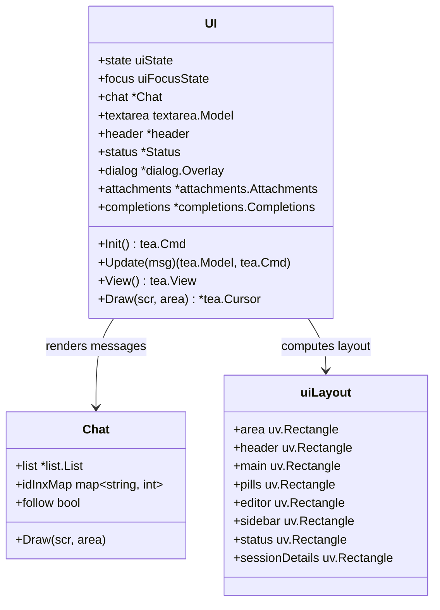
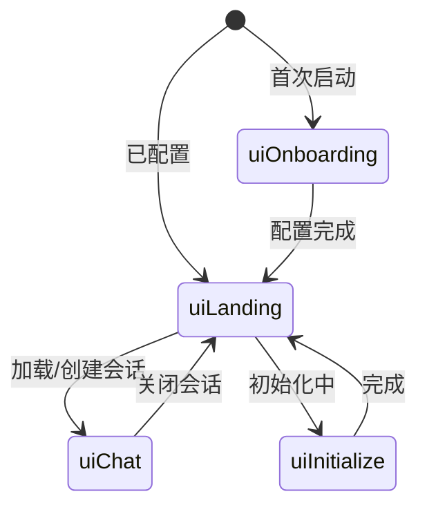

[上一篇：14-Skills系统](14-Skills系统.md) · [总目录](README.md) · [下一篇：16-客户端服务器架构](16-客户端服务器架构.md)

# TUI 终端界面

> **场景**：理解 Crush 的终端用户界面如何基于 Bubble Tea v2 + Ultraviolet 构建交互式体验，包括 UI 状态机、布局系统、事件循环、消息渲染、编辑器集成、侧边栏、Pills 面板、对话框覆盖层以及缓存策略。
> **时间**：2026-08-27 (CST)
> **版本**：Crush @ main branch, Go 1.26.6, charm.land/bubbletea/v2 v2.0.9, charm.land/ultraviolet

## 本文件内容

1. [架构概览](#1-架构概览)
2. [UI 状态机](#2-ui-状态机)
3. [UI 结构体](#3-ui-结构体)
4. [Bubble Tea 生命周期：Init / Update / View](#4-bubble-tea-生命周期init--update--view)
5. [布局系统](#5-布局系统)
6. [Chat 组件](#6-chat-组件)
7. [编辑器与输入处理](#7-编辑器与输入处理)
8. [侧边栏与导航](#8-侧边栏与导航)
9. [Pills 面板](#9-pills-面板)
10. [对话框覆盖层](#10-对话框覆盖层)
11. [缓存策略](#11-缓存策略)
12. [快捷键映射](#12-快捷键映射)

## 1. 架构概览

```
┌──────────────────────────────────────────────────────┐
│ Bubble Tea v2 (bubbletea/v2)                         │
│ tea.Program → 事件循环 → Init/Update/View            │
├──────────────────────────────────────────────────────┤
│ UI Model (internal/ui/model/ui.go)                   │
│ UI 结构体 — 根模型，持有所有子组件和状态               │
├──────────────────────────────────────────────────────┤
│ 子组件                                                │
│ Chat      — 消息列表渲染 (list.List)                  │
│ textarea  — 输入编辑器 (bubbles/textarea)             │
│ Sidebar   — 会话列表、LSP/MCP 状态                    │
│ Header    — 顶部标题栏                                │
│ Status    — 底部帮助栏                                │
│ Pills     — 状态药丸面板（模型/工具/todo）             │
│ Dialog    — 对话框覆盖层（权限/模型选择/配置）          │
│ Attachments — 附件管理                                │
│ Completions — 命令/文件补全                           │
├──────────────────────────────────────────────────────┤
│ Ultraviolet (uv)                                     │
│ Screen / ScreenBuffer / StyledString / Layout        │
│ 渲染原语和布局引擎                                    │
├──────────────────────────────────────────────────────┤
│ Terminal                                             │
└──────────────────────────────────────────────────────┘
```



## 2. UI 状态机

```
internal/ui/model/ui.go
Type：uiState (uint8)
```

| 状态 | 说明 |
|------|------|
| `uiOnboarding` | 初始配置向导（选择模型/提供商） |
| `uiInitialize` | 初始化等待中 |
| `uiLanding` | 登录页（无活跃会话，显示 logo 和提示） |
| `uiChat` | 聊天模式（有活跃会话，显示消息和编辑器） |



### 焦点状态

```
Type：uiFocusState (uint8)
```

| 状态 | 说明 |
|------|------|
| `uiFocusNone` | 无焦点 |
| `uiFocusEditor` | 编辑器焦点（可输入） |
| `uiFocusMain` | 主区域焦点（可滚动） |
| `uiFocusSidebar` | 侧边栏焦点（可导航会话列表） |

## 3. UI 结构体

```
internal/ui/model/ui.go
Struct：UI
```

核心字段分组：

**状态与布局**
```
字段：state → uiState
字段：focus → uiFocusState
字段：width, height → int
字段：layout → uiLayout
字段：isCompact → bool（紧凑模式）
字段：forceCompactMode → bool
字段：isTransparent → bool
字段：themeKey → string
```

**会话与消息**
```
字段：session → *session.Session
字段：sessionFiles → []SessionFile
字段：sessionFileReads → []string
字段：initialSessionID → string
字段：continueLastSession → bool
```

**子组件**
```
字段：chat → *Chat
字段：textarea → textarea.Model
字段：header → *header
字段：status → *Status
字段：dialog → *dialog.Overlay
字段：attachments → *attachments.Attachments
字段：completions → *completions.Completions
字段：activeInline → dialog.InlineEditor
```

**LSP/MCP/Skills 状态**
```
字段：lspStates → map[string]workspace.LSPClientInfo
字段：lspDiagnostics → map[string]lsp.DiagnosticCounts
字段：mcpStates → map[string]mcp.ClientInfo
字段：skillStates → []*skills.SkillState
```

**侧边栏滚动**
```
字段：sidebarOffset → int
字段：sidebarScrollable → bool
字段：sidebarContent → string
字段：sidebarTotalLines → int
字段：sidebarContentHeight → int
字段：sidebarContentWidth → int
```

**Pills 面板**
```
字段：pillsExpanded → bool
字段：pillsAutoExpanded → bool
字段：focusedPillSection → pillSection
字段：pillsView → string
```

**缓存**
```
字段：agentBusyCache → ttlCache
字段：yoloCache → ttlCache
字段：agentReady → bool
字段：agentModel → workspace.AgentModel
字段：busyFetchGen → uint64
字段：promptQueueGen → uint64
```

**通知与命令**
```
字段：notifyBackend → notification.Backend
字段：notifyWindowFocused → bool
字段：customCommands → []commands.CustomCommand
字段：mcpPrompts → []commands.MCPPrompt
```

## 4. Bubble Tea 生命周期：Init / Update / View

### Init

```
函数：Init
偏移：+0 ～ +28
```

启动时初始化命令（`tea.Batch` 并发执行）：

1. 如果 `uiOnboarding`：打开模型选择对话框
2. `loadCustomCommands()` — 异步加载用户自定义命令
3. `loadPromptHistory()` — 异步加载提示历史
4. `requestLSPRefresh()` — 预加载 LSP 状态缓存
5. `loadInitialSession()` — 如果指定了初始会话 ID 或继续上次会话
6. 如果是 Hyper 提供商：`fetchHyperCredits()`
7. `dispatchBusyRefresh()` — 预加载 busy/permission 状态
8. `checkPendingMCPAuth()` — 检查待认证的 MCP 服务器

### Update

```
函数：Update
偏移：+0 ～ +100+
```

Bubble Tea 的核心事件处理函数。接收 `tea.Msg`，返回新模型和命令。

主要消息类型处理：

| 消息类型 | 处理 |
|---------|------|
| `tea.EnvMsg` | 检测 Windows Terminal，查询环境 |
| `tea.FocusMsg` / `tea.BlurMsg` | 窗口焦点变化 |
| `pubsub.Event[notify.Notification]` | Agent 通知 |
| `busyStateMsg` | 应用 busy 状态变更 |
| `promptQueueMsg` | 提示队列更新 |
| `lspStatesMsg` | LSP 状态更新 |
| `agentModelChangedMsg` | 模型变更，失效化缓存 |
| `agentRunSubmittedMsg` | 提示已提交，刷新状态 |
| `loadSessionMsg` | 会话加载完成 |
| `tea.KeyMsg` | 键盘输入（委托给子处理） |
| `tea.MouseMsg` | 鼠标事件 |
| `tea.WindowSizeMsg` | 终端尺寸变化 |
| `sendMessageMsg` | 发送消息 |
| `closeDialogMsg` | 关闭对话框 |
| `mcpStateChangedMsg` | MCP 状态变更 |
| `shellResultMsg` | Shell 命令结果 |
| `shellStreamMsg` | Shell 流式输出 |

### View

```
函数：View
偏移：+0 ～ +34
```

1. 创建 `uv.NewScreenBuffer(width, height)` — 屏幕缓冲区
2. 调用 `m.Draw(canvas, canvas.Bounds())` — 渲染到缓冲区
3. 规范化换行符（`\r\n` → `\n`）
4. 修剪每行尾随空格
5. 设置窗口标题：`"crush " + workingDir`
6. 如果 agent busy 且启用进度条：设置不确定进度条
7. 返回 `tea.View`

## 5. 布局系统

### uiLayout 结构

```
internal/ui/model/ui.go
Struct：uiLayout
字段：area → uv.Rectangle（整体区域）
字段：header → uv.Rectangle（标题栏）
字段：main → uv.Rectangle（主区域——聊天/登录页）
字段：pills → uv.Rectangle（药丸面板）
字段：editor → uv.Rectangle（编辑器区域）
字段：sidebar → uv.Rectangle（侧边栏）
字段：status → uv.Rectangle（状态/帮助栏）
字段：sessionDetails → uv.Rectangle（紧凑模式下的会话详情覆盖层）
```

### generateLayout

```
函数：generateLayout
偏移：+0 ～ +60+
```

根据终端宽高和 UI 状态计算各区域矩形：

1. **基础参数**：
   - `helpHeight = 1` — 底部帮助栏
   - `editorHeight = textarea.Height() + editorHeightMargin` — 编辑器高度
   - `sidebarWidth = 32` — 侧边栏宽度
   - `landingHeaderHeight = 4` — 登录页标题高度

2. **外边距**：使用 `layout.Vertical` 分割应用区域和帮助栏，各方向添加 1 像素边距

3. **状态分支**：
   - `uiOnboarding` / `uiInitialize` / `uiLanding`：标题 + 主区域 + 编辑器
   - `uiChat`（非紧凑）：侧边栏 + 主区域 + Pills + 编辑器
   - `uiChat`（紧凑）：标题 + 主区域 + Pills + 编辑器 + 会话详情覆盖层

### 紧凑模式

```
Const：compactModeWidthBreakpoint = 120
Const：compactModeHeightBreakpoint = 30
```

当终端宽度 < 120 或高度 < 30 时自动切换到紧凑模式。紧凑模式下：
- 侧边栏隐藏，用标题栏代替
- 会话详情通过覆盖层显示
- 用户可通过快捷键强制紧凑模式

### Draw

```
函数：Draw
偏移：+0 ～ +100+
```

渲染入口——根据 UI 状态分发到不同的绘制路径：

```
Draw(scr, area)
  │
  ├── generateLayout(w, h)
  │
  ├── uiOnboarding
  │     └── drawHeader
  │
  ├── uiInitialize
  │     └── drawHeader + initializeView
  │
  ├── uiLanding
  │     ├── drawHeader + landingView
  │     └── editor (或 activeInline)
  │
  └── uiChat
        ├── 非紧凑：drawSidebar + chat.Draw + pills + editor
        ├── 紧凑：drawHeader + chat.Draw + pills + editor
        └── details overlay (紧凑模式)
  │
  └── status.Draw (帮助栏)
  │
  └── dialog.Draw (对话框覆盖层)
```

## 6. Chat 组件

### Chat 结构

```
internal/ui/model/chat.go
Struct：Chat
字段：com → *common.Common
字段：list → *list.List
字段：idInxMap → map[string]int
字段：pausedAnimations → map[string]struct{}
字段：follow → bool
字段：drawCache → *chatDrawCache
字段：scrollbarVisible → bool
字段：scrollbarMode → string ("default"|"always"|"never")
字段：resizing → bool
```

### NewChat

```
函数：NewChat
偏移：+0 ～ +15
```

创建 Chat 实例：
1. 创建 `list.NewList()` — 消息列表
2. 设置 `list.SetGap(1)` — 消息间距
3. 注册 `applyHighlightRange` 回调 — 高亮渲染
4. 注册 `FocusedRenderCallback` — 焦点高亮

### Draw

```
函数：Draw
偏移：+0 ～ +50+
```

渲染聊天消息列表：

1. **滚动条可见性**：根据 `scrollbarMode` 和列表溢出状态决定
2. **调整滚动条区域宽度**：如果显示滚动条，主区域宽度减 1
3. **缓存检查**：如果渲染内容与上次相同（`drawCache`），跳过 ANSI 重解析
4. `list.Render()` → 渲染所有消息项
5. `uv.NewStyledString(rendered).Draw(scr, area)` — 绘制到屏幕
6. 绘制滚动条（如果可见）

### chatDrawCache

```
Struct：chatDrawCache
字段：rendered → string
字段：method → ansi.Method
字段：buf → uv.ScreenBuffer
```

缓存渲染结果——帧内容字节相同时跳过 `StyledString.Draw` 的逐单元格 ANSI 重解析。缓存键为渲染字符串和宽度方法（graphemes vs wcwidth 使用不同解码器）。区域/滚动变化不失效缓存。

### 消息跟踪

```
字段：follow → bool
```

`follow == true` 时新消息自动滚动到底部。用户手动向上滚动后设为 false，新消息到达时不自动跟随。滚动到底部时重新设为 true。

## 7. 编辑器与输入处理

### textarea 配置

```
函数：New
偏移：+0 ～ +30+
```

```go
ta := textarea.New()
ta.ShowLineNumbers = false
ta.CharLimit = -1
ta.SetVirtualCursor(false)
ta.DynamicHeight = true
ta.MinHeight = TextareaMinHeight  // 3
ta.MaxHeight = TextareaMaxHeight   // 15
```

关键配置：
- `CharLimit = -1` — 无字符限制
- `DynamicHeight = true` — 高度随内容动态调整
- `MinHeight = 3` / `MaxHeight = 15` — 高度范围

### 快捷键重映射

- `Ctrl+A` → 全选（而非行首，行首改为 `Home`）
- `Ctrl+Shift+A` → 全选（备用绑定）
- `Ctrl+G` → 帮助（Crush 使用，不与 textarea 冲突）
- 复制绑定被禁用——由 Crush 的 keymap 统一处理（使用 Crush 的剪贴板后端）

### 补全系统

```
字段：completions → *completions.Completions
字段：completionsOpen → bool
字段：completionsStartIndex → int
字段：completionsQuery → string
字段：completionsPositionStart → image.Point
```

- `@` 触发文件补全
- `/` 或 `Ctrl+P` 触发命令补全
- 补全列表从 `completionsStartIndex` 处插入

### 附件系统

```
字段：attachments → *attachments.Attachments
```

- 图片粘贴（`PasteImage` 快捷键）
- 文件拖放
- 粘贴文本超过 `pasteLinesThreshold`（10 行）或 `pasteColsThreshold`（1000 列）时作为文件附件

### Bang 模式

```
字段：bangMode → bool
字段：bangCancel → context.CancelFunc
```

编辑器中以 `!` 开头的命令进入 bang 模式——直接执行 shell 命令，结果内联显示。`bangCancel` 允许 Escape 取消运行中的命令。

### 内联编辑器

```
字段：activeInline → dialog.InlineEditor
```

当非 nil 时，替换 textarea 显示内联编辑器（如问题表单 `QuestionForm`）。用于 LLM 向用户提问时的交互。

## 8. 侧边栏与导航

### 侧边栏状态

```
字段：sidebarOffset → int（当前滚动偏移）
字段：sidebarScrollable → bool（内容超出可用高度）
字段：sidebarScrollbarVisible → bool
字段：sidebarContent → string（缓存的渲染内容）
字段：sidebarTotalLines → int
字段：sidebarContentHeight → int
字段：sidebarContentWidth → int
字段：sidebarLogo → string
```

### 侧边栏内容

侧边栏在非紧凑模式下显示：
- Crush logo（顶部）
- 会话列表（可滚动）
- LSP 服务器状态（连接/错误/诊断计数）
- MCP 服务器状态（连接/错误/工具计数）
- Skills 状态

### 虚拟滚动

`updateSidebarScrollState` 在每次 Draw 时计算总行数和可滚动状态。当内容超出可用高度时启用虚拟滚动，`sidebarOffset` 控制偏移量。滚动条在滚动活动后显示 2 秒然后自动隐藏。

## 9. Pills 面板

### Pills 状态

```
字段：pillsExpanded → bool
字段：pillsAutoExpanded → bool
字段：focusedPillSection → pillSection
字段：pillsView → string
```

Pills 面板位于编辑器上方，显示状态药丸：
- **模型药丸**：当前选中的大/小模型
- **工具药丸**：可用工具数量
- **Todo 药丸**：待办事项计数（带 spinner）
- **YOLO 药丸**：权限跳过状态

### 展开/折叠

- 默认折叠为单行
- `TogglePills` 快捷键展开/折叠
- 展开后显示完整模型信息和工具列表
- `PillLeft` / `PillRight` 在展开的药丸区域间导航

### Pills 渲染

```
函数：renderPills
```

每次 Draw 时重新渲染 pillsView 字符串。在 `uiChat` 状态下每帧都调用，确保 todo 等动态状态实时更新。

## 10. 对话框覆盖层

### Overlay 结构

```
字段：dialog → *dialog.Overlay
```

`dialog.Overlay` 管理对话框堆栈，在所有其他内容之上渲染。支持的对话框类型：

| 对话框 | 说明 |
|--------|------|
| 权限请求 | 工具执行授权 |
| 模型选择 | 选择大/小模型 |
| 配置编辑 | 编辑 crush.json |
| MCP 认证 | OAuth 授权 URL |
| 问题表单 | LLM 向用户提问（内联编辑器） |
| 命令面板 | 搜索和执行命令 |
| 文件选择 | 选择文件附件 |

### 渲染

对话框在 `Draw` 函数最后绘制——确保覆盖在所有内容之上。`dialog.Draw(scr, layout.area)` 使用全屏区域，内部根据对话框类型定位。

## 11. 缓存策略

### ttlCache

```
字段：agentBusyCache → ttlCache
字段：yoloCache → ttlCache
```

用于缓存来自工作区的同步 HTTP 请求结果（客户端/服务器模式下）。TTL 过期后后台重新获取。避免 Update/View 中的同步 HTTP 调用阻塞 UI。

### Generation 号

```
字段：busyFetchGen → uint64
字段：promptQueueGen → uint64
```

每次状态转换递增 generation 号。后台获取操作捕获发起时的 generation，返回时检查是否仍为当前值——如果不是，丢弃结果并重新获取。防止过期结果覆盖新状态。

### LSP 状态缓存

```
字段：lspStates → map[string]workspace.LSPClientInfo
字段：lspDiagnostics → map[string]lsp.DiagnosticCounts
字段：lspFetchInFlight → bool
字段：lspRefreshQueued → bool
字段：lspCheckedAt → time.Time
```

LSP 状态通过事件驱动刷新 + TTL 回退机制。事件到达时如果在获取中，设置 `lspRefreshQueued`，获取完成后重新发起。

### Prompt Queue 缓存

```
字段：promptQueue → int
字段：promptQueueItems → []string
字段：promptQueueCheckedAt → time.Time
字段：promptQueueInFlight → bool
```

提示队列状态同样使用事件驱动 + TTL 回退 + generation 号防止过期。

## 12. 快捷键映射

### KeyMap 结构

```
internal/ui/model/keys.go
Struct：KeyMap
```

分组：

**Editor 组**
| 键 | 动作 |
|----|------|
| Enter | 发送消息 |
| Ctrl+E | 打开外部编辑器 |
| Shift+Enter / Ctrl+J | 换行 |
| Ctrl+V | 粘贴图片 |
| @ | 文件补全 |
| / 或 Ctrl+P | 命令补全 |
| Ctrl+Shift+A | 全选 |
| Ctrl+C | 复制选区 |
| Ctrl+X | 剪切选区 |
| Up/Down | 历史导航 |

**Chat 组**
| 键 | 动作 |
|----|------|
| Ctrl+N | 新建会话 |
| Ctrl+O | 添加附件 |
| Escape | 取消 Agent |
| Tab | 切换焦点 |
| Ctrl+B | 切换 Pills |
| Ctrl+S | 侧边栏焦点 |

**Global 组**
| 键 | 动作 |
|----|------|
| Ctrl+C | 退出 |
| Ctrl+G | 帮助 |
| Ctrl+F | 切换紧凑模式 |

### ShortHelp

```
函数：ShortHelp
偏移：+0 ～ +30+
```

根据当前 UI 状态和焦点动态生成帮助绑定——busy 时显示 Cancel，编辑器空时显示命令提示，内联编辑器激活时显示其专属帮助。

---

[上一篇：14-Skills系统](14-Skills系统.md) · [总目录](README.md) · [下一篇：16-客户端服务器架构](16-客户端服务器架构.md)