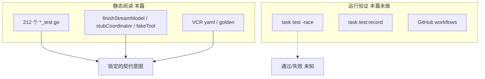
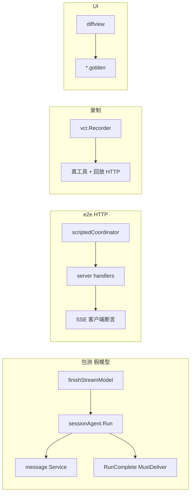

# 15. 测试体系与质量保障

> 状态：待复核生成稿
> 生成日期：2026-08-16
> 基准提交：`16dce459cafecee92eae0ed7c47a0c641c8bbb9f`
> 工作区：dirty（开始分析时已有本目录下未提交文档）
> 源码范围：仓库内全部 `*_test.go`（静态盘点 212 个测试文件）、`internal/agent/testdata/` VCR、`internal/ui/diffview/testdata/*.golden`、`Taskfile.yaml` 的 `test`/`test:record`、`internal/app/testing.go`、`internal/backend/testing.go`、`internal/agent/agenttest/`
> 生成方式：测试文件、替身类型、断言与夹具的静态阅读
> 所属层：第四层（补齐测试布局、替身、golden、覆盖缺口）
> 前置阅读：[01-简单框架-系统骨架.md](01-简单框架-系统骨架.md)、[02-简单例子-全路径走读.md](02-简单例子-全路径走读.md)、[03-详细逐步说明-主链路拆解.md](03-详细逐步说明-主链路拆解.md)

## 快速摘要

### 架构总览（模块与依赖）

测试与生产代码同包（`internal/foo/foo_test.go`），Go 惯例允许测试访问未导出符号。没有独立的 `tests/` 树。质量闸门分四层：

1. **单元/包测**：`testify/require`，多数 `t.Parallel()`，临时目录 `t.TempDir()`。
2. **契约替身**：假 LanguageModel（`finishStreamModel`）、假 Coordinator（`stubCoordinator` / `scriptedCoordinator`）、假工具（`fakeTool`）、内存 SQLite（`db.Connect(t.TempDir())`）。
3. **录制夹具**：Agent 工具路径用 `charm.land/x/vcr` 把 Hyper HTTP 录成 `internal/agent/testdata/TestCoderAgent/`；TUI diff 用 catwalk golden。
4. **任务与 CI**：`task test` → `go test -race -failfast ./...`。`task test:record` 会删除整个 `internal/agent/testdata` 再重录。

本篇是**静态阅读**。没有执行 `go test` 或 `task test`，因此不声明任何测试通过、失败或覆盖率百分比。运行验证是读者或 CI 的事。

### 核心调用序列（逐步逻辑）

测试如何接到生产符号，而不是“测试框架如何跑”：

1. Agent 包测：`testEnv` 建 SQLite + 真实 `session.Service`/`message.Service`，注入 `finishStreamModel` 或 VCR LanguageModel，调用 `sessionAgent.Run` / `coordinator.run`。
2. 远程 `crush run` 退出：`run_stream_test.go` 直接喂 `runStream.handle` proto 事件，不启动 Server。
3. HTTP/SSE：`server/e2e_agent_test.go` 用 `scriptedCoordinator` 驱动真实 handler，断言事件顺序。
4. 权限/Hook：`hooked_tool_test.go` 的 `fakeTool` + 可控 `hooks.Runner`；`permission_test.go` 测短路与阻塞。
5. 消息 debounce：`message_test.go` 把窗口设成 0 或 1h，断言 coalescing vs 同步 flush。
6. UI：构造最小 `UI` 或单个组件，catwalk `golden.RequireEqual`；更新用 `go test ./internal/ui/diffview -update`。

### 易错点与边界条件

- **`config.UseMockProviders` 在当前源码中不存在。** 仓库 `AGENTS.md` 的 “Testing with Mock Providers” 段落已过时。`app/provider_test.go` 用局部函数 `setupMockProviders()` 注入 `map[string]config.ProviderConfig`，不是全局开关。
- `t.Parallel()` 与包级缓存冲突：改 `skills.WithGlobalMirror` 或 provider 单例的测试必须串行。
- `scriptedCoordinator.BeginAccepted` 返回 `nil`。这只适合不测 cancel 窗口的 e2e；`accepted_run_integration_test.go` 因此改用 `agenttest.NewCoordinator` 走真实 `BeginAccepted`。
- `task test:record` 是破坏性的：先 `rm -r internal/agent/testdata`。
- golden 路径在 `internal/ui/diffview`，**不是** `AGENTS.md` 里写的 `internal/tui/components/core`（旧路径，当前仓库无此包）。
- VCR 回放仍依赖录制时的模型/API 形状；夹具过期时测试失败，不代表生产逻辑错。
- 有测试 ≠ 线上 Provider、OAuth、真 MCP、真 LSP 已验证。那些是待确认的外部行为。

## 目录

1. [为什么这样设计（Why）](#1-为什么这样设计why)
2. [它是什么（What）：规模与命令](#2-它是什么what规模与命令)
3. [静态阅读 vs 运行验证](#3-静态阅读-vs-运行验证)
4. [替身与测试装配目录](#4-替身与测试装配目录)
5. [按包盘点](#5-按包盘点)
6. [Golden 与 VCR](#6-golden-与-vcr)
7. [关键断言与生产符号的对应](#7-关键断言与生产符号的对应)
8. [未覆盖风险](#8-未覆盖风险)
9. [与权威文档的冲突](#9-与权威文档的冲突)
10. [调用关系表](#10-调用关系表)
11. [Mermaid](#11-mermaid)
12. [阅读源码建议顺序](#12-阅读源码建议顺序)
13. [重新实现检查清单](#13-重新实现检查清单)

## 1. 为什么这样设计（Why）

Crush 的缺陷类型决定测试形态：

| 缺陷类型 | 为什么不能靠真 LLM | 测试策略 |
|---|---|---|
| cancel vs accept 竞态 | 时序不可复现 | 手工填 `activeRequests`/`acceptedRuns`，channel 卡住阶段 |
| RunComplete 投递 | 慢订阅者丢包 | 断言 `PublishMustDeliver`；排队剥 `OnComplete` |
| 远程 crush run 误把 `tool_use` 当退出 | 要精确的 FinishReason | 喂 proto 事件给 `runStream.handle` |
| 流式 debounce 竞态 | 真 token 速率不稳 | debounce=1h 或 0 |
| 工具副作用 | 真文件系统/网络贵且脏 | `t.TempDir`、假 Permission、VCR |
| TUI 像素回归 | 终端能力差异 | catwalk golden |

因此测试金字塔是：**确定性替身锁契约**，**VCR 锁工具协议形状**，**golden 锁 diff 渲染**，**少量 e2e 锁 HTTP/SSE 接线**。没有“启动完整 TUI Program 打字”的测试，也没有对真实 Anthropic/OpenAI 的 CI 网络调用（除 `test:record` 显式重录）。

## 2. 它是什么（What）：规模与命令

静态盘点（本提交工作区 `find *_test.go`）：

- 测试文件：**212**
- 分布最密：`internal/config` 31、`internal/agent` 15、`internal/agent/tools` 17、`internal/ui/chat` 13、`internal/ui/model` 12、`internal/shell` 12、`internal/backend` 9、`internal/server` 8、`internal/cmd` 7、`internal/hooks` 1（但 `hooks_test.go` 含 24 个 `Test*`）

命令（来自 `Taskfile.yaml` 与 `AGENTS.md`，未在本轮执行）：

```text
task test                          # go test -race -failfast ./...
go test ./internal/agent -run TestCancel
go test ./internal/ui/diffview -update
go test ./internal/ui/diffview     # Taskfile 在该目录也有 -update 封装
task test:record                   # rm -r internal/agent/testdata && go test -v -count=1 -timeout=1h ./internal/agent
task lint                          # golangci-lint + 日志大写检查
task lint:log                      # scripts/check_log_capitalization.sh
```

`CGO_ENABLED=0` 是生产构建约束；测试是否始终关 CGO **待确认**（`task test` 命令本身未设该环境变量）。

## 3. 静态阅读 vs 运行验证

| 口径 | 本篇做了什么 | 本篇没做什么 |
|---|---|---|
| 静态阅读 | 打开 `*_test.go` 的名称、替身类型、断言目标、夹具路径 | 不执行测试二进制 |
| 符号核对 | 替身是否实现生产接口（`stubCoordinator` 对 `agent.Coordinator`） | 不验证编译是否仍通过 |
| 文档冲突 | `AGENTS.md` 的 `UseMockProviders`、golden 路径与源码不符 | 不修改 `AGENTS.md`（用户未要求） |
| 运行验证 | 无 | `go test`、race、覆盖率、CI 是否绿 |

后文所有“锁住的行为”都应读成：**测试作者意图通过这些断言锁定该行为**；是否在本机/CI 当前为绿，未知。

## 4. 替身与测试装配目录

### 4.1 假 LanguageModel：`finishStreamModel`

定义在 `internal/agent/dispatch_cancel_test.go`。实现 `fantasy.LanguageModel`：`Stream` 依次 yield TextStart / TextDelta / TextEnd / Finish(`FinishReasonStop`)。`GenerateObject`/`StreamObject` 返回 `"not implemented"`。

用途：驱动 `sessionAgent.Run` 走完 PrepareStep 和正常结束，**不需要** VCR。`queued_runid_test.go` 把 small 模型也设成 `finishStreamModel{text: "title"}` 以生成标题。

不够用的场景：工具调用、多 step、401 重试。那些走 VCR（`agent_test.go`）或手工注入更复杂的假模型。

### 4.2 假 Coordinator

| 类型 | 文件 | BeginAccepted | 适用 |
|---|---|---|---|
| `stubCoordinator` | `server/sessions_isbusy_test.go` | 返回 nil | 只关心 `IsSessionBusy` HTTP |
| `scriptedCoordinator` | `server/e2e_agent_test.go` | 返回 nil | 按脚本 emit user/assistant 消息，测 SSE |
| `agenttest.NewCoordinator` | `agent/agenttest/coordinator.go` | **真实生产实现** | `backend/accepted_run_integration_test.go` 必须走 cancel-on-entry |

`scriptedCoordinator.BeginAccepted` 返回 nil 会跳过生产里 “HTTP 202 与 goroutine 注册 cancel 之间” 的窗口。测该窗口必须用 `agenttest`，不能用 stub。

### 4.3 其它替身

| 替身 | 文件 | 角色 |
|---|---|---|
| `fakeEnv` / `testEnv` / `testSessionAgent` | `agent/common_test.go` | TempDir SQLite、真实 Session/Message、Permission skip=true |
| `fakeTool` | `agent/hooked_tool_test.go` | 记录是否被 `Run`，验证 deny 跳过内层 |
| `mockPermissionService` 及变体 | `tools/multiedit_test.go`、`bash_test.go`、`view_test.go` | 记录 `Request` 参数、Grant/Deny |
| `app.NewForTest` | `app/testing.go` | 活 Broker + 真 Permission/Question，无 DB/LSP/MCP/Coordinator |
| `backend.InsertWorkspaceForTest` | `backend/testing.go` | 把合成 Workspace 塞进 Backend，不经 `CreateWorkspace` |
| `setupMockProviders` | `app/provider_test.go` | 本地 map，不是全局 `UseMockProviders` |
| `stubDialog` | `ui/dialog/overlay_test.go` | 记录收到的键，测 grace |
| `httptest.Server` | `config/load_test.go`、`discover/*_test.go`、oauth 等 | 假 HTTP 目录/发现端点 |

### 4.4 `testEnv` 的一个实现细节

`testEnv` 用 `filepath.Join("/tmp/crush-test/", t.Name())` 作 workingDir，数据库却在 `t.TempDir()`。workingDir **不是** `t.TempDir()`。并行测试若 `t.Name()` 碰撞（不会，Go 会唯一化）或残留 `/tmp/crush-test` 目录，可能脏。这与仓库规则 “Always use `t.TempDir()`” 不完全一致。标注为事实，不是本篇要改的代码。

Permission 在 `testEnv` 里 `skip=true`（第二个参数），所以默认工具测不经过 UI 阻塞。要测权限必须另构 `NewPermissionService(..., false, ...)`。

## 5. 按包盘点

下列“关键测试”不是完整 `Test*` 清单，而是该包里锁定系统契约的文件。`Test*` 计数来自对 `func Test` 的静态 grep。

### 5.1 `internal/agent`（15 个测试文件）

| 文件 | 关键用例（名称即契约） | 替身 |
|---|---|---|
| `dispatch_cancel_test.go` | `TestCancel_ActiveAndAcceptedFiresBothBranches`；`TestRun_BusyWithPendingCancelTakesCancelOnEntry`；`TestRun_CancelOnEntryPublishesRunComplete`；`TestRun_IdleCancelDoesNotPoisonNextPrompt`；`TestCancel_AcceptedAfterCancelIsNotPoisoned` | `finishStreamModel`、手工 `activeRequests` |
| `accepted_run_test.go` | Close 幂等；idle Cancel 不写 mark；cancel-on-entry 落库 canceled turn | 真 Session/Message |
| `queued_runid_test.go` | 带 RunID 的排队项递归独立 turn 并发自己的 RunComplete | `finishStreamModel` |
| `run_complete_test.go` | 排队剥 `OnComplete`；`drainQueueForStep` 在 dispatch 锁下过滤；无 mark 时无 RunID 可折进 step；MustDeliver 压过普通 Publish；取消的 RunID 补发 Cancelled | 忙标记 + hook 闭包 |
| `dispatch_race_test.go` | 同 Session 并发 in-process dispatch 只启动一次 Run | |
| `coordinator_mcp_gate_test.go` | `TestRunWaitsForMCPOnlyWhenNonInteractive` | |
| `coordinator_readiness_test.go` | 调用方 ctx 取消后 `buildAgent` 仍能 ready | |
| `coordinator_test.go` | 子 Agent、父 Session cost、reasoning effort、401 判定 | |
| `hooked_tool_test.go` | allow 打 HookApproval；silent 不打；deny 不跑 inner；`wrapToolsWithHooks` 在 sub-agent/nil runner 时原样返回 | `fakeTool` |
| `loop_detection_test.go` | 重复工具签名 | |
| `usage_fallback_test.go` | 估算 usage 不虚构 cost | |
| `convert_test.go` | tool result 媒体/base64 | |
| `aws_sso_refresh_test.go` | 从输出抽 SSO URL | |
| `agent_test.go` | `TestCoderAgent` VCR 矩阵（glob/grep/bash/write/…）；附件过滤；孤儿 tool_use | `charm.land/x/vcr` + Hyper |
| `common_test.go` | 无 `Test*`；共享 `testEnv` | |

### 5.2 `internal/agent/tools` 与 `tools/mcp`

| 文件 | 锁住的行为 |
|---|---|
| `view_test.go` | 行截断、1MB 行、图片大小、builtin skill URI |
| `write_test.go` | 空新文件可写 |
| `edit_test.go` / `edit_whitespace_test.go` / `multiedit_test.go` | CRLF、多匹配拒绝、空白诊断 |
| `glob_test.go` | 不跟随 symlink 逃出、结果封顶 |
| `grep_test.go` | ignore 文件、列匹配、UTF-8 |
| `bash_test.go` | 链式命令强制权限、输出截断 UTF-8 |
| `safe_test.go` | `;` `\|` `&&` `$()` 检测 |
| `job_test.go` | 后台 shell 的 kill/list/exit/并发 |
| `question_test.go` | 参数 JSON 数组或字符串编码 |
| `crush_info_test.go` | 信息工具无 secret、确定性排序、hooks/skills 段 |
| `crush_logs_test.go` | 红线、顺序、缺文件 |
| `context_test.go` | 四 Context key 缺省 |
| `search_test.go` / `sourcegraph_test.go` | HTTP 202/异常页/格式化 |
| `lsp_helpers_test.go` | 符号 offset 不过冲 |
| `mcp/waitforinit_test.go` | 非交互阻塞到 init；未 armed 立即返回 |
| `mcp/init_test.go` | transport URL/stdio/headers、Reconcile、BeginAuth 并发 |
| `mcp/lifecycle_test.go` | error 清 tools/prompts；renew 串行 |
| `mcp/channel_test.go` | 通道参数大小与属性逃逸 |
| `mcp/tools_test.go` | raw bytes、过滤 |
| `mcp/process_unix_test.go` | stdio 进程组（Unix） |

### 5.3 `internal/cmd`

| 文件 | 锁住的行为 |
|---|---|
| `run_stream_test.go` | **不以 `FinishReasonToolUse` 退出**；匹配 RunID 的 RunComplete 才 `done=true`；stdout 与 `RunComplete.Text` 对账 |
| `channels_flag_test.go` | `--channels` 必须是 persistent flag |
| `schema_test.go` | JSON schema 生成 |
| `login_test.go` / `logout_test.go` | 认证命令局部 |
| `projects_test.go` | 项目登记 |
| `restart_stale_test.go` | 陈旧 server 重启 |
| `clientserverrace/race_test.go` | client/server 竞态（独立包避免 import 循环） |

没有 `root.go` 的 TUI `program.Run` 测试。

### 5.4 `internal/message` / `session` / `db` / `filetracker`

| 文件 | 锁住的行为 |
|---|---|
| `message/message_test.go` | 窗口内 5 个 delta 只发一次 Updated；终态绕过 1h debounce；`FlushAll` 抽干；与 debounce=0 终态一致；Delete 后 FlushAll 不写已删行；Flush 等待 in-flight SQL |
| `message/content_test.go` | parts JSON 多态 |
| `session/session_test.go` | CRUD |
| `db/connect_test.go` | 连接复用/引用计数 |
| `filetracker/service_test.go` | 已读路径 |

`pubsub` **无** `*_test.go`。MustDeliver 50ms 超时的丢失语义主要靠 `run_complete_test.go` 间接覆盖。

### 5.5 `internal/hooks` / `permission`

| 文件 | 锁住的行为 |
|---|---|
| `hooks/hooks_test.go`（24 个 Test） | 聚合 empty/allow/deny/halt；并行；timeout；stdout 协议；matcher |
| `permission/permission_test.go` | skip、allowlist、session auto、阻塞、并发 winner |

Hook 在权限前的接线在 `hooked_tool_test.go`，不在 hooks 包自己。

### 5.6 `internal/config` / `shellconfig`

config 31 个测试文件，是仓库最大测试包。重点：

- `load_test.go`：多来源合并、`httptest` 假目录
- `reload_crushrc_test.go` / `reload_hooks_test.go`：热更新
- `store_test.go`：scope mutation、atomic write、staleness
- `shellconfig_*_test.go`：crushrc builtin → ConfigBuilder（provider/model/mcp/lsp/permissions/hook/options）
- `resolve_test.go` / `resolve_real_test.go`：模型解析、同名歧义
- `atomicwrite_test.go`（+ windows）：半文件
- `refresh_singleflight_test.go`：并发刷新合并
- `provider_test.go` / `catwalk_test.go`：目录缓存与嵌入回退
- `hyper_test.go`：Hyper 特有字段

`shellconfig/` 另有 `load_test.go`、`model_test.go`、`options_test.go`、`hook_test.go`、`lsp_test.go`、`mcp_test.go`，测 bash 解析本身，与 `config/shellconfig_*` 的“解析结果如何进 Config”分工。

### 5.7 `internal/app` / `backend` / `server` / `client` / `workspace`

| 文件 | 替身 | 锁住的行为 |
|---|---|---|
| `app/app_test.go` | | 装配/关闭局部 |
| `app/provider_test.go` | `setupMockProviders` | 模型 ID 斜杠、选择 |
| `app/resolve_session_test.go` | `mockSessionService` | 短 hash 解析 |
| `backend/backend_test.go`（56 Test） | InsertWorkspaceForTest | 工作区去重、client hold、配置转发 |
| `backend/agent_runcomplete_test.go` | | 补发 vs Mark 过的终态 |
| `backend/accepted_run_integration_test.go` | **真** Coordinator | BeginAccepted 非 nil，cancel 窗口 |
| `backend/shell_command_test.go` | | 远程 shell 忽略 progress 的契约需对照实现 |
| `server/e2e_agent_test.go` | `scriptedCoordinator` | HTTP+SSE 消息顺序 |
| `server/e2e_test.go` | | 更粗的 server 启动 |
| `server/sessions_isbusy_test.go` | `stubCoordinator` | busy 查询 |
| `server/agent_cancel_test.go` / `events_test.go` / `multiclient_test.go` / `recover_test.go` / `socket_test.go` | | 取消、事件、多客户端、恢复、socket |
| `client/proto_test.go` / `config_test.go` / `errors_test.go` | | DTO 与错误包装 |
| `workspace/client_workspace_test.go` | | 重连、404 recover |
| `workspace/multiclient_integration_test.go` | | 多 Client 同工作区 |
| `workspace/export_test.go` | | 测试导出（无 Test 前缀文件名习惯） |

### 5.8 `internal/ui`

见 [13-TUI架构与渲染.md](13-TUI架构与渲染.md) 第 17 节。此处只补全仓库级口径：

- 无 `tea.NewProgram` 端到端测试。
- `styles/`、`logo/`、`xchroma/`、`util/` 无测试文件。
- diffview golden 数量极大（约 360 个 `.golden`），是 UI 回归的主体。

### 5.9 `internal/shell`

12 个测试文件：dispatch（含 windows）、run、background、isolation_unix、expand、jq、builtins 注册、command_block、persist_message、comparison。锁住嵌入式 bash 的拦截、后台 job、Unix 进程组隔离。Windows 有专门文件，但本分析环境是 darwin，**未运行**那些测试。

### 5.10 其余包

| 包 | 文件数 | 备注 |
|---|---|---|
| `skills` | 4 | 发现、tracker、diagnostics、manager（GlobalMirror 串行） |
| `lsp` + `lsp/util` | 3 | client/manager/edit |
| `discover` | 6 | ollama/lmstudio/llamacpp/litellm/omlx + 总 discover |
| `oauth/callback` `oauth/mcp` `oauth/copilot` | 4 | 页面与 handler；无真 OAuth 网络 |
| `csync` | 4 | map/slice/value/versionedmap 大量并行 |
| `lock` | 1 | 数据目录锁 |
| `event` | 1 | telemetry 局部 |
| `env` `home` `log` `update` `projects` `commands` `stringext` `filepathext` `fsext` `diffdetect` `herdr` `proto` | 各 1–6 | 工具层 |

### 5.11 生产包明显无 `*_test.go`

静态对照生产目录（非完整 382 文件穷举，而是行为相关缺口）：

- `internal/pubsub/`：Broker/MustDeliver 无直接测试
- `internal/question/`：问答服务无包测（UI/dialog 与 tools/question 有间接）
- `internal/history/`：文件快照服务
- `internal/clipboard/`
- `internal/format/`
- `internal/agent/notify/`、`internal/agent/prompt/`（模板渲染可能在 agent_test 间接）
- `internal/ui/styles/`、`logo/`、`xchroma/`、`util/`
- `internal/version/`
- `cmd/root.go` 交互 TUI 装配

## 6. Golden 与 VCR

### 6.1 catwalk golden

- 位置：`internal/ui/diffview/testdata/`，约 360 个 `.golden`
- API：`github.com/charmbracelet/x/exp/golden` 的 `golden.RequireEqual`
- 更新：`go test ./internal/ui/diffview -update` 或该目录 `Taskfile.yaml` 的 update 任务
- 覆盖：unified/split、宽、高、X/Y offset、亮/暗、syntax on/off、多 hunk
- **不要**用 `AGENTS.md` 里的 `go test ./internal/tui/components/core -update`：当前模块路径是 `internal/ui`，没有 `internal/tui`

### 6.2 Agent VCR

- 库：`charm.land/x/vcr`
- 夹具：`internal/agent/testdata/TestCoderAgent/glm-5.1/*.yaml`（simple、glob、grep、ls、bash、write、read、update、multiedit、download、fetch、sourcegraph、parallel_tool_calls）
- 模型对：`agent_test.go` 的 `modelPairs` 当前是 Hyper `glm-5.1` + small `gpt-oss-120b`
- HTTP 经 `vcr.Recorder` 作 `http.Client.Transport`
- 重录：`task test:record` **先删除整个 testdata 目录**，需要 `CRUSH_HYPER_API_KEY`（`godotenv/autoload`）。本轮未重录、未调用该 API。

VCR 测的是“工具协议 + 模型当时的调用形状”，不是 Coordinator 的 cancel/queue 契约。后者由 `finishStreamModel` 包测承担。

## 7. 关键断言与生产符号的对应

| 测试文件与符号 | 关系 | 生产符号 | 输入 | 断言 | 未覆盖 |
|---|---|---|---|---|---|
| `TestRun_BusyWithPendingCancelTakesCancelOnEntry` | 调用 | `sessionAgent.Run` | busy + pending cancel | 不 enqueue；有 Canceled finish | 真模型中途取消 |
| `TestRun_IdleCancelDoesNotPoisonNextPrompt` | 调用 | `Cancel` 然后 `Run` | idle Cancel | 下一 turn 正常完成 | |
| `TestSessionAgentRun_QueueStripsOnComplete` | 调用 | enqueue 路径 | busy + OnComplete | 队列里 hook==nil，RunID 保留 | |
| `TestDrainQueueForStep_KeepsRunIDPromptsQueued` | 调用 | `drainQueueForStep` | 混合有/无 RunID | 有 RunID 的仍在队列 | |
| `TestRunCompletePublisher_MustDeliverOverTakesPublish` | 调用 | publisher | | MustDeliver 被用 | 50ms 超时丢包后 crush run 是否挂起 |
| `TestRunStream_ToolUseDoesNotTerminate` | 调用 | `cmd.runStream.handle` | FinishReasonToolUse | `done==false` | 真 SSE 乱序 |
| `TestRunStream_RunCompleteExits` | 调用 | 同上 | 匹配 RunID 的 RunComplete | stdout 等于 Text | 本地 `RunNonInteractive` 的 done vs 订阅竞态 |
| `TestHookedTool_DenySkipsInnerTool` | 调用 | `hookedTool.Run` | deny 聚合 | fakeTool 未 Run | 与 Permission 串联的集成 |
| `TestHookedTool_AllowStampsHookApproval` | 调用 | `permission.WithHookApproval` | allow | inner 看到 approval | download 漏 ToolCallID（实现缺口，测试未必锁） |
| `TestRunWaitsForMCPOnlyWhenNonInteractive` | 调用 | `coordinator.run` | interactive 标志 | 交互不等 `WaitForInit` | 真慢 MCP |
| `TestOverlay_GracePeriodSwallowsKeys` | 调用 | `Overlay.Update` | OpenDialogWithGrace + 键 | Dialog 收不到键 | |
| `message.TestFlushAll_WaitsForInFlightWrite` | 调用 | `FlushAll` | 卡住的 SQL | FlushAll 等 in-flight | |
| `TestCoderAgent` 子测试 | 调用 | 真工具 + VCR 模型 | 提示 | 文件/输出符合夹具 | 其它 Provider |

## 8. 未覆盖风险

按对等价重实现的危害排序：

1. **本地 `App.RunNonInteractive` 的 stdout 与 `Coordinator.Run` 返回竞态**（第三层已指出 channel 里可能残留未读 Message）。`run_stream_test.go` 只覆盖远程路径。
2. **TUI 全链路**：Enter → AgentRun → 权限 Request → Grant → 工具继续 → 流式重绘。没有 Program 级测试。
3. **`pubsub.PublishMustDeliver` 50ms 超时丢包** 是否让 `crush run` 永久等待。有 MustDeliver 被调用的测试，没有“超时后客户端怎么办”的测试。
4. **真 Provider 流式 + 工具 + 取消**（VCR 是录好的成功路径）。
5. **OAuth 真网络、MCP 真服务器、多 LSP 实现互操作。**
6. **Windows named pipe / 进程组 / atomic write**（有文件，本环境未跑）。
7. **`loadSessionMsg` 同步 `ListMessages` 在 Client/Server 下的卡帧。**
8. **样式 token / `HypercrushObsidiana` 占位** 无锁定。
9. **`history.Service`、`question.Service`、`pubsub.Broker` 本身。**
10. **下载工具 Hook 预批准因缺少 ToolCallID 无效**（[07](07-工具权限与Hook.md) 记录的实现缺口）是否有回归测试：**推断没有专门用例。**

## 9. 与权威文档的冲突

| 文档说法 | 当前源码 | 处理 |
|---|---|---|
| `AGENTS.md`：`config.UseMockProviders = true` 然后 `ResetProviders()` | 无此变量/函数 | 以源码为准；测 Provider 用局部 `setupMockProviders` 或 `config.Init` + 手动 `Providers.Set` |
| `AGENTS.md`：`go test ./internal/tui/components/core -update` | 包路径是 `internal/ui/diffview` | 以源码与 diffview Taskfile 为准 |
| 旧英文 15 文档基准 `5712d483` | 本库 `16dce459` | 忽略旧稿 |

不要在测试里复制 `AGENTS.md` 那段 mock providers 模板——它编译不过。

## 10. 调用关系表

| 调用方文件与符号 | 关系 | 被调用方文件与符号 | 触发与输入 | 返回与后续处理 | 错误、状态与副作用 |
|---|---|---|---|---|---|
| `dispatch_cancel_test.go:newStreamTestAgent` | 构造 | `finishStreamModel` + `testSessionAgent` | `t` | 可 `Run` 的 `*sessionAgent` | TempDir SQLite |
| `sessionAgent.Run`（测试） | 调用 | `fantasy.LanguageModel.Stream` | 假模型或 VCR | 消费 part，写 Message | 与生产同一代码 |
| `hooked_tool_test.go` | 调用 | `hookedTool.Run` | fakeTool + 聚合结果 | deny 时 inner 不执行 | 不启动真实 Hook 进程 |
| `cmd/run_stream_test.go` | 调用 | `runStream.handle` | proto Event | `done` 布尔 | 无网络 |
| `server/e2e_agent_test.go` | 注入 | `App.AgentCoordinator = scriptedCoordinator` | HTTP 请求 | SSE 事件 | BeginAccepted 为 nil |
| `accepted_run_integration_test.go` | 调用 | `agenttest.NewCoordinator` | 离线 openai-compat | 真 `BeginAccepted` | 取消路径不发模型请求 |
| `app.NewForTest` | 装配 | 真 Permission + Broker | ctx | 可 Subscribe 的 App | 调用方负责 Shutdown |
| `message_test.go` | 调用 | `message.NewService` + `WithDebounce` | 0 或 1h | 事件收集器 | 无 TUI |
| `diffview_test.go` | 调用 | `golden.RequireEqual` | 渲染字符串 | 与 testdata 比 | `-update` 改文件 |
| `agent_test.go:getModels` | 调用 | `vcr.Recorder` 作 Transport | Hyper URL | LanguageModel | 回放 yaml；重录要 API key |

## 11. Mermaid





## 12. 阅读源码建议顺序

1. `internal/agent/common_test.go`（`testEnv` 怎么搭）
2. `dispatch_cancel_test.go` 全文（cancel 窗口清单）
3. `run_complete_test.go` + `queued_runid_test.go`
4. `cmd/run_stream_test.go`（两种退出契约的远程侧）
5. `message/message_test.go` debounce/FlushAll
6. `hooked_tool_test.go` + `hooks/hooks_test.go` + `permission/permission_test.go`
7. `agenttest/coordinator.go` vs `stubCoordinator` vs `scriptedCoordinator`（何时必须用真实现）
8. `app/testing.go`、`backend/testing.go`
9. 再打开要改的包的 `*_test.go`
10. 最后才看 VCR yaml 和 diffview golden（体积大，不是契约入口）

## 13. 重新实现检查清单

- [ ] 能用确定性假模型跑完一次 turn（含可选工具 call/result）。
- [ ] cancel-on-entry、idle Cancel 不写 mark、active+accepted 双取消、带 RunID 排队独立 turn，均有等价测试。
- [ ] 排队剥 OnComplete；终态 MustDeliver。
- [ ] 远程 crush run：tool_use 不退出；匹配 RunID 的 RunComplete 才退出。
- [ ] 本地 crush run 的 stdout/done 竞态有测试或明确文档化未测。
- [ ] Hook deny 不执行 inner；allow 打 approval；子 Agent 不包 Hook。
- [ ] Message：delta coalescing、终态同步、FlushAll 等待 in-flight。
- [ ] 不把过时的 `UseMockProviders` 抄进新代码。
- [ ] golden 更新路径指向真实包；VCR 重录是显式破坏性任务。
- [ ] 测 Coordinator cancel 窗口时不用 `BeginAccepted() nil` 的 stub。
- [ ] 并行测试不碰全局 skills mirror / provider 单例。
- [ ] 区分“静态阅读认为锁住了”和“CI 绿了”。本仓库文档不得在未跑测试时写“全部通过”。
