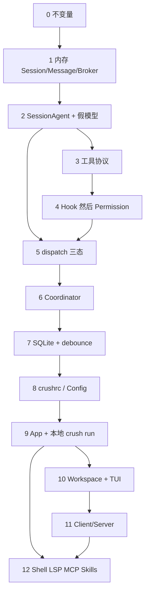
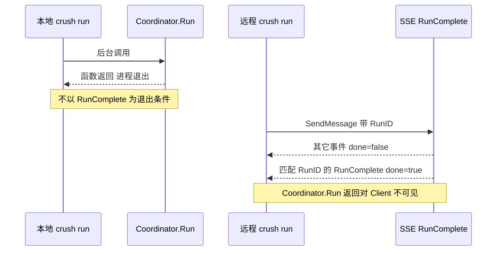
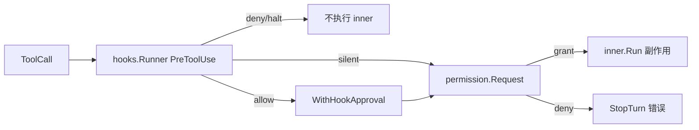

# 16. 从零重新实现指南

> 状态：待复核生成稿
> 生成日期：2026-08-16
> 基准提交：`16dce459cafecee92eae0ed7c47a0c641c8bbb9f`
> 工作区：dirty（开始分析时已有本目录下未提交文档）
> 源码范围：全仓库行为契约；本篇不复述模块内部实现，只规定阶段顺序、闭环与验收。细节分别以 [03](03-详细逐步说明-主链路拆解.md)、[06](06-Agent运行时.md)、[07](07-工具权限与Hook.md)、[09](09-数据模型持久化与事件.md)、[10](10-Workspace与ClientServer.md)、[13](13-TUI架构与渲染.md)、[15](15-测试体系与质量保障.md) 为准。
> 生成方式：已确立契约的依赖顺序与客观验收静态分析
> 所属层：第四层（从零实现等价系统的施工顺序）
> 前置阅读：必须先读 01、02、03；写到对应阶段时读该阶段引用的第四层文档。

## 快速摘要

### 架构总览（模块与依赖）

不要从 TUI 像素或 HTTP 框架开始。依赖方向必须保持：

```text
前端（TUI / crush run）
  → Workspace 接口
    → App（单工作区装配）或 Client → Server → Backend → App
      → Coordinator（工作区级模型/工具/认证）
        → SessionAgent（Session 级串行/排队/Stream）
          → Message/Session 服务 → SQLite
          → hookedTool → Hook → Permission → 工具
```

可替换技术：Fantasy 适配器、Bubble Tea、Ultraviolet、具体 SQLite 驱动、主题色。不可替换契约见阶段 0。

### 核心调用序列（逐步逻辑）

每阶段结束时必须有一个**可运行闭环**，而不是“模块写了一半”：

1. 写下不变量（身份、串行、debounce、两种退出、Hook 在权限前、crushrc 优先级）。
2. 内存 Session/Message/Broker。
3. SessionAgent + 假模型：存 user → Stream → FlushAll → RunComplete。
4. 工具协议。
5. Hook 然后 Permission。
6. dispatch 三态与 AcceptedRun。
7. SQLite + 33ms debounce。
8. crushrc/JSON 配置与 Provider 工厂。
9. `app.New` + 本地 `crush run`（退出 = `Coordinator.Run` 返回）。
10. Workspace 接口 + TUI 唯一 Model。
11. Client/Server（退出 = 匹配 RunID 的 RunComplete）。
12. Shell / LSP / MCP / Skills。

### 易错点与边界条件

- 本地 `Workspace.AgentRun` 会阻塞到 `Coordinator.Run` 结束；远程 `AgentRun`/`SendMessage` 立即返回。接口签名相同，**语义不同**，不要合成一个实现然后到处假设阻塞。
- 排队必须剥掉 `OnComplete`，否则 Coordinator 已返回，hook 没人读，远程 `crush run` 会挂。
- 空闲 Cancel 不得留下 cancel mark。
- 带 RunID 的排队提示必须独立 turn。
- 交互 Agent 不等待慢 MCP；非交互 `crush run` 必须 `WaitForInit`。
- Shutdown：`CancelAll` → `FlushAll` → 关 DB。Agent 必须在关库前写完。
- 本篇验收是客观行为，不是“看起来像 Crush”。未跑测试不得勾选“测试通过”。

## 目录

1. [为什么按这个顺序（Why）](#1-为什么按这个顺序why)
2. [必须保持 vs 可以替换（What）](#2-必须保持-vs-可以替换what)
3. [阶段 0：不变量](#3-阶段-0不变量)
4. [阶段 1–12：闭环与验收](#4-阶段-112闭环与验收)
5. [调用关系（重实现组件如何对接）](#5-调用关系重实现组件如何对接)
6. [Mermaid](#6-mermaid)
7. [对照现有测试的移植清单](#7-对照现有测试的移植清单)
8. [阅读源码建议顺序](#8-阅读源码建议顺序)
9. [重新实现检查清单](#9-重新实现检查清单)

## 1. 为什么按这个顺序（Why）

Crush 的核心价值是“一句提示变成一轮带工具的 Agent turn”，不是终端皮肤。TUI 只是 `Workspace.AgentRun` 的一个调用方（[02](02-简单例子-全路径走读.md)、[13](13-TUI架构与渲染.md)）。如果先画气泡，后面会把 Message 形状、debounce、RunComplete 迁就 UI，包依赖反转。

顺序原则：

1. 先有**可订阅的领域事实**（Session/Message/Broker）。
2. 再有**假模型闭环**（不依赖网络也能证明 turn 语义）。
3. 再把**副作用闸门**（Hook → Permission → 工具）插进同一循环。
4. 再让事实**可恢复**（SQLite + FlushAll）。
5. 再让**配置**决定模型与工具表（crushrc）。
6. 再把装配收成 **App**，用本地 `crush run` 当第一个前端。
7. 再抽 **Workspace**，让 TUI 与远程 Client 可替换。
8. 最后才是 MCP/LSP/Shell 这些可失败的外部世界。

每一阶段的验收必须能在该阶段独立失败：如果阶段 5 的 cancel 窗口没过，禁止开始画 Dialog。

## 2. 必须保持 vs 可以替换（What）

来自 01–03、06、07、09、10 已核对的源码，不是愿望清单。

| 必须保持的行为契约 | 代码锚点 | 可以替换的实现 |
|---|---|---|
| 前端只依赖 `Workspace` | `internal/workspace/workspace.go` | 接口方法集可精简，但 AgentRun/Subscribe/Permission* 不能无 |
| 同一 Session 同时一个 Stream | `sessionAgent` + `dispatchMu` | 锁的种类 |
| 三种 dispatch：cancel-on-entry / queue / active | [03](03-详细逐步说明-主链路拆解.md) 第 3 节、[06](06-Agent运行时.md) | 队列数据结构 |
| 空闲 Cancel 不写 mark | `accepted_run_test.go` | |
| 带 RunID 的项独立 turn；无 RunID 可折进当前 step | `drainQueueForStep` | |
| 排队剥 `OnComplete` | `run_complete_test.go` | |
| 文本 delta 默认 33ms debounce；结构/终态同步 flush；结束 `FlushAll` 再发终态 | `message.defaultUpdateDebounce` | 窗口时长可配置，但“终态不走 debounce”不能改 |
| `Get`/`List` 不读缓冲，读前必须 Flush | `AppWorkspace.ListMessages` | |
| 终态 `PublishMustDeliver`；普通更新可丢 | `pubsub` + `app.setupSubscriberMustDeliver` | Broker 实现 |
| 本地 crush run 退出 = `Coordinator.Run` 返回 | `App.RunNonInteractive` | stdout 美化 |
| 远程 crush run 退出 = 匹配 RunID 的 `RunComplete` | `cmd/run.go` `runStream.handle` | 传输（SSE vs websocket） |
| TUI 不退出；`AgentRun` fire-and-forget | `UI.sendMessage` | TUI 框架 |
| Hook 在 Permission 前；deny/halt 不跑 inner；allow 打 HookApproval | `hookedTool.Run` [07](07-工具权限与Hook.md) | Hook 语言（不必是 bash） |
| 子 Agent 工具不包 Hook | `wrapToolsWithHooks(..., isSubAgent)` | |
| 交互不等 MCP；非交互 `WaitForInit` | `coordinator_mcp_gate_test.go` | |
| HTTP 请求 ctx 不拥有 Agent Run | `backend.SendMessage` 用 `ws.ctx` | |
| crushrc 优先，JSON 兼容但弃用 | [05](05-配置体系与Provider认证.md) | 解析器 |
| data dir `0o700`；`SetMaxOpenConns(1)` | `db.Connect` | |
| Shutdown：CancelAll → FlushAll → 关 DB | `App.Shutdown` | 超时数值 |
| CGO=0 构建 | `AGENTS.md` | |

不要保持：具体 Charmtone 色值、Logo 文案、进度条随机百分比、`HypercrushObsidiana` 当前等于 Pantera 的占位。

## 3. 阶段 0：不变量

先写一份短文档（可以就是本阶段的输出），禁止写功能代码。必须回答：

**身份**

- Workspace：一个项目目录 + 一个 data dir。
- Session：一条对话（含 agent 子 Session，ID 约定 `CreateAgentToolSessionID`）。
- Run / RunID：一次用户意图。Client/Server 的 `crush run` 按 RunID 对账，不是按 SessionID。

**并发**

- 不同 Session 可并行。
- 同一 Session：Accepted 序号来自 **Agent 级** 单调计数器，Cancel 把该 Session 的 mark 抬到当时的计数器。
- 普通 Broker 事件可丢；RunComplete / Permission / Question 不可丢（MustDeliver，每订阅者最多阻塞约 50ms）。

**配置**

- 发现顺序与 deep merge 以 [05](05-配置体系与Provider认证.md) 为准。
- crushrc builtin 只在 ConfigBuilder 上下文生效，正常 bash 工具执行时是 no-op。

**安全**

- Hook →（改写 input）→ Permission → 副作用。
- yolo/skip 只关 Permission，不关 Hook。

输出：词汇表、包依赖图、禁止 `ui` import `agent` 实现（只能经 Workspace）。验收：评审能指出哪条依赖违规。

## 4. 阶段 1–12：闭环与验收

每阶段格式：目标、依赖的已确立契约、最小可运行物、客观验收、故意不做。

### 阶段 1：内存领域服务

**目标：** Session CRUD；Message Create/Update/Delete；泛型 Broker 的 created/updated/deleted。

**契约：** [09](09-数据模型持久化与事件.md) 的事件三种类型；Update 尚可同步（debounce 放阶段 7）。

**可运行闭环：** 一个 `go test` 或小 `main`：Create Session → Create user Message → Update assistant 文本两次 → 订阅者收到 Created + 两次 Updated。

**客观验收：**

- 订阅者顺序与写入顺序一致（单线程发布时）。
- Delete 后再 Get 失败。
- ID 可注入，便于断言。

**故意不做：** SQLite、模型、TUI。

### 阶段 2：最小 SessionAgent + 假模型

**目标：** 对齐 `finishStreamModel` 能驱动的路径。

**契约：** [03](03-详细逐步说明-主链路拆解.md) 成功路径；[06](06-Agent运行时.md) 的 `SessionAgent.Run` 骨架（尚无 queue）。

**可运行闭环：**

```text
ValidateCall → Create user Message → LanguageModel.Stream
  → 写 assistant 文本 → Flush（此时可仍同步）
  → 发布 RunComplete{SessionID, RunID, Text, Cancelled=false}
```

**客观验收：**

- 返回的最终文本等于假模型 delta 拼接。
- 恰好一条 user、一条 assistant。
- 订阅者在终态事件里看到与 Message 相同的 Text。
- ctx 取消：assistant 带 Canceled finish；仍发 RunComplete `Cancelled=true`。

**故意不做：** 工具、权限、OAuth。对照测试：移植 `dispatch_cancel_test.go` 里还不涉及 queue 的用例。

### 阶段 3：工具协议

**目标：** `fantasy.AgentTool` 或自有等价：Name、Description、JSON Schema、`Run(ctx, call)`。

**契约：** [07](07-工具权限与Hook.md) 的 Context 四键（SessionID、MessageID、SupportsImages、ModelName）在 PrepareStep 写入。

**可运行闭环：** 假模型第一 step 发 `glob` tool call；Agent 执行；写 Role=Tool 的 Message；第二 step 产出最终文本。

**客观验收：**

- 参数错误返回明确错误字符串，不 panic。
- ctx 取消中断工具。
- 路径规范化到工作区；symlink 逃逸被拒（对照 `glob_test.go`）。
- tool call 与 result 都落 Message。

顺序：只读 View/Glob/Grep/LS → Write/Edit → Bash。Bash 未到阶段 5 不要接真 Shell 进程组。

### 阶段 4：Hook 然后 Permission

**目标：** 固定顺序，禁止反过来。

**契约：** [07](07-工具权限与Hook.md) 第 7–8 节。

```text
hookedTool.Run
  → hooks.Runner.Run(EventPreToolUse)   // 并行、聚合
  → deny/halt：不调 inner，halt 则 StopTurn
  → allow：permission.WithHookApproval(ctx, call.ID)
  → inner.Run
       → permission.Request
            skip → allowlist → HookApproval → AutoApproveSession
            → sessionPermissions → 阻塞等 Grant/Deny
       → 副作用
  → Hook context 拼进 ToolResponse
```

**可运行闭环：** 三个测试替代 UI：

1. Hook deny：inner 计数器仍为 0。
2. Hook allow：Request 被短路，文件已写。
3. 无 Hook：Request 阻塞，第二个 goroutine Grant 后才写文件。两个并发 Grant 只有一个 winner（返回 bool）。

**客观验收：** 对照 `hooked_tool_test.go`、`permission_test.go`、`hooks_test.go` 的聚合用例。子 Agent 路径调用 `wrapToolsWithHooks(..., true)` 必须不跑 Hook。

**故意不做：** 真 TUI 权限窗（阶段 10）。但 PermissionRequest 必须已能 Publish 到 Broker。

### 阶段 5：dispatch 三态与 AcceptedRun

**目标：** 生产里最容易写错的部分。把 [03](03-详细逐步说明-主链路拆解.md) 第 3 节当成施工图。

**必须实现：**

- per-session `dispatchMu`
- `activeRequests` + cancel func
- `BeginAccepted` 返回非 nil 的 `*AcceptedRun`（序号来自 Agent 级计数器）
- cancel-on-entry：不 enqueue；`persistCanceledTurn`；自己发 Cancelled RunComplete（因为还没进 Stream defer）
- enqueue：剥 `OnComplete` 与 `Accepted`，保留 RunID 与 acceptSeq
- `drainQueueForStep`：无 RunID 可折进当前 step；有 RunID 留到当前 turn 结束后递归 `Run`
- idle Cancel **不**写 mark
- 不同 Session 并行

**可运行闭环：** 把 `dispatch_cancel_test.go`、`accepted_run_test.go`、`queued_runid_test.go`、`run_complete_test.go` 当作验收清单，用 `finishStreamModel` 跑通。用 channel 卡住 accepted→active、active→finish，证明 Cancel 打中两个窗口。

**客观验收：** 上述测试的断言在新实现中成立。`scriptedCoordinator.BeginAccepted = nil` 的模式**禁止**用于本阶段验收。

### 阶段 6：Coordinator 外壳

**目标：** `UpdateModels`、large/small、系统提示占位、工具表快照、`OnComplete` 合并多次 OAuth attempt 后 **一次** MustDeliver。

**契约：** [06](06-Agent运行时.md)。交互不等 MCP；非交互等。`MarkRunCompletePublished` 防止 Backend 补发。

**可运行闭环：** `Coordinator.Run(session, prompt)` 对假模型返回 `*fantasy.AgentResult`；订阅者收到恰好一次 RunComplete。

**客观验收：** `TestRunWaitsForMCPOnlyWhenNonInteractive` 的等价；401 重试合并终态（可用假 Provider 第一次 401、第二次成功）。

### 阶段 7：SQLite + debounce

**目标：** Goose 迁移 + sqlc；Message Update 默认 33ms；终态同步；`FlushAll` 等待 in-flight SQL。

**契约：** [09](09-数据模型持久化与事件.md)。`List`/`Get` 不读缓冲。debounce timer 用不受 Stream ctx 取消影响的 context。`SetMaxOpenConns(1)`。data dir `0o700`。

**可运行闭环：** 阶段 2 的假模型 turn 杀进程后，新进程 `ListMessages`（先 FlushAll）仍能读到完整文本。另：1h debounce 下连打 5 个 delta，到期前订阅者收不到 Updated，到期后 parts 等于最后一次。

**客观验收：** 移植 `message_test.go` 的 Flush/debounce 用例。Shutdown 路径：`CancelAll` 后 `FlushAll` 再关连接。

**故意不做：** 此时仍可用假模型；不要接真 API。

### 阶段 8：配置与 crushrc

**目标：** `Config` 结构 + 默认值 + 校验；多来源 deep merge；`ConfigStore` 的 scope 写入与 atomic write。

**契约：** crushrc 是首选；JSON 仍能加载。builtin 经 ConfigBuilder，不能在普通 `bash` 工具里改配置。Provider catalog 可先嵌入/缓存，不必真去 Catwalk 网络。

**可运行闭环：**

```text
全局 crushrc 设 large 模型
+ 项目 crushrc 覆盖一个 option
+ 已弃用 crush.json 再覆盖另一字段
→ Load 后字段优先级符合 05
```

未配置：`IsConfigured()==false`；此时 `crush run` 必须失败；TUI 尚未做，可用 CLI 探测。

**客观验收：** `load_test.go` / `shellconfig_precedence_test.go` / `atomicwrite_test.go` 的等价。外部改文件能检测 staleness。并发写不出现半文件。

### 阶段 9：App + 本地 crush run

**目标：** `app.New` 装配 DB、领域服务、Coordinator、Broker 扇入。第一个前端：`RunNonInteractive`。

**契约：** [02](02-简单例子-全路径走读.md)、[04](04-运行入口与生命周期.md)。

```text
InitCoderAgentNonInteractive
mcp.WaitForInit          // 本阶段 MCP 可 stub 为立即完成
CreateSession
Permissions.AutoApproveSession
后台 Coordinator.Run
订阅 Message 增量写 stdout
以 Coordinator.Run 返回为退出   // 不是 RunComplete
```

**可运行闭环：**

```bash
your-bin run "列出 Go 文件"
```

假模型若会调 glob，stdout 只有助手最终文本；exit 0；SQLite 里有 Session 与 Messages。

**客观验收：**

- 未配置则非 0 退出，不写半截库。
- 工具失败：stdout/stderr 有错误，进程仍在 FlushAll 后退出。
- **已知缺口：** 生产本地路径存在 “done 先于残留 Message 被读” 的竞态（[03](03-详细逐步说明-主链路拆解.md)）。新实现应在本阶段写测试锁住“要么排空订阅再退出，要么用 RunComplete.Text 对账”。不要静默复制这个竞态。

### 阶段 10：Workspace 接口 + TUI 骨架

**目标：** `AppWorkspace` 实现 `Workspace`。TUI 只通过接口。唯一 Bubble Tea Model。

**契约：** [10](10-Workspace与ClientServer.md)、[13](13-TUI架构与渲染.md)。

TUI 最小集（按顺序加，每加一项都要能编译运行）：

1. `uiState`：landing + chat；`uiFocusEditor`
2. textarea Enter → `sendMessage` Cmd → `Workspace.AgentRun`
3. `go ws.Subscribe(program)`；Message 事件 → 一个只显示纯文本的 List
4. 两次 Escape 取消（乐观 busy 缓存）
5. Permission Dialog + Overlay grace（425ms / 1500ms）
6. 再加工具 renderer、compact、completions

纪律：Update 无 IO；Cmd 不改 Model；Dialog 最后画。

**可运行闭环：** 假模型 + 本地 App，终端里 Enter 看到流式文本；工具写文件时弹出权限，Grant 后继续。

**客观验收：**

- `AgentReadyErr` 在未初始化时阻止发送。
- 无 Session 时 CreateSession 再 Run。
- 不把 `RunComplete` 当成退出进程。
- Overlay grace 测试移植 `overlay_test.go`。

**故意不做：** Client/Server、Kitty 图像、全套主题。80×24 必须可用。

### 阶段 11：Client/Server

**目标：** `CRUSH_CLIENT_SERVER=1` 时前端换 `ClientWorkspace`；`crush server` 持 `Backend` 多工作区。

**契约：** [10](10-Workspace与ClientServer.md)、[03](03-详细逐步说明-主链路拆解.md) 退出表。

```text
SendMessage：立即 202，Run 绑 ws.ctx 不绑 HTTP ctx
BeginAccepted 非 nil，然后 RunAccepted
远程 crush run：client.SendMessage 带 uuid RunID
  runStream.handle 只在匹配 RunID 的 RunComplete 时 done=true
  tool_use finish 不得 done
SSE 断流：事件不补发；UI 必须重载 Session
```

**可运行闭环：** 两个进程；`your-bin run "…"` 在 client 侧以 RunComplete 退出；TUI 重连后聊天不丢（从 SQLite List，不从 SSE 回放）。

**客观验收：** 移植 `run_stream_test.go` 两条；`accepted_run_integration_test.go`（真 Coordinator）；`workspace/client_workspace_test.go` 的 404 recover。远程 `AgentRunShellCommand` 若暂时不支持 progress，必须在接口注释写明，不要假装流式。

### 阶段 12：Shell / LSP / MCP / Skills

**目标：** 嵌入式 Shell + 后台 job；LSP 按需 `LSPStart`；MCP 异步 Initialize + 动态工具表；Skills 发现 last-wins，正文按需 Read。

**契约：** [11](11-Shell-LSP-MCP.md)、[08](08-Skills提示词与上下文.md)。

**可运行闭环：**

- bang `!ls` 不调 LLM，结果进聊天。
- 打开 `.go` 文件后 LSP 状态出现在 sidebar（可假 LSP）。
- 慢 MCP：交互首条消息仍能发出；`crush run` 等到 WaitForInit。
- Skill 元数据在系统提示里，正文只有模型调 view/Read 才出现。

**客观验收：** `waitforinit_test.go`；`coordinator_mcp_gate_test.go`；job_test 的 kill/list。交互路径不得在 `UpdateModels` 前死等 MCP。

## 5. 调用关系（重实现组件如何对接）

| 调用方 | 关系 | 被调用方 | 触发与输入 | 返回与后续 | 错误、状态与副作用 |
|---|---|---|---|---|---|
| 阶段 9 `RunNonInteractive` | 调用 | `Coordinator.Run` | session、prompt | 阻塞到 turn 结束 | AutoApprove；stdout 来自 Message 订阅 |
| 阶段 10 `UI.sendMessage` | Cmd 调用 | `Workspace.AgentRun` | 同上 | 立即（远程）或阻塞（本地 AppWorkspace） | 乐观 busy；失败 InfoMsg |
| 本地 `AppWorkspace.AgentRun` | 委托 | `Coordinator.Run` | | 同步返回 | 与 TUI fire-and-forget 注释：本地其实会阻塞 Cmd goroutine，不阻塞 Update |
| 远程 `ClientWorkspace.AgentRun` | HTTP | `Backend.SendMessage` | RunID | 202 | Run 在 ws.ctx |
| `Backend.SendMessage` | 调用 | `Coordinator.BeginAccepted` + `RunAccepted` | 同一 AcceptedRun | 异步 | HTTP 结束 ≠ turn 结束 |
| `sessionAgent.Run` defer | 调用 | `Messages.FlushAll` 然后 `publishRunComplete` | | MustDeliver | skipRunComplete 时不发 |
| `hookedTool.Run` | 先于 | `permission.Service.Request` | 聚合后的 input | inner 结果 | deny 无副作用 |
| 阶段 11 `runStream.handle` | 观察 | `notify.RunComplete` | RunID 匹配 | `done=true` | tool_use Message 忽略 |
| `App.Shutdown` | 顺序 | `CancelAll` → `FlushAll` → 关 DB | | | 5s 超时 |

`AppWorkspace.AgentRun` 在生产里同步调用 `Coordinator.Run`，该调用发生在 `tea.Cmd` goroutine 里，因此 Update 循环不堵。重实现时若把 `AgentRun` 放到 Update 里直接调，TUI 会冻死。这是阶段 10 的硬验收。

## 6. Mermaid

### 6.1 阶段依赖



### 6.2 两种退出必须同时存在



### 6.3 工具闸门（阶段 4 起不可变）



## 7. 对照现有测试的移植清单

新实现每阶段应移植或改写这些用例（名称以 [15](15-测试体系与质量保障.md) 为准）。本篇不声称它们在本仓库已绿。

| 阶段 | 移植 |
|---|---|
| 2 | `finishStreamModel` 驱动的正常结束与 ctx 取消 |
| 4 | `TestHookedTool_*`、`hooks` 聚合、`permission` winner |
| 5 | `dispatch_cancel_*`、`accepted_run_*`、`queued_runid_*`、`run_complete_*` |
| 6 | `coordinator_mcp_gate_test.go` |
| 7 | `message_test.go` debounce/FlushAll |
| 8 | `load_test.go`、crushrc precedence、atomic write |
| 9 | 本地 run 的退出与 Flush；补上生产缺失的 stdout 竞态测试 |
| 10 | `overlay_test.go`、`session_busy_test.go`、list Overflows |
| 11 | `run_stream_test.go`、`accepted_run_integration_test.go`、client recover |
| 12 | `waitforinit_test.go`、`job_test.go` |

不要移植：`AGENTS.md` 的 `UseMockProviders` 模板（源码中不存在）；`scriptedCoordinator` 的 `BeginAccepted nil` 用来“证明 cancel 窗口”（它证明不了）。

## 8. 阅读源码建议顺序

按施工阶段读，不要按目录字母：

1. [01](01-简单框架-系统骨架.md) [02](02-简单例子-全路径走读.md) [03](03-详细逐步说明-主链路拆解.md)
2. [09](09-数据模型持久化与事件.md) 做阶段 1/7
3. [06](06-Agent运行时.md) 做阶段 2/5/6
4. [07](07-工具权限与Hook.md) 做阶段 3/4
5. [05](05-配置体系与Provider认证.md) 做阶段 8
6. [04](04-运行入口与生命周期.md) 做阶段 9
7. [13](13-TUI架构与渲染.md) 做阶段 10
8. [10](10-Workspace与ClientServer.md) 做阶段 11
9. [11](11-Shell-LSP-MCP.md) [08](08-Skills提示词与上下文.md) 做阶段 12
10. [15](15-测试体系与质量保障.md) 全程对照
11. [12](12-并发可靠性安全与可观测性.md) 补锁、投递、日志
12. [14](14-构建部署发布与运维.md) 最后 CGO=0、Goreleaser
13. [17](17-源码索引与覆盖矩阵.md) 核对无主模块

源码入口同样按这个功能顺序，不要从 `styles.go` 或某个 MCP transport 开始。

## 9. 重新实现检查清单

阶段门（全部勾上才算等价系统，而不是“能聊两句”）：

- [ ] 包依赖单向：UI ↛ Coordinator 实现。
- [ ] 假模型闭环：user → stream → FlushAll → 一次 RunComplete。
- [ ] Hook 在 Permission 前；子 Agent 不包 Hook；yolo 不影响 Hook。
- [ ] cancel-on-entry 自己发 Cancelled RunComplete；idle Cancel 无 mark。
- [ ] 排队剥 OnComplete；有 RunID 独立 turn。
- [ ] debounce 33ms；终态同步；List 前 FlushAll。
- [ ] 本地 crush run 以 `Coordinator.Run` 返回退出；远程以匹配 RunID 的 RunComplete 退出；TUI 不以二者退出。
- [ ] `tool_use` finish 不结束远程 run。
- [ ] 交互不等 MCP；非交互 WaitForInit。
- [ ] Workspace 两种实现语义差（阻塞 vs 202）有测试或类型文档。
- [ ] TUI 唯一 Model；sendMessage 在 Cmd 里；权限窗 grace。
- [ ] Shutdown CancelAll → FlushAll → 关 DB；data dir 0o700。
- [ ] crushrc 可完整表达 provider/model/mcp/lsp/permissions/hook/options。
- [ ] CGO=0 可构建。
- [ ] 阶段 5/7/11 的移植测试在**新仓库里实际跑过**才勾“通过”；本 Crush 文档库未替你跑。
