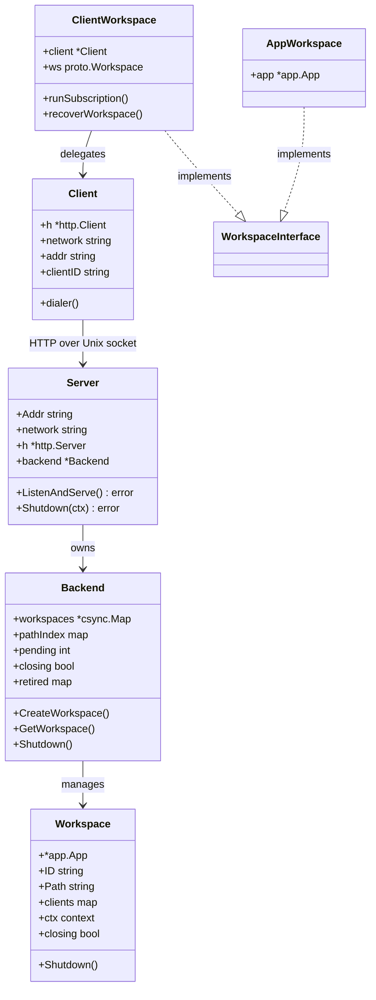

[上一篇：15-TUI终端界面](15-TUI终端界面.md) · [总目录](README.md) · [下一篇：17-错误处理与恢复](17-错误处理与恢复.md)

# 客户端服务器架构

> **场景**：理解 Crush 的客户端-服务器架构如何将 TUI 前端与后端业务逻辑分离，包括 Unix 域套接字传输、HTTP REST API 设计、SSE 事件流推送、Workspace 生命周期管理、客户端引用计数与优雅关闭、以及本地/远程两种 Workspace 实现的统一抽象。
> **时间**：2026-08-27 (CST)
> **版本**：Crush @ main branch, Go 1.26.6

## 本文件内容

1. [架构概览](#1-架构概览)
2. [传输层：Unix 域套接字与命名管道](#2-传输层unix-域套接字与命名管道)
3. [HTTP 服务器与路由](#3-http-服务器与路由)
4. [中间件链：日志与 Panic 恢复](#4-中间件链日志与-panic-恢复)
5. [Backend：传输无关的业务逻辑层](#5-backend传输无关的业务逻辑层)
6. [Workspace 生命周期与引用计数](#6-workspace-生命周期与引用计数)
7. [SSE 事件流与事件转换](#7-sse-事件流与事件转换)
8. [Agent 运行的分离与终端事件保证](#8-agent-运行的分离与终端事件保证)
9. [客户端 SDK：HTTP 封装与拨号](#9-客户端-sdkhttp-封装与拨号)
10. [Workspace 接口：本地与远程统一抽象](#10-workspace-接口本地与远程统一抽象)
11. [客户端重连与工作区恢复](#11-客户端重连与工作区恢复)
12. [空闲关闭与优雅退出](#12-空闲关闭与优雅退出)

## 1. 架构概览

```
┌─────────────────────────────────────────────────────────────┐
│ TUI 进程 (客户端)                                            │
│                                                             │
│  ┌─────────────┐    ┌──────────────────────────────────┐    │
│  │ Bubble Tea   │    │ ClientWorkspace                  │    │
│  │ Update/View  │◄───│ (workspace.Workspace 接口实现)    │    │
│  │              │    │                                  │    │
│  │              │    │ runSubscription() ──► SSE 事件   │    │
│  │              │    │ AgentRun() ──► HTTP POST /agent  │    │
│  │              │    │ ListSessions() ──► HTTP GET      │    │
│  └─────────────┘    └──────────┬───────────────────────┘    │
│                               │                             │
│  ┌────────────────────────────┐│                             │
│  │ client.Client (HTTP SDK)   ││                             │
│  │ dialer() → Unix socket     ││                             │
│  └────────────┬───────────────┘│                             │
└───────────────┼─────────────────┘
                │  Unix domain socket / Named pipe / TCP
                │  (crush-<uid>.sock)
┌───────────────┼─────────────────────────────────────────────┐
│ 服务器进程    │                                               │
│               ▼                                               │
│  ┌────────────────────────────────────────────────────────┐  │
│  │ Server (internal/server/)                              │  │
│  │  listen() → net.Listener                               │  │
│  │  recoverHandler → loggingHandler → mux                 │  │
│  │  controllerV1 (70+ HTTP handler)                       │  │
│  └──────────────────────┬─────────────────────────────────┘  │
│                         │                                     │
│  ┌──────────────────────▼─────────────────────────────────┐  │
│  │ Backend (internal/backend/)                            │  │
│  │  workspaces: csync.Map[string, *Workspace]             │  │
│  │  pathIndex: map[string]string (路径去重)                │  │
│  │  pending / closing / retired / shutdownTimer           │  │
│  └──────────────────────┬─────────────────────────────────┘  │
│                         │                                     │
│  ┌──────────────────────▼─────────────────────────────────┐  │
│  │ Workspace (backend.Workspace)                          │  │
│  │  *app.App (Sessions/Messages/Permissions/...)          │  │
│  │  clients: map[string]*clientState (引用计数)            │  │
│  │  ctx/cancel (工作区级 context)                          │  │
│  │  runMu/closing/runWG (agent 运行门控)                   │  │
│  └────────────────────────────────────────────────────────┘  │
└──────────────────────────────────────────────────────────────┘
```



## 2. 传输层：Unix 域套接字与命名管道

### DefaultHost

```
internal/server/server.go
函数：DefaultHost
偏移：+0 ～ +14
```

默认服务器地址的确定逻辑：

1. 套接字文件名：`crush.sock`，如果能获取 UID 则为 `crush-<uid>.sock`
2. Windows：返回 `npipe:////./pipe/<sock>`（命名管道）
3. Unix：路径为 `socketDir()/crush-<uid>.sock`
4. 如果路径超过 `maxUnixSocketPathLen`（104 字节，macOS sun_path 限制），回退到 `/tmp/crush-<uid>.sock`
5. 返回 `unix://<path>`

### socketDir

```
函数：socketDir
偏移：+0 ～ +5
```

优先使用 `$XDG_RUNTIME_DIR`（Linux systemd 用户运行时目录），否则回退到 `os.TempDir()`（macOS 上为用户私有 `$TMPDIR`，Linux 上为 `/tmp`）。

### ParseHostURL

```
函数：ParseHostURL
偏移：+0 ～ +20
```

将 `proto://addr` 格式解析为 `url.URL`。支持 `tcp://host:port/path`、`unix://path`、`npipe://path` 三种协议。

### listen（Unix 平台）

```
internal/server/net_other.go
函数：listen
偏移：+0 ～ +30
```

Unix 域套接字的自动修复绑定：

1. 如果 `network == "unix"` 且路径已存在：
   - 以 200ms 超时尝试 `net.DialTimeout` 探测
   - 探测成功 → 活服务器拥有该套接字，继续 `net.Listen`（会返回 "address already in use"）
   - 探测失败且 `isStaleSocketErr` → `os.Remove` 删除残留套接字文件
   - 探测失败且非 stale → 返回探测错误
2. 执行 `net.Listen(network, address)`
3. 返回 listener 和 `removedStale` 标志

### listen（Windows 平台）

```
internal/server/net_windows.go
函数：listen
偏移：+0 ～ +20
```

Windows 无 Unix 套接字修复逻辑。`npipe` 网络类型使用 `winio.ListenPipe`，配置 `MessageMode: true`、64KB 输入/输出缓冲区。其他网络类型直接 `net.Listen`。

### IsStaleSocketErr

```
internal/server/socket_classify.go
函数：IsStaleSocketErr
偏移：+0 ～ +10
```

判断错误是否表示残留套接字：排除 `net.Error` 超时类型，匹配 `syscall.ECONNREFUSED` 或 `fs.ErrNotExist`。跨平台兼容。

## 3. HTTP 服务器与路由

### Server 结构

```
internal/server/server.go
Struct：Server
字段：Addr    → string
字段：network → string
字段：h       → *http.Server
字段：ln      → net.Listener
字段：backend → *backend.Backend
字段：logger  → *slog.Logger
```

### NewServer

```
函数：NewServer
偏移：+0 ～ +20
```

创建服务器实例：

1. 设置 `Addr` 和 `network`
2. 创建 `backend.New(ctx, cfg, shutdownFn)` — 传入关闭回调，当最后一个工作区被移除时触发服务器关闭
3. 调用 `s.installHandler()` 安装路由
4. TCP 模式下设置 `s.h.Addr = address`

### installHandler

```
函数：installHandler
偏移：+0 ～ +80
```

构建完整的 HTTP 路由表：

1. 配置协议：`SetHTTP1(true)` + `SetUnencryptedHTTP2(true)`（h2c，明文 HTTP/2）
2. 创建 `controllerV1{backend, server}`
3. 注册 70+ 个路由处理器，按功能分组：

**系统级路由**：
- `GET /v1/health` — 健康检查
- `GET /v1/version` — 服务器版本信息
- `GET /v1/config` — 全局配置
- `POST /v1/control` — 服务器控制（shutdown / shutdown_if_idle）
- `DELETE /v1/clients/{client_id}` — 客户端退役

**Workspace 路由**：
- `GET /v1/workspaces` — 列出所有工作区
- `POST /v1/workspaces` — 创建工作区
- `GET /v1/workspaces/{id}` — 获取工作区详情
- `DELETE /v1/workspaces/{id}` — 删除工作区
- `POST /v1/workspaces/{id}/current-session` — 设置当前会话
- `GET /v1/workspaces/{id}/config` — 工作区配置
- `GET /v1/workspaces/{id}/events` — SSE 事件流
- `GET /v1/workspaces/{id}/providers` — 可用 LLM 提供商

**Session 路由**：
- `GET /v1/workspaces/{id}/sessions` — 列出会话
- `POST /v1/workspaces/{id}/sessions` — 创建会话
- `GET /v1/workspaces/{id}/sessions/{sid}` — 获取会话
- `PUT /v1/workspaces/{id}/sessions/{sid}` — 更新会话
- `DELETE /v1/workspaces/{id}/sessions/{sid}` — 删除会话
- `GET /v1/workspaces/{id}/sessions/{sid}/history` — 会话历史
- `GET /v1/workspaces/{id}/sessions/{sid}/messages` — 会话消息

**Agent 路由**：
- `GET /v1/workspaces/{id}/agent` — Agent 信息
- `POST /v1/workspaces/{id}/agent` — 发送消息（202 Accepted）
- `POST /v1/workspaces/{id}/agent/init` — 初始化 Agent
- `POST /v1/workspaces/{id}/agent/update` — 更新 Agent 模型
- `POST /v1/workspaces/{id}/agent/sessions/{sid}/cancel` — 取消会话
- `POST /v1/workspaces/{id}/agent/sessions/{sid}/summarize` — 摘要会话
- `POST /v1/workspaces/{id}/agent/sessions/{sid}/shell` — 执行 Shell 命令

**LSP 路由**：
- `GET /v1/workspaces/{id}/lsps` — LSP 客户端状态
- `GET /v1/workspaces/{id}/lsps/{lsp}/diagnostics` — 诊断信息
- `POST /v1/workspaces/{id}/lsps/start` — 启动 LSP
- `POST /v1/workspaces/{id}/lsps/stop` — 停止所有 LSP

**权限路由**：
- `GET /v1/workspaces/{id}/permissions/skip` — 获取跳过状态
- `POST /v1/workspaces/{id}/permissions/skip` — 设置跳过
- `POST /v1/workspaces/{id}/permissions/grant` — 授权/拒绝

**MCP 路由**：
- `GET /v1/workspaces/{id}/mcp/states` — MCP 客户端状态
- `GET /v1/workspaces/{id}/mcp/pending-auth` — 待认证 MCP
- `GET /v1/workspaces/{id}/mcp/auth-url` — OAuth URL
- `POST /v1/workspaces/{id}/mcp/auth` — 执行 OAuth 认证
- `POST /v1/workspaces/{id}/mcp/refresh-tools` — 刷新工具
- `POST /v1/workspaces/{id}/mcp/docker/enable` — 启用 Docker MCP
- `POST /v1/workspaces/{id}/mcp/docker/disable` — 禁用 Docker MCP

**Skills 路由**：
- `GET /v1/workspaces/{id}/skills` — 技能列表
- `POST /v1/workspaces/{id}/skills/read` — 读取技能内容

**配置路由**：
- `POST /v1/workspaces/{id}/config/set` — 设置配置字段
- `POST /v1/workspaces/{id}/config/remove` — 删除配置字段
- `POST /v1/workspaces/{id}/config/model` — 更新模型
- `POST /v1/workspaces/{id}/config/compact` — 设置紧凑模式
- `POST /v1/workspaces/{id}/config/provider-key` — 设置 API Key
- `POST /v1/workspaces/{id}/config/import-copilot` — 导入 Copilot
- `POST /v1/workspaces/{id}/config/refresh-oauth` — 刷新 OAuth

4. Swagger 文档：`/v1/docs/` → `httpswagger.WrapHandler`
5. 组装中间件：`s.recoverHandler(s.loggingHandler(mux))`

### 错误映射

```
函数：handleError
偏移：+0 ～ +35
```

后端错误到 HTTP 状态码的映射：

| 错误 | HTTP 状态码 | 说明 |
|------|------------|------|
| `ErrWorkspaceNotFound` | 404 | 工作区不存在 |
| `ErrLSPClientNotFound` | 404 | LSP 客户端不存在 |
| `ErrAgentNotInitialized` | 400 | Agent 未初始化 |
| `ErrPathRequired` | 400 | 路径必填 |
| `ErrInvalidPermissionAction` | 400 | 无效权限操作 |
| `ErrUnknownCommand` | 400 | 未知命令 |
| `ErrInvalidClientID` | 400 | 无效客户端 ID |
| `ErrClientNotAttached` | 409 | 客户端未附加（非 404：工作区存在但无活动流） |
| `ErrWorkspaceClosing` | 409 | 工作区正在关闭 |
| `ErrServerNotIdle` | 409 | 服务器非空闲 |
| `ErrClientRetired` | 409 | 客户端已退役 |
| `ErrServerShuttingDown` | 503 | 服务器正在关闭（非 409：请求没错，进程正在离开） |

## 4. 中间件链：日志与 Panic 恢复

### recoverHandler

```
internal/server/recover.go
函数：recoverHandler
偏移：+0 ～ +22
```

Panic 恢复中间件：

1. 包装 `http.ResponseWriter` 为 `recoverResponseWriter`（跟踪是否已写入响应头）
2. `defer recover()` 捕获 panic
3. `http.ErrAbortHandler` 重新 panic（保留标准库约定）
4. 其他 panic：记录日志 + 堆栈跟踪
5. 如果响应未开始（`!rrw.wroteHeader`），写入 500 JSON 错误
6. 如果响应已开始，连接被静默关闭（无法再写入状态码）

### loggingHandler

```
internal/server/logging.go
函数：loggingHandler
偏移：+0 ～ +30
```

请求日志中间件：

1. 记录请求开始：method、path、remote_addr、user_agent
2. 包装 `ResponseWriter` 为 `loggingResponseWriter`（捕获状态码）
3. 请求完成后记录：method、path、status、duration、remote_addr、user_agent
4. 仅在 `s.logger != nil` 时启用

### 中间件顺序

```
s.h.Handler = s.recoverHandler(s.loggingHandler(mux))
```

执行顺序（外到内）：recover → logging → mux。即 logging 在 recover 内部，logging 中的 panic 被 recover 捕获。

## 5. Backend：传输无关的业务逻辑层

### Backend 结构

```
internal/backend/backend.go
Struct：Backend
字段：workspaces   → *csync.Map[string, *Workspace]
字段：pathIndex    → map[string]string  (解析后路径 → 工作区 ID)
字段：pending      → int                 (进行中的创建计数)
字段：shutdownTimer → *time.Timer        (空闲关闭定时器)
字段：closing      → bool                (关闭锁存)
字段：retired      → map[string]struct{}  (已退役客户端 ID)
字段：mu           → sync.Mutex
字段：cfg          → *config.ConfigStore
字段：ctx          → context.Context
字段：shutdownFn   → ShutdownFunc
字段：createGrace  → time.Duration       (创建宽限期，默认 30s)
字段：lingerDelay  → time.Duration       (空闲延迟，默认 60s)
字段：detachGrace  → time.Duration       (分离宽限期，默认 10s)
```

### 锁顺序约定

```
// Locking order: when both Backend.mu and Workspace.clientsMu are
// held at once, Backend.mu is acquired first.
```

锁顺序：`Backend.mu` → `Workspace.clientsMu`。`CreateWorkspace` 持有 `Backend.mu` 调用 `registerClient`（获取 `Workspace.clientsMu`），`teardown` 先短暂持 `Workspace.clientsMu` 再释放，然后获取 `Backend.mu` 重新检查。这避免了 AB/BA 死锁。

### 关键错误

```
Var：ErrWorkspaceNotFound
Var：ErrLSPClientNotFound
Var：ErrAgentNotInitialized
Var：ErrPathRequired
Var：ErrInvalidPermissionAction
Var：ErrUnknownCommand
Var：ErrInvalidClientID
Var：ErrClientNotAttached
Var：ErrWorkspaceClosing
Var：ErrServerShuttingDown
Var：ErrServerNotIdle
Var：ErrClientRetired
Var：ErrChannelOptInMismatch
```

### Backend.New

```
函数：New
偏移：+0 ～ +12
```

创建 Backend 实例，初始化 `workspaces`、`pathIndex`、`retired`，设置默认超时参数。空闲延迟和分离宽限期可通过环境变量覆盖：

- `CRUSH_SERVER_IDLE_TIMEOUT` — 空闲关闭延迟（秒，0 = 立即关闭）
- `CRUSH_SERVER_DETACH_GRACE` — 分离宽限期（秒，0 = 立即拆卸）

### 环境变量解析

```
函数：durationFromEnv
偏移：+0 ～ +8
```

读取环境变量中的整数值（秒），解析失败或未设置时使用默认值。零值有意义（表示禁用延迟），被接受。

## 6. Workspace 生命周期与引用计数

### Workspace 结构

```
Struct：Workspace
字段：*app.App                           (嵌入的 App 服务集合)
字段：ID          → string               (UUID)
字段：Path        → string               (工作区路径)
字段：Cfg         → *config.ConfigStore
字段：Env         → []string
字段：Skills      → *skills.Manager
字段：resolvedPath → string              (符号链接解析后的路径，去重键)
字段：ctx         → context.Context      (工作区级 context)
字段：cancel      → context.CancelFunc
字段：runMu       → sync.Mutex
字段：closing     → bool
字段：runWG       → sync.WaitGroup       (跟踪已派发的 agent goroutine)
字段：clientsMu   → sync.Mutex
字段：clients     → map[string]*clientState
字段：shutdownFn  → func()               (可覆盖的关闭函数)
```

### clientState

```
Struct：clientState
字段：streams          → int     (活动 SSE 流数量)
字段：holdTimer        → *time.Timer (创建/分离宽限定时器)
字段：currentSessionID → string  (客户端当前查看的会话)
字段：released         → bool    (是否已显式释放)
```

`streams` 和 `holdTimer` 互斥：SSE 流附加时停止 holdTimer，holdTimer 存在时 streams 为 0。两者都为零/nil 表示条目已释放应被移除。

### CreateWorkspace

```
函数：CreateWorkspace
偏移：+0 ～ +170
```

工作区创建的完整流程，含路径去重和并发安全：

1. **参数验证**：`args.Path` 非空，`args.ClientID` 为有效 UUID
2. **路径解析**：`resolveWorkspaceKey(args.Path)` — `filepath.Abs` + `filepath.EvalSymlinks`（失败回退到清理后的绝对路径）
3. **加锁检查**（`b.mu`）：
   - `admitLocked(clientID)` — 检查服务器是否正在关闭、客户端是否已退役
   - `cancelShutdownLocked()` — 取消待执行的空闲关闭
   - 检查 `pathIndex[key]` — 如果路径已有工作区（first-wins 语义）：
     - 检查 Channel 配置一致性（不一致返回 `ErrChannelOptInMismatch`）
     - `logFirstWinsMismatch` 记录参数差异
     - `registerClient(ws, clientID)` — 注册客户端引用
     - 返回已有工作区
4. **标记 pending**：`b.pending++`（防止 teardown 在慢初始化期间关闭服务器）
5. **释放锁执行慢初始化**：
   - `config.Init(path, dataDir, debug)` — 初始化配置
   - 设置 YOLO 和 Channels 覆盖
   - `createDotCrushDir` — 创建数据目录（权限 0o700，含 `.gitignore` 写入 `*\n`）
   - `db.Connect` — 连接 SQLite（带 DataDir 锁）
   - `skills.DiscoverFromConfig` — 技能发现（不启用 `WithGlobalMirror`，因为后端管理多工作区）
   - `app.New` — 创建 App 实例
6. **重新加锁**（`b.mu`）：
   - 再次 `admitLocked`（客户端可能在慢初始化期间退役）
   - 再次检查 `pathIndex`（并发创建可能已赢）
   - 如果并发赢了：注册客户端到已有工作区，调用新工作区的 `invokeShutdown` 清理
   - 否则：注册到 `b.workspaces` 和 `b.pathIndex`，`registerClient`
7. **版本检查**：客户端版本与服务器版本不一致时发出警告事件
8. **deferred pending decrement**：`b.pending--`，如果创建失败且无其他工作区，可能触发空闲关闭

### registerClient

```
函数：registerClient
偏移：+0 ～ +14
```

注册客户端引用（幂等）：

- 新客户端：创建 `clientState` + 启动 `createGrace` 定时器（30 秒）
- 已有客户端且有 holdTimer：停止旧定时器，创建新的 `clientState`（防止旧已触发定时器的竞态）
- 已有客户端且无 holdTimer（有活动流）：重置 `released = false`，无需操作

### AttachClient

```
函数：AttachClient
偏移：+0 ～ +20
```

SSE 流附加时注册客户端：

1. 在 `b.mu` 下查找工作区（防止与 teardown 竞态）
2. 在 `ws.clientsMu` 下操作 `clientState`
3. 停止 holdTimer（如果有），`streams++`

### DetachClient

```
函数：DetachClient
偏移：+0 ～ +3
```

SSE 流断开时释放引用，委托给 `detachStream`。

### detachStream

```
函数：detachStream
偏移：+0 ～ +30
```

流分离逻辑：

1. `streams--`
2. 如果 `streams == 0` 且无 holdTimer：
   - 如果 `detachGrace > 0` 且未显式释放（`!cs.released`）：启动 `detachGrace` 定时器（10 秒），给重连窗口
   - 否则：直接删除 `clientState`，如果 `len(clients) == 0` 则触发 `teardown`

### expireHold

```
函数：expireHold
偏移：+0 ～ +14
```

宽限定时器到期回调：

1. 验证 `clientState` 仍然指向当前定时器（`cs != timer` 防止已替换的旧定时器）
2. `cs.streams > 0` 时不执行（客户端已重新附加）
3. 删除 `clientState`，如果 `len(clients) == 0` 则触发 `teardown`

### RetireClient

```
函数：RetireClient
偏移：+0 ～ +30
```

客户端退役（权威退出信号）：

1. 在 `b.retired` 中记录客户端 ID（永不清理——防止在途创建请求留下孤儿工作区）
2. 遍历所有工作区，删除该客户端的 `clientState`
3. 如果工作区的 `clients` 变空，加入 `orphaned` 列表
4. 释放 `b.mu` 后对每个 orphaned 工作区执行 `teardown`

### teardown

```
函数：teardown
偏移：+0 ～ +30
```

工作区拆卸（安全并发）：

1. 加 `b.mu`，再加 `ws.clientsMu`，重新检查 `len(ws.clients) > 0`（防止与并发 CreateWorkspace 竞态）
2. 如果有客户端：中止拆卸
3. 从 `pathIndex` 和 `workspaces` 中移除
4. `scheduleShutdownIfIdleLocked` — 决定是否触发服务器关闭
5. 释放 `b.mu`，执行 `ws.invokeShutdown()`（停止 agent、取消 context、等待 goroutine、清理 App）

### Workspace.Shutdown

```
函数：Shutdown
偏移：+0 ～ +15
```

安全关闭顺序：

1. 设置 `closing = true`（阻止新 agent 运行）
2. `w.cancel()`（取消工作区 context）
3. `w.AgentCoordinator.CancelAll()`（取消已注册的 per-session cancel）
4. `w.runWG.Wait()`（等待已派发的 agent goroutine 返回）
5. `w.App.Shutdown()`（DB、LSP 等资源清理）

关键保证：cancel → CancelAll → runWG.Wait 在 DB 清理之前完成。

## 7. SSE 事件流与事件转换

### handleGetWorkspaceEvents

```
internal/server/proto.go
函数：handleGetWorkspaceEvents
偏移：+0 ～ +55
```

SSE 事件流处理器：

1. **先订阅后附加**：`SubscribeEvents` 在 `AttachClient` 之前调用——确保客户端附加后不会丢失事件
2. `AttachClient(id, clientID)` — 注册 SSE 流引用
3. `defer DetachClient(id, clientID)` — 确保最终释放
4. 设置 SSE 头：`Content-Type: text/event-stream`、`Cache-Control: no-cache`、`Connection: keep-alive`
5. `w.WriteHeader(200)` + `Flusher.Flush()` — 立即推送响应头（避免静默工作区阻塞客户端的 RoundTrip）
6. 事件循环：
   - `r.Context().Done()` → 客户端断开，返回
   - `ev := <-events` → 接收事件
   - `wrapEvent(ev.Payload)` → 转换为 `pubsub.Payload`
   - `json.Marshal` → 序列化
   - `fmt.Fprintf(w, "data: %s\n\n", data)` + `Flush()` — 推送 SSE 数据

### wrapEvent

```
internal/server/events.go
函数：wrapEvent
偏移：+0 ～ +170
```

将内部 `tea.Msg` 事件转换为 `pubsub.Payload` 信封，带正确的 `PayloadType` 鉴别器和 proto 类型的内部负载。

支持的事件类型：

| 内部类型 | PayloadType | proto 类型 |
|----------|-------------|------------|
| `pubsub.Event[app.LSPEvent]` | `PayloadTypeLSPEvent` | `proto.LSPEvent` |
| `pubsub.Event[mcp.Event]` | `PayloadTypeMCPEvent` | `proto.MCPEvent` |
| `pubsub.Event[permission.PermissionRequest]` | `PayloadTypePermissionRequest` | `proto.PermissionRequest` |
| `pubsub.Event[permission.PermissionNotification]` | `PayloadTypePermissionNotification` | `proto.PermissionNotification` |
| `pubsub.Event[question.Request]` | `PayloadTypeQuestionRequest` | `proto.QuestionRequest` |
| `pubsub.Event[question.Notification]` | `PayloadTypeQuestionNotification` | `proto.QuestionNotification` |
| `pubsub.Event[message.Message]` | `PayloadTypeMessage` | `proto.Message` |
| `pubsub.Event[session.Session]` | `PayloadTypeSession` | `proto.Session` |
| `pubsub.Event[history.File]` | `PayloadTypeFile` | `proto.File` |
| `pubsub.Event[notify.Notification]` | `PayloadTypeAgentEvent` | `proto.AgentEvent` |
| `pubsub.Event[notify.RunComplete]` | `PayloadTypeRunComplete` | `proto.RunComplete` |
| `pubsub.Event[proto.ConfigChanged]` | `PayloadTypeConfigChanged` | 直通 |
| `app.UpdateAvailableMsg` | `PayloadTypeUpdateAvailable` | `proto.UpdateAvailable` |
| `pubsub.Event[skills.Event]` | `PayloadTypeSkillsEvent` | `proto.SkillsEvent` |

不支持的 MCP 事件类型（如 `EventChannelMessage`）被丢弃而非强制转换。

### messageToProto

```
函数：messageToProto
偏移：+0 ～ +60
```

将 `message.Message` 转换为 `proto.Message`，包括所有消息部分的类型映射：`TextContent`、`ReasoningContent`、`ToolCall`、`ToolResult`、`Finish`、`ImageURLContent`、`BinaryContent`、`ShellCommand`。

### 事件源：App.setupEvents

```
internal/app/app.go
函数：setupEvents
偏移：+0 ～ +25
```

App 内部的事件扇入系统——将多个服务的事件流汇聚到统一的 `app.events` broker：

1. 每个 `setupSubscriber` 启动一个 goroutine，订阅服务事件并转发到 `app.events`
2. `setupSubscriberMustDeliver` 用于不可丢失的终端事件（权限、问题、RunComplete）
3. 订阅源列表：sessions、messages、permissions、permission-notifications、question-batches、question-notifications、history、agent-notifications、run-completions、mcp、lsp、skills

### isSessionBusy / attachedClients

```
internal/server/events.go
函数：isSessionBusy
偏移：+0 ～ +6

函数：attachedClients
偏移：+0 ～ +5
```

`isSessionBusy` 检查工作区是否有指定会话的进行中 agent 运行。`attachedClients` 返回当前查看指定会话的客户端数量（仅计算 `streams > 0` 的客户端）。两者容忍 nil workspace。

## 8. Agent 运行的分离与终端事件保证

### SendMessage

```
internal/backend/agent.go
函数：SendMessage
偏移：+0 ～ +30
```

Agent 消息发送（fire-and-forget 模式）：

1. 查找工作区，检查 `AgentCoordinator` 是否已初始化
2. `agent.ValidateCall` — 结构验证（`ErrEmptyPrompt`、`ErrSessionMissing`）
3. `ws.AgentCoordinator.BeginAccepted(msg.SessionID)` — 创建接受运行
4. 在 `runMu` 下检查 `closing`，如果正在关闭则关闭 accept 并返回 `ErrWorkspaceClosing`
5. `ws.runWG.Add(1)` — 注册 goroutine
6. `go b.runAgent(ws, msg, accept)` — 异步执行
7. 立即返回 nil（HTTP 处理器返回 202 Accepted）

关键设计：运行的生命周期独立于客户端的 HTTP 请求。客户端断开 TCP 连接不会终止已派发的运行。

### runAgent

```
函数：runAgent
偏移：+0 ～ +35
```

异步 agent 运行执行体：

1. `defer ws.runWG.Done()` + `defer accept.Close()`
2. 构建运行 context：`ws.ctx` + `WithRunID` + `WithRunCompleteMarker`
3. `ws.AgentCoordinator.RunAccepted(ctx, accept, sessionID, prompt, attachments...)`
4. 成功或 `context.Canceled`：直接返回（sessionAgent.Run 已发布取消标记）
5. 其他错误：
   - 发布 `notify.TypeAgentError` 通知到 `AgentNotifications` broker（lossy）
   - 如果 `msg.RunID` 非空且 coordinator 未已发布终端 `RunComplete`：
     - `RunCompletions().PublishMustDeliver` — 在 must-deliver broker 上发布错误终端事件
     - 确保 `crush run` 调用者不会因 lossy 事件丢失而挂起

### RunComplete 机制

```
Workspace.RunCompletions() → *pubsub.Broker[notify.RunComplete]
```

`RunCompletions` broker 使用 `PublishMustDeliver`，确保终端事件可靠投递。这弥补了 `AgentNotifications` 的 lossy 特性。`agent.RunCompletePublished(ctx)` 检查 coordinator 是否已发布终端事件，避免重复。

### CancelSession

```
函数：CancelSession
偏移：+0 ～ +10
```

取消指定会话的 agent 操作——调用 `ws.AgentCoordinator.Cancel(sessionID)`。这是唯一能终止已派发运行的方式（客户端断开连接不能）。

## 9. 客户端 SDK：HTTP 封装与拨号

### Client 结构

```
internal/client/client.go
Struct：Client
字段：h        → *http.Client
字段：path     → string
字段：network  → string
字段：addr     → string
字段：clientID → string (UUID, 每进程生成)
```

### NewClient

```
函数：NewClient
偏移：+0 ～ +20
```

创建客户端 SDK：

1. `filepath.Clean(path)` — 清理工作区路径
2. `uuid.New().String()` — 生成唯一客户端 ID
3. 配置 HTTP Transport：
   - `SetHTTP1(true)` + `SetUnencryptedHTTP2(true)` — h2c 支持
   - `tr.DialContext = c.dialer` — 自定义拨号器
   - Unix socket / npipe 模式禁用压缩
4. `http.Client{Transport: tr, Timeout: 0}` — 无超时（SSE 需要长连接）

### dialer

```
函数：dialer
偏移：+0 ～ +15
```

根据网络类型选择拨号方式：

- `npipe`：`dialPipeContext`（Windows 命名管道，30 秒超时）
- `unix`：`net.Dialer.DialContext(ctx, "unix", c.addr)`（Unix 域套接字）
- 其他：`net.Dialer.DialContext(ctx, network, address)`（TCP）

### HTTP 请求构建

```
函数：buildReq
偏移：+0 ～ +20
```

构建 HTTP 请求时的特殊处理：

- `r.URL.Scheme = "http"` + `r.URL.Host = c.addr` — 满足 HTTP 客户端的 URL 要求
- Unix socket / npipe 模式：`r.Host = DummyHost`（`api.crush.localhost`）— 虚拟主机名
- 有 body 且无 Content-Type 时设置 `text/plain`

### 请求方法封装

```
函数：get / post / delete / put
偏移：+0 ～ +2 each
```

所有请求通过 `sendReq` 统一发送，路径前缀 `/v1/`。

### 关键客户端 API

```
函数：Health
偏移：+0 ～ +8
函数：ShutdownServerIfIdle
偏移：+0 ～ +20
函数：RetireClient
偏移：+0 ～ +12
```

`ShutdownServerIfIdle` 发送 `ServerControlShutdownIfIdle` 命令——服务器仅在空闲时关闭。409 返回 `ErrServerBusy`，400 返回 `ErrUnsupported`（旧服务器不支持该命令）。

`RetireClient` 调用 `DELETE /clients/{client_id}`——通知服务器客户端已退出，释放所有引用。旧服务器返回 404，映射为 `ErrUnsupported`。

## 10. Workspace 接口：本地与远程统一抽象

### Workspace 接口

```
internal/workspace/workspace.go
Interface：Workspace
方法：Sessions (Create/Get/List/Save/Delete)
方法：Messages (List/ListUser/ListAllUser)
方法：Agent (Run/Cancel/IsBusy/Model/QueuedPrompts/Summarize/Init)
方法：Permissions (Grant/GrantPersistent/Deny/SkipRequests)
方法：Questions (Answer/Cancel)
方法：FileTracker (RecordRead/LastReadTime/ListReadFiles)
方法：History (ListSessionHistory)
方法：LSP (Start/StopAll/GetStates/GetDiagnosticCounts)
方法：Config (read + mutations)
方法：Project (NeedsInit/MarkInit/InitPrompt)
方法：Skills (List/Read)
方法：MCP (States/Refresh/Read/Enable/Disable/Auth)
方法：Events (Subscribe)
方法：Shutdown()
```

### AppWorkspace（本地模式）

```
internal/workspace/app_workspace.go
Struct：AppWorkspace
字段：app   → *app.App
字段：store → *config.ConfigStore
```

直接委托到进程内的 `app.App` 实例。`SetCurrentSession` 调用 `app.ReportCurrentSession`（仅用于 herdr，多客户端存在性跟踪在单客户端本地模式下无意义）。`Subscribe` 直接订阅 `app.Events`。

### ClientWorkspace（远程模式）

```
internal/workspace/client_workspace.go
Struct：ClientWorkspace
字段：client      → *client.Client
字段：mu          → sync.RWMutex
字段：ws          → proto.Workspace (缓存快照)
字段：skills      → *skills.Manager
字段：lastSession → string
字段：subCtx      → context.Context
字段：subCancel   → context.CancelFunc
字段：subStarted  → atomic.Bool
字段：subDone     → chan struct{}
字段：herdrClient → *herdr.Client
```

所有操作通过 `client.Client` 代理到远程服务器。缓存 `proto.Workspace` 快照，配置变更后通过 `refreshWorkspace` 刷新。

### NewClientWorkspace

```
函数：NewClientWorkspace
偏移：+0 ～ +15
```

1. `ws.Config.SetupAgents()` — 配置 agent 模型
2. `ws.Config.NormalizeOptions()` — 应用 TUI 选项默认值（Scrollbar、ExitBanner 等）
3. 将 proto 技能状态转换为 `skills.SkillState`，创建 `skills.Manager`（带 `WithGlobalMirror`，因为客户端进程只代表一个工作区）
4. 创建独立 context（`subCtx`/`subCancel`）用于订阅循环
5. 初始化 `herdr.Init()`

## 11. 客户端重连与工作区恢复

### runSubscription

```
函数：runSubscription
偏移：+0 ～ +70
```

SSE 事件流订阅与重连循环：

1. **指数退避参数**：初始 250ms，最大 10s
2. **降级状态管理**：`degraded` 标志跟踪连接状态，仅在状态变化时通知 UI
3. **订阅循环**：
   - `w.client.SubscribeEvents(subCtx, workspaceID)` — 尝试订阅
   - 成功：如果之前是 degraded 状态，调用 `afterReconnect` 通知恢复
   - 失败：
     - `ErrNotFound`（404）→ 服务器不再知道此工作区 → 调用 `recoverWorkspace` 重新注册
     - 其他错误 → 降级 + 退避重试
   - 事件流关闭 → `markDegraded(ErrStreamClosed)` + 退避重连
4. **升级机制**：连续 20 次恢复失败后标记 `Stuck = true`（UI 升级为持久错误），但循环不停止

### recoverWorkspace

```
函数：recoverWorkspace
偏移：+0 ～ +28
```

工作区恢复（重新注册）：

1. 创建独立 context（`WithoutCancel(subCtx)`）——服务器不会在请求连接断开时放弃创建
2. 30 秒超时（`recoveryCreateTimeout`）
3. `w.client.CreateWorkspace(ctx, recreateArgs())` — 从缓存快照重建
4. `created.Config.SetupAgents()` + `created.Config.NormalizeOptions()` — 配置 agent 模型并应用 TUI 选项默认值
5. 更新缓存的 `proto.Workspace`（新 ID）
6. 如果配置已就绪：`InitCoderAgent(subCtx)` — 重新初始化 agent

### recreateArgs

```
函数：recreateArgs
偏移：+0 ～ +10
```

从缓存快照推导创建请求参数——保留 Path、DataDir、Debug、YOLO、Channels、Env、Version，丢弃旧 ID。

### afterReconnect

```
函数：afterReconnect
偏移：+0 ～ +10
```

重连后恢复操作：

1. 重新声明当前会话（`SetCurrentSession`）——服务器的存在性记录可能已被重建
2. 发送 `ConnectionEvent{State: ConnectionRecovered}` 到 UI

### consumeEvents

```
函数：consumeEvents
偏移：+0 ～ +15
```

事件消费循环：

1. `herdr.Translate(ev)` — 转发给 herdr（如果在 herdr 面板中运行）
2. `pubsub.Event[proto.ConfigChanged]` → `refreshWorkspace()`（刷新缓存快照，内部调用 `updated.Config.SetupAgents()` + `updated.Config.NormalizeOptions()` 确保 TUI 选项默认值同步）
3. `translateEvent(ev)` — 将 proto 类型转换回 TUI 期望的域类型
4. `send(translated)` — 投递到 Bubble Tea 程序

### Shutdown

```
函数：Shutdown
偏移：+0 ～ +25
```

客户端工作区关闭顺序：

1. `subCancel()` — 停止重连/恢复循环
2. `awaitSubscription()` — 等待订阅循环结束（5 秒超时）
3. `herdrClient.Close()`
4. `client.RetireClient()` — 通知服务器退役，释放所有引用
5. 如果服务器不支持退役（`ErrUnsupported`）：回退到 `DeleteWorkspace`

### ConnectionEvent

```
internal/workspace/workspace.go
Struct：ConnectionEvent
字段：State → ConnectionState (Degraded / Recovered)
字段：Err   → error
字段：Stuck → bool
```

`ConnectionDegraded` 表示事件流断开或工作区丢失，正在重试。`ConnectionRecovered` 表示事件流已恢复。`Stuck` 标记多次恢复失败后的持久降级状态。本地工作区永不发出此事件。

## 12. 空闲关闭与优雅退出

### 三个时间常量

```
DefaultCreateGrace     = 30 * time.Second  — 创建后必须附加 SSE 的宽限期
DefaultIdleShutdownDelay = 60 * time.Second — 最后一个工作区释放后服务器存活时间
DefaultDetachGrace     = 10 * time.Second  — SSE 流断开后客户端引用的宽限期
```

### scheduleShutdownIfIdleLocked

```
函数：scheduleShutdownIfIdleLocked
偏移：+0 ～ +15
```

决定服务器是否应该关闭（在 `b.mu` 下调用）：

1. `shutdownFn == nil` → 不关闭
2. `workspaces.Len() != 0 || pending != 0` → 不空闲，不关闭
3. `lingerDelay <= 0` → 立即关闭：锁存 `closing = true`，返回 `true`
4. `lingerDelay > 0` → 延迟关闭：启动 `time.AfterFunc(lingerDelay, maybeShutdown)`，返回 `false`

### maybeShutdown

```
函数：maybeShutdown
偏移：+0 ～ +12
```

延迟关闭定时器回调：

1. 重新检查空闲状态（`workspaces.Len() == 0 && pending == 0`）
2. 如果空闲：锁存 `closing = true`，释放锁后调用 `shutdownFn`
3. 如果非空闲：不关闭（定时器已被创建时的 `cancelShutdownLocked` 取消）

### cancelShutdownLocked

```
函数：cancelShutdownLocked
偏移：+0 ～ +4
```

取消待执行的空闲关闭定时器——在 `CreateWorkspace` 时调用，确保新工作区不会遇到正在关闭的服务器。

### ShutdownIfIdle

```
函数：ShutdownIfIdle
偏移：+0 ～ +18
```

客户端请求的空闲关闭（`POST /v1/control` with `shutdown_if_idle`）：

1. 加锁检查 `workspaces.Len() == 0 && pending == 0`
2. 如果空闲：锁存 `closing = true`，调用 `shutdownFn`，返回 `true`
3. 如果非空闲：记录日志，返回 `false`

这是唯一允许客户端请求的关闭方式——客户端不能杀死其他活动会话。`closing` 锁存确保原子性：决定关闭后新创建请求被拒绝。

### 优雅关闭时序

```
客户端 A: DELETE /workspaces/{id}?client_id=A
    → releaseHold → releaseHoldLocked → teardown
    → scheduleShutdownIfIdleLocked → 启动 60s 定时器

客户端 B (60s 内): POST /workspaces
    → cancelShutdownLocked → 取消定时器
    → 正常创建工作区

(无新客户端, 60s 后):
    → maybeShutdown → 重新检查空闲
    → closing = true
    → shutdownFn() → Server.Shutdown(ctx)
    → Backend 关闭 → Server 关闭
```

### 版本不匹配处理

```
CreateWorkspace 中：
if args.Version != "" && args.Version != version.Version {
    slog.Warn("Client/server version mismatch", ...)
    appWorkspace.SendEvent(util.NewWarnMsg(...))
}
```

客户端创建工作区时如果版本不一致，服务器发出警告事件，通过 SSE 推送到客户端 UI。客户端可通过 `ShutdownServerIfIdle` 请求关闭旧版服务器，然后启动新版。

---

[上一篇：15-TUI终端界面](15-TUI终端界面.md) · [总目录](README.md) · [下一篇：17-错误处理与恢复](17-错误处理与恢复.md)