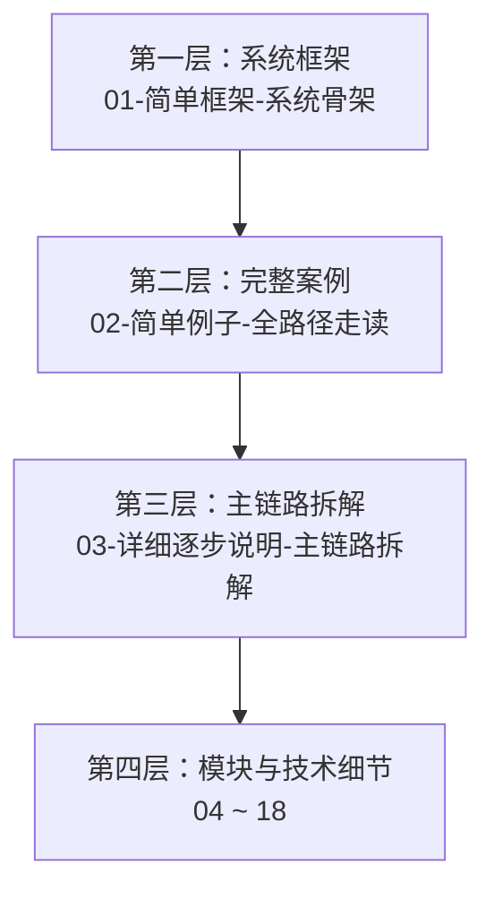

# Crush 源码阅读文档库

> **项目**：[Charm Crush](https://github.com/charmbracelet/crush) — 终端优先 AI 编程助手
> **版本**：main branch, Go 1.26.6
> **文档生成时间**：2026-08-27 (CST)

## 学习路径

## 文档目录

### 公共

| 文件 | 说明 |
|------|------|
| [00-文档风格指南](00-docs-style-guide.md) | 源码定位规范、图表规范、写作规则 |

### 第一层：简单框架

| 文件 | 说明 |
|------|------|
| [01-简单框架-系统骨架](01-简单框架-系统骨架.md) | 进程模型、核心模块、依赖关系、主数据流 |

### 第二层：简单例子走完全路径

| 文件 | 说明 |
|------|------|
| [02-简单例子-全路径走读](02-简单例子-全路径走读.md) | `crush run "Hello"` 从入口到输出的完整路径 |

### 第三层：详细逐步说明

| 文件 | 说明 |
|------|------|
| [03-详细逐步说明-主链路拆解](03-详细逐步说明-主链路拆解.md) | 逐跳展开调用关系、参数传递、状态变化 |

### 第四层：源码完整补齐

| 文件 | 说明 |
|------|------|
| [04-核心模块与类关系](04-核心模块与类关系.md) | 核心 Struct / Interface 关系图 |
| [05-Agent协调器与会话管理](05-Agent协调器与会话管理.md) | Coordinator / sessionAgent / Session 详解 |
| [06-工具系统详解](06-工具系统详解.md) | 内置工具、MCP 工具、权限检查 |
| [07-LLM提供商集成](07-LLM提供商集成.md) | 各 LLM Provider 适配层 |
| [08-配置系统](08-配置系统.md) | crush.json / crushrc / 热重载 |
| [09-数据库与持久化](09-数据库与持久化.md) | SQLite schema、migration、查询 |
| [10-LSP集成](10-LSP集成.md) | LSP 客户端管理、诊断、符号 |
| [11-MCP协议支持](11-MCP协议支持.md) | MCP 生命周期、传输、工具 |
| [12-Shell执行引擎](12-Shell执行引擎.md) | 内置 Bash、命令调度、后台作业 |
| [13-权限与安全](13-权限与安全.md) | 权限请求、自动批准、yolo 模式 |
| [14-Skills系统](14-Skills系统.md) | Skills 发现、激活、跟踪 |
| [15-TUI终端界面](15-TUI终端界面.md) | Bubble Tea 模型、视图、事件 |
| [16-客户端服务器架构](16-客户端服务器架构.md) | HTTP API、SSE、Workspace 管理 |
| [17-错误处理与恢复](17-错误处理与恢复.md) | 错误传播、重试、优雅关闭 |
| [18-构建与部署](18-构建与部署.md) | Go build、goreleaser、CI/CD |

## 推荐阅读顺序

1. 先读 [00-文档风格指南](00-docs-style-guide.md) 了解源码定位规则
2. 再读 [01-简单框架-系统骨架](01-简单框架-系统骨架.md) 建立全局视图
3. 跟随 [02-简单例子-全路径走读](02-简单例子-全路径走读.md) 走通一个完整场景
4. 深入 [03-详细逐步说明-主链路拆解](03-详细逐步说明-主链路拆解.md) 理解每一跳
5. 最后按需阅读第四层各模块文档

## 进度

- [x] 00-文档风格指南
- [x] 01-简单框架-系统骨架
- [x] 02-简单例子-全路径走读
- [x] 03-详细逐步说明-主链路拆解
- [x] 04-核心模块与类关系
- [x] 05-Agent协调器与会话管理
- [x] 06-工具系统详解
- [x] 07-LLM提供商集成
- [x] 08-配置系统
- [x] 09-数据库与持久化
- [x] 10-LSP集成
- [x] 11-MCP协议支持
- [x] 12-Shell执行引擎
- [x] 13-权限与安全
- [x] 14-Skills系统
- [x] 15-TUI终端界面
- [x] 16-客户端服务器架构
- [x] 17-错误处理与恢复
- [x] 18-构建与部署